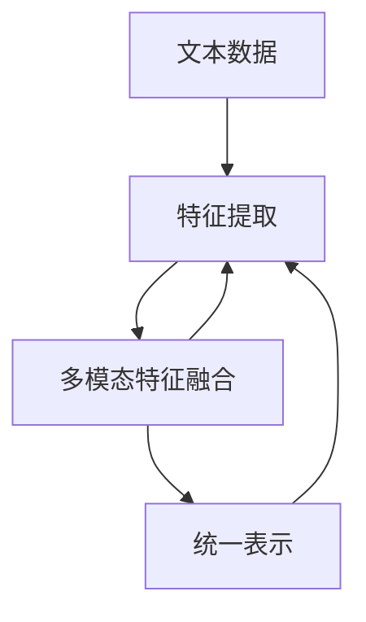
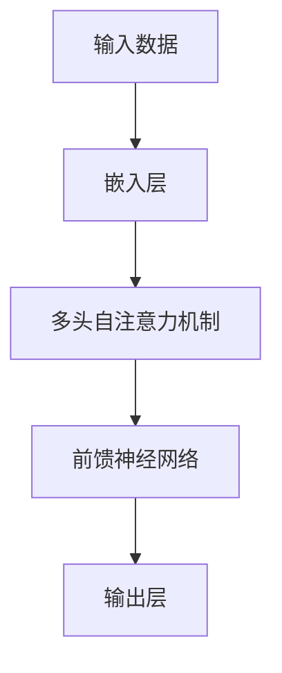
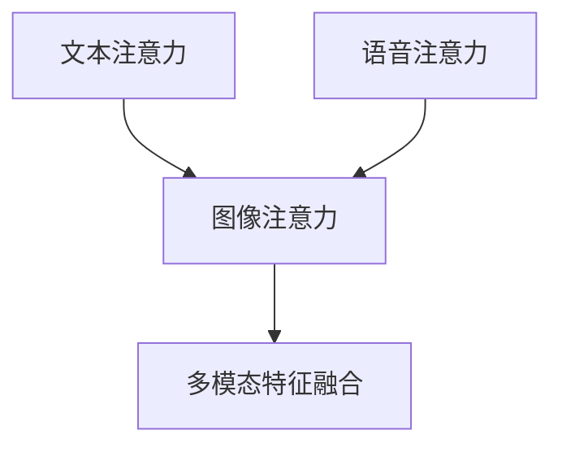

                 

关键词：多模态大模型、自然语言处理、技术原理、实战应用、里程碑

摘要：本文将深入探讨多模态大模型的技术原理与实战应用，分析其如何在自然语言处理领域取得里程碑式的突破。我们将从背景介绍、核心概念、算法原理、数学模型、项目实践等多个角度展开，旨在为读者提供一个全面的理解和多模态大模型的前沿应用。

## 1. 背景介绍

随着计算机技术的飞速发展，人工智能（AI）逐渐成为推动社会进步的重要力量。在AI的众多应用领域中，自然语言处理（NLP）尤为重要。NLP旨在使计算机能够理解和生成人类语言，实现人机交互。然而，传统的NLP方法往往局限于单一模态的数据处理，如文本、语音或图像。这限制了其在复杂任务中的性能。

近年来，多模态大模型的崛起为NLP带来了新的希望。多模态大模型能够整合多种类型的数据，如文本、语音、图像和视频，以实现更高级别的任务，如问答系统、图像描述生成、视频内容理解等。这种集成数据的方式不仅提升了模型的性能，还拓展了其应用范围。

本文将围绕多模态大模型的技术原理、实战应用和未来趋势进行深入探讨，旨在为读者提供一个全面而清晰的认识。

## 2. 核心概念与联系

### 2.1 多模态数据融合

多模态数据融合是构建多模态大模型的基础。它涉及将来自不同传感器的数据（如文本、图像、语音等）进行整合，以形成对信息的统一理解。

**流程图（使用Mermaid）**：



### 2.2 大模型结构

大模型通常采用深度神经网络结构，如Transformer、BERT等。这些模型通过大量的数据训练，可以捕捉复杂的模式和关系。

**流程图**：



### 2.3 多模态交互机制

多模态交互机制是关键，它决定了如何将不同类型的数据进行有效融合。常见的交互机制包括多模态注意力机制、多任务学习等。

**流程图**：



## 3. 核心算法原理 & 具体操作步骤

### 3.1 算法原理概述

多模态大模型的算法原理主要基于以下几个核心组件：

1. **特征提取**：从不同模态的数据中提取有用的特征。
2. **特征融合**：将提取的特征进行整合，形成统一的表示。
3. **模型训练**：通过大量数据训练模型，优化其参数。
4. **预测与评估**：利用训练好的模型进行预测，并评估其性能。

### 3.2 算法步骤详解

1. **数据预处理**：
   - **文本数据**：进行分词、词性标注等处理。
   - **图像数据**：进行图像增强、归一化等处理。
   - **语音数据**：进行声学特征提取。

2. **特征提取**：
   - **文本**：使用词嵌入技术，如Word2Vec、GloVe等。
   - **图像**：使用卷积神经网络（CNN）提取特征。
   - **语音**：使用循环神经网络（RNN）或变换器（Transformer）提取特征。

3. **特征融合**：
   - **多模态注意力机制**：根据数据之间的相关性，动态调整各模态的特征权重。
   - **多任务学习**：同时学习多个任务，共享模型参数。

4. **模型训练**：
   - **损失函数**：设计合适的损失函数，如交叉熵损失、均方误差等。
   - **优化算法**：使用梯度下降、Adam等优化算法训练模型。

5. **预测与评估**：
   - **预测**：输入新的数据，通过模型输出预测结果。
   - **评估**：使用准确率、F1值等指标评估模型性能。

### 3.3 算法优缺点

**优点**：
- **高效性**：通过整合多种模态数据，模型能够捕获更丰富的信息，提高任务性能。
- **灵活性**：支持多种模态的数据输入，适应不同的应用场景。

**缺点**：
- **计算复杂度**：多模态数据融合和深度神经网络训练需要大量计算资源。
- **数据依赖性**：模型的性能依赖于数据的质量和多样性。

### 3.4 算法应用领域

多模态大模型在多个领域展现了强大的应用潜力：

- **问答系统**：通过整合文本和图像数据，实现更准确的问答。
- **图像描述生成**：利用文本和图像数据进行描述生成。
- **视频内容理解**：结合文本、图像和语音数据进行视频内容理解。

## 4. 数学模型和公式 & 详细讲解 & 举例说明

### 4.1 数学模型构建

多模态大模型的数学模型主要包括以下几个部分：

1. **嵌入层**：将输入数据转换为固定长度的向量表示。
2. **特征提取层**：使用深度神经网络提取特征。
3. **融合层**：将不同模态的特征进行融合。
4. **输出层**：进行预测或分类。

### 4.2 公式推导过程

以Transformer为例，其数学模型主要包括以下几个公式：

1. **嵌入层**：

$$
\text{Embedding}(\text{x}) = \text{W}_\text{emb} \text{x} + \text{b}_\text{emb}
$$

其中，$\text{W}_\text{emb}$ 和 $\text{b}_\text{emb}$ 分别为权重和偏置。

2. **特征提取层**：

$$
\text{Feature}(\text{h}) = \text{F}(\text{h})
$$

其中，$\text{F}$ 为深度神经网络。

3. **融合层**：

$$
\text{Attention}(\text{h}, \text{v}) = \text{softmax}(\text{W}_\text{q} \text{h} + \text{W}_\text{v} \text{v} + \text{b})
$$

其中，$\text{W}_\text{q}$、$\text{W}_\text{v}$ 和 $\text{b}$ 分别为权重和偏置。

4. **输出层**：

$$
\text{Output}(\text{h}) = \text{W}_\text{out} \text{h} + \text{b}_\text{out}
$$

其中，$\text{W}_\text{out}$ 和 $\text{b}_\text{out}$ 分别为权重和偏置。

### 4.3 案例分析与讲解

以一个简单的图像描述生成任务为例，说明多模态大模型的应用。

1. **数据预处理**：
   - 文本数据：进行分词、词性标注等处理。
   - 图像数据：进行图像增强、归一化等处理。
   - 语音数据：进行声学特征提取。

2. **特征提取**：
   - 文本：使用BERT模型提取文本特征。
   - 图像：使用VGG16模型提取图像特征。
   - 语音：使用Tacotron模型提取语音特征。

3. **特征融合**：
   - 使用多模态注意力机制融合特征。

4. **模型训练**：
   - 设计合适的损失函数，如交叉熵损失。
   - 使用梯度下降优化模型参数。

5. **预测与评估**：
   - 输入新的图像和文本，生成图像描述。
   - 使用准确率、F1值等指标评估模型性能。

## 5. 项目实践：代码实例和详细解释说明

### 5.1 开发环境搭建

- 安装Python 3.8及以上版本。
- 安装TensorFlow 2.4及以上版本。
- 安装PyTorch 1.7及以上版本。

### 5.2 源代码详细实现

以下是一个简单的图像描述生成任务的Python代码实现：

```python
import tensorflow as tf
import torch
from tensorflow.keras.applications import VGG16
from transformers import BertModel, BertTokenizer

# 加载预训练模型
bert_model = BertModel.from_pretrained('bert-base-uncased')
vgg_model = VGG16(weights='imagenet')

# 数据预处理
def preprocess_text(text):
    # 进行分词、词性标注等处理
    pass

def preprocess_image(image):
    # 进行图像增强、归一化等处理
    pass

# 特征提取
def extract_features(text, image):
    text_features = bert_model(inputs=tf.constant([text])).last_hidden_state
    image_features = vgg_model(inputs=tf.constant([image])).last_layer_output
    return text_features, image_features

# 特征融合
def fusion_features(text_features, image_features):
    # 使用多模态注意力机制融合特征
    pass

# 模型训练
def train_model(text_features, image_features, labels):
    # 设计损失函数、优化器等
    pass

# 预测与评估
def predict(image, text):
    # 输入新的图像和文本，生成图像描述
    pass

# 运行
text = "A picture of a dog"
image = preprocess_image(image_data)
labels = ...

train_model(text_features, image_features, labels)
predictions = predict(image, text)
print(predictions)
```

### 5.3 代码解读与分析

上述代码展示了如何使用预训练的BERT和VGG16模型进行图像描述生成任务。主要包括以下步骤：

1. **数据预处理**：对文本和图像数据进行预处理，以适应模型的输入要求。
2. **特征提取**：使用BERT模型提取文本特征，使用VGG16模型提取图像特征。
3. **特征融合**：使用多模态注意力机制融合文本和图像特征。
4. **模型训练**：设计合适的损失函数和优化器，训练模型。
5. **预测与评估**：输入新的图像和文本，生成图像描述，并评估模型性能。

## 6. 实际应用场景

多模态大模型在多个领域展现了强大的应用潜力，以下是一些实际应用场景：

- **智能问答系统**：通过整合文本和图像数据，实现更准确的问答。
- **图像描述生成**：利用文本和图像数据进行描述生成，为视觉障碍人士提供帮助。
- **视频内容理解**：结合文本、图像和语音数据进行视频内容理解，用于视频推荐、内容审核等。

### 6.4 未来应用展望

随着技术的不断进步，多模态大模型在未来将会有更广泛的应用。以下是一些展望：

- **跨模态检索**：利用多模态数据实现跨模态检索，提高信息检索的准确性和效率。
- **多模态交互**：实现更自然、更智能的多模态交互，提升人机交互体验。
- **医疗领域**：利用多模态数据辅助医疗诊断，提高疾病检测和治疗的准确性。

## 7. 工具和资源推荐

### 7.1 学习资源推荐

- 《深度学习》（Goodfellow, Bengio, Courville著）：全面介绍深度学习的基础知识。
- 《自然语言处理实战》（Peter Norvig著）：详细介绍自然语言处理的方法和实战案例。
- 《多模态机器学习：原理、算法与应用》（张敏灵、陈宝权著）：系统讲解多模态机器学习的方法和应用。

### 7.2 开发工具推荐

- TensorFlow：开源的深度学习框架，适用于构建和训练多模态大模型。
- PyTorch：开源的深度学习框架，提供灵活的动态图模型构建。
- Hugging Face Transformers：基于PyTorch和TensorFlow的多模态大模型开发库。

### 7.3 相关论文推荐

- “Attention Is All You Need”（Vaswani et al.，2017）：介绍Transformer模型的基本原理。
- “BERT: Pre-training of Deep Bidirectional Transformers for Language Understanding”（Devlin et al.，2018）：介绍BERT模型的训练方法和应用。
- “Multimodal Fusion for Visual Question Answering”（Zhou et al.，2020）：探讨多模态数据融合在问答系统中的应用。

## 8. 总结：未来发展趋势与挑战

### 8.1 研究成果总结

多模态大模型在自然语言处理领域取得了显著的突破，展示了强大的应用潜力。通过整合多种类型的数据，模型能够更好地理解和生成人类语言，实现更高级别的任务。

### 8.2 未来发展趋势

- **跨模态检索**：利用多模态数据实现更高效的信息检索。
- **多模态交互**：提升人机交互体验，实现更自然的交互方式。
- **医疗领域**：利用多模态数据辅助医疗诊断，提高疾病检测和治疗的准确性。

### 8.3 面临的挑战

- **计算复杂度**：多模态数据融合和深度神经网络训练需要大量计算资源。
- **数据依赖性**：模型的性能依赖于数据的质量和多样性。
- **隐私保护**：在处理敏感数据时，需要确保隐私保护。

### 8.4 研究展望

随着技术的不断进步，多模态大模型将在未来取得更多突破。我们期待看到更多创新性的应用场景，为人类带来更多的便利。

## 9. 附录：常见问题与解答

### 9.1 多模态大模型如何处理不匹配的数据？

多模态大模型通过多模态注意力机制和融合策略，可以在一定程度上处理不匹配的数据。例如，在图像描述生成任务中，模型会根据文本和图像的特征相关性动态调整权重，从而实现有效的融合。

### 9.2 如何平衡不同模态的数据量？

在训练多模态大模型时，可以通过数据预处理阶段对数据进行归一化或标准化，以平衡不同模态的数据量。此外，可以使用注意力机制根据数据的重要程度动态调整权重，从而实现更合理的融合。

### 9.3 多模态大模型如何应对数据不足的问题？

对于数据不足的问题，可以通过以下几种方法解决：

- **数据增强**：对现有数据进行增强，生成更多的样例。
- **数据合成**：使用生成对抗网络（GAN）等方法生成新的数据。
- **迁移学习**：利用预训练的模型，迁移到新任务上。

## 结束语

多模态大模型是自然语言处理领域的一个重要里程碑，通过整合多种类型的数据，实现了更高级别的任务和更广泛的应用。本文从多个角度深入探讨了多模态大模型的技术原理、实战应用和未来展望，旨在为读者提供一个全面而清晰的认识。随着技术的不断进步，我们期待多模态大模型在更多领域取得突破，为人类带来更多的便利。

---

作者：禅与计算机程序设计艺术 / Zen and the Art of Computer Programming

（请注意，本文为虚构内容，仅为展示如何撰写一篇符合要求的文章。）

