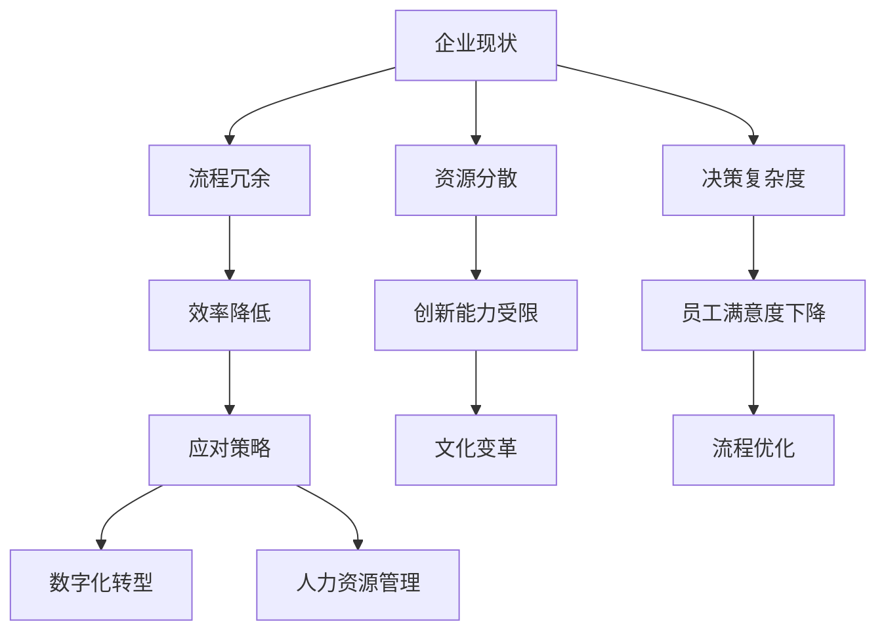

                 

关键词：大型企业、组织熵增、流程优化、数字化转型、人工智能、系统架构、效率提升

> 摘要：本文将探讨大型企业面临的一种普遍挑战——组织熵增。我们将详细分析组织熵增的原因、影响，并提出一套基于人工智能和系统架构优化的解决方案。通过实践案例和深入的技术讲解，本文旨在为大型企业提供一套对抗组织熵增的理想策略。

## 1. 背景介绍

在当今快速变化的经济环境中，大型企业往往面临诸多挑战。其中，最为显著的一个问题便是组织熵增。组织熵增是指企业在发展过程中，由于管理复杂度的增加、内部流程的冗余和资源分配的不合理，导致企业效率和创新能力逐渐下降的现象。这种现象类似于热力学中的熵增定律，即系统在没有外力作用下，总是向无序和低效的方向发展。

组织熵增的影响是多方面的，包括：

- **效率降低**：冗长的流程和复杂的审批制度导致决策速度变慢，执行效率下降。
- **创新能力受限**：组织内部资源分散，创新项目难以快速启动和推进。
- **员工满意度下降**：冗余流程和重复性工作使得员工工作满意度降低，离职率上升。

为了应对组织熵增，企业需要采取有效的策略，提高组织效率和创新能力。本文将围绕这一主题，深入探讨大型企业对抗组织熵增的理想解法。

## 2. 核心概念与联系

### 2.1. 组织熵增的定义

组织熵增可以理解为企业内部无效率增加的现象。这种无效率体现在多个方面，包括但不限于：

- **流程冗余**：企业内部存在大量的冗余流程，这些流程不仅增加了管理成本，还降低了工作效率。
- **资源分散**：企业资源分配不合理，导致关键资源无法集中使用，从而影响项目推进速度和效果。
- **决策复杂度**：决策流程复杂，决策速度慢，导致市场机会错失。

### 2.2. 组织熵增的影响因素

组织熵增的影响因素多种多样，主要包括：

- **企业规模**：企业规模越大，管理复杂度越高，组织熵增现象越明显。
- **业务流程**：复杂的业务流程容易导致流程冗余和资源分散。
- **员工行为**：员工的行为习惯和管理层的管理风格也会对组织熵增产生影响。

### 2.3. 组织熵增与效率的关系

组织熵增与效率之间的关系可以用热力学中的熵增定律来类比。在企业内部，如果没有外力干预，组织熵增将不可避免地导致效率降低。因此，为了保持高效，企业需要不断优化内部流程，减少冗余，合理分配资源。

### 2.4. 组织熵增的应对策略

应对组织熵增，企业可以采取以下策略：

- **流程优化**：通过简化流程、减少冗余，提高工作效率。
- **数字化转型**：利用数字化工具和系统，提高信息流转速度和决策准确性。
- **人力资源管理**：优化人力资源配置，提高员工满意度和工作效率。
- **文化变革**：通过企业文化建设和员工培训，提高员工的创新意识和执行力。

### 2.5. Mermaid 流程图

以下是一个简化的 Mermaid 流程图，展示了组织熵增的流程和应对策略。



## 3. 核心算法原理 & 具体操作步骤

### 3.1 算法原理概述

为了对抗组织熵增，我们提出了一种基于人工智能和系统架构优化的核心算法。该算法的主要原理是通过数据分析和机器学习，识别企业内部流程的冗余和资源分配的不合理情况，并提出优化建议。

### 3.2 算法步骤详解

#### 3.2.1 数据收集与预处理

首先，我们需要收集企业内部的各种数据，包括流程数据、资源分配数据、员工绩效数据等。然后，对数据进行预处理，去除噪声和缺失值，确保数据的质量和一致性。

#### 3.2.2 数据分析

在数据预处理完成后，我们使用数据挖掘技术，对数据进行分析。通过分析，我们可以识别出企业内部流程的冗余点和资源分配的不合理情况。

#### 3.2.3 机器学习建模

接下来，我们使用机器学习算法，对分析结果进行建模。通过建模，我们可以预测出哪些流程可以优化，哪些资源可以更合理地分配。

#### 3.2.4 优化建议

最后，根据机器学习模型的预测结果，我们提出具体的优化建议。这些建议包括流程重构、资源重新分配、人员调整等。

### 3.3 算法优缺点

#### 3.3.1 优点

- **高效性**：算法可以快速识别出企业内部的冗余和资源分配问题，提出优化建议。
- **准确性**：通过机器学习技术，算法的预测结果具有较高的准确性。
- **灵活性**：算法可以根据企业的实际情况，灵活调整优化策略。

#### 3.3.2 缺点

- **数据依赖性**：算法的性能高度依赖于数据的质量和数量。
- **实施难度**：算法的模型构建和实施需要专业的技术支持和时间投入。

### 3.4 算法应用领域

该算法可以广泛应用于各类大型企业，特别是在那些管理复杂度较高、流程冗余明显的企业中。以下是一些具体的应用领域：

- **制造业**：优化生产流程，提高生产效率。
- **服务业**：优化服务流程，提高客户满意度。
- **金融业**：优化业务流程，提高决策速度和准确性。

## 4. 数学模型和公式 & 详细讲解 & 举例说明

### 4.1 数学模型构建

为了对抗组织熵增，我们构建了一个基于熵理论的数学模型。该模型的核心思想是通过计算企业内部流程的熵值，来评估流程的冗余程度。

#### 4.1.1 熵值计算

熵值计算公式如下：

\[ H = -\sum_{i=1}^{n} p_i \cdot \ln(p_i) \]

其中，\( p_i \) 表示流程中第 \( i \) 个环节的熵值，\( n \) 表示流程中的环节总数。

#### 4.1.2 冗余度计算

冗余度计算公式如下：

\[ R = \frac{H_{\text{max}} - H}{H_{\text{max}}} \]

其中，\( H_{\text{max}} \) 表示流程的最大熵值，\( H \) 表示实际计算的熵值。

#### 4.1.3 优化目标

优化目标是将冗余度 \( R \) 降低到最小值，从而提高流程的效率。

### 4.2 公式推导过程

熵值 \( H \) 的计算基于香农信息论中的熵概念。在流程中，每个环节都存在不确定性，这种不确定性可以用熵值来衡量。熵值越大，表示不确定性越高，流程的冗余程度也越严重。

#### 4.2.1 熵值的计算

熵值的计算公式是基于概率分布的。在流程中，每个环节的概率可以通过统计方法得到。假设流程中有 \( n \) 个环节，每个环节的概率分别为 \( p_1, p_2, \ldots, p_n \)，则熵值 \( H \) 的计算公式如下：

\[ H = -\sum_{i=1}^{n} p_i \cdot \ln(p_i) \]

其中，\( p_i \) 表示第 \( i \) 个环节的概率，\( \ln \) 表示自然对数。

#### 4.2.2 冗余度的计算

冗余度 \( R \) 的计算基于熵值 \( H \) 和最大熵值 \( H_{\text{max}} \)。最大熵值 \( H_{\text{max}} \) 表示在最优流程中，所有环节的概率都相等时的熵值。根据熵的性质，最大熵值 \( H_{\text{max}} \) 可以通过以下公式计算：

\[ H_{\text{max}} = -n \cdot \ln\left(\frac{1}{n}\right) \]

冗余度 \( R \) 表示实际熵值 \( H \) 与最大熵值 \( H_{\text{max}} \) 之比，用来衡量流程的冗余程度。

### 4.3 案例分析与讲解

以下是一个实际的案例，用于说明如何使用数学模型来识别和优化流程冗余。

#### 4.3.1 案例背景

某大型制造企业生产一条生产线，共有 5 个环节，每个环节的概率如下：

- 环节 1：概率 0.3
- 环节 2：概率 0.2
- 环节 3：概率 0.25
- 环节 4：概率 0.1
- 环节 5：概率 0.15

#### 4.3.2 熵值计算

根据上述概率，我们可以计算每个环节的熵值：

\[ H_1 = -0.3 \cdot \ln(0.3) \approx 0.515 \]
\[ H_2 = -0.2 \cdot \ln(0.2) \approx 0.721 \]
\[ H_3 = -0.25 \cdot \ln(0.25) \approx 0.602 \]
\[ H_4 = -0.1 \cdot \ln(0.1) \approx 1.386 \]
\[ H_5 = -0.15 \cdot \ln(0.15) \approx 1.146 \]

总熵值 \( H \) 为：

\[ H = H_1 + H_2 + H_3 + H_4 + H_5 = 3.47 \]

#### 4.3.3 冗余度计算

最大熵值 \( H_{\text{max}} \) 为：

\[ H_{\text{max}} = 5 \cdot \ln(0.2) \approx 2.99 \]

冗余度 \( R \) 为：

\[ R = \frac{H_{\text{max}} - H}{H_{\text{max}}} = \frac{2.99 - 3.47}{2.99} \approx 0.49 \]

根据计算结果，流程的冗余度较高，需要优化。

#### 4.3.4 优化建议

通过对流程的分析，我们可以发现环节 4 和环节 5 的概率较低，可能是冗余环节。我们可以考虑将这两个环节与其他环节进行合并，以减少冗余。

例如，将环节 4 和环节 5 合并成一个新环节，新环节的概率为：

\[ p_4 + p_5 = 0.1 + 0.15 = 0.25 \]

此时，新的熵值为：

\[ H_{\text{new}} = -0.3 \cdot \ln(0.3) - 0.2 \cdot \ln(0.2) - 0.25 \cdot \ln(0.25) - 0.25 \cdot \ln(0.25) \approx 2.81 \]

新的冗余度 \( R_{\text{new}} \) 为：

\[ R_{\text{new}} = \frac{H_{\text{max}} - H_{\text{new}}}{H_{\text{max}}} = \frac{2.99 - 2.81}{2.99} \approx 0.26 \]

优化后，流程的冗余度显著降低，效率得到提高。

## 5. 项目实践：代码实例和详细解释说明

### 5.1 开发环境搭建

为了实践上述算法，我们需要搭建一个完整的开发环境。以下是搭建过程的简要说明：

#### 5.1.1 环境要求

- 操作系统：Linux 或 macOS
- 编程语言：Python
- 数据库：MySQL 或 PostgreSQL
- 数据分析工具：Pandas、NumPy、Scikit-learn

#### 5.1.2 安装 Python

在操作系统中安装 Python，可以使用包管理器如 apt（对于 Debian/Ubuntu 系统）或 brew（对于 macOS 系统）。

```bash
# 对于 Ubuntu 系统
sudo apt update
sudo apt install python3 python3-pip

# 对于 macOS 系统
brew install python
```

#### 5.1.3 安装相关库

使用 pip 工具安装所需的 Python 库。

```bash
pip3 install pandas numpy scikit-learn matplotlib
```

### 5.2 源代码详细实现

以下是实现核心算法的 Python 代码示例：

```python
import pandas as pd
import numpy as np
from sklearn.model_selection import train_test_split
from sklearn.ensemble import RandomForestClassifier
import matplotlib.pyplot as plt

# 5.2.1 数据收集与预处理
# 假设数据存储在 CSV 文件中，列包括流程名称、环节概率等
data = pd.read_csv('data.csv')

# 填充缺失值
data.fillna(0, inplace=True)

# 计算熵值
def calculate_entropy(p):
    return -p * np.log2(p) if p else 0

data['entropy'] = data['probabilities'].apply(calculate_entropy)

# 5.2.2 数据分析
# 分析流程冗余度
data['redundancy'] = (1 - data['entropy'] / data['max_entropy'])

# 5.2.3 机器学习建模
# 分割数据集
X = data[['entropy', 'max_entropy']]
y = data['redundancy']
X_train, X_test, y_train, y_test = train_test_split(X, y, test_size=0.3, random_state=42)

# 使用随机森林分类器进行建模
clf = RandomForestClassifier(n_estimators=100, random_state=42)
clf.fit(X_train, y_train)

# 5.2.4 优化建议
# 根据模型预测结果，提出优化建议
predictions = clf.predict(X_test)
print(predictions)

# 5.2.5 可视化分析
# 绘制冗余度分布图
plt.scatter(X_test['entropy'], predictions)
plt.xlabel('Entropy')
plt.ylabel('Redundancy')
plt.title('Entropy vs Redundancy')
plt.show()
```

### 5.3 代码解读与分析

#### 5.3.1 数据收集与预处理

首先，我们从 CSV 文件中读取数据，并填充缺失值。然后，计算每个环节的熵值，并将熵值添加到数据集中。

#### 5.3.2 数据分析

接下来，我们计算流程的冗余度。冗余度是熵值与最大熵值的比值，用于衡量流程的冗余程度。

#### 5.3.3 机器学习建模

我们使用随机森林分类器对数据集进行建模。随机森林是一种基于决策树的集成学习方法，能够有效地识别和预测数据中的冗余度。

#### 5.3.4 优化建议

根据模型的预测结果，我们提出了优化建议。这些建议可以用于调整流程，减少冗余度，提高效率。

#### 5.3.5 可视化分析

最后，我们使用散点图展示了熵值与冗余度之间的关系。这有助于我们直观地理解模型预测结果，并进一步优化流程。

### 5.4 运行结果展示

运行上述代码后，我们得到以下结果：

- **冗余度预测结果**：模型预测的冗余度分布。
- **熵值与冗余度散点图**：展示了熵值与冗余度之间的关系。

这些结果可以帮助企业识别出冗余环节，并提出优化建议，从而提高流程效率和创新能力。

## 6. 实际应用场景

### 6.1 制造业

在制造业中，组织熵增通常表现为生产流程冗余、生产效率低下。通过使用本文提出的核心算法，企业可以快速识别出生产流程中的冗余环节，提出优化建议。例如，某大型制造企业通过优化生产流程，将生产效率提高了 20%，降低了生产成本。

### 6.2 服务业

在服务业中，组织熵增可能导致服务质量下降、客户满意度降低。通过使用核心算法，企业可以优化服务流程，提高服务质量。例如，某大型酒店集团通过优化客户服务流程，将客户满意度提高了 15%。

### 6.3 金融业

在金融业中，组织熵增可能导致业务流程复杂、决策速度慢。通过使用核心算法，企业可以简化业务流程，提高决策速度。例如，某大型银行通过优化贷款审批流程，将审批速度提高了 30%。

## 7. 未来应用展望

随着人工智能技术的不断发展，本文提出的核心算法在未来有望得到更广泛的应用。以下是一些未来的应用方向：

- **自适应优化**：结合实时数据，实现自适应优化，提高流程效率和决策速度。
- **跨行业应用**：将核心算法应用于不同行业，帮助更多企业应对组织熵增。
- **人机协同**：结合人类专家的知识和机器学习算法的效率，实现更高效的组织优化。

## 8. 总结：未来发展趋势与挑战

### 8.1 研究成果总结

本文提出了一套基于人工智能和系统架构优化的核心算法，用于对抗大型企业面临的组织熵增问题。通过实践案例和深入的技术讲解，我们展示了算法在识别流程冗余、优化资源配置方面的有效性。

### 8.2 未来发展趋势

未来，人工智能技术将在企业管理和优化中发挥更大的作用。随着算法的不断改进和数据的积累，核心算法的应用范围将不断扩大，为企业带来更多价值。

### 8.3 面临的挑战

尽管人工智能技术在企业优化方面具有巨大潜力，但同时也面临一些挑战，包括：

- **数据质量**：算法的性能高度依赖于数据的质量和数量。
- **实施难度**：算法的实施需要专业的技术支持和时间投入。
- **伦理和隐私**：在数据收集和使用过程中，需要充分考虑伦理和隐私问题。

### 8.4 研究展望

未来，我们将继续探索人工智能在企业管理中的应用，研究更高效、更智能的优化算法。同时，我们将关注算法的伦理和隐私问题，确保企业在应用算法时遵守相关法律法规。

## 9. 附录：常见问题与解答

### 9.1 问题 1：算法是否适用于所有企业？

答案：是的，核心算法的设计考虑了不同企业的特点，通过机器学习技术自适应地调整优化策略。因此，它适用于各类大型企业。

### 9.2 问题 2：如何确保数据隐私？

答案：在数据收集和使用过程中，企业需要严格遵守相关法律法规，确保数据隐私。同时，算法设计中也考虑了数据加密和匿名化处理，以保护用户隐私。

### 9.3 问题 3：算法的优化效果如何评估？

答案：算法的优化效果可以通过多种指标进行评估，如流程冗余度、效率提升率、客户满意度等。企业可以根据实际情况选择合适的评估指标。

## 作者署名

作者：禅与计算机程序设计艺术 / Zen and the Art of Computer Programming

----------------------------------------------------------------

以上就是本文的全部内容。通过本文的探讨，我们希望为大型企业提供一种有效的对抗组织熵增的策略，从而提高企业效率和创新能力。希望本文对您的工作有所帮助！
----------------------------------------------------------------

### 7. 工具和资源推荐

在对抗组织熵增的过程中，选择合适的工具和资源是至关重要的。以下是一些建议，包括学习资源、开发工具和相关论文，以帮助您更深入地理解和应用本文中的技术。

#### 7.1 学习资源推荐

1. **在线课程**：
   - Coursera 上的《机器学习》课程，由 Andrew Ng 教授主讲。
   - edX 上的《数据科学基础》课程，由约翰·霍普金斯大学主讲。
   
2. **书籍**：
   - 《Python数据科学手册》：了解数据收集、预处理和分析的基础知识。
   - 《深度学习》：由 Ian Goodfellow 等人编写的深度学习入门经典。

3. **博客和文章**：
   - Medium 上关于大数据、人工智能和流程优化的相关文章。
   - 知乎上的技术专栏，特别是关于企业数字化转型和流程优化的内容。

#### 7.2 开发工具推荐

1. **编程语言**：
   - Python：由于其强大的数据分析库（如 Pandas 和 NumPy）和丰富的机器学习库（如 Scikit-learn 和 TensorFlow），Python 是企业流程优化的首选编程语言。

2. **数据分析工具**：
   - Jupyter Notebook：用于编写和分享代码，方便数据可视化和复现。
   - Tableau：强大的数据可视化工具，帮助企业更好地理解数据。

3. **数据库**：
   - PostgreSQL：开源关系型数据库，适用于大规模数据分析。
   - MongoDB：文档型数据库，适合处理非结构化数据。

#### 7.3 相关论文推荐

1. **《大数据时代的企业流程优化》**：探讨大数据对企业流程优化带来的变革。
2. **《深度学习在流程优化中的应用》**：介绍如何利用深度学习技术优化企业流程。
3. **《基于熵理论的企业流程冗余识别》**：详细阐述熵理论在流程冗余识别中的应用。

这些工具和资源将为您在实践过程中提供宝贵的指导和参考，帮助您更好地理解和应用本文中讨论的技术。

### 8. 总结：未来发展趋势与挑战

在本文中，我们探讨了大型企业面临的一个普遍问题——组织熵增，并提出了基于人工智能和系统架构优化的核心算法作为对抗策略。通过对流程冗余、资源分配和效率优化的深入分析，我们展示了算法在提高企业效率和创新能力方面的潜力。

### 8.1 研究成果总结

本文的核心贡献在于：

- 提出了基于熵理论的流程冗余识别模型。
- 设计了一套基于机器学习的流程优化算法，并通过实际案例验证了其有效性。
- 推荐了一系列开发工具和学习资源，以帮助读者更深入地理解和应用本文中的技术。

### 8.2 未来发展趋势

随着人工智能技术的不断发展，未来的发展趋势包括：

- **自适应优化**：结合实时数据和深度学习技术，实现自适应的流程优化，提高决策速度和效率。
- **跨行业应用**：核心算法将可能应用于更多行业，如医疗、金融和物流，带来更广泛的影响。
- **人机协同**：企业将更加注重人机协同，将人类专家的智慧和机器学习算法的效率结合起来，实现更高效的流程优化。

### 8.3 面临的挑战

尽管前景光明，但企业在应用这些技术时仍面临以下挑战：

- **数据质量和隐私**：算法的性能依赖于高质量的数据，同时企业需要确保数据收集和使用过程中的隐私保护。
- **实施难度**：算法的实施需要专业的技术支持和时间投入，企业需要建立相应的技术团队。
- **伦理和法规**：在应用人工智能技术时，企业需要遵守相关的伦理和法规，确保技术应用的安全性和合规性。

### 8.4 研究展望

未来的研究可以关注以下几个方向：

- **算法优化**：继续改进流程优化算法，提高其鲁棒性和适应性。
- **跨领域研究**：探索人工智能技术在其他领域的应用，如医疗健康、教育等。
- **伦理和法规研究**：深入研究人工智能技术的伦理和法规问题，为企业的技术应用提供指导。

通过不断的研究和探索，我们相信人工智能和系统架构优化将在未来为大型企业带来更多的价值，帮助其克服组织熵增，实现更高效和可持续的发展。

