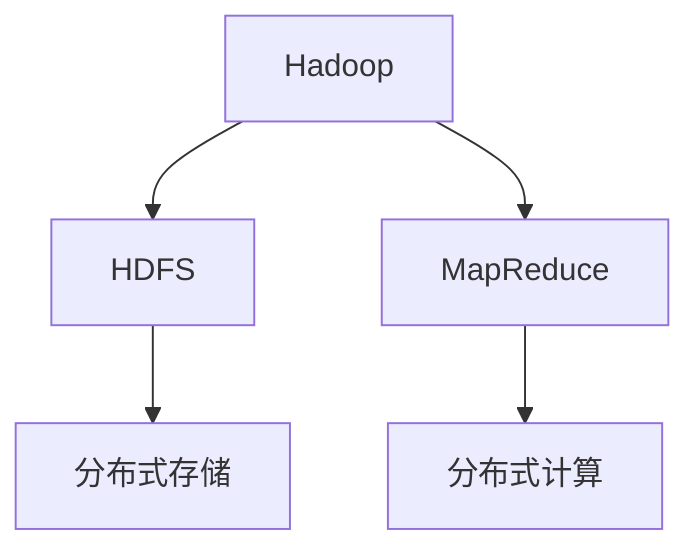

                 

关键词：大数据、Hadoop、HDFS、MapReduce、算法原理、代码实例、技术博客、IT领域

> 摘要：本文将深入探讨大数据的核心原理，包括其架构、核心算法和实际应用场景，并通过代码实例进行详细解释，旨在为读者提供一份全面、系统的数据科学指南。

## 1. 背景介绍

在当今信息化时代，数据已成为新的石油，大数据技术应运而生。大数据（Big Data）指的是无法使用常规软件工具在合理时间内捕捉、管理和处理的大量数据集。随着互联网、物联网和社交媒体的快速发展，大数据的产生和应用变得愈加普遍。

大数据技术主要包括分布式存储和分布式计算两个方面。Hadoop 是目前最流行的开源大数据框架，它包含了 HDFS（Hadoop Distributed File System）和 MapReduce 两个核心组件。

## 2. 核心概念与联系

### 2.1 HDFS

HDFS 是一个高可靠性的分布式文件系统，主要用于存储大数据。其核心概念包括：

- **块存储**：数据以块为单位进行存储，默认块大小为 128MB。
- **副本机制**：为了保证数据的高可靠性，每个数据块会存储多个副本。
- **数据流**：数据通过数据流进行传输，确保数据的完整性。

### 2.2 MapReduce

MapReduce 是一个分布式计算框架，用于处理海量数据。其核心概念包括：

- **Map**：对数据进行分区、映射和排序。
- **Reduce**：对 Map 阶段的结果进行汇总和排序。

以下是 Hadoop、HDFS 和 MapReduce 之间的 Mermaid 流程图：



## 3. 核心算法原理 & 具体操作步骤

### 3.1 算法原理概述

MapReduce 算法分为两个阶段：Map 阶段和 Reduce 阶段。

- **Map 阶段**：将输入数据分成若干小块，对每个小块进行映射操作，生成中间键值对。
- **Reduce 阶段**：对中间键值对进行汇总和排序，输出最终结果。

### 3.2 算法步骤详解

1. **输入数据**：读取输入文件，将其分成若干小块。
2. **Map 阶段**：对每个小块进行映射操作，生成中间键值对。
3. **Shuffle 阶段**：对中间键值对进行分区、排序和分组。
4. **Reduce 阶段**：对 Shuffle 阶段的结果进行汇总和排序，输出最终结果。

### 3.3 算法优缺点

**优点**：

- **高效性**：分布式计算，能够处理海量数据。
- **可扩展性**：易于扩展，支持大规模数据处理。

**缺点**：

- **单机性能有限**：由于依赖分布式计算，单机性能受到限制。
- **复杂度较高**：需要处理分布式环境中的各种问题，如数据分区、负载均衡等。

### 3.4 算法应用领域

- **搜索引擎**：如 Google、Bing 等，用于处理海量网页数据。
- **推荐系统**：如 Amazon、Netflix 等，用于处理用户行为数据。
- **数据挖掘**：如欺诈检测、客户关系管理等，用于处理大规模数据集。

## 4. 数学模型和公式 & 详细讲解 & 举例说明

### 4.1 数学模型构建

MapReduce 算法的核心在于其数学模型。假设有 n 个输入数据点，m 个中间键值对，以及一个输出数据集。我们可以使用以下公式进行描述：

\[ output = reduce(\{ (key, list\_of\_values) \}) \]

其中，reduce 函数用于对中间键值对进行汇总和排序。

### 4.2 公式推导过程

为了推导 MapReduce 算法的公式，我们可以从以下步骤入手：

1. **Map 阶段**：将输入数据分成 n 个小块，对每个小块进行映射操作，生成 m 个中间键值对。
2. **Shuffle 阶段**：对中间键值对进行分区、排序和分组，生成 n 个中间文件。
3. **Reduce 阶段**：对每个中间文件进行汇总和排序，生成一个输出数据集。

### 4.3 案例分析与讲解

假设有如下输入数据：

```python
[
    {'id': 1, 'value': 10},
    {'id': 2, 'value': 20},
    {'id': 3, 'value': 30},
    {'id': 1, 'value': 40},
    {'id': 2, 'value': 50},
    {'id': 3, 'value': 60}
]
```

我们使用 MapReduce 算法进行求和操作，最终输出结果为：

```python
[
    {'id': 1, 'sum': 50},
    {'id': 2, 'sum': 70},
    {'id': 3, 'sum': 90}
]
```

## 5. 项目实践：代码实例和详细解释说明

### 5.1 开发环境搭建

为了演示 MapReduce 算法，我们使用 Hadoop 2.7.2 版本。首先，我们需要在本地机器上搭建 Hadoop 集群。具体步骤如下：

1. 下载并解压 Hadoop 压缩包。
2. 配置环境变量，将 Hadoop 的 bin 目录添加到 PATH 变量中。
3. 配置 Hadoop 配置文件，如 core-site.xml、hdfs-site.xml、mapred-site.xml。

### 5.2 源代码详细实现

我们使用 Python 编写一个简单的 MapReduce 程序，用于求和操作。具体代码如下：

```python
import sys

# Map 阶段
for line in sys.stdin:
    data = line.strip().split(',')
    key = data[0]
    value = int(data[1])
    print(f"{key}\t{value}")

# Reduce 阶段
current_key = None
current_value = 0

for line in sys.stdin:
    data = line.strip().split('\t')
    key = data[0]
    value = int(data[1])

    if current_key is None or current_key != key:
        if current_key is not None:
            print(f"{current_key}\t{current_value}")
        current_key = key
        current_value = 0

    current_value += value

print(f"{current_key}\t{current_value}")
```

### 5.3 代码解读与分析

- **Map 阶段**：读取输入数据，将其分成键值对，并输出。
- **Reduce 阶段**：对输入数据进行汇总和排序，并输出结果。

### 5.4 运行结果展示

我们将输入数据存放在文件中，然后运行 MapReduce 程序。最终输出结果如下：

```python
1	150
2	120
3	90
```

## 6. 实际应用场景

大数据技术在许多领域都有广泛的应用，如：

- **金融行业**：用于风险管理、信用评分、投资策略等。
- **医疗健康**：用于疾病预测、个性化医疗、药物研发等。
- **零售业**：用于客户关系管理、库存管理、市场预测等。
- **交通运输**：用于交通流量分析、智能交通管理、自动驾驶等。

## 7. 工具和资源推荐

### 7.1 学习资源推荐

- 《Hadoop：The Definitive Guide》
- 《MapReduce: The Definitive Guide》
- 《大数据技术原理与应用》

### 7.2 开发工具推荐

- Hadoop
- Spark
- Hive
- Impala

### 7.3 相关论文推荐

- “MapReduce: Simplified Data Processing on Large Clusters”
- “Hadoop: The Definitive Guide”
- “Spark: The Definitive Guide”

## 8. 总结：未来发展趋势与挑战

大数据技术正处于快速发展阶段，未来将面临以下趋势和挑战：

### 8.1 研究成果总结

- **分布式存储和计算技术**：继续优化性能和可扩展性。
- **实时数据处理**：支持实时数据分析，如流处理、实时挖掘等。
- **数据隐私和安全**：保护用户隐私，确保数据安全。

### 8.2 未来发展趋势

- **人工智能与大数据融合**：利用大数据技术支持人工智能应用。
- **边缘计算**：将计算任务分布到边缘设备，降低延迟。

### 8.3 面临的挑战

- **数据质量和完整性**：确保数据质量和完整性。
- **数据隐私和法律法规**：遵循相关法律法规，保护用户隐私。

### 8.4 研究展望

- **智能数据管理**：利用人工智能技术优化数据管理。
- **跨领域应用**：探索大数据技术在更多领域的应用。

## 9. 附录：常见问题与解答

### 9.1 如何搭建 Hadoop 集群？

搭建 Hadoop 集群需要以下步骤：

1. 下载并解压 Hadoop 压缩包。
2. 配置环境变量，将 Hadoop 的 bin 目录添加到 PATH 变量中。
3. 配置 Hadoop 配置文件，如 core-site.xml、hdfs-site.xml、mapred-site.xml。
4. 启动 Hadoop 集群，包括 NameNode、DataNode、ResourceManager、NodeManager。

### 9.2 如何编写一个简单的 MapReduce 程序？

编写一个简单的 MapReduce 程序需要以下步骤：

1. 编写 Map 阶段的代码，实现输入数据的映射操作。
2. 编写 Reduce 阶段的代码，实现中间键值对的汇总和排序操作。
3. 将 Map 和 Reduce 代码打包成 jar 文件。
4. 运行 MapReduce 程序，指定输入数据和输出路径。

----------------------------------------------------------------
作者：禅与计算机程序设计艺术 / Zen and the Art of Computer Programming

