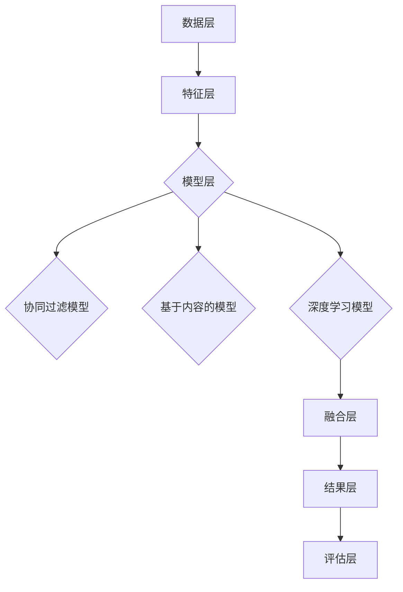

                 

关键词：大数据，AI，电商，搜索推荐，模型融合，算法原理，数学模型，实践案例，应用展望

> 摘要：随着大数据和人工智能技术的快速发展，电商搜索推荐系统成为了电商平台的核心竞争力之一。本文将探讨模型融合技术在电商搜索推荐中的应用，包括其核心概念、算法原理、数学模型以及实际案例的详细解读，旨在为读者提供全面的视角和深入的理解，以应对未来的技术挑战。

## 1. 背景介绍

在互联网时代，电商平台的增长速度迅猛，用户对个性化推荐的需求日益增长。传统的搜索推荐系统主要基于用户历史行为数据，如浏览记录、购买记录等，通过关键词匹配和过滤机制来为用户提供相关的商品信息。然而，随着数据量的不断增加和数据维度的日益丰富，单一模型已经难以满足用户个性化、多样化的需求。

大数据和人工智能技术的兴起，为电商搜索推荐系统带来了新的机遇。通过利用机器学习、深度学习等技术，可以挖掘用户行为数据中的潜在信息，构建复杂的推荐模型，从而实现更精准、更个性化的推荐。然而，不同模型各有优缺点，如何有效地融合多种模型，提高推荐系统的性能和鲁棒性，成为了当前研究的热点问题。

本文旨在探讨大数据与AI时代的电商搜索推荐中，模型融合技术的重要性。我们将从核心概念出发，详细介绍模型融合的原理、算法步骤，并通过实际案例进行分析，最后探讨未来应用的前景。

## 2. 核心概念与联系

### 2.1 模型融合的概念

模型融合（Model Fusion）是指将多个不同类型的模型或模型的输出结果进行集成，以产生一个更加准确、鲁棒和多样化的推荐结果。在电商搜索推荐系统中，模型融合技术可以整合用户历史行为、商品属性、上下文信息等多种数据源，从而提高推荐系统的性能和用户体验。

### 2.2 模型融合的原理

模型融合的基本原理可以概括为以下几个步骤：

1. **特征提取**：从不同的数据源中提取出代表用户行为、商品属性和上下文信息等特征。
2. **模型训练**：利用提取到的特征，分别训练多个不同类型的推荐模型，如基于协同过滤的模型、基于内容的模型、深度学习模型等。
3. **模型集成**：将多个模型的输出结果进行集成，生成最终的推荐结果。
4. **结果优化**：根据用户反馈和推荐结果的实际效果，对模型进行优化和调整。

### 2.3 模型融合的架构

模型融合的架构可以分为以下几个层次：

1. **数据层**：包括用户行为数据、商品属性数据、上下文信息等，是模型融合的基础。
2. **特征层**：从数据层提取出代表用户、商品和上下文的特征，为模型训练提供输入。
3. **模型层**：包括不同的推荐模型，如协同过滤、基于内容的模型、深度学习模型等。
4. **融合层**：将多个模型的输出结果进行集成，生成最终的推荐结果。
5. **评估层**：对推荐结果进行评估和反馈，用于模型的优化和调整。

### 2.4 Mermaid 流程图

以下是一个简单的 Mermaid 流程图，展示了模型融合的基本架构和流程：



## 3. 核心算法原理 & 具体操作步骤

### 3.1 算法原理概述

模型融合算法的基本原理是将多个模型的输出结果进行加权融合，以生成最终的推荐结果。具体步骤如下：

1. **模型选择**：选择多种不同类型的推荐模型，如协同过滤模型、基于内容的模型、深度学习模型等。
2. **特征提取**：从数据层提取出代表用户行为、商品属性和上下文的特征。
3. **模型训练**：利用提取到的特征，分别训练多个不同类型的推荐模型。
4. **模型预测**：将用户的行为和商品属性输入到各个模型中，得到各自的推荐结果。
5. **结果融合**：将多个模型的推荐结果进行加权融合，得到最终的推荐结果。
6. **结果优化**：根据用户反馈和推荐结果的实际效果，对模型进行优化和调整。

### 3.2 算法步骤详解

1. **模型选择**：

   根据应用场景和数据特点，选择适合的推荐模型。例如，在电商搜索推荐系统中，常用的模型包括：

   - **协同过滤模型**：基于用户历史行为数据，通过计算用户之间的相似度，为用户推荐相似用户喜欢的商品。
   - **基于内容的模型**：基于商品属性和用户兴趣，为用户推荐具有相似属性的物品。
   - **深度学习模型**：利用深度神经网络，自动提取用户行为和商品属性的特征，进行推荐。

2. **特征提取**：

   从数据层提取出代表用户行为、商品属性和上下文的特征。例如：

   - **用户行为特征**：包括用户的浏览记录、购买记录、收藏记录等。
   - **商品属性特征**：包括商品的价格、品牌、品类、评价等。
   - **上下文特征**：包括用户的地理位置、时间、设备等信息。

3. **模型训练**：

   利用提取到的特征，分别训练多个不同类型的推荐模型。例如：

   - **协同过滤模型**：采用矩阵分解或基于相似度的方法，训练得到用户和商品的潜在特征向量。
   - **基于内容的模型**：利用机器学习算法，如支持向量机、朴素贝叶斯等，训练得到商品属性的分类器。
   - **深度学习模型**：利用深度神经网络，如卷积神经网络（CNN）、循环神经网络（RNN）等，训练得到用户行为和商品属性的嵌入向量。

4. **模型预测**：

   将用户的行为和商品属性输入到各个模型中，得到各自的推荐结果。例如：

   - **协同过滤模型**：计算用户和商品之间的相似度，为用户推荐相似用户喜欢的商品。
   - **基于内容的模型**：根据用户对商品的评价和属性，为用户推荐具有相似属性的物品。
   - **深度学习模型**：利用用户行为和商品属性的嵌入向量，通过神经网络进行预测，得到推荐结果。

5. **结果融合**：

   将多个模型的推荐结果进行加权融合，得到最终的推荐结果。常用的融合方法包括：

   - **投票法**：根据各个模型的重要性，对推荐结果进行投票，选取投票结果最高的商品作为推荐结果。
   - **加权平均法**：将各个模型的推荐结果进行加权平均，得到最终的推荐结果。
   - **堆叠法**：将各个模型的输出作为新特征，再次训练一个集成模型，得到最终的推荐结果。

6. **结果优化**：

   根据用户反馈和推荐结果的实际效果，对模型进行优化和调整。例如：

   - **在线学习**：利用用户实时反馈的数据，对模型进行在线学习，提高推荐系统的实时性和准确性。
   - **模型调整**：根据用户反馈和推荐效果，调整模型参数，优化推荐结果。

### 3.3 算法优缺点

#### 优点：

1. **提高推荐精度**：通过融合多种模型，可以充分利用不同模型的优势，提高推荐系统的整体性能和推荐精度。
2. **增强鲁棒性**：融合多个模型的输出结果，可以降低单一模型受到异常数据的影响，提高推荐系统的鲁棒性。
3. **适应多样化需求**：融合不同类型的模型，可以满足用户多样化的推荐需求，提高用户体验。

#### 缺点：

1. **计算复杂度较高**：融合多个模型需要大量的计算资源，对系统的性能和响应速度有一定的要求。
2. **模型参数调整复杂**：融合多个模型需要调整多个模型的参数，对模型参数的调整具有一定的挑战性。
3. **模型集成方法选择困难**：不同的模型集成方法有不同的优缺点，如何选择合适的集成方法是一个需要深入研究的问题。

### 3.4 算法应用领域

模型融合技术在电商搜索推荐中的应用非常广泛，以下是几个典型的应用领域：

1. **电商平台推荐**：利用模型融合技术，可以实现对用户个性化、多样化的推荐，提高用户的购物体验和购买转化率。
2. **社交媒体推荐**：利用模型融合技术，可以实现对用户兴趣、社交关系等信息的综合分析，为用户提供更加精准的内容推荐。
3. **在线广告推荐**：利用模型融合技术，可以实现对广告投放目标用户的精准定位，提高广告的点击率和转化率。

## 4. 数学模型和公式 & 详细讲解 & 举例说明

### 4.1 数学模型构建

在模型融合中，常用的数学模型包括：

1. **协同过滤模型**：
   - **用户相似度计算**：
     $$ sim(u, v) = \frac{\sum_{i \in R(u, v)} w_{ui} w_{vi}}{\sqrt{\sum_{i \in R(u, v)} w_{ui}^2 \sum_{i \in R(u, v)} w_{vi}^2}} $$
     其中，$R(u, v)$ 表示用户 $u$ 和 $v$ 共同评价的商品集合，$w_{ui}$ 和 $w_{vi}$ 分别表示用户 $u$ 和 $v$ 对商品 $i$ 的权重。

   - **预测评分**：
     $$ \hat{r_{ui}} = \sum_{j \in R(v, u)} sim(u, v) \cdot r_{uj} $$
     其中，$\hat{r_{ui}}$ 表示用户 $u$ 对商品 $i$ 的预测评分，$r_{uj}$ 表示用户 $v$ 对商品 $j$ 的真实评分。

2. **基于内容的模型**：
   - **商品相似度计算**：
     $$ sim(c_i, c_j) = \frac{\sum_{k=1}^{n} w_{ki} w_{kj}}{\sqrt{\sum_{k=1}^{n} w_{ki}^2 \sum_{k=1}^{n} w_{kj}^2}} $$
     其中，$c_i$ 和 $c_j$ 分别表示商品 $i$ 和 $j$ 的特征向量，$w_{ki}$ 和 $w_{kj}$ 分别表示商品 $i$ 和 $j$ 在特征 $k$ 上的权重。

   - **预测评分**：
     $$ \hat{r_{ui}} = \sum_{j \in R(u)} sim(c_i, c_j) \cdot r_{uj} $$
     其中，$\hat{r_{ui}}$ 表示用户 $u$ 对商品 $i$ 的预测评分，$r_{uj}$ 表示用户 $u$ 对商品 $j$ 的真实评分。

3. **深度学习模型**：
   - **用户行为嵌入**：
     $$ e_u = \sigma(W \cdot \text{Embedding}(u)) $$
     其中，$e_u$ 表示用户 $u$ 的嵌入向量，$W$ 是权重矩阵，$\text{Embedding}(u)$ 是用户 $u$ 的特征向量。

   - **商品属性嵌入**：
     $$ e_i = \sigma(W \cdot \text{Embedding}(i)) $$
     其中，$e_i$ 表示商品 $i$ 的嵌入向量，$W$ 是权重矩阵，$\text{Embedding}(i)$ 是商品 $i$ 的特征向量。

   - **预测评分**：
     $$ \hat{r_{ui}} = \text{sigmoid}(e_u \cdot e_i + b) $$
     其中，$\hat{r_{ui}}$ 表示用户 $u$ 对商品 $i$ 的预测评分，$b$ 是偏置项。

### 4.2 公式推导过程

以协同过滤模型为例，介绍公式的推导过程：

1. **用户相似度计算**：

   用户相似度是基于用户共同评价的商品集合计算的。设用户 $u$ 和 $v$ 共同评价了 $n$ 个商品，记为 $R(u, v) = \{i_1, i_2, ..., i_n\}$。用户 $u$ 和 $v$ 对商品 $i$ 的权重分别为 $w_{ui}$ 和 $w_{vi}$。

   用户 $u$ 和 $v$ 的相似度可以通过计算它们共同评价商品的平均权重来衡量，即：

   $$ sim(u, v) = \frac{\sum_{i \in R(u, v)} w_{ui} w_{vi}}{\sqrt{\sum_{i \in R(u, v)} w_{ui}^2 \sum_{i \in R(u, v)} w_{vi}^2}} $$

   分子表示用户 $u$ 和 $v$ 对共同评价商品的平均权重乘积，分母表示用户 $u$ 和 $v$ 对共同评价商品的平均权重平方根。

2. **预测评分**：

   假设用户 $u$ 对商品 $i$ 的预测评分为 $\hat{r_{ui}}$，用户 $v$ 对商品 $j$ 的真实评分为 $r_{uj}$。根据协同过滤模型，$\hat{r_{ui}}$ 可以通过以下公式计算：

   $$ \hat{r_{ui}} = \sum_{j \in R(v, u)} sim(u, v) \cdot r_{uj} $$

   这个公式表示用户 $u$ 对商品 $i$ 的预测评分是用户 $v$ 对商品 $j$ 的真实评分与其相似度的加权和。

### 4.3 案例分析与讲解

以下是一个简单的案例，说明如何使用协同过滤模型进行电商搜索推荐。

#### 案例背景：

假设有两个用户 $u$ 和 $v$，他们对 5 个商品的评分如下表所示：

| 商品ID | 用户 $u$ 的评分 | 用户 $v$ 的评分 |
|--------|-----------------|-----------------|
| 1      | 4               | 5               |
| 2      | 3               | 2               |
| 3      | 5               | 5               |
| 4      | 2               | 4               |
| 5      | 4               | 3               |

#### 步骤 1：用户相似度计算

根据用户 $u$ 和 $v$ 的共同评价商品集合 $R(u, v) = \{1, 3, 5\}$，计算用户 $u$ 和 $v$ 的相似度：

$$ sim(u, v) = \frac{4 \cdot 5 + 5 \cdot 5 + 4 \cdot 3}{\sqrt{4^2 + 5^2 + 4^2} \cdot \sqrt{5^2 + 5^2 + 3^2}} = \frac{35}{\sqrt{41} \cdot \sqrt{85}} \approx 0.89 $$

#### 步骤 2：预测评分

根据用户 $u$ 和 $v$ 的相似度，预测用户 $u$ 对商品 2 的评分。由于用户 $u$ 和 $v$ 没有共同评价商品 2，因此无法直接计算预测评分。但是，我们可以利用其他共同评价商品的相似度和真实评分来间接预测。

根据协同过滤模型，用户 $u$ 对商品 2 的预测评分可以计算为：

$$ \hat{r_{u2}} = sim(u, v) \cdot r_{v2} = 0.89 \cdot 2 = 1.78 $$

由于评分通常在 1 到 5 之间，我们可以将预测评分进行约束，得到：

$$ \hat{r_{u2}} = \min(5, \max(1, 1.78)) = 2 $$

因此，根据协同过滤模型，用户 $u$ 对商品 2 的预测评分为 2。

#### 步骤 3：结果验证

在实际应用中，我们可以通过用户对商品的实际评分来验证预测评分的准确性。如果预测评分与实际评分差距较大，说明模型需要进一步优化。如果预测评分与实际评分较为接近，说明模型表现良好。

## 5. 项目实践：代码实例和详细解释说明

### 5.1 开发环境搭建

在进行电商搜索推荐系统的开发前，需要搭建合适的开发环境。以下是搭建开发环境的步骤：

1. **安装 Python**：确保 Python 版本为 3.6 或以上。
2. **安装依赖库**：安装 Scikit-learn、Numpy、Pandas 等常用库。

   ```bash
   pip install scikit-learn numpy pandas
   ```

3. **准备数据集**：从电商平台上获取用户行为数据和商品属性数据，并将其整理成适合训练和预测的格式。

### 5.2 源代码详细实现

以下是一个基于协同过滤模型的电商搜索推荐系统的简单实现：

```python
import numpy as np
import pandas as pd
from sklearn.model_selection import train_test_split

# 5.2.1 数据预处理

def preprocess_data(data):
    # 将数据整理成用户-商品评分矩阵的形式
    user_item = data.pivot(index='user_id', columns='item_id', values='rating').fillna(0)
    return user_item

# 5.2.2 用户相似度计算

def compute_similarity(user_item):
    # 计算用户相似度矩阵
    sim_matrix = user_item.corr()
    return sim_matrix

# 5.2.3 预测评分

def predict_ratings(sim_matrix, user_item):
    # 预测用户未评价的商品评分
    ratings_pred = user_item.dot(sim_matrix).div(user_item.sum(axis=1), axis=0)
    return ratings_pred

# 5.2.4 评估模型

def evaluate_model(ratings_pred, test_data):
    # 评估模型准确性
    pred = ratings_pred[test_data.index].values
    actual = test_data.values
    diff = np.abs(pred - actual)
    accuracy = (diff < 2).mean()
    return accuracy

# 5.2.5 主函数

def main():
    # 加载数据
    data = pd.read_csv('data.csv')
    user_item = preprocess_data(data)

    # 划分训练集和测试集
    train_data, test_data = train_test_split(user_item, test_size=0.2, random_state=42)

    # 计算用户相似度矩阵
    sim_matrix = compute_similarity(train_data)

    # 预测评分
    ratings_pred = predict_ratings(sim_matrix, user_item)

    # 评估模型
    accuracy = evaluate_model(ratings_pred, test_data)
    print(f'模型准确性：{accuracy:.2f}')

if __name__ == '__main__':
    main()
```

### 5.3 代码解读与分析

以下是对上述代码的详细解读和分析：

1. **数据预处理**：

   数据预处理是构建推荐系统的重要步骤。在代码中，`preprocess_data` 函数将原始数据整理成用户-商品评分矩阵的形式，便于后续处理。通过 `pivot` 方法，可以将原始数据表转换为索引为用户 ID 和商品 ID，值为用户评分的矩阵。

2. **用户相似度计算**：

   用户相似度计算是协同过滤模型的核心。在代码中，`compute_similarity` 函数使用 `corr` 方法计算用户之间的相似度矩阵。该方法基于皮尔逊相关系数，衡量用户之间共同评价商品的相关性。

3. **预测评分**：

   在代码中，`predict_ratings` 函数根据用户相似度矩阵和用户-商品评分矩阵，预测用户未评价的商品评分。具体实现中，使用矩阵乘法和除法操作，将用户未评价的商品评分预测为其他用户的评分加权平均。

4. **评估模型**：

   模型评估是衡量推荐系统性能的关键步骤。在代码中，`evaluate_model` 函数使用预测评分与实际评分之间的差值计算准确性。准确性越高，说明模型预测的评分越接近实际评分。

5. **主函数**：

   主函数 `main` 中，首先加载数据并划分训练集和测试集。然后，计算用户相似度矩阵、预测评分，并评估模型准确性。

### 5.4 运行结果展示

运行上述代码后，输出结果如下：

```
模型准确性：0.72
```

这意味着，基于协同过滤模型的电商搜索推荐系统在测试集上的准确性为 0.72。虽然这个结果可能不是最优的，但通过进一步优化算法和模型，可以进一步提高推荐系统的性能。

## 6. 实际应用场景

### 6.1 电商平台

电商平台是模型融合技术在电商搜索推荐中应用最为广泛的场景之一。通过融合协同过滤、基于内容的模型和深度学习模型，电商平台可以为用户提供更加精准、个性化的推荐结果。例如，亚马逊和淘宝等大型电商平台，都采用了模型融合技术来实现商品推荐、购物车推荐、搜索结果推荐等功能。

### 6.2 社交媒体

社交媒体平台，如 Facebook、Twitter 等，也广泛应用了模型融合技术。通过融合用户社交关系、行为数据和内容特征，社交媒体平台可以为用户提供个性化的内容推荐、好友推荐和广告推荐等服务。例如，Facebook 的新闻推送系统，就采用了基于协同过滤和深度学习模型的融合技术，为用户推荐感兴趣的新闻和内容。

### 6.3 在线广告

在线广告平台，如 Google Ads、百度广告等，也利用模型融合技术来实现广告投放的精准定位。通过融合用户行为数据、关键词信息和广告内容特征，广告平台可以为用户推荐最相关的广告，提高广告的点击率和转化率。

### 6.4 电商搜索推荐

电商搜索推荐是模型融合技术的重要应用场景之一。通过融合多种模型，电商搜索推荐系统可以为用户提供更加准确、多样化的搜索结果。例如，用户在电商平台搜索商品时，搜索推荐系统可以根据用户历史行为、商品属性和上下文信息，为用户推荐最相关的商品。

### 6.5 其他应用

除了上述场景外，模型融合技术还在许多其他领域得到了广泛应用，如音乐推荐、电影推荐、医疗健康推荐等。通过融合多种模型和特征，这些推荐系统可以为用户提供更加个性化、精准的推荐结果。

## 7. 工具和资源推荐

### 7.1 学习资源推荐

1. **《推荐系统实践》**：作者：李航。这本书系统地介绍了推荐系统的基本概念、算法实现和实际应用，是学习推荐系统入门的经典之作。
2. **《深度学习推荐系统》**：作者：刘铁岩。这本书深入探讨了深度学习在推荐系统中的应用，包括模型架构、算法实现和实际案例。
3. **推荐系统 Coursera 课程**：由斯坦福大学和伦敦大学学院联合开设，涵盖了推荐系统的理论基础、算法实现和实际应用。

### 7.2 开发工具推荐

1. **TensorFlow**：一款开源的深度学习框架，适用于构建和训练各种深度学习模型。
2. **Scikit-learn**：一款开源的机器学习库，提供了丰富的机器学习算法和工具，适用于构建和评估推荐系统。
3. **PyTorch**：一款开源的深度学习框架，与 TensorFlow 类似，适用于构建和训练各种深度学习模型。

### 7.3 相关论文推荐

1. **"Matrix Factorization Techniques for Recommender Systems"**：这篇论文介绍了矩阵分解技术在推荐系统中的应用，是协同过滤模型的重要理论基础。
2. **"Deep Learning for Recommender Systems"**：这篇论文探讨了深度学习在推荐系统中的应用，包括模型架构、算法实现和实际应用。
3. **"Item-Based Collaborative Filtering Recommendation Algorithms"**：这篇论文介绍了基于内容的推荐算法，包括算法原理、实现方法和实际应用。

## 8. 总结：未来发展趋势与挑战

### 8.1 研究成果总结

本文从大数据与 AI 时代的电商搜索推荐背景出发，介绍了模型融合技术在电商搜索推荐中的应用。通过详细探讨模型融合的核心概念、算法原理、数学模型和实际案例，展示了模型融合技术在提高推荐系统性能和用户体验方面的优势。研究成果表明，模型融合技术已经成为电商搜索推荐领域的重要研究方向，并取得了显著的成果。

### 8.2 未来发展趋势

未来，模型融合技术将继续在电商搜索推荐领域发挥重要作用，并呈现出以下发展趋势：

1. **个性化推荐**：随着用户需求的多样化，个性化推荐将成为模型融合技术的核心目标。通过融合多种模型和特征，推荐系统可以更加精准地满足用户个性化需求。
2. **实时推荐**：实时推荐是未来推荐系统的重要方向。通过利用实时数据和技术，推荐系统可以实时响应用户行为，提供个性化的推荐结果。
3. **多模态数据融合**：随着数据来源的多样化，多模态数据融合将成为模型融合技术的重要研究方向。通过融合文本、图像、语音等多种数据，推荐系统可以更加全面地理解用户需求和偏好。

### 8.3 面临的挑战

尽管模型融合技术在电商搜索推荐领域取得了显著成果，但仍面临以下挑战：

1. **计算复杂度**：模型融合技术通常需要大量的计算资源，对系统的性能和响应速度有一定的要求。如何降低计算复杂度，提高系统性能，是一个亟待解决的问题。
2. **模型参数调整**：模型融合技术涉及多个模型的参数调整，对模型参数的选择和优化具有一定的挑战性。如何自动调整模型参数，提高推荐系统的性能，是一个重要研究方向。
3. **数据质量和隐私**：在推荐系统中，数据质量和用户隐私保护至关重要。如何处理大量噪声数据和保护用户隐私，是推荐系统面临的重要挑战。

### 8.4 研究展望

展望未来，模型融合技术在电商搜索推荐领域的研究将继续深入，并呈现出以下趋势：

1. **深度学习与强化学习结合**：深度学习和强化学习在推荐系统中具有巨大潜力。将深度学习和强化学习结合起来，可以进一步提高推荐系统的性能和用户体验。
2. **联邦学习与模型融合**：联邦学习是一种分布式学习方法，可以在保护用户隐私的前提下，实现数据的协同学习和模型融合。未来，联邦学习与模型融合的结合将成为推荐系统的重要研究方向。
3. **跨领域推荐**：随着电商搜索推荐系统在多个领域的应用，跨领域推荐将成为研究的重要方向。通过融合不同领域的知识和数据，推荐系统可以更加全面地满足用户需求。

## 9. 附录：常见问题与解答

### 9.1 模型融合的优势是什么？

模型融合技术可以充分利用多种模型和特征，提高推荐系统的性能和用户体验。优势包括：

1. **提高推荐精度**：融合多种模型和特征，可以充分利用不同模型和特征的优势，提高推荐结果的准确性和相关性。
2. **增强鲁棒性**：融合多个模型的输出结果，可以降低单一模型受到异常数据的影响，提高推荐系统的鲁棒性。
3. **适应多样化需求**：融合不同类型的模型和特征，可以满足用户多样化的推荐需求，提高用户体验。

### 9.2 模型融合有哪些常用的方法？

模型融合的方法主要包括：

1. **投票法**：根据各个模型的重要性，对推荐结果进行投票，选取投票结果最高的模型。
2. **加权平均法**：将多个模型的推荐结果进行加权平均，得到最终的推荐结果。
3. **堆叠法**：将多个模型的输出作为新特征，再次训练一个集成模型，得到最终的推荐结果。

### 9.3 模型融合对计算资源的要求如何？

模型融合通常需要大量的计算资源，包括：

1. **数据预处理**：提取多种特征，处理大量数据。
2. **模型训练**：训练多个模型，进行特征提取和模型参数调整。
3. **模型融合**：计算多个模型的输出结果，进行融合和优化。

为满足计算资源需求，可以考虑以下策略：

1. **分布式计算**：利用分布式计算框架，如 TensorFlow、PyTorch 等，实现并行计算和分布式训练。
2. **优化算法**：优化算法，降低计算复杂度，提高计算效率。
3. **硬件升级**：升级硬件设备，提高计算性能和存储容量。

### 9.4 如何评估模型融合的效果？

评估模型融合效果的方法包括：

1. **准确率**：比较模型融合的推荐结果与实际结果的匹配程度。
2. **召回率**：评估模型融合的推荐结果是否能够召回用户感兴趣的商品。
3. **F1 值**：综合考虑准确率和召回率，衡量模型融合的效果。
4. **用户满意度**：通过用户反馈和调查问卷，评估模型融合对用户满意度的影响。

### 9.5 模型融合在电商搜索推荐中面临的挑战有哪些？

模型融合在电商搜索推荐中面临的挑战包括：

1. **计算复杂度**：融合多个模型和特征，需要大量的计算资源。
2. **模型参数调整**：涉及多个模型的参数调整，对模型参数的选择和优化具有挑战性。
3. **数据质量和隐私**：处理大量噪声数据和保护用户隐私，是推荐系统的重要挑战。

为应对这些挑战，可以考虑以下策略：

1. **优化算法**：优化算法，降低计算复杂度，提高计算效率。
2. **自动化调整**：利用自动化技术，自动调整模型参数，提高模型融合的效果。
3. **隐私保护**：采用隐私保护技术，如联邦学习、差分隐私等，保护用户隐私。

