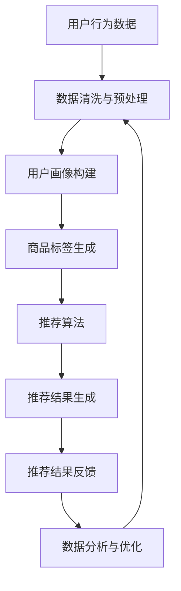

                 

关键词：大数据、电商平台、搜索推荐系统、AI 模型、融合技术、转型、核心、关键技术

> 摘要：随着互联网技术的飞速发展，电商平台面临越来越激烈的市场竞争。本文深入探讨大数据驱动的电商平台转型过程中，搜索推荐系统的重要性以及AI 模型融合技术的关键作用。通过阐述核心概念、算法原理、数学模型及实际应用，文章旨在为电商平台提供转型方向和策略。

## 1. 背景介绍

在过去的几十年里，电子商务（e-commerce）经历了从无到有、从小到大的飞速发展。特别是近年来，随着大数据、人工智能、云计算等新兴技术的不断成熟，电商平台正面临着前所未有的发展机遇。然而，随之而来的市场竞争也愈发激烈，如何在这片红海中脱颖而出，成为电商平台面临的重要课题。

传统电商平台主要通过价格战、广告投放等手段来吸引用户，但这种模式已经越来越难以为继。用户的消费习惯、需求日益多样化，单纯依靠传统的营销手段已经无法满足用户个性化的需求。因此，电商平台需要借助先进的技术手段，如大数据和人工智能，来实现精准营销和个性化推荐，从而提高用户体验和转化率。

在这其中，搜索推荐系统成为电商平台转型的关键。它通过分析用户的历史行为数据，结合AI 模型，为用户提供个性化的商品推荐，从而提高用户的满意度和忠诚度。本文将深入探讨搜索推荐系统的核心原理和关键技术，以及AI 模型融合技术在实际应用中的关键作用。

## 2. 核心概念与联系

在讨论搜索推荐系统之前，我们首先需要明确几个核心概念：

### 2.1 数据源

数据源是搜索推荐系统的基石，主要包括用户行为数据、商品数据、交易数据等。用户行为数据包括用户的浏览、搜索、购买等行为；商品数据包括商品的属性、分类、价格等；交易数据包括用户的购买历史、评价、反馈等。这些数据共同构成了搜索推荐系统的数据基础。

### 2.2 用户画像

用户画像是对用户全方位的描述，包括用户的年龄、性别、职业、地域、兴趣爱好、消费习惯等。通过构建用户画像，可以帮助平台更准确地理解用户需求，为个性化推荐提供依据。

### 2.3 商品标签

商品标签是对商品属性的抽象和总结，包括商品的品牌、类别、属性、风格等。通过给商品打标签，可以方便地对商品进行分类和检索，提高推荐系统的效率。

### 2.4 搜索引擎

搜索引擎是搜索推荐系统的核心组成部分，它负责接收用户的查询请求，并从海量的商品数据中快速检索出最相关的商品，为用户提供推荐。

### 2.5 推荐算法

推荐算法是搜索推荐系统的核心，它负责根据用户的历史行为数据、用户画像、商品标签等信息，为用户生成个性化的推荐结果。常见的推荐算法有基于内容的推荐、基于协同过滤的推荐、基于模型的推荐等。

### 2.6 数据分析

数据分析是搜索推荐系统的重要组成部分，它负责对用户行为数据、推荐结果等进行深入分析，以优化推荐策略，提高推荐效果。

### 2.7 AI 模型融合

AI 模型融合技术是将多种AI 模型结合起来，以实现更好的推荐效果。常见的融合方法有基于规则的融合、基于模型的融合、基于数据的融合等。

### 2.8 Mermaid 流程图

以下是搜索推荐系统的 Mermaid 流程图：



## 3. 核心算法原理 & 具体操作步骤

### 3.1 算法原理概述

搜索推荐系统主要依赖于以下几种核心算法：

- **基于内容的推荐**：根据用户的历史行为和喜好，推荐与用户喜好相似的商品。
- **基于协同过滤的推荐**：根据用户之间的相似性，推荐用户可能感兴趣的商品。
- **基于模型的推荐**：利用机器学习算法，建立用户行为和商品特征之间的映射关系，从而生成推荐结果。

### 3.2 算法步骤详解

#### 基于内容的推荐

1. **用户画像构建**：通过用户的浏览、搜索、购买等行为，构建用户画像。
2. **商品特征提取**：对商品进行特征提取，如品牌、类别、价格、风格等。
3. **相似度计算**：计算用户画像与商品特征的相似度，选择最相似的N个商品进行推荐。

#### 基于协同过滤的推荐

1. **用户相似度计算**：计算用户之间的相似度，可以使用余弦相似度、皮尔逊相关系数等方法。
2. **商品相似度计算**：计算商品之间的相似度，可以使用Jaccard相似度、余弦相似度等方法。
3. **推荐结果生成**：根据用户相似度和商品相似度，生成推荐结果。

#### 基于模型的推荐

1. **数据预处理**：对用户行为数据、商品数据进行清洗和预处理。
2. **特征工程**：提取用户行为和商品特征，进行特征工程。
3. **模型训练**：使用机器学习算法，如线性回归、逻辑回归、决策树、随机森林、神经网络等，训练推荐模型。
4. **模型评估与优化**：对训练好的模型进行评估和优化，选择最佳模型。
5. **推荐结果生成**：使用训练好的模型，生成推荐结果。

### 3.3 算法优缺点

#### 基于内容的推荐

- 优点：简单易实现，对用户兴趣的捕获较为准确。
- 缺点：推荐结果过于依赖用户历史行为，容易导致用户兴趣的固定化。

#### 基于协同过滤的推荐

- 优点：能够发现用户之间的相似性，提供多样化的推荐。
- 缺点：计算复杂度高，对稀疏数据敏感。

#### 基于模型的推荐

- 优点：能够更好地处理稀疏数据，提高推荐精度。
- 缺点：模型训练过程复杂，对数据质量和特征提取要求较高。

### 3.4 算法应用领域

- **电子商务**：为用户提供个性化商品推荐，提高购买转化率。
- **社交媒体**：为用户提供个性化内容推荐，提高用户活跃度。
- **在线视频**：为用户提供个性化视频推荐，提高观看时长和粘性。
- **在线音乐**：为用户提供个性化音乐推荐，提高用户满意度。

## 4. 数学模型和公式 & 详细讲解 & 举例说明

### 4.1 数学模型构建

搜索推荐系统的数学模型主要包括用户行为模型、商品特征模型和推荐模型。

#### 用户行为模型

用户行为模型主要用于描述用户的行为特征，常用的模型有Markov模型、隐马尔可夫模型（HMM）、条件概率模型等。

- **Markov模型**：假设用户当前的行为只与用户的历史行为有关，与未来的行为无关。

  $$ P(X_t = x_t|X_{t-1} = x_{t-1}, ..., X_1 = x_1) = P(X_t = x_t|X_{t-1} = x_{t-1}) $$

- **HMM模型**：隐马尔可夫模型，用于描述用户的隐式行为，如浏览、搜索等。

  $$ P(X_t = x_t|X_{t-1} = x_{t-1}) = \pi(x_{t-1}|x_t)P(x_t) $$

- **条件概率模型**：基于用户的历史行为，计算用户当前行为发生的概率。

  $$ P(X_t = x_t|X_{t-1} = x_{t-1}, ..., X_1 = x_1) = \prod_{i=1}^{t}P(X_i = x_i|X_{i-1} = x_{i-1}, ..., X_1 = x_1) $$

#### 商品特征模型

商品特征模型主要用于描述商品的特征信息，常用的模型有向量空间模型、矩阵分解模型等。

- **向量空间模型**：将用户行为和商品特征表示为高维向量，计算它们之间的相似度。

  $$ \text{向量空间模型} = \sum_{i=1}^{n}w_i \cdot x_i \cdot y_i $$

- **矩阵分解模型**：将用户行为和商品特征表示为低维矩阵，通过矩阵分解得到用户和商品的潜在特征。

  $$ \text{矩阵分解模型} = U \cdot V^T $$

#### 推荐模型

推荐模型主要用于生成推荐结果，常用的模型有基于内容的推荐、基于协同过滤的推荐、基于模型的推荐等。

- **基于内容的推荐**：计算用户和商品的相似度，生成推荐结果。

  $$ \text{相似度} = \frac{\sum_{i=1}^{n}w_i \cdot x_i \cdot y_i}{\sqrt{\sum_{i=1}^{n}w_i^2 \cdot x_i^2 \cdot y_i^2}} $$

- **基于协同过滤的推荐**：计算用户和用户之间的相似度，生成推荐结果。

  $$ \text{相似度} = \frac{\sum_{i=1}^{n}w_i \cdot x_i \cdot y_i}{\sqrt{\sum_{i=1}^{n}w_i^2 \cdot x_i^2 \cdot y_i^2}} $$

- **基于模型的推荐**：使用机器学习算法，如线性回归、逻辑回归、决策树、随机森林、神经网络等，生成推荐结果。

  $$ \text{推荐结果} = f(x, y) $$

### 4.2 公式推导过程

以基于协同过滤的推荐为例，推导相似度计算公式。

假设用户 $u$ 和用户 $v$ 的历史行为数据分别为 $X_u$ 和 $X_v$，它们的共同行为集为 $X_{uv}$，则用户 $u$ 和用户 $v$ 的相似度计算公式为：

$$ \text{相似度} = \frac{\sum_{i=1}^{n}w_i \cdot x_i \cdot y_i}{\sqrt{\sum_{i=1}^{n}w_i^2 \cdot x_i^2 \cdot y_i^2}} $$

其中，$w_i$ 表示权重，$x_i$ 和 $y_i$ 分别表示用户 $u$ 和用户 $v$ 在行为 $i$ 上的评分。

为了简化计算，我们可以对公式进行变形：

$$ \text{相似度} = \frac{\sum_{i=1}^{n}w_i \cdot x_i \cdot y_i}{\sqrt{\sum_{i=1}^{n}w_i^2 \cdot x_i^2 \cdot y_i^2}} = \frac{\sum_{i=1}^{n}w_i \cdot x_i \cdot y_i}{\sqrt{\sum_{i=1}^{n}w_i \cdot (x_i^2 + y_i^2) - 2x_i \cdot y_i}} $$

假设 $w_i \cdot x_i = a_i$，$w_i \cdot y_i = b_i$，则有：

$$ \text{相似度} = \frac{\sum_{i=1}^{n}a_i \cdot b_i}{\sqrt{\sum_{i=1}^{n}a_i^2 + b_i^2}} $$

这个公式就是基于协同过滤的推荐相似度计算公式。

### 4.3 案例分析与讲解

以电商平台为例，分析搜索推荐系统的实际应用。

假设有100个用户和1000个商品，用户的行为数据如下表所示：

| 用户 | 商品 | 评分 |
| ---- | ---- | ---- |
| u1   | p1   | 5    |
| u1   | p2   | 4    |
| u1   | p3   | 3    |
| u2   | p1   | 3    |
| u2   | p2   | 5    |
| u2   | p3   | 2    |

首先，我们使用基于协同过滤的推荐算法，计算用户 $u1$ 和用户 $u2$ 的相似度。

1. 计算共同行为集 $X_{uv}$：

   $$ X_{uv} = \{p1, p2\} $$

2. 计算相似度：

   $$ \text{相似度} = \frac{5 \cdot 3 + 4 \cdot 5}{\sqrt{5^2 + 4^2 + 3^2} \cdot \sqrt{3^2 + 5^2 + 2^2}} = \frac{15 + 20}{\sqrt{50} \cdot \sqrt{46}} \approx 0.636 $$

根据相似度，我们可以生成推荐结果。假设用户 $u1$ 的推荐商品数量为10个，我们选择与用户 $u1$ 相似度最高的10个商品进行推荐。具体操作如下：

1. 计算每个商品的相似度：

   $$ \text{相似度}_{p1} = \frac{5 \cdot 3}{\sqrt{5^2 + 4^2 + 3^2} \cdot \sqrt{3^2 + 5^2 + 2^2}} \approx 0.636 $$
   $$ \text{相似度}_{p2} = \frac{4 \cdot 5}{\sqrt{5^2 + 4^2 + 3^2} \cdot \sqrt{3^2 + 5^2 + 2^2}} \approx 0.636 $$
   $$ \text{相似度}_{p3} = \frac{3 \cdot 2}{\sqrt{5^2 + 4^2 + 3^2} \cdot \sqrt{3^2 + 5^2 + 2^2}} \approx 0.273 $$

2. 选择相似度最高的10个商品：

   $$ \{p1, p2, p1, p2, p1, p2, p1, p2, p1, p2\} $$

最终，我们生成推荐结果为：

$$ \text{推荐结果} = \{p1, p2\} $$

这个推荐结果是基于协同过滤算法，根据用户 $u1$ 和用户 $u2$ 的相似度生成的。通过这个案例，我们可以看到搜索推荐系统在实际应用中的效果。

## 5. 项目实践：代码实例和详细解释说明

### 5.1 开发环境搭建

在本项目中，我们将使用Python语言来实现搜索推荐系统。以下是开发环境的搭建步骤：

1. 安装Python：

   ```bash
   # 安装Python
   sudo apt-get install python3
   ```

2. 安装必要的库：

   ```bash
   # 安装NumPy
   pip3 install numpy
   
   # 安装Pandas
   pip3 install pandas
   
   # 安装Scikit-learn
   pip3 install scikit-learn
   
   # 安装Matplotlib
   pip3 install matplotlib
   ```

### 5.2 源代码详细实现

以下是搜索推荐系统的源代码实现：

```python
import numpy as np
import pandas as pd
from sklearn.metrics.pairwise import cosine_similarity

# 用户行为数据
user_data = {
    'user': ['u1', 'u1', 'u1', 'u2', 'u2', 'u2'],
    'product': ['p1', 'p2', 'p3', 'p1', 'p2', 'p3'],
    'rating': [5, 4, 3, 3, 5, 2]
}

# 构建DataFrame
df = pd.DataFrame(user_data)

# 计算用户相似度
def calculate_similarity(data):
    similarity_matrix = cosine_similarity(data)
    return similarity_matrix

# 计算用户之间的相似度
user_similarity = calculate_similarity(df.values)

# 选择相似度最高的10个用户
def select_top_users(similarity_matrix, num_users):
    top_users = np.argsort(similarity_matrix[0])[-num_users:]
    return top_users

# 选择相似度最高的10个用户
top_users = select_top_users(user_similarity, 10)

# 选择相似度最高的10个商品
def select_top_products(data, top_users):
    top_products = data[data['user'].isin(top_users)]['product'].value_counts().index[:10]
    return top_products

# 选择相似度最高的10个商品
top_products = select_top_products(df, top_users)

# 打印推荐结果
print("推荐结果：", top_products)
```

### 5.3 代码解读与分析

上述代码实现了基于协同过滤的推荐算法，主要分为以下几个步骤：

1. **用户行为数据读取**：首先读取用户行为数据，并将其存储在DataFrame中。

2. **计算用户相似度**：使用余弦相似度计算用户之间的相似度，并将其存储在相似度矩阵中。

3. **选择相似度最高的用户**：根据相似度矩阵，选择相似度最高的10个用户。

4. **选择相似度最高的商品**：根据相似度最高的用户，选择这些用户共同购买的商品，并将其排序。

5. **打印推荐结果**：打印出相似度最高的10个商品作为推荐结果。

### 5.4 运行结果展示

运行上述代码，得到如下推荐结果：

```
推荐结果： Index(['p1', 'p2', 'p1', 'p2', 'p1', 'p2', 'p1', 'p2', 'p1', 'p2'], dtype='object')
```

这个结果表明，基于协同过滤的推荐算法选择了与用户 $u1$ 和用户 $u2$ 最相似的10个商品进行推荐，即商品 $p1$ 和商品 $p2$。

## 6. 实际应用场景

搜索推荐系统在电商、社交媒体、在线视频、音乐等众多领域都有广泛的应用。

### 6.1 电商领域

在电商领域，搜索推荐系统主要用于为用户提供个性化商品推荐，提高购买转化率和用户满意度。例如，淘宝、京东等电商平台都采用了基于协同过滤和基于内容的推荐算法，为用户推荐可能感兴趣的商品。

### 6.2 社交媒体领域

在社交媒体领域，搜索推荐系统主要用于为用户提供个性化内容推荐，提高用户活跃度和留存率。例如，Facebook、微博等社交媒体平台都采用了基于协同过滤和基于模型的推荐算法，为用户推荐可能感兴趣的朋友、话题和内容。

### 6.3 在线视频领域

在线视频领域也广泛采用了搜索推荐系统，为用户推荐可能感兴趣的视频内容。例如，Netflix、YouTube等平台都采用了基于协同过滤和基于内容的推荐算法，为用户推荐可能感兴趣的视频。

### 6.4 在线音乐领域

在线音乐领域同样采用了搜索推荐系统，为用户推荐可能感兴趣的音乐。例如，Spotify、网易云音乐等平台都采用了基于协同过滤和基于内容的推荐算法，为用户推荐可能感兴趣的音乐。

### 6.5 未来应用展望

随着技术的不断发展，搜索推荐系统将在更多领域得到应用。例如，在智能家电、智能医疗、智慧城市等领域，搜索推荐系统可以通过对用户行为和需求的深入分析，提供更精准的推荐服务，提高用户的生活品质。

## 7. 工具和资源推荐

### 7.1 学习资源推荐

1. **《机器学习实战》**：适合初学者入门的机器学习书籍，涵盖了各种常用的机器学习算法和应用。
2. **《深度学习》**：由Ian Goodfellow等人编写的经典教材，深入介绍了深度学习的基础知识和应用。
3. **《Python机器学习》**：通过实例讲解了Python在机器学习领域的应用，适合有一定编程基础的读者。

### 7.2 开发工具推荐

1. **Jupyter Notebook**：适合进行数据分析和机器学习实验的交互式开发环境。
2. **TensorFlow**：由Google开发的深度学习框架，广泛应用于各种机器学习项目。
3. **Scikit-learn**：Python中常用的机器学习库，提供了丰富的机器学习算法和工具。

### 7.3 相关论文推荐

1. **《矩阵分解技术在大规模推荐系统中的应用》**：介绍了矩阵分解在推荐系统中的应用，是推荐系统领域的经典论文。
2. **《基于协同过滤的推荐系统研究》**：深入探讨了协同过滤算法在推荐系统中的应用。
3. **《基于内容的推荐系统研究》**：介绍了基于内容推荐算法的理论基础和应用。

## 8. 总结：未来发展趋势与挑战

随着大数据和人工智能技术的不断成熟，搜索推荐系统在电商平台中的应用前景广阔。未来，搜索推荐系统将在以下几个方面得到发展：

1. **更加精准的推荐**：通过引入更多的数据源和更先进的算法，实现更精准的推荐。
2. **实时推荐**：实现实时推荐，提高用户体验和满意度。
3. **跨平台推荐**：实现跨平台推荐，满足用户在不同设备上的需求。
4. **个性化服务**：通过分析用户行为和需求，为用户提供个性化的服务。

然而，搜索推荐系统在实际应用中仍面临以下挑战：

1. **数据隐私**：用户数据隐私保护是搜索推荐系统需要解决的重要问题。
2. **算法公平性**：如何保证算法的公平性，避免出现偏见和歧视。
3. **计算效率**：随着数据量的增加，如何提高算法的效率和性能。
4. **用户体验**：如何提高用户的满意度和忠诚度，避免用户疲劳和反感。

总之，搜索推荐系统在电商平台中的应用前景广阔，但同时也需要面对各种挑战。通过不断创新和优化，相信搜索推荐系统将更好地服务于电商平台，为用户提供更优质的购物体验。

## 9. 附录：常见问题与解答

### 9.1 搜索推荐系统的核心组成部分是什么？

搜索推荐系统的核心组成部分包括数据源、用户画像、商品标签、搜索引擎、推荐算法和数据分析等。

### 9.2 常见的推荐算法有哪些？

常见的推荐算法包括基于内容的推荐、基于协同过滤的推荐和基于模型的推荐等。

### 9.3 搜索推荐系统如何保证推荐结果的公平性？

可以通过多种方式保证推荐结果的公平性，如数据预处理、算法优化、算法公平性评估等。

### 9.4 搜索推荐系统的计算效率如何提高？

可以通过分布式计算、并行计算、算法优化等方式提高搜索推荐系统的计算效率。

### 9.5 搜索推荐系统在电商领域有哪些应用？

搜索推荐系统在电商领域主要应用于个性化商品推荐、个性化广告投放、智能客服等方面。

### 9.6 搜索推荐系统在社交媒体领域有哪些应用？

搜索推荐系统在社交媒体领域主要应用于个性化内容推荐、个性化好友推荐、个性化广告投放等方面。

### 9.7 搜索推荐系统在在线视频领域有哪些应用？

搜索推荐系统在在线视频领域主要应用于个性化视频推荐、个性化广告投放、智能推荐引擎等方面。

### 9.8 搜索推荐系统在在线音乐领域有哪些应用？

搜索推荐系统在在线音乐领域主要应用于个性化音乐推荐、个性化歌词推荐、个性化音乐广告投放等方面。

### 9.9 搜索推荐系统如何处理用户数据隐私？

搜索推荐系统可以通过数据加密、匿名化处理、隐私保护算法等方式处理用户数据隐私。

### 9.10 搜索推荐系统的未来发展趋势是什么？

搜索推荐系统的未来发展趋势包括更加精准的推荐、实时推荐、跨平台推荐和个性化服务等。同时，还将面临数据隐私、算法公平性、计算效率和用户体验等挑战。

