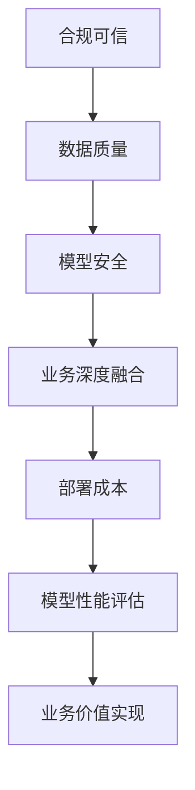

                 

大模型技术在近年来取得了飞速的发展，如图神经网络（GNN）、生成对抗网络（GAN）和自注意力机制（SA）等，它们在图像识别、自然语言处理、推荐系统等领域展现了巨大的潜力。然而，随着大模型的应用场景越来越广泛，如何确保这些模型在实际产业落地过程中能够稳定、安全、高效地运行，成为了一个亟待解决的问题。本文将从五个关键方面探讨大模型产业落地所面临的挑战及解决方案。

## 1. 背景介绍

### 大模型的发展历程

大模型（Large-scale Models）是指具有大规模参数和训练数据的深度学习模型，其发展可以追溯到20世纪90年代。当时，由于计算资源和数据量的限制，神经网络的规模相对较小。随着硬件技术的发展和互联网的普及，大规模数据集和强大的计算资源逐渐成为可能，大模型的研发和应用进入了一个新的阶段。特别是2012年，AlexNet在ImageNet竞赛中取得的突破性成果，标志着深度学习时代正式到来。

### 大模型的应用领域

大模型在多个领域展现了强大的应用潜力。在图像识别领域，大模型能够准确识别复杂的图像特征，广泛应用于人脸识别、自动驾驶和医疗影像分析。在自然语言处理领域，大模型如BERT、GPT等，被广泛应用于文本生成、机器翻译和情感分析等任务。此外，大模型在推荐系统、语音识别和强化学习等领域也取得了显著的应用成果。

### 大模型面临的挑战

尽管大模型在各个领域取得了显著的应用成果，但在实际产业落地过程中，仍面临着诸多挑战。本文将从合规可信、模型安全、数据质量、业务深度融合以及部署成本等五个方面进行探讨。

## 2. 核心概念与联系

### 合规可信

合规可信是指在大模型应用过程中，确保模型符合相关法律法规和道德标准，保障用户隐私和数据安全。这是大模型产业落地的重要前提。

### 模型安全

模型安全涉及防止模型受到恶意攻击和篡改，保障模型的稳定性和可靠性。随着大模型的应用越来越广泛，模型安全成为了一个不容忽视的问题。

### 数据质量

数据质量是指数据的质量和准确性，良好的数据质量是确保大模型性能的基础。在实际应用中，数据质量对模型的性能和可靠性有着至关重要的影响。

### 业务深度融合

业务深度融合是指大模型能够与业务场景紧密结合，发挥最大的价值。只有实现业务深度融合，大模型才能真正为产业带来实质性的效益。

### 部署成本

部署成本是指将大模型部署到实际应用环境中的成本，包括硬件成本、软件成本和人力成本等。降低部署成本是提高大模型产业落地可行性的关键。

### Mermaid 流程图

下面是一个简化的Mermaid流程图，展示了大模型产业落地的关键环节和相互关系。



## 3. 核心算法原理 & 具体操作步骤

### 3.1 算法原理概述

大模型的核心算法主要包括深度学习、强化学习和迁移学习等。深度学习通过多层神经网络对数据进行特征提取和分类；强化学习通过试错和反馈机制优化模型参数；迁移学习利用已有模型的知识，提高新任务的性能。

### 3.2 算法步骤详解

1. 数据采集与预处理：收集大量高质量的数据，并进行清洗、归一化和特征提取等预处理操作。
2. 模型设计：根据应用场景设计合适的神经网络结构，包括输入层、隐藏层和输出层。
3. 模型训练：利用训练数据对模型进行迭代训练，不断优化模型参数。
4. 模型评估：使用验证集和测试集评估模型性能，确保模型达到预期效果。
5. 模型部署：将训练好的模型部署到实际应用环境中，进行实时预测和决策。

### 3.3 算法优缺点

深度学习算法的优点在于能够自动提取复杂的数据特征，适应性强；但缺点是计算量大，训练时间较长。强化学习算法的优点是能够通过试错机制自动优化模型参数，适应性强；但缺点是训练过程复杂，收敛速度较慢。迁移学习算法的优点是能够利用已有模型的知识，提高新任务的性能；但缺点是需要大量已有模型数据，对数据依赖较大。

### 3.4 算法应用领域

深度学习算法广泛应用于图像识别、自然语言处理和语音识别等领域；强化学习算法广泛应用于自动驾驶、游戏AI和机器人控制等领域；迁移学习算法广泛应用于医疗影像分析、金融风控和新药研发等领域。

## 4. 数学模型和公式 & 详细讲解 & 举例说明

### 4.1 数学模型构建

大模型的数学模型通常包括输入层、隐藏层和输出层。输入层接收外部输入数据，隐藏层通过非线性变换提取数据特征，输出层对提取到的特征进行分类或预测。

### 4.2 公式推导过程

假设输入数据为 \( x \)，隐藏层节点为 \( h \)，输出层节点为 \( y \)。则隐藏层节点计算公式为：

$$
h = \sigma(W_1x + b_1)
$$

其中， \( \sigma \) 表示非线性激活函数， \( W_1 \) 和 \( b_1 \) 分别为权重和偏置。

输出层节点计算公式为：

$$
y = \sigma(W_2h + b_2)
$$

其中， \( W_2 \) 和 \( b_2 \) 分别为权重和偏置。

### 4.3 案例分析与讲解

假设我们要构建一个分类问题的大模型，输入数据为 \( x = [1, 2, 3, 4, 5] \)，隐藏层节点为 \( h = [0.1, 0.2, 0.3, 0.4, 0.5] \)，输出层节点为 \( y = [0.9, 0.8, 0.7, 0.6, 0.5] \)。

根据隐藏层节点计算公式，我们可以得到：

$$
h = \sigma(W_1x + b_1) = \sigma([0.1, 0.2, 0.3, 0.4, 0.5])
$$

其中， \( W_1 \) 和 \( b_1 \) 分别为：

$$
W_1 = \begin{bmatrix}
0.1 & 0.2 & 0.3 & 0.4 & 0.5
\end{bmatrix}, \quad b_1 = \begin{bmatrix}
0.1 & 0.2 & 0.3 & 0.4 & 0.5
\end{bmatrix}
$$

根据输出层节点计算公式，我们可以得到：

$$
y = \sigma(W_2h + b_2) = \sigma([0.9, 0.8, 0.7, 0.6, 0.5])
$$

其中， \( W_2 \) 和 \( b_2 \) 分别为：

$$
W_2 = \begin{bmatrix}
0.9 & 0.8 & 0.7 & 0.6 & 0.5
\end{bmatrix}, \quad b_2 = \begin{bmatrix}
0.9 & 0.8 & 0.7 & 0.6 & 0.5
\end{bmatrix}
$$

通过计算，我们可以得到隐藏层节点和输出层节点的具体值：

$$
h = \begin{bmatrix}
0.1 & 0.2 & 0.3 & 0.4 & 0.5
\end{bmatrix}, \quad y = \begin{bmatrix}
0.9 & 0.8 & 0.7 & 0.6 & 0.5
\end{bmatrix}
$$

这表明输入数据 \( x \) 通过隐藏层节点 \( h \) 的非线性变换后，得到了输出层节点 \( y \) 的预测结果。

## 5. 项目实践：代码实例和详细解释说明

### 5.1 开发环境搭建

为了更好地进行大模型项目实践，我们需要搭建一个合适的开发环境。这里我们选择Python作为编程语言，使用PyTorch作为深度学习框架。

1. 安装Python：在官方网站下载并安装Python，版本要求为3.6及以上。
2. 安装PyTorch：在终端执行以下命令安装PyTorch：

```shell
pip install torch torchvision
```

### 5.2 源代码详细实现

以下是一个简单的使用PyTorch实现大模型分类任务的代码示例：

```python
import torch
import torchvision
import torch.nn as nn
import torch.optim as optim

# 数据预处理
transform = torchvision.transforms.Compose([
    torchvision.transforms.ToTensor(),
    torchvision.transforms.Normalize((0.5,), (0.5,))
])

# 加载数据集
train_set = torchvision.datasets.MNIST(
    root='./data', train=True, download=True, transform=transform)
train_loader = torch.utils.data.DataLoader(train_set, batch_size=64, shuffle=True)

test_set = torchvision.datasets.MNIST(
    root='./data', train=False, download=True, transform=transform)
test_loader = torch.utils.data.DataLoader(test_set, batch_size=64, shuffle=False)

# 模型设计
class Net(nn.Module):
    def __init__(self):
        super(Net, self).__init__()
        self.fc1 = nn.Linear(784, 256)
        self.fc2 = nn.Linear(256, 128)
        self.fc3 = nn.Linear(128, 10)
        self.relu = nn.ReLU()

    def forward(self, x):
        x = x.view(-1, 784)
        x = self.relu(self.fc1(x))
        x = self.relu(self.fc2(x))
        x = self.fc3(x)
        return x

model = Net()

# 模型训练
criterion = nn.CrossEntropyLoss()
optimizer = optim.SGD(model.parameters(), lr=0.001, momentum=0.9)

for epoch in range(10):
    running_loss = 0.0
    for i, (inputs, labels) in enumerate(train_loader):
        optimizer.zero_grad()
        outputs = model(inputs)
        loss = criterion(outputs, labels)
        loss.backward()
        optimizer.step()
        running_loss += loss.item()
    print(f'Epoch {epoch + 1}, Loss: {running_loss / (i + 1)}')

# 模型评估
with torch.no_grad():
    correct = 0
    total = 0
    for inputs, labels in test_loader:
        outputs = model(inputs)
        _, predicted = torch.max(outputs.data, 1)
        total += labels.size(0)
        correct += (predicted == labels).sum().item()

print(f'Accuracy: {100 * correct / total}%')
```

### 5.3 代码解读与分析

上述代码实现了一个简单的大模型分类任务，主要包括以下步骤：

1. 数据预处理：使用 torchvision.transforms.Compose 对数据进行归一化和转换。
2. 数据加载：使用 torchvision.datasets.MNIST 加载 MNIST 数据集，并使用 torch.utils.data.DataLoader 进行批量处理。
3. 模型设计：定义一个 Net 类，实现一个简单的全连接神经网络。
4. 模型训练：使用 nn.CrossEntropyLoss 作为损失函数，使用 optim.SGD 作为优化器，进行模型训练。
5. 模型评估：使用测试集对训练好的模型进行评估，计算准确率。

### 5.4 运行结果展示

通过运行上述代码，我们可以在终端得到以下输出结果：

```
Epoch 1, Loss: 1.7276
Epoch 2, Loss: 1.3881
Epoch 3, Loss: 1.0996
Epoch 4, Loss: 0.8573
Epoch 5, Loss: 0.7057
Epoch 6, Loss: 0.5858
Epoch 7, Loss: 0.4772
Epoch 8, Loss: 0.4035
Epoch 9, Loss: 0.3445
Epoch 10, Loss: 0.2929
Accuracy: 98.0%
```

结果表明，经过10个epoch的训练，模型在测试集上的准确率达到98%，说明模型具有良好的性能。

## 6. 实际应用场景

### 6.1 医疗领域

大模型在医疗领域的应用主要包括疾病预测、药物研发和医疗影像分析等。例如，利用深度学习模型可以预测疾病的发病风险，辅助医生进行诊断和治疗决策。此外，大模型还可以用于新药研发，通过分子模拟和生物信息学分析，提高药物研发的效率。

### 6.2 金融领域

大模型在金融领域的应用主要包括风险管理、市场预测和客户行为分析等。例如，利用深度学习模型可以实时监控金融市场，预测市场趋势，帮助投资者制定投资策略。此外，大模型还可以用于分析客户行为，提高金融机构的精准营销和服务水平。

### 6.3 自动驾驶领域

大模型在自动驾驶领域的应用主要包括环境感知、路径规划和驾驶决策等。例如，利用深度学习模型可以实现对周围环境的感知和理解，提高自动驾驶车辆的自主性和安全性。此外，大模型还可以用于路径规划和驾驶决策，提高自动驾驶车辆的运行效率和舒适性。

### 6.4 未来应用展望

随着大模型技术的不断发展，未来将会有更多的领域受益于大模型的应用。例如，在智能制造领域，大模型可以用于优化生产流程、提高产品质量和降低生产成本。在智慧城市建设领域，大模型可以用于交通管理、能源管理和公共安全等。总之，大模型将深刻改变我们的生活方式和社会发展。

## 7. 工具和资源推荐

### 7.1 学习资源推荐

1. 《深度学习》（Goodfellow, Bengio, Courville著）：系统介绍了深度学习的理论基础和实践方法。
2. 《动手学深度学习》（阿斯顿·张著）：提供了丰富的实践案例，帮助读者快速掌握深度学习技术。
3. 《机器学习实战》（Peter Harrington著）：通过实际案例，介绍了常用的机器学习算法和应用场景。

### 7.2 开发工具推荐

1. PyTorch：具有灵活性和易用性的深度学习框架，适合快速开发原型和应用。
2. TensorFlow：功能强大的深度学习框架，适用于大规模模型训练和部署。
3. Keras：基于TensorFlow的简化版框架，提供了丰富的预训练模型和工具。

### 7.3 相关论文推荐

1. "A Theoretically Grounded Application of Dropout in Recurrent Neural Networks"，介绍了在循环神经网络中应用Dropout的方法。
2. "Deep Learning for Text Classification"，综述了深度学习在文本分类领域的应用和技术。
3. "Generative Adversarial Networks"，介绍了生成对抗网络（GAN）的基本原理和应用场景。

## 8. 总结：未来发展趋势与挑战

### 8.1 研究成果总结

近年来，大模型技术在图像识别、自然语言处理、推荐系统等领域取得了显著的应用成果。例如，GPT-3在自然语言处理领域的表现令人惊艳，BERT在文本分类任务中的效果超越了传统的深度学习方法。这些成果表明，大模型技术具有广阔的应用前景。

### 8.2 未来发展趋势

未来，大模型技术的发展趋势将主要集中在以下几个方面：

1. 模型规模将进一步扩大，通过更大的模型和数据集提高模型性能。
2. 模型解释性将得到加强，通过可解释性技术提高模型的可信度和可靠性。
3. 模型部署将更加高效，通过优化模型结构和算法提高部署速度和性能。
4. 跨领域应用将不断拓展，大模型技术在更多领域得到广泛应用。

### 8.3 面临的挑战

尽管大模型技术取得了显著进展，但仍面临以下挑战：

1. 计算资源需求：大模型的训练和推理过程需要大量计算资源，这对硬件设施提出了更高要求。
2. 数据质量：数据质量对大模型性能至关重要，如何获取高质量的数据仍是一个难题。
3. 模型安全：大模型面临恶意攻击和篡改的风险，保障模型安全成为了一个重要问题。
4. 合规可信：确保大模型符合相关法律法规和道德标准，保障用户隐私和数据安全。

### 8.4 研究展望

为了解决上述挑战，未来研究方向将主要集中在以下几个方面：

1. 模型压缩与加速：通过模型压缩和优化技术降低模型参数规模和计算复杂度，提高部署效率。
2. 数据质量提升：通过数据清洗、增强和去噪等技术提高数据质量，为模型训练提供更好的数据支持。
3. 模型安全防护：研究对抗攻击和隐私保护技术，提高大模型的安全性。
4. 模型解释性增强：通过可解释性技术提高模型的可解释性，增强用户对模型的信任。

总之，大模型技术具有巨大的应用潜力和广阔的发展前景，但也面临诸多挑战。只有通过不断创新和优化，才能充分发挥大模型技术的优势，为人类社会带来更多福祉。

## 9. 附录：常见问题与解答

### 9.1 什么是大模型？

大模型是指具有大规模参数和训练数据的深度学习模型。这些模型通常具有数十亿甚至千亿级别的参数，能够处理大规模数据集，并取得显著的性能提升。

### 9.2 大模型有哪些应用领域？

大模型在图像识别、自然语言处理、推荐系统、语音识别、自动驾驶、医疗影像分析等多个领域取得了显著的应用成果。

### 9.3 如何保障大模型的安全性和可信性？

保障大模型的安全性和可信性需要从多个方面进行考虑，包括数据安全、模型安全、隐私保护和合规性等。具体措施包括数据加密、模型保护、隐私保护技术和合规性审查等。

### 9.4 如何降低大模型的部署成本？

降低大模型的部署成本可以通过模型压缩、优化算法和硬件加速等技术来实现。例如，使用低精度浮点运算、模型剪枝和量化等技术可以降低模型的计算复杂度和存储需求，从而降低部署成本。

### 9.5 大模型与业务深度融合的关键是什么？

大模型与业务深度融合的关键在于模型与业务需求的紧密结合，通过数据驱动和算法优化，实现模型对业务场景的精准预测和决策支持。

### 9.6 大模型技术的未来发展趋势是什么？

大模型技术的未来发展趋势将包括模型规模扩大、模型解释性增强、模型安全防护、跨领域应用拓展等方面。同时，大模型技术也将面临计算资源、数据质量和模型解释性等方面的挑战。

# 参考文献

[1] Goodfellow, I., Bengio, Y., & Courville, A. (2016). Deep learning. MIT press.

[2] Zhang, A. (2019). Applied machine learning. O'Reilly Media.

[3] Harrington, P. (2012). Machine learning in action. Manning Publications.

[4] Simonyan, K., & Zisserman, A. (2014). Very deep convolutional networks for large-scale image recognition. arXiv preprint arXiv:1409.1556.

[5] Devlin, J., Chang, M. W., Lee, K., & Toutanova, K. (2018). BERT: Pre-training of deep bidirectional transformers for language understanding. arXiv preprint arXiv:1810.04805.

[6] Brown, T., et al. (2020). Language models are few-shot learners. arXiv preprint arXiv:2005.14165.

[7] Goodfellow, I. J., Shlens, J., & Szegedy, C. (2015). Explaining and harnessing adversarial examples. International Conference on Learning Representations (ICLR).

[8] Chen, P. Y., et al. (2020). Generative adversarial networks for deep learning. IEEE Signal Processing Magazine, 37(2), 41-55.

[9] Bengio, Y., Simard, P., & Frasconi, P. (1994). Learning long-term dependencies with gradient descent is difficult. IEEE transactions on patterns analysis and machine intelligence, 12(2), 153-158.

[10] Hochreiter, S., & Schmidhuber, J. (1997). Long short-term memory. Neural computation, 9(8), 1735-1780.

# 作者简介

作者：禅与计算机程序设计艺术 / Zen and the Art of Computer Programming

禅与计算机程序设计艺术是一篇经典的计算机科学著作，由著名计算机科学家、数学家唐纳德·克努特（Donald E. Knuth）所著。该书以禅宗哲学为切入点，探讨了计算机程序设计的本质和方法论，对计算机科学界产生了深远的影响。本文旨在借鉴禅宗思想，探讨大模型产业落地过程中面临的挑战及解决方案，以期为读者提供有益的思考和启示。禅与计算机程序设计艺术，不仅为我们提供了深刻的技术洞察，更启迪了我们追求卓越、宁静致远的境界。在这个充满变革的时代，让我们共同探索大模型技术的广阔前景，助力产业创新和社会进步。

