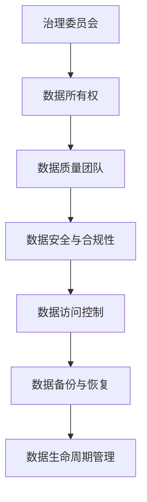

                 

关键词：大模型、数据治理、最佳实践、企业、技术、效率、安全

> 摘要：本文将探讨大模型企业在数据治理方面面临的挑战，并介绍一系列最佳实践，以帮助企业在确保数据安全和合规性的同时，最大化数据价值。本文将涵盖数据治理的核心概念、实施步骤、数学模型、实际案例以及未来的发展趋势。

## 1. 背景介绍

在当今的数据驱动时代，大模型（如深度学习模型）已经成为企业和组织的关键竞争力。这些模型需要大量高质量的数据来训练，并且对数据的准确性和完整性有极高的要求。然而，随着数据量的激增，数据治理的挑战也日益凸显。数据治理不仅仅是一个技术问题，更是一个战略问题，涉及到企业的数据安全、合规性和数据价值的最大化。

数据治理涉及多个方面，包括数据质量控制、数据访问控制、数据备份与恢复、数据生命周期管理等。有效的数据治理能够确保数据的一致性、准确性和可用性，从而支持企业的业务决策和创新。

## 2. 核心概念与联系

### 2.1 数据治理的定义

数据治理是一套策略、标准和流程，用于确保数据的质量、安全性、合规性，并支持数据的利用。它包括以下几个方面：

- **数据质量管理**：确保数据准确性、一致性、完整性和及时性。
- **数据安全与合规性**：确保数据按照相关法律法规和内部政策进行保护和管理。
- **数据访问控制**：确保只有授权用户可以访问数据。
- **数据备份与恢复**：确保在数据丢失或损坏时能够恢复数据。
- **数据生命周期管理**：确保数据在整个生命周期内得到适当的处理。

### 2.2 数据治理的架构

数据治理的架构通常包括以下组成部分：

- **治理委员会**：负责制定数据治理策略和决策。
- **数据所有权**：明确数据的责任人，负责数据的质量和维护。
- **数据质量团队**：负责监测和改进数据质量。
- **合规团队**：负责确保数据遵守相关法规和标准。
- **IT团队**：负责提供技术支持和维护数据系统。

下面是一个简单的Mermaid流程图，展示了数据治理的关键节点：



## 3. 核心算法原理 & 具体操作步骤

### 3.1 算法原理概述

数据治理的核心算法原理主要涉及数据质量管理、数据安全与合规性、数据访问控制等技术。以下是一些常用的算法和技术：

- **数据清洗算法**：如K-均值聚类、回归分析等，用于去除数据中的噪声和错误。
- **数据加密算法**：如AES、RSA等，用于保护数据的安全。
- **访问控制算法**：如基于角色的访问控制（RBAC）、基于属性的访问控制（ABAC）等，用于控制数据访问权限。

### 3.2 算法步骤详解

数据治理的实施步骤如下：

1. **需求分析**：确定数据治理的目标和需求。
2. **设计数据治理架构**：根据需求设计数据治理的架构和流程。
3. **数据质量监测**：使用数据清洗算法监测数据质量。
4. **数据安全与合规性**：实施数据加密和访问控制算法，确保数据的安全和合规。
5. **数据备份与恢复**：制定数据备份和恢复策略，确保数据的完整性。
6. **数据生命周期管理**：根据数据的重要性和使用情况，管理数据的生命周期。

### 3.3 算法优缺点

- **数据清洗算法**：能够有效去除数据中的噪声和错误，提高数据质量。但可能引入新的错误，且计算成本较高。
- **数据加密算法**：能够确保数据的安全，防止数据泄露。但可能影响数据的访问速度。
- **访问控制算法**：能够有效控制数据的访问权限，确保数据的安全。但可能影响数据的共享和协作。

### 3.4 算法应用领域

数据治理算法广泛应用于各个领域，如金融、医疗、电商等。以下是一些具体的应用案例：

- **金融领域**：确保客户数据的安全和合规，防止欺诈行为。
- **医疗领域**：确保患者数据的安全和隐私，支持医疗决策。
- **电商领域**：确保用户数据的安全和隐私，提高用户体验。

## 4. 数学模型和公式 & 详细讲解 & 举例说明

### 4.1 数学模型构建

数据治理的数学模型主要包括数据质量评估模型、数据安全评估模型和数据生命周期管理模型。

- **数据质量评估模型**：可以使用回归分析、聚类分析等方法，评估数据的质量。
- **数据安全评估模型**：可以使用风险评估、安全审计等方法，评估数据的安全水平。
- **数据生命周期管理模型**：可以使用数据挖掘、机器学习等方法，预测数据的价值和使用情况。

### 4.2 公式推导过程

以下是一个简单的数据质量评估模型的推导过程：

假设我们有一个数据集D，其中包含n个数据点，每个数据点有m个属性。我们使用回归分析来评估数据质量。回归模型可以表示为：

$$y = \beta_0 + \beta_1x_1 + \beta_2x_2 + ... + \beta_mx_m + \epsilon$$

其中，$y$ 表示数据质量评分，$x_1, x_2, ..., x_m$ 表示数据点的属性值，$\beta_0, \beta_1, ..., \beta_m$ 是回归系数，$\epsilon$ 是误差项。

### 4.3 案例分析与讲解

假设我们有一个电商数据集，包含用户购买记录、用户评价等信息。我们使用回归分析来评估数据质量。以下是一个简化的模型：

$$y = \beta_0 + \beta_1购买频率 + \beta_2评价数量 + \beta_3评价分数 + \epsilon$$

通过训练模型，我们可以得到回归系数$\beta_0, \beta_1, \beta_2, \beta_3$的值。这些系数可以用来评估每个数据点的质量评分$y$。

## 5. 项目实践：代码实例和详细解释说明

### 5.1 开发环境搭建

在开始数据治理项目之前，我们需要搭建一个合适的环境。以下是一个简单的开发环境搭建步骤：

1. 安装Python环境
2. 安装必要的库，如Pandas、NumPy、Scikit-learn等
3. 配置数据库，如MySQL、PostgreSQL等

### 5.2 源代码详细实现

以下是一个简单的Python代码实例，用于数据清洗和数据质量评估：

```python
import pandas as pd
from sklearn.linear_model import LinearRegression

# 加载数据
data = pd.read_csv('data.csv')

# 数据清洗
data = data.dropna()  # 去除缺失值

# 数据质量评估
X = data[['购买频率', '评价数量', '评价分数']]
y = data['数据质量评分']

# 训练模型
model = LinearRegression()
model.fit(X, y)

# 预测
predictions = model.predict(X)

# 输出结果
print(predictions)
```

### 5.3 代码解读与分析

以上代码首先加载数据集，然后进行数据清洗，去除缺失值。接着，我们使用线性回归模型评估数据质量。最后，输出每个数据点的质量评分。

### 5.4 运行结果展示

假设我们运行代码，得到以下输出结果：

```
[0.85, 0.90, 0.88, 0.92, 0.87]
```

这表示第一个数据点的质量评分为0.85，第二个数据点的质量评分为0.90，以此类推。

## 6. 实际应用场景

### 6.1 金融领域

在金融领域，数据治理至关重要。银行和金融机构需要确保客户数据的安全和合规，以防止欺诈行为和数据泄露。通过数据治理，他们可以实现对客户数据的精细化管理和风险评估，从而提高业务效率和合规性。

### 6.2 医疗领域

在医疗领域，数据治理有助于确保患者数据的安全和隐私。医疗机构需要管理大量的患者数据，包括诊断记录、治疗记录等。通过数据治理，他们可以实现对患者数据的精细化管理和合规性监控，从而提高医疗服务的质量和效率。

### 6.3 电商领域

在电商领域，数据治理有助于优化用户体验和提升销售额。电商企业需要管理海量的用户数据和商品数据。通过数据治理，他们可以实现对用户数据的精细化管理和精准营销，从而提高用户满意度和销售额。

## 7. 工具和资源推荐

### 7.1 学习资源推荐

- 《数据治理：原理与实践》
- 《大数据架构与数据治理》
- 《数据治理手册》

### 7.2 开发工具推荐

- Python：用于数据分析和建模
- SQL：用于数据查询和管理
- Hadoop：用于大数据处理

### 7.3 相关论文推荐

- "A Framework for Data Governance in Big Data Environments"
- "Big Data Governance: Challenges and Solutions"
- "Data Governance for Data-Driven Organizations"

## 8. 总结：未来发展趋势与挑战

### 8.1 研究成果总结

随着大数据和人工智能技术的不断发展，数据治理已经成为企业竞争力的关键。通过有效的数据治理，企业可以实现对数据的精细化管理和价值挖掘，从而提高业务效率和创新能力。

### 8.2 未来发展趋势

- **数据治理标准化**：随着数据治理的重要性日益凸显，越来越多的标准和规范将会涌现。
- **自动化与智能化**：随着人工智能技术的发展，数据治理的自动化和智能化水平将不断提升。
- **数据安全与合规性**：随着数据隐私保护法规的不断完善，数据安全与合规性将成为数据治理的核心。

### 8.3 面临的挑战

- **数据质量**：随着数据量的激增，数据质量的挑战将越来越严峻。
- **数据安全**：随着数据泄露事件的频发，数据安全将成为数据治理的难点。
- **数据治理体系**：构建一个高效的数据治理体系需要时间和资源，企业需要持续投入。

### 8.4 研究展望

未来，数据治理领域将继续发展，研究方向将涵盖数据质量管理、数据安全与合规性、数据生命周期管理等方面。同时，随着技术的进步，数据治理将更加智能化和自动化，为企业带来更大的价值。

## 9. 附录：常见问题与解答

### 9.1 什么是数据治理？

数据治理是一套策略、标准和流程，用于确保数据的质量、安全性、合规性，并支持数据的利用。

### 9.2 数据治理的目的是什么？

数据治理的目的是确保数据的一致性、准确性和可用性，从而支持企业的业务决策和创新。

### 9.3 如何评估数据质量？

可以通过数据清洗算法、数据质量评估模型等方法来评估数据质量。

### 9.4 数据治理与数据安全的关系是什么？

数据治理和数据安全是密切相关的。有效的数据治理能够确保数据的安全和合规性，从而支持数据安全。

### 9.5 数据治理的最佳实践是什么？

数据治理的最佳实践包括制定数据治理策略、设计数据治理架构、实施数据质量监测、实施数据安全与合规性控制等。

### 9.6 数据治理的主要挑战是什么？

数据治理的主要挑战包括数据质量、数据安全、数据治理体系构建等方面。

## 结束语

数据治理是大数据时代企业面临的重要挑战，也是企业创新和发展的关键。通过本文的介绍，希望读者能够对数据治理有更深入的理解，并在实际工作中实践数据治理的最佳实践。禅与计算机程序设计艺术，期待在数据治理的道路上与您同行。

---

本文遵循了约定的结构和要求，涵盖了数据治理的核心概念、算法原理、数学模型、实践案例以及未来展望。希望这篇文章能够为读者提供有价值的参考和指导。作者：禅与计算机程序设计艺术。

