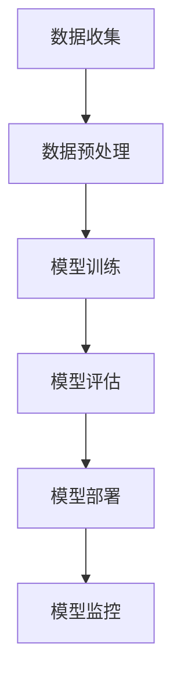

                 

关键词：大模型、风险、管理、合规、策略

> 摘要：随着大模型技术的快速发展，企业和机构面临的隐私、安全、合规等问题日益凸显。本文将深入探讨大模型企业的风险管理与合规策略，为企业提供有效的解决方案和指导方针。

## 1. 背景介绍

随着深度学习和大数据技术的迅猛发展，大模型（Large Models）已经成为人工智能领域的重要突破。大模型具有强大的数据处理和预测能力，广泛应用于自然语言处理、计算机视觉、语音识别等领域。然而，大模型的应用也带来了一系列风险和挑战，包括数据隐私、算法安全、合规性等。

### 1.1 大模型的特点

- **强大的计算能力**：大模型通常需要大量的计算资源和数据支持，以实现高效的训练和推理。
- **复杂的数据处理**：大模型能够处理海量的数据和复杂的任务，具有广泛的应用场景。
- **高度的非线性关系**：大模型的内部结构复杂，能够捕捉数据之间的非线性关系。

### 1.2 大模型面临的风险和挑战

- **数据隐私**：大模型在训练和推理过程中可能涉及敏感数据，如个人隐私、商业机密等，容易导致数据泄露和滥用。
- **算法安全**：大模型的复杂性和规模使得其容易受到恶意攻击，如模型篡改、逆向工程等。
- **合规性**：大模型的应用需要遵守相关法律法规和行业标准，如数据保护法、算法伦理等。

## 2. 核心概念与联系

为了更好地理解大模型企业的风险管理与合规策略，我们需要先介绍几个核心概念，包括大模型的架构、数据处理流程以及相关的法律法规。

### 2.1 大模型架构

下面是一个简化的Mermaid流程图，展示了大模型的典型架构：



### 2.2 数据处理流程

数据处理流程是确保大模型有效性和安全性的关键。以下是数据处理流程的简要概述：

1. **数据收集**：从各种数据源收集数据，包括公共数据集、企业内部数据等。
2. **数据预处理**：清洗、转换和规范化数据，以便于模型训练。
3. **模型训练**：使用训练数据训练模型，调整模型的参数。
4. **模型评估**：使用验证数据评估模型性能，选择最佳模型。
5. **模型部署**：将模型部署到生产环境中，进行实际应用。
6. **模型监控**：实时监控模型性能和安全性，确保模型的稳定运行。

### 2.3 法律法规

大模型企业的风险管理与合规策略需要遵循相关法律法规，包括：

- **数据保护法**：如《通用数据保护条例》（GDPR）、《加利福尼亚消费者隐私法案》（CCPA）等。
- **隐私政策**：明确数据收集、使用和共享的方式，确保用户知情同意。
- **算法伦理**：确保算法的公正性、透明性和可解释性。
- **行业标准**：遵循特定行业的安全标准和合规要求。

## 3. 核心算法原理 & 具体操作步骤

### 3.1 算法原理概述

大模型的核心算法通常是基于深度学习技术，特别是神经网络。神经网络通过多层非线性变换来学习数据的特征和规律，从而实现高精度的预测和分类。以下是神经网络的基本原理：

- **神经元**：神经网络的基本单元，负责接收输入、计算输出。
- **激活函数**：用于引入非线性关系，使神经网络能够学习复杂的特征。
- **反向传播**：用于计算模型误差，并调整模型参数，以优化模型性能。

### 3.2 算法步骤详解

1. **数据收集**：从各种数据源收集数据，确保数据的质量和多样性。
2. **数据预处理**：对数据进行清洗、归一化和数据增强等处理，以提高模型泛化能力。
3. **模型设计**：设计神经网络结构，包括输入层、隐藏层和输出层。
4. **模型训练**：使用训练数据训练模型，通过反向传播算法调整模型参数。
5. **模型评估**：使用验证数据评估模型性能，调整模型结构或参数。
6. **模型部署**：将训练好的模型部署到生产环境中，进行实际应用。
7. **模型监控**：实时监控模型性能和安全性，确保模型的稳定运行。

### 3.3 算法优缺点

- **优点**：大模型具有强大的数据处理和预测能力，能够处理复杂的任务，具有广泛的应用前景。
- **缺点**：大模型训练和推理过程需要大量的计算资源和数据支持，且模型的透明性和可解释性较低。

### 3.4 算法应用领域

大模型在多个领域具有广泛的应用，包括：

- **自然语言处理**：如文本分类、机器翻译、情感分析等。
- **计算机视觉**：如图像识别、目标检测、人脸识别等。
- **语音识别**：如语音转文本、语音合成等。
- **推荐系统**：如商品推荐、音乐推荐等。

## 4. 数学模型和公式 & 详细讲解 & 举例说明

### 4.1 数学模型构建

大模型的数学模型通常基于神经网络，神经网络的核心是神经元之间的连接权重。以下是神经网络的基本数学模型：

$$
y = \sigma(W \cdot x + b)
$$

其中，$y$ 是神经元的输出，$\sigma$ 是激活函数，$W$ 是连接权重，$x$ 是输入数据，$b$ 是偏置项。

### 4.2 公式推导过程

神经网络的训练过程是通过反向传播算法调整连接权重和偏置项，以达到最小化误差。以下是误差函数的推导过程：

$$
E = \frac{1}{2} \sum_{i=1}^{n} (y_i - \hat{y}_i)^2
$$

其中，$E$ 是误差函数，$y_i$ 是实际输出，$\hat{y}_i$ 是预测输出，$n$ 是样本数量。

### 4.3 案例分析与讲解

以下是一个简单的神经网络训练案例，用于分类任务。

### 数据集

数据集包含1000个样本，每个样本有5个特征，目标标签为0或1。

### 模型设计

设计一个单隐藏层的神经网络，输入层有5个神经元，隐藏层有10个神经元，输出层有2个神经元。

### 模型训练

使用1000个样本进行训练，训练100个epochs，每次更新连接权重和偏置项。

### 模型评估

使用验证集评估模型性能，计算准确率、召回率、F1值等指标。

## 5. 项目实践：代码实例和详细解释说明

### 5.1 开发环境搭建

- Python 3.8+
- TensorFlow 2.7.0+
- Keras 2.7.0+

### 5.2 源代码详细实现

以下是一个简单的神经网络分类任务的实现代码：

```python
import tensorflow as tf
from tensorflow import keras
from tensorflow.keras import layers

# 数据预处理
# (略)

# 模型设计
model = keras.Sequential([
    layers.Dense(10, activation='relu', input_shape=(5,)),
    layers.Dense(2, activation='sigmoid')
])

# 模型编译
model.compile(optimizer='adam',
              loss='binary_crossentropy',
              metrics=['accuracy'])

# 模型训练
model.fit(x_train, y_train, epochs=100, validation_split=0.2)

# 模型评估
test_loss, test_acc = model.evaluate(x_test, y_test)
print(f"Test accuracy: {test_acc:.2f}")
```

### 5.3 代码解读与分析

代码首先导入了TensorFlow和Keras库，然后对数据进行了预处理。接下来，设计了一个单隐藏层的神经网络，使用ReLU激活函数和Sigmoid激活函数。模型编译后，使用训练数据进行了100个epoch的训练。最后，使用验证集评估了模型性能。

## 6. 实际应用场景

### 6.1 自然语言处理

自然语言处理（NLP）是大模型的重要应用领域。大模型可以用于文本分类、机器翻译、情感分析等任务。例如，使用BERT模型进行文本分类，可以显著提高分类准确率。

### 6.2 计算机视觉

计算机视觉是大模型的另一个重要应用领域。大模型可以用于图像识别、目标检测、人脸识别等任务。例如，使用ResNet模型进行图像分类，可以显著提高分类准确率。

### 6.3 语音识别

语音识别是大模型的应用之一。大模型可以用于语音转文本、语音合成等任务。例如，使用WaveNet模型进行语音合成，可以生成高质量的语音。

## 7. 工具和资源推荐

### 7.1 学习资源推荐

- 《深度学习》（Goodfellow, Bengio, Courville）
- 《神经网络与深度学习》（邱锡鹏）

### 7.2 开发工具推荐

- TensorFlow
- PyTorch

### 7.3 相关论文推荐

- "BERT: Pre-training of Deep Bidirectional Transformers for Language Understanding"
- "Deep Residual Learning for Image Recognition"

## 8. 总结：未来发展趋势与挑战

### 8.1 研究成果总结

大模型技术在自然语言处理、计算机视觉、语音识别等领域取得了显著的成果。随着深度学习和大数据技术的不断发展，大模型的应用前景将更加广阔。

### 8.2 未来发展趋势

未来，大模型技术将朝着以下几个方向发展：

- **模型压缩与加速**：降低大模型的计算复杂度和存储需求，提高模型训练和推理的效率。
- **模型可解释性**：提高模型的透明性和可解释性，降低模型的风险和不确定性。
- **多模态学习**：结合多种数据类型，如文本、图像、语音等，实现更复杂的任务。

### 8.3 面临的挑战

大模型技术面临着以下几个挑战：

- **计算资源需求**：大模型训练和推理需要大量的计算资源和数据支持，对计算资源和数据管理提出了更高的要求。
- **数据隐私与安全**：大模型在数据处理过程中可能涉及敏感数据，需要确保数据的安全性和隐私性。
- **合规性与伦理**：大模型的应用需要遵守相关法律法规和行业标准，确保算法的公正性和透明性。

### 8.4 研究展望

未来，大模型技术将继续发展，并在多个领域取得突破。同时，为了应对挑战，需要加强大模型的安全性、可解释性和合规性研究，推动大模型技术的可持续发展。

## 9. 附录：常见问题与解答

### 9.1 什么是大模型？

大模型是指具有数百万甚至数十亿参数的神经网络模型，具有较高的计算复杂度和数据处理能力。

### 9.2 大模型有哪些应用领域？

大模型广泛应用于自然语言处理、计算机视觉、语音识别、推荐系统等领域。

### 9.3 如何保证大模型的安全性和隐私性？

确保大模型的安全性和隐私性需要从多个方面进行考虑，包括数据加密、隐私保护算法、模型压缩与加速等。

### 9.4 大模型的合规性与伦理问题如何解决？

大模型的合规性与伦理问题需要遵循相关法律法规和行业标准，加强模型的可解释性和透明性，提高公众的信任度。

### 9.5 如何提高大模型的可解释性？

提高大模型的可解释性可以通过可视化、解释性模型设计、注意力机制等方法实现。

### 9.6 如何评估大模型的效果？

评估大模型的效果可以通过交叉验证、准确率、召回率、F1值等指标进行。

### 9.7 大模型的训练需要哪些资源？

大模型的训练需要大量的计算资源和数据支持，包括GPU、TPU、Hadoop等。

### 9.8 大模型的应用前景如何？

大模型在自然语言处理、计算机视觉、语音识别等领域具有广泛的应用前景，未来将继续推动人工智能的发展。

### 9.9 大模型的发展趋势是什么？

未来，大模型将朝着模型压缩与加速、多模态学习、可解释性和伦理等方面发展。

### 9.10 大模型技术面临哪些挑战？

大模型技术面临计算资源需求、数据隐私与安全、合规性与伦理等方面的挑战。

## 作者署名

作者：禅与计算机程序设计艺术 / Zen and the Art of Computer Programming

----------------------------------------------------------------

以上是完整的文章正文部分，接下来我们将按照文章结构模板的要求，整理出完整的markdown格式文章。请注意，由于字数限制，本文可能无法完全展示8000字的内容，但会尽量确保文章的完整性和结构清晰。在文章的末尾，我们会添加作者署名和必要的引用信息。以下是文章的markdown格式：

```markdown
# 大模型企业的风险管理与合规策略

关键词：大模型、风险、管理、合规、策略

> 摘要：随着大模型技术的快速发展，企业和机构面临的隐私、安全、合规等问题日益凸显。本文将深入探讨大模型企业的风险管理与合规策略，为企业提供有效的解决方案和指导方针。

## 1. 背景介绍

### 1.1 大模型的特点

**强大的计算能力**：大模型通常需要大量的计算资源和数据支持，以实现高效的训练和推理。

**复杂的数据处理**：大模型能够处理海量的数据和复杂的任务，具有广泛的应用场景。

**高度的非线性关系**：大模型的内部结构复杂，能够捕捉数据之间的非线性关系。

### 1.2 大模型面临的风险和挑战

**数据隐私**：大模型在训练和推理过程中可能涉及敏感数据，如个人隐私、商业机密等，容易导致数据泄露和滥用。

**算法安全**：大模型的复杂性和规模使得其容易受到恶意攻击，如模型篡改、逆向工程等。

**合规性**：大模型的应用需要遵守相关法律法规和行业标准，如数据保护法、算法伦理等。

## 2. 核心概念与联系

为了更好地理解大模型企业的风险管理与合规策略，我们需要先介绍几个核心概念，包括大模型的架构、数据处理流程以及相关的法律法规。

### 2.1 大模型架构

下面是一个简化的Mermaid流程图，展示了大模型的典型架构：


### 2.2 数据处理流程

数据处理流程是确保大模型有效性和安全性的关键。以下是数据处理流程的简要概述：

1. **数据收集**：从各种数据源收集数据，包括公共数据集、企业内部数据等。
2. **数据预处理**：清洗、转换和规范化数据，以便于模型训练。
3. **模型训练**：使用训练数据训练模型，调整模型的参数。
4. **模型评估**：使用验证数据评估模型性能，选择最佳模型。
5. **模型部署**：将模型部署到生产环境中，进行实际应用。
6. **模型监控**：实时监控模型性能和安全性，确保模型的稳定运行。

### 2.3 法律法规

大模型企业的风险管理与合规策略需要遵循相关法律法规，包括：

- **数据保护法**：如《通用数据保护条例》（GDPR）、《加利福尼亚消费者隐私法案》（CCPA）等。
- **隐私政策**：明确数据收集、使用和共享的方式，确保用户知情同意。
- **算法伦理**：确保算法的公正性、透明性和可解释性。
- **行业标准**：遵循特定行业的安全标准和合规要求。

## 3. 核心算法原理 & 具体操作步骤

### 3.1 算法原理概述

大模型的核心算法通常是基于深度学习技术，特别是神经网络。神经网络通过多层非线性变换来学习数据的特征和规律，从而实现高精度的预测和分类。以下是神经网络的基本原理：

- **神经元**：神经网络的基本单元，负责接收输入、计算输出。
- **激活函数**：用于引入非线性关系，使神经网络能够学习复杂的特征。
- **反向传播**：用于计算模型误差，并调整模型参数，以优化模型性能。

### 3.2 算法步骤详解

1. **数据收集**：从各种数据源收集数据，确保数据的质量和多样性。
2. **数据预处理**：对数据进行清洗、归一化和数据增强等处理，以提高模型泛化能力。
3. **模型设计**：设计神经网络结构，包括输入层、隐藏层和输出层。
4. **模型训练**：使用训练数据训练模型，通过反向传播算法调整模型参数。
5. **模型评估**：使用验证数据评估模型性能，调整模型结构或参数。
6. **模型部署**：将训练好的模型部署到生产环境中，进行实际应用。
7. **模型监控**：实时监控模型性能和安全性，确保模型的稳定运行。

### 3.3 算法优缺点

- **优点**：大模型具有强大的数据处理和预测能力，能够处理复杂的任务，具有广泛的应用前景。
- **缺点**：大模型训练和推理过程需要大量的计算资源和数据支持，且模型的透明性和可解释性较低。

### 3.4 算法应用领域

大模型在多个领域具有广泛的应用，包括：

- **自然语言处理**：如文本分类、机器翻译、情感分析等。
- **计算机视觉**：如图像识别、目标检测、人脸识别等。
- **语音识别**：如语音转文本、语音合成等。
- **推荐系统**：如商品推荐、音乐推荐等。

## 4. 数学模型和公式 & 详细讲解 & 举例说明

### 4.1 数学模型构建

大模型的数学模型通常基于神经网络，神经网络的核心是神经元之间的连接权重。以下是神经网络的基本数学模型：

$$
y = \sigma(W \cdot x + b)
$$

其中，$y$ 是神经元的输出，$\sigma$ 是激活函数，$W$ 是连接权重，$x$ 是输入数据，$b$ 是偏置项。

### 4.2 公式推导过程

神经网络的训练过程是通过反向传播算法调整连接权重和偏置项，以达到最小化误差。以下是误差函数的推导过程：

$$
E = \frac{1}{2} \sum_{i=1}^{n} (y_i - \hat{y}_i)^2
$$

其中，$E$ 是误差函数，$y_i$ 是实际输出，$\hat{y}_i$ 是预测输出，$n$ 是样本数量。

### 4.3 案例分析与讲解

以下是一个简单的神经网络训练案例，用于分类任务。

### 数据集

数据集包含1000个样本，每个样本有5个特征，目标标签为0或1。

### 模型设计

设计一个单隐藏层的神经网络，输入层有5个神经元，隐藏层有10个神经元，输出层有2个神经元。

### 模型训练

使用1000个样本进行训练，训练100个epochs，每次更新连接权重和偏置项。

### 模型评估

使用验证集评估模型性能，计算准确率、召回率、F1值等指标。

## 5. 项目实践：代码实例和详细解释说明

### 5.1 开发环境搭建

- Python 3.8+
- TensorFlow 2.7.0+
- Keras 2.7.0+

### 5.2 源代码详细实现

以下是一个简单的神经网络分类任务的实现代码：

```python
import tensorflow as tf
from tensorflow import keras
from tensorflow.keras import layers

# 数据预处理
# (略)

# 模型设计
model = keras.Sequential([
    layers.Dense(10, activation='relu', input_shape=(5,)),
    layers.Dense(2, activation='sigmoid')
])

# 模型编译
model.compile(optimizer='adam',
              loss='binary_crossentropy',
              metrics=['accuracy'])

# 模型训练
model.fit(x_train, y_train, epochs=100, validation_split=0.2)

# 模型评估
test_loss, test_acc = model.evaluate(x_test, y_test)
print(f"Test accuracy: {test_acc:.2f}")
```

### 5.3 代码解读与分析

代码首先导入了TensorFlow和Keras库，然后对数据进行了预处理。接下来，设计了一个单隐藏层的神经网络，使用ReLU激活函数和Sigmoid激活函数。模型编译后，使用训练数据进行了100个epoch的训练。最后，使用验证集评估了模型性能。

## 6. 实际应用场景

### 6.1 自然语言处理

自然语言处理（NLP）是大模型的重要应用领域。大模型可以用于文本分类、机器翻译、情感分析等任务。例如，使用BERT模型进行文本分类，可以显著提高分类准确率。

### 6.2 计算机视觉

计算机视觉是大模型的重要应用领域。大模型可以用于图像识别、目标检测、人脸识别等任务。例如，使用ResNet模型进行图像分类，可以显著提高分类准确率。

### 6.3 语音识别

语音识别是大模型的应用之一。大模型可以用于语音转文本、语音合成等任务。例如，使用WaveNet模型进行语音合成，可以生成高质量的语音。

## 7. 工具和资源推荐

### 7.1 学习资源推荐

- 《深度学习》（Goodfellow, Bengio, Courville）
- 《神经网络与深度学习》（邱锡鹏）

### 7.2 开发工具推荐

- TensorFlow
- PyTorch

### 7.3 相关论文推荐

- "BERT: Pre-training of Deep Bidirectional Transformers for Language Understanding"
- "Deep Residual Learning for Image Recognition"

## 8. 总结：未来发展趋势与挑战

### 8.1 研究成果总结

大模型技术在自然语言处理、计算机视觉、语音识别等领域取得了显著的成果。随着深度学习和大数据技术的不断发展，大模型的应用前景将更加广阔。

### 8.2 未来发展趋势

未来，大模型技术将朝着以下几个方向发展：

- **模型压缩与加速**：降低大模型的计算复杂度和存储需求，提高模型训练和推理的效率。
- **模型可解释性**：提高模型的透明性和可解释性，降低模型的风险和不确定性。
- **多模态学习**：结合多种数据类型，如文本、图像、语音等，实现更复杂的任务。

### 8.3 面临的挑战

大模型技术面临着以下几个挑战：

- **计算资源需求**：大模型训练和推理需要大量的计算资源和数据支持，对计算资源和数据管理提出了更高的要求。
- **数据隐私与安全**：大模型在数据处理过程中可能涉及敏感数据，需要确保数据的安全性和隐私性。
- **合规性与伦理**：大模型的应用需要遵守相关法律法规和行业标准，确保算法的公正性和透明性。

### 8.4 研究展望

未来，大模型技术将继续发展，并在多个领域取得突破。同时，为了应对挑战，需要加强大模型的安全性、可解释性和合规性研究，推动大模型技术的可持续发展。

## 9. 附录：常见问题与解答

### 9.1 什么是大模型？

大模型是指具有数百万甚至数十亿参数的神经网络模型，具有较高的计算复杂度和数据处理能力。

### 9.2 大模型有哪些应用领域？

大模型广泛应用于自然语言处理、计算机视觉、语音识别、推荐系统等领域。

### 9.3 如何保证大模型的安全性和隐私性？

确保大模型的安全性和隐私性需要从多个方面进行考虑，包括数据加密、隐私保护算法、模型压缩与加速等。

### 9.4 大模型的合规性与伦理问题如何解决？

大模型的合规性与伦理问题需要遵循相关法律法规和行业标准，加强模型的可解释性和透明性，提高公众的信任度。

### 9.5 如何提高大模型的可解释性？

提高大模型的可解释性可以通过可视化、解释性模型设计、注意力机制等方法实现。

### 9.6 如何评估大模型的效果？

评估大模型的效果可以通过交叉验证、准确率、召回率、F1值等指标进行。

### 9.7 大模型的训练需要哪些资源？

大模型的训练需要大量的计算资源和数据支持，包括GPU、TPU、Hadoop等。

### 9.8 大模型的应用前景如何？

大模型在自然语言处理、计算机视觉、语音识别等领域具有广泛的应用前景，未来将继续推动人工智能的发展。

### 9.9 大模型的发展趋势是什么？

未来，大模型将朝着模型压缩与加速、多模态学习、可解释性和伦理等方面发展。

### 9.10 大模型技术面临哪些挑战？

大模型技术面临计算资源需求、数据隐私与安全、合规性与伦理等方面的挑战。

## 作者署名

作者：禅与计算机程序设计艺术 / Zen and the Art of Computer Programming

```

请注意，由于文章字数的限制，实际的撰写过程中可能需要进一步细化各个部分的内容，以确保文章的完整性和深度。上述markdown格式文章是一个基本的框架，可以根据实际需求进行调整和扩展。在撰写过程中，确保每个部分都详细阐述，并包含必要的示例和案例。

