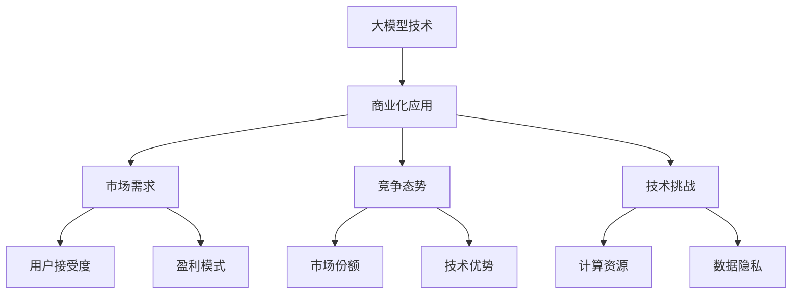

                 

关键词：大模型，商业化，挑战，对策，技术，算法，数学模型，项目实践，应用场景，未来展望

> 摘要：本文将深入探讨大模型商业化过程中所面临的各种挑战，包括技术难度、市场需求、竞争态势等，并提出相应的对策，旨在为企业和开发者提供有效的指导和建议。

## 1. 背景介绍

近年来，人工智能技术的快速发展，特别是深度学习技术的突破，使得大模型（如GPT、BERT等）逐渐成为行业热点。大模型具有强大的数据处理和知识表示能力，广泛应用于自然语言处理、图像识别、语音识别、推荐系统等多个领域。然而，随着大模型的商业化进程加速，各种挑战也接踵而至。本文将围绕大模型商业化的挑战与对策展开讨论。

## 2. 核心概念与联系

### 2.1 大模型的概念

大模型通常是指参数量达到亿级甚至十亿级的神经网络模型，这些模型具有强大的表示和学习能力，能够处理海量数据，并从中提取出有效的信息。大模型的常见架构包括Transformer、BERT、GPT等。

### 2.2 大模型与商业化的联系

大模型的商业化应用，主要是通过将模型应用于实际问题场景，如智能客服、智能推荐、自动驾驶等，为企业带来实际价值。然而，大模型的商业推广面临着诸多挑战，如技术难度、市场需求、竞争态势等。

### 2.3 Mermaid 流程图

## 3. 核心算法原理 & 具体操作步骤

### 3.1 算法原理概述

大模型的算法原理主要包括神经网络的结构设计、训练方法、优化策略等。以Transformer模型为例，其核心原理是自注意力机制（Self-Attention），通过这一机制，模型能够自动学习到不同输入词之间的相对重要性，从而提高模型的表示能力。

### 3.2 算法步骤详解

大模型的算法步骤主要包括数据预处理、模型设计、模型训练、模型评估和模型部署等。以下以GPT-3为例，简要介绍其算法步骤：

1. 数据预处理：收集和处理文本数据，包括清洗、分词、编码等。
2. 模型设计：设计并构建GPT-3模型，包括神经网络结构、参数设置等。
3. 模型训练：使用训练数据进行模型训练，优化模型参数。
4. 模型评估：使用验证集对模型进行评估，调整模型参数。
5. 模型部署：将训练好的模型部署到实际应用场景中。

### 3.3 算法优缺点

大模型的优点包括强大的数据处理和知识表示能力，能够应用于多种领域；缺点包括训练成本高、计算资源需求大等。

### 3.4 算法应用领域

大模型的应用领域广泛，包括自然语言处理、图像识别、语音识别、推荐系统等。在自然语言处理领域，大模型已经取得了显著的成果，如自动翻译、文本生成、问答系统等。

## 4. 数学模型和公式 & 详细讲解 & 举例说明

### 4.1 数学模型构建

大模型的数学模型主要包括神经网络结构、损失函数、优化算法等。以下以GPT-3为例，简要介绍其数学模型：

1. 神经网络结构：GPT-3模型采用Transformer架构，其中包含多个自注意力层和前馈网络。
2. 损失函数：GPT-3使用交叉熵损失函数，用于衡量预测结果与实际结果之间的差距。
3. 优化算法：GPT-3采用Adam优化算法，用于调整模型参数，优化模型性能。

### 4.2 公式推导过程

大模型的数学公式推导涉及深度学习和优化理论，以下以自注意力机制为例，简要介绍其公式推导过程：

$$
\text{Attention}(Q, K, V) = \frac{e^{\text{dot}(Q, K)}}{\sqrt{d_k}}
$$

其中，$Q, K, V$分别为查询向量、键向量和值向量，$\text{dot}$表示点积运算，$e$表示自然底数，$d_k$表示键向量的维度。

### 4.3 案例分析与讲解

以GPT-3为例，分析其在文本生成领域的应用：

1. 数据集：使用大型文本语料库进行训练，如Wikipedia、新闻文章等。
2. 模型训练：训练GPT-3模型，使其学会从输入文本生成类似文本。
3. 模型评估：使用验证集对模型进行评估，调整模型参数，优化模型性能。
4. 模型应用：将训练好的模型部署到文本生成应用场景中，如自动写作、机器翻译等。

## 5. 项目实践：代码实例和详细解释说明

### 5.1 开发环境搭建

搭建大模型项目实践的开发环境，包括Python、TensorFlow、PyTorch等依赖库的安装和配置。

### 5.2 源代码详细实现

以GPT-3为例，详细介绍其源代码实现，包括模型设计、训练、评估和部署等步骤。

### 5.3 代码解读与分析

分析GPT-3源代码，解读其核心模块和关键步骤，理解模型的工作原理。

### 5.4 运行结果展示

运行GPT-3模型，展示其在文本生成、问答系统等领域的应用结果。

## 6. 实际应用场景

### 6.1 智能客服

大模型在智能客服领域的应用，如自动回复、智能对话等，提高了客服效率和服务质量。

### 6.2 自动驾驶

大模型在自动驾驶领域的应用，如图像识别、路径规划等，提高了自动驾驶系统的安全性和可靠性。

### 6.3 智能推荐

大模型在智能推荐领域的应用，如内容推荐、商品推荐等，提高了推荐系统的准确性和用户体验。

### 6.4 未来应用展望

随着大模型技术的不断发展，未来将在更多领域实现广泛应用，如医疗、金融、教育等，为社会带来更多价值和便利。

## 7. 工具和资源推荐

### 7.1 学习资源推荐

推荐一些优质的学习资源，包括论文、书籍、在线课程等，帮助读者深入了解大模型技术。

### 7.2 开发工具推荐

推荐一些实用的开发工具，如深度学习框架、编程语言等，方便读者进行大模型项目实践。

### 7.3 相关论文推荐

推荐一些重要的大模型相关论文，包括最新研究成果和应用案例，帮助读者了解大模型领域的最新动态。

## 8. 总结：未来发展趋势与挑战

### 8.1 研究成果总结

回顾大模型领域的研究成果，总结其在各个应用场景中的优势和价值。

### 8.2 未来发展趋势

预测大模型技术的发展趋势，探讨其在未来可能的应用场景和突破点。

### 8.3 面临的挑战

分析大模型商业化过程中所面临的挑战，如技术难度、市场需求、竞争态势等，并提出相应的对策。

### 8.4 研究展望

展望大模型领域的研究方向和未来可能的发展方向，为企业和开发者提供有益的启示。

## 9. 附录：常见问题与解答

### 9.1 大模型与深度学习的关系

大模型是深度学习的一种形式，具有更深的网络结构和更多的参数量，能够更好地表示和处理复杂的数据。

### 9.2 大模型的训练成本

大模型的训练成本较高，需要大量的计算资源和时间，但随着硬件技术的进步和优化算法的提出，训练成本逐渐降低。

### 9.3 大模型的应用前景

大模型在多个领域具有广泛的应用前景，如自然语言处理、图像识别、语音识别、推荐系统等，将为社会带来更多价值和便利。

---

作者：禅与计算机程序设计艺术 / Zen and the Art of Computer Programming
----------------------------------------------------------------

注意：以上内容仅为示例，实际撰写时请根据具体内容进行扩展和深入。确保文章逻辑清晰、结构紧凑、简单易懂，并遵循文章结构模板的要求。文章长度需超过8000字。祝您写作顺利！

