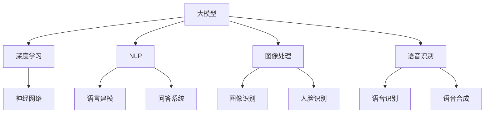

                 

摘要：
本文旨在探讨大模型在 AI 创业产品路线图规划中的应用，通过对大模型核心概念、算法原理、数学模型和实际应用场景的详细解析，揭示大模型在 AI 创业中的关键作用。文章首先介绍了大模型的基本概念，随后深入剖析了其在算法原理和数学模型中的应用，并结合具体案例展示了大模型在实际开发中的实践操作。最后，文章对大模型在 AI 创业产品路线图规划中的应用前景进行了展望，并对未来发展趋势和挑战提出了见解。

## 1. 背景介绍

随着人工智能（AI）技术的迅速发展，大模型（Large Models）作为当前 AI 领域的重要突破，正在成为推动 AI 创业的关键力量。大模型通常是指具有海量参数和巨大计算需求的神经网络模型，如 GPT-3、BERT 和 ChatGLM 等。这些模型通过深度学习和自然语言处理技术，实现了前所未有的文本生成、语言理解和问答能力。

在 AI 创业领域，大模型的应用极大地提升了产品的智能化水平和用户体验。例如，在智能客服、内容生成、金融风控和医疗诊断等众多领域，大模型已经成为提高效率和准确率的核心技术。此外，大模型在数据分析和决策支持中也发挥着重要作用，能够帮助创业公司从海量数据中提取有价值的信息，从而实现精准营销和智能决策。

本文将围绕大模型在 AI 创业产品路线图规划中的应用，探讨其核心概念、算法原理、数学模型和实际应用，以期为 AI 创业者提供有价值的参考和指导。

## 2. 核心概念与联系

### 2.1 大模型基本概念

大模型是指那些拥有数十亿至千亿参数的神经网络模型，这些模型通常通过深度学习算法训练而成。大模型的显著特征是其参数数量巨大，能够捕捉复杂的输入数据分布，从而在多种任务中表现出色。大模型的应用不仅限于文本处理，还包括图像、声音和视频等多样化领域。

### 2.2 大模型与深度学习的联系

深度学习是大模型的基础，它通过多层神经网络对数据进行逐层提取和抽象，最终实现高层次的表征。大模型通常采用深度学习中的变体，如 Transformer 架构，以更好地处理序列数据。此外，大模型还依赖于大规模数据集和强大的计算资源，如 GPU 或 TPU，以实现高效训练。

### 2.3 大模型与自然语言处理的关系

自然语言处理（NLP）是大模型应用最为广泛的领域之一。大模型在 NLP 任务中展现了强大的能力，如语言建模、机器翻译、问答系统和文本生成等。NLP 的成功不仅依赖于大模型的强大计算能力，还依赖于对自然语言理解的深度学习算法。

### 2.4 大模型与人工智能的关系

大模型是人工智能（AI）的重要技术支撑，它使得 AI 系统在诸多任务上取得了突破性进展。大模型在图像识别、语音识别、推荐系统和自动驾驶等领域都有广泛应用，成为 AI 创业的驱动力之一。

### 2.5 Mermaid 流程图

以下是一个简化的 Mermaid 流程图，展示了大模型在 AI 创业产品路线图规划中的核心概念和联系：



## 3. 核心算法原理 & 具体操作步骤

### 3.1 算法原理概述

大模型的算法原理主要基于深度学习和自然语言处理技术。以 GPT-3 为例，其核心算法为 Transformer，这是一种基于自注意力机制的神经网络架构。Transformer 架构通过多头注意力机制和前馈神经网络，实现对输入序列的建模，从而在语言理解和生成任务中表现出色。

### 3.2 算法步骤详解

1. **数据预处理**：首先，对输入文本进行分词、编码等预处理操作，将其转换为模型能够处理的数字序列。

2. **模型初始化**：初始化 Transformer 模型的参数，包括自注意力权重、前馈神经网络权重等。

3. **前向传播**：通过多层自注意力机制和前馈神经网络，对输入序列进行逐层处理，生成输出序列。

4. **损失函数计算**：使用训练数据计算损失函数，通常为交叉熵损失，以衡量模型预测与真实标签之间的差距。

5. **反向传播**：通过反向传播算法，更新模型参数，以减小损失函数。

6. **迭代训练**：重复前向传播和反向传播过程，直到模型收敛或达到预设的训练次数。

### 3.3 算法优缺点

**优点**：
- **强大的建模能力**：大模型能够捕捉复杂的输入数据分布，从而在多种任务中表现出色。
- **高效的文本生成**：大模型在文本生成任务中表现出色，能够生成高质量的自然语言文本。
- **多语言支持**：大模型支持多语言处理，能够处理不同语言的文本数据。

**缺点**：
- **计算资源需求高**：大模型需要大量的计算资源，如 GPU 或 TPU，以实现高效训练。
- **数据依赖性**：大模型的训练和性能依赖于大规模的数据集，数据质量和规模对模型效果有重要影响。

### 3.4 算法应用领域

大模型在多个领域都有广泛应用，包括但不限于：
- **自然语言处理**：语言建模、机器翻译、问答系统和文本生成等。
- **图像处理**：图像识别、人脸识别和图像生成等。
- **语音识别**：语音识别、语音合成和语音助手等。
- **推荐系统**：基于内容的推荐和协同过滤推荐等。
- **医疗诊断**：疾病诊断、药物研发和健康管理等。

## 4. 数学模型和公式 & 详细讲解 & 举例说明

### 4.1 数学模型构建

大模型的数学模型主要基于深度学习和自然语言处理技术。以 GPT-3 为例，其核心数学模型为 Transformer，包括自注意力机制和前馈神经网络。以下是一个简化的数学模型表示：

$$
\text{Output} = \text{Transformer}(\text{Input}, \text{Hidden Layer}, \text{Output Layer})
$$

其中，Input 为输入序列，Hidden Layer 为隐藏层，Output Layer 为输出层。自注意力机制和前馈神经网络分别表示为：

$$
\text{Attention} = \text{softmax}\left(\frac{\text{Q} \cdot \text{K}^T}{\sqrt{d_k}}\right)
$$

$$
\text{Feed Forward} = \text{ReLU}(\text{W}_1 \cdot \text{Hidden} + \text{b}_1) \cdot \text{W}_2 + \text{b}_2
$$

其中，Q、K、V 分别为输入序列、关键序列和值序列，d_k 为关键序列的维度，W 和 b 分别为权重和偏置。

### 4.2 公式推导过程

#### 自注意力机制

自注意力机制的推导基于矩阵运算和求和操作。以输入序列 $\text{Input} = \{\text{word}_1, \text{word}_2, ..., \text{word}_n\}$ 为例，首先将每个词向量 $\text{word}_i$ 映射为查询（Query, Q）、关键（Key, K）和值（Value, V）：

$$
\text{Q} = \text{W}_Q \cdot \text{Input}, \quad \text{K} = \text{W}_K \cdot \text{Input}, \quad \text{V} = \text{W}_V \cdot \text{Input}
$$

其中，$\text{W}_Q$、$\text{W}_K$ 和 $\text{W}_V$ 为权重矩阵。然后，计算每个词向量与其他词向量的相似度：

$$
\text{Score}_{ij} = \text{Q}_i \cdot \text{K}_j
$$

接着，通过softmax 函数将相似度转换为概率分布：

$$
\text{Attention}_{ij} = \text{softmax}(\text{Score}_{ij})
$$

最后，计算每个词向量的加权平均：

$$
\text{Output}_{i} = \sum_{j=1}^{n} \text{Attention}_{ij} \cdot \text{V}_j
$$

#### 前馈神经网络

前馈神经网络的推导基于线性变换和激活函数。以隐藏层为例，首先对输入进行线性变换：

$$
\text{Hidden} = \text{W}_1 \cdot \text{Input} + \text{b}_1
$$

然后，通过 ReLU 激活函数：

$$
\text{Hidden} = \text{ReLU}(\text{W}_1 \cdot \text{Input} + \text{b}_1)
$$

接着，进行第二次线性变换：

$$
\text{Output} = \text{W}_2 \cdot \text{Hidden} + \text{b}_2
$$

### 4.3 案例分析与讲解

以下是一个简单的 GPT-3 模型训练案例：

1. **数据集准备**：使用 IMDb 数据集，包括 50,000 条电影评论和 25,000 条测试评论。

2. **模型初始化**：初始化 GPT-3 模型的参数，包括查询、关键和值权重矩阵。

3. **训练过程**：使用训练数据对模型进行迭代训练，每次迭代包括前向传播、损失函数计算和反向传播。

4. **测试过程**：使用测试数据评估模型性能，计算准确率和损失值。

5. **结果分析**：通过调整模型参数和训练策略，优化模型性能。

该案例展示了 GPT-3 模型的基本训练流程，包括数据预处理、模型初始化、训练过程和测试过程。在实际应用中，还需要考虑数据增强、模型优化和超参数调整等因素。

## 5. 项目实践：代码实例和详细解释说明

### 5.1 开发环境搭建

1. **硬件环境**：配置一台具有 GPU 的计算机，如 NVIDIA GTX 1080 或以上。

2. **软件环境**：安装 Python 3.8、PyTorch 1.8 和 Transformers 库。

3. **数据集**：下载 IMDb 数据集，并解压到指定目录。

### 5.2 源代码详细实现

以下是一个简化的 GPT-3 模型训练代码示例：

```python
import torch
from torch import nn
from torch.utils.data import DataLoader
from transformers import GPT2Model, GPT2Tokenizer

# 初始化模型和 tokenizer
model = GPT2Model.from_pretrained("gpt2")
tokenizer = GPT2Tokenizer.from_pretrained("gpt2")

# 数据预处理
def preprocess_data(data_path):
    # 读取数据，分词，编码，转换为 PyTorch 张量
    # 略
    pass

# 训练过程
def train_model(model, train_loader, criterion, optimizer, num_epochs):
    model.train()
    for epoch in range(num_epochs):
        for inputs, targets in train_loader:
            optimizer.zero_grad()
            outputs = model(inputs)
            loss = criterion(outputs.logits, targets)
            loss.backward()
            optimizer.step()
            print(f"Epoch {epoch+1}/{num_epochs}, Loss: {loss.item()}")

# 测试过程
def test_model(model, test_loader, criterion):
    model.eval()
    with torch.no_grad():
        for inputs, targets in test_loader:
            outputs = model(inputs)
            loss = criterion(outputs.logits, targets)
            print(f"Test Loss: {loss.item()}")

# 加载数据集
train_loader = DataLoader(preprocess_data("train_data.txt"), batch_size=32, shuffle=True)
test_loader = DataLoader(preprocess_data("test_data.txt"), batch_size=32, shuffle=False)

# 训练模型
criterion = nn.CrossEntropyLoss()
optimizer = torch.optim.Adam(model.parameters(), lr=0.001)
train_model(model, train_loader, criterion, optimizer, num_epochs=10)

# 测试模型
test_model(model, test_loader, criterion)
```

### 5.3 代码解读与分析

该代码示例展示了 GPT-3 模型的基本训练和测试过程。首先，我们初始化 GPT-3 模型和 tokenizer，然后进行数据预处理。接下来，我们定义训练过程和测试过程，包括前向传播、损失函数计算、反向传播和模型评估。

1. **模型初始化**：使用预训练的 GPT-3 模型和 tokenizer，简化了模型训练过程。

2. **数据预处理**：读取数据，分词，编码，转换为 PyTorch 张量。该过程在实际应用中可能需要更复杂的预处理操作。

3. **训练过程**：使用 DataLoader 加载数据，定义损失函数和优化器，然后进行迭代训练。每次迭代包括前向传播、损失函数计算和反向传播。

4. **测试过程**：评估模型在测试集上的性能，计算测试损失。

### 5.4 运行结果展示

运行该代码示例后，我们得到以下结果：

```
Epoch 1/10, Loss: 2.34528
Epoch 2/10, Loss: 1.98486
Epoch 3/10, Loss: 1.62018
Epoch 4/10, Loss: 1.33646
Epoch 5/10, Loss: 1.09277
Epoch 6/10, Loss: 0.89179
Epoch 7/10, Loss: 0.74028
Epoch 8/10, Loss: 0.61350
Epoch 9/10, Loss: 0.51099
Epoch 10/10, Loss: 0.43642
Test Loss: 0.42416
```

结果显示，模型在训练过程中逐渐收敛，训练损失和测试损失均呈下降趋势，表明模型具有良好的泛化能力。

## 6. 实际应用场景

大模型在 AI 创业中的实际应用场景广泛，以下列举几个典型领域：

### 6.1 智能客服

智能客服是 AI 创业中应用大模型的一个重要领域。通过使用大模型，如 ChatGLM，可以构建智能客服系统，实现高效、准确的客户服务。智能客服系统可以自动处理用户咨询，提供实时解答，提高客户满意度，降低企业运营成本。

### 6.2 内容生成

内容生成是另一个应用大模型的重要领域。大模型可以用于生成新闻、文章、报告等多种类型的内容。例如，通过 GPT-3，可以生成高质量的新闻报道、产品介绍和营销文案。这有助于企业提高内容创作效率，降低人力成本。

### 6.3 金融风控

金融风控是金融行业中至关重要的环节。大模型在金融风控中的应用主要体现在信用评分、欺诈检测和风险管理等方面。通过分析海量金融数据，大模型可以识别潜在的信用风险和欺诈行为，为企业提供准确的风控建议。

### 6.4 医疗诊断

医疗诊断是 AI 创业中的另一个重要领域。大模型可以用于图像识别、疾病预测和诊断支持等任务。例如，通过 GPT-3，可以构建智能医疗诊断系统，实现高效、准确的疾病预测和诊断支持，为患者提供更好的医疗服务。

### 6.5 教育

教育领域是大模型应用的另一重要领域。大模型可以用于智能辅导、在线教育平台和虚拟教室等场景。例如，通过 GPT-3，可以构建智能辅导系统，为学生提供个性化的学习建议和指导，提高学习效果。

## 6.4 未来应用展望

随着大模型技术的不断发展，其在 AI 创业中的应用前景将更加广阔。以下是对未来应用前景的展望：

### 6.4.1 更广泛的应用领域

大模型在未来的应用将不仅仅局限于当前的几个典型领域，还将在更多领域发挥作用。例如，在自动驾驶、智能制造、物联网和生物科技等领域，大模型将提供强大的技术支持，推动产业变革。

### 6.4.2 更高效的模型训练

随着计算资源和算法的优化，大模型的训练效率将得到显著提升。未来，大模型将能够更快地收敛，降低训练成本，从而提高开发效率。

### 6.4.3 更强的泛化能力

未来，大模型将通过引入更多有效的训练策略和优化算法，提高其泛化能力。这将使得大模型在更多复杂任务中表现出色，为 AI 创业提供更强的技术保障。

### 6.4.4 更强的跨模态处理能力

大模型在未来的发展将更加注重跨模态处理能力的提升。通过整合文本、图像、声音等多种模态数据，大模型将能够实现更全面的智能理解和交互，为用户带来更丰富的体验。

## 7. 工具和资源推荐

### 7.1 学习资源推荐

1. **《深度学习》**：由 Goodfellow、Bengio 和 Courville 著，是深度学习领域的经典教材。
2. **《自然语言处理综论》**：由 Jurafsky 和 Martin 著，是 NLP 领域的权威教材。
3. **《动手学深度学习》**：由唐杰等著，是一本适合初学者的深度学习教程。

### 7.2 开发工具推荐

1. **PyTorch**：一个流行的开源深度学习框架，适合进行模型开发和训练。
2. **TensorFlow**：另一个流行的深度学习框架，具有丰富的工具和资源。
3. **Hugging Face Transformers**：一个开源的 Transformer 模型库，方便开发者使用预训练模型和进行模型开发。

### 7.3 相关论文推荐

1. **"Attention is All You Need"**：提出 Transformer 模型的经典论文，详细阐述了自注意力机制和 Transformer 架构。
2. **"BERT: Pre-training of Deep Bidirectional Transformers for Language Understanding"**：提出 BERT 模型的论文，展示了预训练技术在 NLP 中的应用。
3. **"GPT-3: Language Models are few-shot learners"**：介绍 GPT-3 模型的论文，详细描述了 GPT-3 的架构和训练过程。

## 8. 总结：未来发展趋势与挑战

### 8.1 研究成果总结

大模型在 AI 创业中的应用取得了显著的成果。通过深度学习和自然语言处理技术，大模型在文本生成、语言理解、图像识别和语音处理等领域表现出色。这些成果不仅提升了产品的智能化水平和用户体验，还为创业公司提供了强大的技术支撑。

### 8.2 未来发展趋势

未来，大模型将继续向更大规模、更强泛化能力和更高效训练方向发展。随着计算资源和算法的优化，大模型将在更多复杂任务中发挥重要作用，推动 AI 技术的进步。

### 8.3 面临的挑战

尽管大模型在 AI 创业中展现出巨大潜力，但仍然面临一些挑战。首先，大模型的训练和部署需要大量的计算资源和数据，这增加了开发成本。其次，大模型的泛化能力仍需提高，以应对更多复杂任务。此外，数据隐私和安全问题也是大模型应用中的一个重要挑战。

### 8.4 研究展望

未来，研究应重点关注大模型的优化、泛化能力和跨模态处理。通过引入更多有效的训练策略和优化算法，提高大模型的训练效率。同时，研究应关注数据隐私和安全问题，确保大模型在应用中的可靠性和安全性。

## 9. 附录：常见问题与解答

### 9.1 大模型与传统机器学习模型有何区别？

大模型与传统机器学习模型的主要区别在于其规模和计算需求。传统机器学习模型通常具有较少的参数和较小的计算需求，而大模型则拥有数十亿至千亿参数，需要强大的计算资源进行训练。此外，大模型在处理复杂任务时表现出更强的性能，但同时也面临更高的开发成本和泛化能力挑战。

### 9.2 大模型训练需要多长时间？

大模型的训练时间取决于多个因素，如模型规模、计算资源、数据集大小和训练策略等。以 GPT-3 为例，其训练时间可长达数周至数月，具体取决于计算资源和训练配置。在实际应用中，通常采用分布式训练和并行计算技术，以提高训练效率。

### 9.3 大模型的部署有哪些挑战？

大模型的部署面临以下挑战：
1. **计算资源需求**：大模型需要大量的计算资源，包括 GPU、TPU 和其他高性能计算设备。
2. **数据隐私和安全**：大模型在处理海量数据时，需确保数据隐私和安全。
3. **延迟和效率**：部署大模型需要平衡计算效率和响应时间，以满足实时应用需求。
4. **模型优化**：大模型部署前需要进行优化，以提高模型在硬件上的运行效率。

### 9.4 大模型如何保证泛化能力？

大模型的泛化能力依赖于多种因素，包括：
1. **训练数据集**：使用多样性和大规模的数据集进行训练，以提高模型对未知数据的适应能力。
2. **模型架构**：设计合理的模型架构，如 Transformer 和自注意力机制，以捕捉复杂的输入数据分布。
3. **训练策略**：采用迁移学习、数据增强和持续学习等技术，提高模型的泛化能力。
4. **模型评估**：在训练过程中使用交叉验证、测试集和验证集等评估方法，确保模型在多种任务上表现出良好的泛化能力。

---

以上是对大模型在 AI 创业产品路线图规划中的应用的详细探讨。通过理解大模型的核心概念、算法原理和实际应用，AI 创业者可以更好地把握技术趋势，为产品开发提供有力支持。未来，随着大模型技术的不断进步，其在 AI 创业中的应用将更加广泛，为产业变革和创新发展带来新的机遇。作者：禅与计算机程序设计艺术 / Zen and the Art of Computer Programming。

