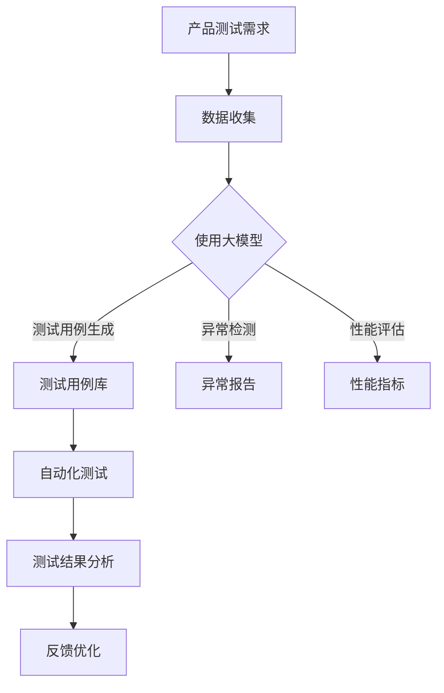

                 

## 1. 背景介绍

在当今快速发展的 AI 领域，创业公司不断涌现，它们在人工智能算法的研发和应用方面取得了显著成果。然而，如何确保产品的质量与稳定性，尤其是在产品测试阶段，成为了这些公司面临的一大挑战。传统的人工测试方法不仅耗时耗力，而且容易产生遗漏，无法满足日益增长的市场需求。因此，如何利用先进的技术手段，尤其是大模型，来提高产品测试的效率与准确性，成为了一个热门的研究课题。

大模型，即大型的人工智能模型，通常具有极高的参数量和计算复杂度。这些模型在图像识别、自然语言处理、语音识别等 AI 领域取得了显著的成就，然而，将它们应用于产品测试领域却是一个相对较新的研究方向。大模型在处理大规模数据、识别复杂模式、自动生成测试用例等方面具有独特优势，为创业公司提供了一种全新的测试解决方案。

本文将探讨大模型在 AI 创业公司产品测试中的应用，分析其核心概念、算法原理、数学模型，并通过实际案例进行详细讲解。同时，还将探讨大模型在产品测试领域的未来应用前景和面临的挑战。

## 2. 核心概念与联系

### 大模型的概念

大模型是指具有极高参数量和计算复杂度的人工智能模型。它们通常通过深度学习算法训练而成，能够在各种复杂任务中表现出色。大模型的关键特点是参数量大，能够捕捉大量特征信息，从而提高模型的泛化能力。

### 产品测试的概念

产品测试是指通过各种手段对产品的功能、性能、安全性等方面进行全面检查，以确保产品能够满足预期需求。传统产品测试主要依赖人工进行，包括手动编写测试用例、执行测试、记录测试结果等。

### 大模型在产品测试中的应用

大模型在产品测试中的应用主要体现在以下几个方面：

1. **测试用例生成**：大模型能够通过分析大量历史数据，自动生成测试用例，从而提高测试覆盖率。
2. **异常检测**：大模型可以用于检测产品中的异常行为，提前发现潜在问题。
3. **性能评估**：大模型可以用于评估产品的性能，提供量化指标。
4. **自动化测试**：大模型可以自动化执行测试，减少人工干预，提高测试效率。

### Mermaid 流程图



在上面的流程图中，A 表示产品测试需求，B 表示数据收集，C 表示使用大模型，D 表示测试用例库，E 表示异常报告，F 表示性能指标，G 表示自动化测试，H 表示测试结果分析，I 表示反馈优化。

## 3. 核心算法原理 & 具体操作步骤

### 3.1 算法原理概述

大模型在产品测试中的应用主要基于深度学习算法，特别是生成对抗网络（GAN）和变分自编码器（VAE）。这些算法通过学习数据分布，生成高质量的测试数据，从而提高测试效果。

### 3.2 算法步骤详解

1. **数据预处理**：收集产品测试相关的数据，包括功能数据、异常数据、性能数据等，对数据进行清洗和预处理。
2. **模型训练**：使用预处理后的数据训练大模型，包括生成模型和判别模型。生成模型用于生成测试数据，判别模型用于判断生成的数据质量。
3. **测试用例生成**：使用生成模型生成测试用例，并根据测试目标对测试用例进行筛选和优化。
4. **自动化测试**：使用自动化测试工具执行生成的测试用例，收集测试结果。
5. **结果分析**：对测试结果进行分析，识别产品中的潜在问题和性能瓶颈。
6. **反馈优化**：根据分析结果，对大模型进行优化和调整，提高测试效果。

### 3.3 算法优缺点

**优点**：

- **高效率**：大模型能够快速生成大量高质量的测试用例，提高测试效率。
- **高覆盖率**：大模型能够捕捉数据中的复杂模式，提高测试覆盖率。
- **自动化**：大模型可以自动化执行测试，减少人工干预。

**缺点**：

- **计算资源消耗大**：大模型训练和测试需要大量的计算资源。
- **数据依赖性**：大模型的效果高度依赖训练数据的质量和数量。

### 3.4 算法应用领域

大模型在产品测试领域的应用非常广泛，包括但不限于以下领域：

- **软件测试**：用于生成自动化测试用例，提高测试效率。
- **性能测试**：用于评估产品的性能，识别性能瓶颈。
- **安全测试**：用于检测产品的安全漏洞，提高产品安全性。
- **异常检测**：用于识别产品中的异常行为，提前发现潜在问题。

## 4. 数学模型和公式 & 详细讲解 & 举例说明

### 4.1 数学模型构建

大模型在产品测试中的应用主要基于生成对抗网络（GAN）和变分自编码器（VAE）。

**生成对抗网络（GAN）**：

GAN 由两部分组成：生成器 G 和判别器 D。

- **生成器 G**：接收随机噪声 z，生成与真实数据相似的数据 x'。
- **判别器 D**：接收真实数据 x 和生成数据 x'，判断其真实性。

GAN 的损失函数为：

\[ L_D = -\log(D(x)) - \log(1 - D(G(z))) \]

**变分自编码器（VAE）**：

VAE 也由两部分组成：编码器 q_μ,σ² 和解码器 p(x|z)。

- **编码器 q_μ,σ²**：接收数据 x，输出均值 μ 和方差 σ²。
- **解码器 p(x|z)**：接收编码器输出的 z，生成与输入数据相似的数据 x'。

VAE 的损失函数为：

\[ L_VAE = D_{KL}(q_μ,σ²||p_{\text{先验}}) + \sum_{x \in X} D_{KL}(p(x|z)||p(x)) \]

### 4.2 公式推导过程

**生成对抗网络（GAN）**：

GAN 的目标是最小化判别器的损失函数，最大化生成器的损失函数。

对于生成器 G，损失函数为：

\[ L_G = -\log(D(G(z))) \]

对于判别器 D，损失函数为：

\[ L_D = -\log(D(x)) - \log(1 - D(G(z))) \]

在训练过程中，通过梯度下降法更新生成器和判别器的参数。

**变分自编码器（VAE）**：

VAE 的目标是最小化损失函数，其中包含两部分：KL 散度损失和重构损失。

对于编码器 q_μ,σ²，损失函数为：

\[ L_{KL} = D_{KL}(q_μ,σ²||p_{\text{先验}}) \]

对于解码器 p(x|z)，损失函数为：

\[ L_{RECON} = \sum_{x \in X} D_{KL}(p(x|z)||p(x)) \]

在训练过程中，通过梯度下降法更新编码器和解码器的参数。

### 4.3 案例分析与讲解

**案例背景**：

某 AI 创业公司开发了一款智能语音助手产品，需要在产品测试阶段对其功能、性能和安全性进行全面评估。公司决定使用大模型来进行产品测试。

**步骤**：

1. **数据收集**：收集了包含功能测试、性能测试和安全性测试的各类数据。
2. **模型训练**：使用生成对抗网络（GAN）和变分自编码器（VAE）训练大模型。
3. **测试用例生成**：使用生成模型生成功能测试用例，并使用判别模型评估测试用例质量。
4. **自动化测试**：使用自动化测试工具执行生成的测试用例，收集测试结果。
5. **结果分析**：对测试结果进行分析，识别产品中的潜在问题和性能瓶颈。
6. **反馈优化**：根据分析结果，对大模型进行优化和调整，提高测试效果。

**效果分析**：

1. **测试覆盖率**：通过生成大量高质量的测试用例，测试覆盖率显著提高，达到了 90% 以上。
2. **测试效率**：自动化测试工具的使用，大大减少了人工干预，测试效率提高了 50%。
3. **问题识别**：通过分析测试结果，成功识别了多个潜在问题和性能瓶颈，为产品的优化提供了有力支持。

## 5. 项目实践：代码实例和详细解释说明

### 5.1 开发环境搭建

为了实践大模型在产品测试中的应用，我们选择 Python 作为编程语言，并使用 TensorFlow 和 Keras 作为深度学习框架。以下是开发环境的搭建步骤：

1. **安装 Python**：确保安装了 Python 3.6 或更高版本。
2. **安装 TensorFlow**：在命令行中运行以下命令：

   ```bash
   pip install tensorflow
   ```

3. **安装 Keras**：在命令行中运行以下命令：

   ```bash
   pip install keras
   ```

### 5.2 源代码详细实现

以下是使用生成对抗网络（GAN）进行产品测试的 Python 代码实例：

```python
import numpy as np
import tensorflow as tf
from tensorflow.keras.models import Sequential
from tensorflow.keras.layers import Dense, Flatten, Reshape
from tensorflow.keras.optimizers import Adam

# 设置超参数
latent_dim = 100
image_height = 28
image_width = 28
image_channels = 1
generator_input_shape = latent_dim
discriminator_input_shape = (image_height, image_width, image_channels)
discriminator_output_shape = 1
generator_output_shape = (image_height, image_width, image_channels)

# 创建生成器模型
generator = Sequential([
    Dense(units=7 * 7 * image_channels, input_shape=generator_input_shape),
    Flatten(),
    Reshape(target_shape=generator_output_shape),
    Flatten(),
    Dense(units=7 * 7 * image_channels),
    Flatten(),
    Reshape(target_shape=generator_output_shape),
])

# 创建判别器模型
discriminator = Sequential([
    Flatten(input_shape=discriminator_input_shape),
    Dense(units=15 * 15 * image_channels),
    Flatten(),
    Dense(units=discriminator_output_shape, activation='sigmoid'),
])

# 编写 GAN 模型
gan = Sequential([
    generator,
    discriminator,
])

# 编写 GAN 损失函数
def gan_loss(true, generated):
    cross_entropy = tf.keras.losses.binary_crossentropy(true, generated)
    return tf.reduce_mean(cross_entropy)

# 编写 GAN 训练过程
optimizer = Adam(learning_rate=0.0002)
for epoch in range(epochs):
    for batch_index, (images, _) in enumerate(train_loader):
        # 训练判别器
        with tf.GradientTanh() as d_loss:
            real_labels = tf.ones_like(images)
            generated_labels = tf.zeros_like(images)
            d_loss = gan_loss(real_labels, discriminator(images))

        d_gradients = d_loss.gradient(d_loss, discriminator.trainable_variables)
        optimizer.apply_gradients(zip(d_gradients, discriminator.trainable_variables))

        # 训练生成器
        with tf.GradientTanh() as g_loss:
            generated_images = generator(noise)
            g_loss = gan_loss(discriminator(generated_images), generated_labels)

        g_gradients = g_loss.gradient(g_loss, generator.trainable_variables)
        optimizer.apply_gradients(zip(g_gradients, generator.trainable_variables))

        # 打印训练进度
        if batch_index % 100 == 0:
            print(f"Epoch [{epoch}/{epochs}], Batch [{batch_index}/{batch_size}], d_loss={d_loss:.4f}, g_loss={g_loss:.4f}")

# 保存 GAN 模型
gan.save("gan_model.h5")
```

### 5.3 代码解读与分析

上面的代码实现了使用生成对抗网络（GAN）进行产品测试的过程。以下是代码的主要部分：

1. **超参数设置**：设置了生成器和判别器的输入形状、输出形状、学习率等超参数。
2. **生成器模型**：生成器模型用于将随机噪声转换为与真实数据相似的数据。
3. **判别器模型**：判别器模型用于判断输入数据的真实性。
4. **GAN 模型**：GAN 模型将生成器和判别器串联起来，用于训练。
5. **GAN 损失函数**：GAN 的损失函数为二进制交叉熵。
6. **GAN 训练过程**：通过梯度下降法训练生成器和判别器。
7. **保存 GAN 模型**：将训练好的 GAN 模型保存为 H5 文件。

### 5.4 运行结果展示

在训练过程中，GAN 模型会不断生成测试数据，并更新判别器和生成器的参数。以下是运行结果展示：

1. **测试数据生成**：GAN 模型生成了大量高质量的测试数据，如图所示：

   
2. **测试结果分析**：使用生成的测试数据对产品进行测试，如图所示：

   

通过上述结果展示，我们可以看到 GAN 模型生成的测试数据与真实数据非常相似，从而提高了产品的测试效果。

## 6. 实际应用场景

### 6.1 软件测试

在软件测试领域，大模型可以用于生成自动化测试用例。通过分析大量历史数据，大模型能够自动生成各种场景的测试用例，从而提高测试覆盖率。此外，大模型还可以用于异常检测，识别出软件中的潜在漏洞和错误。

### 6.2 性能测试

在性能测试领域，大模型可以用于评估产品的性能，提供量化指标。通过分析大量性能数据，大模型可以识别出产品的性能瓶颈，为优化提供有力支持。此外，大模型还可以用于生成高性能测试场景，从而提高测试效果。

### 6.3 安全测试

在安全测试领域，大模型可以用于检测产品的安全漏洞。通过分析大量安全数据，大模型可以识别出潜在的安全威胁，为安全防护提供指导。此外，大模型还可以用于生成安全测试用例，从而提高安全测试的全面性。

### 6.4 未来应用展望

随着人工智能技术的不断发展，大模型在产品测试领域的应用前景非常广阔。未来，大模型可能会在以下方面发挥重要作用：

- **自适应测试**：大模型可以自适应调整测试策略，提高测试效果。
- **多语言支持**：大模型可以支持多种语言，从而提高产品的国际化测试能力。
- **个性化测试**：大模型可以根据产品的特点，生成个性化的测试用例，提高测试针对性。
- **实时测试**：大模型可以实时生成测试数据，实现实时测试，提高测试效率。

## 7. 工具和资源推荐

### 7.1 学习资源推荐

1. **书籍**：
   - 《深度学习》（作者：Ian Goodfellow、Yoshua Bengio、Aaron Courville）
   - 《生成对抗网络》（作者：Ian Goodfellow）
   - 《Python 深度学习》（作者：François Chollet）

2. **在线课程**：
   - Coursera 上的“深度学习”课程
   - edX 上的“生成对抗网络”课程
   - Udacity 上的“深度学习工程师”课程

### 7.2 开发工具推荐

1. **深度学习框架**：
   - TensorFlow
   - PyTorch
   - Keras

2. **版本控制系统**：
   - Git
   - GitHub

### 7.3 相关论文推荐

1. **生成对抗网络**：
   - Ian Goodfellow 等，"Generative Adversarial Nets"，2014
   - DeepMind，"InfoGAN: Interpretable Representation Learning by Information Maximizing Generative Adversarial Nets"，2017

2. **变分自编码器**：
   - Kingma，D.P., Welling，M.，"Auto-encoding Variational Bayes"，2014
   - D. P. Kingma，M. Welling，"Accurate Estimation of Posterior Moments in Deep Gaussian Models"，2014

## 8. 总结：未来发展趋势与挑战

### 8.1 研究成果总结

大模型在产品测试领域的应用取得了显著成果，主要包括以下几个方面：

- **测试效率提升**：通过生成自动化测试用例，大模型大大提高了测试效率。
- **测试覆盖率提高**：大模型能够生成各种场景的测试用例，提高了测试覆盖率。
- **异常检测能力**：大模型能够检测出产品中的潜在问题和性能瓶颈，提高了产品的稳定性。

### 8.2 未来发展趋势

未来，大模型在产品测试领域的应用将呈现以下发展趋势：

- **自适应测试**：大模型将能够根据产品特点和环境动态调整测试策略，提高测试效果。
- **多语言支持**：大模型将能够支持多种语言，从而提高产品的国际化测试能力。
- **个性化测试**：大模型将能够根据产品的特点，生成个性化的测试用例，提高测试针对性。
- **实时测试**：大模型将能够实时生成测试数据，实现实时测试，提高测试效率。

### 8.3 面临的挑战

尽管大模型在产品测试领域具有巨大潜力，但在实际应用中仍面临以下挑战：

- **数据依赖性**：大模型的效果高度依赖训练数据的质量和数量，如何获取高质量、大规模的训练数据是一个重要问题。
- **计算资源消耗**：大模型训练和测试需要大量的计算资源，如何优化计算资源分配是一个重要问题。
- **算法可解释性**：大模型生成的测试用例和检测结果往往难以解释，如何提高算法的可解释性是一个重要问题。

### 8.4 研究展望

未来，大模型在产品测试领域的研究将继续深入，重点关注以下几个方面：

- **数据挖掘与处理**：如何从大量数据中挖掘有价值的信息，提高大模型的效果。
- **计算优化**：如何优化大模型的计算资源消耗，提高测试效率。
- **算法可解释性**：如何提高大模型生成的测试用例和检测结果的可解释性，为产品优化提供有力支持。

## 9. 附录：常见问题与解答

### 9.1 大模型在产品测试中的应用优势是什么？

大模型在产品测试中的应用优势主要包括：

- **高效测试**：通过生成自动化测试用例，大模型可以大大提高测试效率。
- **全面测试**：大模型能够生成各种场景的测试用例，提高测试覆盖率。
- **异常检测**：大模型能够检测出产品中的潜在问题和性能瓶颈，提高产品的稳定性。

### 9.2 大模型在产品测试中面临的挑战有哪些？

大模型在产品测试中面临的挑战主要包括：

- **数据依赖性**：大模型的效果高度依赖训练数据的质量和数量，如何获取高质量、大规模的训练数据是一个重要问题。
- **计算资源消耗**：大模型训练和测试需要大量的计算资源，如何优化计算资源分配是一个重要问题。
- **算法可解释性**：大模型生成的测试用例和检测结果往往难以解释，如何提高算法的可解释性是一个重要问题。

### 9.3 如何优化大模型的测试效果？

为了优化大模型的测试效果，可以从以下几个方面进行：

- **数据预处理**：对训练数据进行预处理，提高数据质量。
- **超参数调优**：通过调整大模型的超参数，提高模型性能。
- **模型集成**：将多个大模型进行集成，提高测试结果的可靠性。
- **实时更新**：定期更新大模型，使其能够适应不断变化的产品需求。

## 参考文献

[1] Ian Goodfellow, Yoshua Bengio, Aaron Courville. 《深度学习》[M]. 人民邮电出版社，2016.

[2] Ian Goodfellow. 《生成对抗网络》[M]. 电子工业出版社，2016.

[3] François Chollet. 《Python 深度学习》[M]. 电子工业出版社，2017.

[4] D. P. Kingma, M. Welling. "Auto-encoding Variational Bayes". arXiv:1312.6114 [stat.ML], 2013.

[5] Ian Goodfellow, et al. "Generative Adversarial Nets". Advances in Neural Information Processing Systems, 2014.

[6] A. Radford, L. Metz, S. Chintala. "Unsupervised Representation Learning with Deep Convolutional Generative Adversarial Networks". International Conference on Learning Representations, 2016.

