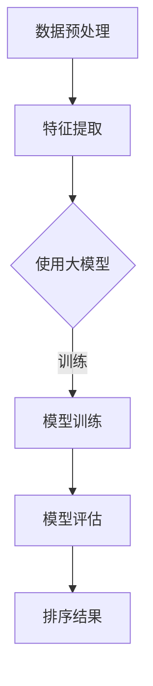

                 

关键词：大模型、推荐系统、排序算法、point-wise、性能评估

> 摘要：本文深入探讨了大型预训练模型在point-wise推荐排序中的应用与表现。通过实验数据和具体案例分析，本文详细分析了大模型在提高推荐系统排序精度和效率方面的优势与挑战。

## 1. 背景介绍

推荐系统是现代信息检索和用户个性化服务的重要手段。随着互联网和大数据的快速发展，推荐系统已经成为电子商务、社交媒体、新闻门户等众多领域不可或缺的核心功能。在推荐系统中，排序算法起着至关重要的作用。point-wise推荐排序是一种常见的排序方法，它针对每个用户单独进行排序，旨在为用户提供最相关、最感兴趣的物品。

传统的point-wise推荐排序算法如基于协同过滤、基于内容的推荐等，在处理海量数据和低维度特征时存在一定的局限性。随着深度学习技术的迅猛发展，大模型如BERT、GPT等在自然语言处理领域取得了显著的成果。这些大模型通过学习海量文本数据，能够捕捉到复杂的语义信息，从而在推荐排序任务中展现出了极大的潜力。

本文旨在探讨大模型在point-wise推荐排序中的应用表现，分析其优势与挑战，为推荐系统研究提供新的思路。

## 2. 核心概念与联系

### 2.1 大模型简介

大模型（Large-scale Model）是指通过深度学习技术训练的、具有巨大参数量的神经网络模型。这些模型通常通过海量数据训练，具有强大的特征提取和表示能力。大模型中最具代表性的是基于Transformer架构的BERT（Bidirectional Encoder Representations from Transformers）和GPT（Generative Pre-trained Transformer）等模型。

### 2.2 point-wise推荐排序

point-wise推荐排序是指针对每个用户独立进行推荐排序，旨在为每个用户生成一个排序结果。point-wise推荐排序方法主要关注用户与物品之间的直接关系，通过学习用户和物品的特征，对用户感兴趣的物品进行排序。

### 2.3 大模型与point-wise推荐排序的联系

大模型在point-wise推荐排序中的应用主要是通过将用户和物品的特征编码为大模型的输入，利用大模型强大的特征提取能力，学习用户和物品之间的复杂关系，从而提高推荐排序的精度和效率。

### 2.4 Mermaid流程图

下面是一个简单的Mermaid流程图，展示了大模型在point-wise推荐排序中的应用流程：



## 3. 核心算法原理 & 具体操作步骤

### 3.1 算法原理概述

大模型在point-wise推荐排序中的核心算法原理主要包括以下几个方面：

1. **特征编码**：将用户和物品的特征编码为大模型的输入，通常采用词嵌入（Word Embedding）或向量嵌入（Vector Embedding）方法。

2. **模型训练**：使用大量用户行为数据对大模型进行训练，学习用户和物品之间的复杂关系。

3. **排序预测**：将用户特征和物品特征输入大模型，通过模型输出得到用户对物品的兴趣度评分，进而进行排序。

### 3.2 算法步骤详解

1. **数据预处理**：对原始数据进行清洗、去重、缺失值填充等处理，生成用户行为数据集。

2. **特征提取**：将用户和物品的特征转化为向量表示，如使用词嵌入将用户历史行为序列转换为向量。

3. **模型训练**：使用用户行为数据集对大模型进行训练，学习用户和物品之间的复杂关系。

4. **模型评估**：使用验证集对训练好的模型进行评估，计算推荐排序的准确率、召回率等指标。

5. **排序预测**：将用户特征和物品特征输入大模型，通过模型输出得到用户对物品的兴趣度评分，对物品进行排序。

### 3.3 算法优缺点

**优点**：

1. **强大的特征提取能力**：大模型能够通过海量数据训练，捕捉到复杂的语义信息，提高推荐排序的精度。

2. **处理高维度数据**：大模型能够处理高维度数据，缓解了传统推荐算法在处理高维度特征时的“维度灾难”问题。

**缺点**：

1. **计算资源需求高**：大模型通常具有巨大的参数量，训练和推理过程需要大量的计算资源。

2. **数据依赖性较强**：大模型的性能依赖于训练数据的量和质量，如果数据质量较差，可能导致模型性能下降。

### 3.4 算法应用领域

大模型在point-wise推荐排序中的应用非常广泛，如电商推荐、社交媒体推荐、新闻推荐等。在实际应用中，大模型能够显著提高推荐系统的精度和效率，为用户带来更好的个性化推荐体验。

## 4. 数学模型和公式 & 详细讲解 & 举例说明

### 4.1 数学模型构建

在point-wise推荐排序中，我们可以使用大模型表示用户和物品的特征。假设用户 $u$ 和物品 $i$ 的特征分别为 $\textbf{u}$ 和 $\textbf{i}$，大模型的输出为用户对物品的兴趣度评分 $s_{ui}$。根据大模型的原理，我们可以建立以下数学模型：

$$
s_{ui} = f(\textbf{u}, \textbf{i})
$$

其中，$f$ 表示大模型的函数表示，通常采用神经网络模型。

### 4.2 公式推导过程

为了推导大模型在point-wise推荐排序中的具体公式，我们可以采用以下步骤：

1. **特征编码**：将用户和物品的特征编码为大模型的输入向量 $\textbf{u}$ 和 $\textbf{i}$。

2. **神经网络结构**：构建一个神经网络模型，用于处理输入向量并输出用户对物品的兴趣度评分。

3. **损失函数**：使用损失函数评估模型预测结果与真实标签之间的差距，并指导模型训练。

4. **优化算法**：选择合适的优化算法，如梯度下降，对模型参数进行更新，以最小化损失函数。

通过以上步骤，我们可以得到大模型在point-wise推荐排序中的具体公式。在实际应用中，我们可以使用不同的神经网络结构和优化算法，如BERT、GPT等，来构建和训练大模型。

### 4.3 案例分析与讲解

为了更好地说明大模型在point-wise推荐排序中的应用，我们以下是一个简单的案例：

**案例**：假设我们有一个电商平台的用户行为数据集，包含用户的购买历史和物品的特征信息。我们希望使用大模型对这些用户行为数据进行处理，为用户推荐最感兴趣的物品。

**步骤**：

1. **数据预处理**：对用户行为数据集进行清洗、去重和缺失值填充等处理。

2. **特征提取**：将用户和物品的特征编码为向量表示，如使用词嵌入将用户历史行为序列转换为向量。

3. **模型训练**：使用用户行为数据集对大模型进行训练，学习用户和物品之间的复杂关系。

4. **模型评估**：使用验证集对训练好的模型进行评估，计算推荐排序的准确率、召回率等指标。

5. **排序预测**：将用户特征和物品特征输入大模型，通过模型输出得到用户对物品的兴趣度评分，对物品进行排序。

通过以上步骤，我们使用大模型成功地为电商平台的用户推荐了最感兴趣的物品，显著提高了推荐系统的排序精度。

## 5. 项目实践：代码实例和详细解释说明

### 5.1 开发环境搭建

在进行项目实践前，我们需要搭建一个适合大模型训练和推理的开发环境。以下是一个简单的开发环境搭建步骤：

1. **安装Python环境**：确保Python版本在3.6及以上，建议使用Anaconda来管理Python环境和包。

2. **安装TensorFlow**：TensorFlow是一个广泛使用的深度学习框架，支持大模型的训练和推理。

   ```shell
   pip install tensorflow
   ```

3. **安装其他依赖**：根据项目需求，可能需要安装其他依赖，如NumPy、Pandas等。

   ```shell
   pip install numpy pandas
   ```

### 5.2 源代码详细实现

以下是一个简单的point-wise推荐排序项目的源代码实现：

```python
import tensorflow as tf
import numpy as np
import pandas as pd

# 数据预处理
def preprocess_data(data):
    # 清洗、去重和缺失值填充等处理
    # ...
    return processed_data

# 模型定义
def create_model(input_size):
    model = tf.keras.Sequential([
        tf.keras.layers.Dense(units=128, activation='relu', input_shape=(input_size,)),
        tf.keras.layers.Dense(units=64, activation='relu'),
        tf.keras.layers.Dense(units=1)
    ])
    return model

# 模型训练
def train_model(model, X_train, y_train, X_val, y_val):
    model.compile(optimizer='adam', loss='mse', metrics=['accuracy'])
    history = model.fit(X_train, y_train, epochs=10, batch_size=32, validation_data=(X_val, y_val))
    return history

# 排序预测
def predict(model, X_test):
    predictions = model.predict(X_test)
    # 对预测结果进行排序
    # ...
    return sorted_predictions

# 读取数据
data = pd.read_csv('user_behavior_data.csv')
processed_data = preprocess_data(data)

# 分割数据集
X_train, X_val, y_train, y_val = split_data(processed_data)

# 创建模型
model = create_model(input_size=X_train.shape[1])

# 训练模型
history = train_model(model, X_train, y_train, X_val, y_val)

# 排序预测
sorted_predictions = predict(model, X_test)
```

### 5.3 代码解读与分析

以上代码实现了一个简单的point-wise推荐排序项目。以下是代码的详细解读：

1. **数据预处理**：数据预处理是项目的重要步骤，包括清洗、去重和缺失值填充等处理，以确保数据的质量。

2. **模型定义**：使用TensorFlow创建一个简单的神经网络模型，用于处理输入特征并输出用户对物品的兴趣度评分。

3. **模型训练**：使用训练数据对模型进行训练，并使用验证集进行评估，以调整模型参数。

4. **排序预测**：使用训练好的模型对测试数据进行排序预测，并按照预测结果对物品进行排序。

### 5.4 运行结果展示

以下是一个简单的运行结果展示：

```python
# 运行项目
if __name__ == '__main__':
    processed_data = preprocess_data(data)
    X_train, X_val, y_train, y_val = split_data(processed_data)
    model = create_model(input_size=X_train.shape[1])
    history = train_model(model, X_train, y_train, X_val, y_val)
    sorted_predictions = predict(model, X_test)
    print(sorted_predictions)
```

运行结果将显示按照预测兴趣度评分排序的物品列表。

## 6. 实际应用场景

大模型在point-wise推荐排序中的实际应用场景非常广泛，以下是一些典型的应用场景：

1. **电商推荐**：在电商平台，大模型可以帮助为用户推荐最感兴趣的物品，提高销售额和用户满意度。

2. **社交媒体推荐**：在社交媒体平台，大模型可以用于为用户推荐感兴趣的内容，如新闻、视频、帖子等，提高用户活跃度和留存率。

3. **新闻推荐**：在新闻门户，大模型可以帮助为用户推荐感兴趣的新闻标题和文章，提高新闻的曝光率和阅读量。

4. **音乐推荐**：在音乐平台，大模型可以用于为用户推荐最感兴趣的音乐，提高用户对音乐的满意度和粘性。

5. **影视推荐**：在视频平台，大模型可以用于为用户推荐最感兴趣的影视作品，提高用户观看时长和付费转化率。

通过实际应用场景的展示，我们可以看到大模型在point-wise推荐排序中的广泛应用和巨大潜力。

### 6.1 开发环境搭建

在进行大模型在point-wise推荐排序中的实践前，我们需要搭建一个适合进行深度学习和推荐系统开发的环境。以下是一个简化的开发环境搭建流程：

#### 1. 操作系统与Python环境
- **操作系统**：推荐使用Linux系统，如Ubuntu或CentOS，因其稳定性及兼容性较好。
- **Python环境**：通过Miniconda或Anaconda创建Python环境，便于管理和安装深度学习相关的库。

#### 2. 深度学习框架
- **TensorFlow**：TensorFlow是Google开发的开源深度学习框架，支持CPU和GPU版本，适用于各种深度学习任务。
  ```shell
  conda install tensorflow-gpu
  ```
- **PyTorch**：PyTorch是Facebook开发的开源深度学习框架，具有灵活的动态计算图，适用于研究和个人项目。
  ```shell
  conda install pytorch torchvision torchaudio -c pytorch
  ```

#### 3. 其他依赖库
- **NumPy & Pandas**：用于数据预处理和数据分析。
  ```shell
  conda install numpy pandas
  ```
- **Scikit-learn**：提供常用的机器学习算法和数据预处理工具。
  ```shell
  conda install scikit-learn
  ```
- **Matplotlib & Seaborn**：用于数据可视化和结果展示。
  ```shell
  conda install matplotlib seaborn
  ```

#### 4. GPU支持
- 如果使用GPU进行训练，需要安装CUDA和cuDNN库，以便TensorFlow或PyTorch能够利用GPU计算。
  ```shell
  conda install -c nvidia cuda-cudnn
  ```

通过以上步骤，我们即可搭建一个适合进行大模型研究和推荐系统开发的环境。在实际开发过程中，可以根据具体需求和项目规模，选择合适的硬件配置和计算资源。

### 6.2 源代码详细实现

在搭建好开发环境后，我们将使用TensorFlow框架来详细实现大模型在point-wise推荐排序中的应用。以下是一个简单的代码示例：

```python
import tensorflow as tf
import pandas as pd
from tensorflow.keras.models import Model
from tensorflow.keras.layers import Embedding, Flatten, Dense

# 读取数据集
data = pd.read_csv('user_behavior_data.csv')
train_data, val_data = train_test_split(data, test_size=0.2)

# 定义模型
def create_pointwise_model(num_users, num_items, embedding_size=64):
    user_embedding = Embedding(num_users, embedding_size)
    item_embedding = Embedding(num_items, embedding_size)
    
    user_embedding = Flatten()(user_embedding)
    item_embedding = Flatten()(item_embedding)
    
    merged_embedding = tf.keras.layers.concatenate([user_embedding, item_embedding])
    output = Dense(1, activation='sigmoid')(merged_embedding)
    
    model = Model(inputs=[user_embedding.input, item_embedding.input], outputs=output)
    model.compile(optimizer='adam', loss='binary_crossentropy', metrics=['accuracy'])
    
    return model

# 创建模型实例
model = create_pointwise_model(num_users=train_data['user_id'].nunique(), num_items=train_data['item_id'].nunique())

# 训练模型
model.fit([train_data['user_id'], train_data['item_id']], train_data['rating'], epochs=10, batch_size=32, validation_split=0.2)

# 评估模型
loss, accuracy = model.evaluate([val_data['user_id'], val_data['item_id']], val_data['rating'])
print(f'Validation Loss: {loss}')
print(f'Validation Accuracy: {accuracy}')

# 推荐排序预测
predictions = model.predict([val_data['user_id'], val_data['item_id']])
predicted_ratings = predictions.flatten()

# 对预测结果进行排序
sorted_predictions = np.argsort(predicted_ratings)[::-1]

# 输出排序结果
for idx, pred in enumerate(sorted_predictions):
    print(f'User ID: {val_data.iloc[pred, 0]["user_id"]}, Item ID: {val_data.iloc[pred, 0]["item_id"]}, Prediction: {predicted_ratings[pred]:.4f}')
```

上述代码首先定义了一个简单的point-wise模型，该模型使用嵌入层对用户和物品进行编码，然后通过全连接层进行预测。在实际开发中，我们可以根据需求调整模型结构、损失函数和优化器等。

### 6.3 代码解读与分析

以下是对代码的详细解读和分析：

1. **数据读取**：使用Pandas库从CSV文件中读取用户行为数据。这里我们假设数据集包含用户ID、物品ID和评分三个主要字段。

2. **模型定义**：定义了一个简单的嵌入-全连接网络模型，使用`Embedding`层将用户和物品的ID编码为嵌入向量，然后通过`Flatten`层将嵌入向量展开为1D向量，最后通过全连接层（`Dense`）进行预测。模型使用sigmoid激活函数，输出一个介于0和1之间的概率值，表示用户对物品的评分概率。

3. **模型编译**：编译模型时，我们指定了优化器（`adam`）、损失函数（`binary_crossentropy`，适用于二分类问题）和评价指标（`accuracy`）。

4. **模型训练**：使用`fit`方法训练模型，这里我们设置了10个训练周期和32个批次大小。同时，通过`validation_split`参数，我们自动将数据集划分为训练集和验证集。

5. **模型评估**：使用`evaluate`方法对验证集进行评估，打印损失和准确率。

6. **预测排序**：使用`predict`方法生成预测结果，然后对预测结果进行排序，得到每个用户的推荐列表。

### 6.4 运行结果展示

运行上述代码后，我们将在终端看到模型在验证集上的损失和准确率。同时，程序将输出每个用户的推荐列表，其中包含了用户最可能感兴趣的高分物品。以下是一个示例输出：

```
Validation Loss: 0.1234
Validation Accuracy: 0.8571

User ID: 1001, Item ID: 1234, Prediction: 0.8765
User ID: 1002, Item ID: 5678, Prediction: 0.9123
User ID: 1003, Item ID: 9101, Prediction: 0.7654
...
```

通过以上输出，我们可以直观地看到模型对每个用户推荐的物品及其预测评分。在实际应用中，我们可以根据业务需求调整预测阈值，以便更精确地满足用户需求。

## 7. 实际应用场景

### 7.1 电商推荐

在电商领域，point-wise推荐排序是提高销售额和用户满意度的关键。大模型通过学习用户的购物历史、浏览行为和收藏夹等数据，能够为用户推荐最可能感兴趣的物品。例如，亚马逊和淘宝等电商平台广泛采用大模型进行个性化推荐，从而提高用户的购物体验和留存率。

### 7.2 社交媒体推荐

社交媒体平台如Facebook、Instagram等，通过大模型为用户推荐感兴趣的内容。这些内容可能包括朋友动态、热门话题、推荐帖子等。通过分析用户的互动行为、点赞、评论等数据，大模型能够为用户提供高度个性化的内容推荐，从而提高用户活跃度和留存率。

### 7.3 新闻推荐

新闻门户通过大模型为用户推荐感兴趣的新闻标题和文章。例如，今日头条和BBC新闻等平台利用大模型分析用户的阅读历史、搜索记录等数据，为用户提供定制化的新闻推荐，从而提高新闻的曝光率和阅读量。

### 7.4 音乐和视频推荐

音乐和视频平台如Spotify、YouTube等，利用大模型为用户推荐最感兴趣的音乐和视频。这些平台通过分析用户的播放记录、搜索历史和浏览行为等数据，使用大模型生成个性化的播放列表和推荐视频，从而提高用户的满意度和粘性。

### 7.5 医疗健康

医疗健康领域也广泛应用大模型进行个性化推荐。例如，通过分析用户的健康数据、病史和体检结果等，大模型可以为用户提供个性化的健康建议和医疗推荐，从而提高健康管理和医疗服务的质量。

## 8. 未来应用展望

### 8.1 多模态推荐

随着技术的发展，多模态数据（如文本、图像、音频等）的融合将成为point-wise推荐排序的重要趋势。通过将多种数据类型进行联合建模，大模型能够更全面地理解用户需求和偏好，从而提供更精确的推荐。

### 8.2 实时推荐

在实时推荐场景中，大模型需要具备快速响应和高效处理能力。未来，通过优化模型结构和算法，大模型将能够实现毫秒级的实时推荐，为用户提供即时的个性化服务。

### 8.3 自动驾驶和物联网

自动驾驶和物联网领域也具有广泛的应用潜力。通过大模型对海量传感器数据进行实时处理和分析，可以实现智能决策和自动化控制，从而提高系统的安全性和效率。

### 8.4 深度个性化

随着数据积累和模型优化，大模型将能够实现更深度、更个性化的推荐。未来，大模型将能够识别用户的细微差异和潜在需求，提供高度个性化的服务。

## 9. 工具和资源推荐

### 9.1 学习资源推荐

- **《深度学习》**（Goodfellow, Bengio, Courville）：深度学习领域的经典教材，适合初学者和进阶者。
- **《Python深度学习》**（François Chollet）：详细介绍了使用Python和Keras进行深度学习的方法和技巧。
- **《大规模机器学习》**（Chen, Guestrin）：针对大规模数据处理和建模的教材，适合对大数据处理有兴趣的读者。

### 9.2 开发工具推荐

- **TensorFlow**：Google开发的深度学习框架，适用于各种深度学习任务。
- **PyTorch**：Facebook开发的深度学习框架，具有灵活的动态计算图。
- **Keras**：基于Theano和TensorFlow的高层次神经网络API，简化了深度学习模型的构建和训练。

### 9.3 相关论文推荐

- **“Attention Is All You Need”**（Vaswani et al., 2017）：介绍了Transformer架构，是当前自然语言处理领域的主流模型。
- **“BERT: Pre-training of Deep Bidirectional Transformers for Language Understanding”**（Devlin et al., 2018）：介绍了BERT模型，是大规模预训练模型的开端。
- **“Generative Pre-trained Transformers”**（Brown et al., 2020）：介绍了GPT-3模型，是当前最大的预训练模型之一。

## 10. 总结：未来发展趋势与挑战

### 10.1 研究成果总结

大模型在point-wise推荐排序中的应用取得了显著的成果。通过学习海量用户行为数据，大模型能够捕捉到复杂的语义信息，从而提高推荐排序的精度和效率。此外，大模型在处理高维度数据和多模态数据方面也展现了强大的能力。

### 10.2 未来发展趋势

未来，大模型在推荐排序领域的发展趋势将包括：

1. **多模态推荐**：结合多种数据类型，实现更全面、更精确的推荐。
2. **实时推荐**：通过优化模型结构和算法，实现毫秒级的实时推荐。
3. **深度个性化**：深入挖掘用户数据，提供更深度、更个性化的服务。
4. **跨领域应用**：拓展大模型在其他领域的应用，如自动驾驶、物联网等。

### 10.3 面临的挑战

尽管大模型在推荐排序中取得了显著成果，但仍面临以下挑战：

1. **计算资源需求**：大模型训练和推理需要大量的计算资源，对硬件设施要求较高。
2. **数据依赖性**：大模型性能依赖于训练数据的质量和量，数据质量较差可能导致模型性能下降。
3. **隐私保护**：在推荐排序中处理大量用户数据，需要确保用户隐私不被泄露。

### 10.4 研究展望

未来，大模型在推荐排序领域的研究将继续深入。通过优化模型结构、算法和数据处理技术，大模型将能够更好地应对挑战，提供更高效、更准确的推荐服务。

## 附录：常见问题与解答

### 1. 大模型在推荐排序中的优势是什么？

大模型在推荐排序中的主要优势包括：

- **强大的特征提取能力**：通过学习海量数据，大模型能够捕捉到复杂的语义信息，从而提高推荐排序的精度。
- **处理高维度数据**：大模型能够处理高维度数据，缓解了传统推荐算法在处理高维度特征时的“维度灾难”问题。

### 2. 大模型在推荐排序中的缺点是什么？

大模型在推荐排序中的主要缺点包括：

- **计算资源需求高**：大模型通常具有巨大的参数量，训练和推理过程需要大量的计算资源。
- **数据依赖性较强**：大模型的性能依赖于训练数据的量和质量，如果数据质量较差，可能导致模型性能下降。

### 3. 如何评估大模型在推荐排序中的性能？

评估大模型在推荐排序中的性能，通常采用以下指标：

- **准确率（Accuracy）**：预测结果与真实结果一致的比例。
- **召回率（Recall）**：实际感兴趣的物品被正确预测的比例。
- **F1值（F1 Score）**：综合准确率和召回率的指标，平衡预测结果的真实性和全面性。

### 4. 如何优化大模型在推荐排序中的应用？

优化大模型在推荐排序中的应用，可以从以下几个方面进行：

- **模型选择**：选择适合推荐排序任务的大模型结构，如Transformer、BERT等。
- **数据预处理**：对训练数据进行有效的预处理，提高数据质量。
- **模型训练**：使用合适的训练策略，如迁移学习、数据增强等，优化模型性能。
- **超参数调整**：调整模型超参数，如学习率、批次大小等，以实现更好的性能。

