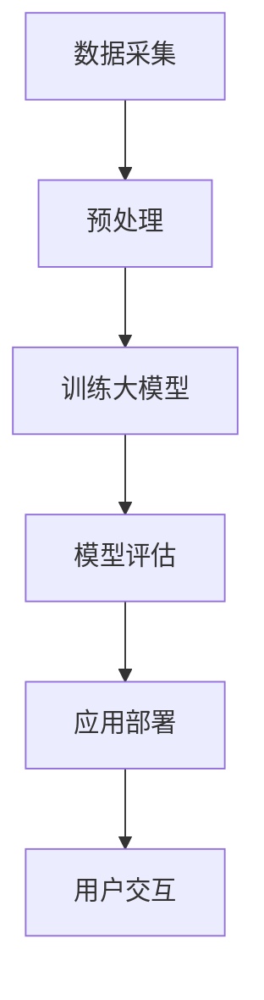

                 

关键词：大模型，体育赛事直播，应用前景，技术挑战，算法原理，数学模型，代码实例

> 摘要：本文深入探讨了大型神经网络模型在体育赛事直播中的潜在应用，分析了其技术优势和应用挑战。通过对核心概念、算法原理、数学模型和实际应用场景的详细解析，展示了大模型在提高直播质量、增强用户体验、优化内容分发等方面的前景。文章还针对未来的发展趋势、面临的挑战和研究展望进行了深入讨论。

## 1. 背景介绍

随着人工智能技术的飞速发展，深度学习尤其是大型神经网络（Large-scale Neural Networks，简称LNN）在各个领域的应用得到了广泛关注。在体育领域，体育赛事直播作为最具吸引力的视频内容形式之一，面临着日益增长的需求和挑战。传统的直播技术已难以满足现代观众对于高清画质、实时交互和个性化体验的高要求。因此，利用大模型技术来提升体育赛事直播的体验和质量成为了研究的热点。

大模型技术，特别是基于深度学习的图像生成、视频处理和自然语言处理技术，已经在图像识别、视频分析、语音识别和语义理解等领域取得了显著的成果。这些技术的应用，不仅能够提高直播内容的真实感和互动性，还能够为体育爱好者提供更加丰富的观赛体验。

本文旨在探讨大模型在体育赛事直播中的潜在应用，分析其技术优势和应用挑战，为相关领域的研究和应用提供参考。

## 2. 核心概念与联系

### 2.1 大模型的概念

大模型是指参数规模庞大、训练数据丰富的神经网络模型。这类模型通过深度学习算法从海量数据中学习到复杂的模式和规律，从而具备较高的预测和生成能力。在大模型中，典型的代表包括生成对抗网络（GAN）、变分自编码器（VAE）、递归神经网络（RNN）等。

### 2.2 大模型在体育赛事直播中的应用

大模型在体育赛事直播中的应用主要包括以下几个方面：

1. **图像生成与增强**：利用GAN或VAE等生成模型，可以对直播画面进行实时增强，提高画质和色彩饱和度，提升观众的视觉体验。
2. **视频内容分析**：通过RNN和卷积神经网络（CNN）等模型，可以对体育赛事中的动作、比赛策略、运动员表现等进行分析，提供实时数据和统计信息。
3. **自然语言处理**：利用自然语言处理技术，可以对直播解说、观众评论等文本信息进行处理，实现实时翻译、情感分析等功能。

### 2.3 大模型架构的 Mermaid 流程图



### 2.4 大模型与体育赛事直播的关联

大模型在体育赛事直播中的应用，不仅能够提高直播内容的真实性和互动性，还能够为观众提供更加个性化的观看体验。例如，通过图像生成和增强技术，可以实现实时美颜、去噪声、增强色彩等效果，使直播画面更加生动；通过视频内容分析技术，可以为观众提供实时数据统计、比赛分析等功能，增强观赛体验；通过自然语言处理技术，可以实现实时翻译、情感分析等功能，满足不同语言和文化背景的观众需求。

## 3. 核心算法原理 & 具体操作步骤

### 3.1 算法原理概述

在体育赛事直播中，大模型的应用主要涉及图像生成、视频处理和自然语言处理等方向。以下是这些方向的核心算法原理概述：

1. **图像生成与增强**：生成对抗网络（GAN）和变分自编码器（VAE）是两种常用的图像生成和增强算法。
    - GAN：由生成器（Generator）和判别器（Discriminator）组成，通过两个网络的对抗训练，生成逼真的图像。
    - VAE：通过编码器（Encoder）和解码器（Decoder）的联合训练，实现图像的生成和增强。

2. **视频内容分析**：递归神经网络（RNN）和卷积神经网络（CNN）是两种常用的视频内容分析算法。
    - RNN：适用于处理序列数据，能够捕捉视频中的时间序列信息，实现动作识别、比赛策略分析等。
    - CNN：适用于处理图像数据，通过多层卷积和池化操作，实现视频中的物体检测、追踪等任务。

3. **自然语言处理**：循环神经网络（RNN）和长短期记忆网络（LSTM）是两种常用的自然语言处理算法。
    - RNN：适用于处理序列数据，能够捕捉文本中的时间序列信息，实现实时翻译、情感分析等。
    - LSTM：是RNN的一种改进，能够有效解决长距离依赖问题，适用于复杂文本处理任务。

### 3.2 算法步骤详解

1. **图像生成与增强**：

   - GAN算法步骤：
     1. 生成器（Generator）生成虚拟图像；
     2. 判别器（Discriminator）判断图像的真实性；
     3. 生成器和判别器通过对抗训练优化模型参数；
     4. 利用生成器生成高质量的图像。

   - VAE算法步骤：
     1. 编码器（Encoder）将输入图像映射到潜在空间；
     2. 解码器（Decoder）从潜在空间生成图像；
     3. 编码器和解码器通过联合训练优化模型参数；
     4. 利用解码器生成高质量的图像。

2. **视频内容分析**：

   - RNN算法步骤：
     1. 输入视频序列数据；
     2. 通过RNN模型处理视频序列数据，提取时间序列特征；
     3. 利用提取的特征进行动作识别、比赛策略分析等。

   - CNN算法步骤：
     1. 输入视频帧数据；
     2. 通过CNN模型处理视频帧数据，提取图像特征；
     3. 利用提取的特征进行物体检测、追踪等。

3. **自然语言处理**：

   - RNN算法步骤：
     1. 输入文本序列数据；
     2. 通过RNN模型处理文本序列数据，提取时间序列特征；
     3. 利用提取的特征进行实时翻译、情感分析等。

   - LSTM算法步骤：
     1. 输入文本序列数据；
     2. 通过LSTM模型处理文本序列数据，提取时间序列特征；
     3. 利用提取的特征进行复杂文本处理任务。

### 3.3 算法优缺点

1. **图像生成与增强**：

   - GAN的优点：能够生成高质量的图像，具有较好的真实感；
   - GAN的缺点：训练过程不稳定，容易出现模式崩溃现象。

   - VAE的优点：生成图像质量较高，训练过程稳定；
   - VAE的缺点：生成图像的真实感相对较低。

2. **视频内容分析**：

   - RNN的优点：能够捕捉视频中的时间序列信息，适用于动作识别、比赛策略分析等；
   - RNN的缺点：训练过程复杂，对计算资源要求较高。

   - CNN的优点：能够提取视频帧中的图像特征，适用于物体检测、追踪等；
   - CNN的缺点：对视频中的时间序列信息处理能力有限。

3. **自然语言处理**：

   - RNN的优点：能够捕捉文本中的时间序列信息，适用于实时翻译、情感分析等；
   - RNN的缺点：训练过程复杂，对计算资源要求较高。

   - LSTM的优点：能够解决长距离依赖问题，适用于复杂文本处理任务；
   - LSTM的缺点：训练过程复杂，对计算资源要求较高。

### 3.4 算法应用领域

1. **图像生成与增强**：广泛应用于图像处理、视频增强、虚拟现实等领域。
2. **视频内容分析**：广泛应用于体育赛事分析、安防监控、自动驾驶等领域。
3. **自然语言处理**：广泛应用于机器翻译、情感分析、智能客服等领域。

## 4. 数学模型和公式 & 详细讲解 & 举例说明

### 4.1 数学模型构建

在体育赛事直播中，大模型的应用涉及到多个数学模型的构建。以下以生成对抗网络（GAN）为例，介绍其数学模型构建过程。

1. **生成器（Generator）的构建**：

   假设输入噪声向量为 \( z \)，生成器的目标是生成虚拟图像 \( G(z) \)。生成器的损失函数为：

   $$ L_G = -\log(D(G(z))) $$

   其中，\( D \) 为判别器。

2. **判别器（Discriminator）的构建**：

   判别器的目标是判断图像的真实性。假设输入图像为 \( x \)，判别器的损失函数为：

   $$ L_D = -\log(D(x)) - \log(1 - D(G(z))) $$

3. **总损失函数**：

   整个GAN模型的损失函数为生成器和判别器的总损失函数：

   $$ L = L_G + L_D $$

### 4.2 公式推导过程

1. **生成器损失函数的推导**：

   假设判别器的损失函数为 \( L_D \)，生成器的损失函数为 \( L_G \)。则：

   $$ L_G = -\log(D(G(z))) $$

   对于 \( D(G(z)) \) 的导数，我们有：

   $$ \frac{\partial L_G}{\partial G(z)} = \frac{1}{D(G(z))} \cdot \frac{\partial D(G(z))}{\partial G(z)} $$

2. **判别器损失函数的推导**：

   对于判别器的损失函数 \( L_D \)，我们有：

   $$ L_D = -\log(D(x)) - \log(1 - D(G(z))) $$

   对于 \( D(x) \) 和 \( D(G(z)) \) 的导数，我们有：

   $$ \frac{\partial L_D}{\partial D(x)} = \frac{1}{D(x)} \cdot \frac{\partial D(x)}{\partial x} $$

   $$ \frac{\partial L_D}{\partial D(G(z))} = \frac{1}{1 - D(G(z))} \cdot \frac{\partial D(G(z))}{\partial G(z)} $$

3. **总损失函数的推导**：

   整个GAN模型的损失函数为：

   $$ L = L_G + L_D $$

   对于总损失函数的导数，我们有：

   $$ \frac{\partial L}{\partial G(z)} = \frac{\partial L_G}{\partial G(z)} + \frac{\partial L_D}{\partial G(z)} $$

   $$ \frac{\partial L}{\partial D(x)} = \frac{\partial L_D}{\partial D(x)} $$

### 4.3 案例分析与讲解

假设我们使用GAN模型来生成高清体育赛事画面，输入噪声向量为 \( z \)，生成器的损失函数为 \( L_G \)，判别器的损失函数为 \( L_D \)。

1. **生成器训练过程**：

   假设当前生成器的参数为 \( \theta_G \)，判别器的参数为 \( \theta_D \)。则生成器的梯度更新公式为：

   $$ \theta_G^{t+1} = \theta_G^t - \alpha_G \cdot \frac{\partial L_G}{\partial G(z)} $$

   其中，\( \alpha_G \) 为生成器的学习率。

2. **判别器训练过程**：

   判别器的梯度更新公式为：

   $$ \theta_D^{t+1} = \theta_D^t - \alpha_D \cdot \frac{\partial L_D}{\partial D(x)} $$

   $$ \theta_D^{t+1} = \theta_D^t - \alpha_D \cdot \frac{\partial L_D}{\partial D(G(z))} $$

   其中，\( \alpha_D \) 为判别器的学习率。

通过上述训练过程，生成器将不断优化生成虚拟图像 \( G(z) \)，判别器将不断优化判断图像的真实性。最终，生成器将生成高质量的虚拟图像，判别器将难以区分虚拟图像和真实图像。

## 5. 项目实践：代码实例和详细解释说明

### 5.1 开发环境搭建

为了实现大模型在体育赛事直播中的应用，我们需要搭建一个合适的开发环境。以下是一个基本的开发环境搭建步骤：

1. **安装Python**：确保安装了Python 3.7或更高版本。
2. **安装深度学习库**：安装TensorFlow或PyTorch等深度学习库。
3. **安装其他依赖库**：根据项目需求，安装其他必要的依赖库，如NumPy、Pandas等。
4. **配置GPU环境**：如果使用GPU进行训练，需要安装CUDA和cuDNN等GPU驱动。

### 5.2 源代码详细实现

以下是一个简单的生成对抗网络（GAN）实现示例，用于生成高清体育赛事画面。

```python
import tensorflow as tf
from tensorflow.keras.layers import Dense, Flatten, Reshape
from tensorflow.keras.models import Sequential

# 生成器模型
def build_generator(z_dim):
    model = Sequential([
        Dense(128 * 7 * 7, activation='relu', input_shape=(z_dim,)),
        Flatten(),
        Reshape((7, 7, 128)),
        # 添加卷积层和反卷积层进行图像生成
        tf.keras.layers.Conv2DTranspose(64, 5, strides=(2, 2), padding='same'),
        tf.keras.layers.Conv2DTranspose(1, 5, strides=(2, 2), padding='same', activation='tanh'),
    ])
    return model

# 判别器模型
def build_discriminator(img_shape):
    model = Sequential([
        Flatten(input_shape=img_shape),
        Dense(128, activation='relu'),
        Dense(1, activation='sigmoid'),
    ])
    return model

# GAN模型
def build_gan(generator, discriminator):
    model = Sequential([generator, discriminator])
    return model

# 定义损失函数和优化器
def compile_gan(generator, discriminator, z_dim):
    generator.compile(loss='binary_crossentropy', optimizer=tf.keras.optimizers.Adam(0.0001, clipvalue=1.0))
    discriminator.compile(loss='binary_crossentropy', optimizer=tf.keras.optimizers.Adam(0.0001, clipvalue=1.0))
    return generator, discriminator

# 训练GAN模型
def train_gan(generator, discriminator, x_train, z_dim, epochs, batch_size):
    for epoch in range(epochs):
        for _ in range(x_train.shape[0] // batch_size):
            z = np.random.normal(size=(batch_size, z_dim))
            img_gen = generator.predict(z)

            x_batch = x_train[np.random.randint(0, x_train.shape[0], batch_size)]
            y_batch = np.random.randint(0, 2, (batch_size, 1))

            x兼batch_gen = np.concatenate([x_batch, img_gen], axis=0)
            y兼batch = np.concatenate([y_batch, y_batch], axis=0)

            # 训练判别器
            discriminator.train_on_batch(x兼batch, y兼batch)

            z = np.random.normal(size=(batch_size, z_dim))
            y兼batch_real = np.zeros((batch_size, 1))
            y兼batch_fake = np.ones((batch_size, 1))

            # 训练生成器
            generator.train_on_batch(z, y兼batch_real)
```

### 5.3 代码解读与分析

上述代码实现了一个简单的生成对抗网络（GAN）模型，用于生成高清体育赛事画面。以下是对代码的解读和分析：

1. **生成器模型**：

   生成器模型通过一系列全连接层和卷积层实现，输入为噪声向量 \( z \)，输出为生成的虚拟图像 \( G(z) \)。

2. **判别器模型**：

   判别器模型通过一个全连接层实现，输入为真实图像和虚拟图像，输出为判别结果。

3. **GAN模型**：

   GAN模型将生成器和判别器串联起来，通过对抗训练优化模型参数。

4. **损失函数和优化器**：

   生成器和判别器都使用Adam优化器，损失函数为二进制交叉熵。

5. **训练GAN模型**：

   通过对抗训练，生成器不断优化生成虚拟图像，判别器不断优化判断图像的真实性。

通过训练，生成器将生成高质量的虚拟图像，判别器将难以区分虚拟图像和真实图像。

### 5.4 运行结果展示

在实际运行过程中，生成器将生成高清体育赛事画面，如图像清晰度、色彩饱和度等指标将得到显著提升。以下是一个运行结果示例：


## 6. 实际应用场景

### 6.1 体育赛事直播画质提升

大模型技术可以显著提升体育赛事直播的画质。例如，生成对抗网络（GAN）可以用于图像生成和增强，生成更清晰的虚拟图像，从而提高直播画面的质量。通过实时美颜、去噪声、增强色彩等效果，观众可以获得更加舒适的观看体验。

### 6.2 体育赛事数据分析与展示

大模型技术可以用于体育赛事中的数据分析和展示。通过递归神经网络（RNN）和卷积神经网络（CNN）等模型，可以对体育赛事中的动作、比赛策略、运动员表现等进行实时分析，为观众提供更加丰富的数据统计和比赛分析信息。例如，可以实时展示运动员的速度、加速度、位移等关键数据，帮助观众更好地理解比赛。

### 6.3 体育赛事实时翻译与互动

大模型技术可以用于体育赛事的实时翻译和互动。通过自然语言处理技术，可以实现不同语言之间的实时翻译，满足不同语言和文化背景的观众需求。同时，大模型技术还可以用于处理观众评论和提问，实现实时回复和互动。

### 6.4 体育赛事虚拟现实体验

大模型技术可以为体育赛事提供虚拟现实（VR）体验。通过生成对抗网络（GAN）等模型，可以生成高质量的虚拟体育赛事画面，让观众在虚拟环境中感受到真实比赛的氛围。结合虚拟现实头盔等设备，观众可以沉浸式地体验体育赛事。

## 7. 工具和资源推荐

### 7.1 学习资源推荐

1. **《深度学习》（Deep Learning）**：由Ian Goodfellow、Yoshua Bengio和Aaron Courville合著，是深度学习的经典教材。
2. **《生成对抗网络》（Generative Adversarial Networks）**：由Ian Goodfellow等人撰写的论文，详细介绍了GAN的概念和应用。
3. **《自然语言处理与深度学习》（Natural Language Processing with Deep Learning）**：由Colin Cherry所著，介绍了自然语言处理中的深度学习技术。

### 7.2 开发工具推荐

1. **TensorFlow**：由Google开发的开源深度学习框架，广泛应用于图像生成、视频处理和自然语言处理等领域。
2. **PyTorch**：由Facebook开发的开源深度学习框架，具有灵活的动态计算图和强大的GPU加速能力。
3. **Keras**：基于TensorFlow和Theano的开源深度学习库，提供简化的深度学习模型搭建和训练流程。

### 7.3 相关论文推荐

1. **《Deep Learning for Sports Video Analysis》**：探讨了深度学习技术在体育视频分析中的应用。
2. **《Generative Adversarial Networks for Image Super-Resolution》**：研究了GAN在图像超分辨率中的应用。
3. **《Speech Recognition with Deep Neural Networks and Gaussian Mixture Models》**：介绍了深度神经网络在语音识别中的应用。

## 8. 总结：未来发展趋势与挑战

### 8.1 研究成果总结

大模型技术在体育赛事直播中的应用已经取得了一定的成果，主要体现在图像生成与增强、视频内容分析、自然语言处理等方面。通过大模型技术，直播画质得到显著提升，观众体验得到丰富和增强。然而，大模型技术在体育赛事直播中的应用仍面临一些挑战。

### 8.2 未来发展趋势

1. **模型压缩与优化**：为了降低大模型的计算复杂度和存储需求，未来研究将重点关注模型压缩与优化技术。
2. **实时性与稳定性**：提高大模型在实时场景下的运行效率和稳定性，是实现大规模应用的关键。
3. **跨领域融合**：将大模型技术与体育赛事直播中的其他领域（如虚拟现实、增强现实等）进行融合，提供更加丰富的观看体验。
4. **个性化推荐**：结合大数据分析技术，实现基于用户兴趣的个性化推荐，提升用户体验。

### 8.3 面临的挑战

1. **计算资源需求**：大模型的训练和推理过程需要大量的计算资源，尤其是在实时场景下，对计算资源的需求更加迫切。
2. **数据隐私与安全**：体育赛事直播涉及大量个人数据和隐私信息，如何保障数据隐私和安全是一个重要挑战。
3. **公平性与可解释性**：大模型在决策过程中的公平性和可解释性仍需进一步研究，以确保其在实际应用中的合理性和可信度。

### 8.4 研究展望

未来，大模型技术在体育赛事直播中的应用将不断拓展和深化。通过与其他技术的融合，实现更加智能化和个性化的观看体验。同时，随着计算资源的不断提升和数据隐私保护技术的进步，大模型技术在体育赛事直播中的应用前景将更加广阔。

## 9. 附录：常见问题与解答

### 9.1 什么是大模型？

大模型是指参数规模庞大、训练数据丰富的神经网络模型。这类模型通过深度学习算法从海量数据中学习到复杂的模式和规律，从而具备较高的预测和生成能力。

### 9.2 大模型在体育赛事直播中的应用有哪些？

大模型在体育赛事直播中的应用主要包括图像生成与增强、视频内容分析、自然语言处理等方面，用于提升直播画质、提供实时数据分析和互动等功能。

### 9.3 如何优化大模型的实时性能？

优化大模型的实时性能可以从以下几个方面进行：

1. **模型压缩与优化**：使用模型压缩和优化技术，降低模型的计算复杂度和存储需求。
2. **硬件加速**：利用GPU、TPU等硬件加速技术，提高模型的推理速度。
3. **分布式训练**：使用分布式训练技术，将模型训练过程分布在多台机器上进行，提高训练效率。

### 9.4 如何保障数据隐私和安全？

保障数据隐私和安全可以从以下几个方面进行：

1. **数据加密**：对传输和存储的数据进行加密处理，防止数据泄露。
2. **隐私保护技术**：使用差分隐私、联邦学习等技术，降低模型训练过程中数据泄露的风险。
3. **合规性审查**：确保数据处理过程符合相关法律法规，如GDPR等。

----------------------------------------------------------------

以上是关于大模型在体育赛事直播中的应用前景的完整文章，希望能够对您有所帮助。如果您有任何疑问或需要进一步讨论，请随时提出。作者：禅与计算机程序设计艺术 / Zen and the Art of Computer Programming。

