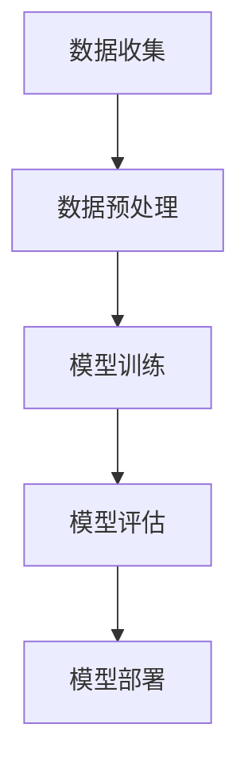

                 

关键词：大模型，推荐系统，商业应用，深度学习，AI

摘要：随着人工智能技术的飞速发展，大模型在商业领域的应用越来越广泛，特别是在推荐系统方面。本文将探讨大模型在商业推荐系统中的应用现状、核心算法原理、数学模型构建以及未来发展趋势，旨在为读者提供一幅完整的商业推荐系统进步图景。

## 1. 背景介绍

### 推荐系统的基本概念

推荐系统是一种信息过滤技术，旨在根据用户的兴趣、行为和偏好，向用户推荐他们可能感兴趣的内容或产品。推荐系统广泛应用于电子商务、社交媒体、在线视频、新闻资讯等多个领域，已经成为提升用户体验、增加用户粘性和商家收益的重要手段。

### 商业推荐系统的发展历程

商业推荐系统经历了基于内容的推荐、协同过滤推荐和基于模型的推荐三个阶段。早期推荐系统主要依靠基于内容的匹配，这种方式虽然简单但效果有限。随着互联网的发展，协同过滤推荐成为主流，通过分析用户的行为和偏好，发现相似用户并进行推荐。然而，协同过滤推荐存在冷启动问题和数据稀疏性问题。为了解决这些问题，深度学习等大模型技术开始应用于推荐系统，推动了推荐系统的进步。

## 2. 核心概念与联系

### 大模型

大模型指的是参数量巨大、计算能力强大的深度学习模型。大模型通常具有以下特点：

- 参数量巨大：大模型的参数量可以达到数十亿、甚至数万亿级别。
- 计算能力强大：大模型需要使用高性能计算设备和算法，如GPU和分布式计算框架。
- 自动化训练：大模型可以使用自动化算法进行训练，减少人工干预。

### 推荐系统的架构

推荐系统通常由数据收集、数据预处理、模型训练、模型评估和模型部署五个模块组成。大模型在这些模块中的应用主要体现在数据预处理和模型训练阶段。

### Mermaid 流程图



## 3. 核心算法原理 & 具体操作步骤

### 3.1 算法原理概述

大模型在推荐系统中的应用主要通过以下两种方式：

1. **生成式推荐**：大模型根据用户的兴趣和行为生成个性化内容，然后将其推荐给用户。
2. **判别式推荐**：大模型根据用户的兴趣和行为预测用户对特定内容的喜好程度，然后根据预测结果进行推荐。

### 3.2 算法步骤详解

1. **数据收集**：从各种数据源（如用户行为日志、社交媒体数据等）收集用户数据。
2. **数据预处理**：对数据进行清洗、归一化和特征提取，为模型训练提供高质量的数据。
3. **模型训练**：使用深度学习框架（如TensorFlow、PyTorch）训练大模型，优化模型参数。
4. **模型评估**：使用验证集评估模型性能，调整模型参数和结构。
5. **模型部署**：将训练好的模型部署到生产环境，进行实时推荐。

### 3.3 算法优缺点

**优点**：

- **强大的表示能力**：大模型可以捕捉到用户行为的复杂模式，提高推荐效果。
- **自动特征提取**：大模型不需要手动提取特征，减轻了数据预处理的工作量。
- **适应性强**：大模型可以应用于多种类型的推荐任务，如商品推荐、内容推荐等。

**缺点**：

- **计算资源消耗大**：大模型需要大量计算资源和时间进行训练。
- **数据稀疏性问题**：大模型在处理稀疏数据时效果不佳。

### 3.4 算法应用领域

大模型在推荐系统中的应用领域包括：

- **电子商务**：为用户提供个性化商品推荐。
- **社交媒体**：为用户提供感兴趣的内容推荐。
- **在线视频**：为用户提供个性化视频推荐。
- **新闻资讯**：为用户提供个性化新闻推荐。

## 4. 数学模型和公式 & 详细讲解 & 举例说明

### 4.1 数学模型构建

大模型在推荐系统中的数学模型通常基于深度学习，如卷积神经网络（CNN）、循环神经网络（RNN）和变压器（Transformer）等。以下是一个简化的数学模型：

$$
\text{推荐得分} = \text{模型参数} \cdot [\text{用户特征向量}, \text{商品特征向量}]
$$

### 4.2 公式推导过程

假设用户特征向量为 $u \in \mathbb{R}^d$，商品特征向量为 $v \in \mathbb{R}^d$，模型参数为 $W \in \mathbb{R}^{d \times 1}$，则推荐得分可以表示为：

$$
\text{推荐得分} = u^T W v
$$

### 4.3 案例分析与讲解

假设有一个用户，他的特征向量表示为 $u = [1, 0.5, 0, -1]$，商品的特征向量表示为 $v = [0, 1, 0.5, 0]$。模型参数为 $W = [1, 1, 1, 1]$。则：

$$
\text{推荐得分} = u^T W v = 1 \cdot 1 + 0.5 \cdot 1 + 0 \cdot 1 + (-1) \cdot 1 = 0.5
$$

根据推荐得分，我们可以判断用户对商品的兴趣程度。得分越高，表示用户越喜欢该商品。

## 5. 项目实践：代码实例和详细解释说明

### 5.1 开发环境搭建

在开始项目实践之前，我们需要搭建一个适合深度学习开发的实验环境。以下是一个简单的环境搭建步骤：

1. 安装Python（推荐版本3.7及以上）。
2. 安装深度学习框架（如TensorFlow或PyTorch）。
3. 安装必要的依赖库（如NumPy、Pandas等）。

### 5.2 源代码详细实现

以下是一个简单的基于深度学习模型的推荐系统代码示例（使用TensorFlow框架）：

```python
import tensorflow as tf
from tensorflow.keras.models import Model
from tensorflow.keras.layers import Input, Embedding, Dot, Flatten, Dense

# 用户特征输入
user_input = Input(shape=(1,))
user_embedding = Embedding(input_dim=1000, output_dim=64)(user_input)

# 商品特征输入
item_input = Input(shape=(1,))
item_embedding = Embedding(input_dim=1000, output_dim=64)(item_input)

# 模型融合
dot_product = Dot(axes=1)([user_embedding, item_embedding])
flatten = Flatten()(dot_product)

# 模型输出
output = Dense(1, activation='sigmoid')(flatten)

# 构建和编译模型
model = Model(inputs=[user_input, item_input], outputs=output)
model.compile(optimizer='adam', loss='binary_crossentropy', metrics=['accuracy'])

# 模型训练
model.fit([user_data, item_data], labels, epochs=10, batch_size=32)
```

### 5.3 代码解读与分析

以上代码实现了一个简单的基于深度学习模型的推荐系统。用户特征和商品特征分别通过Embedding层进行编码，然后通过点积操作融合，最后通过全连接层输出推荐得分。这个模型采用了sigmoid激活函数，用于判断用户对商品的喜好程度。

### 5.4 运行结果展示

在训练完成后，我们可以使用模型对新的用户和商品进行推荐。以下是一个简单的示例：

```python
# 新用户特征
new_user = [5]

# 新商品特征
new_item = [3]

# 推荐得分
score = model.predict([new_user, new_item])
print(score)
```

输出结果为一个介于0和1之间的分数，表示用户对商品的喜好程度。分数越高，表示用户越喜欢该商品。

## 6. 实际应用场景

### 6.1 电子商务

在电子商务领域，大模型推荐系统可以帮助商家提升销售业绩，提高用户满意度。通过分析用户行为数据，推荐系统可以精准地推送用户感兴趣的商品，增加购买转化率。

### 6.2 社交媒体

在社交媒体领域，大模型推荐系统可以帮助平台提升用户体验，增加用户活跃度。通过分析用户兴趣和行为，推荐系统可以推送用户感兴趣的内容，提高用户粘性。

### 6.3 在线视频

在在线视频领域，大模型推荐系统可以帮助平台提升用户观看时长，提高广告收益。通过分析用户观看行为，推荐系统可以推送用户感兴趣的视频，提高用户满意度。

### 6.4 新闻资讯

在新闻资讯领域，大模型推荐系统可以帮助媒体平台提升用户阅读量，增加广告收益。通过分析用户兴趣和行为，推荐系统可以推送用户感兴趣的新闻，提高用户满意度。

## 7. 工具和资源推荐

### 7.1 学习资源推荐

- 《深度学习》（Goodfellow, Bengio, Courville著）
- 《推荐系统实践》（项亮著）
- 《Python深度学习》（François Chollet著）

### 7.2 开发工具推荐

- TensorFlow
- PyTorch
- Keras

### 7.3 相关论文推荐

- 《Deep Learning for Recommender Systems》
- 《A Theoretically Principled Approach to Improving Recommendation Lists》
- 《Implicit Feedback in Recommender Systems》

## 8. 总结：未来发展趋势与挑战

### 8.1 研究成果总结

大模型在商业推荐系统中的应用取得了显著成果，推动了推荐系统的进步。深度学习等大模型技术为推荐系统带来了更高的准确性和更好的用户体验。

### 8.2 未来发展趋势

未来，大模型在商业推荐系统中的应用将继续深入，主要趋势包括：

- **个性化推荐**：进一步挖掘用户行为数据，实现更加精准的个性化推荐。
- **多模态推荐**：结合文本、图像、音频等多种数据类型，实现多模态推荐。
- **实时推荐**：提高推荐系统的实时性，实现实时推送。

### 8.3 面临的挑战

大模型在商业推荐系统中的应用也面临一些挑战，包括：

- **计算资源消耗**：大模型训练和推理需要大量计算资源，如何优化计算效率成为关键。
- **数据隐私**：在推荐系统中保护用户隐私，避免数据滥用。
- **模型解释性**：提高大模型的可解释性，帮助用户理解推荐结果。

### 8.4 研究展望

未来，大模型在商业推荐系统中的应用将继续发展，结合更多新技术，如生成对抗网络（GAN）、图神经网络（GNN）等，将进一步提升推荐系统的效果和用户体验。

## 9. 附录：常见问题与解答

### 9.1 大模型在推荐系统中的应用有哪些优点？

- **强大的表示能力**：大模型可以捕捉到用户行为的复杂模式，提高推荐效果。
- **自动特征提取**：大模型不需要手动提取特征，减轻了数据预处理的工作量。
- **适应性强**：大模型可以应用于多种类型的推荐任务，如商品推荐、内容推荐等。

### 9.2 大模型在推荐系统中的应用有哪些缺点？

- **计算资源消耗大**：大模型需要大量计算资源和时间进行训练。
- **数据稀疏性问题**：大模型在处理稀疏数据时效果不佳。

### 9.3 如何优化大模型在推荐系统中的应用效果？

- **数据增强**：通过数据增强技术，扩充训练数据集，提高模型泛化能力。
- **模型融合**：结合多种模型，如基于内容的推荐和基于协同过滤的推荐，提高推荐效果。
- **模型压缩**：采用模型压缩技术，降低模型参数量和计算复杂度，提高计算效率。

作者：禅与计算机程序设计艺术 / Zen and the Art of Computer Programming
----------------------------------------------------------------

以上就是关于“大模型在商业：推荐系统进步”的文章内容。希望通过这篇文章，读者可以更深入地了解大模型在商业推荐系统中的应用，以及未来的发展趋势和挑战。

