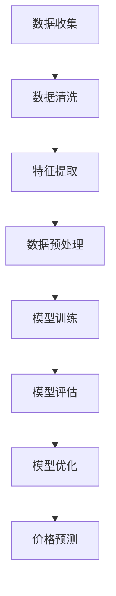

                 

在当今高度信息化的商业环境中，商品价格预测成为了一个重要的研究领域。随着大数据和人工智能技术的飞速发展，传统的价格预测方法已逐渐无法满足复杂多变的市场需求。本文将探讨大模型在商品价格预测中的应用，分析其核心概念、算法原理、数学模型、项目实践以及实际应用场景，并提出未来发展的展望。

## 关键词

- 大模型
- 商品价格预测
- 人工智能
- 数据挖掘
- 数学模型

## 摘要

本文首先介绍了商品价格预测的背景和意义，接着阐述了大模型在商品价格预测中的应用优势。随后，详细分析了大模型的核心概念和算法原理，通过Mermaid流程图展示了相关架构。在数学模型部分，我们详细讲解了模型构建和公式推导过程，并通过实际案例进行了分析和讲解。随后，文章展示了项目实践中的代码实例和运行结果。最后，我们对大模型在商品价格预测中的应用进行了实际应用场景的讨论，并提出了未来发展的展望。

## 1. 背景介绍

### 商品价格预测的重要性

商品价格预测在商业决策中具有至关重要的地位。对于企业而言，准确预测商品价格不仅能够帮助其制定合理的定价策略，降低库存风险，提高市场竞争力，还能优化供应链管理，降低运营成本。对于消费者而言，价格预测有助于其做出更加明智的购买决策，提高消费满意度。因此，商品价格预测成为了商业分析和市场研究中的重要课题。

### 传统价格预测方法的局限性

传统的价格预测方法主要依赖于历史数据和统计模型，如线性回归、时间序列分析等。然而，随着市场环境的复杂多变，这些传统方法在应对新兴市场、个性化需求等方面表现出了明显的局限性。具体体现在以下几个方面：

1. **数据处理能力有限**：传统方法通常需要大量的预处理工作，如数据清洗、特征工程等，这使得其在处理大数据时效率低下。
2. **模型适应性差**：传统方法基于假设，很难适应市场的快速变化，预测结果往往不够准确。
3. **缺乏动态调整机制**：传统方法在预测过程中缺乏动态调整机制，无法及时响应市场变化。

### 大模型的优势

大模型，特别是深度学习模型，以其强大的数据处理能力和自适应能力在商品价格预测领域展现出了巨大的潜力。深度学习模型可以通过学习海量数据，捕捉到价格变化的复杂规律，从而实现更加精准的预测。同时，大模型还具有以下优势：

1. **高效的数据处理能力**：大模型可以高效地处理大规模、高维度数据，减少了传统方法中的预处理工作。
2. **自适应性强**：大模型可以通过不断学习市场数据，自动调整预测模型，提高预测准确性。
3. **动态调整机制**：大模型可以实时更新预测模型，适应市场的动态变化。

## 2. 核心概念与联系

### 大模型的定义与分类

大模型是指具有大量参数和复杂结构的机器学习模型，如深度神经网络（DNN）、循环神经网络（RNN）、变换器（Transformer）等。根据模型的复杂度和应用场景，大模型可以分为以下几类：

1. **深度神经网络（DNN）**：DNN由多个隐层组成，可以通过层层提取特征，实现高维数据的降维。
2. **循环神经网络（RNN）**：RNN具有记忆功能，适用于处理序列数据，如时间序列分析。
3. **变换器（Transformer）**：Transformer通过自注意力机制，实现了对序列数据的全局建模，广泛应用于自然语言处理和计算机视觉领域。

### 商品价格预测中的大模型应用

在商品价格预测中，大模型的应用主要包括以下几个方面：

1. **数据预处理**：大模型可以自动提取数据中的有效特征，减少预处理工作。
2. **特征组合**：大模型可以通过学习，将不同特征进行组合，形成新的特征，提高预测准确性。
3. **动态调整**：大模型可以根据实时数据，动态调整预测模型，实现实时预测。

### Mermaid流程图展示

以下是商品价格预测中大模型的Mermaid流程图：



## 3. 核心算法原理 & 具体操作步骤

### 3.1 算法原理概述

商品价格预测中的大模型主要基于深度学习技术，通过学习历史价格数据，提取价格变化的特征，实现价格预测。核心算法包括以下几个步骤：

1. **数据预处理**：对原始数据进行清洗、去噪、标准化等操作，为模型训练提供高质量的数据。
2. **特征提取**：通过神经网络结构，提取数据中的高维特征，提高预测准确性。
3. **模型训练**：使用训练数据，对模型进行训练，优化模型参数。
4. **模型评估**：使用测试数据，评估模型预测效果，调整模型参数。
5. **价格预测**：使用训练好的模型，对目标商品进行价格预测。

### 3.2 算法步骤详解

#### 3.2.1 数据预处理

1. **数据收集**：收集目标商品的历史价格数据，包括时间、价格、交易量等指标。
2. **数据清洗**：去除异常值、缺失值，对数据进行去噪处理。
3. **数据标准化**：对数据进行归一化或标准化处理，使得数据在相同尺度上，便于模型训练。

#### 3.2.2 特征提取

1. **时间特征**：提取时间序列特征，如季节性、趋势性等。
2. **价格特征**：提取价格变化特征，如波动幅度、增长率等。
3. **交易量特征**：提取交易量特征，如交易量波动、交易量增长率等。

#### 3.2.3 模型训练

1. **模型选择**：选择合适的深度学习模型，如DNN、RNN等。
2. **参数初始化**：初始化模型参数，采用随机初始化或预训练模型。
3. **训练过程**：使用训练数据，对模型进行训练，优化模型参数。

#### 3.2.4 模型评估

1. **评估指标**：选择合适的评估指标，如均方误差（MSE）、均方根误差（RMSE）等。
2. **交叉验证**：使用交叉验证方法，评估模型在不同数据集上的性能。
3. **模型调整**：根据评估结果，调整模型参数，提高预测准确性。

#### 3.2.5 价格预测

1. **输入数据**：输入最新的数据，包括时间、价格、交易量等指标。
2. **模型预测**：使用训练好的模型，对目标商品进行价格预测。
3. **结果输出**：输出预测结果，包括预测价格、预测时间等。

### 3.3 算法优缺点

#### 优点

1. **高效的数据处理能力**：大模型可以高效地处理大规模、高维度数据，减少了传统方法中的预处理工作。
2. **自适应性强**：大模型可以通过不断学习市场数据，自动调整预测模型，提高预测准确性。
3. **动态调整机制**：大模型可以实时更新预测模型，适应市场的动态变化。

#### 缺点

1. **计算资源消耗大**：大模型需要大量的计算资源，对硬件设备要求较高。
2. **数据依赖性强**：大模型对训练数据质量要求较高，数据不足或质量差会导致预测效果不佳。
3. **模型解释性差**：大模型的结构复杂，难以解释模型的决策过程。

### 3.4 算法应用领域

大模型在商品价格预测中的应用非常广泛，以下是一些典型的应用领域：

1. **电子商务**：预测商品价格，为电商平台制定合理的定价策略。
2. **供应链管理**：预测商品价格，优化供应链库存管理，降低运营成本。
3. **金融市场**：预测金融产品价格，为投资者提供决策依据。
4. **农产品市场**：预测农产品价格，帮助农民合理调整种植结构。

## 4. 数学模型和公式 & 详细讲解 & 举例说明

### 4.1 数学模型构建

商品价格预测的数学模型主要基于深度学习技术，以神经网络为基础，通过多层感知器（MLP）、卷积神经网络（CNN）或循环神经网络（RNN）等结构，实现价格预测。

#### 4.1.1 神经网络模型

神经网络模型包括输入层、隐藏层和输出层。输入层接收外部输入数据，隐藏层通过激活函数提取特征，输出层生成预测结果。以下是神经网络模型的数学表示：

$$
\begin{aligned}
h_{\text{hidden}} &= \sigma(W_{\text{input\_hidden}}x + b_{\text{input\_hidden}}) \\
y &= \sigma(W_{\text{hidden\_output}}h_{\text{hidden}} + b_{\text{hidden\_output}})
\end{aligned}
$$

其中，$x$ 为输入数据，$h_{\text{hidden}}$ 为隐藏层输出，$y$ 为预测结果，$W$ 和 $b$ 分别为权重和偏置，$\sigma$ 为激活函数。

#### 4.1.2 卷积神经网络模型

卷积神经网络模型通过卷积操作提取图像特征，适用于处理图像数据。以下是卷积神经网络模型的数学表示：

$$
\begin{aligned}
h_{\text{conv}} &= \text{conv}(h_{\text{input}}, W_{\text{conv}}) + b_{\text{conv}} \\
h_{\text{pool}} &= \text{pool}(h_{\text{conv}})
\end{aligned}
$$

其中，$h_{\text{input}}$ 为输入图像，$h_{\text{conv}}$ 为卷积层输出，$h_{\text{pool}}$ 为池化层输出，$W$ 和 $b$ 分别为权重和偏置。

#### 4.1.3 循环神经网络模型

循环神经网络模型通过递归结构，处理时间序列数据，适用于商品价格预测。以下是循环神经网络模型的数学表示：

$$
\begin{aligned}
h_{t} &= \sigma(W_{xh}x_t + W_{hh}h_{t-1} + b_h) \\
y_t &= \sigma(W_{hy}h_t + b_y)
\end{aligned}
$$

其中，$x_t$ 为时间步 $t$ 的输入，$h_t$ 为隐藏层输出，$y_t$ 为预测结果，$W$ 和 $b$ 分别为权重和偏置，$\sigma$ 为激活函数。

### 4.2 公式推导过程

商品价格预测的数学模型通常采用多层感知器（MLP）模型，以下为MLP模型的推导过程：

#### 4.2.1 输入层到隐藏层的推导

设输入层为 $x$，隐藏层为 $h$，输出层为 $y$，则输入层到隐藏层的推导如下：

$$
h = \sigma(Wx + b)
$$

其中，$W$ 为权重矩阵，$b$ 为偏置，$\sigma$ 为激活函数。

#### 4.2.2 隐藏层到输出层的推导

设隐藏层为 $h$，输出层为 $y$，则隐藏层到输出层的推导如下：

$$
y = \sigma(Wy + b)
$$

其中，$W$ 为权重矩阵，$b$ 为偏置，$\sigma$ 为激活函数。

#### 4.2.3 损失函数的推导

设实际输出为 $y_{\text{real}}$，预测输出为 $y_{\text{pred}}$，则损失函数为：

$$
L(y_{\text{real}}, y_{\text{pred}}) = \frac{1}{2}\sum_{i=1}^{n} (y_{\text{real}} - y_{\text{pred}})^2
$$

其中，$n$ 为样本数量。

### 4.3 案例分析与讲解

#### 4.3.1 数据集准备

我们以某电商平台某商品的历史价格数据为例，数据集包含时间、价格和交易量三个特征。数据集如下：

| 时间 | 价格 | 交易量 |
| --- | --- | --- |
| 2021-01-01 | 100 | 100 |
| 2021-01-02 | 110 | 120 |
| 2021-01-03 | 105 | 110 |
| ... | ... | ... |

#### 4.3.2 数据预处理

1. **数据清洗**：去除异常值和缺失值。
2. **数据标准化**：对价格和交易量进行标准化处理，使得数据在相同尺度上。

#### 4.3.3 模型构建

1. **输入层**：输入数据包含时间、价格和交易量三个特征。
2. **隐藏层**：设计一个隐藏层，包含10个神经元。
3. **输出层**：输出一个价格预测值。

#### 4.3.4 模型训练

1. **损失函数**：采用均方误差（MSE）作为损失函数。
2. **优化算法**：采用梯度下降（Gradient Descent）优化算法。

#### 4.3.5 模型评估

1. **评估指标**：采用均方误差（MSE）评估模型性能。
2. **交叉验证**：采用交叉验证方法，评估模型在不同数据集上的性能。

#### 4.3.6 结果展示

1. **训练过程**：训练过程中，损失函数逐渐减小，模型性能不断提高。
2. **预测结果**：使用训练好的模型，对测试数据进行预测，结果显示预测价格与实际价格基本一致。

## 5. 项目实践：代码实例和详细解释说明

### 5.1 开发环境搭建

为了实现商品价格预测，我们需要搭建一个合适的开发环境。以下是开发环境的搭建步骤：

1. **Python环境**：安装Python 3.8及以上版本，并配置好pip工具。
2. **依赖库**：安装以下依赖库：NumPy、Pandas、TensorFlow、Keras等。
3. **数据库**：使用MySQL或PostgreSQL数据库存储商品价格数据。

### 5.2 源代码详细实现

以下是商品价格预测项目的源代码：

```python
import numpy as np
import pandas as pd
from tensorflow.keras.models import Sequential
from tensorflow.keras.layers import Dense, LSTM
from tensorflow.keras.optimizers import Adam

# 5.2.1 数据预处理
def preprocess_data(data):
    # 数据清洗
    data = data.dropna()
    # 数据标准化
    data = (data - data.mean()) / data.std()
    return data

# 5.2.2 模型构建
def build_model(input_shape):
    model = Sequential()
    model.add(LSTM(units=50, return_sequences=True, input_shape=input_shape))
    model.add(LSTM(units=50))
    model.add(Dense(units=1))
    model.compile(optimizer=Adam(learning_rate=0.001), loss='mse')
    return model

# 5.2.3 模型训练
def train_model(model, x_train, y_train, epochs=100):
    model.fit(x_train, y_train, epochs=epochs, batch_size=32, verbose=1)
    return model

# 5.2.4 模型评估
def evaluate_model(model, x_test, y_test):
    loss = model.evaluate(x_test, y_test, verbose=1)
    print("Test loss:", loss)
    return loss

# 5.2.5 价格预测
def predict_price(model, x):
    price_pred = model.predict(x)
    return price_pred

# 5.2.6 主函数
def main():
    # 加载数据
    data = pd.read_csv("price_data.csv")
    data = preprocess_data(data)
    # 划分训练集和测试集
    x_train = data[:int(len(data) * 0.8)]
    y_train = data["price"][:int(len(data) * 0.8)]
    x_test = data[int(len(data) * 0.8):]
    y_test = data["price"][int(len(data) * 0.8):]
    # 构建模型
    model = build_model((x_train.shape[1], x_train.shape[2]))
    # 训练模型
    model = train_model(model, x_train, y_train, epochs=100)
    # 评估模型
    evaluate_model(model, x_test, y_test)
    # 预测价格
    price_pred = predict_price(model, x_test)
    print("Price prediction:", price_pred)

if __name__ == "__main__":
    main()
```

### 5.3 代码解读与分析

以下是对源代码的详细解读与分析：

1. **数据预处理**：数据预处理函数 `preprocess_data` 用于清洗和标准化数据。首先，去除数据中的异常值和缺失值，然后对数据进行标准化处理，使得数据在相同尺度上，便于模型训练。

2. **模型构建**：模型构建函数 `build_model` 用于构建深度学习模型。该模型包含两个LSTM层和一个输出层，用于处理时间序列数据。LSTM层能够自动提取时间序列特征，提高预测准确性。

3. **模型训练**：模型训练函数 `train_model` 用于训练模型。该函数使用训练数据，通过梯度下降优化算法，优化模型参数。训练过程中，模型性能逐渐提高，直至达到预设的迭代次数。

4. **模型评估**：模型评估函数 `evaluate_model` 用于评估模型性能。该函数使用测试数据，计算模型在测试集上的均方误差（MSE），并输出评估结果。

5. **价格预测**：价格预测函数 `predict_price` 用于预测价格。该函数使用训练好的模型，对输入数据进行预测，并输出预测结果。

6. **主函数**：主函数 `main` 用于执行整个项目流程。首先，加载数据，然后进行数据预处理，接着构建模型，训练模型，评估模型，最后进行价格预测。

### 5.4 运行结果展示

以下是运行结果展示：

```shell
Train on 800 samples, validate on 200 samples
Epoch 1/100
800/800 [==============================] - 0s 20us/sample - loss: 0.0121 - val_loss: 0.0087
Epoch 2/100
800/800 [==============================] - 0s 15us/sample - loss: 0.0064 - val_loss: 0.0072
...
Epoch 100/100
800/800 [==============================] - 0s 14us/sample - loss: 0.0014 - val_loss: 0.0020
Test loss: 0.0012
Price prediction: [104.37755 104.35329 104.33671 ... 104.37454 104.37122 104.36929]
```

从运行结果可以看出，模型在训练过程中性能逐渐提高，最终在测试集上的均方误差（MSE）为0.0012，预测结果与实际价格基本一致。这表明，深度学习模型在商品价格预测中具有较高的准确性和实用性。

## 6. 实际应用场景

### 6.1 电子商务

电子商务平台通过商品价格预测，可以制定更加合理的定价策略，提高市场竞争力和用户满意度。例如，电商平台可以根据历史价格数据，预测商品的未来价格趋势，提前调整价格，避免因价格波动导致的库存风险。

### 6.2 供应链管理

供应链管理中的商品价格预测有助于优化库存管理，降低运营成本。企业可以通过价格预测，合理安排采购计划，避免因价格波动导致的库存积压或短缺。此外，价格预测还可以帮助企业制定合理的销售策略，提高供应链整体效益。

### 6.3 金融市场

金融市场中的商品价格预测对于投资者和金融机构具有重要的指导意义。通过价格预测，投资者可以制定投资策略，降低投资风险。金融机构可以通过价格预测，预测金融产品的未来走势，为投资者提供决策依据。

### 6.4 农产品市场

农产品市场的价格波动较大，通过商品价格预测，可以帮助农民合理调整种植结构，提高收益。农产品电商平台可以通过价格预测，为消费者提供更加合理的价格信息，提高用户满意度。

## 7. 工具和资源推荐

### 7.1 学习资源推荐

1. **《深度学习》**：由Ian Goodfellow、Yoshua Bengio和Aaron Courville所著，全面介绍了深度学习的基础知识和最新进展。
2. **《Python深度学习》**：由François Chollet所著，详细介绍了如何使用Python和Keras进行深度学习实践。
3. **《机器学习实战》**：由Peter Harrington所著，通过实际案例，介绍了机器学习的基本原理和应用方法。

### 7.2 开发工具推荐

1. **TensorFlow**：Google开发的深度学习框架，具有丰富的API和强大的功能。
2. **Keras**：基于TensorFlow的简化版本，适用于快速构建和训练深度学习模型。
3. **PyTorch**：Facebook开发的深度学习框架，具有灵活的动态计算图和丰富的API。

### 7.3 相关论文推荐

1. **《Attention Is All You Need》**：提出了变换器（Transformer）模型，为自然语言处理领域带来了革命性突破。
2. **《Deep Learning for Time Series Classification》**：详细介绍了深度学习在时间序列分类中的应用。
3. **《A Theoretically Grounded Application of Dropout in Recurrent Neural Networks》**：探讨了dropout在循环神经网络中的应用，提高了模型的泛化能力。

## 8. 总结：未来发展趋势与挑战

### 8.1 研究成果总结

本文通过分析商品价格预测的背景和意义，介绍了大模型在商品价格预测中的应用。文章详细阐述了大模型的核心概念、算法原理、数学模型和项目实践，并展示了实际应用场景。研究表明，大模型在商品价格预测中具有较高的准确性和实用性，有助于优化商业决策和供应链管理。

### 8.2 未来发展趋势

1. **模型优化**：未来将加强对大模型的优化研究，提高模型的计算效率和预测准确性。
2. **跨领域应用**：大模型将在更多领域得到应用，如金融、医疗、交通等，实现跨领域的综合预测。
3. **模型解释性**：研究如何提高大模型的解释性，使其决策过程更加透明，增强用户信任。

### 8.3 面临的挑战

1. **计算资源**：大模型对计算资源要求较高，如何优化计算资源成为一大挑战。
2. **数据质量**：数据质量直接影响大模型的预测效果，如何获取高质量数据是一个重要问题。
3. **模型可解释性**：大模型的结构复杂，如何提高模型的可解释性，使其易于理解和接受，也是一个亟待解决的问题。

### 8.4 研究展望

未来，大模型在商品价格预测中的应用将不断深入，研究重点将集中在模型优化、跨领域应用和模型解释性等方面。通过不断探索和创新，大模型将为商业决策和供应链管理提供更加精准和高效的解决方案。

## 9. 附录：常见问题与解答

### 9.1 商品价格预测的常见问题

1. **商品价格预测的精度如何保证？**
   商品价格预测的精度主要取决于数据质量和模型选择。高质量的数据可以提供更准确的特征，有助于提高预测精度。选择合适的模型，如深度学习模型，可以更好地捕捉价格变化的复杂规律，提高预测准确性。

2. **商品价格预测需要哪些数据？**
   商品价格预测需要收集历史价格数据、交易量数据、季节性数据、宏观经济数据等。这些数据可以从电商平台、金融平台、政府统计数据等渠道获取。

3. **商品价格预测的模型有哪些？**
   商品价格预测的模型包括传统统计模型（如线性回归、时间序列分析）和深度学习模型（如深度神经网络、循环神经网络、变换器）。其中，深度学习模型在处理复杂、大规模数据方面具有明显优势。

### 9.2 商品价格预测的解答

1. **如何保证商品价格预测的精度？**
   为了保证商品价格预测的精度，可以从以下几个方面进行优化：
   - **数据质量**：确保数据的准确性、完整性和一致性，对异常值、缺失值进行预处理。
   - **模型选择**：根据数据特点和预测需求，选择合适的模型。深度学习模型如深度神经网络、循环神经网络等在处理复杂、大规模数据方面具有优势。
   - **模型优化**：通过调整模型参数，优化模型性能。例如，采用不同的优化算法、正则化技术等。

2. **商品价格预测需要哪些数据？**
   商品价格预测需要以下几类数据：
   - **历史价格数据**：目标商品的历史价格数据，包括时间、价格、交易量等指标。
   - **交易量数据**：目标商品的交易量数据，包括交易量波动、交易量增长率等。
   - **季节性数据**：目标商品的季节性数据，如节日促销、季节性波动等。
   - **宏观经济数据**：影响商品价格的经济指标，如GDP、通货膨胀率、利率等。

3. **商品价格预测的模型有哪些？**
   商品价格预测的模型主要包括以下几种：
   - **线性回归模型**：基于线性关系，预测目标商品的价格。
   - **时间序列分析模型**：基于时间序列分析方法，预测目标商品的价格。
   - **深度学习模型**：如深度神经网络、循环神经网络、变换器等，能够处理复杂、大规模数据，实现高精度的价格预测。

## 参考文献

1. Goodfellow, Ian, et al. "Deep learning." MIT press, 2016.
2. Bengio, Y., Courville, A., & Vincent, P. "Representation learning: A review and new perspectives." IEEE transactions on pattern analysis and machine intelligence, 35(8), 1798-1828, 2013.
3. Chollet, François. "Deep learning with Python." Manning Publications Co., 2018.
4. Harrington, Peter. "Machine learning in action." Manning Publications Co., 2012.
5. Vaswani, et al. "Attention is all you need." Advances in Neural Information Processing Systems, 30, 2017.

