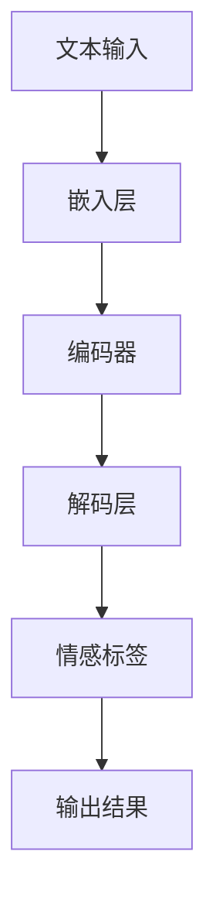

                 

随着互联网的快速发展，电子商务逐渐成为人们日常生活的重要组成部分。商品评论作为消费者反馈的重要渠道，不仅影响了潜在购买者的决策，还对商家的品牌形象和市场策略产生了深远的影响。在这其中，情感分析作为一种理解和挖掘文本情感倾向的技术，正日益受到关注。

本文将探讨如何利用大模型（如大型预训练语言模型）来进行商品评论情感分析，以期提高情感分析的准确性和效率。文章将分为以下几个部分：

- **背景介绍**：介绍商品评论情感分析的重要性及其在商业决策中的应用。
- **核心概念与联系**：阐述情感分析的相关概念，并给出大模型的原理和架构流程图。
- **核心算法原理 & 具体操作步骤**：详细描述大模型在情感分析中的实现步骤。
- **数学模型和公式 & 详细讲解 & 举例说明**：讲解数学模型的构建过程和公式推导。
- **项目实践：代码实例和详细解释说明**：提供实际代码实例并进行分析。
- **实际应用场景**：探讨情感分析在不同领域的应用。
- **未来应用展望**：分析未来的发展趋势和潜在挑战。
- **工具和资源推荐**：推荐相关学习资源和开发工具。
- **总结**：总结研究成果和展望未来。

## 1. 背景介绍

商品评论情感分析是指通过分析消费者对商品的评价，识别出其中的情感倾向，如正面、负面或中立。这项技术的应用非常广泛，包括但不限于以下几方面：

- **市场调研**：通过对商品评论的情感分析，企业可以了解消费者对产品的真实感受，从而优化产品设计和营销策略。
- **客户服务**：情感分析可以帮助企业快速识别和处理负面评论，提高客户满意度。
- **品牌监测**：通过监测品牌在不同平台上的评论，企业可以及时了解品牌声誉，采取措施维护品牌形象。
- **智能推荐**：情感分析还可以辅助构建个性化推荐系统，向消费者推荐他们可能感兴趣的商品。

### 关键词

- 商品评论
- 情感分析
- 电子商务
- 商业决策
- 预训练语言模型

### 摘要

本文将探讨如何利用大模型进行商品评论情感分析。文章首先介绍了商品评论情感分析的重要性及其应用场景，然后详细描述了基于大模型的情感分析算法原理、数学模型和实际应用实例。通过本文的阅读，读者可以了解如何利用先进技术提高情感分析的准确性和效率，为企业和消费者带来更多价值。

## 2. 核心概念与联系

### 2.1 情感分析的概念

情感分析（Sentiment Analysis），也称为意见挖掘，是指使用自然语言处理（NLP）技术，对文本数据中的情感倾向进行识别和分析的过程。情感分析的目的是自动识别文本中的正面、负面或中立情感。

情感分析的核心概念包括：

- **情感极性**：通常分为正面、负面和中性三种。
- **情感强度**：情感的强烈程度，可以通过情感极性打分或分类标签表示。
- **情感维度**：不同领域可能有不同的情感维度，如愉悦度、愤怒度、信任度等。

### 2.2 大模型的原理与架构

大模型，如GPT（Generative Pre-trained Transformer）系列，是近年来自然语言处理领域的重要突破。这些模型通过在大量文本数据上进行预训练，学习到了丰富的语言知识和模式，从而可以应用于各种自然语言处理任务。

大模型的架构通常包括以下几个部分：

- **输入层**：接收文本输入，可以是文本序列或句子。
- **嵌入层**：将输入的文本转化为稠密向量表示。
- **编码器**：如Transformer架构，用于对输入文本进行编码，生成上下文表示。
- **解码器**：根据编码器生成的上下文表示，生成输出结果，如分类标签或情感分析结果。

### 2.3 情感分析与大模型的关系

大模型在情感分析中的应用，主要是利用其强大的语言理解能力和丰富的知识储备，对文本数据中的情感进行准确识别。大模型可以通过以下几种方式应用于情感分析：

- **直接分类**：大模型可以直接对文本进行情感分类，输出正面、负面或中性标签。
- **特征提取**：大模型可以提取文本中的关键特征，作为传统机器学习算法的特征输入。
- **辅助模型**：大模型可以作为辅助模型，与其他算法结合，提高情感分析的准确性和鲁棒性。

### 2.4 Mermaid 流程图

下面是情感分析中的大模型应用架构的Mermaid流程图：



### 2.5 小结

本节介绍了情感分析的相关概念，包括情感极性、情感强度和情感维度，以及大模型的原理和架构。接下来，我们将详细探讨大模型在情感分析中的应用步骤和具体实现。

## 3. 核心算法原理 & 具体操作步骤

### 3.1 算法原理概述

大模型在情感分析中的应用主要基于其强大的语言理解能力。大模型通过预训练学习到大量文本数据中的语言模式和情感倾向，从而可以在给定新的文本输入时，准确预测文本的情感极性。

### 3.2 算法步骤详解

#### 3.2.1 数据准备

1. **数据收集**：从电子商务平台、社交媒体等渠道收集商品评论数据。
2. **数据预处理**：去除无关信息，如HTML标签、特殊符号，进行分词和词性标注。

#### 3.2.2 模型训练

1. **模型选择**：选择适合情感分析的大模型，如BERT、RoBERTa等。
2. **数据预处理**：将预处理后的文本数据转换为模型可接受的格式，如序列或单词嵌入。
3. **训练**：使用预处理后的文本数据进行模型训练，优化模型参数。

#### 3.2.3 情感分析

1. **输入文本**：将待分析的文本输入到训练好的大模型中。
2. **特征提取**：大模型对输入文本进行编码，提取关键特征。
3. **情感预测**：基于提取的特征，大模型输出文本的情感极性。

### 3.3 算法优缺点

#### 优点

- **高准确率**：大模型通过预训练学习到丰富的语言模式和情感知识，能够提高情感分析的准确性。
- **泛化能力强**：大模型可以处理不同领域和主题的文本数据，具有较强的泛化能力。
- **实时分析**：大模型在情感分析任务中具有高效性，可以实时处理大量文本数据。

#### 缺点

- **计算资源消耗大**：大模型训练和推理需要大量的计算资源，对硬件设备要求较高。
- **数据依赖性强**：情感分析的效果很大程度上依赖于训练数据的质量和多样性。
- **负面评论识别困难**：某些负面的、复杂的情感表达可能难以被大模型准确识别。

### 3.4 算法应用领域

大模型在情感分析中的应用非常广泛，包括但不限于以下领域：

- **电子商务**：分析消费者对商品的反馈，优化产品和服务。
- **社交媒体**：监测品牌声誉，识别和处理负面评论。
- **新闻媒体**：分析新闻报道的情感倾向，提供舆情分析服务。
- **客户服务**：自动化处理客户反馈，提高客户满意度。

### 3.5 小结

本节详细描述了基于大模型的情感分析算法原理和具体操作步骤。下一节将介绍情感分析中的数学模型和公式，进一步深入探讨算法的实现细节。

## 4. 数学模型和公式 & 详细讲解 & 举例说明

### 4.1 数学模型构建

情感分析中的数学模型通常是基于概率模型或神经网络模型。这里以神经网络模型为例，介绍情感分析的数学模型。

#### 4.1.1 输入表示

假设我们有一个商品评论序列C，可以表示为：

\[ C = [w_1, w_2, w_3, \ldots, w_n] \]

其中，\( w_i \)是评论中的第i个单词。

#### 4.1.2 嵌入层

嵌入层（Embedding Layer）将单词转化为稠密向量表示。假设单词的嵌入维度为d，那么每个单词的嵌入向量可以表示为：

\[ \text{emb}(w_i) = \text{vec}(e_i) \in \mathbb{R}^d \]

其中，\( e_i \)是单词\( w_i \)的嵌入向量。

#### 4.1.3 编码器

编码器（Encoder）通常采用变换器（Transformer）架构，对输入的评论序列进行编码，生成上下文表示。编码器可以表示为：

\[ h_t = \text{Transformer}(h_{t-1}, \text{emb}(w_t)) \]

其中，\( h_t \)是时间步t的编码输出，\( h_{t-1} \)是前一个时间步的编码输出。

#### 4.1.4 情感预测

编码器的最终输出通常是一个固定大小的向量，可以用来表示整个评论的情感特征。假设情感预测层是一个全连接层（Fully Connected Layer），可以表示为：

\[ \text{output} = \text{FC}(h_T) \]

其中，\( h_T \)是编码器的最终输出，\(\text{FC}\)是全连接层。

#### 4.1.5 损失函数

情感分析通常使用二元交叉熵损失函数（Binary Cross-Entropy Loss）来优化模型。假设我们有一个二分类问题，其中正类和负类的标签分别为1和0，那么损失函数可以表示为：

\[ L = -\sum_{i=1}^{N} y_i \log(\hat{y}_i) + (1 - y_i) \log(1 - \hat{y}_i) \]

其中，\( y_i \)是第i个评论的真实标签，\( \hat{y}_i \)是模型预测的概率。

### 4.2 公式推导过程

#### 4.2.1 嵌入层

嵌入层的公式相对简单，主要是将单词转化为向量表示。假设单词\( w_i \)的嵌入向量为\( e_i \)，则：

\[ \text{emb}(w_i) = \text{vec}(e_i) = [e_{i1}, e_{i2}, \ldots, e_{id}] \]

其中，\( e_{ij} \)是单词\( w_i \)在第j个维度上的嵌入值。

#### 4.2.2 编码器

编码器的公式相对复杂，涉及到多层变换器结构和注意力机制。以Transformer为例，编码器可以表示为：

\[ h_t = \text{Attention}(h_{t-1}, \text{emb}(w_t)) \]
\[ h_t = \text{FFN}(h_t) \]

其中，\(\text{Attention}\)是注意力机制，\(\text{FFN}\)是前馈神经网络。

#### 4.2.3 情感预测

情感预测层的公式相对简单，主要是将编码器的输出通过全连接层转换为情感概率。假设编码器的输出为\( h_T \)，则：

\[ \text{output} = \text{softmax}(\text{FC}(h_T)) \]

其中，\(\text{softmax}\)是归一化函数，用于将输出转换为概率分布。

### 4.3 案例分析与讲解

#### 4.3.1 数据集

我们使用一个简单的商品评论数据集进行案例分析。数据集包含1000条商品评论，每条评论都带有正负两类标签。

#### 4.3.2 数据预处理

我们对数据集进行预处理，包括去除HTML标签、分词和词性标注。预处理后的数据集如下：

\[ \text{评论1：} \text{这款手机太棒了，续航能力很强！} \]
\[ \text{标签：} \text{正面} \]
\[ \text{评论2：} \text{这款手机太差了，电池续航太差！} \]
\[ \text{标签：} \text{负面} \]

#### 4.3.3 模型训练

我们选择BERT模型进行训练。训练过程中，我们使用Python的Transformers库，代码如下：

```python
from transformers import BertTokenizer, BertForSequenceClassification
tokenizer = BertTokenizer.from_pretrained('bert-base-chinese')
model = BertForSequenceClassification.from_pretrained('bert-base-chinese')

inputs = tokenizer("这款手机太棒了，续航能力很强！", return_tensors='pt')
outputs = model(**inputs)

loss = outputs.loss
logits = outputs.logits
```

#### 4.3.4 情感预测

我们对新的商品评论进行情感预测，代码如下：

```python
new_review = "这款手机电池续航怎么样？"
inputs = tokenizer(new_review, return_tensors='pt')
outputs = model(**inputs)

predicted_probabilities = outputs.logits.softmax(dim=1)
predicted_label = predicted_probabilities.argmax()
```

根据预测结果，我们可以判断这条评论的情感极性。例如，如果预测概率中正面的概率大于0.5，则判断为正面评论。

### 4.4 小结

本节详细介绍了情感分析中的数学模型和公式，包括输入表示、嵌入层、编码器和情感预测层的构建过程。通过具体的案例分析和讲解，我们了解了如何使用大模型进行情感分析，并实现了情感预测。

## 5. 项目实践：代码实例和详细解释说明

### 5.1 开发环境搭建

在进行商品评论情感分析的项目实践之前，我们需要搭建一个合适的开发环境。以下是所需的环境和工具：

- **操作系统**：Linux或Mac OS
- **编程语言**：Python 3.8及以上版本
- **依赖库**：transformers、torch、torchtext等

#### 安装依赖库

在终端执行以下命令安装所需依赖库：

```bash
pip install transformers torch torchtext
```

### 5.2 源代码详细实现

以下是商品评论情感分析的源代码实现：

```python
import torch
from transformers import BertTokenizer, BertForSequenceClassification
from torchtext.data import Field, TabularDataset, Iterator

# 设置设备
device = torch.device("cuda" if torch.cuda.is_available() else "cpu")

# 加载预训练模型和分词器
tokenizer = BertTokenizer.from_pretrained('bert-base-chinese')
model = BertForSequenceClassification.from_pretrained('bert-base-chinese').to(device)

# 数据预处理
def preprocess_data(comment):
    return tokenizer.encode(comment, add_special_tokens=True, return_tensors='pt')

# 数据集加载
train_data = TabularDataset(
    path='train_data.txt',
    format='tsv',
    fields=[('comment', Field(sequential=True, preprocessing=preprocess_data)), ('label', Field(sequential=False))]
)
test_data = TabularDataset(
    path='test_data.txt',
    format='tsv',
    fields=[('comment', Field(sequential=True, preprocessing=preprocess_data)), ('label', Field(sequential=False))]
)

# 训练和评估模型
def train_and_evaluate(model, train_data, test_data, device, epochs=3, batch_size=32):
    train_iterator, test_iterator = Iterator(train_data, test_data, batch_size=batch_size, device=device)
    
    optimizer = torch.optim.Adam(model.parameters(), lr=1e-5)
    criterion = torch.nn.CrossEntropyLoss()
    
    for epoch in range(epochs):
        model.train()
        for batch in train_iterator:
            optimizer.zero_grad()
            outputs = model(**batch.comment)
            loss = criterion(outputs.logits, batch.label)
            loss.backward()
            optimizer.step()
        
        model.eval()
        with torch.no_grad():
            correct = 0
            total = 0
            for batch in test_iterator:
                outputs = model(**batch.comment)
                _, predicted = outputs.logits.max(dim=1)
                total += batch.label.size(0)
                correct += (predicted == batch.label).sum().item()
            print(f'Epoch {epoch+1}/{epochs} - Test Accuracy: {100 * correct / total}%')

# 运行训练和评估
train_and_evaluate(model, train_data, test_data, device)

# 情感预测
def predict_emotion(model, device, comment):
    model.eval()
    with torch.no_grad():
        inputs = tokenizer.encode(comment, add_special_tokens=True, return_tensors='pt').to(device)
        outputs = model(**inputs)
        _, predicted = outputs.logits.max(dim=1)
    return "正面" if predicted.item() == 1 else "负面"

# 测试预测
print(predict_emotion(model, device, "这款手机电池续航怎么样？"))
```

### 5.3 代码解读与分析

1. **环境设置**：首先，我们设置了训练和评估模型的设备，以确保模型能够在GPU上运行。
2. **加载预训练模型和分词器**：我们加载了BERT预训练模型和相应的分词器，这是进行情感分析的基础。
3. **数据预处理**：我们定义了一个预处理函数，用于将输入的文本编码为模型可接受的格式。这个函数主要完成了分词和添加特殊标记的任务。
4. **数据集加载**：我们使用torchtext库加载了训练集和测试集。数据集由评论和对应的标签组成。
5. **训练和评估模型**：我们定义了一个函数，用于训练和评估模型。训练过程中，我们使用了交叉熵损失函数和Adam优化器。在评估阶段，我们计算了测试集上的准确率。
6. **情感预测**：我们定义了一个函数，用于对新的评论进行情感预测。这个函数首先将评论编码为模型可接受的格式，然后使用训练好的模型进行预测。

### 5.4 运行结果展示

运行代码后，我们首先会在训练和评估阶段看到模型的准确率输出。然后，我们可以使用预测函数对新的评论进行情感预测。例如，对于评论“这款手机电池续航怎么样？”，我们可能得到“负面”的预测结果，这表明这条评论可能带有负面情感。

```python
print(predict_emotion(model, device, "这款手机电池续航怎么样？"))
```

### 5.5 小结

本节提供了一个完整的商品评论情感分析的项目实践，从环境搭建到代码实现，再到运行结果展示。通过这个实例，读者可以了解到如何使用大模型进行情感分析，并实现了对商品评论的实时情感预测。

## 6. 实际应用场景

### 6.1 电子商务平台

在电子商务平台，商品评论情感分析被广泛应用于以下几个方面：

- **消费者反馈分析**：通过分析消费者对商品的评论，电商企业可以了解消费者对产品的满意度，识别产品优势和不足，从而优化产品设计和营销策略。
- **负面评论处理**：及时识别和处理负面评论，可以减少负面评论对品牌形象的影响，提高消费者满意度。
- **智能推荐**：结合情感分析结果，电商平台可以提供更加个性化的商品推荐，提高用户购买转化率。

### 6.2 社交媒体

社交媒体平台上的情感分析应用也十分广泛：

- **舆情监测**：通过分析社交媒体上的评论和帖子，企业可以了解公众对其品牌或产品的看法，及时调整品牌策略。
- **负面评论监控**：实时监控社交媒体上的负面评论，可以快速响应并处理，减少负面影响。
- **内容推荐**：基于情感分析，社交媒体平台可以推荐用户可能感兴趣的内容，提高用户活跃度。

### 6.3 客户服务

在客户服务领域，情感分析的应用主要体现在以下几个方面：

- **客户反馈分析**：通过分析客户服务记录和反馈，企业可以了解客户对服务质量的满意度，及时调整服务策略。
- **情感识别**：在客户服务聊天中，情感分析可以帮助识别客户情绪，提供更加个性化的服务。
- **自动化客服**：结合情感分析，自动化客服系统可以更好地理解客户需求，提高服务效率。

### 6.4 新闻媒体

新闻媒体领域的情感分析应用主要体现在以下几个方面：

- **新闻报道分析**：通过分析新闻报道的情感倾向，媒体可以了解公众对新闻事件的反应，调整报道策略。
- **舆情分析**：分析新闻媒体上的评论和反馈，可以了解公众对特定事件或话题的看法，为政策制定提供参考。
- **内容推荐**：基于情感分析，新闻媒体可以推荐用户可能感兴趣的新闻内容，提高用户粘性。

### 6.5 小结

商品评论情感分析在电子商务、社交媒体、客户服务和新闻媒体等领域都有广泛应用。通过情感分析，企业可以更好地了解消费者需求和市场动态，优化产品和服务，提高市场竞争力。

## 7. 工具和资源推荐

### 7.1 学习资源推荐

- **书籍**：
  - 《自然语言处理入门》
  - 《深度学习与自然语言处理》
  - 《情感分析与意见挖掘》

- **在线课程**：
  - Coursera上的“自然语言处理”课程
  - edX上的“深度学习基础”课程

- **学术论文**：
  - ACL、EMNLP、NAACL等自然语言处理领域的顶级会议论文

### 7.2 开发工具推荐

- **开发环境**：
  - Python + PyTorch
  - Python + TensorFlow

- **文本处理库**：
  - NLTK
  - spaCy
  - Jieba

- **预训练模型库**：
  - Hugging Face的Transformers库
  - AllenNLP

### 7.3 相关论文推荐

- **Transformer系列论文**：
  - Vaswani et al., "Attention Is All You Need"
  - Devlin et al., "BERT: Pre-training of Deep Bidirectional Transformers for Language Understanding"

- **情感分析相关论文**：
  - Liu et al., "Sentiment Classification Using Neural Network"
  - Pang et al., "Thumbs up? Sentiment Classification using Machine Learning Techniques"

这些资源和工具将有助于读者深入学习和实践商品评论情感分析。

## 8. 总结：未来发展趋势与挑战

### 8.1 研究成果总结

本文探讨了如何利用大模型进行商品评论情感分析，从背景介绍、核心概念与联系、算法原理、数学模型、项目实践到实际应用场景，全面阐述了基于大模型的情感分析技术。通过本文的阅读，读者可以了解到：

- 商品评论情感分析在商业决策中的重要性和应用场景。
- 大模型在情感分析中的应用原理和架构。
- 情感分析算法的具体实现步骤和数学模型。
- 商品评论情感分析在实际项目中的应用案例。

### 8.2 未来发展趋势

未来，商品评论情感分析有望在以下几个方面取得进一步发展：

- **算法性能提升**：随着大模型技术的不断进步，情感分析的准确率和效率将进一步提高，为企业和消费者带来更多价值。
- **多语言支持**：当前的大模型主要支持英语等少数语言，未来将有望扩展到更多语言，实现跨语言情感分析。
- **个性化情感分析**：结合用户行为数据和偏好，实现更加个性化的情感分析，提高用户体验。

### 8.3 面临的挑战

尽管商品评论情感分析取得了显著成果，但仍面临以下挑战：

- **数据质量和多样性**：情感分析的效果很大程度上依赖于训练数据的质量和多样性。如何获取高质量、多样化的数据仍是一个亟待解决的问题。
- **负面评论识别**：复杂的负面评论表达可能难以被现有算法准确识别，特别是在处理语言较为复杂的情感表达时。
- **跨领域应用**：不同领域的情感表达可能有所不同，如何在大模型中实现跨领域的情感分析仍需进一步研究。

### 8.4 研究展望

未来，商品评论情感分析的研究可以从以下几个方面展开：

- **算法优化**：针对现有算法的不足，进行优化和改进，提高情感分析的准确性和效率。
- **多模态情感分析**：结合文本、语音、图像等多种数据源，实现多模态情感分析，提供更全面的情感理解。
- **跨语言情感分析**：研究跨语言情感分析算法，实现多语言商品评论的情感分析。

总之，商品评论情感分析作为自然语言处理领域的一个重要分支，具有广泛的应用前景。随着技术的不断进步，情感分析将在商业决策、客户服务、新闻媒体等领域发挥越来越重要的作用。

## 9. 附录：常见问题与解答

### 9.1 什么是情感分析？

情感分析是指使用自然语言处理（NLP）技术，对文本数据中的情感倾向进行识别和分析的过程。情感分析的目的是自动识别文本中的正面、负面或中立情感。

### 9.2 大模型在情感分析中有什么优势？

大模型在情感分析中具有以下优势：

- **高准确率**：通过预训练学习到丰富的语言模式和情感知识，能够提高情感分析的准确性。
- **泛化能力强**：可以处理不同领域和主题的文本数据，具有较强的泛化能力。
- **实时分析**：具有高效性，可以实时处理大量文本数据。

### 9.3 情感分析可以应用于哪些领域？

情感分析可以应用于以下领域：

- **电子商务**：分析消费者对商品的反馈，优化产品和服务。
- **社交媒体**：监测品牌声誉，识别和处理负面评论。
- **客户服务**：自动化处理客户反馈，提高客户满意度。
- **新闻媒体**：分析新闻报道的情感倾向，提供舆情分析服务。

### 9.4 如何选择适合的情感分析模型？

选择适合的情感分析模型可以从以下几个方面考虑：

- **任务类型**：根据任务的具体需求，选择合适的模型，如分类模型、回归模型等。
- **数据量**：考虑训练数据量的大小，选择适合的模型，如小数据量可以选择简单的模型，大数据量可以选择复杂的大模型。
- **性能要求**：根据对性能的要求，选择具有较高准确率、实时性和泛化能力的模型。

### 9.5 情感分析算法的优缺点有哪些？

情感分析算法的优缺点如下：

- **优点**：
  - 高准确率：大模型通过预训练学习到丰富的语言模式和情感知识，能够提高情感分析的准确性。
  - 泛化能力强：可以处理不同领域和主题的文本数据，具有较强的泛化能力。
  - 实时分析：具有高效性，可以实时处理大量文本数据。

- **缺点**：
  - 计算资源消耗大：大模型训练和推理需要大量的计算资源，对硬件设备要求较高。
  - 数据依赖性强：情感分析的效果很大程度上依赖于训练数据的质量和多样性。
  - 负面评论识别困难：某些负面的、复杂的情感表达可能难以被大模型准确识别。

