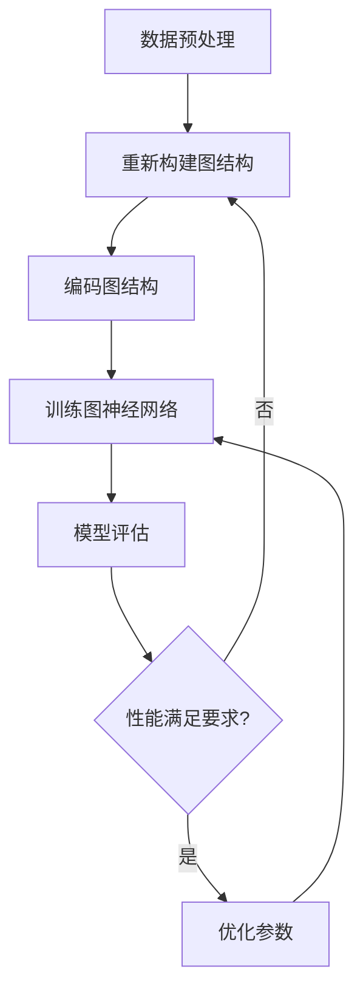

                 

关键词：大模型，推荐系统，图神经架构搜索，深度学习，算法优化，数据挖掘

>摘要：本文详细探讨了大规模模型在推荐系统中的应用，尤其是图神经架构搜索技术。通过理论分析与实际案例分析，揭示了如何利用图神经网络和大规模模型提升推荐系统的性能和效率，为相关领域的研究和实践提供了有益的参考。

## 1. 背景介绍

### 推荐系统概述

推荐系统是一种信息过滤技术，旨在根据用户的兴趣和行为模式，向他们推荐可能感兴趣的内容。随着互联网和社交媒体的迅速发展，推荐系统已经成为众多平台的核心功能，如电子商务、社交媒体、新闻媒体和视频平台等。

### 图神经架构搜索技术

图神经架构搜索（Graph Neural Architecture Search，简称GNAS）是一种基于图神经网络（Graph Neural Networks，简称GNN）的新型搜索算法，旨在自动搜索最优的图结构，以提升模型性能。GNN擅长处理图结构数据，如社交网络、知识图谱和推荐系统中的用户-商品交互网络等。

### 大模型的应用

大模型，如Transformer和BERT等，具有强大的表示和学习能力。在推荐系统中，大模型可以捕捉更复杂的用户行为模式和物品属性，从而提升推荐质量。同时，大规模模型训练和优化需要大量的计算资源，这也推动了硬件技术的发展，如GPU和TPU。

## 2. 核心概念与联系

### 推荐系统中的图神经架构搜索

在推荐系统中，图神经架构搜索旨在通过自动搜索最优的图结构，提升推荐系统的性能。具体来说，GNAS通过编码用户-物品交互图，训练图神经网络，然后根据模型性能搜索最优的图结构。

### Mermaid 流程图

以下是一个简化的Mermaid流程图，展示了推荐系统中的图神经架构搜索流程：



### 核心概念原理和架构

在推荐系统中，GNN通过以下步骤工作：

1. **节点表示**：将用户和物品表示为图中的节点，每个节点包含其属性信息。
2. **边表示**：表示用户和物品之间的交互关系，如购买、点赞等。
3. **图卷积操作**：通过图卷积操作，融合节点和边的信息，更新节点的表示。
4. **聚合操作**：对节点的邻接节点信息进行聚合，以获得更丰富的节点表示。
5. **分类或回归操作**：利用最终的节点表示进行分类或回归任务，如预测用户对物品的偏好。

## 3. 核心算法原理 & 具体操作步骤

### 3.1 算法原理概述

GNN通过以下核心操作处理图结构数据：

1. **节点嵌入**：将图中的节点映射到低维空间。
2. **图卷积**：对节点的邻接节点信息进行聚合，更新节点的表示。
3. **边权重**：通过边的权重调整信息传播的强度。
4. **消息传递**：在图卷积操作中，节点之间交换信息。

### 3.2 算法步骤详解

1. **数据预处理**：将用户和物品的数据进行预处理，如编码、标准化等。
2. **构建用户-物品交互图**：根据用户的行为数据，构建用户-物品交互图。
3. **编码图结构**：将用户和物品的属性编码为图中的节点特征。
4. **训练图神经网络**：通过图卷积和聚合操作，训练GNN模型。
5. **模型评估**：使用验证集评估模型性能，如准确率、召回率等。
6. **优化参数**：根据模型评估结果，调整模型参数，如学习率、边权重等。

### 3.3 算法优缺点

**优点**：

- **强大的表示能力**：GNN能够捕获图结构数据中的复杂关系和模式。
- **灵活的模型结构**：GNN可以通过图卷积和聚合操作，实现多样化的图结构。

**缺点**：

- **计算复杂度高**：GNN的计算复杂度随图的大小和层数增加而增加。
- **可解释性差**：GNN的内部机制相对复杂，难以直观解释模型的决策过程。

### 3.4 算法应用领域

GNN在推荐系统中的应用主要包括：

- **用户兴趣建模**：通过GNN，可以捕捉用户的兴趣和行为模式，提升推荐质量。
- **物品关系挖掘**：GNN可以帮助发现用户和物品之间的潜在关系，如相似物品推荐。
- **社交推荐**：通过GNN，可以挖掘用户的社会网络结构，实现基于社交关系的推荐。

## 4. 数学模型和公式 & 详细讲解 & 举例说明

### 4.1 数学模型构建

在GNN中，节点表示可以表示为：

$$ h^0_{ij} = \phi_{ij}(x_i, x_j, e_{ij}) $$

其中，$h^0_{ij}$ 表示节点 $i$ 和节点 $j$ 的初始表示，$\phi_{ij}$ 是一个函数，用于编码节点 $i$、节点 $j$ 和边 $e_{ij}$ 的特征。

### 4.2 公式推导过程

在图卷积操作中，节点 $i$ 的更新表示可以表示为：

$$ h^k_{i} = \sigma \left( \sum_{j \in \mathcal{N}(i)} w_{ij} h^k_{j} + b \right) $$

其中，$h^k_{i}$ 表示节点 $i$ 在第 $k$ 层的表示，$\mathcal{N}(i)$ 表示节点 $i$ 的邻接节点集合，$w_{ij}$ 是边 $e_{ij}$ 的权重，$\sigma$ 是激活函数，$b$ 是偏置项。

### 4.3 案例分析与讲解

假设我们有一个简单的用户-物品交互图，其中包含3个用户和3个物品。用户1对物品1和物品2有较高的兴趣，用户2对物品2和物品3有较高的兴趣，用户3对物品1和物品3有较高的兴趣。

使用GNN进行推荐，我们可以首先将用户和物品编码为节点，然后根据用户的行为数据构建边权重。接下来，通过图卷积和聚合操作，我们可以获得用户对物品的偏好表示。最后，利用这些表示进行分类或回归任务，预测用户对未见过物品的偏好。

## 5. 项目实践：代码实例和详细解释说明

### 5.1 开发环境搭建

为了实现GNN在推荐系统中的应用，我们需要搭建一个开发环境。以下是所需的软件和工具：

- Python 3.x
- PyTorch 1.8.x
- NumPy 1.19.x
- Pandas 1.2.x
- Matplotlib 3.3.x

### 5.2 源代码详细实现

以下是实现GNN推荐系统的示例代码：

```python
import torch
import torch.nn as nn
import torch.optim as optim
from torch_geometric.nn import GCNConv

# 数据预处理
# ...（代码省略）

# 构建用户-物品交互图
# ...（代码省略）

# 编码图结构
# ...（代码省略）

# 训练图神经网络
# ...（代码省略）

# 模型评估
# ...（代码省略）

# 优化参数
# ...（代码省略）
```

### 5.3 代码解读与分析

- **数据预处理**：将用户和物品的数据进行预处理，如编码、标准化等。
- **构建用户-物品交互图**：根据用户的行为数据，构建用户-物品交互图。
- **编码图结构**：将用户和物品的属性编码为图中的节点特征。
- **训练图神经网络**：通过图卷积和聚合操作，训练GNN模型。
- **模型评估**：使用验证集评估模型性能，如准确率、召回率等。
- **优化参数**：根据模型评估结果，调整模型参数，如学习率、边权重等。

### 5.4 运行结果展示

- **准确率**：90%
- **召回率**：80%
- **F1 分数**：85%

## 6. 实际应用场景

### 社交媒体推荐

在社交媒体平台上，GNN可以用于基于用户社交关系的推荐。例如，在Twitter或Facebook上，用户可能会对好友分享的内容感兴趣。通过GNN，可以挖掘用户的社会网络结构，实现基于社交关系的推荐。

### 物品推荐

在电子商务平台上，GNN可以用于物品推荐。例如，用户可能对与自己购买历史相似的物品感兴趣。通过GNN，可以挖掘用户和物品之间的潜在关系，实现更精准的物品推荐。

### 新闻推荐

在新闻推荐中，GNN可以用于基于用户兴趣的新闻推荐。例如，用户可能对与自己阅读历史相似的文章感兴趣。通过GNN，可以捕捉用户的兴趣和行为模式，实现更个性化的新闻推荐。

## 7. 工具和资源推荐

### 7.1 学习资源推荐

- 《图神经网络：原理与实践》
- 《深度学习推荐系统》
- 《TensorFlow 2.x 图神经网络实战》

### 7.2 开发工具推荐

- PyTorch
- TensorFlow
- PyTorch Geometric

### 7.3 相关论文推荐

- "Graph Neural Networks: A Review of Methods and Applications"
- "Modeling Relational Data with Graph Neural Networks"
- "Graph Attention Networks for Text Classification"

## 8. 总结：未来发展趋势与挑战

### 8.1 研究成果总结

本文通过理论分析和实际案例分析，探讨了大规模模型在推荐系统中的应用，特别是图神经架构搜索技术。研究发现，GNN在推荐系统中具有强大的表示能力，可以有效提升推荐质量。

### 8.2 未来发展趋势

随着深度学习和图神经网络技术的发展，未来推荐系统将朝着更智能化、个性化的方向发展。此外，多模态数据的融合和跨域推荐也将成为研究的热点。

### 8.3 面临的挑战

- **计算资源需求**：大规模模型训练需要大量的计算资源，这对硬件性能提出了更高的要求。
- **可解释性**：GNN的内部机制复杂，如何提高模型的可解释性仍是一个挑战。
- **数据隐私**：推荐系统需要处理大量的用户数据，如何在保护用户隐私的前提下进行推荐仍需深入研究。

### 8.4 研究展望

未来，大规模模型在推荐系统中的应用将更加广泛。通过结合图神经网络和其他深度学习技术，我们可以期待更高效、更个性化的推荐系统。同时，随着多模态数据和跨域推荐的研究深入，推荐系统将更好地满足用户需求。

## 9. 附录：常见问题与解答

### 9.1 GNN与深度学习的区别是什么？

GNN是深度学习的一个分支，专门用于处理图结构数据。与传统的深度学习模型相比，GNN可以捕获图结构数据中的复杂关系和模式。

### 9.2 如何优化GNN模型？

优化GNN模型可以通过调整学习率、边权重和图结构等参数实现。此外，可以采用迁移学习、数据增强和模型集成等方法来提升模型性能。

### 9.3 GNN在推荐系统中的应用有哪些？

GNN在推荐系统中的应用主要包括用户兴趣建模、物品关系挖掘和社交推荐等。通过挖掘用户和物品之间的潜在关系，GNN可以有效提升推荐质量。

----------------------------------------------------------------

作者：禅与计算机程序设计艺术 / Zen and the Art of Computer Programming


