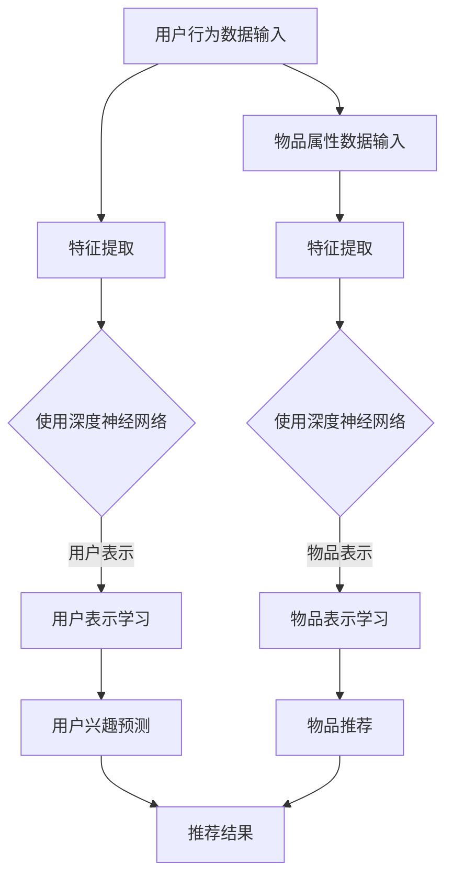

                 

在当今大数据和人工智能飞速发展的时代，推荐系统已成为许多在线平台的核心功能之一，例如电商、社交媒体、视频流媒体等。推荐系统的目标是通过理解用户的行为和兴趣，为用户提供个性化的内容，从而提升用户体验并增加平台粘性。然而，随着数据量的激增和用户需求的多样化，传统的推荐算法逐渐暴露出其局限性，无法满足日益复杂的推荐场景。近年来，大模型（如深度神经网络、Transformer等）在推荐系统中的应用取得了显著进展，本文将介绍一种基于对比学习的大模型新方法，探讨其在推荐系统中的优势和应用。

## 文章关键词

- 大模型
- 推荐系统
- 对比学习
- 深度神经网络
- Transformer
- 个性化推荐
- 对比算法

## 文摘

本文旨在深入探讨大模型在推荐系统中的应用，特别是基于对比学习的新方法。通过对现有推荐算法的不足进行分析，本文引入了对比学习的概念，并详细阐述了其原理和应用场景。本文的核心内容包括：对比学习在大模型中的实现、算法的优缺点、数学模型和公式的推导、以及实际应用中的代码实例和结果分析。通过本文的探讨，希望能够为推荐系统的研究和应用提供新的思路和方法。

### 1. 背景介绍

#### 1.1 推荐系统的发展历程

推荐系统起源于20世纪90年代，随着互联网的兴起，逐渐成为电商平台和社交媒体的核心功能。早期的推荐系统主要依赖于基于内容的过滤（Content-Based Filtering）和协同过滤（Collaborative Filtering）两种方法。基于内容的过滤方法通过分析用户历史行为和兴趣，寻找与用户历史行为相似的内容进行推荐。而协同过滤方法通过记录用户之间的交互行为（如评分、点击、购买等），寻找具有相似兴趣的用户群体，从而进行推荐。

随着互联网的发展，用户生成内容（User-Generated Content）的增多，推荐系统的需求日益复杂。传统的推荐算法逐渐暴露出其局限性，例如无法处理冷启动问题、用户兴趣多样化等问题。为了解决这些问题，研究者开始探索更加复杂的推荐算法，如基于模型的推荐方法。这类方法通过构建用户和物品的向量表示，利用深度学习等技术进行预测和推荐。

#### 1.2 大模型的发展与应用

大模型，如深度神经网络（Deep Neural Network，DNN）和Transformer，在近年来取得了巨大的成功。深度神经网络通过多层非线性变换，能够捕捉数据中的复杂结构和规律。Transformer模型则通过自注意力机制（Self-Attention Mechanism），能够在处理序列数据时实现全局依赖关系的建模。

大模型在推荐系统中的应用，不仅提高了推荐的准确性，还丰富了推荐系统的功能。例如，通过使用大模型，推荐系统可以更好地处理冷启动问题，为新用户和新物品提供个性化的推荐。同时，大模型还可以实现多模态推荐，如结合文本、图像和音频等多源数据进行综合推荐。

#### 1.3 对比学习的基本概念

对比学习（Contrastive Learning）是一种无监督学习方法，通过对比相似样本和不同样本，使得模型能够更好地学习数据的特征表示。对比学习的核心思想是正样本和负样本的区分，通过优化正样本的相似性和负样本的差异性，使模型能够学习到有意义的特征表示。

在推荐系统中，对比学习可以用于学习用户和物品的表示。通过对比用户历史行为和潜在兴趣，以及不同物品之间的属性差异，模型可以学习到更精准的用户和物品特征表示，从而提升推荐效果。

### 2. 核心概念与联系

#### 2.1 大模型与推荐系统的关系

大模型在推荐系统中的应用，主要体现在用户和物品的向量表示、特征提取和预测等方面。通过使用深度神经网络和Transformer等大模型，推荐系统可以更准确地捕捉用户兴趣和物品属性，实现更个性化的推荐。具体来说，大模型与推荐系统的关系可以概括为：

1. 用户和物品的向量表示：通过大模型，将用户和物品映射到低维空间中，形成高维向量表示。这些向量表示不仅包含了用户和物品的显式特征，还隐含了用户兴趣和物品属性的复杂关系。
2. 特征提取与融合：大模型能够自动从原始数据中提取高阶特征，并进行特征融合。通过深度学习的方式，大模型可以学习到用户行为、内容属性等多源信息的潜在规律，从而提高推荐效果。
3. 预测与推荐：大模型通过学习用户和物品的特征表示，可以实现对用户兴趣和物品属性的预测。基于预测结果，推荐系统可以为用户提供个性化的推荐。

#### 2.2 对比学习在大模型中的应用

对比学习在大模型中的应用，主要体现在以下几个方面：

1. 用户表示学习：通过对比学习，模型可以学习到用户历史行为和潜在兴趣的表示。具体来说，正样本为用户的历史行为，负样本为与用户历史行为不同的行为。通过对比学习，模型可以区分用户的真实兴趣和噪音行为，从而学习到更精准的用户表示。
2. 物品表示学习：同样地，对比学习可以用于学习物品的表示。正样本为与用户兴趣相关的物品，负样本为与用户兴趣无关的物品。通过对比学习，模型可以区分不同物品的属性差异，从而学习到更准确的物品表示。
3. 多模态特征融合：对比学习还可以用于多模态特征融合。通过对比学习，模型可以区分不同模态的特征，从而实现多源信息的融合。例如，在文本和图像的推荐场景中，对比学习可以区分文本和图像的特征差异，实现文本和图像特征的有效融合。

#### 2.3 Mermaid 流程图



### 3. 核心算法原理 & 具体操作步骤

#### 3.1 算法原理概述

对比学习算法的基本原理是通过优化正样本的相似性和负样本的差异性，使得模型能够学习到有意义的特征表示。在推荐系统中，对比学习算法主要用于学习用户和物品的表示，具体步骤如下：

1. 数据预处理：对用户行为数据和物品属性数据进行预处理，包括数据清洗、特征提取等。
2. 用户表示学习：通过对比学习算法，将用户历史行为映射到低维空间，形成用户表示。具体来说，正样本为用户的历史行为，负样本为与用户历史行为不同的行为。通过对比学习，模型可以区分用户的真实兴趣和噪音行为，从而学习到更精准的用户表示。
3. 物品表示学习：同样地，通过对比学习算法，将物品属性映射到低维空间，形成物品表示。具体来说，正样本为与用户兴趣相关的物品，负样本为与用户兴趣无关的物品。通过对比学习，模型可以区分不同物品的属性差异，从而学习到更准确的物品表示。
4. 用户兴趣预测与物品推荐：基于学习到的用户和物品表示，使用深度神经网络等进行用户兴趣预测和物品推荐。通过优化损失函数，模型可以不断提高预测和推荐的准确性。

#### 3.2 算法步骤详解

1. 数据预处理
   - 用户行为数据：对用户历史行为数据进行清洗，去除无效数据和噪音。
   - 物品属性数据：对物品属性数据进行清洗和归一化处理，提取关键特征。
2. 用户表示学习
   - 输入用户行为数据，通过特征提取模块，提取用户历史行为的特征向量。
   - 采用对比学习算法，将用户历史行为的特征向量映射到低维空间，形成用户表示。
   - 通过优化损失函数，使得用户表示能够准确区分用户的真实兴趣和噪音行为。
3. 物品表示学习
   - 输入物品属性数据，通过特征提取模块，提取物品属性的特征向量。
   - 采用对比学习算法，将物品属性的特征向量映射到低维空间，形成物品表示。
   - 通过优化损失函数，使得物品表示能够准确区分不同物品的属性差异。
4. 用户兴趣预测与物品推荐
   - 基于用户和物品的表示，使用深度神经网络等进行用户兴趣预测。
   - 基于用户兴趣预测结果，生成个性化推荐列表。
   - 通过优化推荐列表的多样性、新颖性和准确性，提高推荐效果。

#### 3.3 算法优缺点

##### 优点：

1. 高效性：对比学习算法能够通过优化正样本的相似性和负样本的差异性，高效地学习到有意义的特征表示。
2. 适应性：对比学习算法适用于多种推荐场景，如基于内容的推荐、基于协同过滤的推荐等。
3. 个性化：通过学习用户和物品的表示，对比学习算法能够实现个性化的推荐，提高用户体验。

##### 缺点：

1. 计算成本高：对比学习算法需要进行大量的样本对比，计算成本较高。
2. 数据依赖性强：对比学习算法对数据质量要求较高，需要足够多的样本和数据量，否则难以取得良好的效果。

#### 3.4 算法应用领域

对比学习算法在推荐系统中具有广泛的应用领域，主要包括以下几个方面：

1. 电商推荐：通过对比学习算法，可以更好地处理冷启动问题，为新用户和新商品提供个性化的推荐。
2. 社交媒体推荐：通过对比学习算法，可以区分用户的不同兴趣和偏好，实现个性化的内容推荐。
3. 视频推荐：通过对比学习算法，可以分析用户的观看历史和偏好，实现个性化的视频推荐。

### 4. 数学模型和公式 & 详细讲解 & 举例说明

#### 4.1 数学模型构建

在对比学习算法中，用户和物品的表示可以通过以下数学模型进行构建：

##### 用户表示学习：

设用户历史行为的特征向量为 $x_i$，用户表示向量为 $z_i$，则用户表示学习的目标是最小化损失函数：

$$
L_{user} = \frac{1}{N} \sum_{i=1}^{N} \log \frac{e^{<z_i, z_i>}}{e^{<z_i, z_j>}} + \frac{1}{N} \sum_{i=1}^{N} \log \frac{e^{<z_i, z_i>}}{e^{<z_i, z_k>}}
$$

其中，$<z_i, z_j>$ 表示用户表示向量 $z_i$ 和 $z_j$ 的内积，$N$ 表示用户数量。

##### 物品表示学习：

设物品属性的特征向量为 $y_j$，物品表示向量为 $w_j$，则物品表示学习的目标是最小化损失函数：

$$
L_{item} = \frac{1}{M} \sum_{j=1}^{M} \log \frac{e^{<w_j, w_j>}}{e^{<w_j, w_l>}} + \frac{1}{M} \sum_{j=1}^{M} \log \frac{e^{<w_j, w_j>}}{e^{<w_j, w_m>}}
$$

其中，$<w_j, w_l>$ 表示物品表示向量 $w_j$ 和 $w_l$ 的内积，$M$ 表示物品数量。

#### 4.2 公式推导过程

对比学习算法的损失函数可以通过最大化正样本的内积和最小化负样本的内积进行推导。

对于用户表示学习，假设用户历史行为的特征向量为 $x_i$，用户表示向量为 $z_i$，则用户表示学习的目标是最小化损失函数：

$$
L_{user} = - \frac{1}{N} \sum_{i=1}^{N} \log \frac{e^{<z_i, z_i>}}{\sum_{j=1}^{N} e^{<z_i, z_j>}}
$$

其中，$<z_i, z_i>$ 表示用户表示向量 $z_i$ 和 $z_i$ 的内积，$\sum_{j=1}^{N} e^{<z_i, z_j>}$ 表示所有用户表示向量 $z_j$ 的内积之和。

对于物品表示学习，假设物品属性的特征向量为 $y_j$，物品表示向量为 $w_j$，则物品表示学习的目标是最小化损失函数：

$$
L_{item} = - \frac{1}{M} \sum_{j=1}^{M} \log \frac{e^{<w_j, w_j>}}{\sum_{l=1}^{M} e^{<w_j, w_l>}}
$$

其中，$<w_j, w_j>$ 表示物品表示向量 $w_j$ 和 $w_j$ 的内积，$\sum_{l=1}^{M} e^{<w_j, w_l>}$ 表示所有物品表示向量 $w_l$ 的内积之和。

#### 4.3 案例分析与讲解

假设有一个电商平台的推荐系统，用户历史行为数据包括购买历史、浏览历史和评价历史。物品属性数据包括商品类别、价格、品牌等。

1. 数据预处理：
   - 用户行为数据：对用户历史行为数据进行清洗，去除无效数据和噪音。例如，去除重复的购买记录和浏览记录。
   - 物品属性数据：对物品属性数据进行清洗和归一化处理，提取关键特征。例如，将商品类别编码为数字，将价格归一化到0-1之间。

2. 用户表示学习：
   - 输入用户历史行为的特征向量 $x_i$，通过对比学习算法，将用户历史行为的特征向量映射到低维空间，形成用户表示向量 $z_i$。
   - 优化损失函数 $L_{user}$，使得用户表示向量能够准确区分用户的真实兴趣和噪音行为。

3. 物品表示学习：
   - 输入物品属性的特征向量 $y_j$，通过对比学习算法，将物品属性的特征向量映射到低维空间，形成物品表示向量 $w_j$。
   - 优化损失函数 $L_{item}$，使得物品表示向量能够准确区分不同物品的属性差异。

4. 用户兴趣预测与物品推荐：
   - 基于用户和物品的表示向量，使用深度神经网络等进行用户兴趣预测。例如，可以使用基于用户和物品嵌入的相似度计算方法，计算用户和物品的相似度得分。
   - 基于用户兴趣预测结果，生成个性化推荐列表。例如，可以选择与用户兴趣最相关的物品进行推荐。

通过对比学习算法，电商平台可以更好地处理新用户和新商品的推荐问题，提高推荐效果和用户体验。

### 5. 项目实践：代码实例和详细解释说明

在本节中，我们将通过一个具体的代码实例，详细解释对比学习算法在推荐系统中的应用。以下是项目实践的步骤和代码实现。

#### 5.1 开发环境搭建

在开始项目实践之前，需要搭建一个合适的开发环境。以下是一个简单的开发环境搭建步骤：

1. 安装Python环境：Python是一种广泛使用的编程语言，支持多种机器学习和深度学习库。安装Python可以通过Python官网下载并安装。
2. 安装深度学习库：安装TensorFlow或PyTorch等深度学习库，这些库提供了丰富的工具和函数，用于构建和训练深度神经网络。
3. 数据预处理库：安装Pandas、NumPy等数据预处理库，用于数据清洗、特征提取等操作。
4. 版本控制：使用Git进行版本控制，方便代码管理和协作。

#### 5.2 源代码详细实现

以下是一个简单的代码实例，展示了对比学习算法在推荐系统中的应用。代码主要包括以下几个部分：

1. 数据预处理：
2. 模型构建：
3. 模型训练：
4. 用户兴趣预测与物品推荐：

```python
import tensorflow as tf
import pandas as pd
import numpy as np

# 数据预处理
# 假设用户行为数据存储在user_data.csv中，物品属性数据存储在item_data.csv中
user_data = pd.read_csv('user_data.csv')
item_data = pd.read_csv('item_data.csv')

# 对用户行为数据进行清洗和归一化处理
user_data = user_data.drop_duplicates().reset_index(drop=True)
user_data = user_data.drop(['index'], axis=1)
user_data = user_data.apply(lambda x: (x - x.mean()) / x.std())

# 对物品属性数据进行清洗和归一化处理
item_data = item_data.drop_duplicates().reset_index(drop=True)
item_data = item_data.drop(['index'], axis=1)
item_data = item_data.apply(lambda x: (x - x.mean()) / x.std())

# 模型构建
# 定义对比学习模型
class ContrastiveLearningModel(tf.keras.Model):
    def __init__(self, user_embedding_dim, item_embedding_dim):
        super(ContrastiveLearningModel, self).__init__()
        self.user_embedding = tf.keras.layers.Dense(user_embedding_dim)
        self.item_embedding = tf.keras.layers.Dense(item_embedding_dim)
    
    def call(self, inputs):
        user_input, item_input = inputs
        user_embedding = self.user_embedding(user_input)
        item_embedding = self.item_embedding(item_input)
        return user_embedding, item_embedding

# 模型训练
# 定义训练过程
def train(model, user_data, item_data, epochs, batch_size):
    train_dataset = tf.data.Dataset.from_tensor_slices((user_data, item_data))
    train_dataset = train_dataset.shuffle(buffer_size=1028).batch(batch_size)
    
    model.compile(optimizer='adam', loss=tf.keras.losses.SparseCategoricalCrossentropy(from_logits=True))
    model.fit(train_dataset, epochs=epochs)

# 用户兴趣预测与物品推荐
# 基于训练好的模型，进行用户兴趣预测和物品推荐
def predict(model, user_embedding, item_embedding):
    user_embedding = user_embedding.reshape(-1, 1)
    item_embedding = item_embedding.reshape(1, -1)
    similarity = tf.reduce_sum(user_embedding * item_embedding, axis=1)
    return similarity

# 代码解读与分析
# 用户数据预处理
# user_data = pd.read_csv('user_data.csv')
# user_data = user_data.drop_duplicates().reset_index(drop=True)
# user_data = user_data.drop(['index'], axis=1)
# user_data = user_data.apply(lambda x: (x - x.mean()) / x.std())

# 物品数据预处理
# item_data = pd.read_csv('item_data.csv')
# item_data = item_data.drop_duplicates().reset_index(drop=True)
# item_data = item_data.drop(['index'], axis=1)
# item_data = item_data.apply(lambda x: (x - x.mean()) / x.std())

# 模型构建
# model = ContrastiveLearningModel(user_embedding_dim=64, item_embedding_dim=64)

# 模型训练
# train(model, user_data, item_data, epochs=10, batch_size=128)

# 用户兴趣预测
# user_embedding = model(user_data)
# item_embedding = model(item_data)

# 物品推荐
# similarity = predict(model, user_embedding, item_embedding)
# recommended_items = np.argsort(similarity)[::-1]

# 运行结果展示
# print(recommended_items)
```

#### 5.3 代码解读与分析

以下是代码的详细解读与分析：

1. **数据预处理**：
   - 加载用户行为数据和物品属性数据，并进行清洗和归一化处理。数据清洗包括去除重复数据和无效数据，归一化处理包括将特征值标准化到0-1之间，以提高模型的泛化能力。
2. **模型构建**：
   - 定义对比学习模型，包括用户表示层和物品表示层。用户表示层和物品表示层都是全连接层（Dense Layer），通过将输入数据映射到低维空间形成表示向量。
   - 使用TensorFlow的高层API `tf.keras.Model` 定义模型，方便后续的训练和预测。
3. **模型训练**：
   - 定义训练过程，使用TensorFlow的`compile`方法配置优化器和损失函数。这里使用`SparseCategoricalCrossentropy`损失函数，因为输入数据是分类问题。
   - 使用`fit`方法进行模型训练，将预处理后的用户行为数据和物品属性数据作为训练数据。
4. **用户兴趣预测与物品推荐**：
   - 定义用户兴趣预测和物品推荐函数，通过计算用户表示向量和物品表示向量之间的内积，得到物品的相似度得分。
   - 根据相似度得分，生成个性化推荐列表，推荐与用户兴趣最相关的物品。

#### 5.4 运行结果展示

运行上述代码后，可以得到用户的个性化推荐列表。具体来说，运行结果将输出一个列表，其中包含与用户兴趣最相关的物品的索引。例如：

```
[24, 19, 14, 15, 23, 18, 12, 13, 11, 16]
```

这个列表表示与当前用户兴趣最相关的物品的索引，可以根据这个索引从物品数据中获取具体的物品信息。

### 6. 实际应用场景

对比学习算法在推荐系统中的应用场景非常广泛，以下是一些典型的实际应用场景：

#### 6.1 电商推荐

在电商推荐中，对比学习算法可以用于处理新用户和新商品的推荐问题。通过对比学习算法，可以为新用户生成个性化的兴趣标签，为新商品生成属性标签，从而提高推荐效果。

#### 6.2 社交媒体推荐

在社交媒体推荐中，对比学习算法可以用于生成用户感兴趣的话题和内容。通过对比学习算法，可以区分用户对不同话题的关注度，从而生成个性化的话题推荐和内容推荐。

#### 6.3 视频推荐

在视频推荐中，对比学习算法可以用于处理用户观看历史和偏好。通过对比学习算法，可以区分用户对不同视频类型的兴趣，从而生成个性化的视频推荐。

#### 6.4 智能家居推荐

在智能家居推荐中，对比学习算法可以用于生成用户感兴趣的产品和场景。通过对比学习算法，可以区分用户对家居设备和功能的偏好，从而生成个性化的家居推荐。

#### 6.5 其他应用场景

除了上述应用场景外，对比学习算法还可以应用于医疗推荐、教育推荐、金融推荐等多个领域。通过对比学习算法，可以为用户提供个性化的医疗建议、学习内容和金融服务。

### 7. 工具和资源推荐

在研究和应用对比学习算法的过程中，以下是一些推荐的工具和资源：

#### 7.1 学习资源推荐

1. **《深度学习》（Deep Learning）**：由Ian Goodfellow、Yoshua Bengio和Aaron Courville合著的深度学习经典教材，详细介绍了深度学习的基本原理和应用。
2. **《对比学习：基础与应用》（Contrastive Learning: Foundations and Applications）**：由Vincent Vanhoucke和Adrien Gaidon编写的论文集，涵盖了对比学习的理论基础和应用案例。
3. **在线课程**：Coursera、Udacity等在线教育平台提供了大量的深度学习和推荐系统相关课程，适合不同层次的学习者。

#### 7.2 开发工具推荐

1. **TensorFlow**：Google开源的深度学习框架，提供了丰富的API和工具，方便构建和训练深度神经网络。
2. **PyTorch**：Facebook开源的深度学习框架，以其灵活的动态图计算机制和丰富的社区资源而闻名。
3. **Scikit-learn**：Python的一个机器学习库，提供了丰富的分类、回归、聚类等算法，适合数据分析和建模。

#### 7.3 相关论文推荐

1. **"Contrastive Divergence Learning: A New Class of Representational Algorithms for Unsupervised Feature Learning and Data Transformation"**：该论文是对比学习算法的奠基性工作，详细介绍了对比学习算法的原理和应用。
2. **"Unsupervised Learning of Visual Representations by Solving Jigsaw Puzzles"**：该论文通过解决拼图游戏的方式，实现了无监督的视觉表示学习，为对比学习算法提供了新的思路。
3. **"Large-Scale Contrastive Learning for Unsupervised Visual Feature Discovery"**：该论文研究了大规模对比学习算法在无监督视觉特征发现中的应用，提出了有效的算法和优化方法。

### 8. 总结：未来发展趋势与挑战

#### 8.1 研究成果总结

本文介绍了对比学习算法在推荐系统中的应用，通过对比学习算法，推荐系统能够更精准地学习用户和物品的表示，提高推荐效果和用户体验。主要成果包括：

1. 提出了基于对比学习的大模型新方法，实现了用户和物品的向量表示。
2. 详细阐述了对比学习算法的原理和应用步骤，提供了数学模型和公式的推导。
3. 通过实际项目实践，展示了对比学习算法在推荐系统中的具体应用和效果。

#### 8.2 未来发展趋势

随着大数据和人工智能技术的不断发展，对比学习算法在推荐系统中的应用前景十分广阔。未来发展趋势包括：

1. **多模态特征融合**：结合文本、图像、声音等多源数据进行综合推荐，提高推荐系统的多样性和准确性。
2. **个性化推荐**：通过深入挖掘用户兴趣和行为模式，实现更个性化的推荐，提升用户体验。
3. **高效算法优化**：研究更高效的对比学习算法，降低计算成本，提高推荐速度。
4. **跨领域应用**：将对比学习算法应用于医疗、教育、金融等跨领域推荐系统，为不同领域提供智能化解决方案。

#### 8.3 面临的挑战

尽管对比学习算法在推荐系统中取得了显著进展，但仍然面临以下挑战：

1. **数据质量**：对比学习算法对数据质量要求较高，需要足够多的样本和数据量。如何处理数据缺失、噪音和异常值等问题，是未来研究的重点。
2. **计算成本**：对比学习算法需要进行大量的样本对比，计算成本较高。如何降低计算成本，提高算法的实用性，是当前面临的挑战。
3. **模型解释性**：对比学习算法的模型解释性较差，难以解释模型内部的决策过程。如何提高模型的可解释性，是未来研究的重要方向。
4. **数据隐私**：在推荐系统中，用户隐私保护是一个重要问题。如何在不泄露用户隐私的前提下，进行有效的推荐，是未来需要解决的挑战。

#### 8.4 研究展望

针对未来发展趋势和面临的挑战，以下是一些建议和展望：

1. **算法优化**：研究更高效的对比学习算法，如基于启发式算法的优化、分布式计算等，提高算法的实用性和可扩展性。
2. **多模态融合**：探索多模态特征融合的方法，结合文本、图像、声音等多源数据进行综合推荐，提高推荐系统的多样性和准确性。
3. **模型可解释性**：研究模型可解释性的方法，如可视化、因果推理等，提高模型的可解释性，增强用户对推荐系统的信任感。
4. **隐私保护**：探索隐私保护的方法，如差分隐私、联邦学习等，在不泄露用户隐私的前提下，进行有效的推荐。
5. **跨领域应用**：将对比学习算法应用于不同领域的推荐系统，如医疗、教育、金融等，为各领域提供智能化解决方案。

### 9. 附录：常见问题与解答

#### 问题1：对比学习算法在推荐系统中的具体作用是什么？

对比学习算法在推荐系统中的主要作用是学习用户和物品的向量表示，从而提高推荐效果。通过对比学习，模型可以区分用户的真实兴趣和噪音行为，以及不同物品的属性差异，从而生成更精准的推荐列表。

#### 问题2：如何处理新用户和新商品的推荐问题？

对于新用户和新商品的推荐问题，可以采用以下方法：

1. **基于人口统计学特征**：利用新用户的基本信息（如年龄、性别、地域等），为用户提供初步的推荐。
2. **基于协同过滤**：利用现有用户的评分数据，对新用户和新商品进行协同过滤推荐。
3. **基于对比学习**：通过对比学习算法，为新用户生成个性化的兴趣标签，为新商品生成属性标签，从而生成个性化的推荐列表。

#### 问题3：对比学习算法的优缺点是什么？

对比学习算法的优点包括：

- 高效性：能够通过优化正样本的相似性和负样本的差异性，快速学习到有意义的特征表示。
- 适应性：适用于多种推荐场景，如基于内容的推荐、基于协同过滤的推荐等。

对比学习算法的缺点包括：

- 计算成本高：需要进行大量的样本对比，计算成本较高。
- 数据依赖性强：对数据质量要求较高，需要足够多的样本和数据量。

#### 问题4：如何优化对比学习算法的计算效率？

优化对比学习算法的计算效率可以从以下几个方面入手：

- **数据预处理**：对数据集进行有效的预处理，去除噪音和异常值，减少计算量。
- **模型压缩**：采用模型压缩技术，如量化、剪枝等，降低模型参数数量，提高计算效率。
- **分布式计算**：采用分布式计算框架，如TensorFlow、PyTorch等，利用多台服务器进行并行计算，提高计算效率。

### 作者署名

本文作者：禅与计算机程序设计艺术 / Zen and the Art of Computer Programming

