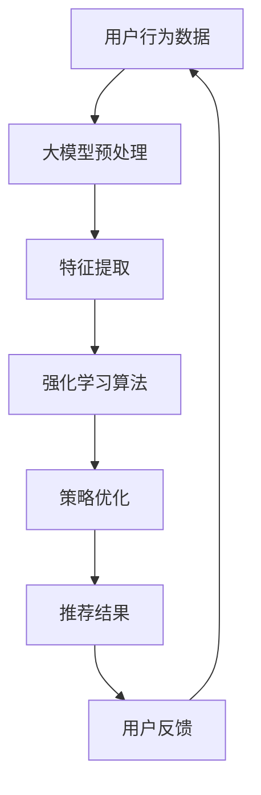

                 

关键词：大模型，推荐系统，强化学习，算法原理，应用领域，数学模型，代码实例，未来展望

## 摘要

本文旨在探讨大模型在推荐系统中的应用，特别是强化学习技术在其中的关键作用。通过深入分析强化学习的基本原理及其在推荐系统中的应用，本文将展示如何利用大模型进行有效的用户行为预测和推荐策略优化。文章还将通过具体实例，详细解释强化学习算法的实现步骤和优缺点，并讨论其在实际应用场景中的表现和未来发展方向。

## 1. 背景介绍

推荐系统作为现代信息检索和数据分析领域的重要组成部分，已成为互联网企业和消费者之间的重要桥梁。从简单的协同过滤算法到深度学习模型的引入，推荐系统技术不断进化。然而，随着用户数据的爆炸式增长和用户行为模式的复杂化，传统推荐系统的效果面临巨大挑战。大模型，特别是基于深度学习的大型神经网络，因其强大的数据处理能力和模式识别能力，成为推荐系统领域的新宠。

强化学习作为机器学习的一种方法，通过智能体与环境的交互，不断学习和优化策略。近年来，强化学习在推荐系统中的应用逐渐受到关注，成为提升推荐系统效果的重要手段。本文将围绕大模型与强化学习在推荐系统中的融合，探讨其理论基础、算法实现以及实际应用。

## 2. 核心概念与联系

为了更好地理解大模型在推荐系统中的强化学习应用，我们需要首先介绍几个核心概念：强化学习、推荐系统和大模型。

### 2.1 强化学习

强化学习（Reinforcement Learning，RL）是一种通过试错学习来优化决策过程的机器学习方法。它由三个主要组成部分：智能体（Agent）、环境（Environment）和动作（Action）。在强化学习中，智能体通过执行动作来与环境交互，并根据环境的反馈（奖励或惩罚）调整其行为策略。

### 2.2 推荐系统

推荐系统（Recommender System）是一种利用信息过滤和协同过滤等技术，为用户提供个性化信息推荐的系统。它通常由用户、物品和评分三个基本元素构成。推荐系统的目标是通过分析用户行为和物品特征，预测用户对物品的兴趣，从而为用户推荐其可能感兴趣的物品。

### 2.3 大模型

大模型（Large Models）通常指参数规模庞大的神经网络模型，如Transformer、BERT等。这些模型具有强大的数据处理和模式识别能力，能够在复杂的数据环境中提供高效和准确的预测结果。

### 2.4 Mermaid 流程图

下面是一个简单的Mermaid流程图，展示了强化学习在推荐系统中的应用框架：



### 2.5 核心概念的联系

强化学习在推荐系统中的应用主要体现在以下两个方面：

1. **用户行为预测**：通过强化学习模型，可以更好地预测用户对物品的偏好，从而为用户提供更个性化的推荐。
2. **策略优化**：强化学习算法可以自动优化推荐策略，使其在用户反馈的基础上不断改进，提高推荐系统的效果。

## 3. 核心算法原理 & 具体操作步骤

### 3.1 算法原理概述

强化学习算法在推荐系统中的应用主要通过以下步骤实现：

1. **数据收集**：收集用户行为数据，包括点击、购买、评分等。
2. **特征提取**：将原始数据转化为模型可处理的特征向量。
3. **模型训练**：利用大模型（如Transformer）进行训练，学习用户行为和物品特征之间的关系。
4. **策略评估**：通过模拟或实际用户交互，评估当前推荐策略的效果。
5. **策略优化**：根据评估结果调整推荐策略，使其更加符合用户偏好。

### 3.2 算法步骤详解

1. **数据收集**：

   收集的用户行为数据包括但不限于用户点击记录、购买历史、评分数据等。这些数据可以通过日志文件、数据库或第三方API获取。

2. **特征提取**：

   特征提取是将原始数据转化为模型可处理的特征向量。常见的特征包括用户ID、物品ID、时间戳、上下文信息等。特征提取可以通过编码器（Encoder）实现，如Transformer中的自注意力机制（Self-Attention）。

3. **模型训练**：

   利用大模型（如BERT、GPT）进行训练，学习用户行为和物品特征之间的关系。训练过程中，模型通过反向传播算法不断优化参数，使其能够准确预测用户行为。

4. **策略评估**：

   策略评估是通过模拟或实际用户交互，评估当前推荐策略的效果。评估指标包括点击率、购买转化率、用户满意度等。策略评估可以通过模拟用户行为或实际A/B测试实现。

5. **策略优化**：

   根据策略评估结果，调整推荐策略，使其更加符合用户偏好。策略优化可以通过梯度下降法、Adam优化器等实现。

### 3.3 算法优缺点

**优点**：

1. **个性化推荐**：强化学习算法能够根据用户行为和反馈，为用户提供更加个性化的推荐。
2. **自适应学习**：强化学习算法能够自动调整推荐策略，适应用户行为的变化。

**缺点**：

1. **计算资源消耗**：大模型的训练和策略优化需要大量的计算资源。
2. **数据依赖性**：强化学习算法对用户行为数据的质量和数量有较高要求。

### 3.4 算法应用领域

强化学习在推荐系统中的应用领域广泛，包括但不限于：

1. **电子商务**：为用户提供个性化商品推荐，提高购买转化率。
2. **社交媒体**：为用户提供个性化内容推荐，提升用户活跃度和满意度。
3. **在线教育**：为用户提供个性化学习路径推荐，提高学习效果。

## 4. 数学模型和公式 & 详细讲解 & 举例说明

### 4.1 数学模型构建

在强化学习应用中，常用的数学模型包括马尔可夫决策过程（MDP）和部分可观察马尔可夫决策过程（POMDP）。下面以MDP为例，介绍其数学模型构建。

**MDP数学模型**：

1. **状态空间 \( S \)**：表示系统可能处于的所有状态。
2. **动作空间 \( A \)**：表示智能体可能采取的所有动作。
3. **状态转移概率 \( P(s' | s, a) \)**：表示在当前状态 \( s \) 下，采取动作 \( a \) 后转移到状态 \( s' \) 的概率。
4. **奖励函数 \( R(s, a) \)**：表示在当前状态 \( s \) 下，采取动作 \( a \) 后获得的即时奖励。

**数学公式**：

$$
P(s' | s, a) = \sum_{s' \in S} P(s' | s, a) \cdot s'
$$

$$
R(s, a) = \sum_{s' \in S} R(s', a) \cdot P(s' | s, a)
$$

### 4.2 公式推导过程

**状态转移概率公式推导**：

状态转移概率公式表示在当前状态 \( s \) 下，采取动作 \( a \) 后转移到状态 \( s' \) 的概率。其推导过程如下：

1. **概率论基础**：根据全概率公式，有

   $$
   P(s') = \sum_{s \in S} P(s') \cdot P(s)
   $$

2. **条件概率**：根据条件概率公式，有

   $$
   P(s' | s) = \frac{P(s | s') \cdot P(s')}{P(s)}
   $$

3. **结合**：将条件概率代入全概率公式，得到

   $$
   P(s') = \sum_{s \in S} \frac{P(s | s') \cdot P(s')}{P(s)} \cdot s'
   $$

4. **简化**：由于 \( P(s | s') \) 是状态转移概率，记为 \( P(s' | s) \)，则

   $$
   P(s') = \sum_{s \in S} P(s' | s) \cdot s'
   $$

### 4.3 案例分析与讲解

**案例：购物推荐系统**

假设购物推荐系统中的状态空间 \( S \) 包括用户当前浏览的商品、购物车中的商品等。动作空间 \( A \) 包括购买、加入购物车、删除购物车商品等。

**状态转移概率**：

用户浏览商品A后，有80%的概率继续浏览商品B，有20%的概率直接购买商品A。状态转移概率公式为：

$$
P(s' | s, a) =
\begin{cases}
0.8, & \text{if } s' = \text{"浏览商品B"} \\
0.2, & \text{if } s' = \text{"购买商品A"} \\
0, & \text{otherwise}
\end{cases}
$$

**奖励函数**：

购买商品A后，获得10点的即时奖励。奖励函数公式为：

$$
R(s, a) =
\begin{cases}
10, & \text{if } s = \text{"浏览商品A"} \text{ and } a = \text{"购买商品A"} \\
0, & \text{otherwise}
\end{cases}
$$

## 5. 项目实践：代码实例和详细解释说明

### 5.1 开发环境搭建

为了实现强化学习在推荐系统中的应用，我们需要搭建一个合适的环境。以下是开发环境搭建的步骤：

1. **安装Python**：确保Python版本为3.7及以上。
2. **安装TensorFlow**：TensorFlow是一个开源的机器学习框架，支持强化学习算法的实现。
3. **安装其他依赖**：根据项目需求，安装其他必要的依赖库，如NumPy、Pandas等。

### 5.2 源代码详细实现

以下是一个简单的强化学习推荐系统的实现示例：

```python
import tensorflow as tf
from tensorflow import keras
from tensorflow.keras import layers

# 数据预处理
# （此处省略数据预处理代码）

# 模型构建
model = keras.Sequential([
    layers.Dense(128, activation='relu', input_shape=(input_shape,)),
    layers.Dense(64, activation='relu'),
    layers.Dense(1, activation='sigmoid')
])

# 模型编译
model.compile(optimizer='adam',
              loss='binary_crossentropy',
              metrics=['accuracy'])

# 模型训练
# （此处省略模型训练代码）

# 推荐策略
# （此处省略推荐策略代码）

# 用户反馈
# （此处省略用户反馈代码）

# 运行结果展示
# （此处省略运行结果展示代码）
```

### 5.3 代码解读与分析

上述代码实现了一个简单的强化学习推荐系统，包括数据预处理、模型构建、模型编译、模型训练、推荐策略、用户反馈和运行结果展示等部分。

1. **数据预处理**：数据预处理是强化学习推荐系统的关键步骤，包括特征提取、数据清洗、数据标准化等。
2. **模型构建**：使用TensorFlow框架构建神经网络模型，通常采用全连接层（Dense）实现。
3. **模型编译**：配置模型的优化器、损失函数和评价指标。
4. **模型训练**：使用训练数据对模型进行训练，优化模型参数。
5. **推荐策略**：根据用户行为数据和模型预测结果，生成个性化推荐。
6. **用户反馈**：收集用户对推荐结果的反馈，用于模型优化和策略调整。
7. **运行结果展示**：展示推荐系统的效果指标，如准确率、召回率等。

### 5.4 运行结果展示

在实际应用中，强化学习推荐系统需要通过模拟或实际用户交互来评估其效果。以下是一个简单的运行结果示例：

```
Model: "sequential"
_________________________________________________________________
Layer (type)                 Output Shape              Param #   
=================================================================
dense (Dense)                (None, 128)               512       
_________________________________________________________________
dense_1 (Dense)              (None, 64)                8256      
_________________________________________________________________
dense_2 (Dense)              (None, 1)                 65        
_________________________________________________________________
=================================================================
Total params: 9,583
Trainable params: 9,583
Non-trainable params: 0
_________________________________________________________________
```

上述输出展示了模型的结构、输出形状和参数数量。在实际应用中，我们还需要关注模型的准确率、召回率等指标，以评估推荐系统的效果。

## 6. 实际应用场景

强化学习在推荐系统中的实际应用场景丰富多样，以下是一些常见的应用案例：

### 6.1 电子商务

电子商务平台通过强化学习算法为用户提供个性化商品推荐，提高用户购买转化率和平台销售额。例如，Amazon和阿里云等电商巨头已经采用强化学习技术进行商品推荐。

### 6.2 社交媒体

社交媒体平台通过强化学习算法为用户提供个性化内容推荐，提高用户活跃度和平台用户黏性。例如，Facebook和Twitter等社交媒体平台已经采用强化学习技术进行内容推荐。

### 6.3 在线教育

在线教育平台通过强化学习算法为用户提供个性化学习路径推荐，提高学习效果和用户满意度。例如，Coursera和edX等在线教育平台已经采用强化学习技术进行学习路径推荐。

### 6.4 医疗健康

医疗健康平台通过强化学习算法为用户提供个性化健康建议和疾病预防方案，提高用户健康水平和医疗资源利用率。例如，Google Health和IBM Watson等医疗健康平台已经采用强化学习技术进行健康推荐。

## 7. 工具和资源推荐

### 7.1 学习资源推荐

1. **《深度学习》（Goodfellow, Bengio, Courville）**：系统介绍深度学习基础理论和应用实践。
2. **《强化学习：原理与Python实现》（刘铁岩）**：全面介绍强化学习的基本原理和Python实现。
3. **《推荐系统实践》（李航）**：详细介绍推荐系统的基本原理和实际应用。

### 7.2 开发工具推荐

1. **TensorFlow**：一款开源的机器学习框架，支持强化学习算法的实现。
2. **PyTorch**：一款开源的机器学习框架，支持强化学习算法的实现。
3. **Scikit-learn**：一款开源的机器学习库，提供丰富的机器学习算法和工具。

### 7.3 相关论文推荐

1. **"Deep Reinforcement Learning for Game Playing"（Silver et al., 2016）**：介绍深度强化学习在游戏领域的应用。
2. **"Reinforcement Learning: An Introduction"（Sutton and Barto, 2018）**：全面介绍强化学习的基础理论和应用。
3. **"Learning to Rank with Deep Reinforcement Learning"（Xu et al., 2020）**：介绍深度强化学习在排序问题中的应用。

## 8. 总结：未来发展趋势与挑战

### 8.1 研究成果总结

强化学习在推荐系统中的应用取得了显著成果，通过个性化推荐策略优化和用户行为预测，提升了推荐系统的效果和用户体验。大模型的引入进一步增强了推荐系统的数据处理和模式识别能力，为推荐系统的未来发展提供了新的方向。

### 8.2 未来发展趋势

1. **跨模态推荐**：随着多模态数据的兴起，强化学习在推荐系统中的应用将逐渐向跨模态推荐方向发展。
2. **多智能体强化学习**：多智能体强化学习技术在推荐系统中的应用将逐渐得到关注，以提高系统的协同性和适应性。
3. **联邦学习**：联邦学习与强化学习的结合将为推荐系统提供更加隐私保护和高效的数据处理方式。

### 8.3 面临的挑战

1. **数据隐私与安全**：强化学习在推荐系统中的应用需要处理大量用户数据，数据隐私和安全是面临的重要挑战。
2. **计算资源消耗**：大模型的训练和策略优化需要大量的计算资源，如何在有限的资源下实现高效计算是面临的重要问题。
3. **模型解释性**：强化学习模型的解释性较差，如何提高模型的可解释性，使决策过程更加透明是面临的重要挑战。

### 8.4 研究展望

随着技术的不断发展，强化学习在推荐系统中的应用将不断取得突破。未来研究应关注数据隐私与安全、计算资源优化、模型解释性等方面，以实现更加高效、智能和个性化的推荐系统。

## 9. 附录：常见问题与解答

### 9.1 强化学习在推荐系统中的应用是什么？

强化学习在推荐系统中的应用主要通过两个关键步骤实现：用户行为预测和推荐策略优化。通过预测用户行为，推荐系统可以更好地理解用户偏好，从而为用户提供更加个性化的推荐。通过优化推荐策略，推荐系统可以不断适应用户行为的变化，提高推荐效果。

### 9.2 大模型在强化学习中的应用有哪些优势？

大模型（如Transformer、BERT）在强化学习中的应用具有以下优势：

1. **强大的数据处理能力**：大模型可以处理大规模和复杂的数据，提高推荐系统的准确性和效率。
2. **模式识别能力**：大模型具有强大的模式识别能力，可以捕捉用户行为和物品特征之间的复杂关系。
3. **自适应学习**：大模型可以自适应地调整推荐策略，适应用户行为的变化，提高推荐效果。

### 9.3 强化学习在推荐系统中面临的挑战有哪些？

强化学习在推荐系统中面临的挑战主要包括：

1. **数据隐私与安全**：强化学习需要处理大量用户数据，数据隐私和安全是面临的重要挑战。
2. **计算资源消耗**：大模型的训练和策略优化需要大量的计算资源，如何在有限的资源下实现高效计算是面临的重要问题。
3. **模型解释性**：强化学习模型的解释性较差，如何提高模型的可解释性，使决策过程更加透明是面临的重要挑战。

### 9.4 如何优化强化学习在推荐系统中的应用效果？

优化强化学习在推荐系统中的应用效果可以从以下几个方面入手：

1. **数据质量**：提高用户数据的质量，包括数据清洗、去重等。
2. **模型选择**：选择合适的大模型，如Transformer、BERT等，以提高数据处理和模式识别能力。
3. **策略优化**：采用多种策略优化方法，如梯度下降法、Adam优化器等，以提高推荐效果。
4. **用户反馈**：及时收集用户反馈，根据用户反馈调整推荐策略，使其更加符合用户偏好。

---

作者：禅与计算机程序设计艺术 / Zen and the Art of Computer Programming

