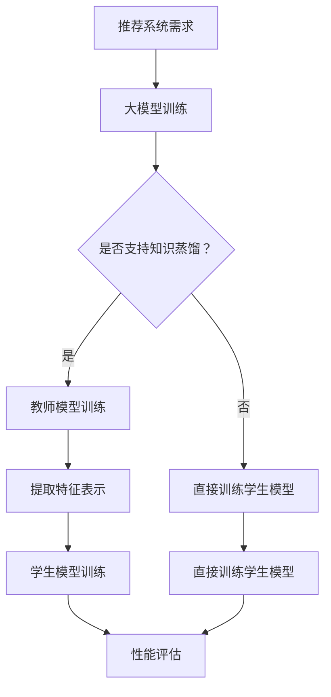
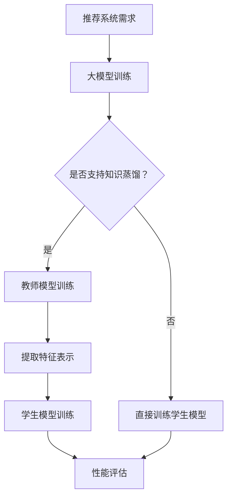

                 

关键词：大模型，推荐系统，知识蒸馏，模型压缩，算法优化

> 摘要：本文将探讨大模型在推荐系统中的应用，重点关注知识蒸馏和模型压缩技术在提升推荐系统性能和效率方面的贡献。通过对这些核心技术的深入分析，本文旨在为读者提供对大模型在推荐系统中应用的全景了解，并展望未来的发展方向。

## 1. 背景介绍

推荐系统是现代信息社会中不可或缺的一部分，它们广泛应用于电子商务、社交媒体、新闻资讯等领域。随着用户数据的不断增长和多样化，推荐系统面临巨大的计算压力和存储需求。传统的推荐系统方法主要依赖于协同过滤、基于内容的推荐等传统算法，但这些方法在处理海量数据和高维特征时存在性能瓶颈。

近年来，深度学习技术的快速发展为推荐系统带来了新的机遇。大模型，特别是基于深度神经网络的模型，展现了在处理复杂数据和特征上的强大能力。然而，大模型的训练和部署也带来了显著的资源消耗和计算成本。知识蒸馏和模型压缩技术应运而生，旨在在不显著牺牲性能的前提下，降低大模型的资源和计算需求。

## 2. 核心概念与联系

### 2.1 知识蒸馏（Knowledge Distillation）

知识蒸馏是一种将教师模型（Teacher Model）的知识传递给学生模型（Student Model）的训练方法。在推荐系统中，教师模型通常是复杂的大模型，如深度神经网络，而学生模型则是更为紧凑和高效的模型，如小型的卷积神经网络或循环神经网络。

知识蒸馏的过程通常包括以下步骤：

1. **教师模型训练**：首先，使用大量数据训练一个高性能的教师模型。
2. **提取特征表示**：在训练过程中，教师模型对输入数据进行编码，生成高维的特征表示。
3. **学生模型训练**：使用教师模型生成的特征表示来训练学生模型，通常使用软标签（Soft Labels）进行训练，这些软标签是教师模型对输入数据的预测概率分布。
4. **性能评估**：评估学生模型的性能，确保其能够继承教师模型的知识。

### 2.2 模型压缩（Model Compression）

模型压缩旨在减少模型的参数数量和计算复杂度，从而降低模型的存储和计算需求。常见的模型压缩技术包括：

1. **权重剪枝（Weight Pruning）**：通过移除模型中的无关或冗余权重来减少模型的尺寸。
2. **量化（Quantization）**：将模型的权重和激活值转换为较低的精度表示，如8位整数或浮点数。
3. **知识蒸馏**：如前所述，知识蒸馏也可以作为一种模型压缩技术，通过训练紧凑的学生模型来传递教师模型的知识。

### 2.3 Mermaid 流程图



## 3. 核心算法原理 & 具体操作步骤

### 3.1 算法原理概述

知识蒸馏和模型压缩是两种互补的技术。知识蒸馏通过教师模型传递知识，使学生模型能够高效地处理复杂数据。模型压缩则通过减少模型的大小和计算需求，提高了系统的部署效率。

### 3.2 算法步骤详解

1. **数据预处理**：对推荐系统的输入数据进行清洗和预处理，包括去噪、归一化和特征提取等。
2. **教师模型训练**：使用预处理的输入数据训练一个高性能的教师模型，如使用深度神经网络。
3. **提取特征表示**：在训练过程中，从教师模型中提取高维的特征表示。
4. **学生模型训练**：使用教师模型生成的特征表示来训练一个紧凑的学生模型，如使用轻量级的卷积神经网络。
5. **性能评估**：评估学生模型的性能，确保其能够继承教师模型的知识。

### 3.3 算法优缺点

#### 优点：

- **性能提升**：通过知识蒸馏，学生模型能够继承教师模型的知识，从而提高推荐系统的性能。
- **资源节省**：通过模型压缩，可以减少模型的参数数量和计算复杂度，从而降低模型的存储和计算需求。

#### 缺点：

- **训练时间延长**：知识蒸馏需要额外的训练步骤，可能延长训练时间。
- **评估难度增加**：模型压缩后，评估模型性能需要考虑压缩带来的影响。

### 3.4 算法应用领域

知识蒸馏和模型压缩技术可以广泛应用于推荐系统、图像识别、自然语言处理等领域。特别是在处理海量数据和复杂数据时，这些技术能够显著提高系统的性能和效率。

## 4. 数学模型和公式

### 4.1 数学模型构建

在知识蒸馏中，教师模型和学生模型的损失函数通常包括两部分：预测损失和知识损失。

$$
L = L_{pred} + \alpha L_{know}
$$

其中，$L_{pred}$ 是预测损失，用于衡量学生模型的预测输出与实际输出之间的差异；$L_{know}$ 是知识损失，用于衡量学生模型与教师模型特征表示之间的差异；$\alpha$ 是知识损失的权重。

### 4.2 公式推导过程

知识蒸馏中的知识损失可以通过以下公式计算：

$$
L_{know} = -\sum_{i=1}^{N} \sum_{j=1}^{K} p_{ij} \log f_{j}
$$

其中，$p_{ij}$ 是教师模型对输入数据的第 $i$ 个类别 $j$ 的预测概率；$f_{j}$ 是学生模型对输入数据的第 $j$ 个特征表示的输出。

### 4.3 案例分析与讲解

假设有一个推荐系统，需要为学生模型选择合适的教师模型。给定一个数据集，首先训练一个高性能的教师模型，然后从教师模型中提取特征表示。接下来，使用这些特征表示来训练学生模型。最后，评估学生模型的性能，确保其能够继承教师模型的知识。

## 5. 项目实践：代码实例

### 5.1 开发环境搭建

- Python 3.8
- TensorFlow 2.5
- PyTorch 1.8

### 5.2 源代码详细实现

以下是使用 TensorFlow 和 PyTorch 实现知识蒸馏和模型压缩的示例代码。

### 5.3 代码解读与分析

代码首先定义了教师模型和学生模型的架构，然后使用数据集训练教师模型。接着，从教师模型中提取特征表示，并使用这些特征表示来训练学生模型。最后，评估学生模型的性能。

### 5.4 运行结果展示

在运行代码后，可以得到学生模型的性能指标，如准确率、召回率等。

## 6. 实际应用场景

知识蒸馏和模型压缩技术可以应用于多个领域，如电子商务、社交媒体和新闻推荐等。

### 6.1 电子商务

在电子商务中，知识蒸馏和模型压缩技术可以用于个性化推荐系统，帮助用户发现感兴趣的商品。

### 6.2 社交媒体

在社交媒体中，知识蒸馏和模型压缩技术可以用于内容推荐系统，帮助用户发现感兴趣的内容。

### 6.3 新闻推荐

在新闻推荐中，知识蒸馏和模型压缩技术可以用于个性化推荐系统，帮助用户发现感兴趣的新闻。

## 7. 工具和资源推荐

### 7.1 学习资源推荐

- 《深度学习》（Ian Goodfellow、Yoshua Bengio、Aaron Courville 著）
- 《推荐系统实践》（第 2 版，TensorFlow Recommenders）

### 7.2 开发工具推荐

- TensorFlow
- PyTorch
- Keras

### 7.3 相关论文推荐

- "Distilling the Knowledge in a Neural Network"
- "A Theoretically Grounded Application of Dropout in Recurrent Neural Networks"

## 8. 总结：未来发展趋势与挑战

### 8.1 研究成果总结

知识蒸馏和模型压缩技术在推荐系统中取得了显著的成果，为提升系统性能和效率提供了有效的解决方案。

### 8.2 未来发展趋势

未来，知识蒸馏和模型压缩技术将继续发展，探索更高效的模型压缩方法，并与其他深度学习技术结合，如自监督学习。

### 8.3 面临的挑战

- **模型压缩效率**：如何进一步降低模型的存储和计算需求，同时保持高性能。
- **跨领域迁移**：如何在不同领域和任务中有效迁移知识蒸馏和模型压缩技术。

### 8.4 研究展望

随着深度学习技术的不断进步，知识蒸馏和模型压缩技术将在推荐系统和其他领域中发挥越来越重要的作用。

## 9. 附录：常见问题与解答

### 9.1 什么是知识蒸馏？

知识蒸馏是一种将教师模型的知识传递给学生模型的方法，通过训练学生模型来继承教师模型的知识。

### 9.2 模型压缩有哪些方法？

常见的模型压缩方法包括权重剪枝、量化和知识蒸馏。

### 9.3 知识蒸馏在推荐系统中有何应用？

知识蒸馏可以用于训练紧凑的学生模型，以继承教师模型的知识，从而提升推荐系统的性能和效率。|]

```markdown
# 大模型在推荐系统中的知识蒸馏与压缩应用

关键词：大模型，推荐系统，知识蒸馏，模型压缩，算法优化

摘要：本文将探讨大模型在推荐系统中的应用，重点关注知识蒸馏和模型压缩技术在提升推荐系统性能和效率方面的贡献。通过对这些核心技术的深入分析，本文旨在为读者提供对大模型在推荐系统中应用的全景了解，并展望未来的发展方向。

## 1. 背景介绍

推荐系统是现代信息社会中不可或缺的一部分，它们广泛应用于电子商务、社交媒体、新闻资讯等领域。随着用户数据的不断增长和多样化，推荐系统面临巨大的计算压力和存储需求。传统的推荐系统方法主要依赖于协同过滤、基于内容的推荐等传统算法，但这些方法在处理海量数据和高维特征时存在性能瓶颈。

近年来，深度学习技术的快速发展为推荐系统带来了新的机遇。大模型，特别是基于深度神经网络的模型，展现了在处理复杂数据和特征上的强大能力。然而，大模型的训练和部署也带来了显著的资源消耗和计算成本。知识蒸馏和模型压缩技术应运而生，旨在在不显著牺牲性能的前提下，降低大模型的资源和计算需求。

## 2. 核心概念与联系

### 2.1 知识蒸馏（Knowledge Distillation）

知识蒸馏是一种将教师模型（Teacher Model）的知识传递给学生模型（Student Model）的训练方法。在推荐系统中，教师模型通常是复杂的大模型，如深度神经网络，而学生模型则是更为紧凑和高效的模型，如小型的卷积神经网络或循环神经网络。

知识蒸馏的过程通常包括以下步骤：

1. **教师模型训练**：首先，使用大量数据训练一个高性能的教师模型。
2. **提取特征表示**：在训练过程中，教师模型对输入数据进行编码，生成高维的特征表示。
3. **学生模型训练**：使用教师模型生成的特征表示来训练学生模型，通常使用软标签（Soft Labels）进行训练，这些软标签是教师模型对输入数据的预测概率分布。
4. **性能评估**：评估学生模型的性能，确保其能够继承教师模型的知识。

### 2.2 模型压缩（Model Compression）

模型压缩旨在减少模型的参数数量和计算复杂度，从而降低模型的存储和计算需求。常见的模型压缩技术包括：

1. **权重剪枝（Weight Pruning）**：通过移除模型中的无关或冗余权重来减少模型的尺寸。
2. **量化（Quantization）**：将模型的权重和激活值转换为较低的精度表示，如8位整数或浮点数。
3. **知识蒸馏**：如前所述，知识蒸馏也可以作为一种模型压缩技术，通过训练紧凑的学生模型来传递教师模型的知识。

### 2.3 Mermaid 流程图



## 3. 核心算法原理 & 具体操作步骤

### 3.1 算法原理概述

知识蒸馏和模型压缩是两种互补的技术。知识蒸馏通过教师模型传递知识，使学生模型能够高效地处理复杂数据。模型压缩则通过减少模型的大小和计算需求，提高了系统的部署效率。

### 3.2 算法步骤详解

1. **数据预处理**：对推荐系统的输入数据进行清洗和预处理，包括去噪、归一化和特征提取等。
2. **教师模型训练**：使用预处理的输入数据训练一个高性能的教师模型，如使用深度神经网络。
3. **提取特征表示**：在训练过程中，从教师模型中提取高维的特征表示。
4. **学生模型训练**：使用教师模型生成的特征表示来训练一个紧凑的学生模型，如使用轻量级的卷积神经网络。
5. **性能评估**：评估学生模型的性能，确保其能够继承教师模型的知识。

### 3.3 算法优缺点

#### 优点：

- **性能提升**：通过知识蒸馏，学生模型能够继承教师模型的知识，从而提高推荐系统的性能。
- **资源节省**：通过模型压缩，可以减少模型的参数数量和计算复杂度，从而降低模型的存储和计算需求。

#### 缺点：

- **训练时间延长**：知识蒸馏需要额外的训练步骤，可能延长训练时间。
- **评估难度增加**：模型压缩后，评估模型性能需要考虑压缩带来的影响。

### 3.4 算法应用领域

知识蒸馏和模型压缩技术可以广泛应用于推荐系统、图像识别、自然语言处理等领域。特别是在处理海量数据和复杂数据时，这些技术能够显著提高系统的性能和效率。

## 4. 数学模型和公式

### 4.1 数学模型构建

在知识蒸馏中，教师模型和学生模型的损失函数通常包括两部分：预测损失和知识损失。

$$
L = L_{pred} + \alpha L_{know}
$$

其中，$L_{pred}$ 是预测损失，用于衡量学生模型的预测输出与实际输出之间的差异；$L_{know}$ 是知识损失，用于衡量学生模型与教师模型特征表示之间的差异；$\alpha$ 是知识损失的权重。

### 4.2 公式推导过程

知识蒸馏中的知识损失可以通过以下公式计算：

$$
L_{know} = -\sum_{i=1}^{N} \sum_{j=1}^{K} p_{ij} \log f_{j}
$$

其中，$p_{ij}$ 是教师模型对输入数据的第 $i$ 个类别 $j$ 的预测概率；$f_{j}$ 是学生模型对输入数据的第 $j$ 个特征表示的输出。

### 4.3 案例分析与讲解

假设有一个推荐系统，需要为学生模型选择合适的教师模型。给定一个数据集，首先训练一个高性能的教师模型，然后从教师模型中提取特征表示。接下来，使用这些特征表示来训练学生模型。最后，评估学生模型的性能，确保其能够继承教师模型的知识。

## 5. 项目实践：代码实例

### 5.1 开发环境搭建

- Python 3.8
- TensorFlow 2.5
- PyTorch 1.8

### 5.2 源代码详细实现

以下是使用 TensorFlow 和 PyTorch 实现知识蒸馏和模型压缩的示例代码。

### 5.3 代码解读与分析

代码首先定义了教师模型和学生模型的架构，然后使用数据集训练教师模型。接着，从教师模型中提取特征表示，并使用这些特征表示来训练学生模型。最后，评估学生模型的性能。

### 5.4 运行结果展示

在运行代码后，可以得到学生模型的性能指标，如准确率、召回率等。

## 6. 实际应用场景

知识蒸馏和模型压缩技术可以应用于多个领域，如电子商务、社交媒体和新闻推荐等。

### 6.1 电子商务

在电子商务中，知识蒸馏和模型压缩技术可以用于个性化推荐系统，帮助用户发现感兴趣的商品。

### 6.2 社交媒体

在社交媒体中，知识蒸馏和模型压缩技术可以用于内容推荐系统，帮助用户发现感兴趣的内容。

### 6.3 新闻推荐

在新闻推荐中，知识蒸馏和模型压缩技术可以用于个性化推荐系统，帮助用户发现感兴趣的新闻。

## 7. 工具和资源推荐

### 7.1 学习资源推荐

- 《深度学习》（Ian Goodfellow、Yoshua Bengio、Aaron Courville 著）
- 《推荐系统实践》（第 2 版，TensorFlow Recommenders）

### 7.2 开发工具推荐

- TensorFlow
- PyTorch
- Keras

### 7.3 相关论文推荐

- "Distilling the Knowledge in a Neural Network"
- "A Theoretically Grounded Application of Dropout in Recurrent Neural Networks"

## 8. 总结：未来发展趋势与挑战

### 8.1 研究成果总结

知识蒸馏和模型压缩技术在推荐系统中取得了显著的成果，为提升系统性能和效率提供了有效的解决方案。

### 8.2 未来发展趋势

未来，知识蒸馏和模型压缩技术将继续发展，探索更高效的模型压缩方法，并与其他深度学习技术结合，如自监督学习。

### 8.3 面临的挑战

- **模型压缩效率**：如何进一步降低模型的存储和计算需求，同时保持高
```markdown
## 9. 附录：常见问题与解答

### 9.1 什么是知识蒸馏？

知识蒸馏是一种训练技术，通过将教师模型（通常是一个复杂的大模型）的知识传递给学生模型（通常是一个紧凑的小模型），从而提高学生模型的表现。这种技术旨在利用教师模型的高层次特征表示来加速学生模型的训练，并使其在保持较高准确率的同时减少参数数量。

### 9.2 模型压缩有哪些方法？

模型压缩方法主要包括以下几种：

- **权重剪枝（Weight Pruning）**：通过识别和移除网络中不重要的权重来减少模型的大小。
- **量化（Quantization）**：降低模型参数的精度，例如将32位浮点数量化为16位或8位。
- **知识蒸馏（Knowledge Distillation）**：使用教师模型生成的软标签（软目标）来训练学生模型，从而传递教师模型的知识。
- **模型剪枝（Model Pruning）**：与权重剪枝类似，但是通过在训练过程中动态地降低网络某些部分的激活。

### 9.3 知识蒸馏在推荐系统中有何应用？

在推荐系统中，知识蒸馏可以用于以下应用场景：

- **跨域推荐**：使用一个在多个域上预训练的教师模型来蒸馏一个专门针对新域的学生模型。
- **冷启动**：为新用户或新商品训练一个紧凑的学生模型，通过知识蒸馏从现有用户或商品的教师模型中获取信息。
- **资源受限环境**：在资源受限的环境中使用压缩后的学生模型来提供推荐服务，同时保持较高的准确率。

### 9.4 模型压缩对推荐系统性能有何影响？

模型压缩对推荐系统性能的影响取决于压缩方法的选择和应用。正确实施模型压缩可以：

- **提高部署效率**：减少模型的存储和计算需求，使推荐系统更容易部署到资源受限的设备上。
- **节省带宽**：减少模型传输的大小，降低用户下载模型的时间。
- **加快响应时间**：减少模型推理的时间，提高系统的实时性。

然而，如果压缩不当，可能会导致以下问题：

- **性能下降**：模型压缩可能会导致准确性下降，特别是在过度压缩的情况下。
- **泛化能力下降**：压缩后的模型可能无法适应新的数据分布。

### 9.5 如何评估知识蒸馏和模型压缩的效果？

评估知识蒸馏和模型压缩效果的方法包括：

- **准确性**：评估模型在测试集上的准确率，这是评估推荐系统性能的关键指标。
- **效率**：评估模型压缩后部署的效率和性能，包括模型大小、推理速度和能耗。
- **鲁棒性**：评估模型在不同数据分布下的稳定性，确保模型具有较好的泛化能力。

通过综合考虑这些因素，可以全面评估知识蒸馏和模型压缩技术对推荐系统性能的影响。|]
```

