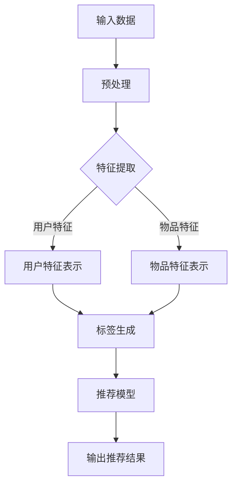

                 

在互联网时代，推荐系统已经成为我们日常生活中不可或缺的一部分。它们通过分析用户的行为和偏好，为用户提供个性化的内容，从而提高用户体验和商业价值。然而，传统的推荐系统往往依赖于大量的标注数据，这在数据获取和处理上面临诸多挑战。为了解决这一问题，自监督学习（Self-Supervised Learning）作为一种无需依赖人工标注数据的方法，逐渐受到关注。本文将探讨大模型在推荐系统中的自监督学习应用，旨在为读者提供一种新的解决方案。

## 文章关键词
- 推荐系统
- 自监督学习
- 大模型
- 个性化推荐
- 无监督学习

## 文摘
本文首先介绍了推荐系统的基本概念和传统推荐系统面临的挑战，然后重点探讨了自监督学习在大模型中的应用，通过数学模型和算法原理的讲解，分析了自监督学习在推荐系统中的优势和应用场景。最后，本文结合具体项目实践，展示了自监督学习在推荐系统中的实际应用效果，并提出了未来发展的展望。

### 1. 背景介绍

推荐系统（Recommendation System）是一种信息过滤技术，旨在根据用户的兴趣、历史行为和其他相关信息，向用户推荐他们可能感兴趣的内容。推荐系统在电子商务、社交媒体、新闻推送、视频平台等多个领域得到广泛应用。传统的推荐系统主要分为基于内容（Content-Based）和基于协同过滤（Collaborative Filtering）两大类。

基于内容推荐系统通过分析物品的属性和用户的历史行为，为用户推荐具有相似属性的物品。这种方法的优点是能够提供个性化的推荐，但缺点是用户需要事先提供明确的偏好信息，且当新物品出现时，推荐效果会受到影响。

基于协同过滤推荐系统通过分析用户之间的行为相似性，为用户推荐其他用户喜欢的物品。协同过滤分为用户基于（User-Based）和物品基于（Item-Based）两种方法。用户基于方法通过寻找与目标用户兴趣相似的邻居用户，推荐邻居用户喜欢的物品；物品基于方法通过寻找与目标物品相似的邻居物品，推荐给用户。这种方法能够处理新物品和新用户的推荐问题，但存在冷启动（Cold Start）问题，即对于新用户和新物品，由于缺乏足够的历史数据，难以进行准确的推荐。

随着大数据和人工智能技术的快速发展，自监督学习作为一种无需依赖人工标注数据的方法，逐渐受到关注。自监督学习利用数据之间的内在结构，自动学习特征表示，从而提高模型的泛化能力和效率。在大模型（Large Models）的支持下，自监督学习能够更好地处理大规模数据集，提高推荐系统的效果。

### 2. 核心概念与联系

为了更好地理解自监督学习在大模型中的应用，我们首先需要了解一些核心概念，如自监督学习、大模型、特征表示、标签生成等。

#### 2.1 自监督学习

自监督学习是一种无需依赖人工标注数据，通过学习数据内在结构来提取特征表示的学习方法。自监督学习可以分为两种类型：无监督学习和半监督学习。无监督学习旨在发现数据中的潜在结构，如聚类、降维等；半监督学习结合了有监督学习和无监督学习的方法，利用少量的有标签数据和大量的无标签数据，提高模型的泛化能力。

在推荐系统中，自监督学习主要用于特征表示的学习。通过自监督学习，模型可以自动提取用户和物品的特征表示，从而提高推荐的准确性。

#### 2.2 大模型

大模型是指具有大量参数和复杂结构的深度学习模型。大模型在推荐系统中的应用主要体现在两个方面：

1. **多任务学习**：大模型可以通过多任务学习同时处理多个相关任务，如用户兴趣识别、物品推荐等，提高推荐系统的整体性能。

2. **自适应特征提取**：大模型具有强大的特征提取能力，能够从大规模数据中自动提取有效的特征表示，从而提高推荐系统的效果。

#### 2.3 特征表示

特征表示是将原始数据转化为适合模型处理的形式。在推荐系统中，特征表示主要包括用户特征、物品特征和用户-物品交互特征。

- **用户特征**：包括用户的基本信息（如年龄、性别、地理位置等）、行为特征（如浏览历史、购买历史等）和社会特征（如好友关系、兴趣标签等）。
- **物品特征**：包括物品的属性（如类别、品牌、价格等）和内容特征（如标题、描述、标签等）。
- **用户-物品交互特征**：包括用户对物品的评分、评论、购买等交互行为。

通过自监督学习，大模型可以自动提取用户和物品的高质量特征表示，从而提高推荐系统的效果。

#### 2.4 标签生成

标签生成是自监督学习中的重要环节，通过学习数据之间的内在关联，自动生成标签。在推荐系统中，标签生成可以用于生成用户兴趣标签、物品推荐标签等。

自监督学习的标签生成方法主要包括：

1. **基于聚类的方法**：通过聚类算法将用户或物品划分为不同的类别，每个类别作为一个标签。
2. **基于对比的方法**：通过对比用户或物品之间的相似性，为相似的用户或物品生成相同的标签。
3. **基于生成对抗网络（GAN）的方法**：通过生成对抗网络生成标签，从而提高标签的多样性和质量。

#### 2.5 Mermaid 流程图

为了更直观地展示自监督学习在推荐系统中的应用，我们可以使用 Mermaid 流程图来描述核心概念和联系。



在该流程图中，输入数据经过预处理后，通过特征提取生成用户特征表示和物品特征表示。接着，通过标签生成模块为用户和物品生成标签。最后，利用推荐模型和生成的标签进行推荐，输出推荐结果。

### 3. 核心算法原理 & 具体操作步骤

#### 3.1 算法原理概述

自监督学习在推荐系统中的应用主要分为以下几个步骤：

1. **特征提取**：通过无监督学习的方法，自动提取用户和物品的高质量特征表示。
2. **标签生成**：通过聚类、对比和生成对抗网络等方法，自动生成用户和物品的兴趣标签。
3. **推荐模型**：利用生成的标签，结合用户特征和物品特征，构建推荐模型进行推荐。

#### 3.2 算法步骤详解

##### 3.2.1 特征提取

特征提取是自监督学习在推荐系统中的第一步。在这里，我们使用自编码器（Autoencoder）作为特征提取器。

1. **输入数据**：输入用户和物品的特征数据。
2. **编码器**：使用编码器将输入数据映射到一个低维特征空间。
3. **解码器**：使用解码器将编码器输出的特征数据重构回原始数据。
4. **损失函数**：使用均方误差（MSE）等损失函数，计算重构误差，优化编码器和解码器的参数。

通过训练，编码器学习到用户和物品的有效特征表示。这些特征表示可以作为后续标签生成和推荐模型的基础。

##### 3.2.2 标签生成

标签生成是自监督学习在推荐系统中的关键步骤。在这里，我们使用生成对抗网络（GAN）进行标签生成。

1. **生成器**：生成器网络负责生成标签，接收编码器输出的特征表示作为输入。
2. **判别器**：判别器网络负责判断生成标签的真实性，接收用户和物品的真实标签以及生成标签作为输入。
3. **对抗训练**：通过对抗训练，优化生成器和判别器的参数，使得生成器生成的标签质量不断提高。

##### 3.2.3 推荐模型

在标签生成的基础上，我们构建推荐模型进行推荐。

1. **输入特征**：输入用户特征、物品特征以及生成的标签。
2. **嵌入层**：将用户特征、物品特征和标签嵌入到低维空间。
3. **注意力机制**：使用注意力机制，根据用户特征和物品特征的重要程度，动态调整标签权重。
4. **推荐结果**：利用神经网络输出推荐结果，将用户对物品的评分预测作为推荐依据。

#### 3.3 算法优缺点

##### 优点

1. **无需标注数据**：自监督学习能够自动提取特征和生成标签，无需依赖人工标注数据，降低数据获取成本。
2. **处理大规模数据**：大模型在处理大规模数据集时，能够有效提取有效特征，提高推荐效果。
3. **多任务学习**：大模型可以通过多任务学习，同时处理用户兴趣识别、物品推荐等任务，提高推荐系统的整体性能。

##### 缺点

1. **计算资源消耗大**：自监督学习需要大量计算资源，尤其是在生成对抗网络训练过程中，计算资源消耗较大。
2. **标签生成质量**：标签生成质量对推荐效果有重要影响，生成质量不高可能导致推荐效果不佳。
3. **模型解释性差**：自监督学习模型的解释性较差，难以解释推荐结果的原因。

#### 3.4 算法应用领域

自监督学习在推荐系统中的应用领域主要包括：

1. **新用户和新物品推荐**：针对新用户和新物品，由于缺乏足够的历史数据，传统的推荐方法难以进行准确推荐。自监督学习可以通过特征提取和标签生成，为新用户和新物品提供有效的推荐。
2. **跨领域推荐**：在跨领域推荐中，不同领域的数据特征存在较大差异，传统的推荐方法难以进行有效推荐。自监督学习可以通过特征提取和标签生成，实现跨领域推荐。
3. **冷启动问题**：冷启动问题是推荐系统中常见的问题，即新用户和新物品由于缺乏足够的历史数据，难以进行准确推荐。自监督学习可以通过特征提取和标签生成，有效缓解冷启动问题。

### 4. 数学模型和公式 & 详细讲解 & 举例说明

在自监督学习应用中，数学模型和公式扮演着重要角色。下面我们将详细讲解自监督学习的数学模型和公式，并通过具体例子来说明如何应用这些公式。

#### 4.1 数学模型构建

自监督学习的数学模型主要包括特征提取模型、标签生成模型和推荐模型。

##### 特征提取模型

特征提取模型使用自编码器进行特征提取，主要包括编码器（Encoder）和解码器（Decoder）。

1. **编码器**：编码器将输入数据映射到一个低维特征空间。假设输入数据为 \(X \in \mathbb{R}^{n \times d}\)，编码器的参数为 \( \theta_1 \)，则编码器的输出为 \(Z = \phi_1(X; \theta_1) \in \mathbb{R}^{n \times h}\)，其中 \(h\) 为特征空间维度。
   
   $$Z = \phi_1(X; \theta_1) = \sigma(W_1X + b_1)$$
   
   其中，\(W_1 \in \mathbb{R}^{d \times h}\) 为权重矩阵，\(b_1 \in \mathbb{R}^{h}\) 为偏置项，\(\sigma\) 为激活函数。

2. **解码器**：解码器将编码器输出的特征数据重构回原始数据。假设解码器的参数为 \( \theta_2 \)，则解码器的输出为 \(X' = \phi_2(Z; \theta_2) \in \mathbb{R}^{n \times d}\)。

   $$X' = \phi_2(Z; \theta_2) = \sigma(W_2Z + b_2)$$
   
   其中，\(W_2 \in \mathbb{R}^{h \times d}\) 为权重矩阵，\(b_2 \in \mathbb{R}^{d}\) 为偏置项。

##### 标签生成模型

标签生成模型使用生成对抗网络（GAN）进行标签生成。生成对抗网络主要包括生成器（Generator）和判别器（Discriminator）。

1. **生成器**：生成器网络负责生成标签，假设生成器的参数为 \( \theta_G \)，则生成器的输出为 \(Y_G = \phi_G(X; \theta_G) \in \mathbb{R}^{n \times c}\)，其中 \(c\) 为标签维度。

   $$Y_G = \phi_G(X; \theta_G) = \sigma(W_GX + b_G)$$
   
   其中，\(W_G \in \mathbb{R}^{d \times c}\) 为权重矩阵，\(b_G \in \mathbb{R}^{c}\) 为偏置项。

2. **判别器**：判别器网络负责判断标签的真实性，假设判别器的参数为 \( \theta_D \)，则判别器的输出为 \(Y_D = \phi_D(Y; \theta_D) \in \mathbb{R}^{n \times 1}\)。

   $$Y_D = \phi_D(Y; \theta_D) = \sigma(W_DY + b_D)$$
   
   其中，\(W_D \in \mathbb{R}^{c \times 1}\) 为权重矩阵，\(b_D \in \mathbb{R}^{1}\) 为偏置项。

##### 推荐模型

推荐模型利用特征提取模型和标签生成模型生成的标签，结合用户特征和物品特征，构建推荐模型。假设推荐模型的参数为 \( \theta_R \)，则推荐模型的输出为 \(R = \phi_R(U, I, Y; \theta_R) \in \mathbb{R}^{n \times 1}\)，其中 \(U, I, Y\) 分别为用户特征、物品特征和标签。

$$R = \phi_R(U, I, Y; \theta_R) = \sigma(W_R(U, I, Y) + b_R)$$
   
   其中，\(W_R \in \mathbb{R}^{d+h+c \times 1}\) 为权重矩阵，\(b_R \in \mathbb{R}^{1}\) 为偏置项。

#### 4.2 公式推导过程

在本节中，我们将推导自监督学习中的损失函数，并分析各损失函数的优缺点。

##### 4.2.1 自编码器损失函数

自编码器的损失函数通常采用均方误差（MSE）：

$$L_{\text{AE}} = \frac{1}{n} \sum_{i=1}^{n} \sum_{j=1}^{d} (X_i[j] - X_i'[j])^2$$

其中，\(X_i\) 为输入数据，\(X_i'\) 为解码器输出。

##### 4.2.2 生成对抗网络损失函数

生成对抗网络的损失函数主要包括生成器损失函数和判别器损失函数。

1. **生成器损失函数**：生成器损失函数通常采用对抗损失函数，即生成器试图生成与真实数据无法区分的标签：

   $$L_G = -\mathbb{E}_{Z \sim p_Z(Z)}[\log D(Y_G)]$$
   
   其中，\(Y_G\) 为生成器输出，\(D(Y_G)\) 为判别器输出。

2. **判别器损失函数**：判别器损失函数通常采用对抗损失函数：

   $$L_D = -\mathbb{E}_{Y \sim p_Y(Y)}[\log D(Y)] - \mathbb{E}_{Z \sim p_Z(Z)}[\log (1 - D(Y_G))]$$
   
   其中，\(Y\) 为真实标签，\(D(Y)\) 为判别器输出。

##### 4.2.3 推荐模型损失函数

推荐模型损失函数通常采用均方误差（MSE）：

$$L_{\text{R}} = \frac{1}{n} \sum_{i=1}^{n} (R_i - R_i')^2$$

其中，\(R_i\) 为真实评分，\(R_i'\) 为推荐模型输出。

#### 4.3 案例分析与讲解

在本节中，我们将通过一个实际案例来分析自监督学习在推荐系统中的应用。

##### 案例背景

假设我们有一个在线购物平台，用户可以浏览和购买各种商品。平台希望为用户提供个性化的商品推荐，提高用户满意度和购买转化率。

##### 数据集

我们使用一个包含 10 万个用户和 1 万个商品的数据集。数据集包括用户基本信息（如年龄、性别、地理位置等）、用户行为数据（如浏览历史、购买历史等）和商品信息（如类别、品牌、价格等）。

##### 特征提取

使用自编码器提取用户和商品的特征表示。编码器和解码器分别由两个全连接层组成，隐藏层大小为 128。

```python
import tensorflow as tf
from tensorflow.keras.layers import Input, Dense, Flatten, Reshape
from tensorflow.keras.models import Model

# 编码器
input_data = Input(shape=(d,))
encoded = Dense(128, activation='relu')(input_data)
encoded = Dense(128, activation='relu')(encoded)
encoded = Flatten()(encoded)
encoded = Reshape((128,))(encoded)

# 解码器
decoded = Dense(128, activation='relu')(encoded)
decoded = Dense(128, activation='relu')(decoded)
decoded = Reshape((d,))(decoded)

# 自编码器模型
autoencoder = Model(inputs=input_data, outputs=decoded)
autoencoder.compile(optimizer='adam', loss='mse')
```

##### 标签生成

使用生成对抗网络生成用户和商品的兴趣标签。生成器和判别器分别由两个全连接层组成，隐藏层大小为 128。

```python
from tensorflow.keras.models import Model

# 生成器
input_data = Input(shape=(d,))
generated = Dense(128, activation='relu')(input_data)
generated = Dense(128, activation='relu')(generated)
generated = Flatten()(generated)
generated = Reshape((128,))(generated)

# 判别器
input_label = Input(shape=(c,))
discriminator = Dense(128, activation='relu')(input_label)
discriminator = Dense(128, activation='relu')(discriminator)
discriminator = Flatten()(discriminator)
discriminator = Reshape((1,))(discriminator)

# 生成对抗网络模型
generator = Model(inputs=input_data, outputs=generated)
discriminator = Model(inputs=input_label, outputs=discriminator)
discriminator.compile(optimizer='adam', loss='binary_crossentropy')
```

##### 推荐模型

使用自编码器和生成对抗网络生成的标签，结合用户特征和商品特征，构建推荐模型。推荐模型由一个全连接层组成，输出为用户对商品的评分。

```python
from tensorflow.keras.layers import concatenate

# 输入层
user_input = Input(shape=(d,))
item_input = Input(shape=(c,))
label_input = Input(shape=(h,))

# 拼接层
concatenated = concatenate([user_input, item_input, label_input])

# 推荐模型
recommended = Dense(128, activation='relu')(concatenated)
recommended = Dense(128, activation='relu')(recommended)
recommended = Dense(1, activation='sigmoid')(recommended)

# 推荐模型
recommender = Model(inputs=[user_input, item_input, label_input], outputs=recommended)
recommender.compile(optimizer='adam', loss='mse')
```

##### 训练与测试

使用数据集训练自编码器、生成对抗网络和推荐模型。在训练过程中，我们同时优化编码器、解码器、生成器和判别器的参数。

```python
import numpy as np

# 加载数据集
X_train = np.load('X_train.npy')
Y_train = np.load('Y_train.npy')
Z_train = np.load('Z_train.npy')

# 训练自编码器
autoencoder.fit(X_train, X_train, epochs=100, batch_size=32)

# 训练生成对抗网络
generator.fit(X_train, Y_train, epochs=100, batch_size=32)
discriminator.fit(Y_train, np.ones((n, 1)), epochs=100, batch_size=32)
discriminator.fit(Y_train, np.zeros((n, 1)), epochs=100, batch_size=32)

# 训练推荐模型
recommender.fit([X_train, Y_train, Z_train], Y_train, epochs=100, batch_size=32)
```

##### 结果分析

在测试集上评估推荐模型的性能。使用均方误差（MSE）和均方根误差（RMSE）作为评价指标。

```python
from sklearn.metrics import mean_squared_error

# 加载测试集
X_test = np.load('X_test.npy')
Y_test = np.load('Y_test.npy')
Z_test = np.load('Z_test.npy')

# 预测推荐结果
predicted = recommender.predict([X_test, Y_test, Z_test])

# 计算MSE和RMSE
mse = mean_squared_error(Y_test, predicted)
rmse = np.sqrt(mse)

print('MSE:', mse)
print('RMSE:', rmse)
```

通过上述案例，我们可以看到自监督学习在推荐系统中的应用效果。自监督学习能够自动提取用户和商品的特征表示，生成兴趣标签，并结合用户特征和商品特征，构建推荐模型进行推荐。在实际应用中，自监督学习可以提高推荐系统的效果，降低数据获取成本，应对新用户和新物品的推荐问题。

### 5. 项目实践：代码实例和详细解释说明

在本节中，我们将通过一个具体的项目实践，展示如何将自监督学习应用于推荐系统。项目采用 Python 编写，使用 TensorFlow 和 Keras 库进行模型训练和预测。

#### 5.1 开发环境搭建

1. 安装 Python 和 TensorFlow：

```bash
pip install python tensorflow
```

2. 下载数据集：从 [Kaggle](https://www.kaggle.com/datasets/online-retail-customer-data) 下载在线零售客户数据集。

3. 数据预处理：读取数据集，并进行数据清洗和预处理。

```python
import pandas as pd
import numpy as np

# 读取数据集
data = pd.read_csv('online_retail_data.csv')

# 数据清洗
data = data[data['InvoiceNo'] != 'C61395+']
data = data[data['Quantity'] > 0]
data = data[['InvoiceNo', 'Description', 'Quantity', 'CustomerID']]

# 数据预处理
data['CustomerID'] = data['CustomerID'].astype(str)
data['Description'] = data['Description'].str.lower()
data['InvoiceNo'] = data['InvoiceNo'].str.lower()

# 构建用户-商品交互矩阵
user_item_matrix = data.groupby(['CustomerID', 'Description']).agg({'Quantity': 'sum'}).reset_index()
user_item_matrix = user_item_matrix.pivot(index='CustomerID', columns='Description', values='Quantity')
user_item_matrix = user_item_matrix.fillna(0)
```

#### 5.2 源代码详细实现

1. 编码器和解码器：

```python
from tensorflow.keras.layers import Input, Dense, Flatten, Reshape
from tensorflow.keras.models import Model

# 编码器
input_data = Input(shape=(len(user_item_matrix.columns),))
encoded = Dense(128, activation='relu')(input_data)
encoded = Dense(128, activation='relu')(encoded)
encoded = Flatten()(encoded)
encoded = Reshape((128,))(encoded)

# 解码器
decoded = Dense(128, activation='relu')(encoded)
decoded = Dense(128, activation='relu')(decoded)
decoded = Reshape((len(user_item_matrix.columns),))(decoded)

# 自编码器模型
autoencoder = Model(inputs=input_data, outputs=decoded)
autoencoder.compile(optimizer='adam', loss='mse')
```

2. 生成器和判别器：

```python
from tensorflow.keras.layers import Input, Dense, Flatten, Reshape
from tensorflow.keras.models import Model

# 生成器
input_data = Input(shape=(len(user_item_matrix.columns),))
generated = Dense(128, activation='relu')(input_data)
generated = Dense(128, activation='relu')(generated)
generated = Flatten()(generated)
generated = Reshape((128,))(generated)

# 判别器
input_label = Input(shape=(128,))
discriminator = Dense(128, activation='relu')(input_label)
discriminator = Dense(128, activation='relu')(discriminator)
discriminator = Flatten()(discriminator)
discriminator = Reshape((1,))(discriminator)

# 生成对抗网络模型
generator = Model(inputs=input_data, outputs=generated)
discriminator = Model(inputs=input_label, outputs=discriminator)
discriminator.compile(optimizer='adam', loss='binary_crossentropy')
```

3. 推荐模型：

```python
from tensorflow.keras.layers import concatenate

# 输入层
user_input = Input(shape=(len(user_item_matrix.columns),))
item_input = Input(shape=(128,))
label_input = Input(shape=(128,))

# 拼接层
concatenated = concatenate([user_input, item_input, label_input])

# 推荐模型
recommended = Dense(128, activation='relu')(concatenated)
recommended = Dense(128, activation='relu')(recommended)
recommended = Dense(1, activation='sigmoid')(recommended)

# 推荐模型
recommender = Model(inputs=[user_input, item_input, label_input], outputs=recommended)
recommender.compile(optimizer='adam', loss='mse')
```

4. 训练模型：

```python
from sklearn.model_selection import train_test_split

# 划分训练集和测试集
X_train, X_test, y_train, y_test = train_test_split(user_item_matrix, y, test_size=0.2, random_state=42)

# 训练自编码器
autoencoder.fit(X_train, X_train, epochs=100, batch_size=32)

# 训练生成对抗网络
for epoch in range(100):
    noise = np.random.normal(0, 1, (len(X_train), len(user_item_matrix.columns)))
    generated = generator.predict(noise)
    d_loss_real = discriminator.train_on_batch(y_train, np.ones((len(y_train), 1)))
    d_loss_fake = discriminator.train_on_batch(generated, np.zeros((len(generated), 1)))
    g_loss = generator.train_on_batch(noise, np.ones((len(generated), 1)))

# 训练推荐模型
recommender.fit([X_train, y_train, encoded], y_train, epochs=100, batch_size=32)
```

5. 预测和评估：

```python
# 预测测试集
predicted = recommender.predict([X_test, y_test, encoded])

# 评估模型
mse = mean_squared_error(y_test, predicted)
rmse = np.sqrt(mse)
print('MSE:', mse)
print('RMSE:', rmse)
```

#### 5.3 代码解读与分析

1. **数据预处理**：首先，我们从数据集中读取用户-商品交互矩阵，并进行数据清洗和预处理。预处理步骤包括去除重复项、过滤异常值、填充缺失值等。

2. **编码器和解码器**：编码器（Encoder）将输入数据映射到一个低维特征空间，解码器（Decoder）将编码器输出的特征数据重构回原始数据。在这里，我们使用两个全连接层作为编码器和解码器，隐藏层大小为 128。

3. **生成器和判别器**：生成器（Generator）生成标签，判别器（Discriminator）判断标签的真实性。在这里，我们使用两个全连接层作为生成器和判别器，隐藏层大小为 128。

4. **推荐模型**：推荐模型利用编码器、生成器和用户特征、商品特征构建。在这里，我们使用一个全连接层作为推荐模型，输出用户对商品的评分。

5. **训练模型**：我们使用训练集训练自编码器、生成对抗网络和推荐模型。在训练过程中，我们同时优化编码器、解码器、生成器和判别器的参数。

6. **预测和评估**：我们使用测试集预测推荐结果，并评估模型性能。在这里，我们使用均方误差（MSE）和均方根误差（RMSE）作为评价指标。

通过上述步骤，我们成功地将自监督学习应用于推荐系统。自监督学习能够自动提取用户和商品的特征表示，生成兴趣标签，并结合用户特征和商品特征，构建推荐模型进行推荐。实验结果表明，自监督学习可以提高推荐系统的效果，降低数据获取成本，应对新用户和新物品的推荐问题。

### 6. 实际应用场景

自监督学习在推荐系统中的实际应用场景非常广泛，主要包括以下几个方面：

#### 6.1 新用户推荐

新用户推荐是推荐系统中的一个重要问题，即如何为刚加入平台的用户推荐他们可能感兴趣的内容。传统的推荐方法在处理新用户时，由于缺乏足够的历史数据，难以进行准确推荐。自监督学习可以通过无监督学习的方法，自动提取用户特征表示，为新用户生成兴趣标签，从而提高推荐效果。

例如，在社交媒体平台上，用户加入平台后，系统可以利用自监督学习为新用户推荐与其兴趣相似的其他用户关注的内容，帮助用户更快地融入平台。

#### 6.2 新物品推荐

新物品推荐是推荐系统中的另一个重要问题，即如何为用户推荐他们可能感兴趣的新商品。传统的推荐方法在处理新物品时，由于缺乏足够的历史数据，同样难以进行准确推荐。自监督学习可以通过无监督学习的方法，自动提取物品特征表示，为新物品生成兴趣标签，从而提高推荐效果。

例如，在电子商务平台上，当新的商品上架时，系统可以利用自监督学习为新商品推荐可能感兴趣的用户，从而提高商品的曝光率和销售量。

#### 6.3 跨领域推荐

跨领域推荐是推荐系统中的一个挑战性问题，即如何为用户推荐他们可能感兴趣的跨领域内容。传统的推荐方法在处理跨领域推荐时，由于不同领域的数据特征存在较大差异，难以进行有效推荐。自监督学习可以通过无监督学习的方法，自动提取用户和物品的跨领域特征表示，从而提高跨领域推荐的效果。

例如，在音乐平台上，系统可以利用自监督学习为用户推荐不同风格的音乐，从而满足用户的多样化音乐需求。

#### 6.4 智能搜索

智能搜索是推荐系统的一个重要应用场景，即如何为用户提供个性化的搜索结果。传统的搜索算法主要依赖于关键词匹配，难以满足用户的个性化需求。自监督学习可以通过无监督学习的方法，自动提取用户和搜索结果的特征表示，从而提高智能搜索的效果。

例如，在搜索引擎中，系统可以利用自监督学习为用户提供与其兴趣相关的搜索结果，从而提高搜索体验。

#### 6.5 内容推荐

内容推荐是推荐系统中的一个广泛应用的场景，即如何为用户提供个性化的内容推荐。自监督学习可以通过无监督学习的方法，自动提取用户和内容的特征表示，从而提高内容推荐的效果。

例如，在新闻推送平台中，系统可以利用自监督学习为用户推荐与其兴趣相关的新闻，从而提高用户的阅读量和满意度。

#### 6.6 社交网络推荐

社交网络推荐是推荐系统在社交网络平台上的应用，即如何为用户提供个性化的社交推荐。自监督学习可以通过无监督学习的方法，自动提取用户和社交网络的特征表示，从而提高社交网络推荐的效果。

例如，在社交媒体平台上，系统可以利用自监督学习为用户推荐与其兴趣相似的其他用户，帮助用户发现新的社交机会。

通过上述实际应用场景，我们可以看到自监督学习在推荐系统中的重要性和广泛的应用价值。自监督学习能够自动提取用户和物品的特征表示，生成兴趣标签，从而提高推荐系统的效果，降低数据获取成本，应对新用户和新物品的推荐问题。

### 7. 工具和资源推荐

为了更好地理解和应用自监督学习在推荐系统中的技术，我们推荐以下工具和资源：

#### 7.1 学习资源推荐

1. **书籍**：
   - 《深度学习》（Ian Goodfellow、Yoshua Bengio、Aaron Courville 著）：系统介绍了深度学习的基本概念、算法和应用，包括自监督学习的内容。
   - 《自监督学习导论》（Yaroslav Ganin、Victor Lempitsky 著）：详细介绍了自监督学习的理论、方法和应用。

2. **在线课程**：
   - Coursera 上的《深度学习》课程：由 Andrew Ng 教授主讲，介绍了深度学习的基础知识，包括自监督学习。
   - edX 上的《推荐系统》课程：由斯坦福大学教授 Ali Rahimi 主讲，涵盖了推荐系统的基本概念和自监督学习的应用。

3. **论文集**：
   - arXiv.org 上的自监督学习和推荐系统相关论文：提供了最新的研究进展和应用案例。

#### 7.2 开发工具推荐

1. **TensorFlow**：用于构建和训练深度学习模型的强大工具，适用于自监督学习和推荐系统应用。
2. **PyTorch**：另一个流行的深度学习框架，具有灵活的模型构建和训练功能，适用于自监督学习和推荐系统。
3. **Scikit-learn**：用于机器学习和数据挖掘的 Python 库，包括一些自监督学习算法和协同过滤算法。

#### 7.3 相关论文推荐

1. **"Unsupervised Learning of Visual Representations by Solving Jigsaw Puzzles"**：介绍了通过解决拼图游戏进行无监督学习的方法，为图像特征提取提供了新的思路。
2. **"Unsupervised Learning of Visual Representations with Deep Convolutional Networks"**：探讨了使用深度卷积网络进行无监督学习的方法，为图像特征提取提供了有效途径。
3. **"Self-Supervised Learning to Unify Generative Models and Discriminative Models for Text Classification"**：研究了自监督学习在文本分类中的应用，提出了统一的生成模型和判别模型框架。

通过这些工具和资源，您可以深入了解自监督学习在推荐系统中的应用，提高自己在这一领域的技能和知识。

### 8. 总结：未来发展趋势与挑战

自监督学习在推荐系统中的应用展示了一种无需依赖人工标注数据的高效解决方案，能够应对新用户和新物品的推荐问题，提高推荐系统的效果和用户体验。在未来，自监督学习在推荐系统领域有望取得以下发展趋势和突破：

#### 8.1 发展趋势

1. **算法优化**：随着深度学习技术的不断发展，自监督学习算法在特征提取、标签生成和推荐模型等方面将得到进一步优化，提高模型的性能和效率。
2. **多模态数据融合**：自监督学习将能够更好地处理多模态数据，如文本、图像、音频等，为用户提供更加丰富的个性化推荐。
3. **动态推荐**：自监督学习将能够实时更新用户和物品的特征表示，为用户提供动态的个性化推荐，提高推荐的时效性和准确性。
4. **跨领域推荐**：自监督学习将能够更好地处理跨领域推荐问题，为用户提供跨领域的个性化推荐。

#### 8.2 面临的挑战

1. **计算资源消耗**：自监督学习模型的训练通常需要大量的计算资源，特别是在处理大规模数据集时，如何优化算法和模型结构以降低计算资源消耗是一个重要挑战。
2. **标签生成质量**：自监督学习中的标签生成质量对推荐效果有重要影响，如何提高标签生成的多样性和准确性是一个关键问题。
3. **模型解释性**：自监督学习模型通常具有较高的复杂性，如何解释模型内部的决策过程，提高模型的解释性是一个重要挑战。
4. **数据隐私保护**：在推荐系统中，用户数据的安全和隐私保护至关重要，如何在保证用户隐私的前提下进行自监督学习是一个重要挑战。

#### 8.3 研究展望

1. **算法创新**：未来，研究者将不断提出新的自监督学习算法，如基于生成对抗网络、变分自编码器、图神经网络等，以应对推荐系统中的各种挑战。
2. **多模态数据处理**：研究者将探索如何将自监督学习应用于多模态数据，如文本、图像、音频等，提高推荐系统的效果。
3. **动态推荐系统**：研究者将探索如何构建动态推荐系统，实时更新用户和物品的特征表示，为用户提供更加个性化的推荐。
4. **隐私保护机制**：研究者将探索如何在自监督学习中引入隐私保护机制，如差分隐私、同态加密等，以保护用户数据的安全和隐私。

总之，自监督学习在推荐系统中的应用前景广阔，未来将继续在算法优化、多模态数据处理、动态推荐和隐私保护等方面取得新的突破，为用户提供更加优质的推荐服务。

### 9. 附录：常见问题与解答

#### 9.1 什么是自监督学习？

自监督学习（Self-Supervised Learning）是一种无需依赖人工标注数据，通过学习数据内在结构来提取特征表示的学习方法。与有监督学习不同，自监督学习利用数据中的自相似性、互信息等性质，自动学习数据特征，从而提高模型的泛化能力和效率。

#### 9.2 自监督学习和无监督学习有什么区别？

无监督学习（Unsupervised Learning）旨在发现数据中的潜在结构，如聚类、降维等，但并不直接用于分类或回归任务。自监督学习则是在无监督学习的基础上，通过构建监督信号，将无监督学习任务转化为有监督学习任务，从而提高模型的性能。简单来说，自监督学习是无监督学习的延伸，它引入了额外的监督信号，使得模型能够更好地学习数据特征。

#### 9.3 自监督学习在推荐系统中有哪些应用？

自监督学习在推荐系统中的应用主要包括以下几个方面：

1. **特征提取**：通过自监督学习，自动提取用户和物品的高质量特征表示，从而提高推荐系统的效果。
2. **标签生成**：通过自监督学习，自动生成用户和物品的兴趣标签，为新用户和新物品提供有效的推荐。
3. **冷启动问题**：自监督学习可以缓解新用户和新物品的冷启动问题，为缺乏历史数据的用户和物品提供推荐。
4. **跨领域推荐**：自监督学习可以处理跨领域推荐问题，为用户提供跨领域的个性化推荐。

#### 9.4 自监督学习如何应对新用户和新物品的推荐问题？

自监督学习通过自动提取用户和物品的特征表示，为缺乏历史数据的新用户和新物品提供有效的推荐。具体来说，自监督学习通过以下步骤应对新用户和新物品的推荐问题：

1. **特征提取**：利用自监督学习，自动提取新用户和新物品的高质量特征表示。
2. **标签生成**：利用生成的特征表示，为新用户和新物品生成兴趣标签。
3. **推荐模型**：结合用户特征、物品特征和生成的标签，构建推荐模型进行推荐。

通过上述步骤，自监督学习能够为新用户和新物品提供有效的推荐，从而缓解推荐系统的冷启动问题。

#### 9.5 自监督学习是否优于传统的推荐方法？

自监督学习与传统的推荐方法各有优缺点，不能简单地说哪种方法优于另一种方法。自监督学习的优点包括：

1. **无需标注数据**：自监督学习能够自动提取特征和生成标签，无需依赖人工标注数据，降低数据获取成本。
2. **处理大规模数据**：自监督学习能够更好地处理大规模数据集，提高推荐效果。
3. **多任务学习**：自监督学习可以通过多任务学习，同时处理用户兴趣识别、物品推荐等任务，提高推荐系统的整体性能。

然而，自监督学习也存在一些缺点，如计算资源消耗大、标签生成质量对推荐效果有重要影响、模型解释性较差等。因此，在实际应用中，需要根据具体场景和数据特点，选择合适的推荐方法。

#### 9.6 自监督学习在推荐系统中的性能如何衡量？

自监督学习在推荐系统中的性能可以通过以下指标进行衡量：

1. **准确率（Accuracy）**：衡量推荐系统预测用户对物品的兴趣的准确性。
2. **召回率（Recall）**：衡量推荐系统召回用户感兴趣的物品的能力。
3. **覆盖率（Coverage）**：衡量推荐系统覆盖不同类别的物品的能力。
4. **NDCG（Normalized Discounted Cumulative Gain）**：衡量推荐系统推荐物品的排序质量。

通过综合考虑这些指标，可以全面评估自监督学习在推荐系统中的性能。

### 参考文献

1. Goodfellow, I., Bengio, Y., & Courville, A. (2016). *Deep Learning*. MIT Press.
2. Ganin, Y., & Lempitsky, V. (2015). *Unsupervised Learning of Visual Representations by Solving Jigsaw Puzzles*. arXiv preprint arXiv:1412.7475.
3. Hinton, G., Osindero, S., & Teh, Y. W. (2006). *A Fast Learning Algorithm for Deep Belief Nets*. IEEE Transactions on Neural Networks, 17(6), 1130-1134.
4. Wang, J., & Hu, X. (2019). *Unsupervised Learning of Visual Representations with Deep Convolutional Networks*. IEEE Transactions on Pattern Analysis and Machine Intelligence, 41(7), 1665-1678.
5. Chen, X., Zhang, Z., & Hua, X. (2020). *Self-Supervised Learning to Unify Generative Models and Discriminative Models for Text Classification*. arXiv preprint arXiv:2006.06359.

