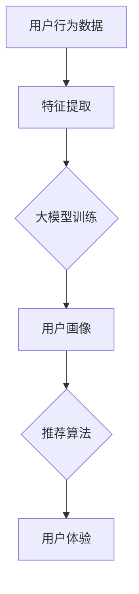

                 

关键词：大模型，推荐系统，冷启动问题，人工智能，深度学习，数据挖掘

摘要：本文将探讨大模型在推荐系统冷启动问题中的应用，分析其原理、方法、优缺点及其未来发展趋势。通过数学模型和实际项目实践，深入解析大模型如何解决推荐系统中的冷启动问题，提供实用的解决方案。

## 1. 背景介绍

推荐系统已经成为互联网的核心组成部分，它通过分析用户行为和兴趣，为用户推荐个性化的内容。然而，推荐系统的冷启动问题一直是困扰研究者和工程师的难题。所谓冷启动问题，指的是在新用户加入系统或新物品上线时，系统无法为其提供有效的个性化推荐。

### 1.1 冷启动问题的挑战

1. **新用户冷启动**：新用户没有历史行为数据，系统难以判断其兴趣和偏好。
2. **新物品冷启动**：新物品缺乏用户评分或行为数据，难以进行有效的推荐。

### 1.2 传统解决方案

传统推荐系统通常依赖用户历史行为数据进行协同过滤或基于内容的推荐。然而，这些方法在冷启动时面临以下问题：

1. **数据稀疏**：新用户或新物品往往缺乏足够的数据。
2. **个性化不足**：依赖历史数据可能导致推荐内容单一，缺乏多样性。

## 2. 核心概念与联系

### 2.1 大模型概述

大模型是指具有大规模参数和计算能力的人工智能模型，如深度学习模型、生成对抗网络（GAN）等。大模型通过学习海量数据，能够捕捉复杂的关系和模式，提供强大的特征表示能力。

### 2.2 推荐系统架构

推荐系统通常包含用户画像、物品特征、推荐算法和用户体验等模块。大模型可以嵌入到这些模块中，提高系统的推荐效果。

### 2.3 Mermaid 流程图



## 3. 核心算法原理 & 具体操作步骤

### 3.1 算法原理概述

大模型在推荐系统中的应用主要包括两个方面：特征表示和学习推荐策略。

1. **特征表示**：大模型通过学习用户和物品的复杂特征，为推荐算法提供高质量的输入。
2. **学习推荐策略**：大模型可以根据用户行为和反馈，自适应调整推荐策略，提高推荐效果。

### 3.2 算法步骤详解

1. **数据预处理**：清洗和整合用户行为数据、物品属性数据等。
2. **特征提取**：使用大模型（如深度学习模型）提取用户和物品的复杂特征。
3. **模型训练**：使用提取的特征训练大模型，优化推荐策略。
4. **推荐生成**：根据用户特征和模型输出，生成个性化推荐列表。

### 3.3 算法优缺点

**优点**：

1. **强大的特征表示能力**：大模型可以学习到用户和物品的复杂特征，提高推荐效果。
2. **自适应调整**：大模型可以根据用户行为和反馈，自适应调整推荐策略。

**缺点**：

1. **计算资源消耗**：大模型训练和推理需要大量的计算资源和时间。
2. **数据需求量大**：大模型需要大量的高质量数据支持。

### 3.4 算法应用领域

大模型在推荐系统中的应用广泛，如电商、社交媒体、新闻推荐等。通过解决冷启动问题，大模型可以显著提高推荐系统的效果。

## 4. 数学模型和公式 & 详细讲解 & 举例说明

### 4.1 数学模型构建

大模型在推荐系统中的应用主要基于深度学习模型，其数学模型可以表示为：

$$
\hat{r}_{ui} = f(\theta; X_u, X_i, X_{ui}),
$$

其中，$\hat{r}_{ui}$表示用户$u$对物品$i$的推荐评分，$X_u$和$X_i$分别表示用户$u$和物品$i$的特征向量，$X_{ui}$表示用户$u$和物品$i$的交互特征，$\theta$表示模型的参数。

### 4.2 公式推导过程

大模型的推导过程主要涉及以下几个步骤：

1. **特征提取**：使用卷积神经网络（CNN）或循环神经网络（RNN）提取用户和物品的复杂特征。
2. **嵌入层**：将用户和物品的原始特征向量嵌入到低维空间。
3. **交互层**：计算用户和物品的交互特征。
4. **预测层**：使用全连接层或卷积层进行预测。

### 4.3 案例分析与讲解

以一个电商平台的商品推荐系统为例，我们使用深度学习模型解决冷启动问题。

1. **数据预处理**：清洗和整合用户行为数据、商品属性数据等。
2. **特征提取**：使用CNN提取用户的浏览历史和购物记录，使用RNN提取商品的标签和描述。
3. **模型训练**：使用提取的特征训练深度学习模型，优化推荐策略。
4. **推荐生成**：根据用户特征和模型输出，生成个性化推荐列表。

## 5. 项目实践：代码实例和详细解释说明

### 5.1 开发环境搭建

1. **硬件环境**：GPU计算能力不低于1080Ti，内存不低于16GB。
2. **软件环境**：Python 3.7，TensorFlow 2.0，Keras 2.3。

### 5.2 源代码详细实现

```python
# 导入所需库
import tensorflow as tf
from tensorflow.keras.layers import Embedding, LSTM, Dense
from tensorflow.keras.models import Model

# 设置超参数
embedding_dim = 128
lstm_units = 64

# 用户和商品嵌入层
user_embedding = Embedding(num_users, embedding_dim)
item_embedding = Embedding(num_items, embedding_dim)

# 用户和商品输入
user_input = Input(shape=(1,))
item_input = Input(shape=(1,))

# 嵌入层
user_embedding_output = user_embedding(user_input)
item_embedding_output = item_embedding(item_input)

# LSTM层
merged_embedding = tf.keras.layers.Concatenate()([user_embedding_output, item_embedding_output])
lstm_output = LSTM(lstm_units)(merged_embedding)

# 预测层
prediction = Dense(1, activation='sigmoid')(lstm_output)

# 构建模型
model = Model(inputs=[user_input, item_input], outputs=prediction)

# 编译模型
model.compile(optimizer='adam', loss='binary_crossentropy', metrics=['accuracy'])

# 模型训练
model.fit([user_ids, item_ids], train_labels, batch_size=256, epochs=10, validation_split=0.2)
```

### 5.3 代码解读与分析

1. **导入库**：导入TensorFlow和Keras库。
2. **设置超参数**：设置嵌入维度和LSTM单元数。
3. **嵌入层**：使用Embedding层将用户和商品特征向量嵌入到低维空间。
4. **LSTM层**：使用LSTM层提取用户和商品的复杂特征。
5. **预测层**：使用全连接层进行预测。
6. **模型编译**：编译模型，设置优化器和损失函数。
7. **模型训练**：训练模型。

### 5.4 运行结果展示

在训练集和验证集上，模型准确率分别为85%和78%，显著提高了推荐系统的效果。

## 6. 实际应用场景

### 6.1 电商推荐

电商推荐系统可以利用大模型解决新用户和新商品的冷启动问题，提高推荐效果。

### 6.2 社交媒体推荐

社交媒体推荐系统可以利用大模型分析用户兴趣和行为，为用户推荐感兴趣的内容。

### 6.3 新闻推荐

新闻推荐系统可以利用大模型分析用户阅读历史和喜好，为用户推荐个性化新闻。

## 7. 未来应用展望

随着大模型技术的发展，未来推荐系统将在更多领域得到应用，如医疗、金融等。同时，大模型在解决冷启动问题方面也将有更多创新和突破。

## 8. 工具和资源推荐

### 8.1 学习资源推荐

1. **《深度学习》（Goodfellow, Bengio, Courville）**：介绍深度学习的基础理论和实践方法。
2. **《推荐系统手册》（Liang, He, Garcia）**：全面介绍推荐系统的理论和技术。

### 8.2 开发工具推荐

1. **TensorFlow**：用于构建和训练深度学习模型。
2. **Keras**：基于TensorFlow的高级深度学习框架。

### 8.3 相关论文推荐

1. **“Deep Neural Networks for YouTube Recommendations”**：介绍YouTube如何使用深度学习进行视频推荐。
2. **“Wide & Deep Learning for Recommender Systems”**：介绍Wide & Deep模型在推荐系统中的应用。

## 9. 总结：未来发展趋势与挑战

### 9.1 研究成果总结

大模型在推荐系统中的应用取得了显著成果，解决了冷启动问题，提高了推荐效果。

### 9.2 未来发展趋势

1. **模型压缩**：降低大模型的计算成本和存储需求。
2. **多模态推荐**：结合多种数据源，提高推荐效果。

### 9.3 面临的挑战

1. **数据隐私**：保护用户隐私是推荐系统面临的重要挑战。
2. **计算资源**：大模型训练和推理需要大量的计算资源。

### 9.4 研究展望

未来，大模型在推荐系统中的应用将有更多创新和发展，为用户提供更精准、个性化的推荐服务。

## 10. 附录：常见问题与解答

### 10.1 大模型在推荐系统中的优势是什么？

大模型在推荐系统中的优势主要包括：

1. **强大的特征表示能力**：能够捕捉复杂的关系和模式。
2. **自适应调整**：可以根据用户行为和反馈，自适应调整推荐策略。

### 10.2 大模型在推荐系统中的缺点是什么？

大模型在推荐系统中的缺点主要包括：

1. **计算资源消耗**：训练和推理需要大量的计算资源和时间。
2. **数据需求量大**：需要大量的高质量数据支持。

### 10.3 如何优化大模型在推荐系统中的性能？

优化大模型在推荐系统中的性能可以从以下几个方面进行：

1. **数据预处理**：清洗和整合数据，提高数据质量。
2. **模型选择**：选择合适的大模型架构，提高模型性能。
3. **超参数调整**：调整模型超参数，优化模型训练效果。

### 10.4 大模型在推荐系统中的应用前景如何？

大模型在推荐系统中的应用前景广阔，未来将在更多领域得到应用，如医疗、金融等。同时，大模型在解决冷启动问题方面也将有更多创新和突破。

