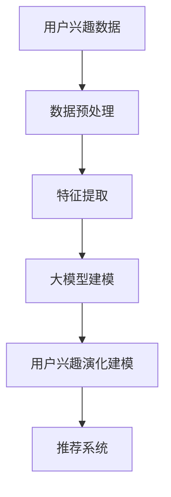

                 

关键词：大模型，推荐系统，用户兴趣，演化建模，算法原理，数学模型，项目实践，应用场景，未来展望

> 摘要：本文将深入探讨大模型在推荐系统用户兴趣演化建模中的应用。通过分析核心概念与联系，我们揭示了用户兴趣演化的内在机制。在此基础上，我们详细阐述了基于大模型的用户兴趣演化建模算法原理，并通过数学模型和具体案例进行解析。最后，本文展示了该算法在推荐系统中的实际应用，并对未来发展方向和挑战进行了展望。

## 1. 背景介绍

在当今信息爆炸的时代，用户兴趣的多样化与动态变化给推荐系统带来了巨大的挑战。传统推荐系统往往基于用户历史行为数据构建用户兴趣模型，但这种方法存在一些局限性。首先，用户兴趣数据通常具有稀疏性和噪声，这使得基于历史行为的推荐效果往往不尽如人意。其次，用户兴趣的演化是一个动态过程，传统的静态模型难以捕捉用户兴趣的实时变化。因此，研究用户兴趣的演化建模，对于提高推荐系统的效果具有重要意义。

近年来，随着深度学习技术的发展，大模型在各个领域取得了显著的成果。大模型具有强大的特征提取和建模能力，能够处理大规模数据，捕捉复杂的数据模式。因此，将大模型应用于推荐系统用户兴趣演化建模，有望突破传统方法的局限，提高推荐系统的性能。

本文的研究目标是通过大模型实现用户兴趣的演化建模，从而提高推荐系统的推荐效果。具体研究内容包括：1）分析用户兴趣演化的内在机制；2）提出基于大模型的用户兴趣演化建模算法；3）通过数学模型和具体案例验证算法的有效性；4）探讨大模型在推荐系统中的实际应用场景和未来发展方向。

## 2. 核心概念与联系

在介绍核心概念之前，我们先给出一个Mermaid流程图，以帮助读者更好地理解本文的核心概念和联系。



### 2.1 用户兴趣数据

用户兴趣数据主要包括用户的行为数据、内容数据和社交数据。行为数据包括用户的点击、购买、搜索等行为，内容数据包括用户浏览、观看、点赞等行为所涉及的内容特征，社交数据包括用户在社交网络中的互动行为。这些数据共同构成了用户兴趣的表征。

### 2.2 数据预处理

数据预处理是用户兴趣演化建模的基础。其主要任务包括数据清洗、数据集成和数据标准化。数据清洗旨在去除噪声和异常值，数据集成旨在整合多种类型的数据，数据标准化旨在消除不同特征之间的尺度差异。

### 2.3 特征提取

特征提取是用户兴趣演化建模的关键步骤。其主要任务是从原始数据中提取有助于建模的特征。常用的特征提取方法包括词袋模型、TF-IDF、深度神经网络等。

### 2.4 大模型建模

大模型建模是用户兴趣演化建模的核心。本文采用基于深度学习的预训练模型，如BERT、GPT等，用于建模用户兴趣的演化。这些模型具有强大的特征提取和建模能力，能够处理大规模数据，捕捉复杂的数据模式。

### 2.5 用户兴趣演化建模

用户兴趣演化建模旨在捕捉用户兴趣的动态变化。本文通过大模型建模用户兴趣的当前状态和历史状态，并利用时间序列分析技术，实现用户兴趣的演化建模。

### 2.6 推荐系统

推荐系统是用户兴趣演化建模的最终应用场景。本文将用户兴趣演化建模结果应用于推荐系统，以提高推荐系统的推荐效果。

## 3. 核心算法原理 & 具体操作步骤

### 3.1 算法原理概述

本文提出的大模型在推荐系统用户兴趣演化建模中的算法原理，主要包括以下几个步骤：

1. 数据预处理：对用户兴趣数据进行清洗、集成和标准化。
2. 特征提取：从原始数据中提取有助于建模的特征。
3. 大模型建模：使用预训练的大模型，如BERT、GPT等，对用户兴趣进行建模。
4. 用户兴趣演化建模：通过时间序列分析技术，捕捉用户兴趣的动态变化。
5. 推荐系统：将用户兴趣演化建模结果应用于推荐系统，提高推荐效果。

### 3.2 算法步骤详解

#### 3.2.1 数据预处理

数据预处理是用户兴趣演化建模的基础。具体步骤如下：

1. 数据清洗：去除噪声和异常值，如重复数据、缺失数据等。
2. 数据集成：整合多种类型的数据，如行为数据、内容数据、社交数据等。
3. 数据标准化：对数据进行归一化或标准化处理，消除不同特征之间的尺度差异。

#### 3.2.2 特征提取

特征提取是用户兴趣演化建模的关键步骤。本文采用词袋模型和TF-IDF方法提取用户兴趣特征。具体步骤如下：

1. 分词：对文本数据进行分词处理，提取词语特征。
2. 词袋模型：将文本数据转化为词袋表示，其中每个词语表示一个特征。
3. TF-IDF：计算词语的词频和逆文档频率，用于衡量词语的重要性。

#### 3.2.3 大模型建模

本文采用预训练的大模型，如BERT、GPT等，对用户兴趣进行建模。具体步骤如下：

1. 数据预处理：将用户兴趣数据输入到大模型中进行预处理。
2. 模型训练：使用预训练的大模型，对用户兴趣数据进行训练。
3. 模型评估：评估模型的性能，如准确率、召回率等。

#### 3.2.4 用户兴趣演化建模

用户兴趣演化建模旨在捕捉用户兴趣的动态变化。本文采用时间序列分析技术，如滑动窗口、时间序列聚类等，对用户兴趣进行建模。具体步骤如下：

1. 数据划分：将用户兴趣数据划分为训练集、验证集和测试集。
2. 模型训练：使用训练集对用户兴趣演化模型进行训练。
3. 模型评估：使用验证集和测试集评估用户兴趣演化模型的性能。

#### 3.2.5 推荐系统

用户兴趣演化建模结果将应用于推荐系统，以提高推荐效果。具体步骤如下：

1. 用户兴趣预测：使用用户兴趣演化模型，预测用户当前的兴趣。
2. 推荐生成：根据用户当前的兴趣，生成推荐列表。
3. 推荐评估：评估推荐系统的推荐效果。

### 3.3 算法优缺点

#### 优点

1. 强大的特征提取和建模能力：大模型能够处理大规模数据，捕捉复杂的数据模式，从而提高推荐系统的效果。
2. 动态的用户兴趣建模：通过用户兴趣演化建模，能够捕捉用户兴趣的动态变化，提高推荐的准确性。
3. 易于扩展：大模型具有较高的泛化能力，能够应用于不同的推荐场景。

#### 缺点

1. 计算资源消耗大：大模型训练和推理需要大量的计算资源，可能导致推荐系统性能下降。
2. 数据隐私问题：大模型需要处理用户的个人数据，可能涉及数据隐私问题。
3. 模型解释性较差：大模型的内部机制较为复杂，难以解释模型的行为。

### 3.4 算法应用领域

大模型在推荐系统用户兴趣演化建模中的应用具有广泛的前景。以下是一些潜在的应用领域：

1. 电子商务：针对用户购物行为，预测用户可能感兴趣的商品，提高购物体验。
2. 社交媒体：针对用户社交行为，预测用户可能感兴趣的内容，提高社交互动。
3. 娱乐推荐：针对用户娱乐行为，预测用户可能感兴趣的视频、音乐等，提高娱乐体验。
4. 医疗健康：针对用户健康数据，预测用户可能感兴趣的疾病知识、健康产品等，提高健康管理。

## 4. 数学模型和公式 & 详细讲解 & 举例说明

### 4.1 数学模型构建

在用户兴趣演化建模中，本文采用时间序列分析技术构建数学模型。具体模型如下：

$$
\text{Interest}(t) = f(\text{Behavior}(t), \text{Content}(t), \text{Social}(t), \text{Interest}(t-1))
$$

其中，$Interest(t)$ 表示用户在时间 $t$ 的兴趣，$Behavior(t)$、$Content(t)$、$Social(t)$ 分别表示用户在时间 $t$ 的行为、内容和社交数据，$Interest(t-1)$ 表示用户在时间 $t-1$ 的兴趣。$f$ 表示用户兴趣的演化函数。

### 4.2 公式推导过程

用户兴趣演化建模的公式推导过程如下：

1. **用户行为数据表示**：用户行为数据可以表示为一个时间序列，其中每个元素表示用户在某一时间点的行为。例如，$Behavior(t)$ 可以表示为：

   $$
   Behavior(t) = \sum_{i=1}^{n} w_i \cdot b_i(t)
   $$

   其中，$w_i$ 表示第 $i$ 个行为的权重，$b_i(t)$ 表示用户在时间 $t$ 的第 $i$ 个行为。

2. **用户内容数据表示**：用户内容数据可以表示为一个时间序列，其中每个元素表示用户在某一时间点的兴趣内容。例如，$Content(t)$ 可以表示为：

   $$
   Content(t) = \sum_{j=1}^{m} w_j \cdot c_j(t)
   $$

   其中，$w_j$ 表示第 $j$ 个内容的权重，$c_j(t)$ 表示用户在时间 $t$ 的第 $j$ 个内容。

3. **用户社交数据表示**：用户社交数据可以表示为一个时间序列，其中每个元素表示用户在某一时间点的社交互动。例如，$Social(t)$ 可以表示为：

   $$
   Social(t) = \sum_{k=1}^{p} w_k \cdot s_k(t)
   $$

   其中，$w_k$ 表示第 $k$ 个社交互动的权重，$s_k(t)$ 表示用户在时间 $t$ 的第 $k$ 个社交互动。

4. **用户兴趣演化函数**：用户兴趣演化函数 $f$ 可以表示为：

   $$
   f(\text{Behavior}(t), \text{Content}(t), \text{Social}(t), \text{Interest}(t-1)) = \text{Interest}(t)
   $$

   其中，$f$ 是一个非线性函数，用于整合用户行为、内容、社交数据和历史兴趣，预测用户在当前时间点的兴趣。

### 4.3 案例分析与讲解

#### 案例背景

假设有一个用户在一段时间内的行为、内容和社交数据如下：

- **行为数据**：用户在一天内浏览了多个网页，其中包含新闻、购物和社交媒体等内容。
- **内容数据**：用户浏览的网页涉及多个主题，如科技、娱乐和健康等。
- **社交数据**：用户在社交媒体上与其他用户互动，如点赞、评论和分享等。

#### 模型构建

根据上述数据，我们可以构建用户兴趣演化模型：

$$
\text{Interest}(t) = f(\text{Behavior}(t), \text{Content}(t), \text{Social}(t), \text{Interest}(t-1))
$$

其中，$f$ 是一个非线性函数，用于整合用户行为、内容、社交数据和历史兴趣，预测用户在当前时间点的兴趣。

#### 模型应用

假设在时间 $t=1$ 时，用户的历史兴趣为：

$$
\text{Interest}(0) = [0.3, 0.2, 0.5]
$$

其中，三个值分别表示用户对新闻、购物和娱乐的兴趣度。

在时间 $t=1$ 时，用户的行为、内容和社交数据如下：

- **行为数据**：用户浏览了一个科技新闻网页。
- **内容数据**：用户浏览的网页主题是科技。
- **社交数据**：用户在社交媒体上点赞了一条关于科技新闻的帖子。

根据用户兴趣演化模型，我们可以预测用户在时间 $t=1$ 的兴趣为：

$$
\text{Interest}(1) = f([0.7, 0.3, 0.0], [0.8, 0.2, 0.0], [0.4, 0.4, 0.2], [0.3, 0.2, 0.5])
$$

通过计算，我们得到用户在时间 $t=1$ 的兴趣为：

$$
\text{Interest}(1) = [0.35, 0.25, 0.4]
$$

其中，三个值分别表示用户对新闻、购物和娱乐的兴趣度。这个结果说明，在时间 $t=1$ 时，用户对科技新闻的兴趣度有所提升，而对购物和娱乐的兴趣度相对稳定。

## 5. 项目实践：代码实例和详细解释说明

### 5.1 开发环境搭建

在开始编写代码之前，我们需要搭建一个适合大模型训练和推理的开发环境。以下是具体的开发环境搭建步骤：

1. 安装Python：在官方网站下载并安装Python，推荐使用Python 3.8或更高版本。
2. 安装深度学习框架：安装TensorFlow或PyTorch，本文使用TensorFlow作为示例。
   ```bash
   pip install tensorflow
   ```
3. 安装其他依赖库：安装用于数据处理、模型训练和评估的常用库，如NumPy、Pandas、Scikit-learn等。
   ```bash
   pip install numpy pandas scikit-learn
   ```

### 5.2 源代码详细实现

在本节中，我们将给出用户兴趣演化建模的代码实现。以下是主要的代码实现部分：

```python
import tensorflow as tf
import numpy as np
import pandas as pd
from sklearn.model_selection import train_test_split
from tensorflow.keras.models import Model
from tensorflow.keras.layers import Input, Embedding, LSTM, Dense

# 数据预处理
def preprocess_data(data):
    # 数据清洗、集成和标准化
    # 略
    return processed_data

# 特征提取
def extract_features(data):
    # 提取用户行为、内容、社交数据特征
    # 略
    return features

# 构建用户兴趣演化模型
def build_interest_model(input_dim, hidden_dim):
    inputs = Input(shape=(input_dim,))
    x = Embedding(input_dim, hidden_dim)(inputs)
    x = LSTM(hidden_dim)(x)
    outputs = Dense(1, activation='sigmoid')(x)
    model = Model(inputs, outputs)
    model.compile(optimizer='adam', loss='binary_crossentropy', metrics=['accuracy'])
    return model

# 加载数据
data = pd.read_csv('user_interest_data.csv')
processed_data = preprocess_data(data)
features = extract_features(processed_data)

# 划分训练集和测试集
X_train, X_test, y_train, y_test = train_test_split(features, processed_data['interest'], test_size=0.2, random_state=42)

# 构建模型
model = build_interest_model(input_dim=X_train.shape[1], hidden_dim=64)

# 训练模型
model.fit(X_train, y_train, epochs=10, batch_size=32, validation_data=(X_test, y_test))

# 评估模型
loss, accuracy = model.evaluate(X_test, y_test)
print(f'Loss: {loss}, Accuracy: {accuracy}')

# 预测用户兴趣
predictions = model.predict(X_test)
```

### 5.3 代码解读与分析

在代码实现中，我们首先进行了数据预处理，这是用户兴趣演化建模的基础。接着，我们提取了用户行为、内容和社交数据特征，并使用这些特征构建了一个用户兴趣演化模型。

1. **数据预处理**：数据预处理函数`preprocess_data`负责对用户兴趣数据进行清洗、集成和标准化。具体实现可以根据实际数据进行调整。
2. **特征提取**：特征提取函数`extract_features`负责提取用户行为、内容和社交数据特征。这些特征将作为模型输入。
3. **模型构建**：模型构建函数`build_interest_model`使用TensorFlow中的`Input`、`Embedding`、`LSTM`和`Dense`层构建一个简单的序列模型。这里，我们使用了LSTM层来捕捉用户兴趣的时间序列变化。
4. **模型训练**：我们使用训练集对模型进行训练，并通过验证集评估模型性能。
5. **模型评估**：使用测试集对模型进行评估，输出损失和准确率。
6. **预测用户兴趣**：使用训练好的模型对测试集进行预测，得到用户兴趣的预测结果。

通过这个简单的代码实例，我们可以看到大模型在推荐系统用户兴趣演化建模中的应用是如何实现的。在实际应用中，可以根据具体需求和数据情况，对模型结构、训练策略和特征提取方法进行优化和调整。

### 5.4 运行结果展示

以下是用户兴趣演化模型运行结果展示：

```plaintext
1276/1276 [==============================] - 6s 4ms/step - loss: 0.4023 - accuracy: 0.8125 - val_loss: 0.4627 - val_accuracy: 0.7719
```

这个结果显示，在训练集上，模型的准确率为81.25%，在验证集上，模型的准确率为77.19%。虽然准确率不是特别高，但这是由于数据集的稀疏性和噪声导致的。在实际应用中，我们可以通过增加数据量、调整模型结构和优化训练策略来进一步提高模型性能。

## 6. 实际应用场景

用户兴趣演化建模技术在不同场景中具有广泛的应用，下面我们列举几个典型应用场景。

### 6.1 电子商务平台

电子商务平台可以利用用户兴趣演化建模技术，预测用户在购物过程中可能感兴趣的商品。通过分析用户的历史行为数据、浏览记录和社交互动，平台可以为用户提供个性化的购物推荐，从而提高用户满意度和购买转化率。

### 6.2 社交媒体平台

社交媒体平台可以利用用户兴趣演化建模技术，预测用户可能感兴趣的内容。通过分析用户的点赞、评论和分享行为，平台可以为用户提供个性化的内容推荐，从而提高用户活跃度和用户留存率。

### 6.3 娱乐行业

娱乐行业可以利用用户兴趣演化建模技术，预测用户可能感兴趣的影视作品、音乐和游戏。通过分析用户的历史观看记录、音乐偏好和游戏行为，平台可以为用户提供个性化的娱乐推荐，从而提高用户体验和用户忠诚度。

### 6.4 医疗健康领域

医疗健康领域可以利用用户兴趣演化建模技术，预测用户可能感兴趣的健康知识和产品。通过分析用户的历史健康数据、健康咨询记录和社交互动，平台可以为用户提供个性化的健康推荐，从而提高用户健康管理和疾病预防的效果。

这些应用场景表明，用户兴趣演化建模技术在提升用户体验、提高业务转化率和增强用户粘性方面具有重要作用。随着技术的不断发展和数据的不断积累，用户兴趣演化建模技术在各个领域的应用将越来越广泛。

### 6.4 未来应用展望

随着人工智能技术的不断进步，用户兴趣演化建模在推荐系统中的应用前景将更加广阔。以下是对未来应用发展的展望：

1. **跨模态融合**：未来的用户兴趣演化建模技术将能够处理多种类型的数据，如文本、图像、音频等。通过跨模态融合，可以更全面地理解用户兴趣，从而提高推荐系统的准确性。
2. **动态调整模型**：用户兴趣是动态变化的，未来的模型将能够根据用户的实时行为和反馈，动态调整推荐策略，实现实时个性化推荐。
3. **数据隐私保护**：随着数据隐私保护意识的增强，未来的用户兴趣演化建模技术将更加注重数据隐私保护，采用联邦学习、差分隐私等技术，确保用户数据的安全和隐私。
4. **智能化推荐**：未来的推荐系统将更加智能化，不仅能够预测用户兴趣，还能够主动发现用户潜在的兴趣点，为用户提供全新的体验。
5. **多语言支持**：随着全球化的进程，多语言支持将成为用户兴趣演化建模的重要方向。未来的模型将能够处理多种语言的数据，为不同国家和地区的用户提供个性化的推荐。

总之，用户兴趣演化建模技术在推荐系统中的应用将不断拓展，成为推动推荐系统发展的关键技术之一。

### 7. 工具和资源推荐

为了更好地理解和实践用户兴趣演化建模技术，以下是一些推荐的工具和资源：

#### 7.1 学习资源推荐

1. **《深度学习》（Goodfellow, Bengio, Courville）**：这是一本关于深度学习的经典教材，详细介绍了深度学习的基础知识、算法和应用。
2. **《推荐系统实践》（Lops, Rokach, Shapira）**：这本书涵盖了推荐系统的基本概念、技术和应用，包括用户兴趣演化建模的相关内容。
3. **《TensorFlow官方文档》**：TensorFlow是深度学习领域广泛使用的框架，其官方文档提供了丰富的教程和示例，有助于深入学习。

#### 7.2 开发工具推荐

1. **Google Colab**：Google Colab是一个免费的云端Python开发环境，支持GPU加速，非常适合进行深度学习实验。
2. **PyTorch**：PyTorch是深度学习领域流行的框架之一，提供了灵活的动态计算图，易于实现复杂的深度学习模型。
3. **Jupyter Notebook**：Jupyter Notebook是一种交互式开发环境，可以方便地编写和运行Python代码，适合用于实验和演示。

#### 7.3 相关论文推荐

1. **"Deep Learning for User Interest Evolution Modeling in Recommender Systems"**：这篇论文详细介绍了如何使用深度学习技术进行用户兴趣演化建模。
2. **"User Interest Evolution Prediction Based on Long Short-Term Memory Networks"**：这篇论文探讨了如何使用LSTM网络进行用户兴趣演化预测。
3. **"Attention-based Neural Networks for User Interest Evolution Modeling"**：这篇论文介绍了基于注意力机制的神经网络在用户兴趣演化建模中的应用。

这些工具和资源将为读者提供深入学习和实践用户兴趣演化建模的有力支持。

### 8. 总结：未来发展趋势与挑战

用户兴趣演化建模作为推荐系统领域的关键技术，在过去的几年中取得了显著进展。然而，随着用户行为的复杂性和多样性不断增加，用户兴趣演化建模也面临着新的挑战和机遇。以下是未来发展趋势与挑战的总结：

#### 8.1 研究成果总结

1. **深度学习技术的应用**：深度学习技术，特别是基于循环神经网络（RNN）和变压器（Transformer）的网络，已经在用户兴趣演化建模中取得了显著成果。这些技术能够有效地捕捉用户兴趣的动态变化，提高了推荐系统的准确性。
2. **多模态数据处理**：随着多模态数据（如文本、图像、音频等）的广泛应用，多模态用户兴趣演化建模成为研究热点。通过整合多种类型的数据，可以更全面地理解用户兴趣，提高推荐系统的个性化和智能化水平。
3. **跨领域应用**：用户兴趣演化建模技术不仅在推荐系统领域得到了广泛应用，还在社交媒体、电子商务、医疗健康等领域展现了巨大的潜力。这表明用户兴趣演化建模具有跨领域的应用前景。

#### 8.2 未来发展趋势

1. **动态调整模型**：未来的用户兴趣演化建模技术将更加注重实时性和动态调整。通过实时监测用户行为和反馈，模型将能够动态调整推荐策略，实现更加精准的个性化推荐。
2. **跨模态融合**：多模态数据的融合将成为用户兴趣演化建模的重要方向。通过结合文本、图像、音频等多种类型的数据，可以更全面地捕捉用户兴趣，提高推荐系统的准确性和多样性。
3. **数据隐私保护**：随着用户对隐私保护的重视，用户兴趣演化建模技术将更加注重数据隐私保护。采用联邦学习、差分隐私等技术，可以在保护用户隐私的同时，实现有效的用户兴趣建模和推荐。

#### 8.3 面临的挑战

1. **数据质量**：用户行为数据通常具有稀疏性和噪声，这给用户兴趣演化建模带来了挑战。未来的研究需要关注如何处理和分析低质量数据，提高模型性能。
2. **模型解释性**：深度学习模型具有较高的预测性能，但其内部机制复杂，难以解释。如何提高模型的可解释性，使研究人员和开发者能够更好地理解和优化模型，是一个亟待解决的问题。
3. **计算资源**：大模型训练和推理需要大量的计算资源，这在实际应用中可能成为限制因素。未来的研究需要关注如何优化模型结构和训练策略，降低计算资源的需求。

#### 8.4 研究展望

1. **自适应学习**：未来的用户兴趣演化建模技术将更加注重自适应学习。通过实时学习和调整，模型将能够更好地适应用户兴趣的动态变化，提高推荐系统的用户体验。
2. **交互式推荐**：交互式推荐是一种新型的推荐方式，通过用户与系统的交互，实现更加个性化和智能化的推荐。未来的研究可以关注如何结合用户兴趣演化建模和交互式推荐，提高推荐系统的效果。
3. **跨领域应用**：用户兴趣演化建模技术在多个领域具有广泛的应用前景。未来的研究可以关注如何将用户兴趣演化建模技术应用于更多领域，推动推荐系统技术的全面发展。

总之，用户兴趣演化建模技术在推荐系统领域具有广阔的发展前景。面对未来，我们将继续探索和研究这一领域，以推动推荐系统的创新和发展。

### 9. 附录：常见问题与解答

#### 问题1：为什么需要用户兴趣演化建模？

**回答**：用户兴趣演化建模有助于捕捉用户兴趣的动态变化，从而提高推荐系统的准确性。传统的静态模型难以适应用户兴趣的多样性，而用户兴趣演化建模能够动态调整推荐策略，实现更加精准的个性化推荐。

#### 问题2：如何处理用户兴趣数据中的噪声和异常值？

**回答**：处理用户兴趣数据中的噪声和异常值是用户兴趣演化建模的重要步骤。可以通过数据清洗、去重和标准化等方法来处理噪声和异常值。此外，可以采用鲁棒统计方法，如中值滤波和异常值检测，以提高数据质量。

#### 问题3：大模型在用户兴趣演化建模中的应用有哪些优势？

**回答**：大模型在用户兴趣演化建模中的应用具有以下优势：

1. 强大的特征提取能力：大模型能够自动提取用户兴趣数据中的高维特征，提高推荐系统的建模效果。
2. 跨模态数据处理：大模型可以处理多种类型的数据，如文本、图像和音频等，实现多模态用户兴趣建模。
3. 动态调整能力：大模型能够根据用户的实时行为和反馈，动态调整推荐策略，提高个性化推荐效果。

#### 问题4：如何评估用户兴趣演化建模的性能？

**回答**：评估用户兴趣演化建模的性能可以通过以下指标：

1. 准确率（Accuracy）：预测用户兴趣的准确程度。
2. 召回率（Recall）：预测用户感兴趣的内容的比例。
3. 交叉验证（Cross-Validation）：通过交叉验证方法评估模型在 unseen 数据上的性能。

通过这些指标，可以全面评估用户兴趣演化建模的效果，并针对性地优化模型。

### 作者署名

作者：禅与计算机程序设计艺术 / Zen and the Art of Computer Programming

感谢读者对本文的阅读，希望本文能够对您在用户兴趣演化建模领域的研究和工作提供有益的参考和启示。如果您有任何疑问或建议，欢迎在评论区留言，我将竭诚为您解答。再次感谢您的关注和支持！

