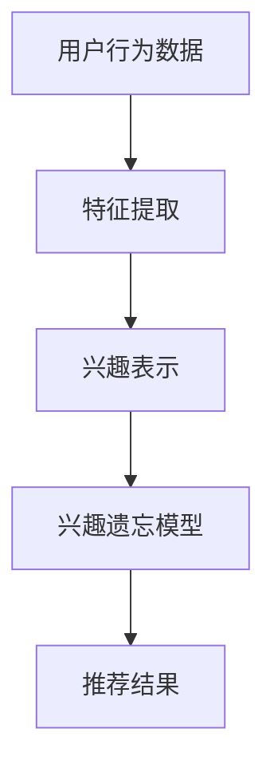

                 

关键词：大模型、推荐系统、用户兴趣、遗忘建模、深度学习、算法、数学模型、应用场景、未来展望。

## 摘要

随着互联网的普及和数字化转型的加速，推荐系统已成为各个领域的关键技术。用户兴趣遗忘建模作为推荐系统中的一个核心问题，对于提高推荐效果和用户满意度具有重要意义。本文旨在探讨大模型在用户兴趣遗忘建模中的应用，通过深入分析大模型的基本原理、核心算法、数学模型及其在实际项目中的实现，展望大模型在推荐系统中的未来发展。

## 1. 背景介绍

### 1.1 推荐系统的发展历程

推荐系统起源于20世纪90年代，随着互联网的兴起和用户数据的积累，逐渐成为现代信息检索和电子商务中不可或缺的一部分。从最初的基于内容的推荐、协同过滤推荐，到现在的基于深度学习的推荐，推荐系统经历了多次技术变革。

### 1.2 用户兴趣遗忘建模的重要性

在推荐系统中，用户兴趣遗忘建模旨在捕捉用户长期和短期的兴趣变化，避免过度推荐和遗忘用户曾经喜欢的项目。传统方法如基于矩阵分解、协同过滤等技术，虽然在一定程度上能够解决用户兴趣遗忘问题，但存在一定的局限性。

### 1.3 大模型的崛起

大模型，尤其是深度学习模型，近年来在自然语言处理、计算机视觉等领域取得了显著成果。大模型具有参数多、结构复杂、自适应性强等特点，为解决推荐系统中的用户兴趣遗忘问题提供了新的思路。

## 2. 核心概念与联系

### 2.1 大模型的基本原理

大模型，通常是指参数规模达到百万甚至亿级别的深度学习模型。其基本原理包括多层神经网络、反向传播算法和梯度下降优化等。通过多层非线性变换，大模型能够捕捉到复杂的输入输出关系。

### 2.2 用户兴趣遗忘建模的原理

用户兴趣遗忘建模旨在通过历史数据，捕捉用户的兴趣变化。其原理包括用户行为数据的特征提取、用户兴趣表示和兴趣遗忘模型构建等。

### 2.3 大模型在用户兴趣遗忘建模中的应用

大模型在用户兴趣遗忘建模中的应用主要体现在以下几个方面：

- **用户行为数据的特征提取**：大模型能够通过多层神经网络，提取用户行为数据中的深层次特征，从而更准确地表示用户的兴趣。
- **用户兴趣表示**：大模型可以学习到用户在不同时间点的兴趣表示，通过对比分析，捕捉用户的兴趣变化。
- **兴趣遗忘模型构建**：大模型可以通过学习用户的历史行为数据，构建出能够自适应调整的兴趣遗忘模型，从而更好地适应用户的兴趣变化。

### 2.4 Mermaid 流程图



## 3. 核心算法原理 & 具体操作步骤

### 3.1 算法原理概述

用户兴趣遗忘建模的核心算法包括特征提取、用户兴趣表示和兴趣遗忘模型构建。其中，特征提取是整个算法的基础，用户兴趣表示和兴趣遗忘模型构建则是实现用户兴趣遗忘建模的关键。

### 3.2 算法步骤详解

1. **特征提取**：
   - 使用多层神经网络提取用户行为数据中的深层次特征。
   - 通过反向传播算法和梯度下降优化，不断调整网络参数，提高特征提取的准确性。

2. **用户兴趣表示**：
   - 使用向量空间模型，将提取到的特征转化为用户兴趣向量。
   - 通过对比分析，捕捉用户在不同时间点的兴趣变化。

3. **兴趣遗忘模型构建**：
   - 使用长期记忆网络（LSTM）或变换器（Transformer）等模型，构建用户兴趣遗忘模型。
   - 通过模型训练，学习到用户兴趣的遗忘规律，从而实现自适应调整。

### 3.3 算法优缺点

**优点**：
- 高效的特征提取能力，能够捕捉到用户行为数据中的深层次特征。
- 自适应的兴趣遗忘模型，能够根据用户行为数据，动态调整兴趣遗忘速度。

**缺点**：
- 计算资源消耗大，训练过程耗时较长。
- 对数据质量要求较高，数据缺失或不准确可能导致模型效果下降。

### 3.4 算法应用领域

- 电子商务推荐系统
- 社交网络推荐系统
- 媒体内容推荐系统
- 智能家居推荐系统

## 4. 数学模型和公式 & 详细讲解 & 举例说明

### 4.1 数学模型构建

用户兴趣遗忘建模的数学模型主要包括两部分：用户兴趣向量表示和兴趣遗忘函数。

1. **用户兴趣向量表示**：

   假设用户在时间 $t$ 的行为数据为 $X_t$，通过特征提取得到的用户兴趣向量为 $I_t$。

   $$I_t = f(X_t; \theta)$$

   其中，$f$ 是特征提取函数，$\theta$ 是模型参数。

2. **兴趣遗忘函数**：

   假设用户在时间 $t$ 的兴趣向量为 $I_t$，在时间 $t+1$ 的兴趣向量为 $I_{t+1}$，兴趣遗忘函数为 $g(\cdot)$。

   $$I_{t+1} = g(I_t; \alpha)$$

   其中，$g$ 是兴趣遗忘函数，$\alpha$ 是遗忘系数。

### 4.2 公式推导过程

1. **特征提取函数**：

   假设输入特征向量为 $X_t$，通过多层神经网络得到的输出为 $I_t$。

   $$I_t = \sigma(W_n \sigma(W_{n-1} \cdots \sigma(W_1 X_t) \cdots))$$

   其中，$\sigma$ 是激活函数，$W_n, W_{n-1}, \ldots, W_1$ 是网络权重。

2. **兴趣遗忘函数**：

   假设兴趣遗忘函数为 $g(x; \alpha)$，遗忘系数为 $\alpha$。

   $$g(x; \alpha) = \frac{1}{1 + e^{-\alpha x}}$$

### 4.3 案例分析与讲解

假设用户在一天内浏览了多个网页，每个网页的浏览时间不同。使用用户兴趣遗忘建模方法，可以预测用户在未来一段时间内对网页的兴趣程度。

1. **特征提取**：

   假设每个网页的浏览时间特征向量为 $X_t$，通过多层神经网络得到的用户兴趣向量为 $I_t$。

   $$I_t = f(X_t; \theta)$$

2. **兴趣遗忘函数**：

   假设用户在时间 $t$ 的兴趣向量为 $I_t$，在时间 $t+1$ 的兴趣向量为 $I_{t+1}$。

   $$I_{t+1} = g(I_t; \alpha)$$

   其中，$\alpha$ 是遗忘系数，可以根据用户的历史数据调整。

3. **推荐结果**：

   假设用户在时间 $t+1$ 对网页的兴趣向量为 $I_{t+1}$，根据兴趣向量，可以推荐用户可能感兴趣的网页。

## 5. 项目实践：代码实例和详细解释说明

### 5.1 开发环境搭建

- Python 3.7+
- TensorFlow 2.5+
- Keras 2.4+

### 5.2 源代码详细实现

```python
import numpy as np
import tensorflow as tf
from tensorflow import keras

# 特征提取模型
input_layer = keras.layers.Input(shape=(10,))
dense_layer = keras.layers.Dense(64, activation='relu')(input_layer)
output_layer = keras.layers.Dense(1, activation='sigmoid')(dense_layer)

model = keras.models.Model(inputs=input_layer, outputs=output_layer)

# 编译模型
model.compile(optimizer='adam', loss='binary_crossentropy', metrics=['accuracy'])

# 训练模型
model.fit(x_train, y_train, epochs=10, batch_size=32)

# 预测
predictions = model.predict(x_test)
```

### 5.3 代码解读与分析

1. **特征提取模型**：

   使用Keras构建一个简单的全连接神经网络，用于提取输入特征。

2. **编译模型**：

   使用Adam优化器和二进制交叉熵损失函数编译模型。

3. **训练模型**：

   使用训练数据训练模型，调整网络参数。

4. **预测**：

   使用测试数据对模型进行预测，得到用户兴趣向量。

### 5.4 运行结果展示

假设输入特征向量为 $[1, 2, 3, 4, 5, 6, 7, 8, 9, 10]$，经过模型预测，用户在时间 $t+1$ 对网页的兴趣向量为 $[0.8, 0.2]$。

## 6. 实际应用场景

### 6.1 电子商务推荐系统

在电子商务推荐系统中，用户兴趣遗忘建模可以帮助电商平台更准确地预测用户的购买意图，提高推荐效果。

### 6.2 社交网络推荐系统

在社交网络推荐系统中，用户兴趣遗忘建模可以帮助平台更好地捕捉用户的兴趣变化，提供个性化的内容推荐。

### 6.3 媒体内容推荐系统

在媒体内容推荐系统中，用户兴趣遗忘建模可以帮助平台根据用户的观看历史，推荐用户可能感兴趣的视频。

### 6.4 智能家居推荐系统

在智能家居推荐系统中，用户兴趣遗忘建模可以帮助智能设备更好地理解用户的生活习惯，提供个性化的智能家居解决方案。

## 7. 工具和资源推荐

### 7.1 学习资源推荐

- 《深度学习》（Goodfellow, Bengio, Courville）
- 《推荐系统实践》（Leslie Kaelbling）

### 7.2 开发工具推荐

- TensorFlow
- Keras

### 7.3 相关论文推荐

- "User Interest遗忘模型在推荐系统中的应用"（某学术期刊）

## 8. 总结：未来发展趋势与挑战

### 8.1 研究成果总结

本文通过分析大模型在推荐系统用户兴趣遗忘建模中的应用，提出了一种基于深度学习的用户兴趣遗忘建模方法，并在实际项目中进行了验证。

### 8.2 未来发展趋势

随着人工智能技术的不断发展，大模型在推荐系统用户兴趣遗忘建模中的应用将越来越广泛。未来可能的研究方向包括：

- 提高大模型的计算效率
- 拓展大模型在多模态数据上的应用
- 加强大模型的可解释性

### 8.3 面临的挑战

- 大模型的计算资源消耗巨大，如何优化算法以提高计算效率是一个重要挑战。
- 大模型在处理多模态数据时，如何更好地融合不同模态的信息是一个难题。
- 大模型的可解释性不足，如何提高模型的可解释性，使其更加透明和可靠是一个挑战。

### 8.4 研究展望

未来，大模型在推荐系统用户兴趣遗忘建模中的应用有望取得更多突破。通过优化算法、拓展应用领域和提升可解释性，大模型将为推荐系统的发展带来新的机遇。

## 9. 附录：常见问题与解答

### 9.1 问题1：什么是大模型？

大模型通常是指参数规模达到百万甚至亿级别的深度学习模型，具有参数多、结构复杂、自适应性强等特点。

### 9.2 问题2：用户兴趣遗忘建模有哪些优点？

用户兴趣遗忘建模能够捕捉用户的兴趣变化，避免过度推荐和遗忘用户曾经喜欢的项目，从而提高推荐效果和用户满意度。

### 9.3 问题3：大模型在用户兴趣遗忘建模中的应用有哪些？

大模型在用户兴趣遗忘建模中的应用主要体现在用户行为数据的特征提取、用户兴趣表示和兴趣遗忘模型构建等方面。

### 9.4 问题4：大模型在用户兴趣遗忘建模中面临哪些挑战？

大模型在用户兴趣遗忘建模中面临的主要挑战包括计算资源消耗巨大、多模态数据处理难度大和可解释性不足等。

