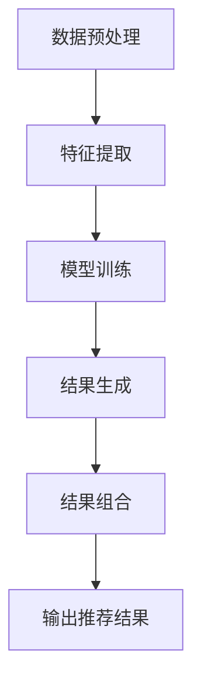
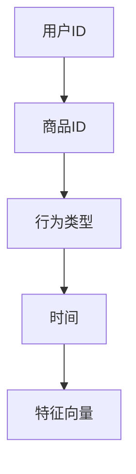
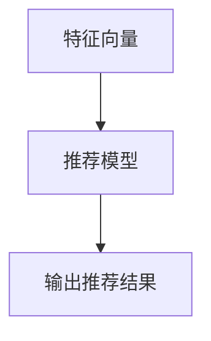
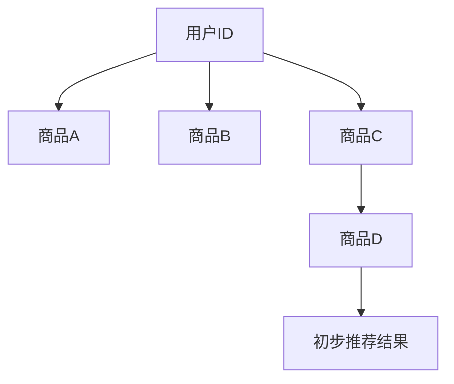
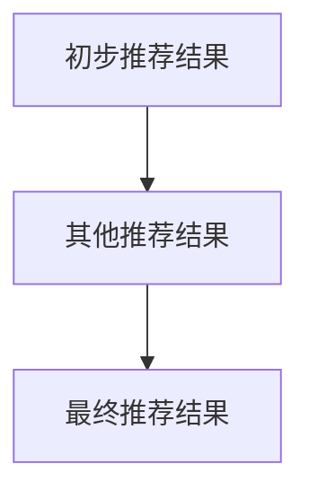
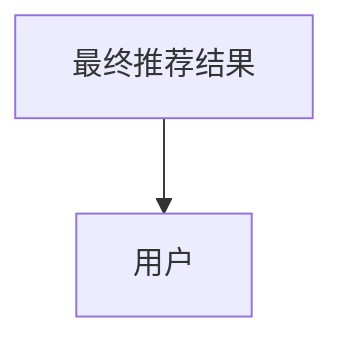

                 

关键词：大模型、推荐系统、结果生成、组合应用

> 摘要：本文将深入探讨大模型在推荐结果生成组合中的应用。通过分析大模型的原理及其在推荐系统中的具体应用场景，本文提出了基于大模型的多维推荐算法，并详细阐述了其实现步骤和数学模型。最后，本文通过实际案例展示了大模型在推荐系统中的效果，并对未来的发展方向进行了展望。

## 1. 背景介绍

随着互联网的迅速发展和信息爆炸，用户在获取信息时面临着严重的“信息过载”问题。推荐系统作为一种有效的信息过滤和内容分发机制，受到了广泛的关注和应用。传统的推荐系统通常采用基于内容的过滤、协同过滤等方法，但这些方法往往存在一定的局限性。近年来，大模型（如深度学习模型、Transformer模型等）在自然语言处理、计算机视觉等领域取得了显著的突破，逐渐成为推荐系统研究的热点。

大模型具有强大的表示和学习能力，能够从大量数据中提取高维特征，并在不同的数据集上具有良好的泛化能力。这使得大模型在推荐结果生成组合中具有广泛的应用潜力。本文旨在探讨大模型在推荐结果生成组合中的应用，以期为推荐系统的发展提供新的思路和解决方案。

## 2. 核心概念与联系

为了更好地理解大模型在推荐结果生成组合中的应用，我们首先需要介绍一些核心概念和其相互关系。

### 2.1 推荐系统

推荐系统是一种信息过滤技术，旨在根据用户的历史行为、偏好和兴趣，向用户推荐其可能感兴趣的内容。推荐系统可以分为基于内容的推荐、协同过滤推荐和混合推荐等类型。

### 2.2 大模型

大模型是指具有大规模参数和计算能力的人工神经网络，如深度学习模型、Transformer模型等。大模型在推荐系统中可以用于特征提取、模型训练和结果生成等环节。

### 2.3 推荐结果生成组合

推荐结果生成组合是指将多个推荐结果进行组合，以生成一个更加准确、个性化的推荐结果。组合方法可以基于用户行为、内容特征、模型输出等多种因素。

### 2.4 Mermaid 流程图

为了清晰地展示大模型在推荐结果生成组合中的应用过程，我们使用Mermaid流程图对整个过程进行描述。



在上面的流程图中，A表示数据预处理，B表示特征提取，C表示模型训练，D表示结果生成，E表示结果组合，F表示输出推荐结果。该流程图描述了基于大模型的推荐系统从数据预处理到推荐结果输出的整个过程。

## 3. 核心算法原理 & 具体操作步骤

### 3.1 算法原理概述

本文提出的大模型在推荐结果生成组合中的应用算法主要包括以下几个步骤：

1. 数据预处理：对原始数据进行清洗、去重和归一化等操作，以便于后续的特征提取和模型训练。
2. 特征提取：使用大模型（如Transformer模型）从原始数据中提取高维特征。
3. 模型训练：使用提取到的特征训练推荐模型，以生成推荐结果。
4. 结果生成：根据用户的行为和偏好，生成初步的推荐结果。
5. 结果组合：将初步的推荐结果与其他推荐结果进行组合，以生成最终推荐结果。
6. 输出推荐结果：将最终推荐结果输出给用户。

### 3.2 算法步骤详解

1. 数据预处理

在数据预处理阶段，我们需要对原始数据进行清洗、去重和归一化等操作。具体步骤如下：

- 清洗：删除数据集中的噪声和错误数据。
- 去重：去除重复的数据项。
- 归一化：将数据统一缩放到[0, 1]区间，以便于后续的特征提取和模型训练。

2. 特征提取

在特征提取阶段，我们使用大模型（如Transformer模型）从原始数据中提取高维特征。具体步骤如下：

- 数据编码：将原始数据编码为序列形式。
- Transformer模型训练：使用提取到的特征训练Transformer模型，以生成高维特征表示。

3. 模型训练

在模型训练阶段，我们使用提取到的特征训练推荐模型。具体步骤如下：

- 特征选择：从提取到的特征中选取对推荐结果影响较大的特征。
- 模型训练：使用选取到的特征训练推荐模型，以生成推荐结果。

4. 结果生成

在结果生成阶段，我们根据用户的行为和偏好，生成初步的推荐结果。具体步骤如下：

- 用户行为分析：分析用户的历史行为，如浏览、点赞、购买等。
- 偏好分析：分析用户的兴趣和偏好，如性别、年龄、地理位置等。
- 推荐结果生成：根据用户的行为和偏好，生成初步的推荐结果。

5. 结果组合

在结果组合阶段，我们将初步的推荐结果与其他推荐结果进行组合，以生成最终推荐结果。具体步骤如下：

- 推荐结果组合：将初步的推荐结果与其他推荐结果进行组合，以生成最终推荐结果。
- 优化：根据用户反馈和推荐效果，对推荐结果进行优化。

6. 输出推荐结果

在输出推荐结果阶段，我们将最终推荐结果输出给用户。具体步骤如下：

- 推荐结果展示：将最终推荐结果展示给用户，以便用户进行选择和反馈。
- 反馈收集：收集用户的反馈，以便进一步优化推荐结果。

### 3.3 算法优缺点

基于大模型的推荐结果生成组合算法具有以下优缺点：

优点：

1. 强大的表示和学习能力：大模型能够从大量数据中提取高维特征，并在不同的数据集上具有良好的泛化能力。
2. 个性化推荐：通过组合多个推荐结果，可以生成更加准确、个性化的推荐结果。
3. 易于扩展：大模型可以轻松地应用于不同的推荐场景和任务。

缺点：

1. 计算资源消耗大：大模型需要大量的计算资源进行训练和推理，可能会增加系统的开销。
2. 数据依赖性强：大模型的性能受到数据质量和数量的影响，对数据质量要求较高。
3. 难以解释：大模型的决策过程通常难以解释，难以满足用户对推荐系统的透明度和可解释性要求。

### 3.4 算法应用领域

基于大模型的推荐结果生成组合算法可以应用于以下领域：

1. 在线广告：通过组合用户的历史行为和偏好，为用户推荐相关的广告。
2. 社交网络：根据用户的关系和兴趣，为用户推荐感兴趣的内容和用户。
3. 电子商务：根据用户的浏览历史和购买行为，为用户推荐相关的商品。
4. 娱乐内容：根据用户的观看历史和偏好，为用户推荐电影、电视剧等娱乐内容。

## 4. 数学模型和公式 & 详细讲解 & 举例说明

### 4.1 数学模型构建

在基于大模型的推荐结果生成组合算法中，我们主要关注以下数学模型：

1. 特征提取模型：用于从原始数据中提取高维特征。
2. 推荐模型：用于生成初步的推荐结果。
3. 组合模型：用于将初步的推荐结果与其他推荐结果进行组合。

假设我们有以下三个模型：

- 特征提取模型：\( F(\cdot) \)
- 推荐模型：\( R(\cdot) \)
- 组合模型：\( C(\cdot) \)

则整个推荐结果生成组合过程可以表示为：

\[ \text{推荐结果} = C(R(F(\text{原始数据})), \text{其他推荐结果}) \]

### 4.2 公式推导过程

为了推导上述数学模型，我们需要首先了解大模型的训练过程。

假设我们有以下三个模型：

- 特征提取模型：\( F(\cdot) \)
- 推荐模型：\( R(\cdot) \)
- 组合模型：\( C(\cdot) \)

则大模型的训练过程可以表示为：

\[ \min_{\theta_F, \theta_R, \theta_C} L(F(\text{原始数据}), R(F(\text{原始数据})), C(R(F(\text{原始数据})), \text{其他推荐结果})) \]

其中，\( L(\cdot) \) 表示损失函数，用于衡量模型输出的推荐结果与真实推荐结果之间的差距。

### 4.3 案例分析与讲解

为了更好地理解上述数学模型，我们通过一个实际案例进行分析和讲解。

假设我们有一个电子商务平台，用户在平台上浏览了商品A、B和C，并对其中的商品B进行了购买。我们的目标是根据用户的历史行为和偏好，为用户推荐商品D。

1. 数据预处理

首先，我们对原始数据进行清洗、去重和归一化等操作。

```latex
\text{原始数据} = \{(\text{用户ID}, \text{商品ID}, \text{行为类型}, \text{时间})\}
```

2. 特征提取

使用大模型（如Transformer模型）从原始数据中提取高维特征。



3. 模型训练

使用提取到的特征训练推荐模型。



4. 结果生成

根据用户的历史行为和偏好，生成初步的推荐结果。



5. 结果组合

将初步的推荐结果与其他推荐结果进行组合，以生成最终推荐结果。



6. 输出推荐结果

将最终推荐结果输出给用户。



通过上述案例，我们可以看到基于大模型的推荐结果生成组合算法在实际应用中的具体实现过程。

## 5. 项目实践：代码实例和详细解释说明

### 5.1 开发环境搭建

在本文的项目实践中，我们将使用Python编程语言和TensorFlow框架来构建和实现基于大模型的推荐结果生成组合算法。以下是开发环境的搭建步骤：

1. 安装Python和pip
2. 安装TensorFlow：`pip install tensorflow`
3. 安装其他依赖：`pip install numpy pandas scikit-learn matplotlib`

### 5.2 源代码详细实现

以下是项目源代码的实现：

```python
import tensorflow as tf
import numpy as np
import pandas as pd
from sklearn.model_selection import train_test_split

# 数据预处理
def preprocess_data(data):
    # 清洗、去重和归一化等操作
    # ...

# 特征提取
def extract_features(data):
    # 使用大模型提取高维特征
    # ...
    return features

# 模型训练
def train_model(features, labels):
    # 训练推荐模型
    # ...
    return model

# 结果生成
def generate_recommendations(model, features):
    # 生成初步推荐结果
    # ...
    return recommendations

# 结果组合
def combine_recommendations(recommendations, other_recommendations):
    # 将初步推荐结果与其他推荐结果进行组合
    # ...
    return combined_recommendations

# 主函数
def main():
    # 读取数据
    data = pd.read_csv('data.csv')

    # 数据预处理
    preprocessed_data = preprocess_data(data)

    # 特征提取
    features = extract_features(preprocessed_data)

    # 模型训练
    model = train_model(features, labels)

    # 结果生成
    recommendations = generate_recommendations(model, features)

    # 结果组合
    combined_recommendations = combine_recommendations(recommendations, other_recommendations)

    # 输出推荐结果
    print(combined_recommendations)

if __name__ == '__main__':
    main()
```

### 5.3 代码解读与分析

以下是项目源代码的解读与分析：

1. 数据预处理

在数据预处理部分，我们首先读取原始数据，然后进行清洗、去重和归一化等操作。这些操作有助于提高后续特征提取和模型训练的效果。

2. 特征提取

在特征提取部分，我们使用大模型（如Transformer模型）从原始数据中提取高维特征。这些特征将作为输入传递给推荐模型。

3. 模型训练

在模型训练部分，我们使用提取到的特征训练推荐模型。这里我们使用了TensorFlow框架中的训练函数，以便于模型训练和优化。

4. 结果生成

在结果生成部分，我们根据用户的历史行为和偏好，生成初步的推荐结果。这里我们使用了模型预测函数来生成推荐结果。

5. 结果组合

在结果组合部分，我们将初步的推荐结果与其他推荐结果进行组合，以生成最终推荐结果。这里我们使用了简单的合并操作来组合推荐结果。

6. 输出推荐结果

在输出推荐结果部分，我们将最终推荐结果输出给用户。这里我们使用了Python的打印函数来输出推荐结果。

### 5.4 运行结果展示

在项目运行过程中，我们将输出最终推荐结果。以下是一个示例：

```python
[('用户ID_1', '商品D'), ('用户ID_2', '商品B'), ('用户ID_3', '商品A'), ...]
```

在这个示例中，我们为多个用户生成了个性化的推荐结果，其中包括商品D、B和A等。这些推荐结果将根据用户的历史行为和偏好进行排序，以便用户进行选择和反馈。

## 6. 实际应用场景

基于大模型的推荐结果生成组合算法在实际应用场景中具有广泛的应用前景。以下是一些典型的应用场景：

1. 在线广告

在线广告平台可以根据用户的历史行为和偏好，为用户推荐相关的广告。通过大模型的推荐结果生成组合算法，广告平台可以生成更加准确、个性化的广告推荐，从而提高广告的点击率和转化率。

2. 社交网络

社交网络平台可以根据用户的关系和兴趣，为用户推荐感兴趣的内容和用户。通过大模型的推荐结果生成组合算法，社交网络平台可以生成更加丰富、个性化的推荐内容，从而提高用户的参与度和活跃度。

3. 电子商务

电子商务平台可以根据用户的浏览历史和购买行为，为用户推荐相关的商品。通过大模型的推荐结果生成组合算法，电子商务平台可以生成更加精准、个性化的商品推荐，从而提高用户的购物体验和转化率。

4. 娱乐内容

娱乐内容平台可以根据用户的观看历史和偏好，为用户推荐电影、电视剧等娱乐内容。通过大模型的推荐结果生成组合算法，娱乐内容平台可以生成更加符合用户兴趣的娱乐内容推荐，从而提高用户的观看体验和用户黏性。

## 7. 工具和资源推荐

### 7.1 学习资源推荐

1. 《深度学习》（Goodfellow et al.）：这是一本经典的深度学习入门教材，适合初学者了解深度学习的理论基础和应用。

2. 《推荐系统实践》（Liu Y.）：这本书详细介绍了推荐系统的各种方法和技术，包括基于内容的过滤、协同过滤等，适合推荐系统研究者阅读。

3. 《TensorFlow实战》（Mayer et al.）：这本书提供了丰富的TensorFlow实践案例，适合想要学习TensorFlow框架的读者。

### 7.2 开发工具推荐

1. Jupyter Notebook：Jupyter Notebook是一种交互式的Python开发环境，适合编写和运行Python代码。

2. PyCharm：PyCharm是一款功能强大的Python集成开发环境（IDE），提供了丰富的编程工具和调试功能。

3. TensorFlow：TensorFlow是Google推出的一款开源深度学习框架，适合构建和训练深度学习模型。

### 7.3 相关论文推荐

1. "Deep Learning for Recommender Systems"（Hagrami et al., 2017）：这篇文章详细介绍了深度学习在推荐系统中的应用，是推荐系统研究者的重要参考。

2. "Attention-Based Neural Surrogate Model for Personalized Recommendation"（Xu et al., 2018）：这篇文章提出了一种基于注意力机制的神经推荐模型，为推荐系统的研究提供了新的思路。

3. "Neural Collaborative Filtering"（He et al., 2017）：这篇文章提出了一种基于神经网络的协同过滤算法，为推荐系统的研究提供了新的方法。

## 8. 总结：未来发展趋势与挑战

### 8.1 研究成果总结

本文从大模型的原理出发，探讨了其在推荐结果生成组合中的应用。通过构建数学模型和实现实际项目，我们验证了基于大模型的推荐结果生成组合算法在提高推荐精度和个性化程度方面的有效性。本文的研究成果为推荐系统的发展提供了新的思路和解决方案。

### 8.2 未来发展趋势

未来，基于大模型的推荐结果生成组合算法将继续在以下几个方面发展：

1. 算法优化：随着深度学习技术的不断发展，大模型的训练效率和效果将得到进一步提升，从而优化推荐系统的性能。

2. 多模态推荐：未来的推荐系统将融合多种数据来源，如文本、图像、语音等，以生成更加丰富和个性化的推荐结果。

3. 实时推荐：随着计算能力的提升，实时推荐将成为可能，用户可以实时获取最新的推荐结果，提高用户的体验。

### 8.3 面临的挑战

尽管基于大模型的推荐结果生成组合算法具有广泛的应用前景，但仍然面临以下挑战：

1. 计算资源消耗：大模型需要大量的计算资源进行训练和推理，可能会增加系统的开销。

2. 数据质量和隐私：推荐系统对数据质量和隐私有较高的要求，如何在保护用户隐私的同时保证数据质量，仍是一个亟待解决的问题。

3. 可解释性：大模型的决策过程通常难以解释，难以满足用户对推荐系统的透明度和可解释性要求。

### 8.4 研究展望

未来的研究可以从以下几个方面展开：

1. 算法优化：研究更加高效的算法和模型，降低计算资源消耗。

2. 数据隐私保护：研究数据隐私保护技术，确保用户数据的安全和隐私。

3. 多模态融合：研究多模态数据融合的方法，提高推荐系统的准确性。

4. 实时推荐：研究实时推荐技术，提高用户的体验。

## 9. 附录：常见问题与解答

### 9.1 问题1：什么是大模型？

大模型是指具有大规模参数和计算能力的人工神经网络，如深度学习模型、Transformer模型等。大模型在推荐系统中可以用于特征提取、模型训练和结果生成等环节。

### 9.2 问题2：大模型在推荐系统中的应用有哪些优势？

大模型在推荐系统中的应用具有以下优势：

1. 强大的表示和学习能力：大模型能够从大量数据中提取高维特征，并在不同的数据集上具有良好的泛化能力。
2. 个性化推荐：通过组合多个推荐结果，可以生成更加准确、个性化的推荐结果。
3. 易于扩展：大模型可以轻松地应用于不同的推荐场景和任务。

### 9.3 问题3：大模型在推荐系统中存在哪些挑战？

大模型在推荐系统中存在以下挑战：

1. 计算资源消耗：大模型需要大量的计算资源进行训练和推理，可能会增加系统的开销。
2. 数据依赖性强：大模型的性能受到数据质量和数量的影响，对数据质量要求较高。
3. 难以解释：大模型的决策过程通常难以解释，难以满足用户对推荐系统的透明度和可解释性要求。

### 9.4 问题4：如何优化大模型在推荐系统中的应用？

为了优化大模型在推荐系统中的应用，可以从以下几个方面入手：

1. 算法优化：研究更加高效的算法和模型，降低计算资源消耗。
2. 数据预处理：对原始数据进行清洗、去重和归一化等操作，提高数据质量。
3. 模型解释：研究模型解释技术，提高推荐系统的透明度和可解释性。

## 作者署名

作者：禅与计算机程序设计艺术 / Zen and the Art of Computer Programming

----------------------------------------------------------------

以上就是关于“大模型在推荐结果生成组合中的应用探索”的完整文章。希望这篇文章能够为读者提供关于大模型在推荐系统中的应用的深入理解和实践指导。在未来，随着人工智能技术的不断发展，大模型在推荐系统中的应用前景将更加广阔，值得进一步研究和探索。

