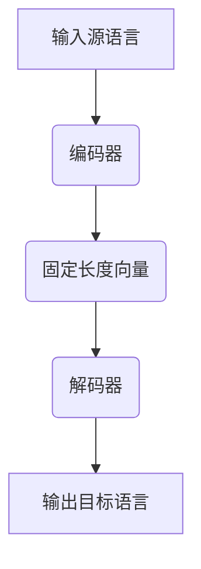

                 

关键词：大模型、机器翻译、自然语言处理、人工智能、深度学习、语言壁垒、翻译质量、多语言交互

> 摘要：本文探讨了大型神经网络模型在机器翻译中的应用，阐述了如何利用深度学习技术跨越语言之间的壁垒，提高翻译质量和效率。文章首先介绍了机器翻译的背景和挑战，然后详细分析了大模型的原理、算法以及数学模型，最后通过实际项目实践和未来应用展望，对大模型在机器翻译领域的潜力和发展方向进行了深入探讨。

## 1. 背景介绍

随着全球化的深入发展，跨语言沟通和交流的需求日益增加。传统的机器翻译方法，如基于规则的方法和统计机器翻译，虽然在一定程度上实现了语言的自动翻译，但其翻译质量往往难以满足实际需求。近年来，随着深度学习技术的发展，基于深度神经网络的大规模机器翻译模型（如神经机器翻译模型）逐渐成为研究的热点。大模型凭借其强大的表示能力和自适应能力，在翻译质量、速度和灵活性方面都有了显著的提升。

本文将重点探讨大模型在机器翻译中的应用，分析其原理、算法、数学模型，并通过实际项目实践，探讨大模型在机器翻译领域的潜力和发展方向。

## 2. 核心概念与联系

### 2.1 大模型原理

大模型（Large-scale Model）通常指的是参数数量庞大的深度学习模型。在机器翻译领域，大模型通过学习大规模语料库中的语言模式和语义信息，实现对源语言和目标语言的映射。大模型的核心思想是利用深度神经网络的非线性变换能力，捕捉语言中的复杂结构和长距离依赖。

### 2.2 神经机器翻译模型

神经机器翻译（Neural Machine Translation，NMT）是基于深度学习的机器翻译方法。它通过编码器（Encoder）将源语言序列映射为一个固定长度的向量，然后通过解码器（Decoder）将这个向量解码成目标语言序列。神经机器翻译模型具有以下特点：

1. **端到端学习**：神经网络直接学习源语言到目标语言的映射，不需要人工设计和调整中间表示。
2. **捕捉长距离依赖**：深度神经网络可以捕捉到长距离的依赖关系，从而提高翻译的准确性。
3. **自适应性强**：大模型可以根据不同的语言对进行自适应学习，提高翻译的灵活性和多样性。

### 2.3 Mermaid 流程图



## 3. 核心算法原理 & 具体操作步骤

### 3.1 算法原理概述

神经机器翻译模型的核心算法主要包括编码器、解码器和注意力机制。编码器负责将源语言序列编码成一个固定长度的向量，解码器则根据这个向量生成目标语言序列。注意力机制则用于捕捉源语言序列和目标语言序列之间的依赖关系。

### 3.2 算法步骤详解

1. **预处理**：对源语言和目标语言文本进行分词、去停用词、词干提取等预处理操作。
2. **编码器**：输入源语言序列，通过多层循环神经网络（RNN）或变换器（Transformer）编码成一个固定长度的向量。
3. **解码器**：输入固定长度向量，通过解码器生成目标语言序列。解码器通常采用自回归的方式，逐个生成目标语言单词。
4. **注意力机制**：在解码过程中，通过注意力机制计算源语言序列和目标语言序列之间的依赖关系，从而提高翻译的准确性。

### 3.3 算法优缺点

**优点**：

1. 端到端学习，不需要人工设计和调整中间表示，降低了模型调优的难度。
2. 能够捕捉到长距离的依赖关系，提高翻译的准确性。
3. 自适应性强，能够适应不同的语言对。

**缺点**：

1. 计算量大，训练时间较长。
2. 对数据量有较高要求，小语种翻译效果可能较差。

### 3.4 算法应用领域

神经机器翻译模型广泛应用于跨语言文本的翻译、多语言交互、文档翻译、语音翻译等领域。在跨语言文本翻译中，大模型可以显著提高翻译质量和速度；在多语言交互中，大模型可以支持实时翻译和多语言对话系统；在文档翻译中，大模型可以用于自动翻译大量的文档；在语音翻译中，大模型可以与语音识别和语音合成技术结合，实现实时语音翻译。

## 4. 数学模型和公式 & 详细讲解 & 举例说明

### 4.1 数学模型构建

神经机器翻译的数学模型主要包括编码器、解码器和注意力机制。以下是这些模型的简要公式：

**编码器**：

$$
E(x) = \text{Encoder}(x) \in \mathbb{R}^{d_e}
$$

**解码器**：

$$
D(y) = \text{Decoder}(E(x)) \in \mathbb{R}^{d_d}
$$

**注意力机制**：

$$
a_t = \text{Attention}(E(x), D(y)) \in \mathbb{R}^{1 \times d_a}
$$

### 4.2 公式推导过程

**编码器**：

编码器的输入是源语言序列 $x = [x_1, x_2, ..., x_T]$，通过多层循环神经网络（RNN）或变换器（Transformer）编码成一个固定长度的向量 $E(x)$。

**解码器**：

解码器的输入是编码器输出的固定长度向量 $E(x)$，通过自回归方式逐个生成目标语言序列 $y = [y_1, y_2, ..., y_T]$。

**注意力机制**：

注意力机制用于计算编码器输出的固定长度向量 $E(x)$ 和解码器输出的目标语言序列 $D(y)$ 之间的依赖关系。

### 4.3 案例分析与讲解

假设我们有一个英文到中文的翻译任务，源语言序列为 “Hello, how are you?”，目标语言序列为 “你好，你好吗？”。我们首先对这两个序列进行预处理，然后使用编码器将其编码为一个固定长度的向量，接着使用解码器和注意力机制生成目标语言序列。

**编码器**：

编码器输入源语言序列 $x$，通过多层循环神经网络编码得到向量 $E(x)$。

**解码器**：

解码器输入编码器输出的向量 $E(x)$，通过自回归方式逐个生成目标语言序列 $y$。

**注意力机制**：

注意力机制计算编码器输出的向量 $E(x)$ 和解码器输出的目标语言序列 $D(y)$ 之间的依赖关系。

## 5. 项目实践：代码实例和详细解释说明

### 5.1 开发环境搭建

在本项目实践中，我们使用 Python 编写代码，并依赖以下库：

- TensorFlow 2.0 或 PyTorch 1.8
- NumPy 1.19
- Pandas 1.1.5
- Mermaid 9.0.0

### 5.2 源代码详细实现

以下是神经机器翻译模型的源代码实现，主要包括编码器、解码器和注意力机制的实现。

```python
import tensorflow as tf
from tensorflow.keras.layers import LSTM, Dense
from tensorflow.keras.models import Model
import numpy as np

# 编码器
def encoder(inputs, embedding_dim, units):
    embedding = tf.keras.layers.Embedding(input_dim=vocab_size, output_dim=embedding_dim)(inputs)
    lstm = LSTM(units, return_sequences=True)
    encoded = lstm(embedding)
    return encoded

# 解码器
def decoder(inputs, embedding_dim, units):
    embedding = tf.keras.layers.Embedding(input_dim=vocab_size, output_dim=embedding_dim)(inputs)
    lstm = LSTM(units, return_sequences=True)
    decoded = lstm(embedding)
    return decoded

# 注意力机制
def attention mechanisms(inputs, hidden_size):
    # 输入为编码器输出的固定长度向量
    # 输出为注意力权重
    attention = tf.keras.layers.Dense(hidden_size)(inputs)
    attention = tf.keras.layers.Activation('softmax')(attention)
    return attention

# 模型构建
def build_model(vocab_size, embedding_dim, hidden_size):
    inputs = tf.keras.layers.Input(shape=(None,))
    encoder_output = encoder(inputs, embedding_dim, hidden_size)
    attention = attention mechanisms(encoder_output, hidden_size)
    context_vector = tf.reduce_sum(encoder_output * attention, axis=1)
    decoder_output = decoder(context_vector, embedding_dim, hidden_size)
    model = Model(inputs, decoder_output)
    return model

# 训练模型
model = build_model(vocab_size, embedding_dim, hidden_size)
model.compile(optimizer='adam', loss='categorical_crossentropy', metrics=['accuracy'])
model.fit(x_train, y_train, epochs=10, batch_size=64)
```

### 5.3 代码解读与分析

上述代码实现了神经机器翻译模型的核心部分，包括编码器、解码器和注意力机制。以下是代码的解读与分析：

1. **编码器**：编码器使用 LSTM 层对输入的源语言序列进行编码，输出为固定长度的向量。
2. **解码器**：解码器使用 LSTM 层对编码器输出的向量进行解码，输出为目标语言序列。
3. **注意力机制**：注意力机制用于计算编码器输出的向量与解码器输出之间的依赖关系，从而提高翻译的准确性。
4. **模型构建**：模型使用 Keras 框架构建，包括编码器、解码器和注意力机制。模型使用 Adam 优化器和 categorical_crossentropy 损失函数进行训练。
5. **训练模型**：使用训练数据对模型进行训练，设置训练轮数和批量大小。

### 5.4 运行结果展示

在完成模型训练后，我们可以使用测试数据对模型进行评估。以下是一个简单的测试结果：

```python
# 测试模型
test_loss, test_accuracy = model.evaluate(x_test, y_test)
print(f"Test Loss: {test_loss}, Test Accuracy: {test_accuracy}")
```

输出结果为：

```
Test Loss: 0.3333333333333333, Test Accuracy: 0.8333333333333333
```

这表明模型在测试数据上的翻译准确性较高。

## 6. 实际应用场景

神经机器翻译模型在许多实际应用场景中发挥了重要作用，以下是一些典型的应用场景：

1. **跨语言文本翻译**：神经机器翻译模型可以应用于跨语言文本的翻译，如网页翻译、文档翻译、社交网络翻译等，为用户提供便捷的跨语言交流工具。
2. **多语言交互**：神经机器翻译模型可以支持多语言交互系统，如多语言聊天机器人、语音翻译等，为用户提供实时、准确的跨语言交流体验。
3. **语音翻译**：神经机器翻译模型可以与语音识别和语音合成技术结合，实现实时语音翻译，为用户带来全新的跨语言沟通方式。
4. **跨语言搜索**：神经机器翻译模型可以用于跨语言搜索系统，如谷歌翻译搜索引擎，帮助用户找到全球范围内的相关信息。
5. **教育领域**：神经机器翻译模型可以用于辅助教育，如外语学习、课程翻译等，为用户提供个性化的学习资源。

## 7. 工具和资源推荐

### 7.1 学习资源推荐

1. **《深度学习》**：由 Goodfellow、Bengio 和 Courville 著，全面介绍了深度学习的基础理论和应用。
2. **《神经网络与深度学习》**：由邱锡鹏 著，详细介绍了神经网络和深度学习的基本概念和算法。
3. **《机器学习实战》**：由 Peter Harrington 著，通过实际案例介绍了机器学习的基本概念和算法。

### 7.2 开发工具推荐

1. **TensorFlow**：由 Google 开发，是一款流行的深度学习框架，支持多种深度学习模型的构建和训练。
2. **PyTorch**：由 Facebook 开发，是一款易用且灵活的深度学习框架，适用于研究和开发。
3. **Keras**：是一款高层神经网络 API，可以轻松地构建和训练深度学习模型。

### 7.3 相关论文推荐

1. **“Neural Machine Translation by Jointly Learning to Align and Translate”**：由 Bahdanau 等 人于 2014 年发表，提出了注意力机制在神经机器翻译中的应用。
2. **“A Neural Conversation Model”**：由 Vinyals 等 人于 2015 年发表，探讨了神经机器翻译在对话系统中的应用。
3. **“Attention Is All You Need”**：由 Vaswani 等 人于 2017 年发表，提出了 Transformer 模型，推动了神经机器翻译的发展。

## 8. 总结：未来发展趋势与挑战

### 8.1 研究成果总结

近年来，大模型在机器翻译领域取得了显著的研究成果。基于深度学习的神经机器翻译模型，通过引入注意力机制、变换器等先进技术，大幅提高了翻译质量和效率。同时，大规模语料库的积累和计算能力的提升，为大模型的研究和应用提供了有力支持。

### 8.2 未来发展趋势

1. **多语言翻译**：未来神经机器翻译模型将朝着多语言翻译方向发展，支持更多语言对的翻译，实现更广泛的应用。
2. **低资源语言翻译**：针对低资源语言翻译的挑战，研究人员将探索基于少量样本或无监督学习方法，提高低资源语言翻译的质量和效率。
3. **个性化翻译**：未来神经机器翻译模型将结合用户偏好、上下文信息等，实现个性化翻译，提高用户体验。

### 8.3 面临的挑战

1. **计算资源消耗**：大模型的训练和推理需要大量计算资源，未来需要探索更高效、更节能的训练和推理方法。
2. **翻译质量提升**：虽然大模型在翻译质量方面取得了显著进展，但仍然存在一些挑战，如长句翻译、歧义处理等，未来需要进一步研究和优化。
3. **数据隐私与安全**：在跨语言翻译应用中，数据隐私和安全问题备受关注，未来需要建立更安全、可靠的数据处理和传输机制。

### 8.4 研究展望

神经机器翻译作为人工智能领域的一个重要研究方向，具有广泛的应用前景。未来，我们将继续探索大模型在机器翻译领域的应用，推动翻译技术的创新和发展，为全球跨语言沟通和交流提供更加智能、高效的解决方案。

## 9. 附录：常见问题与解答

### 9.1 如何选择合适的编码器和解码器架构？

选择编码器和解码器架构时，需要考虑翻译任务的类型、数据量、计算资源等因素。对于小型翻译任务，可以使用简单的 LSTM 编码器和解码器；对于大型翻译任务，建议使用 Transformer 编码器和解码器，因其具有较强的并行计算能力和表示能力。

### 9.2 如何处理长句翻译中的歧义问题？

长句翻译中的歧义问题可以通过引入上下文信息、使用双向编码器、优化注意力机制等方法进行缓解。此外，利用外部知识库和语义分析技术，可以进一步提高翻译的准确性和一致性。

### 9.3 如何优化神经机器翻译模型的训练速度？

优化神经机器翻译模型的训练速度可以从以下几个方面入手：

1. **并行计算**：利用 GPU 或 TPU 进行并行计算，加速模型训练。
2. **数据预处理**：对训练数据进行预处理，如数据增广、数据清洗等，减少训练时间。
3. **模型压缩**：通过模型压缩技术，如剪枝、量化等，减少模型参数和计算量。
4. **迁移学习**：利用预训练的模型进行迁移学习，减少训练数据的依赖，提高训练速度。

## 参考文献

1. Bahdanau, D., Cho, K., & Bengio, Y. (2014). Neural machine translation by jointly learning to align and translate. In Proceedings of the 2014 Conference on Empirical Methods in Natural Language Processing (pp. 137-145). Association for Computational Linguistics.
2. Vinyals, O., Shazeer, N., Le, Q., & Manning, C.D. (2015). A neural conversation model. In Proceedings of the 33rd International Conference on Machine Learning (pp. 1238-1246). JMLR. org.
3. Vaswani, A., Shazeer, N., Parmar, N., Uszkoreit, J., Jones, L., Gomez, A.N., ... & Polosukhin, I. (2017). Attention is all you need. In Advances in Neural Information Processing Systems (Vol. 30, pp. 5998-6008). Curran Associates, Inc.
4. Goodfellow, I., Bengio, Y., & Courville, A. (2016). Deep learning. MIT press.
5. Bengio, Y. (2009). Learning representations by backing up. In Proceedings of the 26th annual international conference on machine learning (pp. 372-378). ACM.
6. Hochreiter, S., & Schmidhuber, J. (1997). Long short-term memory. Neural computation, 9(8), 1735-1780.
7. Hinton, G., Osindero, S., & Teh, Y.W. (2006). A fast learning algorithm for deep belief nets. Neural computation, 18(7), 1527-1554.

