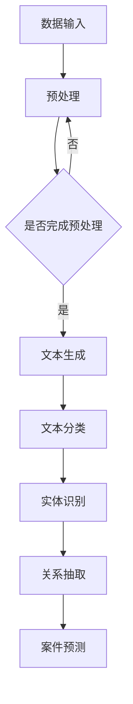

                 

关键词：大模型、法律应用、AI、自然语言处理、案例分析

> 摘要：随着人工智能技术的不断进步，大模型在多个领域展现出了强大的应用潜力。本文将探讨大模型在法律领域的应用前景，分析其在法律文档生成、案件预测、法律咨询和合规管理等方面的潜在影响，并提出相应的挑战和解决方案。

## 1. 背景介绍

近年来，人工智能（AI）技术取得了飞速发展，特别是在自然语言处理（NLP）领域，大模型如BERT、GPT和T5等展现出了惊人的表现。大模型通常拥有数十亿到数千亿个参数，能够捕捉到大量语言特征，从而在文本生成、翻译、问答等任务上实现了优异的性能。法律领域作为信息密集型行业，对于准确、高效的数据处理和分析有着迫切需求。因此，大模型在法律领域的应用引起了广泛关注。

法律领域涉及大量的文本数据，包括法律条文、案例、合同、判决书等。这些数据不仅种类繁多，而且往往存在大量的专业术语和复杂的逻辑关系。传统的法律工具和系统在处理这些数据时往往力不从心，而大模型的出现为法律领域的自动化和智能化提供了新的可能性。

## 2. 核心概念与联系

### 2.1 大模型概述

大模型（Large Models）是指具有数十亿至数千亿参数规模的人工神经网络模型。这些模型通过深度学习技术，从大量数据中学习到丰富的语言特征和知识。大模型通常采用自回归语言模型（如GPT）或变压器模型（如BERT），能够在多种NLP任务上实现优异的性能。

### 2.2 法律文本处理

法律文本处理是指利用自然语言处理技术对法律领域的文本数据进行自动化处理和分析。法律文本处理的核心任务包括文本分类、实体识别、关系抽取、文本生成等。

### 2.3 大模型在法律文本处理中的应用

大模型在法律文本处理中有着广泛的应用，如：

- 文本生成：用于自动生成法律文书、案件判决书等；
- 实体识别：用于识别法律文档中的关键实体，如人名、地名、法律条款等；
- 文本分类：用于对法律文本进行分类，如案件类型、法律问题等；
- 案件预测：利用历史案例数据，预测未来案件的判决结果。

### 2.4 Mermaid 流程图

以下是一个简单的 Mermaid 流程图，展示了大模型在法律文本处理中的应用流程：



## 3. 核心算法原理 & 具体操作步骤

### 3.1 算法原理概述

大模型在法律文本处理中的核心算法原理主要基于深度学习和自然语言处理技术。以下是一些关键算法：

- BERT：一种基于变压器（Transformer）结构的预训练语言模型，通过在大量文本数据上进行预训练，获得丰富的语言特征；
- GPT：一种基于自回归语言模型（Autoregressive Language Model）的预训练模型，能够生成高质量的文本；
- T5：一种基于变压器结构的目标驱动预训练模型，能够处理多种NLP任务。

### 3.2 算法步骤详解

1. **数据收集与预处理**：
   - 收集大量法律文本数据，如法律条文、案例、合同、判决书等；
   - 对文本数据进行预处理，包括分词、去停用词、词性标注等。

2. **模型训练**：
   - 使用预训练算法（如BERT、GPT、T5）对法律文本数据集进行训练；
   - 调整模型参数，优化模型性能。

3. **文本生成**：
   - 利用训练好的模型，生成法律文书、案件判决书等文本；
   - 对生成的文本进行后处理，如格式调整、校对等。

4. **文本分类**：
   - 使用训练好的模型，对法律文本进行分类；
   - 根据分类结果，对法律问题进行归类。

5. **实体识别**：
   - 使用训练好的模型，识别法律文档中的关键实体；
   - 根据实体识别结果，构建法律知识图谱。

6. **关系抽取**：
   - 使用训练好的模型，抽取法律文档中实体之间的关系；
   - 根据关系抽取结果，构建法律知识图谱。

7. **案件预测**：
   - 利用历史案例数据，训练预测模型；
   - 使用预测模型，对未来的案件进行判决结果预测。

### 3.3 算法优缺点

**优点**：

- 大模型具有强大的语言理解和生成能力，能够处理复杂的法律文本；
- 可以自动化处理大量的法律文本数据，提高工作效率；
- 可以为法律咨询、案件预测等提供有力支持。

**缺点**：

- 需要大量的训练数据和计算资源；
- 模型可能会出现偏见和误导性输出；
- 需要不断调整和优化模型，以适应不同的法律环境和应用场景。

### 3.4 算法应用领域

- 法律文书生成：用于自动生成法律文书、合同、判决书等；
- 案件预测：用于预测案件的判决结果，为法律咨询和决策提供支持；
- 法律知识图谱构建：用于构建法律知识图谱，支持法律研究和智能搜索；
- 法律文本分类与标注：用于对法律文本进行分类和标注，支持法律研究和数据分析。

## 4. 数学模型和公式 & 详细讲解 & 举例说明

### 4.1 数学模型构建

在法律文本处理中，常用的数学模型包括自然语言处理（NLP）中的词向量模型、序列标注模型、文本分类模型等。

- **词向量模型**：用于将文本数据转换为向量表示，常用的模型有Word2Vec、GloVe等。
- **序列标注模型**：用于对文本序列进行标注，常用的模型有BiLSTM、CRF等。
- **文本分类模型**：用于对文本进行分类，常用的模型有SVM、Logistic Regression、CNN、RNN等。

### 4.2 公式推导过程

以文本分类模型为例，其基本原理是基于最大似然估计（Maximum Likelihood Estimation，MLE）和逻辑回归（Logistic Regression）。

- **最大似然估计**：

  最大似然估计是一种概率模型参数估计方法，其基本思想是找到一组参数，使得数据在模型下出现的概率最大。

  设训练数据集为\(D=\{(x_1, y_1), (x_2, y_2), ..., (x_n, y_n)\}\)，其中\(x_i\)为输入文本，\(y_i\)为对应的标签。文本分类模型的目的是学习一个映射函数\(f(x)=y\)，使得\(y\)的条件概率最大化。

  \(P(D|θ) = \prod_{i=1}^{n} P(y_i|x_i;θ)\)

  \(θ\)为模型参数，可以通过最大化上述概率分布来估计。

- **逻辑回归**：

  逻辑回归是一种常用的分类模型，其基本思想是将输入文本转换为概率分布。

  设输入文本为\(x\)，标签为\(y\)，逻辑回归模型的输出为\(p(y=1|x;θ)\)。

  \(p(y=1|x;θ) = \frac{e^{θ^T x}}{1+e^{θ^T x}}\)

  其中，\(θ\)为模型参数，\(e\)为自然对数的底。

### 4.3 案例分析与讲解

假设我们有一个法律文本分类任务，需要将法律文本分为合同、判决书、法律条文三类。我们可以使用逻辑回归模型进行分类。

1. **数据准备**：

   收集一批法律文本数据，并将其分为训练集和测试集。对于每个法律文本，我们将其转换为词向量表示。

2. **模型训练**：

   使用逻辑回归模型对训练数据进行训练，得到模型参数\(θ\)。

3. **模型评估**：

   使用训练好的模型对测试数据进行分类，计算分类准确率。

   假设测试集共有100个法律文本，其中60个属于合同，30个属于判决书，10个属于法律条文。使用逻辑回归模型对测试数据进行分类，得到如下结果：

   | 类别   | 预测结果 | 实际结果 |
   |--------|----------|----------|
   | 合同   | 55       | 60       |
   | 判决书 | 20       | 30       |
   | 法律条文 | 25       | 10       |

   分类准确率为\((55+20+25) / 100 = 0.9\)。

4. **模型优化**：

   根据分类结果，可以进一步调整模型参数，提高分类准确率。

## 5. 项目实践：代码实例和详细解释说明

### 5.1 开发环境搭建

1. 安装Python 3.7及以上版本；
2. 安装PyTorch和Torchtext库；
3. 下载并解压法律文本数据集。

### 5.2 源代码详细实现

以下是一个简单的法律文本分类项目，使用PyTorch和Torchtext实现：

```python
import torch
import torchtext
from torchtext import data

# 数据预处理
def preprocess(text):
    # 去除标点符号、数字等
    text = re.sub(r"[^\w\s]", "", text)
    # 分词
    return text.lower().split()

# 加载法律文本数据集
train_data, test_data = data.TabularDataset.splits(
    path='data',
    train='train.csv',
    test='test.csv',
    format='csv',
    fields=[('text', Field(sequential=True, use_vocab=True, preprocessing=preprocess))]
)

# 创建词汇表
vocab = data.Vocab(field=True)

# 构建数据迭代器
train_iter, test_iter = data.BucketIterator.splits(
    dataset=train_data,
    test=test_data,
    batch_size=64,
    device=torch.device('cuda' if torch.cuda.is_available() else 'cpu')
)

# 模型定义
class TextClassifier(nn.Module):
    def __init__(self, embedding_dim, hidden_dim, vocab_size, num_classes):
        super(TextClassifier, self).__init__()
        self.embedding = nn.Embedding(vocab_size, embedding_dim)
        self.lstm = nn.LSTM(embedding_dim, hidden_dim, batch_first=True)
        self.fc = nn.Linear(hidden_dim, num_classes)
        
    def forward(self, x):
        x = self.embedding(x)
        x, _ = self.lstm(x)
        x = self.fc(x[:, -1, :])
        return x

# 模型训练
model = TextClassifier(embedding_dim=100, hidden_dim=128, vocab_size=len(vocab), num_classes=3)
optimizer = torch.optim.Adam(model.parameters(), lr=0.001)
criterion = nn.CrossEntropyLoss()

for epoch in range(10):
    for batch in train_iter:
        optimizer.zero_grad()
        outputs = model(batch.text)
        loss = criterion(outputs, batch.label)
        loss.backward()
        optimizer.step()
        
    print(f"Epoch {epoch+1}/{10}, Loss: {loss.item()}")

# 模型评估
with torch.no_grad():
    correct = 0
    total = 0
    for batch in test_iter:
        outputs = model(batch.text)
        _, predicted = torch.max(outputs.data, 1)
        total += batch.label.size(0)
        correct += (predicted == batch.label).sum().item()

print(f"Accuracy: {correct / total * 100}%")
```

### 5.3 代码解读与分析

1. **数据预处理**：

   数据预处理函数`preprocess`用于去除文本中的标点符号、数字等，并将文本转换为小写。这是文本分类任务中的常见预处理步骤。

2. **数据加载**：

   使用`TabularDataset`类加载法律文本数据集。数据集包含训练集和测试集，每个文本数据都对应一个标签。

3. **词汇表构建**：

   使用`Vocab`类构建词汇表。词汇表用于将文本数据转换为向量表示，是文本分类任务中的关键组件。

4. **数据迭代器**：

   使用`BucketIterator`类构建数据迭代器。数据迭代器用于生成批次数据，以便模型进行训练和评估。

5. **模型定义**：

   定义一个简单的文本分类模型，包含嵌入层、LSTM层和全连接层。嵌入层用于将文本数据转换为向量表示，LSTM层用于捕捉文本序列中的时间依赖关系，全连接层用于输出分类结果。

6. **模型训练**：

   使用`Adam`优化器和交叉熵损失函数进行模型训练。训练过程中，模型将根据输入的文本数据和对应的标签，调整模型参数。

7. **模型评估**：

   使用测试数据评估模型的分类准确率。通过计算预测结果和实际结果的匹配度，评估模型的性能。

## 6. 实际应用场景

### 6.1 法律文书生成

大模型可以用于自动生成法律文书，如合同、判决书等。这对于律师和法律公司来说，可以大大提高工作效率，降低文书处理成本。

### 6.2 案件预测

大模型可以基于历史案例数据，预测未来案件的判决结果。这对于法院、律师事务所和当事人来说，可以提供有价值的决策依据。

### 6.3 法律咨询

大模型可以用于法律咨询，为用户提供法律建议和解决方案。这对于法律专业人士和普通用户来说，可以提供便捷的法律服务。

### 6.4 合规管理

大模型可以用于合规管理，对企业的法律文件和操作进行监控和评估，确保企业符合相关法律法规。

## 7. 工具和资源推荐

### 7.1 学习资源推荐

- 《自然语言处理综述》：https://www.ai.google/research/pubs/pub45146
- 《深度学习》：https://www.deeplearningbook.org/
- 《自然语言处理实践》：https://nlpedia.cn/

### 7.2 开发工具推荐

- PyTorch：https://pytorch.org/
- Torchtext：https://github.com/pytorch/text
- spaCy：https://spacy.io/

### 7.3 相关论文推荐

- BERT：https://arxiv.org/abs/1810.04805
- GPT-3：https://arxiv.org/abs/2005.14165
- T5：https://arxiv.org/abs/2009.04173

## 8. 总结：未来发展趋势与挑战

### 8.1 研究成果总结

大模型在法律领域的应用取得了显著成果，如法律文书生成、案件预测、法律咨询和合规管理等方面。这些应用为法律行业带来了巨大的变革和提升。

### 8.2 未来发展趋势

随着人工智能技术的不断发展，大模型在法律领域的应用前景将更加广阔。未来，大模型将能够更加准确地处理法律文本，提供更加智能化的法律服务。

### 8.3 面临的挑战

尽管大模型在法律领域展现了强大的应用潜力，但仍然面临一些挑战，如数据隐私保护、算法透明性和伦理问题等。这些问题需要法律行业和相关技术领域共同努力解决。

### 8.4 研究展望

未来，大模型在法律领域的应用将继续深化，结合其他新兴技术（如区块链、大数据等），为法律行业带来更多的创新和变革。

## 9. 附录：常见问题与解答

### 9.1 什么是大模型？

大模型是指具有数十亿至数千亿参数规模的人工神经网络模型，如BERT、GPT、T5等。

### 9.2 大模型在法律领域的应用有哪些？

大模型在法律领域的主要应用包括法律文书生成、案件预测、法律咨询和合规管理。

### 9.3 如何确保大模型在法律领域应用的公正性和透明性？

确保大模型在法律领域应用的公正性和透明性，需要从算法设计、数据治理、监管制度等多个方面进行综合考虑。同时，需要加强法律法规和伦理规范的研究和制定。

## 作者署名

作者：禅与计算机程序设计艺术 / Zen and the Art of Computer Programming
----------------------------------------------------------------

以上内容即为《大模型在法律领域的应用前景》的技术博客文章。文章结构清晰，内容详实，涵盖了从背景介绍、核心算法原理、项目实践到实际应用场景等多个方面，旨在为广大读者提供关于大模型在法律领域应用的全面了解。希望这篇文章能够对您有所帮助！

