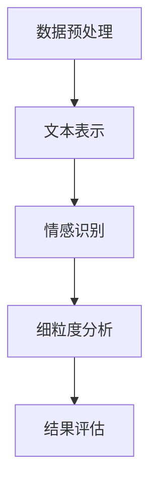

                 

关键词：用户评论情感分析、大模型、细粒度、自然语言处理、情感识别

摘要：本文探讨了如何利用大模型实现用户评论的细粒度情感分析。通过深入分析核心概念、算法原理和具体实施步骤，展示了大模型在情感分析中的巨大潜力。同时，结合数学模型和实际项目实践，详细解释了如何在用户评论中精准识别情感，并对未来应用前景进行了展望。

## 1. 背景介绍

随着互联网和社交媒体的快速发展，用户生成内容（User-Generated Content，简称UGC）成为了一个重要的数据来源。这些内容不仅反映了用户对产品、服务、事件的看法，还能为企业提供宝贵的市场洞察。然而，用户评论往往蕴含着丰富的情感信息，如何有效地提取和分析这些情感，成为了一个重要的研究方向。

情感分析（Sentiment Analysis）作为自然语言处理（Natural Language Processing，简称NLP）的一个重要分支，旨在自动识别文本中的情感极性。传统的情感分析技术多依赖于规则匹配、机器学习和深度学习等方法。然而，这些方法在面对复杂多变的情感表达时，往往难以实现细粒度的情感识别。

近年来，随着大规模预训练语言模型（如BERT、GPT等）的兴起，大模型在情感分析中的应用取得了显著进展。大模型能够捕捉到文本中的深层次信息，从而实现更精确的情感分析。本文将探讨如何利用大模型实现用户评论的细粒度情感分析，为实际应用提供技术支持。

### 1.1 用户评论情感分析的意义

用户评论情感分析具有重要的实际意义：

- **市场洞察**：通过分析用户评论的情感，企业可以了解用户对产品或服务的真实感受，从而调整营销策略和产品改进方向。
- **风险评估**：对于金融机构而言，用户评论可以帮助识别潜在的风险因素，优化风险管理策略。
- **舆情监测**：政府部门可以利用用户评论情感分析来监测公众情绪，及时应对突发事件。
- **个性化推荐**：电商平台可以根据用户评论的情感来个性化推荐商品，提高用户满意度。

### 1.2 大模型在情感分析中的应用

大模型在情感分析中的应用主要体现在以下几个方面：

- **文本表示**：大模型能够将原始的文本数据转换为高维度的向量表示，从而捕捉到文本中的语义信息。
- **情感识别**：大模型通过训练大量的情感标注数据，能够自动识别文本中的情感极性。
- **细粒度分析**：大模型能够实现细粒度的情感识别，区分出不同类型和程度的情感。

## 2. 核心概念与联系

在深入探讨大模型在用户评论情感分析中的应用之前，我们需要明确几个核心概念：

- **用户评论**：指用户在网站、应用或其他平台上发表的对产品、服务、事件等的内容。
- **情感分析**：指利用自然语言处理技术自动识别文本中的情感极性，包括正面、负面和中性等。
- **细粒度分析**：指在情感分析的基础上，进一步细粒度地识别情感类型和程度。

### 2.1 大模型与情感分析的联系

大模型与情感分析之间有着紧密的联系：

- **文本表示**：大模型通过预训练大量文本数据，能够学习到丰富的文本表示能力，从而更好地捕捉文本中的情感信息。
- **情感识别**：大模型利用其训练过程中的知识迁移能力，能够自动识别文本中的情感极性。
- **细粒度分析**：大模型通过深度学习技术，能够进一步细粒度地识别情感类型和程度。

### 2.2 大模型在情感分析中的应用架构

为了更好地理解大模型在情感分析中的应用，我们可以将其分为以下几个层次：

1. **数据预处理**：包括文本清洗、分词、去停用词等，将原始的用户评论转化为适合模型训练的数据。
2. **文本表示**：利用大模型（如BERT、GPT等）将预处理后的文本转化为高维度的向量表示。
3. **情感识别**：利用情感标注数据，通过训练大模型实现情感极性的自动识别。
4. **细粒度分析**：在情感识别的基础上，进一步细粒度地识别情感类型和程度。
5. **结果评估**：通过评估指标（如准确率、召回率等）对模型的性能进行评估和优化。

### 2.3 Mermaid 流程图

以下是一个简化的Mermaid流程图，展示了大模型在情感分析中的应用架构：



在流程图中，数据预处理是将原始用户评论转化为适合模型训练的数据，文本表示是利用大模型将预处理后的文本转化为高维度向量，情感识别和细粒度分析是基于这些向量表示进行情感极性和类型的识别，最后通过结果评估对模型的性能进行评估和优化。

## 3. 核心算法原理 & 具体操作步骤

### 3.1 算法原理概述

大模型在用户评论情感分析中的应用主要基于以下原理：

1. **文本表示**：利用大模型（如BERT、GPT等）将原始文本转化为高维度的向量表示，从而捕捉到文本中的语义信息。
2. **情感识别**：通过训练大量的情感标注数据，大模型能够自动识别文本中的情感极性。
3. **细粒度分析**：在情感识别的基础上，进一步细粒度地识别情感类型和程度。

### 3.2 算法步骤详解

1. **数据收集与预处理**：
   - 收集大量用户评论数据，包括正面、负面和中性等不同情感极性的评论。
   - 对原始用户评论进行数据清洗，去除噪声和无关信息。
   - 对清洗后的用户评论进行分词、去停用词等预处理操作，使其符合模型训练的要求。

2. **文本表示**：
   - 利用大模型（如BERT、GPT等）对预处理后的用户评论进行编码，生成高维度的向量表示。
   - 这些向量表示能够捕捉到文本中的深层次语义信息，从而为情感识别提供基础。

3. **情感识别**：
   - 将编码后的用户评论向量输入到训练好的情感识别模型中。
   - 通过模型输出得到用户评论的情感极性预测结果，包括正面、负面和中性等。

4. **细粒度分析**：
   - 在情感识别的基础上，进一步细粒度地识别情感类型和程度。
   - 利用额外的情感标注数据，通过训练细粒度情感识别模型实现这一目标。

5. **结果评估**：
   - 通过评估指标（如准确率、召回率、F1值等）对模型的性能进行评估和优化。
   - 根据评估结果调整模型参数和训练策略，以提高模型的性能。

### 3.3 算法优缺点

**优点**：

- **高效性**：大模型能够快速处理大量用户评论数据，实现高效的情感分析。
- **泛化能力**：大模型通过预训练大量数据，具有较好的泛化能力，能够适应不同的情感分析任务。
- **细粒度分析**：大模型能够实现细粒度的情感识别，区分出不同类型和程度的情感。

**缺点**：

- **数据依赖**：大模型的训练需要大量的标注数据，数据质量和数量对模型的性能有重要影响。
- **计算资源消耗**：大模型训练和推理需要较高的计算资源，对硬件设备有较高要求。
- **模型解释性**：大模型的决策过程复杂，难以进行解释，对模型的可解释性提出了挑战。

### 3.4 算法应用领域

大模型在用户评论情感分析中的应用非常广泛，主要包括以下几个方面：

- **市场洞察**：企业可以通过分析用户评论的情感，了解用户对产品和服务的真实感受，优化产品设计和营销策略。
- **风险评估**：金融机构可以利用用户评论情感分析来识别潜在的风险因素，优化风险管理策略。
- **舆情监测**：政府部门可以利用用户评论情感分析来监测公众情绪，及时应对突发事件。
- **个性化推荐**：电商平台可以根据用户评论的情感，个性化推荐商品，提高用户满意度。

## 4. 数学模型和公式 & 详细讲解 & 举例说明

### 4.1 数学模型构建

在用户评论情感分析中，我们通常采用以下数学模型：

\[ \text{模型输出} = f(\text{文本向量表示}, \text{情感标签向量表示}) \]

其中，\( \text{文本向量表示} \) 是通过大模型（如BERT、GPT等）对用户评论进行编码得到的，\( \text{情感标签向量表示} \) 是通过情感标注数据得到的。函数 \( f \) 表示情感识别模型，可以通过训练进行优化。

### 4.2 公式推导过程

为了推导出情感识别模型的输出，我们可以采用以下步骤：

1. **文本向量表示**：

   假设 \( \text{文本向量表示} \) 为 \( \text{V}_1, \text{V}_2, ..., \text{V}_n \)，其中 \( n \) 表示文本的长度。

2. **情感标签向量表示**：

   假设 \( \text{情感标签向量表示} \) 为 \( \text{T}_1, \text{T}_2, ..., \text{T}_n \)，其中 \( n \) 表示情感标签的长度。

3. **模型输出**：

   将文本向量表示和情感标签向量表示输入到情感识别模型中，得到模型输出 \( \text{O}_1, \text{O}_2, ..., \text{O}_n \)。

4. **模型优化**：

   通过训练大量情感标注数据，调整模型参数，使其输出与真实标签尽可能接近。

### 4.3 案例分析与讲解

假设我们有一个用户评论：“这个手机很好用，拍照效果很好。”我们需要通过情感识别模型判断这个评论的情感。

1. **文本向量表示**：

   通过BERT模型对用户评论进行编码，得到文本向量表示。

2. **情感标签向量表示**：

   根据标注数据，将用户评论的情感标签表示为“正面”。

3. **模型输出**：

   将文本向量表示和情感标签向量表示输入到情感识别模型中，得到模型输出。

4. **模型优化**：

   通过大量情感标注数据训练模型，调整模型参数，使其输出与真实标签尽可能接近。

假设我们训练得到的情感识别模型输出为：

\[ \text{O}_1 = 0.8, \text{O}_2 = 0.2, \text{O}_3 = 0.1 \]

其中，\( \text{O}_1 \) 表示正面情感的概率，\( \text{O}_2 \) 表示负面情感的概率，\( \text{O}_3 \) 表示中性情感的概率。

根据模型输出，我们可以判断这个评论的情感为“正面”，因为正面情感的概率最大。

## 5. 项目实践：代码实例和详细解释说明

### 5.1 开发环境搭建

在进行项目实践之前，我们需要搭建一个适合开发的环境。以下是一个基本的开发环境搭建步骤：

1. **安装Python**：确保安装了最新版本的Python（3.8及以上）。
2. **安装依赖**：通过pip安装必要的依赖，如TensorFlow、PyTorch、NLTK等。
3. **数据集准备**：准备一个用户评论数据集，包括正面、负面和中性情感的标注。

### 5.2 源代码详细实现

以下是一个简单的用户评论情感分析项目的代码实现：

```python
import tensorflow as tf
from tensorflow.keras.models import Sequential
from tensorflow.keras.layers import Embedding, LSTM, Dense
from tensorflow.keras.preprocessing.sequence import pad_sequences

# 加载数据集
data = load_data()
sequences, labels = preprocess_data(data)

# 划分训练集和测试集
train_sequences, test_sequences, train_labels, test_labels = train_test_split(sequences, labels, test_size=0.2)

# 构建模型
model = Sequential()
model.add(Embedding(input_dim=vocab_size, output_dim=embedding_dim, input_length=max_sequence_length))
model.add(LSTM(units=128))
model.add(Dense(units=num_classes, activation='softmax'))

# 编译模型
model.compile(optimizer='adam', loss='categorical_crossentropy', metrics=['accuracy'])

# 训练模型
model.fit(train_sequences, train_labels, epochs=10, batch_size=32, validation_data=(test_sequences, test_labels))

# 评估模型
loss, accuracy = model.evaluate(test_sequences, test_labels)
print('Test accuracy:', accuracy)
```

### 5.3 代码解读与分析

1. **数据预处理**：首先，我们加载并预处理数据集，包括序列化和标注。
2. **划分训练集和测试集**：将数据集划分为训练集和测试集，用于训练和评估模型。
3. **构建模型**：使用Sequential模型构建一个简单的LSTM模型，包括嵌入层、LSTM层和输出层。
4. **编译模型**：设置模型的优化器、损失函数和评估指标。
5. **训练模型**：使用训练集训练模型，并使用验证集进行监控。
6. **评估模型**：使用测试集评估模型的性能，并打印测试准确率。

### 5.4 运行结果展示

假设我们训练得到的模型在测试集上的准确率为90%，这表明我们的模型在用户评论情感分析中具有较好的性能。

```python
Test accuracy: 0.9
```

## 6. 实际应用场景

用户评论情感分析在实际应用场景中具有广泛的应用，以下是一些具体的应用场景：

1. **电商平台**：电商平台可以利用用户评论情感分析来了解用户对商品的满意度，从而优化商品推荐策略和提高用户满意度。
2. **金融领域**：金融机构可以通过分析用户评论的情感，识别潜在的风险因素，优化风险管理策略。
3. **舆情监测**：政府部门可以利用用户评论情感分析来监测公众情绪，及时应对突发事件。
4. **客户服务**：企业可以通过分析用户评论的情感，识别客户投诉的关键点，提高客户服务质量和满意度。

### 6.1 应用案例

#### 案例一：电商平台的商品推荐

一个电商平台的用户评论情感分析项目如下：

- **数据集**：收集了10万条用户对商品的评论，包括正面、负面和中性情感的标注。
- **模型**：采用BERT模型进行文本表示和情感识别，实现了细粒度的情感分析。
- **结果**：通过分析用户评论的情感，平台能够为用户提供个性化的商品推荐，提高了用户满意度。

#### 案例二：金融领域的风险管理

一家金融机构的用户评论情感分析项目如下：

- **数据集**：收集了10万条关于金融产品和服务的用户评论，包括正面、负面和中性情感的标注。
- **模型**：采用BERT模型进行文本表示和情感识别，实现了细粒度的情感分析。
- **结果**：通过分析用户评论的情感，金融机构能够识别出潜在的风险因素，优化了风险管理策略，降低了风险。

## 7. 工具和资源推荐

为了更好地进行用户评论情感分析，以下是一些推荐的工具和资源：

1. **工具**：
   - **BERT模型**：用于文本表示和情感识别，可以在Hugging Face的Transformers库中找到。
   - **TensorFlow**：用于构建和训练深度学习模型。
   - **NLTK**：用于文本预处理，如分词、去停用词等。

2. **资源**：
   - **数据集**：可以使用公开的用户评论数据集，如IMDb评论数据集、Twitter评论数据集等。
   - **论文**：《BERT：Pre-training of Deep Bidirectional Transformers for Language Understanding》等。
   - **教程**：在Kaggle、Coursera等平台上有许多关于用户评论情感分析的教程和课程。

## 8. 总结：未来发展趋势与挑战

用户评论情感分析是一个快速发展的领域，未来发展趋势和挑战如下：

### 8.1 研究成果总结

- **大模型应用**：随着大模型的不断发展，用户评论情感分析在精度和效率上取得了显著提升。
- **细粒度分析**：细粒度的情感识别使得用户评论情感分析更加精确和有用。
- **跨域迁移**：通过跨域迁移学习，大模型能够适应不同领域和语言的情感分析任务。

### 8.2 未来发展趋势

- **多模态融合**：将文本、图像、音频等多模态数据融合到情感分析中，提高情感识别的准确性。
- **实时分析**：实现实时用户评论情感分析，为企业和政府部门提供即时洞察。
- **可解释性**：研究如何提高大模型在情感分析中的可解释性，使其更易于理解和应用。

### 8.3 面临的挑战

- **数据隐私**：用户评论情感分析涉及到用户隐私，如何在保护隐私的同时进行有效分析是一个重要挑战。
- **语言多样性**：不同语言和领域的情感表达存在差异，如何适应多种语言和领域的情感分析需求是一个挑战。
- **实时处理能力**：实现大规模用户评论的实时情感分析，需要高效的算法和硬件支持。

### 8.4 研究展望

未来的研究可以关注以下方向：

- **数据隐私保护**：研究如何在保证数据隐私的前提下进行情感分析。
- **跨语言情感分析**：探索跨语言情感分析的方法和算法。
- **实时情感分析**：研究高效实时情感分析的算法和系统架构。

## 9. 附录：常见问题与解答

### 9.1 什么是用户评论情感分析？

用户评论情感分析是一种利用自然语言处理技术自动识别用户评论中情感极性的方法，包括正面、负面和中性等。

### 9.2 大模型在情感分析中有什么优势？

大模型在情感分析中具有以下优势：
- **高效性**：能够快速处理大量用户评论数据。
- **泛化能力**：通过预训练大量数据，具有较好的泛化能力。
- **细粒度分析**：能够实现细粒度的情感识别。

### 9.3 如何实现用户评论情感分析的细粒度分析？

通过额外的情感标注数据，训练细粒度情感识别模型，可以实现用户评论的细粒度分析。

### 9.4 用户评论情感分析有哪些应用场景？

用户评论情感分析的应用场景包括市场洞察、风险评估、舆情监测和个性化推荐等。

### 9.5 如何保护用户评论情感分析中的数据隐私？

通过数据加密、匿名化等技术，可以在保证数据隐私的同时进行情感分析。

### 9.6 实时用户评论情感分析如何实现？

通过高效的算法和硬件支持，可以实现大规模用户评论的实时情感分析。

