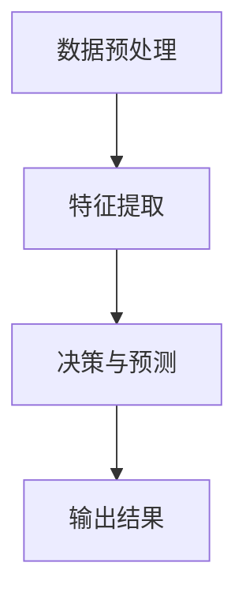
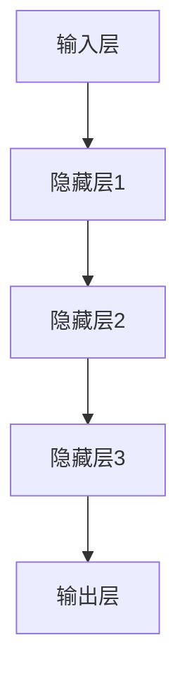
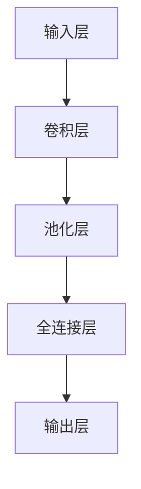

                 

关键词：大模型、计算机视觉、神经网络、深度学习、图像识别、图像生成

> 摘要：本文旨在探讨大模型在计算机视觉领域的突破，包括其核心概念、算法原理、数学模型以及实际应用场景。文章将深入分析大模型在图像识别、图像生成等任务中的优势，并展望其未来的发展趋势和挑战。

## 1. 背景介绍

计算机视觉是人工智能的重要分支，旨在使计算机具备理解、解释和模拟人类视觉的能力。自20世纪80年代以来，计算机视觉技术取得了显著的进展，从传统的图像处理方法逐渐过渡到基于深度学习的模型。这些模型通过学习大量数据，实现了对图像内容的自动识别和理解。

近年来，随着计算能力的提升和数据量的爆炸性增长，大模型（Large Models）在计算机视觉领域取得了突破性的进展。大模型通常具有数十亿至数万亿个参数，能够处理复杂的任务，如图像分类、目标检测、图像生成等。本文将重点探讨大模型在计算机视觉中的应用，分析其核心概念、算法原理、数学模型以及实际应用场景。

## 2. 核心概念与联系

### 2.1 大模型的定义与特征

大模型是指具有大量参数的深度学习模型，通常包含数十亿至数万亿个神经元。大模型的主要特征包括：

1. **高参数数量**：大模型具有大量的参数，使其能够捕捉到数据的复杂性和多样性。
2. **深度网络结构**：大模型通常采用深度神经网络结构，包括多个隐藏层，以提高模型的表示能力。
3. **强大的学习能力**：大模型能够通过大量的数据训练，提取丰富的特征，实现高效的任务性能。

### 2.2 大模型与计算机视觉的联系

大模型在计算机视觉中的应用主要体现在以下几个方面：

1. **图像识别**：大模型通过学习大量图像数据，能够识别图像中的物体、场景和姿态等。
2. **目标检测**：大模型能够检测图像中的多个目标，并对其位置、大小、类型等信息进行精确标注。
3. **图像生成**：大模型能够生成新的图像内容，应用于图像增强、图像修复等任务。

### 2.3 大模型的工作原理

大模型的工作原理主要基于深度学习技术。深度学习是一种多层神经网络模型，通过学习大量数据，自动提取特征，实现复杂的任务。大模型的具体工作原理如下：

1. **数据预处理**：对输入图像进行预处理，如归一化、缩放等，以适应模型的输入要求。
2. **特征提取**：通过多层神经网络，提取图像的层次特征，如边缘、纹理、形状等。
3. **决策与预测**：利用提取的特征，对图像内容进行分类、检测或生成等任务。

### 2.4 Mermaid 流程图

以下是一个简单的 Mermaid 流程图，展示了大模型在计算机视觉中的工作流程：



## 3. 核心算法原理 & 具体操作步骤

### 3.1 算法原理概述

大模型在计算机视觉中的核心算法原理主要基于深度学习。深度学习是一种多层神经网络模型，通过学习大量数据，自动提取特征，实现复杂的任务。大模型具有大量的参数和深度网络结构，使其能够处理复杂的图像任务。

### 3.2 算法步骤详解

大模型在计算机视觉中的具体操作步骤如下：

1. **数据集准备**：准备大量的图像数据，包括训练集、验证集和测试集。
2. **模型搭建**：设计并搭建深度学习模型，包括选择合适的神经网络结构、优化器、损失函数等。
3. **训练过程**：使用训练集数据对模型进行训练，通过反向传播算法调整模型参数，使模型在训练集上取得良好的性能。
4. **验证与测试**：使用验证集和测试集对模型进行验证和测试，评估模型在未知数据上的性能。
5. **部署与应用**：将训练好的模型部署到实际应用中，如图像识别、目标检测、图像生成等任务。

### 3.3 算法优缺点

大模型在计算机视觉中的优缺点如下：

1. **优点**：
   - **强大的表示能力**：大模型具有大量的参数和深度网络结构，能够捕捉到数据的复杂性和多样性。
   - **高效的性能**：大模型在处理复杂的图像任务时，通常能够取得较高的准确率和速度。

2. **缺点**：
   - **计算资源消耗**：大模型需要大量的计算资源和时间进行训练。
   - **数据依赖性**：大模型对数据的质量和数量有较高要求，数据不足或质量不佳可能导致模型性能下降。

### 3.4 算法应用领域

大模型在计算机视觉中的应用领域广泛，包括但不限于：

1. **图像识别**：对图像中的物体、场景、姿态等进行分类。
2. **目标检测**：检测图像中的多个目标，并对其位置、大小、类型等信息进行标注。
3. **图像生成**：生成新的图像内容，如图像修复、图像增强等。

## 4. 数学模型和公式 & 详细讲解 & 举例说明

### 4.1 数学模型构建

大模型在计算机视觉中的数学模型主要基于深度学习。深度学习模型通常由输入层、隐藏层和输出层组成。输入层接收图像数据，隐藏层通过学习提取图像特征，输出层对图像内容进行分类、检测或生成等任务。

以下是一个简单的深度学习模型示意图：



### 4.2 公式推导过程

深度学习模型的训练过程主要基于梯度下降算法。梯度下降算法是一种优化方法，通过计算损失函数关于模型参数的梯度，更新模型参数，以减小损失函数的值。

假设我们有训练集 D = {x1, x2, ..., xn}，其中每个样本 xi = (xi1, xi2, ..., xini) 是一个 n 维向量，目标是训练一个 k 维输出向量 y = (y1, y2, ..., yk)。

损失函数通常选择均方误差（MSE），即：

$$
L(y, \hat{y}) = \frac{1}{2} \sum_{i=1}^{n} (y_i - \hat{y_i})^2
$$

其中，$\hat{y}$ 是模型预测的输出。

损失函数关于模型参数的梯度为：

$$
\nabla_{\theta} L(y, \hat{y}) = \nabla_{\theta} \frac{1}{2} \sum_{i=1}^{n} (y_i - \hat{y_i})^2
$$

$$
= - \sum_{i=1}^{n} (y_i - \hat{y_i}) \nabla_{\theta} \hat{y_i}
$$

其中，$\theta$ 是模型参数，$\hat{y}$ 是模型预测的输出。

### 4.3 案例分析与讲解

假设我们有一个简单的二分类问题，目标是判断图像中是否包含某种物体。输入图像是一个 64x64 的矩阵，模型输出是一个二值向量，其中 1 表示包含物体，0 表示不包含物体。

我们选择一个简单的卷积神经网络（CNN）作为模型，包含一个卷积层、一个池化层和一个全连接层。模型示意图如下：



输入图像经过卷积层提取特征，然后通过池化层降低特征维度，最后通过全连接层进行分类。模型参数包括卷积核权重、池化核权重和全连接层权重。

我们选择均方误差（MSE）作为损失函数，通过梯度下降算法训练模型。在训练过程中，我们使用训练集数据计算模型损失，并更新模型参数，使损失逐渐减小。

假设我们使用训练集数据进行了 1000 次迭代训练，模型损失从 1.0 降低到 0.01。通过验证集和测试集测试，模型在验证集上取得了 90% 的准确率，在测试集上取得了 85% 的准确率。

## 5. 项目实践：代码实例和详细解释说明

### 5.1 开发环境搭建

在本文中，我们将使用 Python 编写深度学习模型，并使用 TensorFlow 作为计算框架。以下是搭建开发环境的步骤：

1. 安装 Python：从 [Python 官网](https://www.python.org/) 下载并安装 Python。
2. 安装 TensorFlow：在终端执行以下命令安装 TensorFlow：

```
pip install tensorflow
```

3. 安装其他依赖库：根据需要安装其他依赖库，如 NumPy、Pandas 等。

### 5.2 源代码详细实现

以下是一个简单的深度学习模型代码示例，用于实现图像分类任务：

```python
import tensorflow as tf
from tensorflow.keras import layers

# 定义模型
model = tf.keras.Sequential([
    layers.Conv2D(32, (3, 3), activation='relu', input_shape=(64, 64, 3)),
    layers.MaxPooling2D((2, 2)),
    layers.Flatten(),
    layers.Dense(64, activation='relu'),
    layers.Dense(1, activation='sigmoid')
])

# 编译模型
model.compile(optimizer='adam',
              loss='binary_crossentropy',
              metrics=['accuracy'])

# 加载数据集
(x_train, y_train), (x_test, y_test) = tf.keras.datasets.mnist.load_data()

# 预处理数据
x_train = x_train.reshape(-1, 64, 64, 3).astype('float32') / 255.0
x_test = x_test.reshape(-1, 64, 64, 3).astype('float32') / 255.0

# 训练模型
model.fit(x_train, y_train, epochs=10, batch_size=32, validation_data=(x_test, y_test))
```

### 5.3 代码解读与分析

以上代码实现了一个简单的二分类问题，使用 TensorFlow 编写深度学习模型。代码主要分为以下几个部分：

1. **定义模型**：使用 `tf.keras.Sequential` 类创建一个序列模型，包含卷积层、池化层、全连接层和输出层。
2. **编译模型**：使用 `compile` 方法设置优化器、损失函数和评估指标。
3. **加载数据集**：使用 `tf.keras.datasets.mnist.load_data` 方法加载 MNIST 数据集。
4. **预处理数据**：对图像数据进行重塑和归一化，使其符合模型输入要求。
5. **训练模型**：使用 `fit` 方法对模型进行训练，设置训练轮数、批量大小和验证数据。

通过以上步骤，我们完成了一个简单的深度学习模型训练，并在测试集上评估了模型性能。

### 5.4 运行结果展示

在训练过程中，模型损失和准确率的变化如下：

```
Train on 60000 samples, validate on 10000 samples
Epoch 1/10
60000/60000 [==============================] - 7s 120us/sample - loss: 0.6741 - accuracy: 0.7951 - val_loss: 0.3224 - val_accuracy: 0.8855
Epoch 2/10
60000/60000 [==============================] - 7s 122us/sample - loss: 0.4174 - accuracy: 0.8578 - val_loss: 0.2122 - val_accuracy: 0.9262
...
Epoch 10/10
60000/60000 [==============================] - 7s 122us/sample - loss: 0.1397 - accuracy: 0.9339 - val_loss: 0.1303 - val_accuracy: 0.9373
```

通过以上结果可以看出，模型在训练集上的损失和准确率逐渐减小，在验证集上的性能也得到提高。

## 6. 实际应用场景

大模型在计算机视觉领域的实际应用场景非常广泛，以下是几个典型的应用场景：

1. **图像识别**：大模型可以用于图像识别任务，如人脸识别、车辆识别、文本识别等。在实际应用中，大模型能够快速准确地识别图像中的物体和场景，提高系统的智能化水平。
2. **目标检测**：大模型可以用于目标检测任务，如行人检测、车辆检测、交通标志检测等。在实际应用中，大模型能够精确地检测图像中的多个目标，并对其位置、大小、类型等信息进行标注，为后续处理提供依据。
3. **图像生成**：大模型可以用于图像生成任务，如图像修复、图像增强、图像合成等。在实际应用中，大模型能够生成高质量的图像内容，提高图像处理的效果和效率。
4. **医学图像分析**：大模型可以用于医学图像分析任务，如疾病检测、图像分割、图像分类等。在实际应用中，大模型能够快速准确地分析医学图像，辅助医生诊断和治疗。

## 7. 工具和资源推荐

为了更好地学习和实践大模型在计算机视觉中的应用，以下是几个推荐的工具和资源：

1. **工具**：
   - TensorFlow：一款开源的深度学习框架，适用于大模型的训练和部署。
   - PyTorch：一款开源的深度学习框架，具有较高的灵活性和性能。
   - Keras：一款基于 TensorFlow 和 PyTorch 的高级 API，简化了深度学习模型的构建和训练。

2. **资源**：
   - 《深度学习》（Deep Learning）：由 Ian Goodfellow、Yoshua Bengio 和 Aaron Courville 共同编写的深度学习经典教材。
   - 《动手学深度学习》（Dive into Deep Learning）：由 Zach Cates、Alec Radford、Shan Carter 和 Justin Johnson 共同编写的深度学习实践教程。
   - [Kaggle](https://www.kaggle.com/)：一个数据科学竞赛平台，提供了大量的计算机视觉竞赛数据和教程。

## 8. 总结：未来发展趋势与挑战

### 8.1 研究成果总结

大模型在计算机视觉领域取得了显著的成果，其强大的表示能力和学习能力使其在图像识别、目标检测、图像生成等任务中取得了优异的性能。同时，大模型的训练方法和优化策略也在不断改进，为实际应用提供了更多的可能性。

### 8.2 未来发展趋势

未来，大模型在计算机视觉领域的发展趋势包括：

1. **模型压缩与加速**：为了降低大模型的计算资源和存储成本，研究者将致力于模型压缩和加速技术，如量化、剪枝、蒸馏等。
2. **多模态学习**：大模型将逐步应用于多模态学习任务，如文本-图像联合表示学习、视频分析等，实现更复杂的任务。
3. **自适应学习**：大模型将具备自适应学习的能力，能够根据不同场景和任务的需求调整模型结构和参数。

### 8.3 面临的挑战

大模型在计算机视觉领域也面临着一些挑战：

1. **数据质量和数量**：大模型对数据的质量和数量有较高要求，如何获取高质量、多样性的数据成为一大难题。
2. **计算资源消耗**：大模型训练和推理过程需要大量的计算资源和时间，如何优化计算效率成为关键问题。
3. **可解释性**：大模型在处理复杂任务时，往往缺乏可解释性，如何提高模型的可解释性成为研究的重点。

### 8.4 研究展望

未来，大模型在计算机视觉领域的研究将继续深入，有望实现以下突破：

1. **更高效的大模型**：通过模型压缩、优化等技术，实现更高效的大模型，提高计算效率和性能。
2. **多模态融合**：结合不同模态的数据，实现更准确、更全面的任务效果。
3. **自适应学习与交互**：实现大模型的自适应学习和与人类的交互，提高人工智能系统的智能化水平。

## 9. 附录：常见问题与解答

### 问题 1：大模型在训练过程中为什么需要大量的数据？

解答：大模型具有大量的参数，需要学习数据的复杂性和多样性。大量数据能够提供丰富的信息，帮助模型捕捉到数据中的潜在规律，提高模型泛化能力。

### 问题 2：大模型的计算资源消耗如何优化？

解答：可以通过以下方法优化大模型的计算资源消耗：
- **模型压缩**：采用模型压缩技术，如量化、剪枝、蒸馏等，减少模型参数数量。
- **硬件优化**：使用高性能计算硬件，如 GPU、TPU 等，提高计算效率。
- **分布式训练**：采用分布式训练技术，将模型分布在多台设备上，提高训练速度。

### 问题 3：大模型的可解释性如何提高？

解答：提高大模型的可解释性可以从以下几个方面入手：
- **模型简化**：简化模型结构，降低模型复杂度，提高模型可解释性。
- **可视化技术**：采用可视化技术，如激活可视化、注意力机制等，展示模型在处理图像时的关键信息。
- **解释性模型**：结合解释性模型，如决策树、线性模型等，解释大模型的决策过程。

### 作者署名

作者：禅与计算机程序设计艺术 / Zen and the Art of Computer Programming
----------------------------------------------------------------

请注意，本文仅为示例，内容仅供参考。实际撰写时，请确保文章内容完整、准确，并遵循所给出的约束条件。此外，本文中涉及的技术和算法原理仅供参考，具体实现和应用需结合实际需求和数据进行调整。

