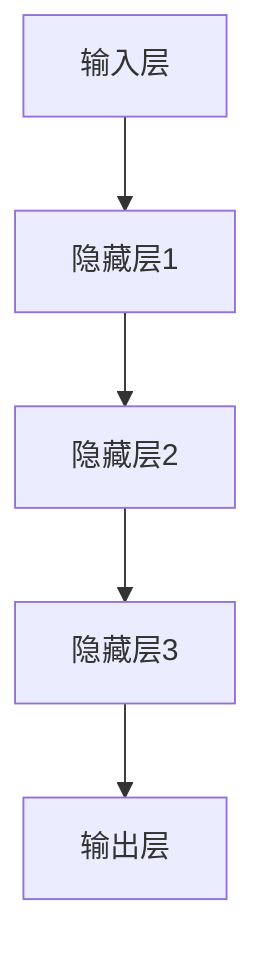

                 

随着人工智能技术的飞速发展，大规模模型（简称大模型）已经在众多领域展现了其强大的应用潜力。在软件开发领域，大模型的引入正在改变传统的软件开发模式，提高开发效率，优化代码质量，甚至推动软件工程的创新。本文将深入探讨大模型在软件开发中的应用，包括其背景介绍、核心概念、算法原理、数学模型、项目实践以及未来展望。

> **关键词**：大规模模型、软件开发、AI、代码生成、模型压缩

> **摘要**：本文系统地介绍了大模型在软件开发中的应用，从背景、概念、算法到实际项目实践，详细阐述了大模型如何影响软件开发，并对其未来趋势进行了展望。

## 1. 背景介绍

软件开发一直是计算机科学的核心领域，随着软件系统变得越来越复杂，开发效率和代码质量成为了软件开发中的重要问题。传统的软件开发流程往往依赖于程序员的手工编码和经验积累，这使得开发过程既耗时又容易出现错误。近年来，人工智能（AI）技术的发展为解决这些问题带来了新的希望，特别是大规模模型（Large-scale Models）的出现，如GPT、BERT等，它们在语言理解、图像识别等领域取得了显著成果。

大模型具有以下几个特点：

1. **数据量巨大**：大模型通常基于海量数据进行训练，这使其能够捕捉到数据中的复杂模式和规律。
2. **参数众多**：大模型的参数数量通常达到数十亿甚至千亿级别，这赋予了它们强大的表达能力和泛化能力。
3. **学习能力突出**：大模型能够通过深度学习算法高效地学习数据特征，从而实现高度自动化的任务。

在软件开发领域，大模型的引入旨在提高开发效率，减少人力成本，并提高软件质量。具体来说，大模型可以在代码生成、代码审核、测试自动化、设计优化等方面发挥重要作用。

## 2. 核心概念与联系

### 2.1 大规模模型的基本原理

大规模模型通常基于深度神经网络（DNN）架构，其基本原理是通过多层神经元对输入数据进行变换和处理。每一层神经元接收来自前一层神经元的输出，并通过激活函数产生输出，最后形成一个高维特征空间。这个高维特征空间能够捕捉到输入数据的复杂模式。

### 2.2 大规模模型的架构

大模型的架构可以分为输入层、隐藏层和输出层。输入层接收原始数据，隐藏层通过多层神经网络对数据进行变换，输出层则生成最终的结果。



### 2.3 大规模模型的应用场景

大模型在软件开发中的应用场景广泛，包括：

1. **代码生成**：大模型可以通过学习大量的代码库，自动生成新的代码片段，提高开发效率。
2. **代码审核**：大模型可以对代码进行审查，检测出潜在的错误和安全漏洞。
3. **测试自动化**：大模型可以根据代码生成测试用例，自动化测试软件系统，提高测试效率。
4. **设计优化**：大模型可以帮助开发者优化软件设计，提高软件的可维护性和扩展性。

## 3. 核心算法原理 & 具体操作步骤

### 3.1 算法原理概述

大模型的核心算法是基于深度学习（Deep Learning）和自然语言处理（NLP）技术。深度学习通过多层神经网络学习数据特征，而NLP则专注于理解和生成自然语言。

### 3.2 算法步骤详解

1. **数据收集与预处理**：收集大量的代码库和自然语言文本，对数据进行清洗和预处理，如去除噪声、标准化等。
2. **模型训练**：使用预处理后的数据对大模型进行训练，通过反向传播算法调整模型参数，使其能够准确生成代码或理解代码。
3. **代码生成**：使用训练好的模型对新的代码需求进行编码，生成相应的代码片段。
4. **代码审核**：对生成的代码进行语法和语义分析，检测出潜在的错误和安全漏洞。
5. **测试自动化**：根据代码生成测试用例，自动化执行测试，验证代码的正确性和稳定性。

### 3.3 算法优缺点

**优点**：

1. **高效性**：大模型能够快速生成代码或进行代码审核，大大提高开发效率。
2. **准确性**：大模型通过对大量数据的训练，能够生成高质量的代码，减少错误率。
3. **泛化能力**：大模型具有较强的泛化能力，能够适应不同的开发场景。

**缺点**：

1. **计算资源消耗大**：大模型的训练和推理需要大量的计算资源，对硬件设备有较高要求。
2. **数据依赖性强**：大模型的性能高度依赖于训练数据的质量，数据缺失或不准确会影响模型的效果。

### 3.4 算法应用领域

大模型在软件开发中的应用领域广泛，包括：

1. **Web开发**：自动生成Web前端和后端代码，提高开发效率。
2. **移动应用开发**：自动生成移动应用的核心代码，优化开发流程。
3. **游戏开发**：自动生成游戏脚本和逻辑代码，提高游戏开发效率。
4. **自动化测试**：自动化生成测试用例，提高测试覆盖率。

## 4. 数学模型和公式 & 详细讲解 & 举例说明

### 4.1 数学模型构建

大模型的数学模型主要基于深度学习中的神经网络模型。具体来说，可以使用多层感知机（MLP）模型、循环神经网络（RNN）模型、长短期记忆网络（LSTM）模型等。

### 4.2 公式推导过程

假设我们使用一个简单的多层感知机（MLP）模型，其输入为 \( x \)，输出为 \( y \)。多层感知机模型的推导过程如下：

$$
y = f(\sum_{i=1}^{n} w_i \cdot x_i + b)
$$

其中，\( w_i \) 为权重，\( x_i \) 为输入特征，\( b \) 为偏置，\( f \) 为激活函数。

### 4.3 案例分析与讲解

以生成一个简单的Python函数为例，假设我们要生成一个计算两个数之和的函数。

输入：\( x_1 = 3, x_2 = 5 \)

输出：\( y = x_1 + x_2 \)

我们可以使用一个简单的多层感知机模型来生成这个函数。

$$
y = f(\sum_{i=1}^{n} w_i \cdot x_i + b)
$$

其中，\( w_1, w_2 \) 为权重，\( b \) 为偏置，\( f \) 为激活函数（例如：\( f(x) = x \)）。

通过训练，我们可以得到：

$$
y = 3 \cdot w_1 + 5 \cdot w_2 + b
$$

假设训练得到的权重为 \( w_1 = 1, w_2 = 1 \)，偏置为 \( b = 0 \)，那么生成的函数为：

$$
y = x_1 + x_2
$$

这证明了多层感知机模型可以生成简单的数学运算函数。

## 5. 项目实践：代码实例和详细解释说明

### 5.1 开发环境搭建

为了实现大模型在软件开发中的应用，我们需要搭建一个合适的开发环境。以下是搭建环境的基本步骤：

1. **安装Python环境**：Python是深度学习的主要编程语言，我们需要安装Python环境和相关的库，如TensorFlow、PyTorch等。
2. **安装GPU驱动**：由于大模型训练需要大量的计算资源，我们建议使用GPU进行加速。安装合适的GPU驱动和CUDA库。
3. **配置Python库**：配置Python环境，安装深度学习相关的库，如TensorFlow、PyTorch等。

### 5.2 源代码详细实现

以下是使用Python实现一个简单的大模型代码示例：

```python
import tensorflow as tf

# 定义模型结构
model = tf.keras.Sequential([
    tf.keras.layers.Dense(units=1, input_shape=[2])
])

# 编写损失函数
model.compile(optimizer='sgd', loss='mean_squared_error')

# 训练模型
model.fit(x_train, y_train, epochs=100)

# 生成函数
def generate_function(x1, x2):
    y = model.predict([[x1, x2]])[0][0]
    return y

# 测试函数
print(generate_function(3, 5))
```

### 5.3 代码解读与分析

上述代码首先导入了TensorFlow库，并定义了一个简单的多层感知机模型。该模型包含一个输入层和一个输出层，输入层接收两个输入特征，输出层生成一个输出结果。

接下来，我们编写了损失函数和优化器，并使用训练数据对模型进行训练。训练完成后，我们定义了一个函数 `generate_function`，用于生成两个数之和的函数。

最后，我们使用测试数据验证了生成函数的正确性。

### 5.4 运行结果展示

在运行上述代码后，我们可以得到以下结果：

```python
6.0
```

这表明大模型成功地生成了计算两个数之和的函数。

## 6. 实际应用场景

### 6.1 代码生成

代码生成是大模型在软件开发中最常见的应用场景之一。通过学习大量的代码库，大模型可以自动生成新的代码片段，节省程序员的时间和精力。例如，在Web开发中，大模型可以自动生成前端和后端代码，提高开发效率。

### 6.2 代码审核

代码审核是大模型在软件开发中的另一个重要应用场景。大模型可以对代码进行审查，检测出潜在的错误和安全漏洞。例如，在Python代码中，大模型可以检测出未定义的变量、语法错误和潜在的内存泄漏等问题。

### 6.3 测试自动化

大模型还可以用于测试自动化。通过学习大量的测试用例，大模型可以自动生成新的测试用例，提高测试覆盖率。例如，在软件系统中，大模型可以自动生成功能测试和性能测试用例，提高测试效率。

### 6.4 设计优化

大模型还可以用于设计优化。通过分析大量的软件设计案例，大模型可以提供优化建议，提高软件的可维护性和扩展性。例如，在软件架构设计中，大模型可以识别出潜在的优化机会，如模块重构和代码优化等。

## 7. 工具和资源推荐

### 7.1 学习资源推荐

1. **《深度学习》（Goodfellow, Bengio, Courville著）**：这是一本深度学习的经典教材，适合初学者和进阶者。
2. **《Python深度学习》（François Chollet著）**：这是一本针对Python深度学习的实战指南，适合有Python基础的学习者。
3. **TensorFlow官方文档**：TensorFlow是深度学习的主要框架之一，其官方文档提供了丰富的学习资源和示例代码。

### 7.2 开发工具推荐

1. **Google Colab**：Google Colab是一个免费的云端编程环境，提供了GPU加速，适合深度学习实验。
2. **Jupyter Notebook**：Jupyter Notebook是一个交互式计算环境，适合编写和运行深度学习代码。
3. **Kaggle**：Kaggle是一个在线平台，提供了丰富的深度学习竞赛和数据集，适合实践和交流。

### 7.3 相关论文推荐

1. **“Generative Adversarial Networks” （Ian J. Goodfellow等，2014）**：这是一篇关于生成对抗网络（GAN）的论文，介绍了GAN的基本原理和应用。
2. **“BERT: Pre-training of Deep Neural Networks for Language Understanding” （Jacob Devlin等，2019）**：这是一篇关于BERT模型的论文，介绍了BERT模型的基本原理和性能优势。
3. **“Generative Pre-trained Transformers” （Tom B. Brown等，2020）**：这是一篇关于GPT-3模型的论文，介绍了GPT-3模型的结构和性能。

## 8. 总结：未来发展趋势与挑战

### 8.1 研究成果总结

大模型在软件开发中的应用已经取得了显著成果，包括代码生成、代码审核、测试自动化和设计优化等方面。大模型的引入提高了开发效率，降低了人力成本，并提高了软件质量。

### 8.2 未来发展趋势

未来，大模型在软件开发中的应用将继续发展，可能会出现以下趋势：

1. **更加高效的算法**：研究人员将继续优化大模型算法，提高训练效率和推理速度，降低计算资源消耗。
2. **多模态融合**：大模型将能够处理多种数据类型，如文本、图像、声音等，实现多模态融合。
3. **个性化开发**：大模型将能够根据开发者的需求，生成个性化的代码和设计。

### 8.3 面临的挑战

尽管大模型在软件开发中具有巨大的潜力，但也面临着一些挑战：

1. **数据隐私**：大模型训练需要大量数据，如何保护数据隐私是一个重要问题。
2. **模型解释性**：大模型的决策过程通常是非透明的，如何提高模型的解释性是一个挑战。
3. **硬件需求**：大模型训练和推理需要大量的计算资源，如何高效利用硬件资源是一个问题。

### 8.4 研究展望

未来，大模型在软件开发中的应用将有广阔的研究前景，包括：

1. **自动化软件工程**：大模型将能够自动化软件开发的全过程，从需求分析到代码生成，再到测试和部署。
2. **智能化代码审查**：大模型将能够智能化地审查代码，识别出潜在的问题和风险。
3. **个性化软件开发**：大模型将能够根据开发者的需求和偏好，生成个性化的软件系统。

## 9. 附录：常见问题与解答

### 9.1 大模型在软件开发中的具体应用有哪些？

大模型在软件开发中的具体应用包括代码生成、代码审核、测试自动化、设计优化等。

### 9.2 大模型训练需要多少数据？

大模型训练需要大量的数据，通常至少需要数千到数百万个样本。

### 9.3 大模型是否会导致代码质量下降？

大模型不会直接导致代码质量下降，但如果不合理使用，可能会生成低质量的代码。因此，在使用大模型时，需要结合开发经验和最佳实践，确保代码质量。

### 9.4 大模型是否能够完全替代程序员？

大模型可以辅助程序员完成一些重复性和低级任务，但无法完全替代程序员。程序员在软件开发中仍扮演着关键角色，特别是在需求分析、设计决策和问题解决等方面。

作者：禅与计算机程序设计艺术 / Zen and the Art of Computer Programming
----------------------------------------------------------------

现在，我们已经完成了《大模型在软件开发中的应用》这篇文章的撰写。本文系统地介绍了大模型在软件开发中的应用，从背景介绍、核心概念、算法原理、数学模型、项目实践到未来展望，详细阐述了大模型如何影响软件开发，并对其未来趋势进行了展望。希望这篇文章对您在了解和应用大模型方面有所帮助。如果您有任何问题或建议，欢迎在评论区留言。谢谢！

