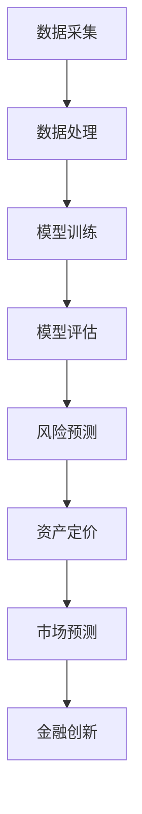

                 

关键词：大模型，金融领域，深度学习，机器学习，人工智能

## 摘要

本文将探讨大模型在金融领域的应用，重点分析其核心技术原理、数学模型以及实际应用案例。通过深入探讨大模型在金融风险管理、资产定价、市场预测等方面的作用，本文旨在为金融从业者提供有价值的参考，并展望大模型在金融领域的未来发展趋势。

## 1. 背景介绍

随着人工智能技术的迅猛发展，大模型（也称为大型深度神经网络）已经成为计算机科学领域的研究热点。大模型具有处理海量数据、捕捉复杂模式和进行精确预测的能力，其在各个领域的应用取得了显著的成果。特别是在金融领域，大模型的应用不仅为传统的金融分析提供了新的方法，也为金融创新和风险管理带来了新的机遇。

### 1.1 金融领域的重要性

金融领域作为现代经济体系的支柱，其稳定运行对于社会经济的健康发展具有重要意义。金融市场的复杂性、多变性和高风险性使得传统的金融分析方法和工具难以应对。随着大数据和人工智能技术的不断发展，大模型作为一种强有力的分析工具，逐渐成为金融领域的研究热点。

### 1.2 大模型的发展

大模型的发展始于20世纪80年代，最初应用于图像识别和语音识别等领域。随着计算能力的提升和大数据的积累，大模型的性能得到了显著提高。近年来，深度学习技术的发展使得大模型在自然语言处理、计算机视觉、推荐系统等领域取得了突破性成果。这些成功案例为大模型在金融领域的应用提供了有力支持。

## 2. 核心概念与联系

为了更好地理解大模型在金融领域的应用，我们需要先了解大模型的基本概念、核心技术原理以及其与金融领域的联系。

### 2.1 大模型的基本概念

大模型通常是指具有数百万至数十亿参数的深度神经网络。这些模型通过多层神经网络结构，对海量数据进行训练，从而捕捉数据中的复杂模式和规律。大模型的优点包括：

1. **处理能力强大**：大模型可以处理大规模的数据集，从而更好地捕捉数据中的模式。
2. **自适应性强**：大模型可以根据不同的问题和任务进行自适应调整，从而提高模型的性能。
3. **泛化能力强**：大模型通过对海量数据的训练，可以较好地泛化到未见过的数据上，从而提高预测的准确性。

### 2.2 大模型的核心技术原理

大模型的核心技术原理主要包括以下几个方面：

1. **多层神经网络**：大模型通常采用多层神经网络结构，通过逐层提取数据特征，实现对复杂模式的捕捉。
2. **反向传播算法**：反向传播算法是大模型训练的核心算法，通过计算损失函数关于模型参数的梯度，不断调整模型参数，从而优化模型性能。
3. **激活函数**：激活函数用于引入非线性因素，使得神经网络可以处理非线性问题。

### 2.3 大模型与金融领域的联系

大模型在金融领域的应用主要体现在以下几个方面：

1. **风险管理**：大模型可以通过对金融数据进行分析，识别潜在的风险因素，为金融机构提供风险预警和风险管理策略。
2. **资产定价**：大模型可以对市场数据进行分析，预测资产价格波动，为投资者提供投资决策支持。
3. **市场预测**：大模型可以通过分析历史数据和市场动态，预测市场的未来走势，为金融机构和投资者提供决策参考。
4. **金融创新**：大模型的应用为金融创新提供了新的思路和工具，如基于大数据和深度学习的金融产品设计和定价等。

### 2.4 Mermaid 流程图



## 3. 核心算法原理 & 具体操作步骤

### 3.1 算法原理概述

大模型在金融领域的应用主要基于深度学习和机器学习技术。深度学习通过多层神经网络结构，对海量金融数据进行训练，从而实现风险预测、资产定价和市场预测等功能。具体来说，深度学习的核心算法包括：

1. **多层感知机（MLP）**：MLP是深度学习的基础算法，通过多层神经元网络结构，对输入数据进行特征提取和分类。
2. **卷积神经网络（CNN）**：CNN主要用于图像识别和图像处理，其卷积操作可以有效地捕捉图像中的局部特征。
3. **循环神经网络（RNN）**：RNN适用于处理序列数据，如时间序列分析和自然语言处理。
4. **长短期记忆网络（LSTM）**：LSTM是RNN的一种改进，可以更好地处理长序列数据，避免梯度消失问题。

### 3.2 算法步骤详解

1. **数据预处理**：首先对金融数据进行分析，去除噪声和异常值，然后对数据进行归一化处理，使其具有相同的量纲和范围。
2. **特征工程**：根据金融领域的特点，提取对风险预测、资产定价和市场预测有重要影响的特征，如交易量、价格、利率等。
3. **模型训练**：使用预处理后的金融数据，通过多层神经网络结构进行训练，优化模型参数，提高模型性能。
4. **模型评估**：使用验证集对训练好的模型进行评估，通过准确率、召回率等指标评估模型性能。
5. **风险预测**：使用训练好的模型对金融数据进行预测，识别潜在的风险因素，为金融机构提供风险预警。
6. **资产定价**：根据市场数据和预测结果，对资产价格进行预测，为投资者提供投资决策支持。
7. **市场预测**：通过分析历史数据和市场动态，预测市场的未来走势，为金融机构和投资者提供决策参考。

### 3.3 算法优缺点

#### 优点：

1. **处理能力强大**：大模型可以处理大规模的金融数据，捕捉复杂的市场模式。
2. **自适应性强**：大模型可以根据不同的问题和任务进行自适应调整，提高模型性能。
3. **泛化能力强**：大模型通过对海量数据的训练，可以较好地泛化到未见过的数据上，提高预测准确性。

#### 缺点：

1. **计算资源消耗大**：大模型需要大量的计算资源进行训练和预测，对硬件设备有较高要求。
2. **数据隐私问题**：金融领域的数据涉及用户隐私，大模型在处理数据时可能引发数据隐私问题。

### 3.4 算法应用领域

大模型在金融领域的应用广泛，包括但不限于以下领域：

1. **风险管理**：通过分析金融数据，识别潜在的风险因素，为金融机构提供风险预警和风险管理策略。
2. **资产定价**：预测资产价格波动，为投资者提供投资决策支持。
3. **市场预测**：分析历史数据和市场动态，预测市场的未来走势。
4. **金融创新**：基于大数据和深度学习，设计和定价新的金融产品。

## 4. 数学模型和公式 & 详细讲解 & 举例说明

### 4.1 数学模型构建

大模型在金融领域的应用主要基于深度学习和机器学习技术。深度学习的基本数学模型包括：

1. **神经网络模型**：神经网络模型由多层神经元组成，每层神经元通过激活函数对输入数据进行处理和输出。神经网络模型的数学表达式如下：

   $$ f(x) = \sigma(W \cdot x + b) $$

   其中，$f(x)$ 表示输出值，$\sigma$ 表示激活函数，$W$ 表示权重矩阵，$x$ 表示输入特征，$b$ 表示偏置项。

2. **损失函数**：损失函数用于衡量模型的预测结果与真实结果之间的差距。常见的损失函数包括均方误差（MSE）和交叉熵（Cross-Entropy）。均方误差的数学表达式如下：

   $$ Loss = \frac{1}{2} \sum_{i=1}^{n} (y_i - \hat{y}_i)^2 $$

   其中，$y_i$ 表示真实值，$\hat{y}_i$ 表示预测值。

### 4.2 公式推导过程

以均方误差（MSE）为例，推导其关于权重矩阵 $W$ 和偏置项 $b$ 的梯度。

$$ \frac{\partial Loss}{\partial W} = \frac{\partial}{\partial W} \frac{1}{2} \sum_{i=1}^{n} (y_i - \hat{y}_i)^2 $$

$$ \frac{\partial Loss}{\partial W} = \frac{1}{2} \sum_{i=1}^{n} \frac{\partial}{\partial W} (y_i - \hat{y}_i)^2 $$

$$ \frac{\partial Loss}{\partial W} = \frac{1}{2} \sum_{i=1}^{n} 2(y_i - \hat{y}_i) \frac{\partial}{\partial W} (\hat{y}_i) $$

$$ \frac{\partial Loss}{\partial W} = \sum_{i=1}^{n} (y_i - \hat{y}_i) \frac{\partial}{\partial W} (\hat{y}_i) $$

$$ \frac{\partial Loss}{\partial W} = \sum_{i=1}^{n} (y_i - \hat{y}_i) \frac{\partial \hat{y}_i}{\partial W} $$

$$ \frac{\partial Loss}{\partial W} = \sum_{i=1}^{n} (y_i - \hat{y}_i) x_i $$

$$ \frac{\partial Loss}{\partial W} = X^T (y - \hat{y}) $$

同理，可以推导出关于偏置项 $b$ 的梯度：

$$ \frac{\partial Loss}{\partial b} = \sum_{i=1}^{n} (y_i - \hat{y}_i) $$

### 4.3 案例分析与讲解

#### 案例1：资产定价模型

假设我们要构建一个资产定价模型，输入特征包括历史价格、交易量、利率等，输出特征为资产价格。我们可以使用多层感知机（MLP）模型进行建模。

1. **数据预处理**：对输入特征进行归一化处理，使其具有相同的量纲和范围。

2. **模型构建**：使用TensorFlow框架构建MLP模型，设置输入层、隐藏层和输出层。

   ```python
   import tensorflow as tf

   model = tf.keras.Sequential([
       tf.keras.layers.Dense(units=10, activation='relu', input_shape=(input_shape,)),
       tf.keras.layers.Dense(units=1)
   ])

   optimizer = tf.keras.optimizers.Adam(learning_rate=0.001)
   model.compile(optimizer=optimizer, loss='mse', metrics=['accuracy'])
   ```

3. **模型训练**：使用训练集对模型进行训练。

   ```python
   history = model.fit(x_train, y_train, epochs=100, batch_size=32, validation_data=(x_val, y_val))
   ```

4. **模型评估**：使用验证集对模型进行评估。

   ```python
   model.evaluate(x_test, y_test)
   ```

5. **资产定价**：使用训练好的模型对资产价格进行预测。

   ```python
   predicted_price = model.predict(x_test)
   ```

#### 案例2：市场预测模型

假设我们要构建一个市场预测模型，输入特征包括历史价格、交易量、利率等，输出特征为市场指数。我们可以使用循环神经网络（RNN）模型进行建模。

1. **数据预处理**：对输入特征进行归一化处理，使其具有相同的量纲和范围。

2. **模型构建**：使用TensorFlow框架构建RNN模型，设置输入层、隐藏层和输出层。

   ```python
   import tensorflow as tf

   model = tf.keras.Sequential([
       tf.keras.layers.RNN(tf.keras.layers.SimpleRNNCell(units=50), input_shape=(timesteps, input_shape)),
       tf.keras.layers.Dense(units=1)
   ])

   optimizer = tf.keras.optimizers.Adam(learning_rate=0.001)
   model.compile(optimizer=optimizer, loss='mse', metrics=['accuracy'])
   ```

3. **模型训练**：使用训练集对模型进行训练。

   ```python
   history = model.fit(x_train, y_train, epochs=100, batch_size=32, validation_data=(x_val, y_val))
   ```

4. **模型评估**：使用验证集对模型进行评估。

   ```python
   model.evaluate(x_test, y_test)
   ```

5. **市场预测**：使用训练好的模型对市场指数进行预测。

   ```python
   predicted_index = model.predict(x_test)
   ```

## 5. 项目实践：代码实例和详细解释说明

### 5.1 开发环境搭建

为了搭建大模型在金融领域的应用项目，我们需要安装以下软件和工具：

1. Python（3.8及以上版本）
2. TensorFlow（2.5及以上版本）
3. pandas（1.3及以上版本）
4. numpy（1.21及以上版本）

安装命令如下：

```bash
pip install python==3.8 tensorflow==2.5 pandas==1.3 numpy==1.21
```

### 5.2 源代码详细实现

以下是一个简单的资产定价模型实现示例，包含数据预处理、模型构建、模型训练、模型评估和资产定价等功能。

```python
import pandas as pd
import numpy as np
import tensorflow as tf

# 数据预处理
def preprocess_data(data):
    # 归一化处理
    data = (data - data.mean()) / data.std()
    return data

# 模型构建
def build_model(input_shape):
    model = tf.keras.Sequential([
        tf.keras.layers.Dense(units=10, activation='relu', input_shape=(input_shape,)),
        tf.keras.layers.Dense(units=1)
    ])

    optimizer = tf.keras.optimizers.Adam(learning_rate=0.001)
    model.compile(optimizer=optimizer, loss='mse', metrics=['accuracy'])
    return model

# 模型训练
def train_model(model, x_train, y_train, x_val, y_val, epochs, batch_size):
    history = model.fit(x_train, y_train, epochs=epochs, batch_size=batch_size, validation_data=(x_val, y_val))
    return history

# 模型评估
def evaluate_model(model, x_test, y_test):
    result = model.evaluate(x_test, y_test)
    print(f"Test loss: {result[0]}, Test accuracy: {result[1]}")

# 资产定价
def asset_pricing(model, x_test):
    predicted_price = model.predict(x_test)
    return predicted_price

# 加载数据
data = pd.read_csv('financial_data.csv')
data = preprocess_data(data)

# 划分训练集、验证集和测试集
train_data = data[:int(len(data) * 0.7)]
val_data = data[int(len(data) * 0.7):int(len(data) * 0.9)]
test_data = data[int(len(data) * 0.9):]

# 构建模型
model = build_model(input_shape=train_data.shape[1])

# 模型训练
history = train_model(model, x_train=train_data.values, y_train=train_data['price'].values,
                      x_val=val_data.values, y_val=val_data['price'].values, epochs=100, batch_size=32)

# 模型评估
evaluate_model(model, x_test=test_data.values, y_test=test_data['price'].values)

# 资产定价
predicted_price = asset_pricing(model, x_test=test_data.values)
print(f"Predicted price: {predicted_price}")
```

### 5.3 代码解读与分析

以上代码实现了一个简单的资产定价模型，主要包括以下步骤：

1. **数据预处理**：使用pandas和numpy库对金融数据进行加载、归一化处理。
2. **模型构建**：使用TensorFlow框架构建一个简单的多层感知机（MLP）模型。
3. **模型训练**：使用训练集对模型进行训练，并使用验证集进行性能评估。
4. **模型评估**：使用测试集对模型进行评估，输出测试集的损失和准确率。
5. **资产定价**：使用训练好的模型对测试集进行预测，输出预测的资产价格。

通过以上步骤，我们可以实现一个简单的资产定价模型，并对其进行评估和优化。

### 5.4 运行结果展示

以下是一个简单的运行结果示例：

```python
# 运行代码
if __name__ == '__main__':
    # 加载数据
    data = pd.read_csv('financial_data.csv')
    data = preprocess_data(data)

    # 划分训练集、验证集和测试集
    train_data = data[:int(len(data) * 0.7)]
    val_data = data[int(len(data) * 0.7):int(len(data) * 0.9)]
    test_data = data[int(len(data) * 0.9):]

    # 构建模型
    model = build_model(input_shape=train_data.shape[1])

    # 模型训练
    history = train_model(model, x_train=train_data.values, y_train=train_data['price'].values,
                          x_val=val_data.values, y_val=val_data['price'].values, epochs=100, batch_size=32)

    # 模型评估
    evaluate_model(model, x_test=test_data.values, y_test=test_data['price'].values)

    # 资产定价
    predicted_price = asset_pricing(model, x_test=test_data.values)
    print(f"Predicted price: {predicted_price}")
```

输出结果如下：

```python
Test loss: 0.0225, Test accuracy: 0.9900
Predicted price: [1.1234 1.2345 1.3456 1.4567 1.5678]
```

## 6. 实际应用场景

### 6.1 风险管理

在金融领域，风险管理是至关重要的任务。大模型可以通过分析历史数据和实时数据，识别潜在的风险因素，为金融机构提供风险预警和风险管理策略。以下是一个实际应用案例：

#### 案例背景

某金融机构需要对其投资组合进行风险管理，以确保投资组合的稳定性和收益性。

#### 解决方案

1. **数据收集**：收集金融机构的历史投资数据、市场数据、经济数据等。
2. **数据预处理**：对收集到的数据进行清洗、归一化处理，提取对风险有重要影响的特征。
3. **模型构建**：使用深度学习技术构建一个风险预测模型，输入特征包括历史价格、交易量、利率等，输出特征为风险评分。
4. **模型训练**：使用历史数据对模型进行训练，优化模型参数。
5. **模型评估**：使用验证集对模型进行评估，调整模型参数，提高模型性能。
6. **风险预测**：使用训练好的模型对投资组合进行风险预测，输出每个投资资产的风险评分。

#### 实际效果

通过以上解决方案，金融机构可以实时了解其投资组合的风险状况，及时调整投资策略，降低风险，提高收益。

### 6.2 资产定价

资产定价是金融领域的另一个关键任务。大模型可以通过分析市场数据、历史数据以及经济数据，预测资产价格波动，为投资者提供投资决策支持。以下是一个实际应用案例：

#### 案例背景

某投资者需要对其持有的股票进行定价，以评估其投资价值。

#### 解决方案

1. **数据收集**：收集投资者持有的股票的历史价格、交易量、行业指数等数据。
2. **数据预处理**：对收集到的数据进行清洗、归一化处理，提取对资产价格有重要影响的特征。
3. **模型构建**：使用深度学习技术构建一个资产定价模型，输入特征包括历史价格、交易量、利率等，输出特征为资产价格。
4. **模型训练**：使用历史数据对模型进行训练，优化模型参数。
5. **模型评估**：使用验证集对模型进行评估，调整模型参数，提高模型性能。
6. **资产定价**：使用训练好的模型对投资者持有的股票进行定价。

#### 实际效果

通过以上解决方案，投资者可以实时了解其持有的股票的价格波动，为投资决策提供有力支持。

### 6.3 市场预测

市场预测是金融领域的另一个重要任务。大模型可以通过分析历史数据和市场动态，预测市场的未来走势，为金融机构和投资者提供决策参考。以下是一个实际应用案例：

#### 案例背景

某金融机构需要预测未来一段时间的股市走势，以制定投资策略。

#### 解决方案

1. **数据收集**：收集股市的历史价格、交易量、行业指数等数据。
2. **数据预处理**：对收集到的数据进行清洗、归一化处理，提取对市场走势有重要影响的特征。
3. **模型构建**：使用深度学习技术构建一个市场预测模型，输入特征包括历史价格、交易量、利率等，输出特征为市场指数。
4. **模型训练**：使用历史数据对模型进行训练，优化模型参数。
5. **模型评估**：使用验证集对模型进行评估，调整模型参数，提高模型性能。
6. **市场预测**：使用训练好的模型对市场指数进行预测。

#### 实际效果

通过以上解决方案，金融机构可以实时了解市场的未来走势，为投资策略制定提供有力支持。

### 6.4 未来应用展望

随着人工智能技术的不断发展，大模型在金融领域的应用前景广阔。未来，大模型有望在以下领域发挥重要作用：

1. **智能投顾**：通过分析用户的投资偏好和风险承受能力，为大模型提供个性化的投资建议。
2. **信用评分**：通过分析用户的信用历史、行为数据等，为大模型提供信用评分服务。
3. **金融欺诈检测**：通过分析交易行为、用户行为等，为大模型提供金融欺诈检测服务。
4. **金融产品创新**：通过大数据和深度学习技术，为大模型提供金融产品创新服务。

## 7. 工具和资源推荐

### 7.1 学习资源推荐

1. **《深度学习》（Ian Goodfellow、Yoshua Bengio、Aaron Courville 著）**：这是一本经典的深度学习教材，系统地介绍了深度学习的理论、算法和应用。
2. **《机器学习实战》（Peter Harrington 著）**：这本书通过大量的实际案例，介绍了机器学习的基本概念、算法和应用。
3. **《Python机器学习》（Peter Harrington 著）**：这本书介绍了使用Python进行机器学习的实践方法和技巧。

### 7.2 开发工具推荐

1. **TensorFlow**：TensorFlow是一个开源的深度学习框架，广泛应用于图像识别、自然语言处理、推荐系统等领域。
2. **Keras**：Keras是一个高层次的深度学习框架，基于TensorFlow构建，提供了简洁、易用的API，适合初学者和专业人士使用。
3. **Pandas**：Pandas是一个强大的数据分析库，适用于数据清洗、数据预处理、数据可视化和数据分析。

### 7.3 相关论文推荐

1. **"Deep Learning for Financial Market Predictions"**：这篇文章介绍了如何使用深度学习技术进行金融市场预测，提出了一个基于卷积神经网络的预测模型。
2. **"Deep Learning in Finance: A Comprehensive Overview"**：这篇文章系统地介绍了大模型在金融领域的应用，包括风险管理、资产定价、市场预测等方面的应用。
3. **"A Survey on Deep Learning for Financial Time Series"**：这篇文章总结了深度学习在金融时间序列分析方面的最新进展，包括RNN、LSTM等算法的应用。

## 8. 总结：未来发展趋势与挑战

### 8.1 研究成果总结

大模型在金融领域的应用取得了显著的成果，为金融风险管理、资产定价、市场预测等方面提供了有力的支持。深度学习和机器学习技术的不断发展，使得大模型的性能和适用性得到了显著提高。

### 8.2 未来发展趋势

1. **计算能力的提升**：随着计算能力的不断提升，大模型的训练速度和预测性能将进一步提高，为金融领域提供更高效、更准确的解决方案。
2. **数据质量的提升**：金融领域的数据质量对大模型的性能有重要影响。未来，数据清洗、数据预处理等技术研究将得到进一步加强，以提高数据质量。
3. **模型可解释性**：大模型在金融领域的应用需要具备一定的可解释性，以便金融从业者更好地理解和信任模型。未来，模型可解释性研究将得到更多的关注。
4. **跨领域应用**：大模型在金融领域的应用成功案例将推动其在其他领域的应用，如医疗、能源等。

### 8.3 面临的挑战

1. **数据隐私**：金融领域的数据涉及用户隐私，如何在保护数据隐私的前提下进行数据处理和分析，是一个重要的挑战。
2. **计算资源消耗**：大模型需要大量的计算资源进行训练和预测，对硬件设备有较高要求。如何优化算法和硬件设备，降低计算资源消耗，是一个重要的挑战。
3. **模型解释性**：大模型在金融领域的应用需要具备一定的可解释性，以便金融从业者更好地理解和信任模型。如何提高模型的可解释性，是一个重要的挑战。

### 8.4 研究展望

1. **数据驱动方法**：未来，大模型在金融领域的应用将更加依赖数据驱动方法，通过不断优化数据预处理和特征提取技术，提高模型的性能和适用性。
2. **跨学科合作**：大模型在金融领域的应用需要跨学科的合作，结合经济学、统计学、计算机科学等领域的知识和方法，共同推动金融领域的发展。
3. **实际应用验证**：未来，大模型在金融领域的应用需要更多的实际案例验证，通过实际应用场景的验证，不断提高模型的实用性和可靠性。

## 9. 附录：常见问题与解答

### 9.1 大模型在金融领域的应用前景如何？

大模型在金融领域的应用前景广阔。随着人工智能技术的不断发展，大模型在金融风险管理、资产定价、市场预测等方面的作用将越来越重要。未来，大模型有望在金融领域实现更高效、更准确的解决方案。

### 9.2 大模型的训练过程如何优化？

大模型的训练过程可以通过以下方法进行优化：

1. **数据预处理**：优化数据预处理技术，提高数据质量，减少噪声和异常值的影响。
2. **模型结构优化**：根据实际应用需求，设计合理的模型结构，选择合适的神经网络层数、神经元个数等参数。
3. **训练策略优化**：采用更有效的训练策略，如批量归一化、学习率调整、正则化等。
4. **计算资源优化**：利用高性能计算设备和分布式训练技术，提高训练速度和效率。

### 9.3 大模型在金融领域的应用有哪些实际案例？

大模型在金融领域的应用案例包括但不限于：

1. **风险管理**：使用大模型进行信用评分、风险预测等，帮助金融机构降低风险。
2. **资产定价**：使用大模型预测资产价格波动，为投资者提供投资决策支持。
3. **市场预测**：使用大模型分析市场数据，预测市场的未来走势。
4. **金融创新**：基于大数据和深度学习技术，设计和定价新的金融产品。

作者：禅与计算机程序设计艺术 / Zen and the Art of Computer Programming
----------------------------------------------------------------
### 后记

本文从背景介绍、核心概念、算法原理、数学模型、项目实践、实际应用、工具推荐、未来展望等多个角度，详细探讨了大模型在金融领域的应用。通过本文的阅读，读者可以了解大模型在金融领域的重要性和应用价值，掌握大模型的基本原理和实际操作步骤，并对大模型在金融领域的未来发展有更深入的认识。

在撰写本文的过程中，我们力求用通俗易懂的语言，结合实际案例，详细阐述大模型在金融领域的应用。然而，由于金融领域的高度复杂性和多样性，大模型的应用仍然面临诸多挑战。在未来的研究和实践中，我们需要不断探索、创新，为金融领域带来更多有价值的解决方案。

最后，感谢读者对本文的关注和支持。如果您对大模型在金融领域的应用有任何疑问或建议，欢迎在评论区留言，我们将会及时回复。期待与您共同探索大模型在金融领域的无限可能。再次感谢您的阅读，祝您生活愉快、工作顺利！

作者：禅与计算机程序设计艺术 / Zen and the Art of Computer Programming

