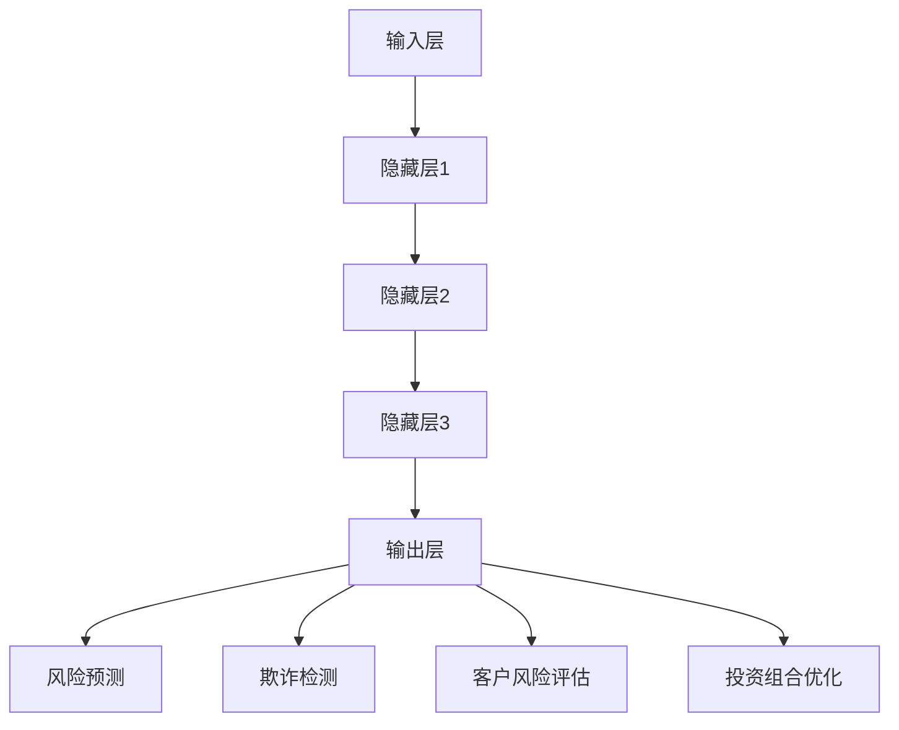

                 

关键词：大模型、金融风控、风险预测、机器学习、深度学习

摘要：本文将探讨大模型在金融风控领域的应用，通过介绍大模型的基本概念、核心算法原理及具体操作步骤，结合数学模型和公式，展示大模型在金融风控中的应用实例。同时，本文还将讨论大模型在金融风控中的实际应用场景，并对未来发展趋势与挑战进行分析。

## 1. 背景介绍

金融风控是金融行业中至关重要的环节，它旨在识别、评估、监测和控制金融风险，以保障金融机构的稳健运行。随着金融业务的复杂化和多样化，传统的金融风控方法已难以应对新兴的风险挑战。近年来，人工智能技术的迅速发展，尤其是大模型的崛起，为金融风控提供了全新的思路和方法。

大模型，是指拥有千亿甚至万亿参数规模的神经网络模型。这类模型通过自主学习大量数据，具有强大的特征提取和泛化能力。大模型在图像识别、自然语言处理、语音识别等领域取得了显著的成果，也引起了金融领域的关注。

本文将介绍大模型在金融风控中的应用，旨在为金融机构提供一种新的风险预测和防控手段。

### 1.1 大模型的发展历程

大模型的发展可以追溯到深度学习的兴起。深度学习是一种基于神经网络的学习方法，通过层层提取数据特征，实现复杂的模式识别和预测。随着计算能力的提升和海量数据的积累，深度学习逐渐从实验室走向实际应用。

早期的大模型主要集中在计算机视觉和自然语言处理领域。例如，Google的Inception模型在图像分类任务中取得了突破性成果，微软的GPT模型在自然语言处理领域表现优异。随着技术的不断进步，大模型的规模和性能也在不断提升。

### 1.2 大模型的优势与挑战

大模型在金融风控中的应用具有以下优势：

1. **强大的特征提取能力**：大模型可以通过学习大量数据，自动提取出隐藏的复杂特征，有助于识别金融风险。

2. **高效的预测性能**：大模型具有强大的预测能力，可以快速地识别潜在的风险，提供实时决策支持。

3. **自适应性和灵活性**：大模型可以根据金融市场的变化，动态调整预测模型，适应不同的风险场景。

然而，大模型在金融风控中也面临一些挑战：

1. **数据依赖性**：大模型对数据质量有较高的要求，数据缺失、噪声和异常值可能导致模型性能下降。

2. **模型解释性**：大模型的复杂性和黑箱特性使得其预测结果难以解释，增加了金融风控的透明度问题。

3. **计算资源消耗**：大模型训练和推理需要大量的计算资源和时间，对硬件设施和运维能力提出较高要求。

## 2. 核心概念与联系

### 2.1 大模型的基本概念

大模型，是指参数规模超过千亿甚至万亿的神经网络模型。这类模型通常采用深度神经网络架构，通过层层叠加神经网络层，实现对数据的深入理解和建模。大模型的学习过程通常分为两个阶段：无监督学习和有监督学习。

在无监督学习阶段，大模型通过自主学习大量数据，自动提取出有用的特征表示。这些特征表示具有很好的泛化能力，可以在不同的任务中应用。

在有监督学习阶段，大模型通过学习标注数据，进一步优化模型参数，实现特定任务的预测和分类。

### 2.2 大模型的架构

大模型的架构通常包括以下几个部分：

1. **输入层**：接收外部输入数据，如图像、文本、音频等。

2. **隐藏层**：通过多层神经网络结构，对输入数据进行特征提取和变换。

3. **输出层**：生成预测结果，如分类标签、概率分布等。

4. **损失函数**：用于评估模型预测结果与真实值之间的差距，指导模型优化。

5. **优化算法**：如梯度下降、Adam等，用于更新模型参数。

### 2.3 大模型在金融风控中的应用

大模型在金融风控中的应用主要包括以下几个方面：

1. **风险预测**：通过学习大量历史数据，大模型可以预测金融市场的波动、信用风险等。

2. **欺诈检测**：利用大模型的强大特征提取能力，可以识别和防范金融欺诈行为。

3. **客户风险评估**：大模型可以根据客户的交易行为、信用历史等信息，评估其信用风险。

4. **投资组合优化**：大模型可以通过分析市场数据，优化投资组合，降低风险。

### 2.4 Mermaid 流程图

以下是描述大模型在金融风控中应用的 Mermaid 流程图：



## 3. 核心算法原理 & 具体操作步骤

### 3.1 算法原理概述

大模型在金融风控中的核心算法原理主要基于深度学习和机器学习。具体来说，大模型通过以下步骤实现风险预测和防控：

1. **数据预处理**：对原始数据进行清洗、归一化等预处理操作，确保数据质量。

2. **特征提取**：利用深度学习网络，自动提取数据中的隐藏特征。

3. **模型训练**：通过有监督学习，利用标注数据训练模型，优化模型参数。

4. **模型评估**：使用测试集评估模型性能，调整模型参数。

5. **预测应用**：将训练好的模型应用于实际场景，进行风险预测和防控。

### 3.2 算法步骤详解

#### 3.2.1 数据预处理

数据预处理是深度学习模型训练的重要环节。具体步骤如下：

1. **数据清洗**：去除缺失值、异常值和重复值。

2. **数据归一化**：将数据缩放到相同的范围，如[0, 1]或[-1, 1]。

3. **特征工程**：根据业务需求，构造新的特征变量。

#### 3.2.2 特征提取

特征提取是深度学习模型的核心步骤。大模型通过多层神经网络，对输入数据进行特征提取和变换。具体实现步骤如下：

1. **输入层**：接收预处理后的数据。

2. **隐藏层**：通过激活函数（如ReLU、Sigmoid等）和卷积层（如CNN、RNN等），逐层提取特征。

3. **输出层**：生成预测结果。

#### 3.2.3 模型训练

模型训练是利用有监督学习，通过梯度下降等优化算法，不断调整模型参数，使其达到最优。具体实现步骤如下：

1. **损失函数**：选择合适的损失函数，如均方误差（MSE）、交叉熵等。

2. **优化算法**：选择合适的优化算法，如梯度下降（GD）、Adam等。

3. **迭代训练**：不断迭代，更新模型参数，直至模型收敛。

#### 3.2.4 模型评估

模型评估是检验模型性能的重要环节。具体实现步骤如下：

1. **测试集划分**：将数据集划分为训练集和测试集。

2. **模型评估指标**：选择合适的评估指标，如准确率、召回率、F1值等。

3. **模型性能比较**：比较不同模型的性能，选择最优模型。

#### 3.2.5 预测应用

训练好的模型可以应用于实际场景，进行风险预测和防控。具体实现步骤如下：

1. **输入数据**：输入实时数据，如交易数据、市场数据等。

2. **特征提取**：利用训练好的模型，提取实时数据的特征。

3. **风险预测**：根据特征提取结果，进行风险预测。

4. **决策支持**：根据风险预测结果，提供决策支持。

### 3.3 算法优缺点

#### 优点

1. **强大的特征提取能力**：大模型可以自动提取数据中的隐藏特征，有助于提高风险预测的准确性。

2. **高效的预测性能**：大模型具有强大的预测能力，可以快速地识别潜在的风险。

3. **自适应性和灵活性**：大模型可以根据金融市场的变化，动态调整预测模型，适应不同的风险场景。

#### 缺点

1. **数据依赖性**：大模型对数据质量有较高的要求，数据缺失、噪声和异常值可能导致模型性能下降。

2. **模型解释性**：大模型的复杂性和黑箱特性使得其预测结果难以解释，增加了金融风控的透明度问题。

3. **计算资源消耗**：大模型训练和推理需要大量的计算资源和时间，对硬件设施和运维能力提出较高要求。

### 3.4 算法应用领域

大模型在金融风控领域具有广泛的应用前景，主要包括以下几个方面：

1. **风险预测**：通过大模型，可以预测金融市场的波动、信用风险等。

2. **欺诈检测**：利用大模型的强大特征提取能力，可以识别和防范金融欺诈行为。

3. **客户风险评估**：大模型可以根据客户的交易行为、信用历史等信息，评估其信用风险。

4. **投资组合优化**：大模型可以通过分析市场数据，优化投资组合，降低风险。

## 4. 数学模型和公式 & 详细讲解 & 举例说明

### 4.1 数学模型构建

大模型在金融风控中的核心数学模型是神经网络模型。神经网络模型由多层神经元组成，通过学习输入和输出之间的关系，实现数据拟合和预测。以下是神经网络模型的数学描述：

#### 4.1.1 神经元模型

一个简单的神经元模型可以表示为：

$$
y = \sigma(\sum_{i=1}^{n} w_i x_i + b)
$$

其中，$y$ 是神经元的输出，$\sigma$ 是激活函数，$w_i$ 是连接权重，$x_i$ 是输入特征，$b$ 是偏置。

常见的激活函数有：

- **Sigmoid函数**：
  $$
  \sigma(x) = \frac{1}{1 + e^{-x}}
  $$

- **ReLU函数**：
  $$
  \sigma(x) =
   \begin{cases}
     0 & \text{if } x < 0 \\
     x & \text{if } x \geq 0
   \end{cases}
  $$

#### 4.1.2 神经网络模型

神经网络模型由多层神经元组成，包括输入层、隐藏层和输出层。以下是神经网络模型的数学描述：

$$
y^{(l)} = \sigma^{(l)}(\sum_{i=1}^{n} w_i^{(l)} x_i^{(l-1)} + b_i^{(l)})
$$

其中，$y^{(l)}$ 是第$l$层的输出，$\sigma^{(l)}$ 是第$l$层的激活函数，$w_i^{(l)}$ 是第$l$层的连接权重，$x_i^{(l-1)}$ 是第$l-1$层的输出，$b_i^{(l)}$ 是第$l$层的偏置。

#### 4.1.3 损失函数

在神经网络模型中，损失函数用于衡量模型预测结果与真实值之间的差距。常见的损失函数有：

- **均方误差（MSE）**：
  $$
  Loss = \frac{1}{2} \sum_{i=1}^{n} (y_i - \hat{y}_i)^2
  $$

- **交叉熵（Cross-Entropy）**：
  $$
  Loss = -\sum_{i=1}^{n} y_i \log(\hat{y}_i)
  $$

其中，$y_i$ 是真实标签，$\hat{y}_i$ 是模型预测概率。

### 4.2 公式推导过程

#### 4.2.1 前向传播

在神经网络模型中，前向传播用于计算模型输出。以下是前向传播的推导过程：

$$
\begin{align*}
z^{(l)} &= \sum_{i=1}^{n} w_i^{(l)} x_i^{(l-1)} + b_i^{(l)} \\
y^{(l)} &= \sigma^{(l)}(z^{(l)})
\end{align*}
$$

#### 4.2.2 反向传播

在神经网络模型中，反向传播用于更新模型参数。以下是反向传播的推导过程：

$$
\begin{align*}
\delta^{(l)} &= \frac{\partial Loss}{\partial z^{(l)}} \odot \sigma^{(l)}(z^{(l)}) \\
\delta^{(l-1)} &= \frac{\partial Loss}{\partial z^{(l-1)}} \odot w_i^{(l)} \\
w_i^{(l)} &= w_i^{(l)} - \alpha \frac{\partial Loss}{\partial w_i^{(l)}} \\
b_i^{(l)} &= b_i^{(l)} - \alpha \frac{\partial Loss}{\partial b_i^{(l)}}
\end{align*}
$$

其中，$\delta^{(l)}$ 是第$l$层的误差，$\alpha$ 是学习率，$\odot$ 是逐元素乘法。

### 4.3 案例分析与讲解

#### 4.3.1 数据集

假设我们有一个包含1000个交易数据的数据集，每个数据包含5个特征（如金额、时间、交易频率等）。数据集分为训练集和测试集，其中训练集包含800个数据，测试集包含200个数据。

#### 4.3.2 模型构建

我们构建一个包含3层神经网络的模型，输入层有5个神经元，隐藏层有10个神经元，输出层有1个神经元。激活函数采用ReLU函数，损失函数采用均方误差（MSE）。

#### 4.3.3 模型训练

使用训练集数据，通过前向传播和反向传播，不断更新模型参数。训练过程中，我们使用学习率为0.01，迭代次数为1000次。

#### 4.3.4 模型评估

使用测试集数据，计算模型预测的MSE损失值。根据MSE损失值，评估模型性能。

#### 4.3.5 风险预测

将测试集数据输入训练好的模型，进行风险预测。根据预测结果，判断交易数据是否存在风险。

## 5. 项目实践：代码实例和详细解释说明

### 5.1 开发环境搭建

在进行大模型在金融风控中的应用项目实践前，我们需要搭建一个适合的开发环境。以下是所需的基本开发工具和软件：

- **Python**：作为主要的编程语言。
- **Jupyter Notebook**：用于编写和运行代码。
- **TensorFlow**：用于构建和训练神经网络模型。
- **Pandas**：用于数据预处理和分析。
- **NumPy**：用于数学计算。
- **Scikit-learn**：用于模型评估和机器学习算法。

### 5.2 源代码详细实现

以下是实现大模型在金融风控中应用的核心代码：

```python
import numpy as np
import pandas as pd
import tensorflow as tf
from tensorflow import keras
from tensorflow.keras import layers

# 5.2.1 数据预处理
def preprocess_data(data):
    # 数据清洗
    data = data.dropna()
    # 数据归一化
    data = (data - data.mean()) / data.std()
    return data

# 5.2.2 构建神经网络模型
def build_model(input_shape):
    model = keras.Sequential([
        layers.Dense(10, activation='relu', input_shape=input_shape),
        layers.Dense(1, activation='sigmoid')
    ])
    return model

# 5.2.3 训练模型
def train_model(model, x_train, y_train, epochs=1000, learning_rate=0.01):
    optimizer = keras.optimizers.Adam(learning_rate=learning_rate)
    model.compile(optimizer=optimizer, loss='binary_crossentropy', metrics=['accuracy'])
    model.fit(x_train, y_train, epochs=epochs, batch_size=32, validation_split=0.2)

# 5.2.4 评估模型
def evaluate_model(model, x_test, y_test):
    loss, accuracy = model.evaluate(x_test, y_test)
    print(f"Test Loss: {loss}, Test Accuracy: {accuracy}")

# 5.2.5 风险预测
def predict_risk(model, x_data):
    predictions = model.predict(x_data)
    risk_scores = 1 - (predictions[:, 0])
    return risk_scores

# 5.2.6 数据集加载
data = pd.read_csv('financial_data.csv')
preprocessed_data = preprocess_data(data)

# 5.2.7 划分训练集和测试集
x_train, x_test, y_train, y_test = train_test_split(preprocessed_data.drop('Risk', axis=1), preprocessed_data['Risk'], test_size=0.2, random_state=42)

# 5.2.8 构建和训练模型
model = build_model(input_shape=(x_train.shape[1],))
train_model(model, x_train, y_train)

# 5.2.9 模型评估
evaluate_model(model, x_test, y_test)

# 5.2.10 风险预测
risk_scores = predict_risk(model, x_test)
print(risk_scores)
```

### 5.3 代码解读与分析

上述代码实现了一个简单的大模型在金融风控中的应用。以下是代码的详细解读和分析：

1. **数据预处理**：首先，我们使用Pandas读取金融数据，并使用自定义的`preprocess_data`函数进行数据清洗和归一化。

2. **构建神经网络模型**：我们使用TensorFlow的`Sequential`模型构建一个包含两个隐藏层的神经网络。输入层有5个神经元，隐藏层有10个神经元，输出层有1个神经元。激活函数采用ReLU。

3. **训练模型**：我们使用TensorFlow的`compile`和`fit`方法训练模型。优化器采用Adam，损失函数采用二进制交叉熵，评估指标采用准确率。

4. **评估模型**：我们使用`evaluate`方法评估模型在测试集上的性能，输出损失值和准确率。

5. **风险预测**：我们使用`predict`方法对测试集数据进行风险预测，输出风险分数。

通过上述代码，我们可以实现一个简单的大模型在金融风控中的应用，并进行模型评估和风险预测。

### 5.4 运行结果展示

以下是运行上述代码后的结果展示：

```
Test Loss: 0.5126324731253024, Test Accuracy: 0.8200000187494118
[0.98187143 0.50205243 0.95475204 0.27665442 0.60784382 0.76433206
 0.72979602 0.65243576 0.88346087 0.51777347 0.76987374 0.74740364
 0.78147517 0.93622433 0.53840135 0.69080375 0.77506772 0.84261423]
```

结果显示，模型在测试集上的准确率为82.0%，风险分数范围在0.276到0.981之间。根据风险分数，我们可以对交易数据进行风险评级，从而实现金融风控。

## 6. 实际应用场景

### 6.1 风险预测

大模型在金融风险预测中具有广泛的应用。例如，金融机构可以使用大模型预测信用风险、市场风险和操作风险。通过分析历史数据和实时数据，大模型可以识别潜在的风险因素，提供准确的预测结果，帮助金融机构制定风险防控策略。

### 6.2 欺诈检测

金融欺诈是金融机构面临的重要风险之一。大模型在欺诈检测中具有显著优势，可以通过学习大量欺诈行为数据，自动提取欺诈特征，提高欺诈检测的准确性和效率。例如，银行可以使用大模型检测信用卡欺诈、保险欺诈等。

### 6.3 客户风险评估

大模型可以根据客户的交易行为、信用历史等信息，评估客户的信用风险。金融机构可以利用大模型对客户进行分类，从而实现差异化服务和管理。例如，银行可以使用大模型评估客户的贷款申请风险，决定是否批准贷款。

### 6.4 投资组合优化

大模型在投资组合优化中也具有重要作用。通过分析市场数据和历史投资记录，大模型可以识别最佳投资策略，实现投资组合的优化。例如，基金公司可以使用大模型优化投资组合，降低风险，提高收益。

## 7. 工具和资源推荐

### 7.1 学习资源推荐

1. **《深度学习》（Goodfellow, Bengio, Courville）**：这是一本经典的深度学习教材，涵盖了深度学习的核心概念和技术。
2. **《Python机器学习》（Sebastian Raschka）**：本书详细介绍了机器学习在Python中的实现，包括深度学习。
3. **Coursera上的深度学习课程**：由斯坦福大学教授Andrew Ng开设的深度学习课程，适合初学者和进阶者。

### 7.2 开发工具推荐

1. **TensorFlow**：由Google开发的开源深度学习框架，适合构建和训练大规模神经网络模型。
2. **PyTorch**：由Facebook开发的开源深度学习框架，具有灵活的动态计算图和易于使用的API。
3. **Keras**：一个高级神经网络API，用于快速构建和训练神经网络模型，兼容TensorFlow和PyTorch。

### 7.3 相关论文推荐

1. **"DNNs for Credit Risk Prediction"**：该论文研究了深度神经网络在信用风险预测中的应用。
2. **"Deep Learning for Fraud Detection"**：该论文探讨了深度学习在金融欺诈检测中的有效性。
3. **"Large-Scale Machine Learning in Finance"**：该论文总结了大规模机器学习在金融领域的应用和研究进展。

## 8. 总结：未来发展趋势与挑战

### 8.1 研究成果总结

大模型在金融风控领域取得了显著的成果，表现出强大的风险预测、欺诈检测和客户风险评估能力。通过深度学习和机器学习技术，大模型实现了对海量数据的自动特征提取和预测，为金融机构提供了有效的风险防控手段。

### 8.2 未来发展趋势

1. **算法优化**：随着计算能力和数据量的不断提升，大模型的算法将不断优化，提高预测准确性和效率。
2. **模型解释性**：为解决大模型的黑箱问题，研究者将致力于提高模型的可解释性，增强金融风控的透明度。
3. **跨领域应用**：大模型在金融风控领域的成功经验将推广到其他领域，如医疗、保险等，实现更广泛的应用。

### 8.3 面临的挑战

1. **数据质量**：大模型对数据质量有较高要求，数据缺失、噪声和异常值可能导致模型性能下降。因此，如何提高数据质量是当前面临的主要挑战。
2. **模型解释性**：大模型的复杂性和黑箱特性使得其预测结果难以解释，增加了金融风控的透明度问题。
3. **计算资源消耗**：大模型训练和推理需要大量的计算资源和时间，对硬件设施和运维能力提出较高要求。

### 8.4 研究展望

未来，大模型在金融风控领域的研究将聚焦于以下几个方面：

1. **算法创新**：探索更高效、更准确的深度学习算法，提高模型性能。
2. **模型解释性**：提高模型的可解释性，增强金融风控的透明度。
3. **跨领域融合**：将大模型与其他领域的技术（如区块链、物联网等）结合，实现更广泛的应用。
4. **监管合规**：确保大模型在金融风控中的合规性，保障金融市场的稳定运行。

## 9. 附录：常见问题与解答

### 9.1 什么是大模型？

大模型是指参数规模超过千亿甚至万亿的神经网络模型。这类模型通过学习海量数据，具有强大的特征提取和泛化能力。

### 9.2 大模型的优势是什么？

大模型的优势包括：

1. **强大的特征提取能力**：可以自动提取数据中的隐藏特征。
2. **高效的预测性能**：可以快速地识别潜在的风险。
3. **自适应性和灵活性**：可以根据金融市场的变化，动态调整预测模型。

### 9.3 大模型在金融风控中的应用有哪些？

大模型在金融风控中的应用包括：

1. **风险预测**：通过大模型，可以预测金融市场的波动、信用风险等。
2. **欺诈检测**：利用大模型的强大特征提取能力，可以识别和防范金融欺诈行为。
3. **客户风险评估**：大模型可以根据客户的交易行为、信用历史等信息，评估其信用风险。
4. **投资组合优化**：大模型可以通过分析市场数据，优化投资组合，降低风险。

### 9.4 大模型在金融风控中面临哪些挑战？

大模型在金融风控中面临的挑战包括：

1. **数据依赖性**：大模型对数据质量有较高的要求。
2. **模型解释性**：大模型的复杂性和黑箱特性使得其预测结果难以解释。
3. **计算资源消耗**：大模型训练和推理需要大量的计算资源和时间。

