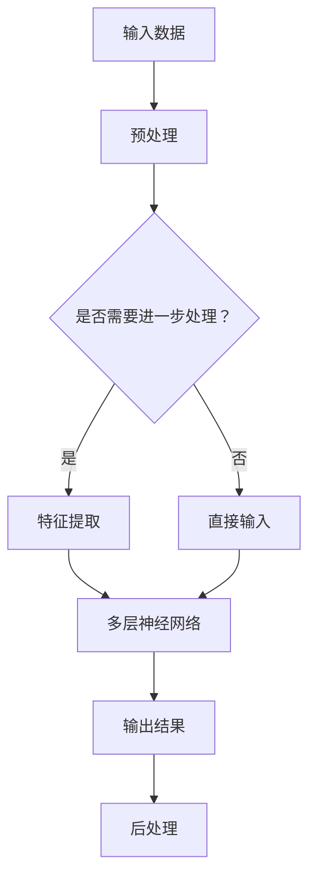

                 

关键词：大模型，深度学习，AI应用，行业变革，技术趋势

> 摘要：随着深度学习技术的不断发展和大模型的不断进化，大模型在各个行业中的应用前景愈发广阔。本文将深入探讨大模型在当今社会中的重要地位，以及它们如何推动行业变革，引领技术趋势。

## 1. 背景介绍

在过去的几十年中，人工智能（AI）技术经历了从理论到应用的飞速发展。尤其是深度学习技术的崛起，使得机器能够通过大量的数据进行自我学习和优化。大模型，即参数量庞大的神经网络模型，在这场技术革命中扮演了至关重要的角色。它们的出现，不仅极大地提升了AI系统的性能，也开拓了新的应用领域。

### 大模型的发展历程

大模型的发展可以追溯到2006年，当时深度信念网络（Deep Belief Network, DBN）的提出，标志着深度学习技术的崛起。然而，真正的大模型革命始于2012年，当AlexNet在ImageNet大赛中取得突破性的成绩时，深度学习开始被广泛接受。此后，随着计算能力和数据资源的提升，大模型的规模不断增大，性能也日益提升。

### 大模型的重要性

大模型之所以重要，首先是因为它们能够处理和生成复杂的数据。在图像识别、自然语言处理、语音识别等领域，大模型的表现远超传统机器学习模型。此外，大模型的应用不仅局限于学术研究，它们正逐步渗透到工业、医疗、金融等各个行业，为行业变革提供了强有力的技术支持。

## 2. 核心概念与联系

为了更好地理解大模型，我们需要首先了解一些核心概念和它们之间的关系。

### 2.1 深度学习与神经网络

深度学习是人工智能的一个分支，它模拟人脑的工作方式，通过多层神经网络对数据进行处理。神经网络是由大量节点（或称为神经元）组成的计算模型，这些节点通过连接进行信息传递和处理。

### 2.2 大模型的结构与工作原理

大模型通常由数十亿甚至数万亿个参数组成，这些参数通过学习大量的数据来调整，以实现高度复杂的任务。大模型的工作原理可以简单概括为：输入数据 -> 通过多层神经网络处理 -> 输出结果。

### 2.3 Mermaid 流程图

下面是一个大模型工作原理的Mermaid流程图：



## 3. 核心算法原理 & 具体操作步骤

### 3.1 算法原理概述

大模型的核心算法是深度学习算法，尤其是基于梯度的优化方法。这些算法通过不断调整网络中的参数，使得模型能够更好地拟合数据。

### 3.2 算法步骤详解

1. 数据预处理：对输入数据进行清洗、归一化等处理。
2. 特征提取：通过神经网络将原始数据转化为具有区分性的特征。
3. 梯度下降：使用反向传播算法，通过梯度下降方法调整网络参数。
4. 模型评估：使用验证集或测试集对模型进行评估，以确定其性能。
5. 模型优化：根据评估结果调整模型结构或参数，以提升性能。

### 3.3 算法优缺点

**优点：**
- 能够处理和生成复杂的数据。
- 在多个领域取得了显著的成果。

**缺点：**
- 需要大量的数据和计算资源。
- 模型训练时间较长。

### 3.4 算法应用领域

大模型的应用领域非常广泛，包括但不限于：

- 图像识别
- 自然语言处理
- 语音识别
- 自动驾驶
- 医疗诊断
- 金融风控

## 4. 数学模型和公式 & 详细讲解 & 举例说明

### 4.1 数学模型构建

大模型的数学模型主要基于神经网络。一个基本的神经网络模型可以表示为：

$$
y = \sigma(W \cdot x + b)
$$

其中，\(y\) 是输出，\(\sigma\) 是激活函数，\(W\) 是权重矩阵，\(x\) 是输入，\(b\) 是偏置。

### 4.2 公式推导过程

神经网络的推导过程涉及到微积分和线性代数。这里简要介绍：

1. 前向传播：计算输入和权重之间的点积，加上偏置，然后通过激活函数。
2. 反向传播：计算输出误差，然后通过梯度下降调整权重和偏置。

### 4.3 案例分析与讲解

以图像识别为例，我们可以通过以下步骤来实现：

1. 数据预处理：将图像数据转换为灰度图像，并进行归一化处理。
2. 特征提取：使用卷积神经网络提取图像的特征。
3. 模型训练：通过反向传播算法训练模型，以最小化损失函数。
4. 模型评估：使用测试集评估模型的性能。

## 5. 项目实践：代码实例和详细解释说明

### 5.1 开发环境搭建

在开始代码实践之前，我们需要搭建一个开发环境。这里我们使用Python和TensorFlow作为我们的开发工具。

```python
pip install tensorflow
```

### 5.2 源代码详细实现

以下是一个简单的卷积神经网络实现的代码示例：

```python
import tensorflow as tf

# 定义模型
model = tf.keras.Sequential([
    tf.keras.layers.Conv2D(32, (3, 3), activation='relu', input_shape=(28, 28, 1)),
    tf.keras.layers.MaxPooling2D((2, 2)),
    tf.keras.layers.Flatten(),
    tf.keras.layers.Dense(128, activation='relu'),
    tf.keras.layers.Dense(10, activation='softmax')
])

# 编译模型
model.compile(optimizer='adam', loss='sparse_categorical_crossentropy', metrics=['accuracy'])

# 训练模型
model.fit(x_train, y_train, epochs=5, validation_split=0.2)
```

### 5.3 代码解读与分析

这段代码首先定义了一个卷积神经网络模型，然后编译并训练了模型。具体步骤如下：

1. **定义模型**：使用`tf.keras.Sequential`创建一个序列模型，其中包含了卷积层、池化层、全连接层等。
2. **编译模型**：设置优化器、损失函数和评价指标。
3. **训练模型**：使用训练数据训练模型，并进行验证。

### 5.4 运行结果展示

训练完成后，我们可以使用测试数据评估模型的性能：

```python
test_loss, test_acc = model.evaluate(x_test, y_test)
print(f"Test accuracy: {test_acc}")
```

## 6. 实际应用场景

大模型在各个行业中的应用场景如下：

### 6.1 工业制造

在工业制造领域，大模型可以用于质量检测、故障预测和自动化控制等。例如，通过图像识别技术，大模型可以检测生产线上的缺陷产品，从而提高生产效率。

### 6.2 医疗保健

在医疗保健领域，大模型可以用于疾病诊断、治疗方案推荐和个性化医疗服务等。例如，通过自然语言处理技术，大模型可以分析病历记录，为医生提供诊断建议。

### 6.3 金融科技

在金融科技领域，大模型可以用于风险评估、欺诈检测和投资决策等。例如，通过深度学习技术，大模型可以分析大量交易数据，预测金融市场的走势。

### 6.4 教育科技

在教育科技领域，大模型可以用于个性化学习推荐、智能答疑和教学效果评估等。例如，通过自然语言处理技术，大模型可以为学生提供个性化的学习方案，提高学习效果。

## 7. 工具和资源推荐

### 7.1 学习资源推荐

- 《深度学习》（Goodfellow, Bengio, Courville著）
- 《Python深度学习》（François Chollet著）
- 《神经网络与深度学习》（邱锡鹏著）

### 7.2 开发工具推荐

- TensorFlow
- PyTorch
- Keras

### 7.3 相关论文推荐

- "Deep Learning: A Brief History, A Case Study, and a Proposal for the Future"
- "A Theoretically Grounded Application of Dropout in Recurrent Neural Networks"
- "An Empirical Evaluation of Rectified Activations in Convolutional Network"

## 8. 总结：未来发展趋势与挑战

### 8.1 研究成果总结

大模型在深度学习领域取得了显著的成果，不仅在学术研究中取得了突破，也在实际应用中展现了巨大的潜力。

### 8.2 未来发展趋势

未来，大模型将继续向更高参数量、更高计算效率、更广泛应用领域发展。同时，随着计算能力和数据资源的提升，大模型的应用前景将更加广阔。

### 8.3 面临的挑战

尽管大模型在各个领域展现出了巨大的潜力，但同时也面临着一些挑战，包括计算资源消耗、模型解释性、数据隐私等问题。

### 8.4 研究展望

为了解决这些挑战，未来的研究需要关注以下几个方面：

- 开发更高效的大模型训练算法。
- 研究大模型的解释性和可解释性。
- 探索大模型在隐私保护方面的应用。

## 9. 附录：常见问题与解答

### 9.1 大模型与普通模型有什么区别？

大模型与普通模型的主要区别在于参数量和数据量。大模型通常拥有数十亿甚至数万亿个参数，并且需要大量的数据进行训练。

### 9.2 大模型如何提高性能？

提高大模型性能的方法包括增加模型参数量、使用更多数据、优化训练算法等。

### 9.3 大模型在工业中的应用有哪些？

大模型在工业中的应用包括质量检测、故障预测、自动化控制等。

### 9.4 大模型在医疗中的应用有哪些？

大模型在医疗中的应用包括疾病诊断、治疗方案推荐、个性化医疗服务等。

### 9.5 大模型在金融中的应用有哪些？

大模型在金融中的应用包括风险评估、欺诈检测、投资决策等。

### 9.6 大模型在教育中的应用有哪些？

大模型在教育中的应用包括个性化学习推荐、智能答疑、教学效果评估等。

---

作者：禅与计算机程序设计艺术 / Zen and the Art of Computer Programming

