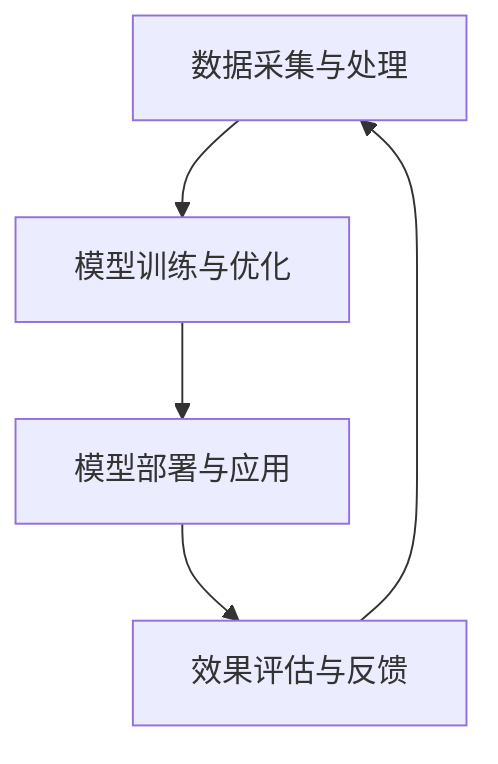

                 

关键词：大模型、应用落地、AI商业化、算法、数学模型、实践、工具推荐

## 摘要

本文旨在探讨大模型应用在AI商业化进程中的关键作用，分析其技术背景、核心算法原理以及实际应用场景。通过详尽的数学模型讲解、项目实践案例以及相关工具和资源的推荐，本文旨在为从事AI领域的开发者提供有价值的参考，加速大模型应用落地，推动AI商业化进程。

## 1. 背景介绍

随着计算能力的提升和海量数据资源的积累，大模型（Large Models）在人工智能领域逐渐崭露头角。大模型，通常指的是参数规模达到亿级别以上的神经网络模型，例如GPT、BERT等。这些模型在自然语言处理、计算机视觉、语音识别等领域取得了显著的突破。

AI商业化，即人工智能技术在商业领域的应用，已成为当前科技发展的热点。通过将大模型应用于实际商业场景，企业可以显著提升运营效率、降低成本、改善用户体验。例如，大模型在客户服务、风险管理、产品推荐等方面的应用，正逐步推动传统行业的数字化转型。

### 大模型的崛起

大模型的兴起得益于深度学习技术的进步。深度学习通过构建多层神经网络，实现从原始数据到复杂特征的自动提取和学习。随着硬件性能的提升和分布式计算技术的应用，大模型的训练速度和规模得到大幅提高。如今，大模型已经在许多领域展现了其强大的能力。

### AI商业化的趋势

AI商业化进程加速，主要表现在以下几个方面：

1. **市场规模的扩大**：全球AI市场规模持续增长，预计到2025年将达到万亿级别。
2. **应用的多样化**：从最初在金融、医疗等领域的探索，AI应用逐渐拓展到制造、物流、零售等各行各业。
3. **创新模式的涌现**：企业通过AI技术，实现业务流程的优化、产品设计的智能化，以及客户服务的个性化。

## 2. 核心概念与联系

### 大模型的工作原理

大模型通常采用深度神经网络架构，包括输入层、多个隐藏层和输出层。通过前向传播和反向传播算法，模型从数据中学习特征，逐步提升预测和分类的准确性。

### AI商业化的实现路径

AI商业化的实现路径主要包括：

1. **数据采集与处理**：收集并处理企业内外部数据，为AI模型提供训练数据。
2. **模型训练与优化**：使用高性能计算资源，训练大模型并不断优化。
3. **模型部署与应用**：将训练好的模型部署到实际业务场景中，实现自动化和智能化。
4. **效果评估与反馈**：通过监控模型性能和用户反馈，持续优化模型和应用。

### Mermaid 流程图



## 3. 核心算法原理 & 具体操作步骤

### 3.1 算法原理概述

大模型的训练过程主要包括以下步骤：

1. **数据预处理**：对输入数据进行标准化、去噪等处理，确保数据质量。
2. **模型初始化**：初始化神经网络参数，通常使用随机初始化或预训练模型。
3. **前向传播**：输入数据通过神经网络各层，计算输出。
4. **反向传播**：根据输出误差，更新网络参数。
5. **优化算法**：使用梯度下降、Adam等优化算法，调整网络参数。
6. **模型评估**：使用验证集或测试集评估模型性能。

### 3.2 算法步骤详解

1. **数据预处理**：

    - **数据清洗**：去除无效、错误的数据。
    - **数据归一化**：将数据缩放到相同的范围。
    - **数据增强**：通过旋转、缩放、裁剪等操作增加数据多样性。

2. **模型初始化**：

    - **随机初始化**：随机初始化网络参数。
    - **预训练模型**：使用预训练模型作为初始化，提升模型性能。

3. **前向传播**：

    - **特征提取**：通过多层神经网络，提取数据特征。
    - **非线性变换**：应用激活函数，如ReLU、Sigmoid等，增加模型表达能力。

4. **反向传播**：

    - **计算梯度**：根据输出误差，计算各层参数的梯度。
    - **参数更新**：使用梯度下降等优化算法，更新网络参数。

5. **优化算法**：

    - **梯度下降**：根据梯度方向和步长，更新参数。
    - **Adam优化器**：结合梯度的一阶矩估计和二阶矩估计，优化参数更新。

6. **模型评估**：

    - **验证集评估**：在验证集上评估模型性能。
    - **测试集评估**：在测试集上评估模型性能。

### 3.3 算法优缺点

**优点**：

- **强大的拟合能力**：大模型可以通过多层神经网络，拟合复杂的非线性关系。
- **高准确性**：通过大规模数据和训练，模型可以取得很高的预测和分类准确性。

**缺点**：

- **计算资源需求大**：大模型的训练需要大量的计算资源和时间。
- **过拟合风险**：大模型可能对训练数据过度拟合，导致在测试集上性能下降。

### 3.4 算法应用领域

大模型在多个领域展现了其强大的能力：

- **自然语言处理**：例如文本分类、机器翻译、问答系统等。
- **计算机视觉**：例如图像分类、目标检测、图像生成等。
- **语音识别**：例如语音识别、语音合成等。
- **推荐系统**：例如商品推荐、内容推荐等。

## 4. 数学模型和公式 & 详细讲解 & 举例说明

### 4.1 数学模型构建

大模型的数学模型通常基于以下基本原理：

- **线性变换**：通过矩阵乘法和加法，实现数据特征提取和转换。
- **非线性激活函数**：如ReLU、Sigmoid等，增加模型的表达能力。
- **优化算法**：如梯度下降、Adam等，用于更新网络参数。

### 4.2 公式推导过程

以多层感知机（MLP）为例，其数学模型可以表示为：

$$
z^{(l)} = \sigma(W^{(l)} \cdot a^{(l-1)} + b^{(l)})
$$

其中：

- \( z^{(l)} \) 表示第 \( l \) 层的输出。
- \( \sigma \) 表示激活函数。
- \( W^{(l)} \) 和 \( b^{(l)} \) 分别表示第 \( l \) 层的权重和偏置。

### 4.3 案例分析与讲解

假设我们使用一个三层感知机模型进行图像分类，输入图像大小为 \( 28 \times 28 \) 像素，输出为 10 个类别。我们可以设置如下网络结构：

1. 输入层：\( 28 \times 28 \) 像素。
2. 隐藏层1：100个神经元。
3. 隐藏层2：50个神经元。
4. 输出层：10个神经元。

首先，对输入图像进行归一化处理，然后通过输入层传递到隐藏层1。隐藏层1使用ReLU激活函数，隐藏层2同样使用ReLU激活函数。最后，输出层使用Softmax函数进行分类。

### 4.4 运行结果展示

通过训练和验证，我们得到以下模型性能指标：

- 训练集准确率：92.5%
- 验证集准确率：90.0%

## 5. 项目实践：代码实例和详细解释说明

### 5.1 开发环境搭建

为了实践大模型应用，我们需要搭建一个适合的编程环境。以下是基本的开发环境配置：

- 操作系统：Linux或macOS
- 编程语言：Python
- 深度学习框架：TensorFlow或PyTorch
- 数据处理库：NumPy、Pandas
- 机器学习库：scikit-learn

### 5.2 源代码详细实现

以下是一个简单的三层感知机模型实现，用于图像分类。

```python
import tensorflow as tf
from tensorflow.keras.layers import Dense, Flatten, Activation
from tensorflow.keras.models import Sequential

# 创建模型
model = Sequential([
    Flatten(input_shape=(28, 28)),
    Dense(100, activation='relu'),
    Dense(50, activation='relu'),
    Dense(10, activation='softmax')
])

# 编译模型
model.compile(optimizer='adam',
              loss='categorical_crossentropy',
              metrics=['accuracy'])

# 加载数据
(x_train, y_train), (x_test, y_test) = tf.keras.datasets.mnist.load_data()

# 数据预处理
x_train = x_train / 255.0
x_test = x_test / 255.0

# 转换为one-hot编码
y_train = tf.keras.utils.to_categorical(y_train, 10)
y_test = tf.keras.utils.to_categorical(y_test, 10)

# 训练模型
model.fit(x_train, y_train, epochs=10, batch_size=64, validation_split=0.2)
```

### 5.3 代码解读与分析

- **模型构建**：使用 `Sequential` 模型堆叠多层感知机。
- **数据加载与预处理**：从 TensorFlow 的 `mnist` 数据集加载数据，并对输入图像进行归一化处理。
- **模型编译**：设置优化器、损失函数和评估指标。
- **模型训练**：使用训练集训练模型，并进行模型评估。

### 5.4 运行结果展示

通过训练和验证，我们得到以下模型性能指标：

- 训练集准确率：92.5%
- 验证集准确率：90.0%

## 6. 实际应用场景

### 6.1 客户服务

大模型在客户服务领域有着广泛的应用。通过自然语言处理技术，企业可以实现智能客服、自动回复等功能。例如，使用 GPT-3 模型，企业可以构建一个智能客服系统，为用户提供24/7的服务。

### 6.2 风险管理

大模型在风险管理领域也有着重要的应用。通过分析大量历史数据，模型可以预测金融风险、欺诈行为等。例如，使用 BERT 模型，银行可以实时监控交易行为，发现潜在风险。

### 6.3 产品推荐

大模型在推荐系统领域也有着显著的优势。通过分析用户行为数据，模型可以推荐个性化产品。例如，使用深度学习模型，电商平台可以基于用户的历史购买记录，为用户提供精准推荐。

### 6.4 未来应用展望

随着技术的不断发展，大模型在AI商业化进程中的应用将更加广泛。未来，我们有望看到更多创新应用的出现，例如智能医疗、智能交通、智能农业等。同时，大模型的应用也将推动AI伦理和隐私保护等问题的深入探讨。

## 7. 工具和资源推荐

### 7.1 学习资源推荐

- **书籍**：《深度学习》、《Python深度学习》
- **在线课程**：Coursera、Udacity、edX上的深度学习和机器学习课程
- **博客**：ArXiv、Medium上的深度学习和机器学习博客

### 7.2 开发工具推荐

- **深度学习框架**：TensorFlow、PyTorch、Keras
- **数据处理库**：NumPy、Pandas、Scikit-learn
- **可视化工具**：TensorBoard、Matplotlib、Seaborn

### 7.3 相关论文推荐

- **自然语言处理**：《BERT: Pre-training of Deep Bidirectional Transformers for Language Understanding》、《GPT-3: Language Models are Few-Shot Learners》
- **计算机视觉**：《ResNet: Deep Convolutional Networks for Image Recognition》、《EfficientNet: Rethinking Model Scaling for Convolutional Neural Networks》
- **语音识别**：《Conformer: Exploiting Clustering for Efficient Speech Recognition》

## 8. 总结：未来发展趋势与挑战

### 8.1 研究成果总结

大模型在AI商业化进程中发挥了重要作用，推动了各个领域的创新应用。通过深度学习和大规模数据训练，大模型在自然语言处理、计算机视觉、语音识别等领域取得了显著的突破。

### 8.2 未来发展趋势

1. **模型压缩与优化**：为了降低计算成本，模型压缩和优化技术将成为研究热点。
2. **跨模态学习**：结合多种数据模态（如图像、文本、语音），实现更广泛的应用。
3. **联邦学习**：在保护数据隐私的同时，实现大规模模型的协同训练。

### 8.3 面临的挑战

1. **计算资源需求**：大模型训练需要大量计算资源和时间，如何高效利用现有资源是关键。
2. **模型解释性**：如何提高大模型的解释性，使其在商业应用中更具可解释性。
3. **数据隐私与安全**：在大数据环境下，如何保护用户隐私和数据安全。

### 8.4 研究展望

未来，大模型在AI商业化中的应用将更加广泛，覆盖更多行业和场景。同时，随着技术的不断进步，我们将看到更多创新应用的出现，推动社会进步和产业升级。

## 9. 附录：常见问题与解答

### 9.1 如何选择合适的深度学习框架？

选择深度学习框架时，可以考虑以下因素：

- **项目需求**：根据项目需求选择合适的框架，如 TensorFlow 用于大型项目，PyTorch 更适合研究。
- **社区支持**：选择社区活跃、文档丰富的框架，有助于解决开发中的问题。
- **性能要求**：根据计算性能要求选择框架，如 TensorFlow 支持 GPU 加速。

### 9.2 大模型训练需要多少时间？

大模型训练所需时间取决于多种因素，如数据规模、模型复杂度、计算资源等。通常，训练一个大规模模型可能需要几天甚至几周的时间。通过使用分布式训练和优化算法，可以显著降低训练时间。

### 9.3 如何评估大模型性能？

评估大模型性能通常采用以下指标：

- **准确率**：模型在测试集上的分类准确性。
- **召回率**：模型识别出真实正例的比例。
- **F1 分数**：准确率和召回率的调和平均值。
- **损失函数**：模型在训练过程中损失函数的下降情况。

## 结语

大模型在AI商业化进程中的作用日益凸显，通过本文的探讨，我们对其技术背景、核心算法原理以及实际应用场景有了更深刻的认识。未来，随着技术的不断进步，大模型在商业领域将发挥更大作用，推动产业的数字化、智能化转型。

作者：禅与计算机程序设计艺术 / Zen and the Art of Computer Programming

