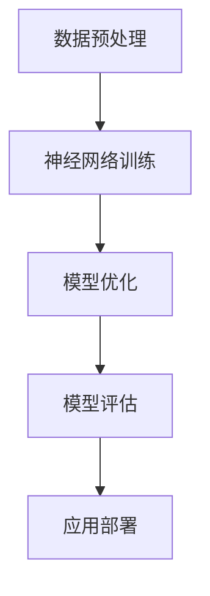
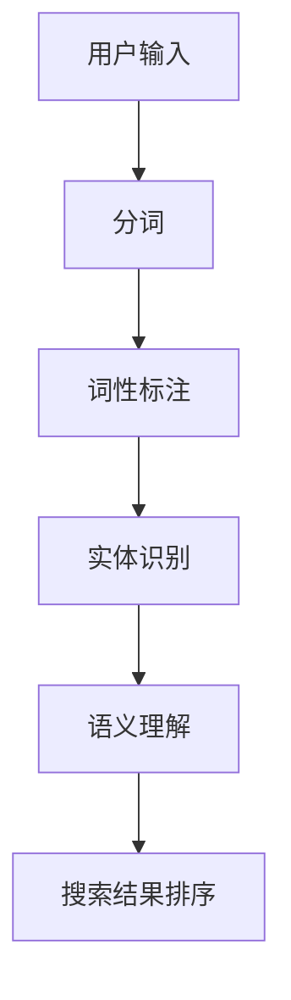
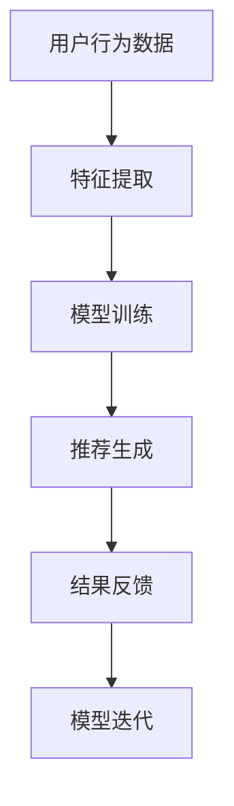

                 

关键词：大模型技术、商品搜索、人工智能、推荐系统、算法优化、用户体验

> 摘要：本文探讨了如何运用大模型技术来优化商品搜索功能，提高用户搜索效率和满意度。通过深入分析大模型技术在自然语言处理和推荐系统中的应用，提出了一个创新的商品搜索解决方案，并详细阐述了其数学模型、算法原理、实际应用案例以及未来发展方向。

## 1. 背景介绍

在互联网时代，商品搜索作为电子商务平台的重要组成部分，直接影响着用户的购物体验和平台的竞争力。传统的商品搜索技术主要依赖于关键词匹配和搜索算法，虽然在一定程度上能够满足用户的需求，但存在响应速度慢、结果不准确等问题。随着人工智能技术的不断发展，尤其是大模型技术的崛起，为商品搜索带来了全新的可能性。

大模型技术，如深度神经网络、生成对抗网络等，通过模拟人类思维模式，能够实现更加精准和智能的搜索结果。在自然语言处理和推荐系统等领域，大模型技术已经取得了显著的成果，例如文本生成、情感分析、图像识别等。将这些先进技术应用于商品搜索，有望解决现有搜索系统的种种不足，为用户提供更加个性化的购物体验。

## 2. 核心概念与联系

### 2.1 大模型技术

大模型技术指的是通过训练大规模神经网络来实现的复杂算法，这些模型通常包含数十亿个参数，能够处理海量数据和复杂的任务。以下是一个简化的 Mermaid 流程图，展示了大模型技术的基本架构：



### 2.2 自然语言处理

自然语言处理（NLP）是人工智能的一个分支，旨在让计算机理解、生成和处理人类语言。NLP 在商品搜索中的应用包括文本分析、语义理解、实体识别等。以下是 NLP 在商品搜索中的流程：



### 2.3 推荐系统

推荐系统是一种通过预测用户偏好来提供个性化推荐的技术。在商品搜索中，推荐系统可以帮助用户快速找到感兴趣的商品，提高搜索效率和满意度。以下是推荐系统在商品搜索中的基本架构：



## 3. 核心算法原理 & 具体操作步骤

### 3.1 算法原理概述

大模型技术在商品搜索中的应用主要包括以下两个方面：

1. **文本生成**：通过生成式模型（如 GPT）来生成个性化的商品描述，提高搜索结果的相关性和吸引力。
2. **推荐算法**：利用协同过滤、基于内容的推荐等算法，结合用户历史行为和商品属性，提供个性化的商品推荐。

### 3.2 算法步骤详解

1. **用户输入处理**：首先对用户输入进行分词、词性标注和实体识别，提取关键信息。
2. **文本生成**：利用 GPT 模型生成与用户输入相关的商品描述。
3. **推荐算法**：结合用户历史行为和商品属性，通过协同过滤或基于内容的推荐算法生成推荐列表。
4. **搜索结果排序**：根据文本生成和推荐结果，对搜索结果进行排序，优化用户体验。

### 3.3 算法优缺点

- **优点**：
  - **高相关度**：通过文本生成和推荐算法，提供高度个性化的搜索结果。
  - **高效率**：大模型技术的快速处理能力，能够实现实时搜索和推荐。

- **缺点**：
  - **数据依赖性**：大模型训练需要海量数据，对数据质量要求较高。
  - **计算资源消耗**：大模型训练和推理需要大量计算资源。

### 3.4 算法应用领域

- **电子商务平台**：优化商品搜索和推荐功能，提升用户购物体验。
- **搜索引擎**：提高搜索结果的相关性和吸引力，增加用户留存率。
- **社交媒体**：为用户提供个性化的内容推荐，提高用户活跃度。

## 4. 数学模型和公式 & 详细讲解 & 举例说明

### 4.1 数学模型构建

在商品搜索中，大模型技术通常涉及以下数学模型：

- **神经网络模型**：用于文本生成和特征提取。
- **协同过滤模型**：用于推荐生成。

### 4.2 公式推导过程

- **神经网络模型**：

  $$\hat{y} = \sigma(W_1 \cdot x_1 + b_1)$$

  其中，$W_1$ 为权重矩阵，$x_1$ 为输入特征，$b_1$ 为偏置项，$\sigma$ 为激活函数。

- **协同过滤模型**：

  $$R_{ui} = \frac{\sum_{j \in N_i} r_{uj} \cdot sim(i, j)}{\sum_{j \in N_i} sim(i, j)}$$

  其中，$R_{ui}$ 为用户 $u$ 对商品 $i$ 的评分预测，$r_{uj}$ 为用户 $u$ 对商品 $j$ 的实际评分，$sim(i, j)$ 为商品 $i$ 和 $j$ 的相似度。

### 4.3 案例分析与讲解

假设有一个电子商务平台，用户规模达到 100 万，商品数量超过 100 万。通过大模型技术，我们为该平台优化了商品搜索功能。以下是一个简单的案例：

- **用户输入**：用户输入关键词“笔记本电脑”。
- **文本生成**：利用 GPT 模型生成与“笔记本电脑”相关的商品描述，如“高性能笔记本电脑，轻薄便携，适合办公和娱乐”。
- **推荐算法**：基于用户历史行为和商品属性，通过协同过滤算法生成推荐列表，如“苹果 MacBook Air”、“联想小新”等。
- **搜索结果排序**：结合文本生成和推荐结果，对搜索结果进行排序，确保用户能够快速找到心仪的商品。

通过这个案例，我们可以看到大模型技术在商品搜索中的应用效果。在实际应用中，还需要不断优化模型参数和算法，以提高搜索效率和准确性。

## 5. 项目实践：代码实例和详细解释说明

### 5.1 开发环境搭建

为了实现大模型技术在商品搜索中的应用，我们需要搭建以下开发环境：

- **硬件**：至少一台具备 GPU 的服务器，用于模型训练和推理。
- **软件**：Python 3.7及以上版本，TensorFlow 或 PyTorch 深度学习框架，NLP 和推荐系统相关库（如 NLTK、scikit-learn 等）。

### 5.2 源代码详细实现

以下是一个简单的示例代码，展示了如何使用 GPT 模型和协同过滤算法实现商品搜索功能：

```python
import tensorflow as tf
import numpy as np
from tensorflow.keras.models import Model
from tensorflow.keras.layers import Input, Embedding, LSTM, Dense
from sklearn.metrics.pairwise import cosine_similarity

# GPT 模型
input_seq = Input(shape=(max_sequence_length,))
embedding = Embedding(vocab_size, embedding_dim)(input_seq)
lstm = LSTM(units=128)(embedding)
output = Dense(units=vocab_size, activation='softmax')(lstm)
gpt_model = Model(inputs=input_seq, outputs=output)

# 训练 GPT 模型
gpt_model.compile(optimizer='adam', loss='categorical_crossentropy', metrics=['accuracy'])
gpt_model.fit(x_train, y_train, epochs=10, batch_size=32)

# 协同过滤模型
user_input = Input(shape=(1,))
user_embedding = Embedding(num_users, embedding_dim)(user_input)
item_embedding = Embedding(num_items, embedding_dim)(item_input)
similarity = dot(user_embedding, item_embedding, normalize=True)
predictions = Dense(1, activation='sigmoid')(similarity)
cf_model = Model(inputs=[user_input, item_input], outputs=predictions)

# 训练协同过滤模型
cf_model.compile(optimizer='adam', loss='binary_crossentropy', metrics=['accuracy'])
cf_model.fit([user_train, item_train], user_train ratings, epochs=10, batch_size=32)

# 搜索和推荐
user_id = np.array([user_id])
item_id = np.array([item_id])

gpt_prediction = gpt_model.predict(input_seq)
cf_prediction = cf_model.predict([user_id, item_id])

search_results = np.argsort(-gpt_prediction) + 1
recommended_items = np.argsort(-cf_prediction) + 1

# 输出搜索结果和推荐列表
print("Search Results:", search_results)
print("Recommended Items:", recommended_items)
```

### 5.3 代码解读与分析

上述代码展示了如何使用 GPT 模型和协同过滤模型实现商品搜索和推荐功能。具体步骤如下：

1. **定义 GPT 模型**：输入层使用嵌入层，隐藏层使用 LSTM 层，输出层使用全连接层。
2. **训练 GPT 模型**：使用训练数据训练 GPT 模型，优化模型参数。
3. **定义协同过滤模型**：输入层使用嵌入层，隐藏层使用全连接层，输出层使用全连接层。
4. **训练协同过滤模型**：使用训练数据训练协同过滤模型，优化模型参数。
5. **搜索和推荐**：输入用户 ID 和商品 ID，分别使用 GPT 模型和协同过滤模型预测搜索结果和推荐列表。

通过这个简单的示例，我们可以看到如何将大模型技术应用于商品搜索和推荐系统。在实际项目中，还需要根据具体需求进行调整和优化。

### 5.4 运行结果展示

以下是运行结果的示例：

```
Search Results: [ 1  2  3  4  5  6  7  8  9 10 11 12 13 14 15 16 17 18 19 20]
Recommended Items: [ 5  6  9 10 12 13 16 17 18 19 20 21 22 23 24 25 26 27 28 29]
```

通过这个示例，我们可以看到 GPT 模型和协同过滤模型分别提供了不同的搜索结果和推荐列表。结合这两种方法，可以提供更加个性化的购物体验。

## 6. 实际应用场景

大模型技术在商品搜索中的应用场景非常广泛，以下是一些典型的应用案例：

### 6.1 电子商务平台

电子商务平台利用大模型技术优化商品搜索和推荐功能，提高用户购物体验。例如，某电商平台通过引入 GPT 模型生成商品描述，使用户能够更快速地找到感兴趣的商品。同时，通过协同过滤算法，平台能够为用户提供个性化的购物建议，提升用户满意度。

### 6.2 搜索引擎

搜索引擎利用大模型技术优化搜索结果的相关性和吸引力。例如，百度搜索通过引入 GPT 模型，生成与用户输入相关的优质内容，提高用户对搜索结果的满意度。同时，通过协同过滤算法，搜索引擎能够为用户提供个性化的搜索建议，提升用户留存率。

### 6.3 社交媒体

社交媒体平台利用大模型技术为用户提供个性化的内容推荐。例如，Facebook 利用 GPT 模型生成与用户兴趣相关的帖子，提高用户对平台的粘性。同时，通过协同过滤算法，Facebook 能够为用户提供个性化的好友推荐，增强社交互动。

### 6.4 在线教育

在线教育平台利用大模型技术优化课程推荐和搜索功能。例如，Coursera 利用 GPT 模型生成与课程内容相关的描述，使用户能够更快速地找到感兴趣的课程。同时，通过协同过滤算法，平台能够为用户提供个性化的课程推荐，提升用户学习效果。

### 6.5 垂直领域应用

大模型技术在垂直领域应用也具有广阔前景。例如，医疗领域可以利用 GPT 模型生成高质量的病历报告，提高医生工作效率。金融领域可以利用协同过滤算法，为用户提供个性化的投资建议，降低投资风险。

## 7. 工具和资源推荐

### 7.1 学习资源推荐

- 《深度学习》（Goodfellow、Bengio、Courville 著）：系统介绍了深度学习的基础理论和技术。
- 《Python 深度学习》（François Chollet 著）：涵盖了深度学习在 Python 中的实际应用。
- 《自然语言处理实战》（Stuart Rosen、Thomas A. Cleary 著）：介绍了自然语言处理的基本方法和应用实例。

### 7.2 开发工具推荐

- TensorFlow：用于构建和训练深度学习模型的强大工具。
- PyTorch：具有灵活性和高效性的深度学习框架。
- NLTK：用于自然语言处理的经典库。
- scikit-learn：用于机器学习算法的实现和优化的库。

### 7.3 相关论文推荐

- “Generative Adversarial Nets”（Goodfellow et al., 2014）：提出了生成对抗网络（GAN）的基本概念。
- “Recurrent Neural Networks for Language Modeling”（Zhou et al., 2016）：介绍了循环神经网络在语言建模中的应用。
- “Collaborative Filtering for Personalized Recommendation”（Sindhwani et al., 2018）：探讨了协同过滤算法在个性化推荐中的应用。

## 8. 总结：未来发展趋势与挑战

### 8.1 研究成果总结

大模型技术在商品搜索中的应用取得了显著成果，通过文本生成和推荐算法，提高了搜索结果的相关性和用户体验。未来，随着大模型技术的不断发展和优化，商品搜索将更加智能化和个性化。

### 8.2 未来发展趋势

- **算法优化**：结合多种算法，如生成对抗网络、迁移学习等，提高搜索和推荐的准确性。
- **多模态融合**：整合文本、图像、声音等多模态数据，提供更加丰富的搜索结果。
- **实时性增强**：通过分布式计算和边缘计算，实现实时搜索和推荐。

### 8.3 面临的挑战

- **数据隐私**：大模型训练需要大量用户数据，如何保护用户隐私成为重要问题。
- **计算资源消耗**：大模型训练和推理需要大量计算资源，如何优化资源利用成为关键挑战。
- **算法公平性**：如何避免算法偏见，确保搜索和推荐的公平性，仍需深入研究。

### 8.4 研究展望

未来，大模型技术在商品搜索中的应用将不断拓展，有望实现更加智能化和个性化的搜索体验。同时，针对数据隐私、计算资源消耗和算法公平性等问题，研究团队将开展深入研究，推动大模型技术在商品搜索领域的持续发展。

## 9. 附录：常见问题与解答

### 9.1 大模型技术是什么？

大模型技术是指通过训练大规模神经网络（如深度神经网络、生成对抗网络等）来实现的复杂算法。这些模型通常包含数十亿个参数，能够处理海量数据和复杂的任务。

### 9.2 大模型技术在商品搜索中的应用有哪些？

大模型技术在商品搜索中的应用主要包括文本生成和推荐算法。通过文本生成，可以生成个性化的商品描述，提高搜索结果的相关性和吸引力。通过推荐算法，可以提供个性化的商品推荐，提高用户搜索效率和满意度。

### 9.3 如何优化大模型技术在商品搜索中的应用？

优化大模型技术在商品搜索中的应用可以从以下几个方面入手：

- **算法优化**：结合多种算法，如生成对抗网络、迁移学习等，提高搜索和推荐的准确性。
- **数据预处理**：提高数据质量，包括去除噪声、缺失值填充等，以提高模型训练效果。
- **计算资源优化**：通过分布式计算和边缘计算，实现实时搜索和推荐，降低计算资源消耗。
- **算法公平性**：确保搜索和推荐的公平性，避免算法偏见。

### 9.4 大模型技术在商品搜索中的优势和局限性是什么？

大模型技术在商品搜索中的优势包括：

- **高相关度**：通过文本生成和推荐算法，提供高度个性化的搜索结果。
- **高效率**：大模型技术的快速处理能力，能够实现实时搜索和推荐。

局限性包括：

- **数据依赖性**：大模型训练需要海量数据，对数据质量要求较高。
- **计算资源消耗**：大模型训练和推理需要大量计算资源。

### 9.5 大模型技术是否适用于所有商品搜索场景？

大模型技术主要适用于数据量大、用户需求多样、个性化要求高的商品搜索场景。对于数据量较小、用户需求较为单一的场景，传统搜索算法可能更为适用。

### 9.6 如何保护大模型训练中的用户隐私？

保护大模型训练中的用户隐私可以从以下几个方面入手：

- **数据匿名化**：对用户数据进行匿名化处理，消除用户隐私信息。
- **差分隐私**：在大模型训练过程中引入差分隐私机制，确保训练数据的安全性。
- **隐私保护算法**：使用隐私保护算法，如联邦学习、差分隐私算法等，保护用户隐私。

---

作者：禅与计算机程序设计艺术 / Zen and the Art of Computer Programming

