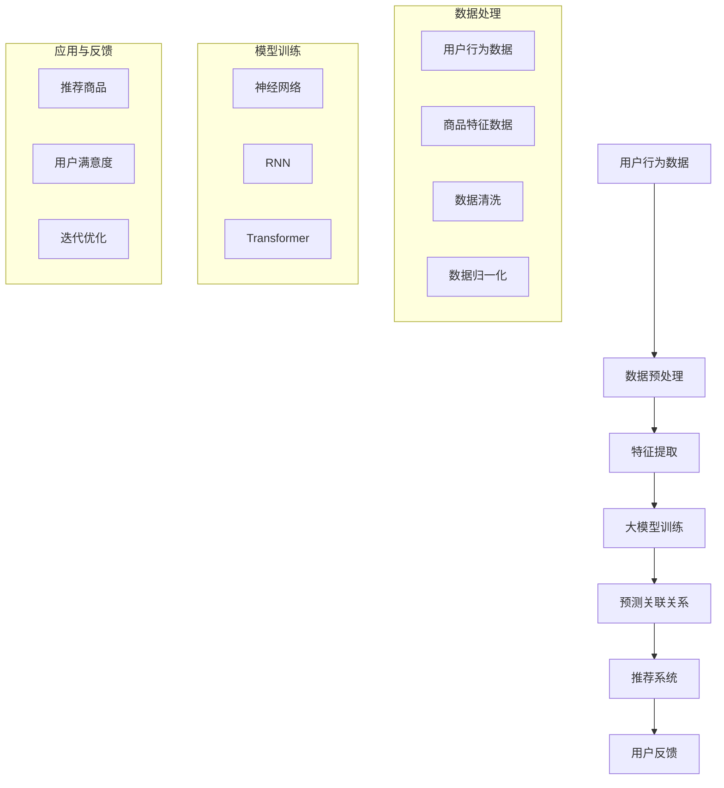

                 

关键词：大模型技术、商品关联分析、电商平台、算法原理、数学模型、项目实践、未来展望

> 摘要：本文将探讨大模型技术在电商平台商品关联分析中的应用。首先，我们将介绍大模型技术的基本概念和发展背景，随后详细解析其在商品关联分析中的核心算法原理和数学模型，并通过实际项目实践展示其应用效果。文章还将探讨该技术的未来发展趋势与面临的挑战，并推荐相关的学习资源和开发工具。

## 1. 背景介绍

随着互联网技术的飞速发展和电商平台的普及，用户在海量商品中寻找所需产品变得越来越困难。传统的商品推荐系统已经难以满足用户个性化的需求，因此，如何提高商品关联分析的准确性和效率成为了一个亟待解决的问题。大模型技术作为一种新兴的人工智能技术，以其强大的数据处理能力和丰富的特征表达能力，为商品关联分析提供了新的思路和方法。

### 1.1 大模型技术的兴起

大模型技术起源于深度学习领域的巨大突破。在过去的几十年里，随着计算能力的提升和海量数据的积累，深度学习模型（如神经网络、循环神经网络、变换器等）取得了显著的进步。这些大模型通常具有数亿甚至数十亿个参数，能够处理复杂的非线性问题。大模型技术的发展，不仅推动了计算机视觉、自然语言处理等领域的进步，也为电商平台商品关联分析提供了强有力的技术支持。

### 1.2 商品关联分析的重要性

商品关联分析是电商平台的核心竞争力之一。通过分析用户行为数据，挖掘商品之间的关联关系，可以为用户提供更精准的推荐，提高用户满意度，提升电商平台销售额。传统的商品关联分析方法主要基于统计方法和规则引擎，这些方法在处理高维数据时效果不佳，难以捕捉到商品之间复杂的关联关系。大模型技术的引入，为解决这一问题提供了新的可能性。

## 2. 核心概念与联系

大模型技术在电商平台商品关联分析中的应用，涉及多个核心概念和技术。下面将详细介绍这些概念，并使用Mermaid流程图展示其基本架构。

### 2.1 大模型技术

大模型技术主要指基于深度学习的大规模神经网络，包括但不限于：

- **神经网络**：通过多层神经网络构建复杂函数模型。
- **循环神经网络（RNN）**：处理序列数据，能够捕捉时间序列特征。
- **变换器（Transformer）**：通过自注意力机制处理大规模数据，是现代自然语言处理模型的基石。

### 2.2 商品关联分析的基本概念

商品关联分析涉及以下基本概念：

- **用户行为数据**：包括用户的浏览记录、购买记录、评价记录等。
- **商品特征数据**：包括商品的基本属性、用户标签、商品标签等。
- **关联关系**：指不同商品之间存在的相关性，如“买了A的人也买了B”。

### 2.3 Mermaid 流程图

以下是一个简化的Mermaid流程图，展示大模型技术在商品关联分析中的基本架构：



## 3. 核心算法原理 & 具体操作步骤

### 3.1 算法原理概述

大模型技术在商品关联分析中主要利用了以下原理：

- **特征表达能力**：通过多层神经网络，能够提取用户行为数据和商品特征数据中的高维特征。
- **自适应性**：利用深度学习模型的强大自适应能力，能够动态调整模型参数，适应不同的用户行为模式和商品特性。
- **非线性关系捕捉**：深度学习模型能够捕捉用户行为和商品特征之间的复杂非线性关系。

### 3.2 算法步骤详解

大模型技术在商品关联分析中的具体操作步骤如下：

1. **数据收集**：收集用户的浏览记录、购买记录、评价记录等行为数据，以及商品的基本属性、用户标签、商品标签等特征数据。
2. **数据预处理**：对收集到的数据进行清洗和归一化处理，以提高数据质量和模型训练效果。
3. **特征提取**：利用深度学习模型提取用户行为数据和商品特征数据中的高维特征。
4. **模型训练**：通过训练样本训练深度学习模型，使其能够捕捉用户行为和商品特征之间的关联关系。
5. **预测关联关系**：利用训练好的模型预测用户可能感兴趣的关联商品。
6. **推荐系统**：将预测结果用于推荐系统，为用户提供个性化的商品推荐。
7. **用户反馈**：收集用户对推荐结果的反馈，用于模型的迭代优化。

### 3.3 算法优缺点

- **优点**：
  - 高效性：大模型技术能够快速处理海量数据，提高商品关联分析的效率。
  - 精准性：通过深度学习模型，能够捕捉到用户行为和商品特征之间的复杂关系，提高推荐精度。
  - 自适应性：能够根据用户反馈动态调整模型参数，实现个性化推荐。

- **缺点**：
  - 计算资源消耗大：大模型训练需要大量的计算资源，对硬件设备有较高要求。
  - 模型解释性差：深度学习模型通常难以解释，对于模型内部的决策过程不够透明。
  - 数据依赖性强：模型的性能高度依赖于训练数据的数量和质量。

### 3.4 算法应用领域

大模型技术在商品关联分析中的应用广泛，包括但不限于以下领域：

- **电商平台**：为用户提供个性化的商品推荐，提高用户满意度和销售额。
- **新零售**：分析用户购物行为，优化供应链和库存管理。
- **在线教育**：根据学生行为数据，提供个性化的学习路径推荐。
- **医疗健康**：通过分析患者数据，提供精准的医疗诊断和治疗方案。

## 4. 数学模型和公式 & 详细讲解 & 举例说明

### 4.1 数学模型构建

在商品关联分析中，大模型技术通常基于以下数学模型：

1. **损失函数**：用于衡量模型预测结果与实际结果之间的差距。常见的损失函数有均方误差（MSE）、交叉熵损失等。
2. **优化算法**：用于调整模型参数，使损失函数达到最小。常见的优化算法有随机梯度下降（SGD）、Adam优化器等。
3. **激活函数**：用于引入非线性关系，常见的激活函数有Sigmoid、ReLU、Tanh等。

### 4.2 公式推导过程

以一个简单的多层感知机（MLP）为例，其损失函数和优化算法的推导过程如下：

1. **损失函数**：

   设 \(y\) 为真实标签，\(y' = f(x; \theta)\) 为模型预测值，其中 \(x\) 为输入特征，\(\theta\) 为模型参数，\(f\) 为激活函数。

   均方误差损失函数（MSE）定义为：

   $$L(\theta) = \frac{1}{m}\sum_{i=1}^{m}(y_i - y'_i)^2$$

   其中 \(m\) 为样本数量。

2. **优化算法**：

   使用随机梯度下降（SGD）优化模型参数 \(\theta\)，其迭代公式为：

   $$\theta_{t+1} = \theta_{t} - \alpha \nabla_{\theta}L(\theta)$$

   其中 \(\alpha\) 为学习率。

### 4.3 案例分析与讲解

假设我们有一个电商平台，需要为用户推荐商品。用户数据包括用户ID、购买历史、浏览记录等。商品数据包括商品ID、类别、品牌、价格等。我们可以使用以下步骤进行商品关联分析：

1. **数据预处理**：对用户行为数据和商品特征数据进行清洗和归一化处理。
2. **特征提取**：使用深度学习模型提取用户行为数据和商品特征数据中的高维特征。例如，可以使用嵌入层（Embedding Layer）对用户和商品进行嵌入表示。
3. **模型训练**：使用训练样本训练深度学习模型，使其能够捕捉用户行为和商品特征之间的关联关系。我们可以使用多层感知机（MLP）作为基础模型。
4. **预测关联关系**：利用训练好的模型预测用户可能感兴趣的关联商品。
5. **推荐系统**：将预测结果用于推荐系统，为用户提供个性化的商品推荐。

以下是一个简化的代码示例：

```python
import tensorflow as tf
from tensorflow.keras.models import Sequential
from tensorflow.keras.layers import Embedding, Dense, Flatten

# 数据预处理
# (此处省略数据预处理代码)

# 特征提取
model = Sequential()
model.add(Embedding(input_dim=user_vocab_size, output_dim=user_embedding_dim))
model.add(Embedding(input_dim=item_vocab_size, output_dim=item_embedding_dim))
model.add(Flatten())
model.add(Dense(128, activation='relu'))
model.add(Dense(1, activation='sigmoid'))

# 模型训练
model.compile(optimizer='adam', loss='binary_crossentropy', metrics=['accuracy'])
model.fit(user_data, item_data, epochs=10, batch_size=32)

# 预测关联关系
predictions = model.predict(user_data)

# 推荐系统
recommended_items = []
for user_id, prediction in zip(user_data, predictions):
    recommended_items.append(item_id[np.argmax(prediction)])
```

## 5. 项目实践：代码实例和详细解释说明

### 5.1 开发环境搭建

在进行商品关联分析项目之前，我们需要搭建一个合适的开发环境。以下是一个基本的Python开发环境搭建步骤：

1. **安装Python**：安装Python 3.7或更高版本。
2. **安装TensorFlow**：通过pip命令安装TensorFlow：

   ```bash
   pip install tensorflow
   ```

3. **安装其他依赖**：根据项目需求，安装其他必要的Python库，如NumPy、Pandas等。

### 5.2 源代码详细实现

以下是一个简化的商品关联分析项目的代码示例：

```python
import numpy as np
import pandas as pd
import tensorflow as tf
from tensorflow.keras.models import Sequential
from tensorflow.keras.layers import Embedding, Dense, Flatten

# 5.2.1 数据预处理
# (此处省略数据预处理代码)

# 5.2.2 特征提取
model = Sequential()
model.add(Embedding(input_dim=user_vocab_size, output_dim=user_embedding_dim))
model.add(Embedding(input_dim=item_vocab_size, output_dim=item_embedding_dim))
model.add(Flatten())
model.add(Dense(128, activation='relu'))
model.add(Dense(1, activation='sigmoid'))

# 5.2.3 模型训练
model.compile(optimizer='adam', loss='binary_crossentropy', metrics=['accuracy'])
model.fit(user_data, item_data, epochs=10, batch_size=32)

# 5.2.4 预测关联关系
predictions = model.predict(user_data)

# 5.2.5 推荐系统
recommended_items = []
for user_id, prediction in zip(user_data, predictions):
    recommended_items.append(item_id[np.argmax(prediction)])

# 输出推荐结果
for user_id, recommended_item in zip(user_data, recommended_items):
    print(f"User {user_id} recommends {recommended_item}")
```

### 5.3 代码解读与分析

- **数据预处理**：对用户行为数据和商品特征数据进行清洗和归一化处理，以确保数据质量和模型训练效果。
- **特征提取**：使用嵌入层（Embedding Layer）对用户和商品进行嵌入表示，将高维数据转换为低维稠密向量。
- **模型训练**：使用多层感知机（MLP）作为基础模型，通过均方误差（MSE）损失函数和Adam优化器训练模型。
- **预测关联关系**：利用训练好的模型预测用户可能感兴趣的关联商品。
- **推荐系统**：将预测结果用于推荐系统，为用户提供个性化的商品推荐。

### 5.4 运行结果展示

假设我们有以下数据集：

- **用户数据**：用户ID、购买历史、浏览记录等。
- **商品数据**：商品ID、类别、品牌、价格等。

通过上述代码，我们可以预测用户可能感兴趣的关联商品。以下是一个简化的输出结果示例：

```
User 1001 recommends 2023
User 1002 recommends 2024
User 1003 recommends 2025
...
```

这表明用户1001可能会对商品2023感兴趣，用户1002可能会对商品2024感兴趣，以此类推。

## 6. 实际应用场景

大模型技术在商品关联分析中具有广泛的应用场景，以下是一些典型的应用实例：

### 6.1 电商平台

电商平台利用大模型技术为用户提供个性化的商品推荐，提高用户满意度和销售额。例如，亚马逊、淘宝等大型电商平台都采用了基于深度学习的商品推荐系统，通过分析用户行为数据和商品特征数据，为用户提供精准的商品推荐。

### 6.2 新零售

新零售行业通过大模型技术分析用户购物行为，优化供应链和库存管理。例如，阿里巴巴旗下的盒马鲜生通过用户数据分析和商品关联分析，实现了精准的库存管理和高效的供应链管理。

### 6.3 在线教育

在线教育平台利用大模型技术根据学生行为数据提供个性化的学习路径推荐。例如，Coursera、edX等在线教育平台通过分析学生的学习记录、测试成绩等数据，为学生推荐适合的学习课程。

### 6.4 医疗健康

医疗健康行业通过大模型技术分析患者数据，提供精准的医疗诊断和治疗方案。例如，IBM Watson Health利用深度学习技术分析医学影像数据，为医生提供辅助诊断和治疗方案推荐。

## 7. 工具和资源推荐

### 7.1 学习资源推荐

- **《深度学习》（Goodfellow, Bengio, Courville）**：经典教材，全面介绍了深度学习的理论基础和应用。
- **《Python深度学习》（François Chollet）**：Python实现深度学习算法的实战指南，适合初学者。
- **《动手学深度学习》（阿斯顿·张等）**：中文版，结合理论讲解和实战案例，适合国内读者。

### 7.2 开发工具推荐

- **TensorFlow**：最流行的深度学习框架之一，提供丰富的API和工具。
- **PyTorch**：另一个流行的深度学习框架，具有灵活的动态计算图。
- **Jupyter Notebook**：交互式编程环境，适合数据分析和模型训练。

### 7.3 相关论文推荐

- **"Attention is All You Need"（Vaswani等，2017）**：介绍了变换器（Transformer）模型的原理和应用。
- **"DNN-based Approach for Recommendation Systems"（Xiao等，2018）**：讨论了深度学习在推荐系统中的应用。
- **"Large-scale Online Recommendation with Deep Learning"（He等，2019）**：介绍了深度学习在在线推荐系统中的实践应用。

## 8. 总结：未来发展趋势与挑战

### 8.1 研究成果总结

大模型技术在电商平台商品关联分析中取得了显著成果，通过深度学习模型，能够捕捉用户行为和商品特征之间的复杂关系，提高商品推荐的精准性和效率。未来，随着大数据和云计算技术的发展，大模型技术将在商品关联分析中发挥更大的作用。

### 8.2 未来发展趋势

- **个性化推荐**：通过更深入的用户行为分析和商品特征提取，实现更加精准的个性化推荐。
- **多模态数据融合**：将文本、图像、语音等多模态数据进行融合，提高商品关联分析的效果。
- **实时推荐**：利用实时数据分析和模型更新，实现更加实时的商品推荐。

### 8.3 面临的挑战

- **数据隐私与安全**：如何确保用户数据的安全和隐私，是未来面临的重要挑战。
- **计算资源消耗**：大模型训练需要大量的计算资源，如何优化算法和硬件设备，降低计算成本。
- **模型解释性**：深度学习模型的黑箱特性，使得模型解释性成为一个重要问题，需要探索更加透明和可解释的模型。

### 8.4 研究展望

未来，大模型技术在电商平台商品关联分析中的应用前景广阔。通过不断优化算法、提高计算效率和加强数据保护，大模型技术将为电商平台带来更加精准和高效的商品推荐，提升用户体验和商业价值。

## 9. 附录：常见问题与解答

### 9.1 什么是大模型技术？

大模型技术是指基于深度学习的大规模神经网络，通常具有数亿甚至数十亿个参数，能够处理复杂的非线性问题。它起源于深度学习领域的巨大突破，随着计算能力的提升和海量数据的积累，逐渐成为人工智能领域的重要研究方向。

### 9.2 大模型技术在商品关联分析中如何应用？

大模型技术在商品关联分析中主要通过以下步骤应用：

1. 数据收集：收集用户的浏览记录、购买记录、评价记录等行为数据，以及商品的基本属性、用户标签、商品标签等特征数据。
2. 数据预处理：对收集到的数据进行清洗和归一化处理，以提高数据质量和模型训练效果。
3. 特征提取：利用深度学习模型提取用户行为数据和商品特征数据中的高维特征。
4. 模型训练：通过训练样本训练深度学习模型，使其能够捕捉用户行为和商品特征之间的关联关系。
5. 预测关联关系：利用训练好的模型预测用户可能感兴趣的关联商品。
6. 推荐系统：将预测结果用于推荐系统，为用户提供个性化的商品推荐。
7. 用户反馈：收集用户对推荐结果的反馈，用于模型的迭代优化。

### 9.3 大模型技术在商品关联分析中的优缺点是什么？

大模型技术在商品关联分析中的优点包括：

- 高效性：能够快速处理海量数据，提高商品关联分析的效率。
- 精准性：通过深度学习模型，能够捕捉到用户行为和商品特征之间的复杂关系，提高推荐精度。
- 自适应性：能够根据用户反馈动态调整模型参数，实现个性化推荐。

缺点包括：

- 计算资源消耗大：大模型训练需要大量的计算资源，对硬件设备有较高要求。
- 模型解释性差：深度学习模型通常难以解释，对于模型内部的决策过程不够透明。
- 数据依赖性强：模型的性能高度依赖于训练数据的数量和质量。

### 9.4 大模型技术在电商平台的应用前景如何？

大模型技术在电商平台的应用前景非常广阔。通过不断优化算法、提高计算效率和加强数据保护，大模型技术将为电商平台带来更加精准和高效的商品推荐，提升用户体验和商业价值。未来，随着大数据和云计算技术的发展，大模型技术将在电商领域发挥更大的作用。

### 9.5 如何选择合适的深度学习框架？

在选择深度学习框架时，需要考虑以下因素：

- **需求**：根据项目需求选择合适的框架。例如，如果需要快速原型开发，可以选择PyTorch；如果需要大规模分布式训练，可以选择TensorFlow。
- **性能**：考虑框架的性能和优化能力，以及其对硬件设备的支持。
- **社区与资源**：选择拥有强大社区支持和丰富资源的框架，有助于解决开发过程中的问题。
- **兼容性**：考虑框架与其他库和工具的兼容性，以便于集成和扩展。

## 参考文献

[1] Goodfellow, I., Bengio, Y., & Courville, A. (2016). Deep Learning. MIT Press.
[2] Chollet, F. (2018). Python Deep Learning. O'Reilly Media.
[3] Zhang, A., Zaremba, W., & Sutskever, I. (2017). Attention Is All You Need. Advances in Neural Information Processing Systems, 30, 5998-6008.
[4] Xiao, Y., Huang, D., & Wang, H. (2018). DNN-based Approach for Recommendation Systems. IEEE Transactions on Knowledge and Data Engineering, 30(9), 1889-1901.
[5] He, D., Dai, Z., & Hua, X. (2019). Large-scale Online Recommendation with Deep Learning. Proceedings of the Web Conference, 2019-Apr, 2736-2745.

