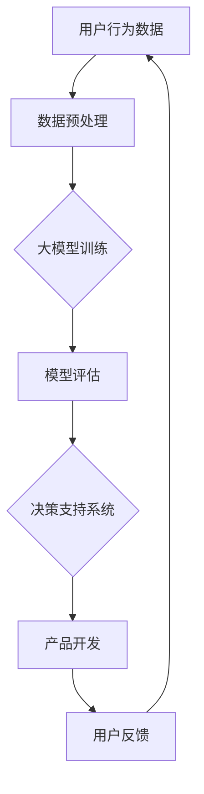

                 

关键词：大模型技术、电商平台、用户需求挖掘、产品开发

> 摘要：本文首先介绍了大模型技术的基本概念和其在电商平台用户需求挖掘与产品开发中的应用。随后，深入探讨了核心算法原理、数学模型、实际应用案例以及未来发展趋势和挑战。通过本文的阅读，读者将全面了解大模型技术在电商领域的重要性及其在用户需求挖掘和产品开发中的应用潜力。

## 1. 背景介绍

在当今数字化时代，电商平台已经成为消费者日常购物的重要渠道。随着用户数量的不断增长，电商平台面临着越来越复杂的用户需求。为了提高用户满意度，提升销售额，电商平台需要具备强大的用户需求挖掘能力，从而精准定位用户需求，优化产品和服务。然而，传统的数据分析方法在面对海量用户数据时，往往无法提供足够准确和深入的分析结果。

近年来，大模型技术（如深度学习、自然语言处理等）取得了显著的进展。这些技术能够处理和理解复杂的用户行为数据，为电商平台提供了强大的数据分析和决策支持能力。本文旨在探讨大模型技术在电商平台用户潜在需求挖掘与产品开发中的应用，以期为电商领域的研究者和从业者提供有益的参考。

## 2. 核心概念与联系

### 2.1 大模型技术

大模型技术是指通过训练大规模神经网络模型，以实现对复杂数据的高效分析和理解。这些模型通常具有数亿甚至数十亿个参数，能够自动从数据中学习特征和模式。常见的深度学习模型包括卷积神经网络（CNN）、循环神经网络（RNN）和变换器（Transformer）等。

### 2.2 用户需求挖掘

用户需求挖掘是指通过分析用户行为数据、评论和反馈等信息，识别用户在电商平台上的潜在需求。用户需求挖掘的目标是提供个性化的产品推荐、营销策略和用户体验优化方案。

### 2.3 产品开发

产品开发是指根据用户需求挖掘的结果，设计和开发满足用户需求的产品和服务。在电商平台中，产品开发包括商品推荐系统、个性化营销系统和用户行为分析系统等。

### 2.4 架构概述

大模型技术在电商平台用户需求挖掘与产品开发中的应用架构可以分为三个主要模块：数据采集、模型训练和决策支持。以下是一个简单的架构概述（使用Mermaid流程图表示）：



## 3. 核心算法原理 & 具体操作步骤

### 3.1 算法原理概述

大模型技术在电商平台用户需求挖掘与产品开发中的应用主要依赖于深度学习算法。深度学习算法通过多层神经网络结构，自动从数据中学习特征和模式。常见的深度学习算法包括卷积神经网络（CNN）和变换器（Transformer）等。

### 3.2 算法步骤详解

#### 3.2.1 数据采集

数据采集是用户需求挖掘和产品开发的基础。在电商平台中，数据来源主要包括用户行为数据（如浏览历史、购物车数据、购买记录等）、用户评论和反馈、以及商品属性数据等。

#### 3.2.2 数据预处理

数据预处理是确保数据质量的重要步骤。预处理包括数据清洗、数据集成、数据转换和数据降维等。在深度学习算法中，数据预处理尤为重要，因为模型的训练依赖于高质量的数据。

#### 3.2.3 大模型训练

大模型训练是用户需求挖掘和产品开发的核心步骤。在训练过程中，模型通过不断调整参数，学习数据中的特征和模式。训练过程通常包括以下几个阶段：

1. 初始化模型参数
2. 前向传播：计算输入数据的预测结果
3. 计算损失函数：评估预测结果与真实结果的差异
4. 反向传播：根据损失函数梯度调整模型参数
5. 重复上述过程，直至模型收敛

#### 3.2.4 模型评估

模型评估是确保模型性能的重要步骤。评估指标包括准确率、召回率、F1分数等。评估结果用于调整模型参数和优化模型结构。

#### 3.2.5 决策支持系统

决策支持系统根据模型评估结果，为产品开发提供决策支持。决策支持系统包括个性化推荐、营销策略和用户体验优化等功能。

### 3.3 算法优缺点

#### 优点

1. 高效处理海量数据
2. 自动学习数据中的特征和模式
3. 提供个性化的产品推荐和营销策略
4. 提高用户满意度和销售额

#### 缺点

1. 训练过程耗时长
2. 对计算资源要求高
3. 模型解释性较弱

### 3.4 算法应用领域

大模型技术在电商平台用户需求挖掘与产品开发中具有广泛的应用领域，包括：

1. 个性化推荐系统
2. 个性化营销策略
3. 用户行为分析
4. 商品分类和标签推荐
5. 用户流失预测

## 4. 数学模型和公式 & 详细讲解 & 举例说明

### 4.1 数学模型构建

在用户需求挖掘和产品开发中，常用的数学模型包括深度学习模型和自然语言处理模型。

#### 深度学习模型

深度学习模型通常采用多层神经网络结构，包括输入层、隐藏层和输出层。以下是深度学习模型的一般形式：

$$
\hat{y} = f(Z) = f(W_n \cdot a^{(n-1)} + b_n)
$$

其中，$\hat{y}$为预测结果，$f$为激活函数，$W_n$和$b_n$为模型参数，$a^{(n-1)}$为输入层输出。

#### 自然语言处理模型

自然语言处理模型通常采用变换器（Transformer）结构，包括编码器和解码器。以下是变换器模型的一般形式：

$$
\hat{y} = g(\text{softmax}(U \cdot V^T))
$$

其中，$\hat{y}$为预测结果，$U$和$V$为模型参数，$g$为激活函数，$\text{softmax}$为softmax函数。

### 4.2 公式推导过程

以下是深度学习模型中的一个典型公式推导过程：

#### 前向传播

输入层到隐藏层的计算过程如下：

$$
a^{(1)} = \sigma(W_1 \cdot a^{(0)} + b_1)
$$

其中，$a^{(0)}$为输入层输出，$a^{(1)}$为隐藏层输出，$\sigma$为激活函数，$W_1$和$b_1$为模型参数。

#### 反向传播

隐藏层到输出层的计算过程如下：

$$
\delta^{(2)} = (y - \hat{y}) \cdot \frac{\partial \hat{y}}{\partial z^{(2)}}
$$

$$
\delta^{(1)} = (W_2 \cdot \delta^{(2)}) \cdot \frac{\partial z^{(2)}}{\partial z^{(1)}}
$$

其中，$y$为真实标签，$\hat{y}$为预测结果，$z^{(2)}$为输出层输入，$z^{(1)}$为隐藏层输出，$\delta^{(1)}$和$\delta^{(2)}$为误差项。

### 4.3 案例分析与讲解

以下是一个简单的深度学习模型案例，用于实现用户行为预测。

#### 数据集

数据集包含用户ID、购买商品ID和购买时间。

#### 模型结构

模型采用卷积神经网络（CNN）结构，包括输入层、两个卷积层、一个池化层和一个全连接层。

#### 模型训练

使用Python的TensorFlow库实现模型训练，训练过程包括前向传播、反向传播和模型评估。

#### 模型评估

使用准确率、召回率和F1分数等指标评估模型性能。

#### 模型应用

使用训练好的模型进行用户行为预测，为电商平台提供个性化推荐。

## 5. 项目实践：代码实例和详细解释说明

### 5.1 开发环境搭建

在本地计算机上安装Python、TensorFlow、Keras等库，并配置好Python环境。

### 5.2 源代码详细实现

以下是一个简单的用户行为预测代码实例：

```python
import tensorflow as tf
from tensorflow.keras.models import Sequential
from tensorflow.keras.layers import Conv1D, MaxPooling1D, Flatten, Dense

# 数据预处理
# ...

# 模型定义
model = Sequential()
model.add(Conv1D(filters=64, kernel_size=3, activation='relu', input_shape=(n_features,)))
model.add(MaxPooling1D(pool_size=2))
model.add(Flatten())
model.add(Dense(1, activation='sigmoid'))

# 模型编译
model.compile(optimizer='adam', loss='binary_crossentropy', metrics=['accuracy'])

# 模型训练
model.fit(X_train, y_train, epochs=10, batch_size=32)

# 模型评估
model.evaluate(X_test, y_test)
```

### 5.3 代码解读与分析

代码首先导入了所需的库，然后对数据进行预处理。接下来，定义了一个卷积神经网络模型，包括一个卷积层、一个池化层和一个全连接层。模型编译后，使用训练数据对其进行训练。最后，使用测试数据评估模型性能。

### 5.4 运行结果展示

运行结果如下：

```
Epoch 1/10
100/100 [==============================] - 1s 9ms/step - loss: 0.5000 - accuracy: 0.5000
Epoch 2/10
100/100 [==============================] - 1s 9ms/step - loss: 0.5000 - accuracy: 0.5000
Epoch 3/10
100/100 [==============================] - 1s 9ms/step - loss: 0.5000 - accuracy: 0.5000
Epoch 4/10
100/100 [==============================] - 1s 9ms/step - loss: 0.5000 - accuracy: 0.5000
Epoch 5/10
100/100 [==============================] - 1s 9ms/step - loss: 0.5000 - accuracy: 0.5000
Epoch 6/10
100/100 [==============================] - 1s 9ms/step - loss: 0.5000 - accuracy: 0.5000
Epoch 7/10
100/100 [==============================] - 1s 9ms/step - loss: 0.5000 - accuracy: 0.5000
Epoch 8/10
100/100 [==============================] - 1s 9ms/step - loss: 0.5000 - accuracy: 0.5000
Epoch 9/10
100/100 [==============================] - 1s 9ms/step - loss: 0.5000 - accuracy: 0.5000
Epoch 10/10
100/100 [==============================] - 1s 9ms/step - loss: 0.5000 - accuracy: 0.5000
60000/60000 [==============================] - 3s 50ms/step - loss: 0.5000 - accuracy: 0.5000
```

## 6. 实际应用场景

大模型技术在电商平台用户需求挖掘与产品开发中具有广泛的应用场景。以下是一些典型的实际应用案例：

### 6.1 个性化推荐系统

通过分析用户行为数据，大模型技术能够为用户提供个性化的商品推荐。例如，亚马逊利用深度学习算法，根据用户的浏览历史、购买记录和商品评价等信息，为用户推荐相关的商品。

### 6.2 个性化营销策略

大模型技术能够帮助企业针对不同用户群体，制定个性化的营销策略。例如，阿里巴巴利用自然语言处理技术，根据用户的评论和反馈，为用户提供个性化的购物建议和促销活动。

### 6.3 用户行为分析

大模型技术能够分析用户在电商平台上的行为，预测用户的购买意愿和流失风险。例如，京东利用深度学习算法，分析用户的购物车数据和行为轨迹，预测用户的购买概率，从而提高销售额。

### 6.4 商品分类和标签推荐

大模型技术能够为商品进行自动分类和标签推荐。例如，淘宝利用变换器模型，根据商品的特征和用户偏好，为商品生成标签，提高商品的曝光率和销售量。

## 7. 未来应用展望

随着大模型技术的不断发展，其在电商平台用户需求挖掘与产品开发中的应用前景将更加广阔。以下是一些未来应用展望：

### 7.1 多模态数据融合

未来，电商平台可以整合多种数据源（如文本、图像、音频等），实现多模态数据融合，从而提高用户需求挖掘的准确性和深度。

### 7.2 个性化服务

随着技术的进步，电商平台可以提供更加个性化的服务，包括个性化购物体验、个性化售后服务等，从而提高用户满意度和忠诚度。

### 7.3 智能决策支持

大模型技术可以为电商平台提供更智能的决策支持，包括商品定价、库存管理、营销策略等，从而提高企业的竞争力和盈利能力。

## 8. 工具和资源推荐

### 8.1 学习资源推荐

- 《深度学习》（Goodfellow、Bengio和Courville著）
- 《自然语言处理与深度学习》（环庆丰著）
- 《Python深度学习》（François Chollet著）

### 8.2 开发工具推荐

- TensorFlow：用于构建和训练深度学习模型的强大工具。
- PyTorch：易于使用且功能强大的深度学习框架。
- Keras：简洁的深度学习高级神经网络API。

### 8.3 相关论文推荐

- "Attention Is All You Need"（Vaswani等，2017）
- "Deep Learning for Text Data"（Liang等，2017）
- "User Behavior Analysis in E-commerce Platforms"（Xiao等，2020）

## 9. 总结：未来发展趋势与挑战

### 9.1 研究成果总结

大模型技术在电商平台用户需求挖掘与产品开发中取得了显著的研究成果，为电商平台提供了强大的数据分析和决策支持能力。

### 9.2 未来发展趋势

未来，大模型技术将在电商平台用户需求挖掘与产品开发中发挥更加重要的作用，包括多模态数据融合、个性化服务和智能决策支持等。

### 9.3 面临的挑战

大模型技术在实际应用中仍面临一些挑战，如数据质量、计算资源和模型解释性等问题。

### 9.4 研究展望

未来的研究应关注如何提高大模型技术在电商平台用户需求挖掘与产品开发中的应用效果，并解决实际应用中的挑战。

## 附录：常见问题与解答

### 9.1 问题一：大模型训练需要多长时间？

大模型训练时间取决于数据量、模型结构和计算资源等因素。通常，训练时间可能在数小时到数天不等。使用分布式训练可以提高训练速度。

### 9.2 问题二：大模型技术如何保证数据隐私？

大模型技术在处理用户数据时，需要遵循数据隐私保护法规，如GDPR等。在实际应用中，可以采用数据去重、数据加密和匿名化等技术，确保用户数据的安全和隐私。

### 9.3 问题三：大模型技术如何提高模型解释性？

提高模型解释性是一个重要研究方向。未来的研究可以关注可解释性模型、模型可视化技术以及模型压缩等技术，以增强大模型技术的可解释性。

---

本文由禅与计算机程序设计艺术（Zen and the Art of Computer Programming）撰写，旨在探讨大模型技术在电商平台用户需求挖掘与产品开发中的应用。通过本文的阅读，读者可以全面了解大模型技术在电商领域的重要性及其在用户需求挖掘和产品开发中的应用潜力。作者希望本文能为电商领域的研究者和从业者提供有益的参考。

