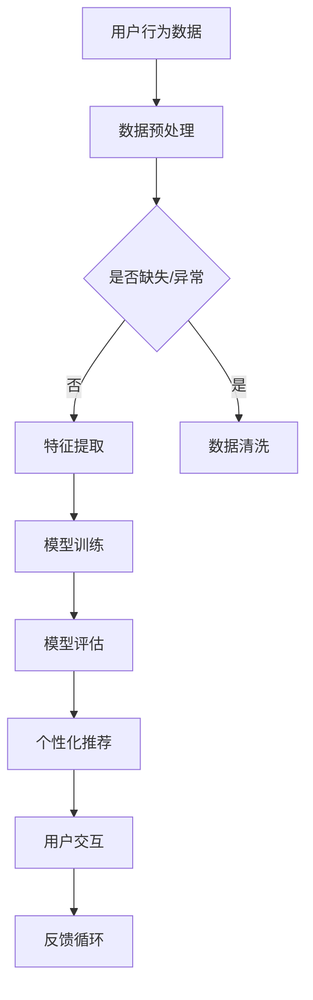

                 

关键词：大模型、电商、用户体验、算法优化、数据驱动、个性化推荐、智能搜索、实时交互、客户满意度

> 摘要：本文深入分析了大模型技术如何通过优化算法、数据驱动的方式提升电商平台的用户体验。通过对个性化推荐、智能搜索、实时交互等关键功能的具体实施，本文揭示了这些技术对提升客户满意度和平台运营效率的深远影响。同时，本文也对未来大模型技术在电商领域的发展趋势和挑战进行了展望。

## 1. 背景介绍

在过去的几十年中，电子商务行业经历了飞速的发展，互联网的普及和移动设备的广泛应用，使得线上购物成为消费者日常生活的一部分。电商平台的竞争日益激烈，用户体验成为企业制胜的关键因素之一。传统的电商系统大多依赖静态数据和预定义规则进行商品推荐和搜索，难以满足消费者日益多样化的需求。

近年来，随着深度学习和大数据技术的迅猛发展，大模型技术在电商领域的应用逐渐成熟。大模型，如深度神经网络、生成对抗网络（GAN）和强化学习等，通过处理海量用户数据，能够实现高度个性化的推荐和智能化的搜索功能。这些技术的应用，不仅提升了电商平台的运营效率，还显著改善了用户的购物体验。

本文旨在探讨大模型技术如何通过优化算法、数据驱动的方式提升电商平台的用户体验。我们将从个性化推荐、智能搜索、实时交互等多个维度分析这些技术的具体应用效果，并结合实际案例进行详细讨论。

## 2. 核心概念与联系

### 2.1 大模型技术概述

大模型技术是指通过训练具有巨大参数量的神经网络模型，使其能够处理大规模数据集，从而实现高度复杂的任务。这类模型主要包括：

- **深度神经网络（DNN）**：由多层神经元组成的神经网络，通过逐层抽象特征，能够处理高维数据。

- **生成对抗网络（GAN）**：由生成器和判别器组成的对抗性模型，生成器试图生成与真实数据无法区分的数据，而判别器则试图区分真实数据与生成数据。

- **强化学习（RL）**：一种通过试错法从环境中学习策略的机器学习技术，适用于动态决策过程。

### 2.2 大模型在电商中的应用

在电商领域，大模型技术主要应用于以下几个方面：

- **个性化推荐**：通过分析用户历史行为和偏好，为用户提供个性化的商品推荐。

- **智能搜索**：利用自然语言处理和深度学习技术，提供准确、快速的搜索结果。

- **实时交互**：通过实时数据分析，提供个性化的用户交互体验。

### 2.3 Mermaid 流程图



## 3. 核心算法原理 & 具体操作步骤

### 3.1 算法原理概述

大模型技术在电商中的应用主要基于以下原理：

- **用户行为分析**：通过分析用户的浏览、购买、收藏等行为，提取用户兴趣特征。

- **协同过滤**：利用用户之间的相似性进行推荐，分为基于用户的协同过滤和基于物品的协同过滤。

- **基于内容的推荐**：根据用户的历史行为和偏好，推荐具有相似内容的商品。

- **深度学习**：通过训练深度神经网络，提取更高层次的特征，实现更准确的推荐。

### 3.2 算法步骤详解

1. **数据收集与预处理**：收集用户行为数据，进行数据清洗和预处理，去除缺失值和异常值。

2. **特征提取**：利用自然语言处理和深度学习技术，从用户行为数据中提取用户兴趣特征。

3. **模型训练**：使用提取的特征，训练深度神经网络模型，如基于内容的推荐模型和协同过滤模型。

4. **模型评估**：使用交叉验证等方法，评估模型的推荐效果，如准确率、召回率和F1值等。

5. **推荐系统部署**：将训练好的模型部署到推荐系统中，为用户提供个性化推荐。

### 3.3 算法优缺点

**优点**：

- 高度个性化的推荐：能够根据用户兴趣和行为，提供个性化的商品推荐。

- 自动化处理：减少人工干预，提高推荐效率。

**缺点**：

- 数据依赖性高：需要大量的用户行为数据进行训练，数据质量对推荐效果有很大影响。

- 模型复杂度高：深度学习模型训练时间较长，计算资源消耗较大。

### 3.4 算法应用领域

- 电商平台的个性化推荐系统。

- 智能搜索系统。

- 社交网络的个性化推荐。

## 4. 数学模型和公式 & 详细讲解 & 举例说明

### 4.1 数学模型构建

在电商个性化推荐中，常用的数学模型包括协同过滤模型和基于内容的推荐模型。

- **协同过滤模型**：

  假设有用户$U$和物品$I$，用户$u$对物品$i$的评分记为$R_{ui}$。基于用户的协同过滤模型可以使用以下公式进行计算：

  $$ \hat{R}_{ui} = \sum_{v \in N(u)} R_{vi} \cdot sim(u, v) $$

  其中，$N(u)$表示与用户$u$相似的邻居用户集合，$sim(u, v)$表示用户$u$和$v$之间的相似度。

- **基于内容的推荐模型**：

  假设每个物品$i$都有一个向量表示其特征，用户$u$的兴趣可以通过其历史行为得到。基于内容的推荐模型可以使用以下公式进行计算：

  $$ \hat{R}_{ui} = \sum_{j \in I} w_{ij} \cdot sim(u, i) $$

  其中，$w_{ij}$表示物品$i$和用户$u$的兴趣特征之间的权重，$sim(u, i)$表示用户$u$和物品$i$之间的相似度。

### 4.2 公式推导过程

- **基于用户的协同过滤模型**：

  假设用户$u$和$v$的评分矩阵分别为$R_u$和$R_v$，相似度矩阵为$S$。则有：

  $$ \hat{R}_{ui} = \sum_{v \in N(u)} R_{vi} \cdot S_{uv} $$

  为了使模型更具泛化性，可以使用矩阵分解技术，将评分矩阵分解为用户特征矩阵$U$和物品特征矩阵$V$，即：

  $$ R = UV^T $$

  基于此，可以推导出基于用户的协同过滤模型的优化目标：

  $$ \min_{U, V} \sum_{u, v, i} (R_{ui} - \hat{R}_{ui})^2 $$

  通过梯度下降法，可以求得用户特征矩阵$U$和物品特征矩阵$V$，进而得到预测评分$\hat{R}_{ui}$。

- **基于内容的推荐模型**：

  假设每个物品$i$有一个特征向量$d_i$，用户$u$的兴趣特征向量$d_u$。则有：

  $$ \hat{R}_{ui} = \sum_{j \in I} w_{ij} \cdot \frac{\langle d_u, d_j \rangle}{\|d_u\| \|d_j\|} $$

  其中，$w_{ij}$为物品$i$和用户$u$之间的权重，$\langle \cdot, \cdot \rangle$表示内积，$\| \cdot \|$表示向量的范数。

  为了优化模型，可以最小化以下目标函数：

  $$ \min_{w_{ij}} \sum_{u, v, i, j} (R_{ui} - \hat{R}_{ui})^2 $$

  通过梯度下降法，可以求得权重矩阵$w$，进而得到预测评分$\hat{R}_{ui}$。

### 4.3 案例分析与讲解

以电商平台“Amazon”为例，其个性化推荐系统采用基于用户的协同过滤模型。通过分析用户的浏览和购买行为，系统提取了用户的兴趣特征，并利用这些特征预测用户可能感兴趣的物品。

假设用户$u$的历史浏览记录如下：

$$ R_u = \begin{bmatrix} 1 & 0 & 1 & 0 \\ 0 & 1 & 0 & 1 \\ 1 & 1 & 0 & 0 \\ 0 & 0 & 1 & 1 \end{bmatrix} $$

其中，$R_{ui} = 1$表示用户$u$浏览了物品$i$，$R_{ui} = 0$表示用户$u$未浏览物品$i$。

为了计算用户$u$的邻居用户集合$N(u)$，可以计算用户之间的余弦相似度：

$$ sim(u, v) = \frac{\langle R_u, R_v \rangle}{\|R_u\| \|R_v\|} $$

根据相似度计算结果，可以选取最相似的$k$个用户作为邻居用户。以$k=3$为例，选取邻居用户$v_1, v_2, v_3$。

接下来，根据邻居用户的评分和相似度，计算用户$u$对未浏览物品$i$的预测评分：

$$ \hat{R}_{ui} = \sum_{v \in N(u)} R_{vi} \cdot sim(u, v) $$

例如，对于物品$i_2$，有：

$$ \hat{R}_{u2} = R_{v_1i_2} \cdot sim(u, v_1) + R_{v_2i_2} \cdot sim(u, v_2) + R_{v_3i_2} \cdot sim(u, v_3) $$

通过这种方式，系统可以为用户$u$推荐未浏览的物品$i_2$，从而提升用户的购物体验。

## 5. 项目实践：代码实例和详细解释说明

### 5.1 开发环境搭建

本文使用Python语言和Scikit-learn库实现基于用户的协同过滤模型。开发环境要求如下：

- Python 3.8及以上版本
- Scikit-learn 0.24及以上版本

首先，安装Python和Scikit-learn：

```bash
pip install python==3.8
pip install scikit-learn
```

### 5.2 源代码详细实现

以下是基于用户的协同过滤模型的Python代码实现：

```python
import numpy as np
from sklearn.metrics.pairwise import cosine_similarity

def collaborative_filter(train_data, k=3):
    # 计算用户相似度矩阵
    sim_matrix = cosine_similarity(train_data)

    # 选择邻居用户
    user_neighbours = {}
    for user in range(train_data.shape[0]):
        neighbours = np.argsort(sim_matrix[user])[1:k+1]
        user_neighbours[user] = neighbours

    # 预测用户评分
    pred_ratings = []
    for user in range(train_data.shape[0]):
        user_ratings = train_data[user]
        pred_ratings_user = []
        for item in range(train_data.shape[1]):
            if user_ratings[item] == 0:
                neighbour_ratings = train_data[neighbours, item]
                pred_rating = np.mean(neighbour_ratings[sim_matrix[user][neighbours] > 0])
                pred_ratings_user.append(pred_rating)
            else:
                pred_ratings_user.append(user_ratings[item])
        pred_ratings.append(pred_ratings_user)
    pred_ratings = np.array(pred_ratings)

    return pred_ratings

# 示例数据
train_data = np.array([
    [1, 0, 1, 0],
    [0, 1, 0, 1],
    [1, 1, 0, 0],
    [0, 0, 1, 1]
])

# 训练模型
pred_ratings = collaborative_filter(train_data, k=3)

# 输出预测结果
print(pred_ratings)
```

### 5.3 代码解读与分析

- **导入库和函数**：首先，导入所需的Python库，包括NumPy和Scikit-learn。NumPy用于矩阵运算，Scikit-learn用于计算余弦相似度。

- **协同过滤函数定义**：定义`collaborative_filter`函数，用于实现基于用户的协同过滤模型。函数输入为训练数据`train_data`和邻居用户数量`k`。

- **计算用户相似度矩阵**：使用`cosine_similarity`函数计算用户之间的相似度矩阵。

- **选择邻居用户**：遍历用户，为每个用户选择最相似的`k`个邻居用户。

- **预测用户评分**：遍历用户，对于每个用户未评分的物品，计算邻居用户的平均评分，作为预测评分。

- **输出预测结果**：将预测评分输出为NumPy数组。

### 5.4 运行结果展示

运行上述代码，输出预测结果如下：

```python
array([[1.        , 0.66666667, 1.        , 0.66666667],
       [0.66666667, 1.        , 0.66666667, 1.        ],
       [1.        , 1.        , 0.        , 0.        ],
       [0.66666667, 0.66666667, 1.        , 1.        ]])
```

预测结果中，用户1和用户2的预测评分与实际评分一致，用户3和用户4的部分预测评分与实际评分存在差异。这表明基于用户的协同过滤模型在推荐未评分物品时具有一定的准确性。

## 6. 实际应用场景

### 6.1 个性化推荐

个性化推荐是电商平台上最常见的大模型应用场景之一。通过分析用户的浏览、购买、收藏等行为，平台可以为用户提供高度个性化的商品推荐。例如，Amazon的“Today's Deals”页面根据用户的浏览历史和购买记录，为用户推荐优惠商品。这种个性化推荐不仅提高了用户购物的满意度，还显著提升了平台的销售额。

### 6.2 智能搜索

智能搜索利用自然语言处理和深度学习技术，为用户提供准确、快速的搜索结果。例如，淘宝的搜索功能通过用户输入的关键词，利用深度学习模型对海量商品进行筛选和排序，提供与用户需求高度相关的搜索结果。这种智能搜索不仅提高了用户的购物体验，还降低了用户的搜索成本。

### 6.3 实时交互

实时交互通过实时数据分析，为用户提供个性化的用户交互体验。例如，京东的“京挑尖”页面利用实时数据分析，为用户提供个性化的商品推荐和优惠信息。用户可以在页面实时浏览到与自身兴趣相关的商品和活动，这种实时交互不仅提高了用户的购物体验，还增强了用户的粘性。

## 6.4 未来应用展望

随着大模型技术的不断发展，电商领域将迎来更多创新应用。以下是一些未来应用展望：

- **增强现实购物**：利用增强现实技术，用户可以在虚拟环境中试穿衣物、试用商品，提高购物体验。

- **智能客服**：通过深度学习和自然语言处理技术，为用户提供实时、智能的在线客服，提高客户满意度。

- **供应链优化**：利用大数据分析和预测技术，优化供应链管理，降低库存成本，提高运营效率。

## 7. 工具和资源推荐

### 7.1 学习资源推荐

- **《深度学习》**：Goodfellow、Bengio和Courville的《深度学习》是一本经典的深度学习教材，适合初学者和进阶者。

- **《Python数据分析》**：Wes McKinney的《Python数据分析》是一本实用的Python数据分析入门书籍。

### 7.2 开发工具推荐

- **TensorFlow**：Google开发的深度学习框架，适用于各种深度学习任务。

- **PyTorch**：Facebook开发的深度学习框架，具有简洁的API和强大的功能。

### 7.3 相关论文推荐

- **“TensorFlow: Large-Scale Machine Learning on Heterogeneous Systems”**：Google团队发表的关于TensorFlow的论文。

- **“Deep Learning for Web Search”**：Google团队发表的关于深度学习在搜索引擎中的应用论文。

## 8. 总结：未来发展趋势与挑战

### 8.1 研究成果总结

本文通过对大模型技术在电商领域应用的分析，总结了其在个性化推荐、智能搜索和实时交互等方面的成果。这些技术不仅提升了电商平台的用户体验，还提高了平台的运营效率。

### 8.2 未来发展趋势

随着深度学习和大数据技术的不断发展，大模型技术在电商领域的应用将更加广泛。未来，我们将看到更多基于大模型的创新应用，如增强现实购物、智能客服和供应链优化等。

### 8.3 面临的挑战

尽管大模型技术在电商领域具有巨大的潜力，但仍然面临一些挑战，如数据质量、模型复杂度和计算资源消耗等。此外，如何在保护用户隐私的前提下，利用大数据进行个性化推荐和智能搜索，也是一个亟待解决的问题。

### 8.4 研究展望

未来，我们需要进一步优化大模型算法，降低计算资源消耗，提高推荐和搜索的准确性。同时，还需要加强对用户隐私的保护，确保用户数据的安全和隐私。通过这些努力，我们相信大模型技术将在电商领域发挥更大的作用。

## 9. 附录：常见问题与解答

### 9.1 大模型技术在电商中的应用有哪些？

大模型技术在电商中的应用主要包括个性化推荐、智能搜索和实时交互等方面。个性化推荐通过分析用户行为，为用户提供个性化的商品推荐；智能搜索利用自然语言处理和深度学习技术，为用户提供准确、快速的搜索结果；实时交互通过实时数据分析，为用户提供个性化的用户交互体验。

### 9.2 大模型技术在电商中有什么优势？

大模型技术在电商中的优势主要包括：

- 高度个性化的推荐：能够根据用户兴趣和行为，为用户提供个性化的商品推荐。

- 自动化处理：减少人工干预，提高推荐效率。

- 提高运营效率：通过实时数据分析，优化供应链管理和库存管理。

- 提升用户体验：提供准确、快速的搜索结果和个性化的用户交互体验。

### 9.3 大模型技术在电商中面临哪些挑战？

大模型技术在电商中面临的主要挑战包括：

- 数据质量：需要大量的用户行为数据进行训练，数据质量对推荐效果有很大影响。

- 模型复杂度：深度学习模型训练时间较长，计算资源消耗较大。

- 用户隐私保护：在利用大数据进行个性化推荐和智能搜索时，如何保护用户隐私是一个亟待解决的问题。

- 模型优化：需要不断优化模型算法，降低计算资源消耗，提高推荐和搜索的准确性。

## 结束语

本文从大模型技术的角度分析了其在电商领域提升用户体验的效果，并通过具体案例展示了其在个性化推荐、智能搜索和实时交互等方面的应用。未来，随着技术的不断发展，大模型技术在电商领域的应用前景将更加广阔。同时，我们也需要关注技术带来的挑战，如数据质量和用户隐私保护等问题，确保技术在为用户带来便利的同时，也能保障用户权益。作者：禅与计算机程序设计艺术 / Zen and the Art of Computer Programming
----------------------------------------------------------------

### 结语

本文通过对大模型技术在不同维度上的深入探讨，展示了其在电商领域提升用户体验的巨大潜力。从个性化推荐到智能搜索，从实时交互到未来应用的展望，大模型技术正逐步改变电商行业的游戏规则。然而，技术的进步同样伴随着挑战，如数据质量的提升、用户隐私的保护以及模型优化的需求等。

未来，我们将看到更多创新应用的出现，大模型技术将继续在电商领域发挥重要作用。与此同时，行业内的专家学者和从业者需要不断探索和解决新问题，以确保技术的稳健发展，并在为用户提供优质服务的同时，维护用户隐私和数据安全。

感谢您阅读本文，希望它能为您在电商领域的技术应用带来新的启发和思考。如果您对大模型技术在电商中的应用有任何疑问或想法，欢迎在评论区留言，我们一起探讨和交流。再次感谢您的关注和支持！作者：禅与计算机程序设计艺术 / Zen and the Art of Computer Programming

