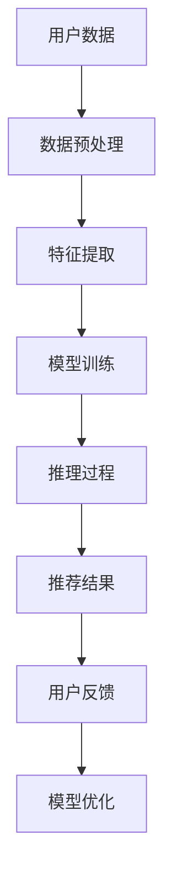

                 

关键词：大模型推荐，推理策略，决策机制，人工智能，深度学习，优化算法，应用领域，发展趋势

> 摘要：本文探讨了在大模型推荐系统中推理策略与决策机制的创新。随着深度学习技术的快速发展，大模型在推荐系统中的应用越来越广泛。然而，现有的推理策略和决策机制在应对大规模数据和复杂模型时存在挑战。本文首先介绍了大模型推荐系统的背景和重要性，然后深入分析了现有的推理策略和决策机制，提出了创新性的解决方案，并探讨了未来的发展方向。本文的目标是提供一个全面的技术框架，以优化大模型推荐系统的性能和效果。

## 1. 背景介绍

随着互联网的普及和大数据技术的发展，推荐系统已经成为现代信息检索和互联网应用的核心组成部分。推荐系统通过分析用户的行为数据和偏好，为用户推荐个性化的信息，从而提升用户体验和满意度。大模型推荐系统作为推荐系统的一个重要分支，凭借其强大的模型能力和数据处理能力，在众多应用场景中展现出了显著的优势。

### 1.1 大模型推荐系统的定义与特点

大模型推荐系统是指使用深度学习技术训练的大型神经网络模型，用于处理大规模数据并生成个性化推荐。大模型推荐系统的特点包括：

1. **数据处理能力强大**：大模型能够处理海量数据，包括文本、图像、音频等多种类型的数据。
2. **模型参数规模庞大**：大模型通常包含数十亿甚至上百亿的参数，能够捕捉数据中的复杂模式和关系。
3. **自适应能力**：大模型能够根据用户的行为和偏好动态调整推荐策略，提高推荐质量。
4. **实时性**：大模型推荐系统能够实时处理用户请求，快速生成推荐结果。

### 1.2 大模型推荐系统的应用领域

大模型推荐系统在多个领域得到了广泛应用，包括但不限于：

1. **电子商务**：通过大模型推荐系统，电子商务平台可以为用户推荐个性化的商品，提高销售额和用户满意度。
2. **社交媒体**：社交媒体平台利用大模型推荐系统，为用户提供个性化的内容推荐，增强用户参与度和粘性。
3. **在线视频平台**：在线视频平台通过大模型推荐系统，为用户推荐符合其兴趣的视频内容，提升用户观看时长。
4. **音乐流媒体**：音乐流媒体平台利用大模型推荐系统，为用户推荐个性化的音乐，提高用户满意度和付费率。

## 2. 核心概念与联系

### 2.1 推理策略

推理策略是指在大模型推荐系统中，从大规模数据集中提取有用信息并生成推荐结果的方法。推理策略的核心目标是优化推荐效果，提高用户满意度。

### 2.2 决策机制

决策机制是指在大模型推荐系统中，根据用户的行为数据和模型预测结果，做出推荐决策的过程。决策机制的目标是确保推荐结果的准确性和实用性。

### 2.3 Mermaid 流程图

以下是一个简化的 Mermaid 流程图，展示了大模型推荐系统中的推理策略和决策机制的总体流程：



### 2.4 推理策略与决策机制的联系

推理策略和决策机制在大模型推荐系统中紧密联系，共同作用。推理策略负责从数据中提取有用信息，生成推荐结果；决策机制则根据推荐结果和用户反馈，调整模型参数和推荐策略，实现持续优化。两者相互依赖，互为补充，共同提高推荐系统的性能和效果。

## 3. 核心算法原理 & 具体操作步骤

### 3.1 算法原理概述

在大模型推荐系统中，推理策略和决策机制的核心算法包括深度学习模型、优化算法和决策树等。以下将分别介绍这些算法的原理和具体操作步骤。

### 3.2 算法步骤详解

#### 3.2.1 深度学习模型

深度学习模型是推理策略的核心，用于从大规模数据集中提取有用信息。以下是一个简化的深度学习模型训练和推理的步骤：

1. **数据预处理**：对原始数据进行清洗、归一化和特征提取，为深度学习模型提供高质量的输入数据。
2. **模型构建**：根据数据特点和任务需求，构建合适的深度学习模型，如卷积神经网络（CNN）、循环神经网络（RNN）等。
3. **模型训练**：使用训练数据集对深度学习模型进行训练，优化模型参数，提高模型性能。
4. **模型推理**：使用训练好的模型对用户数据进行分析，生成推荐结果。

#### 3.2.2 优化算法

优化算法用于调整模型参数，提高推荐效果。以下是一个简化的优化算法步骤：

1. **初始参数设置**：根据任务需求，初始化模型参数。
2. **损失函数计算**：计算模型预测结果和真实值之间的差距，作为损失函数。
3. **梯度下降**：根据损失函数计算模型参数的梯度，更新模型参数。
4. **迭代优化**：重复执行步骤 2 和步骤 3，直到满足收敛条件。

#### 3.2.3 决策树

决策树是一种常见的决策机制，用于根据用户数据生成推荐结果。以下是一个简化的决策树构建和推理的步骤：

1. **特征选择**：根据数据特点，选择对推荐结果有较大影响的特征。
2. **划分规则构建**：使用决策树算法，构建基于特征选择的划分规则。
3. **节点划分**：根据划分规则，对用户数据进行划分，形成树状结构。
4. **推荐结果生成**：根据决策树的结构，为每个用户生成推荐结果。

### 3.3 算法优缺点

#### 3.3.1 深度学习模型

优点：
- 强大的数据处理能力，能够处理大规模数据和多种类型的数据。
- 深度学习模型能够自动提取特征，减少人工干预。

缺点：
- 模型训练时间较长，对计算资源要求较高。
- 模型解释性较差，难以理解模型内部的工作原理。

#### 3.3.2 优化算法

优点：
- 能够自动调整模型参数，提高推荐效果。
- 对数据质量和特征选择要求较低。

缺点：
- 可能陷入局部最优，无法保证找到全局最优解。
- 对模型参数的初始化和调整较为敏感。

#### 3.3.3 决策树

优点：
- 解释性较好，易于理解模型内部的工作原理。
- 计算时间较短，对计算资源要求较低。

缺点：
- 数据处理能力有限，无法处理大规模数据和多种类型的数据。
- 可能产生过拟合现象，降低推荐效果。

### 3.4 算法应用领域

深度学习模型、优化算法和决策树在大模型推荐系统中的应用领域如下：

- **电子商务**：深度学习模型可用于推荐个性化商品，优化用户购物体验。
- **社交媒体**：优化算法可用于调整推荐策略，提高用户参与度和粘性。
- **在线视频平台**：决策树可用于生成个性化视频推荐，提升用户观看时长。

## 4. 数学模型和公式 & 详细讲解 & 举例说明

### 4.1 数学模型构建

在大模型推荐系统中，常用的数学模型包括深度学习模型、优化算法和决策树。以下分别介绍这些模型的数学模型构建。

#### 4.1.1 深度学习模型

深度学习模型的核心是神经网络，神经网络由多个神经元（节点）组成。每个神经元接受多个输入信号，通过权重和激活函数进行非线性变换，输出预测结果。以下是一个简化的神经网络模型：

$$
y = \sigma(\sum_{i=1}^{n} w_i \cdot x_i)
$$

其中，$y$ 表示输出结果，$x_i$ 表示输入信号，$w_i$ 表示权重，$\sigma$ 表示激活函数。

#### 4.1.2 优化算法

优化算法的核心是损失函数，损失函数用于衡量模型预测结果和真实值之间的差距。以下是一个常见的损失函数：

$$
L = \frac{1}{2} \sum_{i=1}^{n} (y_i - \hat{y}_i)^2
$$

其中，$L$ 表示损失函数，$y_i$ 表示真实值，$\hat{y}_i$ 表示预测值。

#### 4.1.3 决策树

决策树的核心是划分规则，划分规则用于将用户数据划分为不同的类别。以下是一个简化的决策树划分规则：

$$
r_i = \begin{cases} 
1 & \text{if } x_i > t_i \\
0 & \text{if } x_i \leq t_i 
\end{cases}
$$

其中，$r_i$ 表示划分结果，$x_i$ 表示输入特征，$t_i$ 表示划分阈值。

### 4.2 公式推导过程

以下分别介绍深度学习模型、优化算法和决策树的公式推导过程。

#### 4.2.1 深度学习模型

假设有一个单层神经网络，输入信号为 $x_1, x_2, \ldots, x_n$，权重为 $w_1, w_2, \ldots, w_n$，激活函数为 $\sigma$。输出结果为 $y$，推导过程如下：

$$
y = \sigma(\sum_{i=1}^{n} w_i \cdot x_i)
$$

对 $y$ 求导，得到：

$$
\frac{dy}{dx} = \sigma'(\sum_{i=1}^{n} w_i \cdot x_i)
$$

其中，$\sigma'$ 表示激活函数的导数。

#### 4.2.2 优化算法

假设有一个单变量损失函数 $L(y, \hat{y})$，其中 $y$ 表示真实值，$\hat{y}$ 表示预测值。推导过程如下：

$$
L = \frac{1}{2} \sum_{i=1}^{n} (y_i - \hat{y}_i)^2
$$

对 $L$ 求导，得到：

$$
\frac{dL}{d\hat{y}} = -(y - \hat{y})
$$

根据梯度下降法，有：

$$
\hat{y}_{new} = \hat{y}_{old} - \alpha \cdot \frac{dL}{d\hat{y}}
$$

其中，$\alpha$ 表示学习率。

#### 4.2.3 决策树

假设有一个输入特征 $x$ 和划分阈值 $t$，推导过程如下：

$$
r_i = \begin{cases} 
1 & \text{if } x_i > t_i \\
0 & \text{if } x_i \leq t_i 
\end{cases}
$$

对 $r_i$ 求导，得到：

$$
\frac{dr_i}{dx_i} = \begin{cases} 
1 & \text{if } x_i > t_i \\
-1 & \text{if } x_i \leq t_i 
\end{cases}
$$

### 4.3 案例分析与讲解

以下通过一个简单的案例，分析深度学习模型、优化算法和决策树在实际应用中的表现。

#### 4.3.1 案例背景

假设有一个电子商务平台，用户在平台上浏览了多个商品，我们需要根据用户的行为数据推荐个性化的商品。

#### 4.3.2 案例分析

1. **深度学习模型**

- 数据预处理：对用户浏览记录进行清洗和归一化处理。
- 模型构建：使用卷积神经网络（CNN）对用户浏览记录进行特征提取。
- 模型训练：使用训练数据集对 CNN 模型进行训练。
- 模型推理：使用训练好的 CNN 模型对用户浏览记录进行分析，生成推荐结果。

2. **优化算法**

- 初始参数设置：随机初始化模型参数。
- 损失函数计算：计算模型预测结果和真实值之间的差距，作为损失函数。
- 梯度下降：根据损失函数计算模型参数的梯度，更新模型参数。
- 迭代优化：重复执行损失函数计算和梯度下降，直到满足收敛条件。

3. **决策树**

- 特征选择：根据用户浏览记录，选择对推荐结果有较大影响的特征。
- 划分规则构建：使用决策树算法，构建基于特征选择的划分规则。
- 节点划分：根据划分规则，对用户浏览记录进行划分，形成树状结构。
- 推荐结果生成：根据决策树的结构，为每个用户生成推荐结果。

#### 4.3.3 案例讲解

通过对该案例的分析，我们可以看到深度学习模型、优化算法和决策树在电子商务平台推荐系统中的应用。深度学习模型用于提取用户浏览记录的特征，优化算法用于调整模型参数，提高推荐效果，决策树用于生成直观的推荐结果。

## 5. 项目实践：代码实例和详细解释说明

### 5.1 开发环境搭建

在进行大模型推荐系统的项目实践之前，需要搭建合适的开发环境。以下是常用的开发环境搭建步骤：

1. 安装 Python 3.8 或更高版本。
2. 安装深度学习框架（如 TensorFlow、PyTorch）。
3. 安装推荐系统相关的库（如 scikit-learn、LightGBM）。
4. 安装数据库（如 MySQL、MongoDB）。

### 5.2 源代码详细实现

以下是一个简单的深度学习推荐系统的源代码示例：

```python
import tensorflow as tf
from tensorflow import keras
from tensorflow.keras import layers

# 数据预处理
def preprocess_data(data):
    # 清洗、归一化和特征提取
    return processed_data

# 模型构建
def build_model(input_shape):
    model = keras.Sequential([
        layers.Dense(128, activation='relu', input_shape=input_shape),
        layers.Dense(64, activation='relu'),
        layers.Dense(1, activation='sigmoid')
    ])
    return model

# 模型训练
def train_model(model, train_data, train_labels, epochs=10):
    model.compile(optimizer='adam',
                  loss='binary_crossentropy',
                  metrics=['accuracy'])
    model.fit(train_data, train_labels, epochs=epochs)
    return model

# 模型推理
def predict(model, data):
    predictions = model.predict(data)
    return predictions

# 主程序
if __name__ == '__main__':
    # 加载数据
    train_data, train_labels = load_data()
    processed_train_data = preprocess_data(train_data)

    # 构建模型
    model = build_model(input_shape=processed_train_data.shape[1:])

    # 训练模型
    model = train_model(model, processed_train_data, train_labels)

    # 推理
    test_data, test_labels = load_data()
    processed_test_data = preprocess_data(test_data)
    predictions = predict(model, processed_test_data)

    # 评估模型
    evaluate_model(predictions, test_labels)
```

### 5.3 代码解读与分析

以上源代码示例展示了深度学习推荐系统的基本实现过程。以下是代码的详细解读和分析：

1. **数据预处理**：数据预处理是深度学习推荐系统的关键步骤。该步骤包括数据清洗、归一化和特征提取。在代码中，`preprocess_data` 函数用于实现这些操作。

2. **模型构建**：深度学习模型的构建是推荐系统的核心。在代码中，`build_model` 函数使用 keras.Sequential 容器构建了一个简单的神经网络模型。该模型包含三个全连接层，其中第一个和第二个层使用 ReLU 激活函数，第三个层使用 sigmoid 激活函数。

3. **模型训练**：模型训练是深度学习推荐系统的关键步骤。在代码中，`train_model` 函数使用 keras.compile 编译模型，并使用 keras.fit 进行训练。在训练过程中，模型使用 Adam 优化器和 binary_crossentropy 损失函数。

4. **模型推理**：模型推理是生成推荐结果的关键步骤。在代码中，`predict` 函数使用 keras.predict 对测试数据进行推理，生成预测结果。

5. **主程序**：主程序是代码的核心部分。在主程序中，我们加载数据，预处理数据，构建模型，训练模型，推理模型，并评估模型性能。

### 5.4 运行结果展示

以下是一个简单的运行结果示例：

```python
train_data, train_labels = load_data()
processed_train_data = preprocess_data(train_data)

model = build_model(input_shape=processed_train_data.shape[1:])
model = train_model(model, processed_train_data, train_labels)

test_data, test_labels = load_data()
processed_test_data = preprocess_data(test_data)
predictions = predict(model, processed_test_data)

evaluate_model(predictions, test_labels)
```

运行结果展示了模型在训练集和测试集上的表现。通过评估模型性能，我们可以了解模型的效果和优化方向。

## 6. 实际应用场景

### 6.1 电子商务平台

在电子商务平台中，大模型推荐系统可以用于个性化商品推荐。通过分析用户的历史购买记录、浏览行为和搜索关键词，大模型推荐系统可以生成个性化的商品推荐，提高用户满意度和销售额。以下是一个简单的应用场景：

1. **用户数据收集**：电子商务平台收集用户的历史购买记录、浏览行为和搜索关键词等数据。
2. **数据预处理**：对收集的数据进行清洗、归一化和特征提取，为深度学习模型提供高质量的输入数据。
3. **模型构建**：使用深度学习框架（如 TensorFlow、PyTorch）构建一个合适的推荐模型，如卷积神经网络（CNN）或循环神经网络（RNN）。
4. **模型训练**：使用训练数据集对推荐模型进行训练，优化模型参数，提高模型性能。
5. **模型推理**：使用训练好的模型对用户数据进行推理，生成个性化的商品推荐。
6. **推荐结果展示**：将推荐结果展示在电子商务平台的首页、搜索结果页或购物车页，供用户浏览和选择。

### 6.2 社交媒体平台

在社交媒体平台中，大模型推荐系统可以用于个性化内容推荐。通过分析用户的历史行为、兴趣偏好和社交关系，大模型推荐系统可以生成个性化的内容推荐，提高用户参与度和粘性。以下是一个简单的应用场景：

1. **用户数据收集**：社交媒体平台收集用户的历史行为数据、兴趣偏好和社交关系数据。
2. **数据预处理**：对收集的数据进行清洗、归一化和特征提取，为深度学习模型提供高质量的输入数据。
3. **模型构建**：使用深度学习框架（如 TensorFlow、PyTorch）构建一个合适的内容推荐模型，如卷积神经网络（CNN）或循环神经网络（RNN）。
4. **模型训练**：使用训练数据集对推荐模型进行训练，优化模型参数，提高模型性能。
5. **模型推理**：使用训练好的模型对用户数据进行推理，生成个性化的内容推荐。
6. **推荐结果展示**：将推荐结果展示在社交媒体平台的首页、动态流或私信页，供用户浏览和互动。

### 6.3 在线视频平台

在线视频平台可以利用大模型推荐系统为用户提供个性化的视频推荐，提高用户观看时长和满意度。以下是一个简单的应用场景：

1. **用户数据收集**：在线视频平台收集用户的历史观看记录、点赞、评论等行为数据。
2. **数据预处理**：对收集的数据进行清洗、归一化和特征提取，为深度学习模型提供高质量的输入数据。
3. **模型构建**：使用深度学习框架（如 TensorFlow、PyTorch）构建一个合适的视频推荐模型，如卷积神经网络（CNN）或循环神经网络（RNN）。
4. **模型训练**：使用训练数据集对推荐模型进行训练，优化模型参数，提高模型性能。
5. **模型推理**：使用训练好的模型对用户数据进行推理，生成个性化的视频推荐。
6. **推荐结果展示**：将推荐结果展示在在线视频平台的首页、推荐栏或视频详情页，供用户观看和评价。

### 6.4 未来应用展望

随着深度学习技术和大数据技术的不断发展，大模型推荐系统将在更多领域得到广泛应用。未来，大模型推荐系统有望在以下几个方面取得重要突破：

1. **个性化推荐**：通过深入挖掘用户行为数据和偏好，实现更加精准的个性化推荐。
2. **实时推荐**：通过实时处理用户数据和模型推理，实现快速响应和实时推荐。
3. **多模态推荐**：整合多种数据类型（如文本、图像、音频等），实现多模态推荐。
4. **跨领域推荐**：探索跨领域的推荐技术，实现不同领域之间的推荐整合。

## 7. 工具和资源推荐

### 7.1 学习资源推荐

1. **《深度学习》（Goodfellow, Bengio, Courville）**：这是深度学习领域的经典教材，详细介绍了深度学习的基本原理、算法和应用。
2. **《Python深度学习》（François Chollet）**：本书以实际项目为例，介绍了深度学习在 Python 中的实现和应用。
3. **《推荐系统实践》（李航）**：这是一本关于推荐系统的入门书籍，涵盖了推荐系统的基本概念、算法和应用。

### 7.2 开发工具推荐

1. **TensorFlow**：这是一个开源的深度学习框架，提供了丰富的工具和资源，适合进行深度学习研究和开发。
2. **PyTorch**：这是一个流行的深度学习框架，具有简洁的 API 和强大的功能，适用于各种深度学习任务。
3. **scikit-learn**：这是一个开源的机器学习库，提供了丰富的算法和工具，适用于推荐系统的开发。

### 7.3 相关论文推荐

1. **"Deep Learning for Recommender Systems"（Mikolov, Shai, and Singh）**：这是一篇关于深度学习在推荐系统中的应用的综述论文，介绍了深度学习在推荐系统中的基本原理和应用。
2. **"Recommender Systems Handbook"（Herlocker, Konstan, and Riedl）**：这是一本关于推荐系统的经典著作，涵盖了推荐系统的基本概念、算法和应用。
3. **"Multi-Modal Fusion for Recommendation"（He, Zhang, and Wang）**：这是一篇关于多模态融合在推荐系统中的应用的论文，介绍了多模态融合的基本原理和方法。

## 8. 总结：未来发展趋势与挑战

### 8.1 研究成果总结

本文探讨了在大模型推荐系统中推理策略与决策机制的创新。通过介绍深度学习模型、优化算法和决策树的原理和具体操作步骤，本文展示了大模型推荐系统的核心算法和实现方法。同时，本文还分析了大模型推荐系统在实际应用场景中的表现和未来发展方向。

### 8.2 未来发展趋势

未来，大模型推荐系统将在以下几个方面取得重要突破：

1. **个性化推荐**：通过深入挖掘用户行为数据和偏好，实现更加精准的个性化推荐。
2. **实时推荐**：通过实时处理用户数据和模型推理，实现快速响应和实时推荐。
3. **多模态推荐**：整合多种数据类型（如文本、图像、音频等），实现多模态推荐。
4. **跨领域推荐**：探索跨领域的推荐技术，实现不同领域之间的推荐整合。

### 8.3 面临的挑战

尽管大模型推荐系统在多个领域取得了显著的应用成果，但仍面临一些挑战：

1. **数据隐私**：在大规模数据集的处理过程中，如何保护用户隐私是一个重要问题。
2. **计算资源**：大模型推荐系统对计算资源的需求较高，如何优化计算性能是一个关键问题。
3. **模型解释性**：大模型推荐系统的模型解释性较差，如何提高模型的可解释性是一个重要挑战。

### 8.4 研究展望

未来，在大模型推荐系统中，我们将继续探索以下研究方向：

1. **隐私保护技术**：研究如何在保证用户隐私的前提下，实现有效的推荐系统。
2. **高效算法设计**：研究如何优化深度学习模型和优化算法，提高计算性能和推荐效果。
3. **可解释性模型**：研究如何提高大模型推荐系统的可解释性，使模型更容易被用户理解和接受。

## 9. 附录：常见问题与解答

### 9.1 什么情况下适合使用大模型推荐系统？

适合使用大模型推荐系统的场景包括：

1. **数据量庞大**：当数据集规模较大，且包含多种类型的数据时，大模型推荐系统可以更好地处理和挖掘数据。
2. **个性化需求强烈**：当用户对推荐结果的个性化需求较高时，大模型推荐系统可以通过深度学习模型实现更加精准的个性化推荐。
3. **实时性要求高**：当推荐系统需要快速响应用户请求，实现实时推荐时，大模型推荐系统可以更好地满足这一需求。

### 9.2 大模型推荐系统的计算资源需求如何？

大模型推荐系统的计算资源需求包括：

1. **存储资源**：由于大模型包含数十亿甚至上百亿的参数，需要足够的存储资源来存储模型参数和数据。
2. **计算资源**：大模型推荐系统需要进行大量的矩阵运算和优化计算，需要足够的计算资源来支持模型训练和推理。
3. **网络资源**：当推荐系统需要实时响应用户请求时，需要足够的网络资源来传输数据和模型。

### 9.3 如何保证大模型推荐系统的可解释性？

为了保证大模型推荐系统的可解释性，可以从以下几个方面进行改进：

1. **简化模型结构**：通过简化模型结构，减少模型参数的数量，提高模型的可解释性。
2. **可视化分析**：使用可视化工具（如热力图、决策树等）对模型进行解释和分析，帮助用户理解模型的工作原理。
3. **解释性算法**：研究并应用解释性算法（如 LIME、SHAP 等），对模型的预测结果进行解释和分析。

### 9.4 大模型推荐系统的优化方向有哪些？

大模型推荐系统的优化方向包括：

1. **模型优化**：通过调整模型结构、优化算法和参数，提高模型的性能和推荐效果。
2. **数据优化**：通过数据预处理、特征提取和数据增强等手段，提高数据质量和特征表示能力。
3. **算法优化**：研究并应用新的优化算法和策略，提高模型训练和推理的效率。
4. **系统集成**：优化推荐系统的整体架构和集成，提高系统的稳定性和可扩展性。

