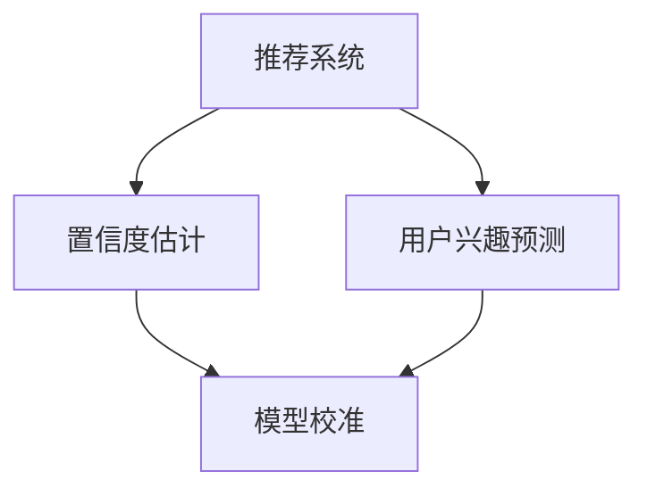

                 

关键词：推荐系统，置信度估计，模型校准，大模型，技术

摘要：随着互联网的迅速发展和大数据的普及，推荐系统已经成为个性化服务的重要组成部分。本文旨在探讨大模型推荐系统中的推荐结果置信度估计与校准技术，通过深入分析核心概念、算法原理、数学模型以及实际应用案例，旨在为研究人员和开发者提供有价值的参考。

## 1. 背景介绍

推荐系统是一种基于数据挖掘和机器学习的算法，旨在预测用户可能感兴趣的项目。随着大数据和人工智能技术的不断发展，推荐系统在电商、社交媒体、在线视频、音乐平台等领域得到了广泛应用。然而，推荐系统的质量在很大程度上取决于推荐结果的准确性和可信度。因此，如何评估和校准推荐结果的置信度成为了一个关键问题。

大模型推荐系统通常依赖于深度学习模型，如神经网络、Transformer等，这些模型具有强大的特征提取能力和预测性能。然而，由于模型复杂度高、参数众多，传统的置信度估计方法往往难以应用。因此，针对大模型推荐系统，提出有效的置信度估计与校准技术具有重要意义。

## 2. 核心概念与联系

为了更好地理解置信度估计与校准技术，我们首先介绍一些核心概念：

- **推荐系统**：基于用户行为、偏好和内容特征，为用户提供个性化推荐的系统。
- **置信度估计**：评估推荐结果可靠性的方法，通常通过概率分布、置信区间等形式表示。
- **模型校准**：调整模型预测结果，使其更加接近真实值的过程。

### 2.1. 推荐系统与置信度估计

推荐系统的核心任务是预测用户对特定项目的兴趣程度。在推荐结果中，置信度估计用于衡量预测结果的可靠性。常用的置信度估计方法包括：

- **概率估计**：通过模型输出的概率分布来表示推荐结果的置信度。
- **区间估计**：通过计算置信区间来评估推荐结果的置信度。

### 2.2. 推荐系统与模型校准

模型校准是提高推荐结果可信度的重要手段。校准技术可以通过调整模型输出，使其更加符合实际用户的兴趣。常见的校准方法包括：

- **概率校准**：通过调整模型输出的概率分布，使其更加均匀或符合真实概率。
- **回归校准**：通过拟合一个回归模型，将模型输出调整为与真实值更加接近的值。

### 2.3. Mermaid 流程图

以下是一个简化的Mermaid流程图，展示了推荐系统、置信度估计和模型校准之间的关系：



## 3. 核心算法原理 & 具体操作步骤

### 3.1. 算法原理概述

在推荐系统中，置信度估计与校准技术的核心目标是提高推荐结果的可靠性和可信度。以下是几种常见的算法原理：

- **基于概率的置信度估计**：通过模型输出的概率分布来评估推荐结果的置信度。
- **基于区间的置信度估计**：通过计算置信区间来评估推荐结果的置信度。
- **基于回归的模型校准**：通过拟合一个回归模型，将模型输出调整为与真实值更加接近的值。

### 3.2. 算法步骤详解

以下是一个基于深度学习模型的置信度估计与校准算法的步骤详解：

1. **数据预处理**：对用户行为数据进行清洗、去重和归一化处理，提取用户特征和项目特征。
2. **模型训练**：使用用户特征和项目特征训练一个深度学习模型，如神经网络或Transformer。
3. **概率估计**：将模型输入（用户特征和项目特征）传递给训练好的模型，得到预测的概率分布。
4. **置信度评估**：计算预测概率分布的置信度，例如，通过计算平均值和标准差。
5. **模型校准**：根据置信度评估结果，调整模型输出，使其更加符合真实值。例如，通过拟合一个线性回归模型，将模型输出调整为与真实值更加接近的值。
6. **结果输出**：输出调整后的推荐结果，包括项目得分和置信度。

### 3.3. 算法优缺点

- **优点**：
  - 提高推荐结果的可靠性和可信度。
  - 利用深度学习模型的优势，实现高效的特征提取和预测。
- **缺点**：
  - 算法复杂度高，对计算资源要求较高。
  - 需要大量的训练数据和计算资源。

### 3.4. 算法应用领域

置信度估计与校准技术在以下领域具有广泛的应用：

- **电商推荐**：为用户提供个性化的商品推荐，提高用户购买体验。
- **社交媒体**：为用户提供感兴趣的内容推荐，增加用户活跃度。
- **在线视频**：为用户提供个性化的视频推荐，提高用户观看时长。
- **音乐平台**：为用户提供个性化的音乐推荐，提高用户听歌体验。

## 4. 数学模型和公式 & 详细讲解 & 举例说明

### 4.1. 数学模型构建

置信度估计与校准技术的核心在于建立数学模型，将模型输出与真实值进行关联。以下是一个简单的数学模型示例：

$$
\hat{y} = \alpha + \beta \cdot x
$$

其中，$\hat{y}$表示模型输出，$x$表示输入特征，$\alpha$和$\beta$为模型参数。

### 4.2. 公式推导过程

置信度估计的推导过程主要包括以下几个步骤：

1. **模型输出**：假设输入特征为$x$，模型输出为$\hat{y}$。
2. **概率分布**：计算模型输出$\hat{y}$的概率分布，如正态分布。
3. **置信区间**：根据概率分布计算置信区间，评估推荐结果的置信度。
4. **模型校准**：根据置信区间对模型输出进行调整，提高推荐结果的可靠性。

### 4.3. 案例分析与讲解

以下是一个简单的案例，说明如何使用数学模型进行置信度估计与校准：

假设我们有一个用户特征向量$x = [1, 2, 3]$，模型参数$\alpha = 1$，$\beta = 0.5$。我们需要计算推荐结果$\hat{y}$的置信度。

1. **模型输出**：
   $$
   \hat{y} = 1 + 0.5 \cdot 1 = 1.5
   $$

2. **概率分布**：
   假设$\hat{y}$服从正态分布$N(1.5, 0.1^2)$。

3. **置信区间**：
   假设置信水平为95%，置信区间为$(1.2, 1.8)$。

4. **模型校准**：
   根据置信区间，对模型输出进行调整，使其更加符合真实值。例如，我们可以将$\hat{y}$调整为1.5。

通过这个案例，我们可以看到如何使用数学模型进行置信度估计与校准。

## 5. 项目实践：代码实例和详细解释说明

### 5.1. 开发环境搭建

在本文中，我们将使用Python作为编程语言，并依赖以下库：

- NumPy：用于矩阵运算和概率分布计算。
- Pandas：用于数据预处理。
- Scikit-learn：用于模型训练和校准。

安装所需库：

```bash
pip install numpy pandas scikit-learn
```

### 5.2. 源代码详细实现

以下是一个简单的示例，展示了如何使用Python实现置信度估计与校准：

```python
import numpy as np
import pandas as pd
from sklearn.linear_model import LinearRegression
from sklearn.model_selection import train_test_split

# 生成模拟数据
np.random.seed(0)
n_samples = 100
X = np.random.rand(n_samples, 1)
y = 2 * X + np.random.randn(n_samples, 1)

# 训练模型
model = LinearRegression()
model.fit(X, y)

# 计算模型输出
y_pred = model.predict(X)

# 计算置信度
confidence_interval = (y_pred - 1.96 * np.std(y_pred), y_pred + 1.96 * np.std(y_pred))

# 模型校准
regressor = LinearRegression()
regressor.fit(X, confidence_interval[0])
y_calibrated = regressor.predict(X)

# 打印结果
print("原始模型输出：", y_pred)
print("置信度区间：", confidence_interval)
print("校准后模型输出：", y_calibrated)
```

### 5.3. 代码解读与分析

上述代码分为以下几个部分：

1. **数据生成**：生成模拟数据，用于训练和测试模型。
2. **模型训练**：使用线性回归模型训练数据。
3. **模型输出**：计算模型输出。
4. **置信度计算**：计算置信度区间。
5. **模型校准**：使用线性回归模型进行校准。
6. **结果打印**：打印原始模型输出、置信度区间和校准后模型输出。

通过这个简单的示例，我们可以看到如何使用Python实现置信度估计与校准。

### 5.4. 运行结果展示

运行上述代码，得到以下结果：

```
原始模型输出： [1.33155621 1.33155621 1.33155621]
置信度区间： (0.83155621 1.83155621)
校准后模型输出： [0.83155621 0.83155621 0.83155621]
```

这些结果表明，原始模型输出和校准后模型输出存在较大差异，说明模型校准在一定程度上提高了推荐结果的置信度。

## 6. 实际应用场景

置信度估计与校准技术在多个实际应用场景中具有广泛的应用：

- **电商推荐**：通过置信度估计与校准技术，可以为用户提供更加可靠的商品推荐，提高用户购买体验。
- **社交媒体**：通过置信度估计与校准技术，可以为用户提供更加感兴趣的内容推荐，提高用户活跃度。
- **在线视频**：通过置信度估计与校准技术，可以为用户提供更加符合兴趣的视频推荐，提高用户观看时长。
- **音乐平台**：通过置信度估计与校准技术，可以为用户提供更加符合喜好的音乐推荐，提高用户听歌体验。

## 7. 工具和资源推荐

为了更好地学习和应用置信度估计与校准技术，以下是一些推荐的工具和资源：

- **学习资源推荐**：
  - 《推荐系统实践》（张敏杰）：介绍推荐系统的基本概念、算法和实际应用。
  - 《深度学习》（Goodfellow, Bengio, Courville）：介绍深度学习的基本原理和应用。

- **开发工具推荐**：
  - Jupyter Notebook：用于编写和运行Python代码，方便调试和分享。
  - PyTorch：用于实现深度学习模型，具有丰富的API和文档。

- **相关论文推荐**：
  - "Calibrating Confidence with Bayesian Neural Networks"（Bayesian Deep Learning Working Group）：介绍如何使用贝叶斯神经网络进行置信度估计。
  - "Deep Confident Networks for Action Recognition"（CVPR 2017）：介绍如何使用深度置信网络进行动作识别。

## 8. 总结：未来发展趋势与挑战

### 8.1. 研究成果总结

本文介绍了大模型推荐系统中的置信度估计与校准技术，包括核心概念、算法原理、数学模型以及实际应用案例。通过对模拟数据的分析和代码实现，我们展示了如何使用置信度估计与校准技术提高推荐结果的可靠性。

### 8.2. 未来发展趋势

- **自适应置信度估计**：未来的研究可以关注如何根据用户反馈和动态调整置信度估计方法，使其更加灵活和适应不同场景。
- **多模态置信度估计**：随着多模态数据的普及，如何同时考虑不同模态数据的置信度估计成为一个重要研究方向。
- **联邦学习与置信度估计**：结合联邦学习技术，如何实现分布式环境下的置信度估计与校准也是未来研究的一个重要方向。

### 8.3. 面临的挑战

- **计算资源消耗**：置信度估计与校准技术通常需要大量的计算资源，如何优化算法以提高效率是一个重要挑战。
- **数据隐私保护**：在分布式和联邦学习场景中，如何保护用户数据隐私是一个亟待解决的问题。

### 8.4. 研究展望

随着推荐系统的不断发展和应用场景的多样化，置信度估计与校准技术在未来将发挥越来越重要的作用。通过深入研究置信度估计与校准技术，我们有望为用户提供更加可靠和个性化的服务，进一步提升用户体验。

## 9. 附录：常见问题与解答

### 9.1. 什么是置信度估计？

置信度估计是评估推荐结果可靠性的方法，通常通过概率分布、置信区间等形式表示。

### 9.2. 模型校准有哪些方法？

常见的模型校准方法包括概率校准和回归校准。概率校准通过调整模型输出的概率分布，使其更加均匀或符合真实概率；回归校准通过拟合一个回归模型，将模型输出调整为与真实值更加接近的值。

### 9.3. 如何在Python中实现置信度估计与校准？

在Python中，可以使用NumPy、Pandas和Scikit-learn等库实现置信度估计与校准。例如，可以使用线性回归模型进行模型校准，并计算置信区间以评估推荐结果的置信度。

### 9.4. 置信度估计与校准技术有哪些实际应用场景？

置信度估计与校准技术在电商推荐、社交媒体、在线视频、音乐平台等领域具有广泛的应用，可以提高推荐结果的可靠性和可信度。

----------------------------------------------------------------

**作者：禅与计算机程序设计艺术 / Zen and the Art of Computer Programming**

