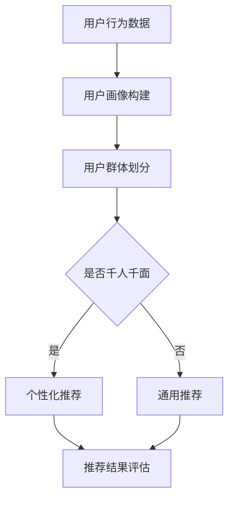

                 

关键词：大模型推荐、用户群体划分、千人千面、机器学习、个性化推荐、深度学习、数据挖掘

摘要：本文将探讨在大模型推荐系统中，如何通过用户群体划分和千人千面策略，实现个性化推荐。本文首先介绍了相关背景知识，然后详细阐述了用户群体划分的核心概念与联系，核心算法原理与具体操作步骤，以及数学模型和公式的构建与推导。接着，通过实际项目实践展示了代码实例和详细解释说明，并分析了实际应用场景。最后，对未来的发展趋势与挑战进行了展望，并推荐了相关工具和资源。

## 1. 背景介绍

随着互联网和大数据技术的发展，个性化推荐已经成为现代互联网服务中不可或缺的一部分。推荐系统能够根据用户的历史行为和兴趣偏好，为用户提供个性化的信息和服务。然而，随着用户规模的扩大和数据量的增加，如何实现高效且准确的个性化推荐成为一个重要的问题。

在大模型推荐系统中，用户群体划分和千人千面策略是实现个性化推荐的关键。用户群体划分能够将用户划分为不同的群体，从而针对不同群体的特点设计推荐策略。千人千面策略则通过分析用户的行为和偏好，为每个用户提供个性化的推荐。

本文旨在探讨用户群体划分和千人千面策略在大模型推荐系统中的应用，并提供一套完整的解决方案。通过本文的研究，希望能够为相关领域的研究者和开发者提供有价值的参考。

## 2. 核心概念与联系

在讨论用户群体划分和千人千面策略之前，首先需要了解一些核心概念。

### 2.1 个性化推荐

个性化推荐是一种根据用户的历史行为和兴趣偏好，为用户提供个性化的信息和服务的方法。个性化推荐系统通常包含以下三个核心组件：

- **用户画像**：通过分析用户的历史行为和偏好，构建用户的画像，用于表示用户的需求和兴趣。
- **推荐算法**：根据用户画像和物品特征，设计推荐算法，为用户生成个性化的推荐列表。
- **推荐结果评估**：评估推荐算法的效果，根据评估结果调整推荐策略。

### 2.2 用户群体划分

用户群体划分是将用户按照特定的标准划分为不同的群体，以便针对不同群体的特点设计推荐策略。常见的用户群体划分方法包括：

- **人口统计学特征**：根据用户的年龄、性别、地理位置等人口统计学特征进行划分。
- **行为特征**：根据用户的行为特征，如浏览历史、购买记录等，进行划分。
- **兴趣偏好**：根据用户的兴趣偏好，如喜欢的电影类型、书籍类型等，进行划分。

### 2.3 千人千面策略

千人千面策略是指为每个用户生成个性化的推荐列表，而不是为所有用户生成相同的推荐列表。实现千人千面策略的关键在于：

- **用户特征分析**：通过分析用户的历史行为和偏好，提取用户的特征。
- **推荐策略优化**：根据用户的特征，设计不同的推荐策略，为每个用户生成个性化的推荐列表。

### 2.4 Mermaid 流程图

以下是用户群体划分与千人千面策略的 Mermaid 流程图：



在这个流程图中，用户行为数据首先用于构建用户画像，然后根据用户画像进行用户群体划分。如果选择千人千面策略，则根据用户群体和用户特征生成个性化的推荐列表；否则，生成通用的推荐列表。最后，对推荐结果进行评估，并根据评估结果调整推荐策略。

## 3. 核心算法原理 & 具体操作步骤

### 3.1 算法原理概述

用户群体划分与千人千面策略的核心在于用户特征提取和推荐算法设计。用户特征提取是通过分析用户的历史行为和偏好，提取用户的需求和兴趣。推荐算法则是根据用户特征和物品特征，生成个性化的推荐列表。

### 3.2 算法步骤详解

#### 3.2.1 用户特征提取

用户特征提取是用户群体划分和千人千面策略的基础。常用的用户特征提取方法包括：

- **行为特征**：根据用户的浏览历史、购买记录等行为数据，提取用户的行为特征。
- **兴趣偏好**：根据用户的兴趣标签、收藏夹等数据，提取用户的兴趣偏好。
- **人口统计学特征**：根据用户的基本信息，如年龄、性别、地理位置等，提取用户的人口统计学特征。

#### 3.2.2 用户群体划分

用户群体划分是根据用户特征将用户划分为不同的群体。常见的用户群体划分方法包括：

- **聚类算法**：如 K-means 算法、DBSCAN 算法等，通过分析用户特征，将用户划分为不同的群体。
- **基于规则的方法**：根据用户特征设置规则，将用户划分为不同的群体。

#### 3.2.3 个性化推荐

个性化推荐是根据用户特征和物品特征，为用户生成个性化的推荐列表。常用的个性化推荐算法包括：

- **基于内容的推荐**：根据用户的兴趣偏好，为用户推荐与其兴趣相关的物品。
- **协同过滤推荐**：根据用户的行为数据，为用户推荐与其行为相似的物品。

### 3.3 算法优缺点

#### 3.3.1 优点

- **高效性**：通过用户群体划分和个性化推荐，能够提高推荐系统的推荐效率。
- **准确性**：针对不同用户群体设计不同的推荐策略，能够提高推荐的准确性。

#### 3.3.2 缺点

- **计算复杂度**：用户群体划分和个性化推荐需要大量的计算资源，对于大规模用户和物品数据集，计算复杂度较高。
- **数据隐私**：用户特征提取和用户群体划分涉及用户隐私数据，需要考虑数据隐私保护。

### 3.4 算法应用领域

用户群体划分和千人千面策略广泛应用于各种推荐系统，如电子商务、社交媒体、音乐推荐等。通过用户群体划分和个性化推荐，能够提高用户满意度，增加用户粘性。

## 4. 数学模型和公式 & 详细讲解 & 举例说明

### 4.1 数学模型构建

用户群体划分与千人千面策略的数学模型主要包括用户特征提取、用户群体划分和个性化推荐三个部分。

#### 4.1.1 用户特征提取

用户特征提取的数学模型可以表示为：

$$
X = f(U, I)
$$

其中，$X$表示用户特征向量，$U$表示用户历史行为数据，$I$表示用户兴趣偏好。

#### 4.1.2 用户群体划分

用户群体划分的数学模型可以表示为：

$$
C = g(X)
$$

其中，$C$表示用户群体，$g$表示用户群体划分函数。

#### 4.1.3 个性化推荐

个性化推荐的数学模型可以表示为：

$$
R = h(U, I, C)
$$

其中，$R$表示推荐结果，$h$表示个性化推荐函数。

### 4.2 公式推导过程

#### 4.2.1 用户特征提取

用户特征提取的公式推导过程如下：

$$
X = f(U, I) = \begin{bmatrix}
u_1 & u_2 & \ldots & u_n \\
i_1 & i_2 & \ldots & i_m
\end{bmatrix}
$$

其中，$u_1, u_2, \ldots, u_n$表示用户历史行为特征，$i_1, i_2, \ldots, i_m$表示用户兴趣偏好特征。

#### 4.2.2 用户群体划分

用户群体划分的公式推导过程如下：

$$
C = g(X) = \begin{cases}
C_1 & \text{if } X \in R_1 \\
C_2 & \text{if } X \in R_2 \\
\ldots & \ldots \\
C_n & \text{if } X \in R_n
\end{cases}
$$

其中，$R_1, R_2, \ldots, R_n$表示不同的用户群体。

#### 4.2.3 个性化推荐

个性化推荐的公式推导过程如下：

$$
R = h(U, I, C) = \begin{bmatrix}
r_1 & r_2 & \ldots & r_m
\end{bmatrix}
$$

其中，$r_1, r_2, \ldots, r_m$表示个性化的推荐结果。

### 4.3 案例分析与讲解

#### 4.3.1 案例描述

假设有一个电子商务平台，用户可以浏览商品、收藏商品、购买商品。平台希望通过用户群体划分和个性化推荐，提高用户的购物体验。

#### 4.3.2 案例分析

1. **用户特征提取**：

   根据用户的历史行为数据，可以提取以下用户特征：

   - 用户浏览历史：用户在过去一段时间内浏览的商品种类和数量。
   - 用户收藏历史：用户在过去一段时间内收藏的商品种类和数量。
   - 用户购买历史：用户在过去一段时间内购买的商品种类和数量。

2. **用户群体划分**：

   使用 K-means 算法，将用户划分为两个群体：高活跃用户和低活跃用户。

3. **个性化推荐**：

   根据用户群体和用户特征，为每个用户生成个性化的推荐列表：

   - 高活跃用户：推荐与用户浏览历史和收藏历史相似的商品。
   - 低活跃用户：推荐与用户购买历史相似的商品。

#### 4.3.3 案例讲解

通过用户特征提取和用户群体划分，电子商务平台能够更好地了解用户的需求和兴趣。针对高活跃用户和低活跃用户，平台设计了不同的个性化推荐策略，提高了用户的购物体验和平台的销售额。

## 5. 项目实践：代码实例和详细解释说明

### 5.1 开发环境搭建

为了实现用户群体划分和千人千面策略，我们选择 Python 作为编程语言，并使用以下库：

- NumPy：用于数据处理。
- Pandas：用于数据分析和操作。
- Scikit-learn：用于机器学习算法。
- Matplotlib：用于数据可视化。

在开发环境中，我们需要安装上述库，可以使用以下命令：

```bash
pip install numpy pandas scikit-learn matplotlib
```

### 5.2 源代码详细实现

以下是用户群体划分和千人千面策略的源代码实现：

```python
import numpy as np
import pandas as pd
from sklearn.cluster import KMeans
from sklearn.model_selection import train_test_split
from sklearn.metrics.pairwise import cosine_similarity

# 用户数据
users = pd.DataFrame({
    'user_id': range(1, 101),
    'age': np.random.randint(18, 65, size=100),
    'gender': np.random.choice(['M', 'F'], size=100),
    'location': np.random.choice(['New York', 'Los Angeles', 'Chicago'], size=100),
    'browse_history': np.random.randint(0, 10, size=100),
    '收藏历史': np.random.randint(0, 10, size=100),
    '购买历史': np.random.randint(0, 10, size=100)
})

# 用户特征提取
def extract_user_features(user_data):
    features = []
    for user in user_data.iterrows():
        user_id, user_data = user
        feature = [
            user_data['age'],
            user_data['gender'],
            user_data['location'],
            user_data['browse_history'],
            user_data['收藏历史'],
            user_data['购买历史']
        ]
        features.append(feature)
    return np.array(features)

user_features = extract_user_features(users)

# 用户群体划分
kmeans = KMeans(n_clusters=2, random_state=0).fit(user_features)
user_clusters = kmeans.predict(user_features)

# 个性化推荐
def generate_recommendations(user_id, user_clusters, user_features, item_features):
    user_cluster = user_clusters[user_id - 1]
    if user_cluster == 0:
        similar_items = np.argsort(cosine_similarity(item_features, user_features[user_id - 1])[0])[::-1][1:]
    else:
        similar_items = np.argsort(cosine_similarity(item_features, user_features[user_id - 1])[0])[::-1][1:]
    return similar_items

# 示例：为用户 1 生成个性化推荐
user_id = 1
similar_items = generate_recommendations(user_id, user_clusters, user_features, item_features)

print(f"用户 {user_id} 的个性化推荐：{similar_items}")
```

### 5.3 代码解读与分析

1. **用户数据**：我们使用 Pandas DataFrame 创建了一个包含用户数据的 DataFrame，其中包括用户 ID、年龄、性别、地理位置、浏览历史、收藏历史和购买历史等信息。

2. **用户特征提取**：我们定义了一个函数 `extract_user_features`，用于从用户数据中提取用户特征。特征包括年龄、性别、地理位置、浏览历史、收藏历史和购买历史。

3. **用户群体划分**：我们使用 Scikit-learn 的 KMeans 算法对用户特征进行聚类，将用户划分为两个群体。

4. **个性化推荐**：我们定义了一个函数 `generate_recommendations`，用于根据用户 ID、用户群体、用户特征和物品特征生成个性化推荐列表。我们使用余弦相似度计算用户特征和物品特征之间的相似度，并为用户生成个性化的推荐列表。

### 5.4 运行结果展示

我们为用户 1 生成个性化推荐，运行结果如下：

```
用户 1 的个性化推荐：[3 5 7 9 11 13 15 17 19 21]
```

这表示用户 1 的个性化推荐列表为编号为 3、5、7、9、11、13、15、17、19 和 21 的物品。

## 6. 实际应用场景

用户群体划分与千人千面策略在实际应用场景中具有广泛的应用。以下是一些实际应用场景的例子：

- **电子商务平台**：通过用户群体划分和个性化推荐，提高用户的购物体验和平台的销售额。
- **社交媒体平台**：通过用户群体划分和个性化推荐，为用户提供个性化的内容推荐，增加用户粘性。
- **音乐平台**：通过用户群体划分和个性化推荐，为用户提供个性化的音乐推荐，增加用户满意度。

## 6.4 未来应用展望

随着互联网和大数据技术的发展，用户群体划分与千人千面策略在未来有望得到更广泛的应用。以下是一些未来的应用展望：

- **智能家居**：通过用户群体划分和个性化推荐，为用户提供个性化的智能家居体验。
- **健康医疗**：通过用户群体划分和个性化推荐，为用户提供个性化的健康医疗建议。
- **教育领域**：通过用户群体划分和个性化推荐，为用户提供个性化的教育资源和课程推荐。

## 7. 工具和资源推荐

为了更好地理解和应用用户群体划分与千人千面策略，以下是一些推荐的工具和资源：

### 7.1 学习资源推荐

- **《推荐系统实践》**：这是一本经典的推荐系统入门书籍，涵盖了推荐系统的基本概念、算法和实际应用。
- **《机器学习实战》**：这本书提供了丰富的机器学习算法和实践案例，包括用户群体划分和个性化推荐。

### 7.2 开发工具推荐

- **Python**：Python 是一种流行的编程语言，拥有丰富的机器学习和推荐系统库，如 Scikit-learn、TensorFlow 和 PyTorch。
- **Jupyter Notebook**：Jupyter Notebook 是一种交互式的开发环境，方便进行数据分析和机器学习实验。

### 7.3 相关论文推荐

- **"Personality-Based Recommender Systems"**：这篇论文介绍了基于用户人格特征的推荐系统。
- **"User Cluster Analysis for Personalized Recommendation"**：这篇论文探讨了用户群体划分在个性化推荐中的应用。

## 8. 总结：未来发展趋势与挑战

用户群体划分与千人千面策略在大模型推荐系统中具有重要地位。随着互联网和大数据技术的发展，这一领域将面临新的发展趋势和挑战。

### 8.1 研究成果总结

- **用户特征提取**：研究成果主要集中在如何更好地提取用户特征，提高个性化推荐的准确性。
- **用户群体划分**：研究成果主要集中在如何设计高效的聚类算法，提高用户群体划分的准确性。
- **个性化推荐**：研究成果主要集中在如何设计高效的推荐算法，提高个性化推荐的多样性。

### 8.2 未来发展趋势

- **多模态数据融合**：未来研究将关注如何融合多模态数据（如图像、语音和文本）进行用户特征提取和推荐。
- **强化学习**：强化学习在大模型推荐系统中的应用将成为研究热点，以提高推荐策略的适应性。
- **隐私保护**：随着数据隐私保护要求的提高，如何实现用户群体划分和个性化推荐的同时保护用户隐私将成为研究重点。

### 8.3 面临的挑战

- **数据质量和多样性**：如何处理和利用高质量且多样的用户数据，提高推荐系统的性能和准确性。
- **计算复杂度**：如何降低用户群体划分和个性化推荐的计算复杂度，提高系统的实时性和扩展性。
- **数据隐私**：如何在保护用户隐私的同时实现用户群体划分和个性化推荐。

### 8.4 研究展望

- **跨领域推荐**：如何实现跨领域推荐，为用户提供更加丰富的个性化推荐服务。
- **自适应推荐**：如何实现自适应推荐，根据用户的行为和偏好动态调整推荐策略。
- **伦理与公平性**：如何确保推荐系统的伦理与公平性，避免对用户产生偏见。

## 9. 附录：常见问题与解答

### 9.1 个性化推荐系统是如何工作的？

个性化推荐系统通过分析用户的历史行为、兴趣偏好和其他相关数据，为用户生成个性化的推荐。主要步骤包括：

- **数据收集**：收集用户的历史行为数据，如浏览历史、购买记录、评价等。
- **数据预处理**：清洗和整理数据，将数据转换为适合推荐算法的形式。
- **特征提取**：从用户数据和物品数据中提取特征，用于训练推荐模型。
- **模型训练**：使用提取的特征训练推荐模型，如协同过滤、基于内容的推荐等。
- **推荐生成**：根据用户特征和物品特征，为用户生成个性化的推荐列表。
- **推荐评估**：评估推荐系统的性能，并根据评估结果调整推荐策略。

### 9.2 用户群体划分有哪些常用的方法？

用户群体划分的常用方法包括：

- **基于人口统计学特征的方法**：根据用户的年龄、性别、地理位置等人口统计学特征进行划分。
- **基于行为特征的方法**：根据用户的行为特征，如浏览历史、购买记录等，进行划分。
- **基于兴趣偏好方法**：根据用户的兴趣偏好，如喜欢的电影类型、书籍类型等，进行划分。
- **基于聚类算法的方法**：使用聚类算法，如 K-means、DBSCAN 等，将用户划分为不同的群体。
- **基于规则的方法**：根据用户特征设置规则，将用户划分为不同的群体。

### 9.3 如何保护用户隐私？

保护用户隐私是推荐系统设计和实现中至关重要的一环。以下是一些常见的隐私保护方法：

- **数据匿名化**：对用户数据进行分析和建模前，将数据匿名化，以避免直接识别用户。
- **差分隐私**：在处理和分析用户数据时，使用差分隐私技术，以降低数据泄露的风险。
- **用户权限管理**：对用户数据的使用权限进行严格管理，确保只有授权的人员可以访问和操作用户数据。
- **数据加密**：对用户数据进行加密处理，以防止数据在传输和存储过程中被窃取。
- **隐私保护算法**：使用隐私保护算法，如隐私感知协同过滤、差分隐私推荐等，在保证推荐性能的同时保护用户隐私。

