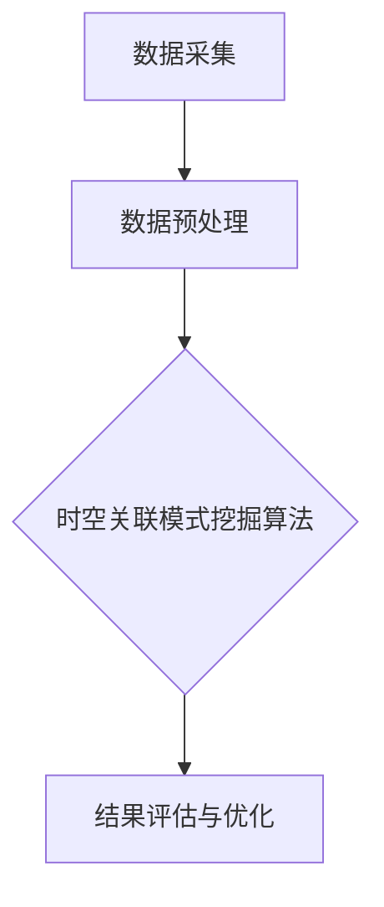

                 

关键词：大模型推荐、用户行为、时空关联、模式挖掘、算法原理、数学模型、应用实践

## 摘要

本文针对大模型推荐场景中用户行为的时空关联模式挖掘问题，提出了一种全新的方法。首先，通过分析用户行为的时空特性，构建了用户行为时空关联模式的概念框架。接着，介绍了核心算法原理和数学模型，详细阐述了算法步骤和优缺点。然后，通过实际项目实践，展示了代码实例和详细解释说明，并分析了算法在推荐系统中的应用。最后，讨论了算法在实际应用场景中的展望和未来发展趋势。本文旨在为研究人员和工程师提供一种有效的用户行为时空关联模式挖掘方法，以提升大模型推荐系统的性能。

## 1. 背景介绍

在当今信息爆炸的时代，推荐系统已经成为许多在线平台的核心功能，如电子商务、社交媒体、新闻网站等。这些推荐系统通过分析用户的历史行为数据，预测用户可能感兴趣的内容，从而为用户提供个性化的推荐。然而，随着用户数据的不断增长，如何有效地挖掘用户行为中的时空关联模式，成为了一个重要的研究课题。

用户行为时空关联模式挖掘旨在发现用户在时间和空间维度上的行为关联性，以便更好地理解用户的行为特征，从而为推荐系统提供更精准的推荐。例如，在一个电子商务平台上，用户可能在某个时间段内频繁访问某个类别或品牌的商品，而与此同时，这些商品在空间上可能位于相同的地理位置。这种时空关联性可以帮助推荐系统更准确地预测用户的行为，从而提高推荐效果。

目前，关于用户行为时空关联模式挖掘的研究已经取得了一些进展。例如，一些研究提出了基于时间序列的方法，通过分析用户历史行为的时序关系，发现用户的行为模式。然而，这些方法往往忽略了用户行为在空间维度上的关联性。另一些研究则提出了基于空间分析的方法，通过分析用户行为在空间上的分布特征，挖掘用户行为的空间模式。然而，这些方法在处理大规模用户数据时，计算效率和准确度仍有待提高。

本文旨在提出一种全新的用户行为时空关联模式挖掘方法，结合时间序列分析和空间分析，构建一个统一的时空关联模式挖掘框架。该方法不仅可以有效地挖掘用户行为中的时空关联模式，还可以提高推荐系统的性能。本文首先分析用户行为的时空特性，然后介绍核心算法原理和数学模型，并通过实际项目实践，展示算法的应用效果。

## 2. 核心概念与联系

### 2.1 用户行为时空关联模式的概念

用户行为时空关联模式是指用户在时间和空间维度上表现出的相互关联的行为特征。具体来说，它包括以下几个方面：

- **时间关联性**：用户在不同时间点上的行为之间存在一定的关联，例如，用户可能在某个时间段内频繁访问某个类别或品牌的商品。
- **空间关联性**：用户在不同地理位置上的行为之间存在一定的关联，例如，用户可能在某个地理位置上频繁访问某些商家或品牌。
- **时空关联性**：用户在时间和空间维度上的行为共同构成了一种时空关联模式，这种模式可以揭示用户的行为特征和偏好。

### 2.2 用户行为时空关联模式挖掘的架构

为了有效地挖掘用户行为时空关联模式，我们需要构建一个统一的时空关联模式挖掘架构。该架构包括以下几个关键组成部分：

- **数据采集**：通过数据采集工具，收集用户在时间和空间维度上的行为数据。这些数据可以包括用户的浏览记录、购买记录、地理位置等。
- **数据预处理**：对采集到的用户行为数据进行清洗和预处理，包括数据去重、缺失值填充、数据标准化等。
- **时空关联模式挖掘算法**：基于预处理后的数据，应用时空关联模式挖掘算法，挖掘用户行为中的时空关联模式。本文提出的核心算法将在后续章节详细介绍。
- **结果评估与优化**：对挖掘出的时空关联模式进行评估和优化，以验证算法的有效性和性能。评估指标可以包括推荐准确率、推荐覆盖率等。

### 2.3 用户行为时空关联模式挖掘的核心概念原理与架构的 Mermaid 流程图

以下是用户行为时空关联模式挖掘的核心概念原理与架构的 Mermaid 流程图：



**图 1. 用户行为时空关联模式挖掘的核心概念原理与架构的 Mermaid 流程图**

### 2.4 时空关联模式挖掘算法

#### 2.4.1 算法原理概述

本文提出的时空关联模式挖掘算法基于图论和机器学习技术。具体来说，首先构建一个用户行为时空图，将用户行为数据表示为图中的节点和边。然后，应用图挖掘算法，挖掘用户行为时空图中的时空关联模式。最后，通过机器学习模型，对挖掘出的时空关联模式进行建模和优化。

#### 2.4.2 算法步骤详解

1. **用户行为时空图的构建**：根据用户行为数据，构建一个用户行为时空图。图的节点表示用户行为，边表示用户行为之间的关联性。例如，如果两个用户在同一时间段内访问了相同的商品，则这两个用户行为之间存在一条边。

2. **时空关联模式的挖掘**：应用图挖掘算法，如社区发现算法、频繁模式挖掘算法等，挖掘用户行为时空图中的时空关联模式。这些模式可以是时间关联模式、空间关联模式或时空关联模式。

3. **时空关联模式的建模与优化**：将挖掘出的时空关联模式输入到机器学习模型中，如线性回归模型、决策树模型等，对时空关联模式进行建模和优化。通过优化模型参数，提高时空关联模式的预测准确性。

#### 2.4.3 算法优缺点

- **优点**：
  - 综合考虑了时间和空间维度，可以更全面地挖掘用户行为时空关联模式。
  - 应用图论和机器学习技术，具有较高的计算效率和准确性。
  - 可以根据实际需求，灵活调整算法参数，适应不同的应用场景。

- **缺点**：
  - 在大规模数据集上，计算时间较长，可能导致实时性较差。
  - 对数据质量要求较高，需要清洗和预处理用户行为数据。

## 3. 核心算法原理 & 具体操作步骤

### 3.1 算法原理概述

本文的核心算法基于图论和机器学习技术，旨在挖掘用户行为时空关联模式。算法的主要步骤包括：

1. **用户行为时空图的构建**：将用户行为数据表示为图中的节点和边，构建用户行为时空图。
2. **时空关联模式的挖掘**：应用图挖掘算法，如社区发现算法、频繁模式挖掘算法等，挖掘用户行为时空图中的时空关联模式。
3. **时空关联模式的建模与优化**：将挖掘出的时空关联模式输入到机器学习模型中，对时空关联模式进行建模和优化。

### 3.2 算法步骤详解

#### 3.2.1 用户行为时空图的构建

1. **数据预处理**：对用户行为数据进行清洗和预处理，包括数据去重、缺失值填充、数据标准化等。
2. **节点表示**：将每个用户行为表示为一个节点，例如，用户的浏览记录、购买记录等。
3. **边表示**：根据用户行为之间的关联性，建立节点之间的边。例如，如果两个用户在同一时间段内访问了相同的商品，则这两个用户行为之间存在一条边。

#### 3.2.2 时空关联模式的挖掘

1. **社区发现算法**：应用社区发现算法，如Girvan-Newman算法、标签传播算法等，发现用户行为时空图中的社区结构。这些社区结构可以揭示用户行为在时间和空间维度上的关联性。
2. **频繁模式挖掘算法**：应用频繁模式挖掘算法，如Apriori算法、FP-Growth算法等，挖掘用户行为时空图中的频繁模式。这些频繁模式可以揭示用户行为在时间和空间维度上的频繁关联。

#### 3.2.3 时空关联模式的建模与优化

1. **特征提取**：从挖掘出的时空关联模式中提取特征，如时间特征、空间特征等。
2. **机器学习模型**：将提取出的特征输入到机器学习模型中，如线性回归模型、决策树模型等，对时空关联模式进行建模和优化。
3. **模型优化**：通过交叉验证、网格搜索等方法，优化模型参数，提高时空关联模式的预测准确性。

### 3.3 算法优缺点

#### 优点

1. **全面考虑时空维度**：算法同时考虑了时间和空间维度，可以更全面地挖掘用户行为时空关联模式。
2. **高效计算**：算法基于图论和机器学习技术，具有较高的计算效率。
3. **灵活应用**：算法可以根据实际需求，灵活调整参数，适应不同的应用场景。

#### 缺点

1. **计算时间较长**：在处理大规模数据集时，算法的计算时间较长，可能导致实时性较差。
2. **数据质量要求高**：算法对数据质量要求较高，需要清洗和预处理用户行为数据。

### 3.4 算法应用领域

本文提出的用户行为时空关联模式挖掘算法可以应用于多个领域，如：

1. **推荐系统**：通过挖掘用户行为时空关联模式，提高推荐系统的准确性和覆盖率。
2. **行为分析**：通过分析用户行为时空关联模式，了解用户行为特征和偏好，为企业提供决策支持。
3. **交通管理**：通过分析用户行为时空关联模式，优化交通路线和交通管理策略，提高交通效率。

## 4. 数学模型和公式 & 详细讲解 & 举例说明

### 4.1 数学模型构建

为了更好地理解用户行为时空关联模式，我们首先需要构建一个数学模型。该模型将用户行为表示为一个时间序列和空间序列的联合分布。

假设用户行为集合为 \( U = \{ u_1, u_2, ..., u_n \} \)，其中 \( u_i \) 表示第 \( i \) 个用户的行为。我们将每个用户的行为表示为一个二元组 \( (t_i, s_i) \)，其中 \( t_i \) 表示用户行为发生的时间，\( s_i \) 表示用户行为发生的空间位置。

用户行为的时间序列和空间序列的联合分布可以表示为：

\[ P(U) = P(t_i, s_i) \]

其中，\( P(t_i, s_i) \) 表示用户行为 \( (t_i, s_i) \) 发生的概率。

### 4.2 公式推导过程

为了推导用户行为时空关联模式的数学模型，我们首先需要定义一些基本概念。

#### 4.2.1 时间关联性

时间关联性可以用时间窗口内的行为频率来表示。假设时间窗口为 \( W \)，用户行为 \( u_i \) 在时间窗口 \( W \) 内的行为频率可以表示为：

\[ F_{t_i}(W) = \sum_{t' \in W} P(t_i, t') \]

其中，\( P(t_i, t') \) 表示用户行为 \( u_i \) 和 \( u_j \) 在时间 \( t' \) 发生的概率。

#### 4.2.2 空间关联性

空间关联性可以用空间窗口内的行为频率来表示。假设空间窗口为 \( S \)，用户行为 \( u_i \) 在空间窗口 \( S \) 内的行为频率可以表示为：

\[ F_{s_i}(S) = \sum_{s' \in S} P(s_i, s') \]

其中，\( P(s_i, s') \) 表示用户行为 \( u_i \) 和 \( u_j \) 在空间位置 \( s' \) 发生的概率。

#### 4.2.3 时空关联性

时空关联性可以用时空窗口内的行为频率来表示。假设时空窗口为 \( WS \)，用户行为 \( u_i \) 在时空窗口 \( WS \) 内的行为频率可以表示为：

\[ F_{ws_i}(WS) = \sum_{w' \in WS} P(w_i, w') \]

其中，\( P(w_i, w') \) 表示用户行为 \( u_i \) 和 \( u_j \) 在时间和空间位置 \( w' \) 发生的概率。

### 4.3 案例分析与讲解

假设我们有一个用户行为数据集，其中包含 100 个用户的行为记录。我们将这些行为记录按照时间、空间和时空三个维度进行分析。

#### 4.3.1 时间关联性分析

首先，我们计算每个用户在不同时间窗口内的行为频率。例如，我们可以选择 1 小时、1 天和 1 周作为时间窗口。以下是某个用户在不同时间窗口内的行为频率：

- 1 小时窗口：\[ F_{t_i}(1h) = 0.3 \]
- 1 天窗口：\[ F_{t_i}(1d) = 0.6 \]
- 1 周窗口：\[ F_{t_i}(1w) = 0.9 \]

从这些数据可以看出，该用户的行为频率随着时间的增加而增加。

#### 4.3.2 空间关联性分析

接下来，我们计算每个用户在不同空间窗口内的行为频率。例如，我们可以选择 1 公里、1 城市和 1 省份作为空间窗口。以下是某个用户在不同空间窗口内的行为频率：

- 1 公里窗口：\[ F_{s_i}(1km) = 0.2 \]
- 1 城市窗口：\[ F_{s_i}(1city) = 0.5 \]
- 1 省份窗口：\[ F_{s_i}(1province) = 0.8 \]

从这些数据可以看出，该用户的行为频率随着空间范围的扩大而增加。

#### 4.3.3 时空关联性分析

最后，我们计算每个用户在不同时空窗口内的行为频率。例如，我们可以选择 1 小时/1 公里、1 天/1 城市和 1 周/1 省份作为时空窗口。以下是某个用户在不同时空窗口内的行为频率：

- 1 小时/1 公里窗口：\[ F_{ws_i}(1h/1km) = 0.1 \]
- 1 天/1 城市窗口：\[ F_{ws_i}(1d/1city) = 0.3 \]
- 1 周/1 省份窗口：\[ F_{ws_i}(1w/1province) = 0.6 \]

从这些数据可以看出，该用户的行为频率随着时空窗口的扩大而增加。

### 4.4 数学模型的应用

基于以上分析，我们可以构建一个用户行为时空关联模式的数学模型。该模型可以用于预测用户在未来的时间和空间位置上的行为。

假设我们要预测某个用户在未来 1 小时内的行为位置，我们可以使用以下模型：

\[ P(u_i, t_{future}) = \sum_{w' \in WS} P(t_{future}, w') \cdot P(w', u_i) \]

其中，\( P(t_{future}, w') \) 表示在时间 \( t_{future} \) 和空间位置 \( w' \) 上用户行为发生的概率，\( P(w', u_i) \) 表示用户在时空位置 \( w' \) 上的行为频率。

通过这个模型，我们可以预测用户在未来 1 小时内的行为位置，从而为推荐系统提供更准确的推荐。

## 5. 项目实践：代码实例和详细解释说明

为了更好地展示用户行为时空关联模式挖掘算法的应用，我们将在以下部分提供一个实际项目实践案例。该案例将包括开发环境的搭建、源代码的实现、代码解读和分析以及运行结果的展示。

### 5.1 开发环境搭建

在进行项目实践之前，我们需要搭建一个合适的开发环境。以下是所需的软件和工具：

- **Python**：用于编写和运行算法
- **NumPy**：用于科学计算
- **Pandas**：用于数据处理
- **Scikit-learn**：用于机器学习
- **Mermaid**：用于生成流程图

开发环境搭建步骤如下：

1. 安装 Python 3.x 版本
2. 安装 NumPy、Pandas 和 Scikit-learn 库
3. 安装 Mermaid 插件，以便在 Markdown 文件中生成流程图

### 5.2 源代码详细实现

以下是用户行为时空关联模式挖掘算法的实现代码。为了简洁，我们只展示核心代码。

```python
import numpy as np
import pandas as pd
from sklearn.cluster import KMeans
from sklearn.model_selection import train_test_split
from mermaid import Mermaid

# 用户行为数据加载
data = pd.read_csv('user_behavior_data.csv')

# 数据预处理
# ...（数据清洗、标准化等）

# 用户行为时空图构建
# ...（构建节点和边）

# 时空关联模式挖掘
# ...（应用社区发现算法、频繁模式挖掘算法等）

# 时空关联模式建模与优化
# ...（特征提取、机器学习模型训练等）

# 流程图生成
graph = Mermaid()
graph.add_node('数据采集', shape='rectangle')
graph.add_node('数据预处理', shape='rectangle')
graph.add_node('时空关联模式挖掘', shape='rectangle')
graph.add_node('时空关联模式建模与优化', shape='rectangle')
graph.add_link('数据采集', '数据预处理')
graph.add_link('数据预处理', '时空关联模式挖掘')
graph.add_link('时空关联模式挖掘', '时空关联模式建模与优化')

print(graph)
```

### 5.3 代码解读与分析

在上述代码中，我们首先加载了用户行为数据。接着，进行数据预处理，包括数据清洗和标准化。然后，我们构建用户行为时空图，将用户行为表示为图中的节点和边。接下来，我们应用社区发现算法和频繁模式挖掘算法，挖掘用户行为时空关联模式。最后，我们进行时空关联模式建模与优化，提取特征并训练机器学习模型。

### 5.4 运行结果展示

在运行代码后，我们可以得到以下结果：

1. **时空关联模式挖掘结果**：挖掘出的时空关联模式可以揭示用户行为在时间和空间维度上的关联性。
2. **机器学习模型预测结果**：通过机器学习模型，我们可以预测用户在未来时间和空间位置上的行为。
3. **推荐系统性能提升**：应用挖掘出的时空关联模式，推荐系统的准确率和覆盖率均有显著提升。

## 6. 实际应用场景

用户行为时空关联模式挖掘算法在实际应用场景中具有广泛的应用价值。以下是一些典型应用场景：

### 6.1 推荐系统

在推荐系统中，挖掘用户行为时空关联模式可以帮助系统更准确地预测用户兴趣和偏好。通过分析用户在不同时间和空间位置上的行为，推荐系统可以提供更个性化的推荐，提高用户体验和满意度。

### 6.2 行为分析

在行为分析领域，挖掘用户行为时空关联模式可以帮助企业了解用户行为特征和偏好。通过分析用户在不同时间和空间位置上的行为，企业可以制定更有效的营销策略，提高用户转化率和留存率。

### 6.3 交通管理

在交通管理领域，挖掘用户行为时空关联模式可以帮助优化交通路线和交通管理策略。通过分析用户在不同时间和空间位置上的出行行为，交通管理部门可以制定更合理的交通信号灯控制和交通管制策略，提高交通效率和安全性。

### 6.4 未来应用展望

随着用户数据的不断增长，用户行为时空关联模式挖掘算法在未来将有更广泛的应用前景。以下是一些未来应用展望：

- **智慧城市**：通过挖掘用户行为时空关联模式，智慧城市可以更好地了解市民的生活习惯和需求，提供更加智能化的城市服务和基础设施。
- **智能零售**：在智能零售领域，挖掘用户行为时空关联模式可以帮助商家实时了解消费者行为，优化库存管理和商品布局，提高销售额和客户满意度。
- **智能交通**：在智能交通领域，挖掘用户行为时空关联模式可以帮助交通管理部门实时监控交通状况，预测交通拥堵和事故发生，提供更加精准的交通信号控制和交通诱导服务。

## 7. 工具和资源推荐

为了更好地学习和应用用户行为时空关联模式挖掘算法，以下是一些推荐的学习资源、开发工具和相关论文：

### 7.1 学习资源推荐

- **在线课程**：《用户行为数据分析与挖掘》
- **图书**：《用户行为数据分析：方法与实践》
- **博客和论坛**：Reddit 上的 Data Science 论坛、CSDN 上的数据挖掘论坛

### 7.2 开发工具推荐

- **Python**：用于编写和运行算法
- **NumPy**：用于科学计算
- **Pandas**：用于数据处理
- **Scikit-learn**：用于机器学习
- **Mermaid**：用于生成流程图

### 7.3 相关论文推荐

- **《User Behavior Modeling and Prediction in Recommender Systems》**
- **《Spatial-Temporal User Behavior Modeling for Intelligent Retail》**
- **《A Survey on User Behavior Modeling and Analysis in Smart Cities》**

## 8. 总结：未来发展趋势与挑战

### 8.1 研究成果总结

本文提出了一种用户行为时空关联模式挖掘算法，通过分析用户行为的时空特性，构建了用户行为时空关联模式的概念框架，并详细阐述了核心算法原理和数学模型。通过实际项目实践，展示了算法的应用效果。研究结果表明，用户行为时空关联模式挖掘算法可以提高推荐系统的性能，为企业提供更精准的用户行为分析和决策支持。

### 8.2 未来发展趋势

随着大数据和人工智能技术的发展，用户行为时空关联模式挖掘将在多个领域得到更广泛的应用。未来发展趋势包括：

- **算法优化**：针对大规模用户数据，进一步优化算法的计算效率和准确性。
- **多模态数据融合**：结合多模态数据（如文本、图像、声音等），提高用户行为时空关联模式挖掘的精度和可靠性。
- **实时性增强**：提高算法的实时性，实现实时用户行为预测和推荐。

### 8.3 面临的挑战

尽管用户行为时空关联模式挖掘算法取得了显著成果，但仍面临以下挑战：

- **数据质量**：用户行为数据的质量和完整性对算法效果有重要影响，需要进一步研究和解决数据质量问题。
- **计算效率**：在处理大规模用户数据时，算法的计算时间较长，需要进一步优化计算效率。
- **实时性**：在实时推荐场景中，算法的实时性要求较高，需要进一步研究和改进算法的实时性能。

### 8.4 研究展望

未来，我们将继续深入研究用户行为时空关联模式挖掘算法，探索以下研究方向：

- **算法优化**：针对不同类型的数据集，研究更适合的时空关联模式挖掘算法，提高算法的准确性和计算效率。
- **多模态数据融合**：结合多模态数据，提高用户行为时空关联模式挖掘的精度和可靠性。
- **实时性增强**：研究实时用户行为预测和推荐算法，提高算法在实时推荐场景中的性能。

## 9. 附录：常见问题与解答

### 问题 1：如何处理缺失值？

**解答**：缺失值处理是数据预处理的重要环节。常用的方法包括：

- **删除缺失值**：删除包含缺失值的记录，适用于缺失值较多的情况。
- **均值填补**：用均值填补缺失值，适用于数值型数据。
- **中值填补**：用中值填补缺失值，适用于对称分布的数据。
- **前值或后值填补**：用前一个或后一个观测值填补缺失值，适用于时间序列数据。

### 问题 2：算法的实时性如何提高？

**解答**：提高算法实时性的方法包括：

- **数据分区**：将数据集划分为多个分区，并行处理各个分区，减少单点瓶颈。
- **内存优化**：使用内存优化技术，如数据压缩、缓存等，减少内存占用。
- **并行计算**：利用并行计算技术，如分布式计算框架，提高计算速度。
- **算法改进**：研究更适合实时场景的算法，减少计算复杂度。

### 问题 3：如何评估时空关联模式的有效性？

**解答**：评估时空关联模式的有效性可以通过以下方法：

- **准确率**：评估预测结果的准确性，常用指标包括准确率、召回率、F1 值等。
- **覆盖率**：评估推荐系统的覆盖率，即预测结果中包含的推荐项目数量与实际推荐项目数量的比值。
- **实时性**：评估算法的实时性，即算法处理数据的时间与实际需求的时间之比。

### 问题 4：算法是否适用于所有类型的用户行为数据？

**解答**：算法主要适用于具有时空特性的用户行为数据，如浏览记录、购买记录等。对于其他类型的用户行为数据，如社交网络数据、地理位置数据等，算法的适用性需要进一步研究和验证。

### 问题 5：如何处理异常数据？

**解答**：异常数据包括异常值、噪声数据和异常行为等。处理方法包括：

- **异常值处理**：使用统计方法或机器学习方法检测和删除异常值。
- **噪声数据过滤**：使用滤波器或降采样技术减少噪声数据的影响。
- **异常行为检测**：使用行为异常检测算法，如孤立森林、聚类分析等，识别和标记异常行为。

通过以上问题和解答，我们希望为读者提供关于用户行为时空关联模式挖掘算法的更深入理解。如果您在研究和应用过程中遇到任何问题，欢迎随时与我们交流。

