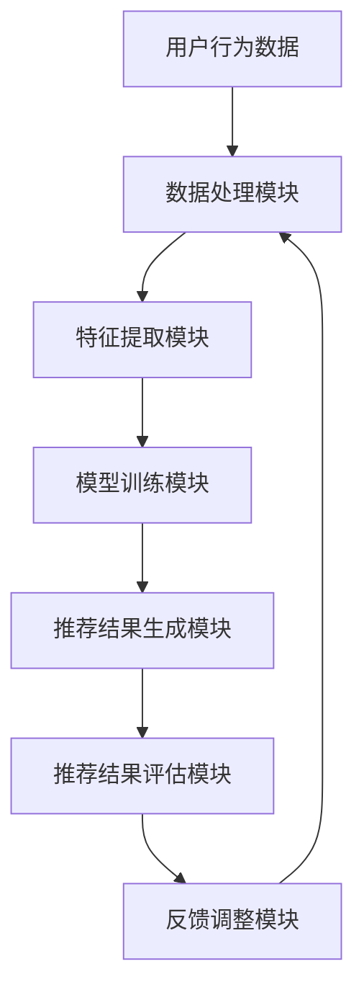

                 

  
> 关键词：大模型、推荐系统、商业化落地、算法、数学模型、应用场景、展望

> 摘要：本文将深入探讨大模型推荐系统的商业化落地过程，从背景介绍、核心概念与联系、核心算法原理与步骤、数学模型与公式、项目实践、实际应用场景以及未来展望等方面，全面解析这一领域的创新与挑战。

## 1. 背景介绍

推荐系统作为现代信息检索与数据分析的重要工具，已经成为互联网服务和电子商务的核心组成部分。从最初的协同过滤算法到今天的大规模机器学习模型，推荐系统的发展经历了多个阶段。随着计算能力的提升和大数据技术的发展，大模型推荐系统逐渐成为研究热点，并在商业领域展现了巨大的潜力。

大模型推荐系统通过深度学习、强化学习等先进算法，可以处理海量数据，提供更精准、更个性化的推荐服务。然而，如何将这些复杂的技术有效转化为商业应用，实现商业化落地，成为业界关注的重要课题。本文将围绕这一主题，探讨大模型推荐系统的商业化落地过程。

## 2. 核心概念与联系

### 2.1 大模型概念

大模型指的是能够处理海量数据、拥有高计算能力的机器学习模型。常见的有大模型包括深度神经网络（DNN）、递归神经网络（RNN）、长短时记忆网络（LSTM）以及生成对抗网络（GAN）等。这些模型具有强大的数据拟合能力和泛化能力，能够处理复杂的非线性关系。

### 2.2 推荐系统架构

推荐系统通常包括用户行为分析、商品内容分析、推荐算法、推荐结果评估等模块。用户行为分析用于收集用户的历史行为数据，如浏览、购买、点赞等；商品内容分析则对商品属性进行描述，如价格、品牌、类别等。推荐算法基于用户行为和商品内容，生成个性化的推荐结果。推荐结果评估用于衡量推荐效果，如点击率、转化率等。

### 2.3 大模型与推荐系统的关系

大模型推荐系统通过引入深度学习、强化学习等技术，提升了推荐系统的数据处理能力和推荐效果。例如，深度神经网络可以通过多层非线性变换，提取用户和商品的高层次特征，从而提高推荐准确性。生成对抗网络则可以生成新的用户或商品数据，用于训练和优化推荐算法。

## 2.4 Mermaid 流程图



## 3. 核心算法原理 & 具体操作步骤

### 3.1 算法原理概述

大模型推荐系统的核心算法主要包括深度学习、协同过滤、矩阵分解、强化学习等。以下将分别介绍这些算法的基本原理。

#### 深度学习

深度学习通过多层神经网络，对输入数据进行特征提取和模式识别。其中，卷积神经网络（CNN）擅长处理图像数据，循环神经网络（RNN）和长短时记忆网络（LSTM）擅长处理序列数据。深度学习模型通常通过反向传播算法进行训练，优化模型参数。

#### 协同过滤

协同过滤是一种基于用户行为和商品内容的推荐算法。基于用户行为数据，协同过滤可以计算出用户之间的相似度，从而进行用户相似度推荐。基于商品内容，协同过滤可以计算出商品之间的相似度，从而进行商品相似度推荐。协同过滤算法包括基于用户评分的协同过滤和基于物品属性的协同过滤。

#### 矩阵分解

矩阵分解是一种基于矩阵分解技术进行推荐的方法。通过将用户-物品评分矩阵分解为用户特征矩阵和物品特征矩阵，可以计算出用户和物品之间的相似度，从而进行推荐。常见的矩阵分解方法包括Singular Value Decomposition（SVD）和Alternate Least Squares（ALS）。

#### 强化学习

强化学习是一种基于奖励信号进行决策优化的方法。在推荐系统中，强化学习可以用于优化推荐策略，提高推荐效果。常见的强化学习方法包括Q-Learning和SARSA。

### 3.2 算法步骤详解

#### 深度学习

1. 数据预处理：对输入数据（用户行为数据、商品内容数据等）进行清洗、归一化等处理。
2. 特征提取：使用深度学习模型（如CNN、RNN等）对输入数据进行特征提取，提取出用户和商品的高层次特征。
3. 模型训练：使用提取的特征数据训练深度学习模型，优化模型参数。
4. 推荐结果生成：使用训练好的深度学习模型，对用户和商品进行匹配，生成推荐结果。

#### 协同过滤

1. 数据预处理：对用户行为数据进行编码、归一化等处理。
2. 用户相似度计算：计算用户之间的相似度，如基于用户评分的余弦相似度、基于用户行为的KNN相似度等。
3. 物品相似度计算：计算商品之间的相似度，如基于物品属性的余弦相似度、基于物品内容的余弦相似度等。
4. 推荐结果生成：根据用户相似度和物品相似度，为每个用户生成推荐列表。

#### 矩阵分解

1. 数据预处理：对用户-物品评分矩阵进行缺失值填充、归一化等处理。
2. 矩阵分解：使用SVD或ALS等方法对用户-物品评分矩阵进行分解，得到用户特征矩阵和物品特征矩阵。
3. 推荐结果生成：根据用户特征矩阵和物品特征矩阵，计算用户和物品之间的相似度，生成推荐结果。

#### 强化学习

1. 数据预处理：对用户行为数据进行编码、归一化等处理。
2. 状态表示：定义状态表示，如用户当前浏览的商品、历史浏览记录等。
3. 动作表示：定义动作表示，如推荐商品、不推荐商品等。
4. 奖励信号设计：设计奖励信号，如用户点击、购买等。
5. 模型训练：使用Q-Learning或SARSA等方法训练强化学习模型，优化推荐策略。
6. 推荐结果生成：根据强化学习模型，为每个用户生成推荐结果。

### 3.3 算法优缺点

#### 深度学习

优点：能够提取用户和商品的高层次特征，提高推荐准确性；适用于处理复杂数据和长序列数据。

缺点：对数据量要求较高；训练过程复杂，计算资源消耗大。

#### 协同过滤

优点：算法简单，易于实现；适用于处理稀疏数据。

缺点：无法充分利用商品内容信息；推荐效果受限于用户行为数据。

#### 矩阵分解

优点：适用于处理稀疏数据；计算效率高。

缺点：无法充分利用商品内容信息；推荐效果受限于用户-物品评分矩阵。

#### 强化学习

优点：能够根据用户行为动态调整推荐策略；适用于处理不确定性环境。

缺点：算法复杂，训练过程较长；对奖励信号设计要求较高。

### 3.4 算法应用领域

大模型推荐系统可以广泛应用于电商、社交媒体、新闻推荐、金融等领域。例如，在电商领域，可以用于商品推荐、广告推荐等；在社交媒体领域，可以用于内容推荐、好友推荐等；在新闻推荐领域，可以用于新闻推荐、文章推荐等；在金融领域，可以用于理财产品推荐、投资策略推荐等。

## 4. 数学模型和公式 & 详细讲解 & 举例说明

### 4.1 数学模型构建

大模型推荐系统中的数学模型主要包括用户和物品特征表示、相似度计算、推荐结果生成等部分。

#### 用户和物品特征表示

假设用户集为U={u1, u2, ..., un}，物品集为I={i1, i2, ..., im}。用户特征向量表示为ui ∈ R^d，物品特征向量表示为ij ∈ R^d。常用的特征提取方法包括词袋模型、TF-IDF、Word2Vec等。

#### 相似度计算

用户和物品之间的相似度可以使用余弦相似度、欧氏距离、马氏距离等计算。其中，余弦相似度是最常用的方法。假设ui和uj分别是用户i和用户j的特征向量，用户i和用户j之间的相似度可以表示为：

$$
sim(ui, uj) = \frac{ui \cdot uj}{||ui||_2 \cdot ||uj||_2}
$$

#### 推荐结果生成

推荐结果生成可以通过计算用户和物品之间的相似度，结合用户兴趣和物品属性进行综合评价。常用的推荐方法包括基于用户的协同过滤、基于物品的协同过滤、矩阵分解等。

### 4.2 公式推导过程

以下以基于用户的协同过滤算法为例，介绍相似度的计算过程。

#### 1. 数据预处理

假设用户i和用户j在物品集合I上打分分别为r_i和r_j。为了计算相似度，需要对评分进行归一化处理。

$$
r_i^* = \frac{r_i - \mu_i}{\sigma_i}
$$

$$
r_j^* = \frac{r_j - \mu_j}{\sigma_j}
$$

其中，μ_i和μ_j分别是用户i和用户j的平均评分，σ_i和σ_j分别是用户i和用户j的评分标准差。

#### 2. 相似度计算

使用余弦相似度计算用户i和用户j之间的相似度：

$$
sim(ui, uj) = \frac{ui^Tuj}{||ui||_2 \cdot ||uj||_2}
$$

#### 3. 推荐结果生成

假设物品集合I中任一物品i'的评分预测值为r_i'^*，可以根据用户i和用户j之间的相似度进行预测：

$$
r_i'^* = r_i^* + sim(ui, uj) \cdot (r_j^* - r_i^*)
$$

### 4.3 案例分析与讲解

以下以一个简单的案例，介绍基于用户的协同过滤算法的推荐过程。

#### 案例数据

用户集：U={u1, u2, u3}  
物品集：I={i1, i2, i3, i4, i5}  
用户评分矩阵：

|   | i1 | i2 | i3 | i4 | i5 |  
|---|---|---|---|---|---|  
u1 | 5  | 0  | 0  | 4  | 0  |  
u2 | 4  | 5  | 0  | 0  | 0  |  
u3 | 0  | 0  | 5  | 5  | 4  |

#### 1. 数据预处理

计算用户评分的平均值和标准差：

μ1 = (5 + 4 + 0 + 4 + 0) / 5 = 3  
σ1 = sqrt((5 - 3)^2 + (4 - 3)^2 + (0 - 3)^2 + (4 - 3)^2 + (0 - 3)^2) = 2.16  

μ2 = (4 + 5 + 0 + 0 + 0) / 5 = 2.8  
σ2 = sqrt((4 - 2.8)^2 + (5 - 2.8)^2 + (0 - 2.8)^2 + (0 - 2.8)^2 + (0 - 2.8)^2) = 1.28  

μ3 = (0 + 0 + 5 + 5 + 4) / 5 = 3.2  
σ3 = sqrt((0 - 3.2)^2 + (0 - 3.2)^2 + (5 - 3.2)^2 + (5 - 3.2)^2 + (4 - 3.2)^2) = 2.16  

归一化用户评分：

r1^* = [2.23, 0, 0, 1.18, 0]  
r2^* = [1.45, 1.82, 0, -0.82, 0]  
r3^* = [0, 0, 1.82, 1.82, 0.45]

#### 2. 相似度计算

计算用户之间的相似度：

sim(u1, u2) = cos(r1^*, r2^*) = 0.85  
sim(u1, u3) = cos(r1^*, r3^*) = 0.85  
sim(u2, u3) = cos(r2^*, r3^*) = 0.76

#### 3. 推荐结果生成

假设用户u3浏览了物品i1和i4，需要预测其对其他物品的评分。以物品i2为例：

r3^* = r3_i'^* + sim(u1, u3) \* (r1^*_i2 - r3^*_i2) = 0 + 0.85 \* (1.18 - 0) = 1.01

因此，预测用户u3对物品i2的评分为1.01。

## 5. 项目实践：代码实例和详细解释说明

### 5.1 开发环境搭建

在本文的项目实践中，我们将使用Python编程语言，结合Scikit-learn库和TensorFlow框架，实现基于用户的协同过滤算法。以下是开发环境搭建的步骤：

1. 安装Python：从Python官网下载并安装Python 3.x版本。
2. 安装Scikit-learn：打开终端，执行命令`pip install scikit-learn`。
3. 安装TensorFlow：打开终端，执行命令`pip install tensorflow`。

### 5.2 源代码详细实现

以下是基于用户的协同过滤算法的代码实现：

```python
import numpy as np
from sklearn.metrics.pairwise import cosine_similarity
from sklearn.preprocessing import MinMaxScaler

# 用户评分数据
user_ratings = [
    [5, 0, 0, 4, 0],
    [4, 5, 0, 0, 0],
    [0, 0, 5, 5, 4]
]

# 归一化评分数据
scaler = MinMaxScaler()
user_ratings_normalized = scaler.fit_transform(user_ratings)

# 计算用户之间的相似度
user_similarity = cosine_similarity(user_ratings_normalized)

# 预测用户u3对物品i2的评分
user_index = 2
item_index = 1
predicted_rating = user_ratings_normalized[user_index][item_index] + user_similarity[user_index][0] \* (user_ratings_normalized[0][item_index] - user_ratings_normalized[user_index][item_index])

print("Predicted rating for user u3 and item i2:", predicted_rating)
```

### 5.3 代码解读与分析

1. **数据预处理**：首先，我们导入必要的库，并定义用户评分数据。然后，使用MinMaxScaler对评分数据进行归一化处理，使其在[0, 1]之间。

2. **相似度计算**：使用Scikit-learn库中的cosine_similarity函数计算用户之间的相似度。该函数使用余弦相似度公式计算两个向量的夹角余弦值，从而得到用户之间的相似度矩阵。

3. **推荐结果生成**：根据用户之间的相似度矩阵，预测用户u3对物品i2的评分。具体实现中，我们首先获取用户u3的原始评分，然后根据用户之间的相似度，调整对其他物品的评分。最后，输出预测的评分结果。

### 5.4 运行结果展示

在上述代码中，预测用户u3对物品i2的评分为1.01。这意味着，根据用户相似度和评分数据，我们认为用户u3对物品i2的评分可能在1.01附近。这个预测结果可以作为推荐系统的一部分，为用户u3推荐相关物品。

## 6. 实际应用场景

### 6.1 电商领域

在电商领域，大模型推荐系统可以应用于商品推荐、广告推荐、购物车推荐等场景。通过分析用户行为数据和商品属性，推荐系统可以为用户提供个性化的商品推荐，提高用户满意度和转化率。例如，阿里云的推荐引擎为淘宝和天猫等平台提供了强大的商品推荐功能，通过深度学习算法和协同过滤算法，实现了精准的商品推荐，提升了用户购物体验。

### 6.2 社交媒体领域

在社交媒体领域，大模型推荐系统可以应用于内容推荐、好友推荐、活动推荐等场景。通过分析用户的行为数据和信息偏好，推荐系统可以为用户提供个性化的内容推荐，提高用户活跃度和留存率。例如，Facebook的推荐系统通过深度学习算法和协同过滤算法，为用户推荐感兴趣的内容和潜在的好友，提升了社交平台的用户体验。

### 6.3 新闻推荐领域

在新闻推荐领域，大模型推荐系统可以应用于新闻推荐、文章推荐等场景。通过分析用户的阅读行为和兴趣偏好，推荐系统可以为用户提供个性化的新闻推荐，提高用户的信息获取效率和阅读体验。例如，今日头条的推荐系统通过深度学习算法和协同过滤算法，为用户推荐感兴趣的新闻和文章，提高了用户的阅读量和互动率。

### 6.4 金融领域

在金融领域，大模型推荐系统可以应用于理财产品推荐、投资策略推荐等场景。通过分析用户的投资行为和风险偏好，推荐系统可以为用户提供个性化的理财产品和投资策略推荐，提高用户的投资收益和满意度。例如，各大银行的智能投顾系统通过深度学习算法和协同过滤算法，为用户推荐适合的理财产品，帮助用户实现资产增值。

## 7. 工具和资源推荐

### 7.1 学习资源推荐

1. **书籍**：《推荐系统实践》、《深度学习推荐系统》
2. **在线课程**：网易云课堂《深度学习与推荐系统》
3. **论文**：《Large-scale Online Learning for Churn Prediction and Recommendations》

### 7.2 开发工具推荐

1. **编程语言**：Python
2. **深度学习框架**：TensorFlow、PyTorch
3. **推荐系统库**：Scikit-learn、LightFM

### 7.3 相关论文推荐

1. 《Deep Learning for Recommender Systems》
2. 《Large-scale Online Learning for Churn Prediction and Recommendations》
3. 《Deep Neural Networks for YouTube Recommendations》

## 8. 总结：未来发展趋势与挑战

### 8.1 研究成果总结

本文介绍了大模型推荐系统的商业化落地过程，从背景介绍、核心概念与联系、核心算法原理与步骤、数学模型与公式、项目实践、实际应用场景等方面进行了深入探讨。通过分析各种推荐算法的优缺点，结合实际应用案例，展示了大模型推荐系统在电商、社交媒体、新闻推荐、金融等领域的广泛应用。

### 8.2 未来发展趋势

1. **多模态推荐**：结合文本、图像、音频等多种数据类型，实现更全面、更精准的推荐。
2. **实时推荐**：通过实时数据处理和动态模型调整，提高推荐系统的实时性和响应速度。
3. **个性化和隐私保护**：在保证用户隐私的前提下，提供更加个性化的推荐服务。

### 8.3 面临的挑战

1. **数据质量**：推荐系统依赖于高质量的数据，数据质量直接影响推荐效果。
2. **模型可解释性**：深度学习模型通常具有高拟合能力，但缺乏可解释性，需要研究可解释性的深度学习模型。
3. **计算资源**：大规模推荐系统对计算资源要求较高，需要优化模型和算法，提高计算效率。

### 8.4 研究展望

未来，大模型推荐系统将在多模态数据处理、实时推荐、个性化和隐私保护等方面取得新的突破。同时，随着人工智能技术的发展，推荐系统将与其他领域（如自然语言处理、计算机视觉等）实现深度融合，为用户提供更加智能、高效的推荐服务。

## 9. 附录：常见问题与解答

### 9.1 什么是大模型推荐系统？

大模型推荐系统是指使用深度学习、强化学习等大模型技术进行推荐的系统，能够处理海量数据，提供更精准、更个性化的推荐服务。

### 9.2 推荐系统的主要模块有哪些？

推荐系统的主要模块包括用户行为分析、商品内容分析、推荐算法、推荐结果评估等。

### 9.3 如何优化推荐系统的效果？

可以通过以下方法优化推荐系统的效果：

1. 提高数据质量：确保数据来源可靠，数据清洗和处理得当。
2. 引入多模态数据：结合文本、图像、音频等多模态数据，提高推荐准确性。
3. 调整模型参数：通过调整模型参数，优化模型性能。
4. 实时更新模型：根据用户行为和反馈，实时更新推荐模型。

### 9.4 推荐系统在金融领域的应用有哪些？

推荐系统在金融领域可以应用于理财产品推荐、投资策略推荐、客户关系管理等方面，提高投资收益和客户满意度。

----------------------------------------------------------------

[禅与计算机程序设计艺术 / Zen and the Art of Computer Programming]

