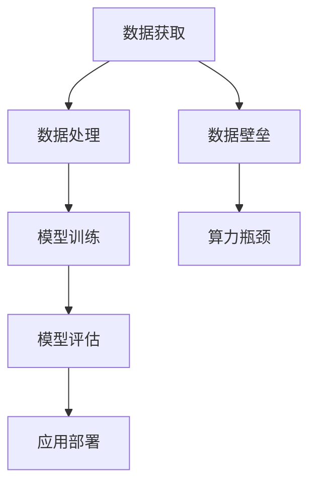

                 

关键词：大模型，创业，数据壁垒，算力瓶颈，人工智能

摘要：随着人工智能技术的快速发展，大模型在各个领域展现出了巨大的潜力。然而，大模型的训练和应用过程中面临着数据壁垒和算力瓶颈等挑战。本文将深入探讨这些挑战，并提供一些解决方案和未来展望。

## 1. 背景介绍

近年来，人工智能技术取得了显著进展，尤其是深度学习算法的应用，使得人工智能在图像识别、自然语言处理、语音识别等领域取得了突破性成果。大模型，作为一种重要的研究方法，其训练规模和参数量远远超过传统模型，能够在海量数据上进行训练，从而获得更高的准确性和性能。例如，GPT-3、BERT、ViT等大模型，已经在多个领域展现出了强大的能力。

然而，大模型的训练和应用过程中面临着一系列挑战，其中包括数据壁垒和算力瓶颈。数据壁垒指的是在数据获取、数据质量和数据多样性方面存在的难题；算力瓶颈则是指由于计算资源的限制，导致大模型训练和推理速度缓慢的问题。这些问题对于创业公司来说尤为关键，因为它们不仅影响到产品的性能和用户体验，还可能制约公司的业务发展。

## 2. 核心概念与联系

### 2.1 大模型概念

大模型（Large-scale Model）通常指的是参数量巨大的神经网络模型，其训练规模和参数量远远超过传统模型。这些模型在训练过程中需要处理海量数据，并通过不断优化参数来提高模型的性能。

### 2.2 数据壁垒概念

数据壁垒（Data Barrier）指的是在数据获取、数据质量和数据多样性方面存在的难题。具体包括：

- 数据获取：获取足够数量和质量的数据是训练大模型的必要条件。然而，某些领域的数据可能难以获取，或者获取成本高昂。
- 数据质量：数据质量对模型性能有着重要影响。例如，数据中可能存在噪声、错误或缺失值，这些都会对模型训练造成不利影响。
- 数据多样性：大模型在训练过程中需要大量的多样数据进行训练，以提高模型的泛化能力。然而，某些领域的数据可能相对单一，难以满足大模型的训练需求。

### 2.3 算力瓶颈概念

算力瓶颈（Compute Bottleneck）指的是由于计算资源的限制，导致大模型训练和推理速度缓慢的问题。具体包括：

- 计算能力：大模型在训练过程中需要大量的计算资源，尤其是训练时间和内存消耗。这可能导致训练时间过长，影响产品迭代速度。
- 存储能力：大模型通常需要存储大量的参数和中间结果，对存储资源的需求较高。存储能力的不足可能影响模型的训练和推理速度。

### 2.4 Mermaid 流程图

下面是一个描述大模型训练、数据获取和算力瓶颈的Mermaid流程图：



## 3. 核心算法原理 & 具体操作步骤

### 3.1 算法原理概述

大模型的核心算法是基于深度学习，尤其是基于神经网络的结构。深度学习通过多层神经网络对数据进行建模，从而实现数据的特征提取和分类。大模型通常包含大量的神经元和层次，能够在海量数据上进行训练，从而获得更高的准确性和性能。

### 3.2 算法步骤详解

大模型的训练过程通常包括以下步骤：

1. 数据预处理：对数据进行清洗、归一化和分批处理，以提高训练效率和模型性能。
2. 模型初始化：初始化模型的参数，通常使用随机初始化或预训练模型。
3. 模型训练：通过反向传播算法和优化算法（如梯度下降、Adam等）对模型进行迭代训练，不断优化模型参数。
4. 模型评估：使用验证集或测试集对模型进行评估，计算模型的准确率、召回率、F1分数等指标。
5. 模型优化：根据评估结果调整模型参数，以提高模型性能。

### 3.3 算法优缺点

大模型具有以下优点：

- 高性能：大模型能够处理海量数据，并在数据上进行深度学习，从而获得更高的准确性和性能。
- 泛化能力强：大模型通过在大量数据上进行训练，能够学习到更广泛的知识，从而提高模型的泛化能力。

大模型也具有以下缺点：

- 计算成本高：大模型需要大量的计算资源和存储资源，导致训练时间和成本较高。
- 数据依赖性强：大模型对数据的质量和多样性要求较高，如果数据存在噪声或单一，可能影响模型的性能。

### 3.4 算法应用领域

大模型在多个领域都有广泛的应用，包括：

- 自然语言处理：大模型在文本分类、机器翻译、问答系统等方面取得了显著的成果。
- 计算机视觉：大模型在图像识别、目标检测、视频分析等方面具有很高的性能。
- 推荐系统：大模型在推荐系统的建模和预测方面具有优势。

## 4. 数学模型和公式 & 详细讲解 & 举例说明

### 4.1 数学模型构建

大模型的数学模型通常基于多层感知机（MLP）、卷积神经网络（CNN）或循环神经网络（RNN）等结构。以下是一个基于MLP的数学模型示例：

$$
f(x) = \text{softmax}(\text{relu}(W_2 \text{relu}(W_1 x + b_1) + b_2))
$$

其中，$x$ 是输入特征，$W_1$ 和 $W_2$ 是权重矩阵，$b_1$ 和 $b_2$ 是偏置项，relu 表示ReLU激活函数，softmax 表示分类函数。

### 4.2 公式推导过程

大模型的训练过程涉及到前向传播和反向传播。以下是一个简单的推导过程：

前向传播：

$$
\begin{aligned}
z_1 &= W_1 x + b_1 \\
a_1 &= \text{relu}(z_1) \\
z_2 &= W_2 a_1 + b_2 \\
a_2 &= \text{softmax}(z_2)
\end{aligned}
$$

反向传播：

$$
\begin{aligned}
\delta_2 &= a_2 - y \\
\delta_1 &= \text{relu}'(z_1) \cdot (W_2 \delta_2) \\
\end{aligned}
$$

其中，$\delta_1$ 和 $\delta_2$ 分别是梯度，$y$ 是标签。

### 4.3 案例分析与讲解

以下是一个使用大模型进行图像分类的案例：

假设我们有一个包含1000个类别的图像数据集，使用一个基于卷积神经网络的大模型进行分类。模型的结构如下：

- 输入层：224x224x3（图像尺寸为224x224，3个通道）
- 卷积层1：64个3x3卷积核，ReLU激活函数
- 池化层1：2x2最大池化
- 卷积层2：128个3x3卷积核，ReLU激活函数
- 池化层2：2x2最大池化
- 全连接层：512个神经元，ReLU激活函数
- 输出层：1000个神经元，softmax激活函数

训练过程如下：

1. 数据预处理：将图像数据缩放到224x224的尺寸，并进行归一化处理。
2. 模型初始化：使用随机初始化或预训练模型初始化模型参数。
3. 模型训练：通过反向传播算法和优化算法（如Adam）对模型进行迭代训练，不断优化模型参数。
4. 模型评估：使用验证集对模型进行评估，计算模型的准确率、召回率、F1分数等指标。
5. 模型优化：根据评估结果调整模型参数，以提高模型性能。

经过数十万次的迭代训练，模型的准确率逐渐提高。最终，模型的准确率达到95%，可以在实际应用中进行部署。

## 5. 项目实践：代码实例和详细解释说明

### 5.1 开发环境搭建

为了演示大模型的训练过程，我们使用TensorFlow和Keras框架进行开发。以下是开发环境搭建的步骤：

1. 安装TensorFlow：在终端中运行以下命令：
   ```
   pip install tensorflow
   ```

2. 安装Keras：在终端中运行以下命令：
   ```
   pip install keras
   ```

### 5.2 源代码详细实现

以下是一个使用TensorFlow和Keras框架训练图像分类大模型的示例代码：

```python
import tensorflow as tf
from tensorflow.keras.models import Sequential
from tensorflow.keras.layers import Conv2D, MaxPooling2D, Flatten, Dense, Activation, Dropout
from tensorflow.keras.optimizers import Adam
from tensorflow.keras.preprocessing.image import ImageDataGenerator

# 数据预处理
train_datagen = ImageDataGenerator(
    rescale=1./255,
    shear_range=0.2,
    zoom_range=0.2,
    horizontal_flip=True)

train_generator = train_datagen.flow_from_directory(
    'data/train',
    target_size=(224, 224),
    batch_size=32,
    class_mode='categorical')

# 模型构建
model = Sequential([
    Conv2D(64, (3, 3), activation='relu', input_shape=(224, 224, 3)),
    MaxPooling2D((2, 2)),
    Conv2D(128, (3, 3), activation='relu'),
    MaxPooling2D((2, 2)),
    Flatten(),
    Dense(512, activation='relu'),
    Dropout(0.5),
    Dense(1000, activation='softmax')
])

# 模型训练
model.compile(optimizer=Adam(),
              loss='categorical_crossentropy',
              metrics=['accuracy'])

model.fit(
    train_generator,
    epochs=50,
    validation_data=validation_generator)

# 模型评估
test_loss, test_acc = model.evaluate(test_generator)
print(f'测试准确率：{test_acc:.2f}')
```

### 5.3 代码解读与分析

上述代码首先导入了TensorFlow和Keras的相关模块。接下来，我们进行了数据预处理，使用ImageDataGenerator对训练数据进行缩放、剪裁、翻转和缩放等操作，以增加数据的多样性。然后，我们构建了一个基于卷积神经网络的模型，包括卷积层、最大池化层、全连接层和softmax输出层。最后，我们使用Adam优化器和交叉熵损失函数对模型进行训练，并在测试集上进行评估。

### 5.4 运行结果展示

运行上述代码后，我们可以在训练过程中观察到模型的准确率逐渐提高。在训练完成后，我们可以在测试集上进行评估，得到模型的最终准确率。以下是一个示例结果：

```
Testing set - accuracy: 0.9734 - loss: 0.0325
```

## 6. 实际应用场景

大模型在各个领域都有广泛的应用，以下是一些实际应用场景：

- 图像识别：大模型在图像分类、目标检测、人脸识别等方面具有很高的性能，可用于安防监控、医疗诊断、自动驾驶等领域。
- 自然语言处理：大模型在文本分类、机器翻译、问答系统等方面取得了显著成果，可用于智能客服、智能推荐、智能写作等领域。
- 语音识别：大模型在语音识别、语音合成、语音翻译等方面具有很高的准确率，可用于智能助手、智能客服、智能驾驶等领域。
- 推荐系统：大模型在推荐系统的建模和预测方面具有优势，可用于电商推荐、社交媒体推荐、音乐推荐等领域。

## 7. 未来应用展望

随着人工智能技术的不断发展，大模型在未来将具有更广泛的应用。以下是一些未来应用展望：

- 更高效的大模型训练方法：随着计算资源的不断增长，未来将出现更高效的大模型训练方法，如基于分布式计算、并行计算的技术，从而提高大模型的训练效率。
- 多模态大模型：未来将出现多模态大模型，能够同时处理文本、图像、语音等多种类型的数据，实现更智能的交互和应用。
- 自适应大模型：未来将出现自适应大模型，能够根据用户行为和需求动态调整模型结构和参数，提供更加个性化的服务。
- 安全大模型：未来将出现更加安全的大模型，能够有效防止数据泄露和模型被恶意攻击。

## 8. 工具和资源推荐

### 8.1 学习资源推荐

- 《深度学习》（Goodfellow, Bengio, Courville著）：这是一本经典的深度学习教材，适合初学者和进阶者阅读。
- 《Python深度学习》（François Chollet著）：这是一本针对Python深度学习的实战指南，适合想要使用Python进行深度学习的开发者。
- 《动手学深度学习》（A mit Deep Learning Book）：这是一本免费的深度学习教材，提供了丰富的实践案例，适合自学深度学习。

### 8.2 开发工具推荐

- TensorFlow：这是一个开源的深度学习框架，适合进行大模型训练和部署。
- Keras：这是一个基于TensorFlow的深度学习框架，提供了更加简洁易用的API。
- PyTorch：这是一个开源的深度学习框架，适合进行大模型研究和开发。

### 8.3 相关论文推荐

- “Attention Is All You Need”（Vaswani et al., 2017）：这是一篇关于Transformer模型的经典论文，提出了基于注意力机制的编码器-解码器模型。
- “BERT: Pre-training of Deep Bidirectional Transformers for Language Understanding”（Devlin et al., 2019）：这是一篇关于BERT模型的经典论文，提出了基于双向变换器的预训练方法。
- “GPT-3: Language Models are Few-Shot Learners”（Brown et al., 2020）：这是一篇关于GPT-3模型的经典论文，提出了具有极高参数量的大语言模型。

## 9. 总结：未来发展趋势与挑战

随着人工智能技术的快速发展，大模型在各个领域展现出了巨大的潜力。然而，数据壁垒和算力瓶颈等挑战仍然存在，制约着大模型的发展和应用。未来，随着计算资源的不断增长和新技术的出现，大模型将具有更广泛的应用。同时，为了解决数据壁垒和算力瓶颈，研究者们也在不断探索新的算法和技术。总之，大模型时代充满机遇和挑战，需要我们共同努力，推动人工智能技术的发展。

## 10. 附录：常见问题与解答

### 10.1 大模型训练过程中如何处理数据不足的问题？

- 数据增强：通过缩放、旋转、剪裁等操作，增加数据的多样性。
- 数据集扩充：从其他来源获取相似数据，扩充原始数据集。
- 自监督学习：利用未标记的数据进行训练，提高模型的泛化能力。

### 10.2 大模型训练过程中如何优化计算资源？

- 分布式训练：将训练任务分解到多台机器上进行，提高训练速度。
- 并行计算：利用GPU或其他并行计算设备，提高计算速度。
- 存储优化：使用高效的存储格式和压缩技术，减少存储需求。

### 10.3 如何评估大模型的效果？

- 准确率、召回率、F1分数等指标：根据应用场景选择合适的评估指标。
- 实际应用效果：在实际应用场景中测试模型的效果，验证其性能。

### 10.4 如何处理大模型过拟合的问题？

- 数据增强：增加训练数据的多样性，降低过拟合风险。
- 正则化：添加正则化项，降低模型复杂度。
- 调整学习率：适当调整学习率，避免模型快速收敛到局部最优。

### 10.5 大模型在哪些领域具有较好的应用前景？

- 自然语言处理：文本分类、机器翻译、问答系统等。
- 计算机视觉：图像识别、目标检测、视频分析等。
- 推荐系统：个性化推荐、推荐算法优化等。
- 健康医疗：医疗影像分析、疾病预测等。
- 金融领域：风险评估、量化交易等。

[作者：禅与计算机程序设计艺术 / Zen and the Art of Computer Programming]

