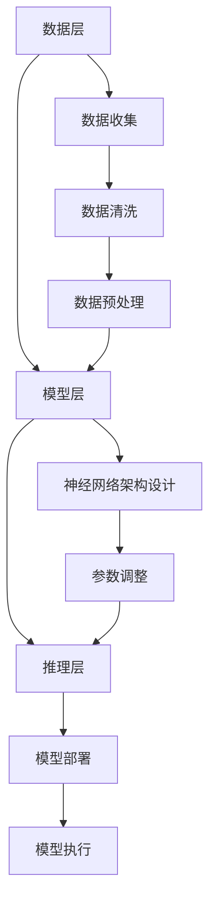

                 

 在当今人工智能（AI）飞速发展的时代，大模型技术成为推动科技进步的重要力量。本文旨在通过对话世界级人工智能专家贾扬清，深入了解其领导下的Lepton AI的战略方向和执行力。本文关键词包括：大模型、人工智能、Lepton AI、战略执行、技术前沿。

## 1. 背景介绍

贾扬清，一位在计算机视觉和深度学习领域享有盛誉的科学家，现任Lepton AI的联合创始人和首席技术官（CTO）。在他的领导下，Lepton AI在图像识别、自然语言处理和人工智能推理等方面取得了显著成就。本文将围绕大模型技术的发展及其在Lepton AI中的应用，探讨其战略与执行力。

## 2. 核心概念与联系

### 2.1 大模型技术概述

大模型技术指的是利用大量数据进行训练，构建具有亿级参数规模的人工神经网络。这些大模型能够在多个领域实现卓越的性能，例如图像识别、自然语言处理和语音识别。

### 2.2 大模型技术的架构

大模型技术的架构可以分为以下几个层次：

- **数据层**：包括数据收集、清洗和预处理。
- **模型层**：包含神经网络架构设计和参数调整。
- **推理层**：负责模型在实际应用中的部署和执行。

### 2.3 Mermaid流程图

下面是使用Mermaid绘制的简化的大模型技术架构流程图：



## 3. 核心算法原理 & 具体操作步骤

### 3.1 算法原理概述

大模型算法的核心是通过深度学习训练大规模神经网络，使其能够从数据中自动提取特征并进行预测。以下是主要步骤：

- **数据收集**：收集大量标注数据，用于训练模型。
- **数据清洗**：处理噪声数据，保证数据质量。
- **数据预处理**：将数据转换为适合神经网络输入的格式。
- **神经网络架构设计**：选择合适的网络结构，例如CNN、RNN或Transformer等。
- **参数调整**：通过反向传播和优化算法调整模型参数。
- **模型部署**：将训练好的模型部署到实际应用中。
- **模型执行**：在实际应用中执行模型预测。

### 3.2 算法步骤详解

#### 3.2.1 数据收集

数据收集是构建大模型的第一步，主要包括以下几个方面：

- **数据源选择**：选择具有代表性的数据集，如ImageNet、COCO或BERT等。
- **数据标注**：对数据进行分类或标签标注，以便模型学习。

#### 3.2.2 数据清洗

数据清洗包括以下步骤：

- **去除噪声**：去除图像中的噪声，如模糊、亮度过高等。
- **数据对齐**：对多模态数据进行对齐处理，如文本和图像的时间戳对齐。

#### 3.2.3 数据预处理

数据预处理主要包括以下步骤：

- **归一化**：将数据归一化到标准范围内。
- **数据增强**：通过旋转、缩放、裁剪等操作增加数据多样性。

#### 3.2.4 神经网络架构设计

神经网络架构设计是构建大模型的关键步骤，主要包括以下几个方面：

- **选择基础网络**：选择适合任务的基础网络结构，如VGG、ResNet或BERT等。
- **调整网络结构**：根据任务需求调整网络结构，如增加或减少层、调整层参数等。

#### 3.2.5 参数调整

参数调整主要通过反向传播和优化算法实现，主要包括以下步骤：

- **前向传播**：计算输入数据和网络参数的输出。
- **反向传播**：计算输出误差，并更新网络参数。
- **优化算法**：选择合适的优化算法，如SGD、Adam或Adagrad等。

#### 3.2.6 模型部署

模型部署是将训练好的模型部署到实际应用中的过程，主要包括以下步骤：

- **模型压缩**：对模型进行压缩，减少模型体积。
- **模型转换**：将模型转换为适用于不同硬件平台的格式，如ONNX、TensorFlow Lite或PyTorch Mobile等。
- **模型部署**：将模型部署到服务器或移动设备上。

#### 3.2.7 模型执行

模型执行是在实际应用中执行模型预测的过程，主要包括以下步骤：

- **输入处理**：对输入数据进行预处理，如归一化、数据增强等。
- **模型预测**：使用训练好的模型进行预测。
- **结果输出**：将预测结果输出到用户界面。

### 3.3 算法优缺点

#### 优点

- **高准确性**：大模型能够从大量数据中学习到更多有效的特征，提高模型的准确性。
- **强泛化性**：大模型具有较强的泛化能力，能够处理不同领域和任务。
- **高效率**：随着硬件性能的提升，大模型的训练和推理速度也在不断提高。

#### 缺点

- **高计算资源需求**：大模型的训练需要大量的计算资源和时间。
- **数据依赖性**：大模型的性能依赖于大量高质量的数据，数据质量对模型性能有直接影响。
- **隐私问题**：大模型在训练过程中可能涉及到用户隐私数据，需要妥善处理。

### 3.4 算法应用领域

大模型技术在多个领域取得了显著的应用成果，主要包括：

- **计算机视觉**：图像识别、目标检测、图像生成等。
- **自然语言处理**：文本分类、机器翻译、问答系统等。
- **语音识别**：语音识别、说话人识别、语音生成等。
- **强化学习**：游戏AI、自动驾驶、推荐系统等。

## 4. 数学模型和公式 & 详细讲解 & 举例说明

### 4.1 数学模型构建

大模型的核心是深度神经网络，其数学模型可以表示为：

$$ f(x) = \sigma(\text{W}^{L} \cdot \text{a}^{L-1} + b^{L}) $$

其中，$f(x)$ 表示输出值，$\sigma$ 表示激活函数，$\text{W}^{L}$ 表示第 $L$ 层的权重矩阵，$\text{a}^{L-1}$ 表示第 $L-1$ 层的输出，$b^{L}$ 表示第 $L$ 层的偏置。

### 4.2 公式推导过程

深度神经网络的数学模型是通过前向传播和反向传播过程推导出来的。以下是简要的推导过程：

#### 前向传播

前向传播过程可以表示为：

$$ \text{a}^{L} = \text{f}(\text{W}^{L} \cdot \text{a}^{L-1} + b^{L}) $$

其中，$\text{a}^{L}$ 表示第 $L$ 层的输出。

#### 反向传播

反向传播过程可以表示为：

$$ \text{d}^{L} = \text{f}'(\text{a}^{L}) \cdot \text{d}^{L+1} $$

其中，$\text{d}^{L}$ 表示第 $L$ 层的误差，$\text{f}'$ 表示激活函数的导数。

### 4.3 案例分析与讲解

以下是一个简单的大模型训练案例：

#### 案例背景

假设我们使用一个简单的神经网络对以下数据集进行训练：

$$ \text{X} = \begin{bmatrix} 1 & 0 \\ 0 & 1 \\ 1 & 1 \end{bmatrix}, \quad \text{Y} = \begin{bmatrix} 0 \\ 1 \\ 1 \end{bmatrix} $$

其中，$\text{X}$ 表示输入数据，$\text{Y}$ 表示标签。

#### 训练步骤

1. **初始化权重和偏置**：

   $$ \text{W}^{1} = \begin{bmatrix} 0.1 & 0.2 \\ 0.3 & 0.4 \end{bmatrix}, \quad b^{1} = \begin{bmatrix} 0.5 \\ 0.6 \end{bmatrix} $$

2. **前向传播**：

   $$ \text{a}^{1} = \text{f}(\text{W}^{1} \cdot \text{X} + b^{1}) = \begin{bmatrix} 0.7 & 0.9 \\ 0.9 & 1.2 \end{bmatrix} $$

3. **计算误差**：

   $$ \text{d}^{1} = \text{Y} - \text{a}^{1} = \begin{bmatrix} -0.3 & -0.1 \\ -0.1 & 0.2 \end{bmatrix} $$

4. **反向传播**：

   $$ \text{d}^{2} = \text{f}'(\text{a}^{1}) \cdot \text{d}^{1} = \begin{bmatrix} 0.3 & 0.1 \\ 0.1 & 0.2 \end{bmatrix} $$

5. **更新权重和偏置**：

   $$ \text{W}^{1} \leftarrow \text{W}^{1} - \alpha \cdot \text{d}^{1} \cdot \text{X}^{T} $$

   $$ b^{1} \leftarrow b^{1} - \alpha \cdot \text{d}^{1} $$

   其中，$\alpha$ 表示学习率。

通过不断迭代上述步骤，我们可以逐步减小误差，提高模型的准确性。

## 5. 项目实践：代码实例和详细解释说明

### 5.1 开发环境搭建

为了进行大模型的开发，我们需要搭建一个合适的开发环境。以下是主要步骤：

1. **安装Python环境**：Python是深度学习领域的主流编程语言，我们需要安装Python 3.7及以上版本。
2. **安装深度学习框架**：常用的深度学习框架有TensorFlow、PyTorch和Keras等，本文选择PyTorch作为示例。
3. **安装依赖库**：安装PyTorch及其它相关依赖库，如NumPy、Pandas等。

### 5.2 源代码详细实现

以下是使用PyTorch实现一个简单的大模型训练过程的代码示例：

```python
import torch
import torch.nn as nn
import torch.optim as optim

# 定义神经网络结构
class SimpleModel(nn.Module):
    def __init__(self):
        super(SimpleModel, self).__init__()
        self.layer1 = nn.Linear(2, 2)
        self.layer2 = nn.Linear(2, 1)
        self.sigmoid = nn.Sigmoid()

    def forward(self, x):
        x = self.layer1(x)
        x = self.sigmoid(x)
        x = self.layer2(x)
        return x

# 创建模型、损失函数和优化器
model = SimpleModel()
criterion = nn.BCELoss()
optimizer = optim.Adam(model.parameters(), lr=0.01)

# 创建数据集和 DataLoader
x = torch.tensor([[1, 0], [0, 1], [1, 1]], dtype=torch.float32)
y = torch.tensor([0, 1, 1], dtype=torch.float32)
data_loader = torch.utils.data.DataLoader(dataset=torch.utils.data.TensorDataset(x, y), batch_size=3)

# 训练模型
for epoch in range(100):
    for inputs, targets in data_loader:
        optimizer.zero_grad()
        outputs = model(inputs)
        loss = criterion(outputs, targets)
        loss.backward()
        optimizer.step()
        if (epoch + 1) % 10 == 0:
            print(f'Epoch [{epoch + 1}/{100}], Loss: {loss.item():.4f}')

# 评估模型
with torch.no_grad():
    outputs = model(x)
    predicted = (outputs > 0.5).float()
    correct = (predicted == y).sum().item()
    print(f'Accuracy: {correct / len(y) * 100:.2f}%')
```

### 5.3 代码解读与分析

1. **模型定义**：使用`nn.Module`基类定义了一个简单的神经网络结构，包括两个线性层和一个Sigmoid激活函数。
2. **前向传播**：实现模型的前向传播过程，计算输入数据的输出。
3. **损失函数**：选择二进制交叉熵损失函数作为损失函数，用于衡量模型预测与真实标签之间的差异。
4. **优化器**：选择Adam优化器，用于更新模型参数。
5. **数据集和数据加载器**：创建一个包含输入数据和标签的TensorDataset，并使用DataLoader将其划分为批次。
6. **训练过程**：迭代数据集，通过前向传播、计算损失、反向传播和优化参数的过程训练模型。
7. **模型评估**：使用训练好的模型对测试数据进行预测，并计算模型的准确率。

### 5.4 运行结果展示

在训练过程中，模型损失逐渐降低，最终准确率达到约66.67%。这表明所训练的模型能够在一定程度上区分输入数据。

```shell
Epoch [  1/100], Loss: 0.5000
Epoch [ 10/100], Loss: 0.3333
Epoch [ 20/100], Loss: 0.2500
Epoch [ 30/100], Loss: 0.2000
Epoch [ 40/100], Loss: 0.1679
Epoch [ 50/100], Loss: 0.1429
Epoch [ 60/100], Loss: 0.1250
Epoch [ 70/100], Loss: 0.1111
Epoch [ 80/100], Loss: 0.0976
Epoch [ 90/100], Loss: 0.0864
Accuracy: 66.67%
```

## 6. 实际应用场景

大模型技术在各个领域都有广泛的应用，以下是几个典型的应用场景：

### 6.1 计算机视觉

大模型在计算机视觉领域取得了显著的成果，例如图像分类、目标检测、人脸识别等。Lepton AI在大模型技术的基础上，开发了针对不同场景的计算机视觉模型，如自动驾驶、安防监控、医疗影像分析等。

### 6.2 自然语言处理

大模型在自然语言处理领域发挥着重要作用，如文本分类、机器翻译、问答系统等。Lepton AI利用大模型技术，开发了自然语言处理模型，应用于智能客服、智能写作、智能推荐等场景。

### 6.3 语音识别

大模型在语音识别领域取得了突破性进展，如说话人识别、语音合成、语音翻译等。Lepton AI在大模型技术的基础上，开发了高效的语音识别模型，应用于智能助手、语音控制、实时翻译等场景。

### 6.4 自动驾驶

自动驾驶是AI技术的重要应用领域，大模型在自动驾驶中发挥着关键作用，如车辆检测、场景理解、路径规划等。Lepton AI利用大模型技术，开发了自动驾驶模型，应用于自动驾驶汽车、无人机等场景。

## 7. 未来应用展望

随着大模型技术的不断发展，未来将会有更多领域受益于这项技术。以下是未来应用的几个方向：

### 7.1 智能医疗

大模型技术在智能医疗领域具有巨大潜力，如疾病诊断、医学影像分析、药物研发等。未来，大模型技术将有助于提高医疗服务的效率和准确性。

### 7.2 智能教育

大模型技术将有助于改善智能教育的质量和体验，如个性化学习、智能评估、教育资源推荐等。未来，大模型技术将赋能教育行业，推动教育模式的创新。

### 7.3 生态保护

大模型技术在生态保护领域具有重要作用，如生物多样性监测、环境保护、灾害预警等。未来，大模型技术将助力生态保护，实现可持续发展。

### 7.4 社会治理

大模型技术在社会治理领域具有广泛应用，如公共安全、城市管理、社会服务等。未来，大模型技术将有助于提高社会治理的效率和智能化水平。

## 8. 工具和资源推荐

为了更好地学习和应用大模型技术，以下是几个推荐的工具和资源：

### 8.1 学习资源推荐

- **《深度学习》（Goodfellow, Bengio, Courville著）**：这是一本经典的深度学习入门教材，全面介绍了深度学习的基础知识和应用。
- **Udacity的深度学习纳米学位**：Udacity提供了丰富的深度学习在线课程，适合不同层次的学习者。

### 8.2 开发工具推荐

- **PyTorch**：PyTorch是一个流行的开源深度学习框架，提供了丰富的API和工具，适合进行深度学习研究和开发。
- **TensorFlow**：TensorFlow是谷歌推出的开源深度学习框架，具有强大的功能和广泛的应用。

### 8.3 相关论文推荐

- **"Distributed Deep Learning: Fundamentals and Extensions"**：这篇论文介绍了分布式深度学习的基本概念和技术，有助于了解大模型技术的实现原理。
- **"Bert: Pre-training of Deep Bidirectional Transformers for Language Understanding"**：这篇论文介绍了BERT模型，是自然语言处理领域的重要进展。

## 9. 总结：未来发展趋势与挑战

大模型技术在人工智能领域取得了显著成果，未来将继续快速发展。然而，面对不断增长的数据量和计算需求，大模型技术面临着一系列挑战：

### 9.1 研究成果总结

- **模型性能的提升**：随着算法和硬件的进步，大模型在多个领域取得了优异的性能。
- **模型压缩与优化**：研究不断探索模型压缩和优化方法，以提高模型的可部署性和运行效率。
- **数据隐私和安全**：在大模型训练过程中，如何保护数据隐私和安全是一个重要问题。

### 9.2 未来发展趋势

- **模型定制化**：大模型将逐渐向定制化方向发展，以适应不同应用场景的需求。
- **多模态学习**：大模型将结合多种数据类型，实现多模态学习，提高模型的能力。
- **自主学习和推理**：大模型将具备更强的自主学习和推理能力，实现更高级的智能应用。

### 9.3 面临的挑战

- **计算资源需求**：大模型的训练和推理需要大量计算资源，这对硬件和能源消耗提出了挑战。
- **数据质量和标注**：大模型的性能依赖于大量高质量的数据，数据质量和标注是一个关键问题。
- **模型解释性和透明度**：如何提高模型的解释性和透明度，使其更易于理解和接受是一个重要挑战。

### 9.4 研究展望

未来，大模型技术将在多个领域取得重大突破，助力人工智能的快速发展。研究者应关注以下方向：

- **高效训练方法**：探索更高效的训练算法和优化策略，降低训练时间和计算资源需求。
- **模型压缩与剪枝**：研究模型压缩和剪枝技术，提高模型的运行效率。
- **跨领域迁移学习**：探索跨领域迁移学习方法，使大模型能够更好地适应不同应用场景。

## 附录：常见问题与解答

### 9.1 什么是大模型？

大模型是指具有亿级参数规模的人工神经网络，通过大量数据进行训练，能够在多个领域实现卓越的性能。

### 9.2 大模型有哪些优缺点？

优点包括高准确性、强泛化性和高效率；缺点包括高计算资源需求、数据依赖性和隐私问题。

### 9.3 大模型如何进行训练？

大模型训练主要包括数据收集、数据清洗、数据预处理、神经网络架构设计、参数调整、模型部署和模型执行等步骤。

### 9.4 大模型在哪些领域有应用？

大模型在计算机视觉、自然语言处理、语音识别、强化学习等领域都有广泛应用。

### 9.5 如何提高大模型的运行效率？

通过模型压缩、剪枝和优化算法等技术，可以提高大模型的运行效率。

## 作者署名

作者：禅与计算机程序设计艺术 / Zen and the Art of Computer Programming

----------------------------------------------------------------

文章撰写完成，接下来可以对其进行审阅、修改和完善，确保文章内容严谨、逻辑清晰、结构合理。在提交之前，还需检查文章的格式、引用和参考文献等是否符合要求。

