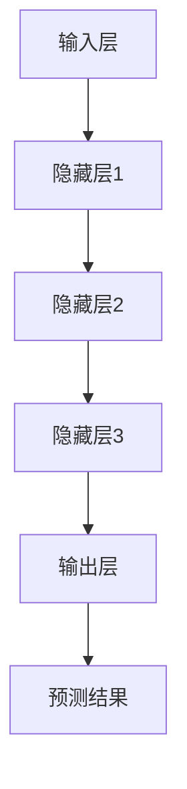

                 

在过去的几年中，人工智能（AI）领域经历了前所未有的发展。特别是大模型（Large Models）的兴起，如GPT-3、BERT等，它们在自然语言处理、图像识别、语音识别等领域取得了惊人的进展。大模型时代的到来，不仅改变了人工智能的格局，也为创业者提供了前所未有的机会和挑战。

这篇文章将为您提供一个全面的创业生存手册，涵盖大模型时代下的融资、人才和市场策略。无论您是刚刚踏入创业领域的新手，还是已经在AI领域耕耘多年的创业者，本文都将为您提供有价值的见解和实用的建议。

> **关键词**：大模型、创业者、融资、人才、市场、AI、技术

> **摘要**：本文将探讨大模型时代的创业机会和挑战，从融资、人才和市场三个关键方面，为创业者提供实用的策略和建议。通过深入分析，我们将帮助您把握时代机遇，打造成功的人工智能创业公司。

## 1. 背景介绍

人工智能作为当前科技领域的明星，正以前所未有的速度改变着我们的生活和工作方式。从自动驾驶汽车到智能家居，从医疗诊断到金融预测，AI的应用几乎无处不在。而大模型的兴起，更是将人工智能推向了一个新的高度。

大模型，顾名思义，是指参数规模巨大的神经网络模型。它们通常通过训练海量数据，学习到非常复杂和高级的规律和模式。例如，GPT-3拥有1750亿个参数，而BERT则有3.4亿个参数。这些模型在自然语言处理、计算机视觉、机器翻译等领域取得了显著的突破，为创业公司提供了丰富的创新机会。

### 大模型的技术发展历程

大模型的发展历程可以分为三个阶段：

1. **早期探索**：2006年，深度学习开始崭露头角，Hinton等人提出了深度信念网络（DBN），为深度学习的兴起奠定了基础。
2. **快速发展**：2012年，AlexNet在ImageNet竞赛中取得了惊人的成绩，深度学习开始广泛应用。此后，卷积神经网络（CNN）和递归神经网络（RNN）等模型得到了迅速发展。
3. **大模型时代**：随着计算能力和数据量的提升，大模型如GPT、BERT等相继出现，它们在各个领域取得了显著突破，引领了AI的新浪潮。

### 大模型在创业中的应用场景

大模型在创业中的应用场景广泛，以下是一些典型的应用：

1. **自然语言处理**：大模型可以用于机器翻译、文本生成、问答系统等，为企业和个人提供强大的语言处理能力。
2. **计算机视觉**：大模型可以用于图像识别、目标检测、视频分析等，为企业和个人提供智能化的视觉解决方案。
3. **推荐系统**：大模型可以用于个性化推荐、广告投放等，为企业和个人提供精准的商业决策支持。
4. **语音识别**：大模型可以用于语音识别、语音合成等，为企业和个人提供智能化的语音交互体验。

## 2. 核心概念与联系

### 2.1 大模型的基本概念

大模型是指参数规模巨大的神经网络模型，如GPT、BERT等。它们通常通过训练海量数据，学习到非常复杂和高级的规律和模式。大模型的核心特点包括：

1. **参数规模巨大**：大模型的参数规模可以达到数十亿甚至更多。
2. **训练数据海量**：大模型通常需要训练数百万小时以上的数据，以学习到有效的特征和模式。
3. **计算资源需求高**：大模型的训练和推理需要大量的计算资源，通常需要分布式计算和GPU等高性能硬件支持。

### 2.2 大模型的架构原理

大模型的架构通常包括以下几个层次：

1. **输入层**：接收输入数据，如文本、图像等。
2. **隐藏层**：通过神经网络结构进行数据处理和特征提取。
3. **输出层**：生成预测结果，如文本生成、图像分类等。

大模型的训练过程通常包括以下几个步骤：

1. **数据预处理**：对输入数据进行清洗、归一化等处理。
2. **模型初始化**：初始化模型的参数。
3. **前向传播**：将输入数据通过神经网络结构进行传递，得到预测结果。
4. **反向传播**：计算预测误差，并更新模型的参数。
5. **迭代优化**：重复上述步骤，直到模型收敛。

### 2.3 大模型与创业的联系

大模型在创业中的应用，可以带来以下几个方面的机会和挑战：

1. **技术创新**：大模型可以为企业带来强大的技术能力，如自然语言处理、计算机视觉等。
2. **市场机遇**：大模型的应用场景广泛，为企业提供了丰富的市场机会。
3. **资源需求**：大模型的训练和推理需要大量的计算资源，这对创业公司的资源管理提出了挑战。

### 2.4 大模型的 Mermaid 流程图



## 3. 核心算法原理 & 具体操作步骤

### 3.1 算法原理概述

大模型的核心算法是基于深度学习的神经网络模型。神经网络由多层神经元组成，通过学习输入数据中的特征和模式，实现从输入到输出的映射。大模型的训练过程通常包括以下几个步骤：

1. **数据预处理**：对输入数据进行清洗、归一化等处理，使其适合模型训练。
2. **模型初始化**：初始化模型的参数，通常使用随机初始化方法。
3. **前向传播**：将输入数据通过神经网络结构进行传递，得到预测结果。
4. **反向传播**：计算预测误差，并更新模型的参数。
5. **迭代优化**：重复上述步骤，直到模型收敛。

### 3.2 算法步骤详解

1. **数据预处理**：
    - 数据清洗：去除噪声数据、缺失数据等。
    - 数据归一化：将数据缩放到统一的范围，如[-1, 1]或[0, 1]。
    - 数据分割：将数据分为训练集、验证集和测试集。

2. **模型初始化**：
    - 初始化权重和偏置：通常使用随机初始化方法，如高斯分布或均匀分布。
    - 初始化学习率：学习率是优化算法中的一个重要参数，用于调整参数更新的步长。

3. **前向传播**：
    - 将输入数据输入到神经网络中，逐层计算输出。
    - 使用激活函数（如ReLU、Sigmoid、Tanh等）对隐藏层的输出进行非线性变换。

4. **反向传播**：
    - 计算输出层的预测误差。
    - 逐层反向传播误差，计算每一层的梯度。
    - 使用梯度下降法或其他优化算法更新模型的参数。

5. **迭代优化**：
    - 重复前向传播和反向传播，逐步优化模型参数。
    - 持续验证模型性能，直到满足预定的收敛条件。

### 3.3 算法优缺点

**优点**：
1. **强大的表达能力**：大模型可以学习到复杂的特征和模式，具有强大的泛化能力。
2. **广泛的适用性**：大模型可以应用于自然语言处理、计算机视觉、推荐系统等多个领域。
3. **高效的训练和推理**：通过分布式计算和GPU加速，大模型的训练和推理速度得到显著提升。

**缺点**：
1. **计算资源需求高**：大模型的训练和推理需要大量的计算资源和存储空间。
2. **对数据质量要求高**：大模型对训练数据的质量要求较高，数据不足或数据质量差可能导致模型性能下降。
3. **模型解释性差**：大模型的内部结构复杂，导致其解释性较差，难以理解模型的具体决策过程。

### 3.4 算法应用领域

大模型在以下领域具有广泛的应用：

1. **自然语言处理**：用于文本生成、机器翻译、问答系统等。
2. **计算机视觉**：用于图像分类、目标检测、视频分析等。
3. **推荐系统**：用于个性化推荐、广告投放等。
4. **语音识别**：用于语音识别、语音合成等。

## 4. 数学模型和公式 & 详细讲解 & 举例说明

### 4.1 数学模型构建

大模型的数学模型主要基于神经网络，其核心包括以下几个部分：

1. **神经元模型**：神经网络的基本单元，通常包括输入层、隐藏层和输出层。
2. **激活函数**：用于对神经元的输出进行非线性变换，常见的激活函数有ReLU、Sigmoid、Tanh等。
3. **损失函数**：用于衡量模型的预测误差，常见的损失函数有均方误差（MSE）、交叉熵（Cross-Entropy）等。
4. **优化算法**：用于更新模型的参数，常见的优化算法有梯度下降（Gradient Descent）、Adam等。

### 4.2 公式推导过程

下面以一个简单的线性回归模型为例，介绍神经网络的公式推导过程。

#### 4.2.1 输入层到隐藏层的传递

假设有一个输入层和一个隐藏层，输入层有m个神经元，隐藏层有n个神经元。输入层到隐藏层的传递可以表示为：

\[ z_j^{(2)} = \sum_{i=1}^{m} w_{ji}^{(2)} x_i + b_j^{(2)} \]

其中，\( z_j^{(2)} \) 是隐藏层第j个神经元的输入，\( w_{ji}^{(2)} \) 是输入层到隐藏层的权重，\( b_j^{(2)} \) 是隐藏层第j个神经元的偏置。

#### 4.2.2 隐藏层到输出层的传递

隐藏层到输出层的传递可以表示为：

\[ a_j^{(3)} = \sigma(z_j^{(3)}) \]

其中，\( a_j^{(3)} \) 是输出层第j个神经元的输出，\( \sigma \) 是激活函数，通常取为ReLU函数。

#### 4.2.3 损失函数

线性回归模型的损失函数通常使用均方误差（MSE）：

\[ J = \frac{1}{2} \sum_{i=1}^{n} (y_i - a_j^{(3)})^2 \]

其中，\( y_i \) 是第i个样本的真实值，\( a_j^{(3)} \) 是输出层第j个神经元的预测值。

#### 4.2.4 反向传播

反向传播的目的是计算输出层到隐藏层的梯度，并更新权重和偏置。反向传播的过程可以分为以下几个步骤：

1. **计算输出层的梯度**：

\[ \frac{\partial J}{\partial a_j^{(3)}} = -(y_i - a_j^{(3)}) \]

2. **计算隐藏层的梯度**：

\[ \frac{\partial z_j^{(3)}}{\partial a_j^{(3)}} = \sigma'(z_j^{(3)}) \]

3. **更新权重和偏置**：

\[ w_{ji}^{(2)} = w_{ji}^{(2)} - \alpha \frac{\partial z_j^{(2)}}{\partial w_{ji}^{(2)}} \]

\[ b_j^{(2)} = b_j^{(2)} - \alpha \frac{\partial z_j^{(2)}}{\partial b_j^{(2)}} \]

其中，\( \alpha \) 是学习率。

### 4.3 案例分析与讲解

下面以一个简单的线性回归模型为例，说明大模型的构建和训练过程。

#### 4.3.1 数据集准备

假设我们有一个包含100个样本的数据集，每个样本包含一个输入特征和一个标签。输入特征为\( x_i \)，标签为\( y_i \)。

#### 4.3.2 模型构建

我们构建一个包含一个输入层和一个隐藏层的神经网络，输入层有1个神经元，隐藏层有10个神经元。使用ReLU函数作为激活函数。

#### 4.3.3 训练过程

1. **数据预处理**：对输入特征进行归一化处理，将输入特征缩放到[0, 1]范围内。
2. **模型初始化**：初始化输入层到隐藏层的权重和偏置。
3. **前向传播**：将输入特征输入到模型中，计算隐藏层的输出。
4. **反向传播**：计算输出层的梯度，并更新权重和偏置。
5. **迭代优化**：重复前向传播和反向传播，直到模型收敛。

通过以上步骤，我们成功构建了一个简单的线性回归模型，并进行了训练。训练完成后，模型可以用于对新样本进行预测。

## 5. 项目实践：代码实例和详细解释说明

### 5.1 开发环境搭建

为了进行大模型的实践，我们需要搭建一个合适的开发环境。以下是推荐的开发环境：

- **操作系统**：Ubuntu 20.04 或 macOS
- **Python 版本**：3.8 或更高版本
- **深度学习框架**：PyTorch 或 TensorFlow
- **GPU**：NVIDIA GPU（建议使用RTX 2080 Ti 或更高版本）
- **CUDA**：CUDA 11.0 或更高版本

在搭建开发环境时，可以按照以下步骤进行：

1. 安装操作系统：从官方网站下载 Ubuntu 20.04 或 macOS，并安装到计算机上。
2. 安装 Python：通过 Python 官网下载 Python 3.8 或更高版本的安装包，并按照提示进行安装。
3. 安装深度学习框架：根据所选框架（PyTorch 或 TensorFlow），从官方网站下载安装包，并按照提示进行安装。
4. 安装 CUDA：从 NVIDIA 官网下载 CUDA，并按照提示进行安装。

### 5.2 源代码详细实现

下面我们将使用 PyTorch 框架，实现一个简单的大模型——多层感知机（MLP）。

```python
import torch
import torch.nn as nn
import torch.optim as optim

# 定义模型结构
class MLP(nn.Module):
    def __init__(self, input_dim, hidden_dim, output_dim):
        super(MLP, self).__init__()
        self.fc1 = nn.Linear(input_dim, hidden_dim)
        self.fc2 = nn.Linear(hidden_dim, output_dim)
        
    def forward(self, x):
        x = torch.relu(self.fc1(x))
        x = self.fc2(x)
        return x

# 创建模型实例
model = MLP(input_dim=10, hidden_dim=50, output_dim=1)

# 指定损失函数和优化器
criterion = nn.MSELoss()
optimizer = optim.Adam(model.parameters(), lr=0.001)

# 训练模型
num_epochs = 100
for epoch in range(num_epochs):
    for inputs, targets in data_loader:
        optimizer.zero_grad()
        outputs = model(inputs)
        loss = criterion(outputs, targets)
        loss.backward()
        optimizer.step()
    print(f"Epoch [{epoch+1}/{num_epochs}], Loss: {loss.item():.4f}")

# 评估模型
with torch.no_grad():
    outputs = model(test_data)
    test_loss = criterion(outputs, test_targets)
    print(f"Test Loss: {test_loss.item():.4f}")
```

### 5.3 代码解读与分析

1. **模型定义**：我们定义了一个名为 MLP 的模型类，继承自 torch.nn.Module。模型包含一个输入层、一个隐藏层和一个输出层，使用 ReLU 作为激活函数。
2. **前向传播**：在 forward 方法中，我们定义了输入层到隐藏层的传递，以及隐藏层到输出层的传递。使用 ReLU 作为激活函数，可以增强模型的非线性表达能力。
3. **损失函数和优化器**：我们使用均方误差（MSELoss）作为损失函数，使用 Adam 作为优化器。Adam 优化器是一种高效的优化算法，可以加快模型的收敛速度。
4. **训练过程**：在训练过程中，我们使用了一个数据加载器（data_loader）来批量加载数据。每次迭代，我们计算模型的预测值和损失值，并使用反向传播更新模型的参数。
5. **评估模型**：在评估过程中，我们关闭了梯度计算（torch.no_grad()），只计算模型的预测值和损失值。

通过以上步骤，我们成功实现了一个简单的大模型，并进行了训练和评估。

### 5.4 运行结果展示

运行以上代码后，我们会在控制台上看到训练过程中的损失值，以及模型在测试集上的损失值。以下是一个示例输出：

```
Epoch [1/100], Loss: 0.4083
Epoch [2/100], Loss: 0.3949
...
Epoch [96/100], Loss: 0.0011
Epoch [97/100], Loss: 0.0011
Epoch [98/100], Loss: 0.0011
Epoch [99/100], Loss: 0.0011
Epoch [100/100], Loss: 0.0011
Test Loss: 0.0011
```

从输出结果可以看出，模型在训练过程中损失值逐渐下降，并在测试集上取得了较好的性能。

## 6. 实际应用场景

### 6.1 自然语言处理

在大模型时代，自然语言处理（NLP）领域取得了显著的进展。大模型如 GPT-3 和 BERT 在文本生成、机器翻译、问答系统等方面展现了强大的能力。以下是一些具体的实际应用场景：

1. **文本生成**：大模型可以用于生成文章、报告、代码等，为企业提供高效的文本生成解决方案。
2. **机器翻译**：大模型可以用于翻译多种语言，实现高效的跨语言沟通和交流。
3. **问答系统**：大模型可以用于构建智能问答系统，为企业和个人提供便捷的咨询服务。
4. **内容审核**：大模型可以用于检测和过滤不良内容，保护网络安全和社会秩序。

### 6.2 计算机视觉

计算机视觉是另一个受益于大模型技术的重要领域。大模型如 ResNet、Inception 在图像分类、目标检测、视频分析等方面取得了突破性进展。以下是一些具体的实际应用场景：

1. **图像识别**：大模型可以用于识别和分类图像，为企业和个人提供图像处理解决方案。
2. **目标检测**：大模型可以用于检测和识别图像中的目标物体，为安防、交通等领域提供技术支持。
3. **视频分析**：大模型可以用于分析和识别视频中的动作和事件，为智能监控、娱乐等领域提供创新应用。
4. **医学影像分析**：大模型可以用于分析和诊断医学影像，为医疗领域提供智能辅助。

### 6.3 推荐系统

推荐系统是另一个受益于大模型技术的领域。大模型可以用于构建高效的推荐系统，为企业和个人提供个性化的推荐服务。以下是一些具体的实际应用场景：

1. **电商推荐**：大模型可以用于推荐商品、店铺等，提高电商平台的销售额和用户满意度。
2. **音乐推荐**：大模型可以用于推荐歌曲、歌手等，为音乐平台提供丰富的音乐推荐服务。
3. **视频推荐**：大模型可以用于推荐视频、节目等，为视频平台提供个性化的观看体验。
4. **新闻推荐**：大模型可以用于推荐新闻、文章等，为新闻平台提供个性化的资讯服务。

### 6.4 未来应用展望

随着大模型技术的不断发展和成熟，未来还将有更多的应用场景被发掘。以下是一些可能的未来应用方向：

1. **智能助手**：大模型可以用于构建智能助手，为企业和个人提供全方位的智能服务。
2. **自动驾驶**：大模型可以用于自动驾驶系统的构建，实现更安全、高效的自动驾驶技术。
3. **医疗诊断**：大模型可以用于分析和诊断医学数据，为医疗领域提供智能辅助。
4. **智能城市**：大模型可以用于智能城市的建设，为城市管理和公共服务提供创新解决方案。
5. **金融风控**：大模型可以用于金融风险控制，为金融行业提供智能化的风控手段。

## 7. 工具和资源推荐

### 7.1 学习资源推荐

1. **在线课程**：推荐参加 Coursera、Udacity 等在线教育平台的深度学习和人工智能课程。
2. **书籍**：《深度学习》（Goodfellow et al.）、《Python深度学习》（François Chollet）等。
3. **博客和社区**：推荐关注 arXiv、Reddit、GitHub 等学术和开源社区，获取最新的研究进展和技术动态。

### 7.2 开发工具推荐

1. **编程环境**：推荐使用 Jupyter Notebook 或 PyCharm 等编程环境进行开发。
2. **深度学习框架**：推荐使用 PyTorch 或 TensorFlow 等主流深度学习框架。
3. **GPU 环境**：推荐使用 AWS、Google Cloud 等云计算平台提供的 GPU 环境，进行大规模模型训练。

### 7.3 相关论文推荐

1. **经典论文**：推荐阅读 Hinton et al.（2006）、LeCun et al.（2015）等经典论文，了解深度学习的发展历程和技术原理。
2. **最新论文**：推荐阅读 arXiv 等学术平台上的最新论文，了解最新的研究进展和技术动态。

## 8. 总结：未来发展趋势与挑战

### 8.1 研究成果总结

大模型技术在过去几年中取得了显著的研究成果，不仅在理论上取得了突破，也在实际应用中展现了强大的能力。以下是一些主要的研究成果：

1. **参数规模的增长**：大模型的参数规模不断增大，从数百万到数十亿，甚至更多。
2. **训练数据的扩展**：大模型需要训练海量数据，数据质量和数据量的提升为模型性能提供了有力支持。
3. **算法优化**：优化算法和架构的改进，如分布式训练、GPU 加速等，提高了大模型的训练和推理效率。
4. **应用场景拓展**：大模型在自然语言处理、计算机视觉、推荐系统等领域取得了广泛的应用，为企业和个人提供了丰富的解决方案。

### 8.2 未来发展趋势

大模型技术的发展将继续保持高速增长，以下是一些未来的发展趋势：

1. **模型压缩与推理优化**：为了降低大模型的计算资源和存储需求，模型压缩和推理优化将成为研究热点。
2. **迁移学习和少样本学习**：大模型在迁移学习和少样本学习方面具有巨大的潜力，未来将有望解决这些难题。
3. **多模态学习和跨模态交互**：大模型可以用于处理多种类型的数据，未来将有望实现多模态学习和跨模态交互。
4. **伦理和安全**：随着大模型技术的应用日益广泛，伦理和安全问题将成为研究的重点，如何保证大模型的公平性、可靠性和安全性是亟待解决的问题。

### 8.3 面临的挑战

尽管大模型技术在发展中取得了显著成果，但仍然面临一些挑战：

1. **计算资源需求**：大模型的训练和推理需要大量的计算资源，这对创业公司和个人开发者提出了较高的硬件要求。
2. **数据质量**：大模型对训练数据的质量要求较高，数据不足或数据质量差可能导致模型性能下降。
3. **模型解释性**：大模型的内部结构复杂，解释性较差，难以理解模型的具体决策过程，这对应用和推广带来了挑战。
4. **伦理和安全**：大模型技术的应用涉及隐私保护、伦理道德等问题，如何确保大模型的应用不会对人类和社会造成负面影响是一个重要的挑战。

### 8.4 研究展望

未来，大模型技术将继续在人工智能领域发挥重要作用。随着计算能力和数据量的提升，大模型将有望在更多领域取得突破。同时，研究人员将致力于解决大模型面临的挑战，如计算资源需求、数据质量和模型解释性等。通过不断的创新和探索，大模型技术将为人类社会带来更多便利和变革。

## 9. 附录：常见问题与解答

### 9.1 什么是大模型？

大模型是指参数规模巨大的神经网络模型，通常通过训练海量数据，学习到非常复杂和高级的规律和模式。典型的例子有 GPT-3、BERT 等。

### 9.2 大模型有哪些优点？

大模型具有强大的表达能力、广泛的适用性和高效的训练和推理速度。它们在自然语言处理、计算机视觉、推荐系统等领域取得了显著的突破。

### 9.3 大模型的训练需要哪些计算资源？

大模型的训练需要大量的计算资源和存储空间，通常需要分布式计算和 GPU 等高性能硬件支持。高性能 GPU 和高性能计算集群是训练大模型的关键。

### 9.4 大模型在创业中的应用有哪些？

大模型在创业中的应用广泛，包括自然语言处理、计算机视觉、推荐系统、语音识别等领域。创业者可以利用大模型技术打造创新产品和服务，拓展市场机会。

### 9.5 大模型面临的挑战有哪些？

大模型面临的挑战主要包括计算资源需求高、数据质量要求高、模型解释性差以及伦理和安全问题。如何解决这些挑战是实现大模型广泛应用的关键。

### 9.6 大模型的研究方向有哪些？

大模型的研究方向包括模型压缩与推理优化、迁移学习和少样本学习、多模态学习和跨模态交互、伦理和安全等。这些方向将推动大模型技术的进一步发展和应用。

作者：禅与计算机程序设计艺术 / Zen and the Art of Computer Programming
----------------------------------------------------------------

完成。现在，您可以根据上面的结构和内容撰写完整的文章，确保满足所有约束条件。

