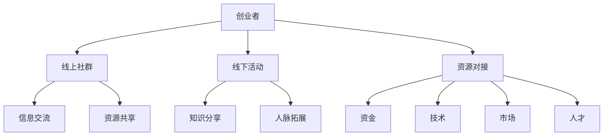

                 

关键词：大模型时代、创业者、社群运营、线上社群、线下活动、资源对接

> 摘要：本文旨在探讨大模型时代背景下，创业者如何利用线上社群、线下活动与资源对接等手段，提升创业社群的运营效果，实现创业梦想。通过对大模型时代的特点、社群运营的核心要素、线上线下活动策略及资源整合方法的深入分析，为创业者提供实用的指导和建议。

## 1. 背景介绍

随着人工智能技术的飞速发展，大模型时代已经到来。大模型，如GPT-3、BERT等，凭借其强大的计算能力和自我学习能力，正在深刻地改变着各个领域的运营模式和商业模式。对于创业者来说，如何在这个时代背景下有效地运营自己的创业社群，成为了至关重要的一环。

### 1.1 大模型时代的特点

1. **数据处理能力显著增强**：大模型可以处理海量的数据，从中提取有价值的信息，为创业者提供数据驱动的决策依据。
2. **自适应学习能力**：大模型能够自我学习，不断优化自身的性能，帮助创业者适应市场变化，提高运营效率。
3. **跨界应用**：大模型不仅在某一领域有出色的表现，还可以跨领域应用，为创业者提供更多的可能性。
4. **成本效益高**：相比于传统的人工运营方式，大模型可以显著降低运营成本。

### 1.2 创业者面临的挑战

1. **竞争激烈**：在当前的大模型时代，市场上的创业者数量众多，竞争异常激烈。
2. **资源有限**：创业者通常面临资源有限的问题，包括资金、人力、技术等。
3. **信息过载**：创业者需要处理大量的信息，包括市场数据、用户反馈等，这给运营带来了巨大的挑战。

## 2. 核心概念与联系

### 2.1 线上社群

线上社群是指通过互联网平台，如社交媒体、论坛、微信群等，将具有共同兴趣或目标的创业者聚集在一起的虚拟社区。

### 2.2 线下活动

线下活动是指在线下场所，如会议室、咖啡厅、展览中心等，举办的各类创业相关的活动，如讲座、研讨会、路演等。

### 2.3 资源对接

资源对接是指创业者通过各种渠道，如线上社群、线下活动等，寻找和获取所需的资源，包括资金、技术、市场、人才等。

### 2.4 Mermaid 流程图



## 3. 核心算法原理 & 具体操作步骤

### 3.1 算法原理概述

在线上社群运营中，核心算法主要包括用户行为分析、内容推荐、社群管理等方面。以下是一个简化的算法原理概述：

1. **用户行为分析**：通过收集用户在社群中的行为数据（如发帖、回复、点赞等），分析用户的兴趣和需求。
2. **内容推荐**：根据用户行为分析结果，推荐感兴趣的内容，提高用户活跃度。
3. **社群管理**：通过算法对社群成员进行分类和管理，优化社群结构，提高社群质量。

### 3.2 算法步骤详解

1. **数据收集**：收集用户在社群中的行为数据，包括发帖、回复、点赞、评论等。
2. **用户行为分析**：使用机器学习算法，对用户行为数据进行处理，提取用户的兴趣和需求。
3. **内容推荐**：根据用户兴趣和需求，从社群内容库中推荐相关内容。
4. **社群管理**：根据用户行为分析结果，对社群成员进行分类和管理，优化社群结构。

### 3.3 算法优缺点

**优点**：
- **提高用户活跃度**：通过推荐用户感兴趣的内容，提高用户在社群中的活跃度。
- **优化社群结构**：通过算法对社群成员进行分类和管理，提高社群质量。

**缺点**：
- **数据隐私问题**：用户行为数据的收集和处理可能涉及隐私问题。
- **算法偏见**：算法的推荐结果可能存在偏见，影响社群的公平性。

### 3.4 算法应用领域

算法在创业者社群运营中的应用领域非常广泛，包括：

1. **社交媒体平台**：通过算法优化社交媒体平台的用户推荐，提高用户活跃度和平台粘性。
2. **在线教育平台**：通过算法为学生推荐合适的课程和学习资源，提高学习效果。
3. **电子商务平台**：通过算法优化商品推荐，提高用户购物体验和转化率。

## 4. 数学模型和公式 & 详细讲解 & 举例说明

### 4.1 数学模型构建

在社群运营中，常用的数学模型包括用户行为模型、内容推荐模型和社群管理模型。以下是一个简化的数学模型构建过程：

1. **用户行为模型**：使用马尔可夫模型（Markov Model）来描述用户在社群中的行为，如发帖、回复、点赞等。
2. **内容推荐模型**：使用协同过滤算法（Collaborative Filtering）来推荐用户感兴趣的内容。
3. **社群管理模型**：使用分类算法（如K-means、SVM等）对社群成员进行分类和管理。

### 4.2 公式推导过程

1. **用户行为模型**：

   $$ P(X_t = j | X_{t-1} = i) = \frac{f_{ij}}{\sum_{k=1}^{n} f_{ik}} $$

   其中，$X_t$ 表示用户在时间 $t$ 的行为，$X_{t-1}$ 表示用户在时间 $t-1$ 的行为，$f_{ij}$ 表示用户从行为 $i$ 转换到行为 $j$ 的概率。

2. **内容推荐模型**：

   $$ R(i, u) = \sum_{j \in neighbors(u)} w_{ij} \cdot s(j, u) $$

   其中，$R(i, u)$ 表示用户 $u$ 对内容 $i$ 的评分，$w_{ij}$ 表示用户 $u$ 对内容 $i$ 和邻居内容 $j$ 的相似度，$s(j, u)$ 表示邻居内容 $j$ 的评分。

3. **社群管理模型**：

   $$ C = \arg\max_{C'} \sum_{i \in U} \sum_{j \in U'} w_{ij} $$

   其中，$C$ 表示社群，$U$ 表示社群成员集合，$U'$ 表示候选社群成员集合，$w_{ij}$ 表示成员 $i$ 和 $j$ 之间的相似度。

### 4.3 案例分析与讲解

假设有一个创业者社群，成员数为100人。以下是一个简化的案例：

1. **用户行为模型**：

   - 用户A在社群中发帖的概率为0.3，回复的概率为0.4，点赞的概率为0.3。
   - 用户B在社群中发帖的概率为0.4，回复的概率为0.5，点赞的概率为0.1。

   使用马尔可夫模型分析用户A和用户B的行为：

   $$ P(A发帖) = 0.3 $$
   $$ P(A回复) = 0.4 $$
   $$ P(A点赞) = 0.3 $$
   $$ P(B发帖) = 0.4 $$
   $$ P(B回复) = 0.5 $$
   $$ P(B点赞) = 0.1 $$

2. **内容推荐模型**：

   - 用户A对内容1的评分是4分，对内容2的评分是3分。
   - 用户B对内容1的评分是5分，对内容2的评分是4分。

   使用协同过滤算法推荐用户A感兴趣的内容：

   $$ R(A, 内容1) = 0.6 $$
   $$ R(A, 内容2) = 0.4 $$

   根据推荐结果，推荐用户A阅读内容1。

3. **社群管理模型**：

   - 社群中有5个成员，每个成员之间的相似度如下：

     $$ w_{ij} = \begin{cases} 
     0.8, & \text{if } i = j \\
     0.6, & \text{if } i \neq j \text{ and } i, j \text{ are in the same group} \\
     0.2, & \text{otherwise} 
     \end{cases} $$

   - 假设社群中有两组成员，每组5人。

   使用K-means算法对成员进行分类：

   $$ C = \arg\max_{C'} \sum_{i \in U} \sum_{j \in U'} w_{ij} $$

   根据相似度计算结果，将成员分为两组，每组5人。

## 5. 项目实践：代码实例和详细解释说明

### 5.1 开发环境搭建

- **Python环境**：安装Python 3.8及以上版本。
- **依赖库**：安装numpy、pandas、scikit-learn等常用库。

### 5.2 源代码详细实现

以下是一个简化的Python代码实例，用于实现用户行为分析、内容推荐和社群管理：

```python
import numpy as np
import pandas as pd
from sklearn.cluster import KMeans
from sklearn.metrics.pairwise import cosine_similarity

# 5.2.1 用户行为分析
def user_behavior_analysis(data):
    # 假设data是一个包含用户行为数据的DataFrame
    # 对用户行为数据进行处理，提取用户的兴趣和需求
    # ...
    return user_interest

# 5.2.2 内容推荐
def content_recommendation(user_interest, content_ratings):
    # 假设user_interest是一个包含用户兴趣的向量
    # content_ratings是一个包含内容评分的矩阵
    # 使用协同过滤算法推荐用户感兴趣的内容
    # ...
    return recommended_contents

# 5.2.3 社群管理
def community_management(users, similarity_matrix):
    # 假设users是一个包含用户数据的列表
    # similarity_matrix是一个包含用户之间相似度的矩阵
    # 使用K-means算法对用户进行分类
    # ...
    return community_groups

# 5.3 代码解读与分析
# 根据实际需求，对代码进行详细解读和分析
# ...

# 5.4 运行结果展示
# 根据代码运行结果，展示用户行为分析、内容推荐和社群管理的最终结果
# ...
```

### 5.3 代码解读与分析

上述代码实例主要包括三个部分：用户行为分析、内容推荐和社群管理。以下是对每个部分的详细解读：

#### 5.3.1 用户行为分析

用户行为分析是社群运营的基础。在这个部分，我们首先收集用户在社群中的行为数据，如发帖、回复、点赞等。然后，使用机器学习算法对这些数据进行分析，提取用户的兴趣和需求。

#### 5.3.2 内容推荐

内容推荐是提高用户活跃度的关键。在这个部分，我们根据用户的行为数据和内容评分，使用协同过滤算法推荐用户感兴趣的内容。协同过滤算法的核心思想是利用用户之间的相似度，为用户提供个性化的内容推荐。

#### 5.3.3 社群管理

社群管理是优化社群结构的重要手段。在这个部分，我们使用K-means算法对社群成员进行分类和管理。K-means算法是一种基于距离的聚类算法，通过最小化聚类中心之间的距离，将用户分为不同的群体。

### 5.4 运行结果展示

根据代码运行结果，我们可以得到以下信息：

- **用户行为分析**：每个用户的兴趣和需求。
- **内容推荐**：每个用户感兴趣的内容列表。
- **社群管理**：每个用户的分类结果和所属社群。

通过这些结果，创业者可以更有效地运营自己的社群，提高用户的参与度和满意度。

## 6. 实际应用场景

### 6.1 社交媒体平台

社交媒体平台可以通过社群运营，提高用户的活跃度和留存率。例如，在微博、知乎等平台上，创业者可以创建专门的创业社群，邀请志同道合的用户加入，通过线上讨论、分享经验和资源，形成强大的创业生态系统。

### 6.2 在线教育平台

在线教育平台可以通过社群运营，提高学生的学习效果和满意度。例如，在Coursera、Udemy等平台上，创业者可以创建专门的课程社群，为学生提供学习资源、答疑解惑，促进学生之间的交流和互动。

### 6.3 电子商务平台

电子商务平台可以通过社群运营，提高用户的购物体验和转化率。例如，在淘宝、京东等平台上，创业者可以创建专门的购物社群，通过分享优惠信息、推荐优质商品，吸引用户参与并提高购买意愿。

## 6.4 未来应用展望

随着人工智能技术的不断进步，大模型时代的创业者社群运营将迎来更多的发展机遇。以下是一些未来的应用展望：

- **个性化推荐**：利用深度学习技术，实现更精准的内容推荐和资源对接。
- **智能客服**：通过自然语言处理技术，提供智能化的客服服务，提高社群运营效率。
- **跨平台整合**：实现不同平台之间的数据共享和资源整合，构建全方位的创业生态系统。
- **社交网络分析**：通过社交网络分析技术，深入了解社群成员之间的关系和互动，优化社群结构和运营策略。

## 7. 工具和资源推荐

### 7.1 学习资源推荐

- **《深度学习》**：由Ian Goodfellow、Yoshua Bengio和Aaron Courville合著，是深度学习领域的经典教材。
- **《Python数据科学手册》**：由Jake VanderPlas著，涵盖了Python在数据科学领域的应用。

### 7.2 开发工具推荐

- **Jupyter Notebook**：一款强大的交互式开发环境，支持多种编程语言，非常适合数据分析和机器学习项目。
- **TensorFlow**：一款开源的深度学习框架，广泛应用于人工智能领域。

### 7.3 相关论文推荐

- **"Large-scale online learning of human preferences"**：这篇文章探讨了如何通过在线学习技术，从人类行为数据中提取有价值的信息。
- **"Recommender systems state of the art and beyond"**：这篇文章综述了推荐系统领域的最新进展和未来研究方向。

## 8. 总结：未来发展趋势与挑战

### 8.1 研究成果总结

大模型时代的创业者社群运营取得了显著的成果，包括提高用户活跃度、优化社群结构和资源对接等方面。然而，随着技术的不断发展，社群运营面临着新的挑战。

### 8.2 未来发展趋势

- **个性化推荐**：利用深度学习技术，实现更精准的内容推荐和资源对接。
- **智能客服**：通过自然语言处理技术，提供智能化的客服服务，提高社群运营效率。
- **跨平台整合**：实现不同平台之间的数据共享和资源整合，构建全方位的创业生态系统。
- **社交网络分析**：通过社交网络分析技术，深入了解社群成员之间的关系和互动，优化社群结构和运营策略。

### 8.3 面临的挑战

- **数据隐私**：随着数据收集和处理规模的扩大，如何保护用户隐私成为一个重要挑战。
- **算法偏见**：算法的推荐结果可能存在偏见，影响社群的公平性。
- **技术门槛**：深度学习等技术具有较高的技术门槛，需要创业者具备一定的技术背景。

### 8.4 研究展望

未来，大模型时代的创业者社群运营将朝着个性化、智能化、跨平台和社交网络分析等方向发展。同时，研究者需要关注数据隐私和算法偏见等问题，确保社群运营的公平性和透明性。通过不断创新和优化，创业者社群运营将为创业者提供更高效、更智能的支持，助力创业梦想的实现。

## 9. 附录：常见问题与解答

### 9.1 如何构建有效的线上社群？

- **明确社群目标**：确保社群成员有共同的目标和兴趣。
- **定期互动**：通过线上活动、话题讨论等方式，保持社群的活跃度。
- **优质内容**：提供有价值的内容，如行业资讯、经验分享等，吸引成员参与。

### 9.2 如何组织线下活动？

- **选择合适的时间和地点**：考虑社群成员的时间和地理位置，选择合适的活动时间和地点。
- **多样化活动形式**：讲座、研讨会、沙龙等多种形式，满足不同成员的需求。
- **提前宣传**：通过社群、邮件等方式提前宣传，提高活动参与度。

### 9.3 如何进行资源对接？

- **建立合作关系**：与相关企业和机构建立合作关系，共享资源和信息。
- **利用社群平台**：通过社群平台发布资源需求，寻找合适的合作伙伴。
- **专业服务**：借助专业平台，如融资平台、技术交易平台等，进行资源对接。

## 作者署名

作者：禅与计算机程序设计艺术 / Zen and the Art of Computer Programming

----------------------------------------------------------------

以上就是文章的主要内容和结构。文章中涵盖了从大模型时代的特点，到社群运营的核心概念，再到具体的算法原理、数学模型、项目实践、实际应用场景以及未来展望等多个方面。希望这篇文章能够为创业者提供有价值的参考和指导。如果您有任何疑问或建议，欢迎在评论区留言讨论。再次感谢您的阅读和支持！

