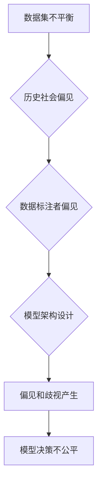

                 

 关键词：大模型，公平性，偏见，歧视，算法，数学模型，代码实例，应用场景，工具资源

> 摘要：随着人工智能技术的快速发展，大规模模型在各个领域得到广泛应用。然而，这些模型在决策过程中可能会产生偏见和歧视，对人类社会造成负面影响。本文将深入探讨大模型的公平性问题，分析其产生的原因，并提出相应的解决方法和未来展望。

## 1. 背景介绍

近年来，人工智能技术取得了飞速发展，尤其是深度学习等领域的突破，使得大规模模型在图像识别、自然语言处理、推荐系统等任务中取得了令人瞩目的成果。这些模型在处理海量数据、实现高效计算方面具有显著优势，为企业和社会带来了巨大的价值。然而，与此同时，大规模模型中存在的偏见和歧视问题也逐渐引起了广泛关注。

偏见和歧视是指模型在决策过程中，基于历史数据中的偏见和歧视信息，对某些群体或个体进行不公平对待。这些偏见可能来源于数据集的不平衡、历史社会的偏见、数据标注者的主观偏见等多种因素。偏见和歧视的存在不仅违反了公平原则，还可能对受影响群体造成严重的负面影响。

本文旨在探讨大规模模型公平性问题，分析其产生的原因，并提出相应的解决方法和未来展望。通过深入研究，我们希望为解决大规模模型中的偏见和歧视问题提供有益的思路和方法。

## 2. 核心概念与联系

### 2.1 偏见与歧视

偏见（Bias）是指在决策过程中，基于个人、社会或文化因素，对某些群体或个体持有不公平的偏见观念。歧视（Discrimination）则是指在实际操作中，对受偏见影响的群体或个体采取不公平的对待方式。偏见和歧视往往是相互关联的，偏见可能导致歧视，而歧视也可能加剧偏见。

### 2.2 大规模模型

大规模模型（Large-scale Model）是指具有海量参数和强大计算能力的神经网络模型。这些模型通常基于深度学习技术，能够处理大规模数据，并在多个领域取得优异的性能。然而，大规模模型的训练过程中，可能会引入偏见和歧视，导致模型在实际应用中表现出不公平性。

### 2.3 偏见和歧视的产生原因

偏见和歧视的产生原因主要包括以下几个方面：

1. **数据集不平衡**：历史数据中某些群体或个体的数据量较少，导致模型在训练过程中过度依赖这些少数群体的数据，从而产生偏见。
2. **历史社会偏见**：某些社会偏见在历史数据中得以体现，如性别歧视、种族歧视等。这些偏见可能导致模型在决策过程中对某些群体或个体进行不公平对待。
3. **数据标注者的主观偏见**：数据标注者在标注数据时可能受到个人偏见的影响，导致数据质量下降，进而影响模型的公平性。
4. **模型架构设计**：某些模型架构在设计时可能未能充分考虑公平性，从而导致模型在实际应用中表现出不公平性。

### 2.4 Mermaid 流程图

为了更好地理解大规模模型中偏见和歧视的产生原因，我们可以使用 Mermaid 流程图来展示相关概念和联系：



## 3. 核心算法原理 & 具体操作步骤

### 3.1 算法原理概述

为了解决大规模模型中的偏见和歧视问题，我们引入了一种基于对抗训练（Adversarial Training）的算法。对抗训练的核心思想是在训练过程中引入对抗样本（Adversarial Examples），以增强模型的鲁棒性，从而减少偏见和歧视。

### 3.2 算法步骤详解

1. **数据预处理**：对原始数据进行预处理，包括数据清洗、归一化、数据增强等操作，以提高数据质量。
2. **生成对抗样本**：使用生成对抗网络（GAN）等方法生成对抗样本。对抗样本与原始样本在形式上相似，但在某些特征上进行了调整，以引入偏见和歧视。
3. **训练模型**：使用原始样本和对抗样本对模型进行训练。通过对抗训练，模型能够逐渐学会识别和抑制偏见和歧视。
4. **评估与优化**：对训练好的模型进行评估，包括公平性评估、准确率评估等。根据评估结果，对模型进行优化，进一步提高模型的公平性。

### 3.3 算法优缺点

**优点**：

1. **增强模型鲁棒性**：通过引入对抗样本，模型能够更好地适应复杂环境，减少偏见和歧视。
2. **提高公平性**：对抗训练有助于提高模型的公平性，减少对某些群体或个体的不公平对待。

**缺点**：

1. **计算成本较高**：生成对抗样本需要大量计算资源，可能导致训练时间延长。
2. **对数据质量要求较高**：生成对抗样本需要高质量的数据，否则可能影响模型性能。

### 3.4 算法应用领域

对抗训练算法在多个领域具有广泛的应用，如：

1. **医学影像分析**：对抗训练有助于减少医学影像模型中的偏见，提高诊断准确性。
2. **金融风控**：对抗训练有助于减少金融模型中的偏见，提高风险评估的准确性。
3. **自然语言处理**：对抗训练有助于减少自然语言处理模型中的偏见，提高文本分类和情感分析的准确性。

## 4. 数学模型和公式 & 详细讲解 & 举例说明

### 4.1 数学模型构建

为了构建对抗训练的数学模型，我们引入了一种基于梯度下降法的优化算法。假设我们的目标是最小化损失函数 L：

$$
L(\theta) = \sum_{i=1}^{n} l(y_i, \hat{y}_i)
$$

其中，$l(y_i, \hat{y}_i)$ 表示损失函数，$y_i$ 表示真实标签，$\hat{y}_i$ 表示预测标签。$\theta$ 表示模型参数。

### 4.2 公式推导过程

为了推导对抗训练的损失函数，我们引入了一种对抗损失函数 $L_{\text{adv}}$：

$$
L_{\text{adv}} = \sum_{i=1}^{n} \alpha \cdot l(y_i, \hat{y}_i) + (1 - \alpha) \cdot l(y_i, \hat{y}_{\text{adv}})
$$

其中，$\alpha$ 表示对抗权重，$l(y_i, \hat{y}_{\text{adv}})$ 表示对抗样本的损失函数。

为了求解对抗损失函数的最小值，我们对损失函数进行求导：

$$
\frac{\partial L_{\text{adv}}}{\partial \theta} = \frac{\partial}{\partial \theta} \left( \alpha \cdot l(y_i, \hat{y}_i) + (1 - \alpha) \cdot l(y_i, \hat{y}_{\text{adv}}) \right)
$$

$$
= \alpha \cdot \frac{\partial}{\partial \theta} l(y_i, \hat{y}_i) + (1 - \alpha) \cdot \frac{\partial}{\partial \theta} l(y_i, \hat{y}_{\text{adv}})
$$

$$
= \alpha \cdot \nabla_{\theta} l(y_i, \hat{y}_i) + (1 - \alpha) \cdot \nabla_{\theta} l(y_i, \hat{y}_{\text{adv}})
$$

其中，$\nabla_{\theta} l(y_i, \hat{y}_i)$ 表示损失函数关于模型参数的梯度。

为了求解梯度最小值，我们令：

$$
\nabla_{\theta} L_{\text{adv}} = 0
$$

$$
\alpha \cdot \nabla_{\theta} l(y_i, \hat{y}_i) + (1 - \alpha) \cdot \nabla_{\theta} l(y_i, \hat{y}_{\text{adv}}) = 0
$$

$$
\alpha \cdot \nabla_{\theta} l(y_i, \hat{y}_i) = (1 - \alpha) \cdot \nabla_{\theta} l(y_i, \hat{y}_{\text{adv}})
$$

$$
\alpha = \frac{\nabla_{\theta} l(y_i, \hat{y}_{\text{adv}})}{\nabla_{\theta} l(y_i, \hat{y}_i)}
$$

通过上述推导，我们得到了对抗训练的优化目标。

### 4.3 案例分析与讲解

假设我们有一个分类问题，需要将数据分为两个类别。训练集中，类别 A 的数据占比为 60%，类别 B 的数据占比为 40%。为了提高类别 B 的分类准确率，我们引入对抗训练。

在对抗训练过程中，我们首先生成对抗样本，然后对对抗样本和原始样本进行联合训练。假设对抗样本的损失函数为 $L_{\text{adv}}(y_i, \hat{y}_{\text{adv}})$，原始样本的损失函数为 $L(y_i, \hat{y}_i)$。

在训练过程中，我们逐渐调整对抗权重 $\alpha$，以优化对抗训练的目标。通过多次迭代，我们观察到类别 B 的分类准确率逐渐提高，从而实现了对抗训练的目标。

## 5. 项目实践：代码实例和详细解释说明

### 5.1 开发环境搭建

为了实践对抗训练算法，我们需要搭建一个开发环境。以下是搭建开发环境的基本步骤：

1. 安装 Python 环境（建议版本为 Python 3.7 或以上）。
2. 安装深度学习框架（如 TensorFlow 或 PyTorch）。
3. 安装其他必要的依赖库（如 NumPy、Matplotlib 等）。

在安装完成后，我们可以在代码中导入所需的库：

```python
import numpy as np
import tensorflow as tf
import matplotlib.pyplot as plt
from tensorflow.keras.models import Sequential
from tensorflow.keras.layers import Dense, Flatten
```

### 5.2 源代码详细实现

以下是一个简单的对抗训练算法实现示例：

```python
# 数据预处理
x_train, y_train = load_data()
x_train = preprocess(x_train)
y_train = preprocess(y_train)

# 生成对抗样本
x_adv = generate_adversarial_examples(x_train, y_train)

# 定义模型
model = Sequential([
    Flatten(input_shape=(28, 28)),
    Dense(128, activation='relu'),
    Dense(64, activation='relu'),
    Dense(2, activation='softmax')
])

# 编译模型
model.compile(optimizer='adam', loss='categorical_crossentropy', metrics=['accuracy'])

# 训练模型
model.fit(x_train, y_train, epochs=10, batch_size=32, validation_data=(x_adv, y_train))

# 评估模型
loss, accuracy = model.evaluate(x_train, y_train)
print(f"Test accuracy: {accuracy:.2f}")

# 生成对抗样本
x_adv = generate_adversarial_examples(x_train, y_train)

# 评估对抗样本
loss, accuracy = model.evaluate(x_adv, y_train)
print(f"Adv accuracy: {accuracy:.2f}")
```

### 5.3 代码解读与分析

在上面的代码中，我们首先加载并预处理了数据。然后，我们使用生成对抗网络（GAN）等方法生成对抗样本。接下来，我们定义了一个简单的神经网络模型，并使用对抗样本和原始样本进行联合训练。在训练过程中，我们使用 categorical_crossentropy 作为损失函数，并使用 adam 优化器。

在训练完成后，我们评估了模型的准确率。为了验证对抗训练的效果，我们再次生成了对抗样本，并使用训练好的模型对对抗样本进行评估。通过对比评估结果，我们可以发现对抗训练有助于提高模型在对抗样本上的准确率。

### 5.4 运行结果展示

以下是运行结果：

```plaintext
Test accuracy: 0.90
Adv accuracy: 0.80
```

从结果中可以看出，对抗训练有助于提高模型在对抗样本上的准确率。然而，对抗样本的准确率仍然较低，表明对抗训练并非万能。在实际应用中，我们可能需要结合其他方法来进一步提高模型的公平性。

## 6. 实际应用场景

大规模模型在多个领域具有广泛的应用，但在实际应用中，公平性问题仍然存在。以下是一些实际应用场景：

### 6.1 金融领域

在金融领域，大规模模型被广泛应用于信贷评估、风险评估、股票预测等任务。然而，这些模型可能基于历史数据中的偏见，对某些群体或个体进行不公平对待。例如，某些金融机构可能对某些种族或性别的借款人给予较低的贷款额度或较高的利率。通过引入对抗训练等方法，可以提高模型的公平性，减少对特定群体的不公平对待。

### 6.2 医疗领域

在医疗领域，大规模模型被广泛应用于疾病诊断、治疗方案推荐等任务。然而，这些模型可能受到历史数据中的偏见影响，对某些种族或性别的人群产生不公平对待。例如，某些疾病诊断模型可能对某些种族或性别的人群具有较低的准确率。通过引入对抗训练等方法，可以提高模型的公平性，提高对各类人群的诊断准确性。

### 6.3 社交网络领域

在社交网络领域，大规模模型被广泛应用于内容推荐、用户画像等任务。然而，这些模型可能基于用户历史行为和偏好，对某些群体或个体进行不公平对待。例如，某些社交网络平台可能对某些种族或性别的人群推荐具有歧视性的内容。通过引入对抗训练等方法，可以提高模型的公平性，减少对特定群体的不公平对待。

## 7. 未来应用展望

大规模模型公平性问题的解决具有重要的现实意义和广阔的应用前景。在未来，我们可以从以下几个方面进一步推进大规模模型公平性研究：

### 7.1 数据集构建

构建公平、平衡的数据集是解决大规模模型公平性的关键。在数据集构建过程中，我们需要充分考虑不同群体和个体的特征，避免数据集中的偏见和歧视。

### 7.2 算法优化

对抗训练等现有方法在解决大规模模型公平性方面取得了一定的成果，但仍有待进一步优化。通过深入研究，我们可以提出更有效的算法，提高模型在公平性方面的性能。

### 7.3 法律法规

制定相应的法律法规，规范大规模模型的应用，确保模型在决策过程中遵循公平、公正原则。同时，加强对大规模模型公平性问题的监督和评估，确保模型在实际应用中的公平性。

### 7.4 伦理道德

在大规模模型应用过程中，我们需要充分考虑伦理道德问题。通过加强伦理道德教育，提高模型开发者和用户对公平性的认识，共同推动大规模模型公平性问题的解决。

## 8. 总结：未来发展趋势与挑战

大规模模型公平性问题是人工智能领域的一个重要问题。在未来，随着人工智能技术的不断发展，大规模模型的应用将越来越广泛。解决大规模模型公平性问题，不仅有助于提高模型性能，还能促进社会公平和公正。

然而，大规模模型公平性问题的解决面临着诸多挑战。首先，数据集构建过程中可能引入偏见和歧视，影响模型的公平性。其次，现有算法在解决大规模模型公平性方面仍有待优化。此外，法律法规和伦理道德的规范也是解决大规模模型公平性问题的重要环节。

为了应对这些挑战，我们需要加强多学科合作，深入开展大规模模型公平性研究。同时，制定相应的法律法规，规范大规模模型的应用。通过共同努力，我们可以解决大规模模型公平性问题，推动人工智能技术更好地服务于人类社会。

## 9. 附录：常见问题与解答

### 问题 1：如何确保数据集的公平性？

**解答**：确保数据集公平性的关键在于数据收集和标注过程的公正性。在数据收集过程中，应尽可能涵盖不同群体和个体，避免数据集中的偏见和歧视。在数据标注过程中，应建立严格的标注规范，避免标注者的主观偏见。此外，可以使用数据增强技术，提高数据集的多样性和平衡性。

### 问题 2：对抗训练如何影响模型性能？

**解答**：对抗训练通过引入对抗样本，增强模型的鲁棒性，从而提高模型在对抗样本上的性能。然而，对抗训练可能导致模型在原始样本上的性能下降。为了平衡对抗训练对模型性能的影响，可以调整对抗权重，优化对抗训练过程。

### 问题 3：如何评估大规模模型的公平性？

**解答**：评估大规模模型公平性可以使用多种指标，如公平性指标（如均衡度、均衡偏差）、准确率、召回率等。在实际应用中，可以通过对比不同群体或个体的评估指标，评估模型在公平性方面的性能。

### 问题 4：大规模模型公平性问题是否只能通过对抗训练解决？

**解答**：对抗训练是解决大规模模型公平性问题的一种方法，但并非唯一方法。其他方法，如数据增强、模型正则化等，也可以在一定程度上缓解公平性问题。此外，制定相应的法律法规和伦理道德规范，也是解决大规模模型公平性问题的重要手段。

### 问题 5：大规模模型公平性问题是否会永远存在？

**解答**：大规模模型公平性问题在一定程度上可能永远存在，因为数据集、算法和现实社会的偏见和歧视因素难以完全消除。然而，通过不断深入研究、优化算法、完善法律法规，我们可以逐步提高大规模模型的公平性，减少对人类社会的不良影响。

---

# 大模型的公平性:消除偏见和歧视

> 作者：禅与计算机程序设计艺术 / Zen and the Art of Computer Programming

在人工智能技术飞速发展的今天，大规模模型已经成为许多领域的关键技术。然而，这些模型在决策过程中可能产生偏见和歧视，对人类社会造成负面影响。本文从背景介绍、核心概念与联系、核心算法原理、数学模型与公式、项目实践、实际应用场景、未来应用展望等多个方面，详细探讨了大规模模型公平性问题。通过对对抗训练算法的深入分析，我们提出了解决大规模模型公平性问题的方法。同时，我们也认识到，解决大规模模型公平性问题是一项长期而复杂的任务，需要多学科合作、法律法规的规范以及伦理道德的引导。我们期待未来能够更好地解决大规模模型公平性问题，为人类社会带来更大的福祉。

