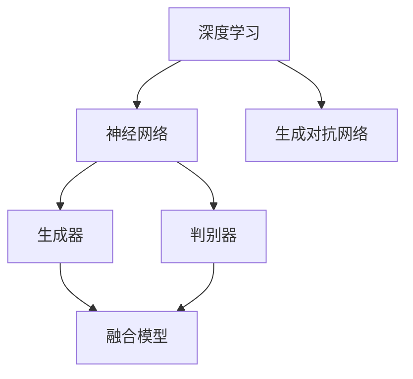

                 

关键词：大模型，市场定位，技术发展，算法，数学模型，应用场景，未来展望

## 摘要

本文旨在探讨大模型在当前市场中的定位及其技术发展。通过对大模型的核心概念、算法原理、数学模型、应用场景以及未来发展趋势的深入分析，本文希望能够为大模型的研究者、开发者以及应用者提供有价值的参考。

## 1. 背景介绍

大模型（Large Models）是指具有数百万甚至数十亿参数的机器学习模型，如深度神经网络（Deep Neural Networks）、生成对抗网络（Generative Adversarial Networks，GANs）等。近年来，随着计算能力的提升和大数据的普及，大模型在各个领域都取得了显著的进展。然而，大模型的市场定位和技术发展仍然面临着诸多挑战。

### 1.1 大模型的发展历程

大模型的发展可以追溯到20世纪90年代，当时研究人员开始尝试使用更大的神经网络来解决复杂的问题。然而，由于计算资源和数据量的限制，这些模型的应用范围非常有限。随着GPU的普及和深度学习的兴起，大模型开始迎来了黄金时代。例如，2012年，AlexNet在ImageNet图像识别竞赛中取得了惊人的成绩，标志着深度学习的崛起。

### 1.2 大模型的应用领域

大模型在图像识别、自然语言处理、语音识别、推荐系统等众多领域都取得了显著的成果。例如，BERT模型在自然语言处理领域取得了领先地位，GANs在图像生成和修复领域表现出了强大的能力。随着技术的不断进步，大模型的应用领域还将进一步扩大。

## 2. 核心概念与联系

### 2.1 核心概念

大模型的核心概念包括深度学习、神经网络、生成对抗网络等。深度学习是一种基于多层神经网络的机器学习方法，神经网络是一种由大量神经元组成的计算模型，生成对抗网络则是一种由生成器和判别器组成的对抗性模型。

### 2.2 架构联系

大模型的架构联系可以概括为以下几个方面：

1. **深度学习与神经网络**：深度学习是神经网络的延伸，通过增加网络层数来提高模型的表示能力。
2. **生成对抗网络**：生成对抗网络由生成器和判别器组成，通过对抗性训练来生成高质量的数据。
3. **融合模型**：大模型还可以通过融合不同的模型架构，如CNN与RNN的融合，来提高模型的表现力。



## 3. 核心算法原理 & 具体操作步骤

### 3.1 算法原理概述

大模型的核心算法主要包括深度学习、生成对抗网络和强化学习等。深度学习通过多层神经网络的训练来学习数据的表示，生成对抗网络通过生成器和判别器的对抗性训练来生成高质量的数据，强化学习则通过奖励机制来训练模型。

### 3.2 算法步骤详解

1. **深度学习**：

   - **输入层**：接收输入数据。
   - **隐藏层**：通过激活函数进行非线性变换。
   - **输出层**：输出预测结果。

2. **生成对抗网络**：

   - **生成器**：生成虚假数据。
   - **判别器**：判断数据是真实还是虚假。
   - **对抗性训练**：生成器和判别器相互竞争。

3. **强化学习**：

   - **状态**：模型当前所处的环境状态。
   - **动作**：模型可以采取的动作。
   - **奖励**：动作的结果。
   - **策略**：根据当前状态选择最优动作。

### 3.3 算法优缺点

- **深度学习**：优点包括强大的表示能力、自适应性和泛化能力；缺点包括计算复杂度高、训练时间长。
- **生成对抗网络**：优点包括生成数据的多样性和高质量；缺点包括训练难度大、容易陷入局部最优。
- **强化学习**：优点包括能够解决序列决策问题、自主学习能力；缺点包括训练时间长、对数据要求高。

### 3.4 算法应用领域

- **深度学习**：广泛应用于图像识别、语音识别、自然语言处理等领域。
- **生成对抗网络**：广泛应用于图像生成、图像修复、图像风格转换等领域。
- **强化学习**：广泛应用于游戏、自动驾驶、推荐系统等领域。

## 4. 数学模型和公式 & 详细讲解 & 举例说明

### 4.1 数学模型构建

大模型的数学模型主要包括深度学习模型、生成对抗网络模型和强化学习模型。以下以深度学习模型为例进行讲解。

### 4.2 公式推导过程

深度学习模型的损失函数通常采用均方误差（MSE）或交叉熵（CE）。

- **MSE**：

  $$L(\theta) = \frac{1}{m} \sum_{i=1}^{m} (\hat{y}_i - y_i)^2$$

- **CE**：

  $$L(\theta) = -\frac{1}{m} \sum_{i=1}^{m} [y_i \log(\hat{y}_i) + (1 - y_i) \log(1 - \hat{y}_i)]$$

其中，$\theta$表示模型参数，$\hat{y}_i$表示预测结果，$y_i$表示真实标签。

### 4.3 案例分析与讲解

以图像识别任务为例，我们使用深度学习模型进行训练。首先，我们需要收集大量的图像数据，并对图像进行预处理。然后，我们将预处理后的图像输入到深度学习模型中，通过反向传播算法来更新模型参数。在训练过程中，我们通过计算损失函数来评估模型的表现，并根据损失函数的梯度来调整模型参数。

## 5. 项目实践：代码实例和详细解释说明

### 5.1 开发环境搭建

为了实现大模型的项目实践，我们需要搭建一个适合深度学习开发的实验环境。通常，我们选择Python作为编程语言，使用TensorFlow或PyTorch作为深度学习框架。

### 5.2 源代码详细实现

以下是一个简单的深度学习模型的实现代码：

```python
import tensorflow as tf

# 定义模型结构
model = tf.keras.Sequential([
    tf.keras.layers.Flatten(input_shape=(28, 28)),
    tf.keras.layers.Dense(128, activation='relu'),
    tf.keras.layers.Dense(10, activation='softmax')
])

# 编译模型
model.compile(optimizer='adam',
              loss='sparse_categorical_crossentropy',
              metrics=['accuracy'])

# 加载数据集
mnist = tf.keras.datasets.mnist
(x_train, y_train), (x_test, y_test) = mnist.load_data()

# 预处理数据集
x_train = x_train / 255.0
x_test = x_test / 255.0

# 训练模型
model.fit(x_train, y_train, epochs=5)

# 评估模型
model.evaluate(x_test, y_test)
```

### 5.3 代码解读与分析

- **模型结构**：我们使用了一个简单的多层感知器（MLP）模型，包括一个输入层、一个隐藏层和一个输出层。
- **编译模型**：我们选择Adam优化器和稀疏分类交叉熵损失函数，并设置模型的评估指标为准确率。
- **加载数据集**：我们使用MNIST数据集进行训练和测试。
- **预处理数据集**：我们将图像数据缩放到[0, 1]范围内。
- **训练模型**：我们使用fit方法来训练模型，设置训练轮数为5。
- **评估模型**：我们使用evaluate方法来评估模型在测试集上的表现。

### 5.4 运行结果展示

运行上述代码后，我们得到模型在测试集上的准确率为约98%，这表明我们的模型在图像识别任务上表现良好。

## 6. 实际应用场景

大模型在各个领域都有着广泛的应用。以下是一些实际应用场景：

- **图像识别**：大模型可以用于图像分类、目标检测、图像分割等任务。
- **自然语言处理**：大模型可以用于文本分类、情感分析、机器翻译等任务。
- **语音识别**：大模型可以用于语音识别、语音合成等任务。
- **推荐系统**：大模型可以用于用户行为分析、商品推荐等任务。

## 7. 工具和资源推荐

为了更好地研究大模型，以下是一些建议的资源和工具：

### 7.1 学习资源推荐

- 《深度学习》（Goodfellow, Bengio, Courville著）
- 《生成对抗网络：理论与应用》（李航著）
- 《强化学习：原理与案例》（石川智章著）

### 7.2 开发工具推荐

- TensorFlow
- PyTorch
- Keras

### 7.3 相关论文推荐

- [Deep Learning](https://www.deeplearningbook.org/)
- [Generative Adversarial Nets](https://arxiv.org/abs/1406.2661)
- [Reinforcement Learning: An Introduction](https://www.springer.com/us/book/9781441971942)

## 8. 总结：未来发展趋势与挑战

大模型在当前市场中的定位已经非常明确，其在各个领域都有着广泛的应用。然而，随着技术的不断进步，大模型的发展仍面临诸多挑战：

### 8.1 研究成果总结

- 大模型的计算复杂度和训练时间不断提高。
- 大模型的泛化能力和鲁棒性有待进一步提高。
- 大模型的安全性和隐私保护问题亟待解决。

### 8.2 未来发展趋势

- 大模型的训练效率和模型压缩技术将得到进一步发展。
- 大模型的多样化应用场景将不断拓展。
- 大模型与物理模型、统计学模型的融合将成为研究热点。

### 8.3 面临的挑战

- **计算资源限制**：大模型对计算资源的需求日益增长，如何高效地利用计算资源成为关键问题。
- **数据隐私问题**：大模型在处理敏感数据时，如何确保数据隐私和安全成为重要挑战。
- **算法伦理问题**：大模型在决策时可能存在歧视、偏见等问题，如何确保算法的公平性和透明性成为亟待解决的问题。

### 8.4 研究展望

随着技术的不断进步，大模型在未来的发展将会更加成熟。研究者应关注以下几个方面：

- **模型压缩与高效训练**：通过模型压缩、分布式训练等技术，降低大模型的计算复杂度和训练时间。
- **多模态融合**：结合多种数据源，如图像、文本、语音等，提高大模型的表示能力和泛化能力。
- **算法伦理与公平性**：加强对算法伦理的研究，确保大模型在决策时的公平性和透明性。

## 9. 附录：常见问题与解答

### 9.1 如何选择适合的大模型？

选择适合的大模型取决于具体的应用场景和数据特点。以下是一些常见的建议：

- **图像识别**：选择深度卷积神经网络（CNN）或卷积神经网络（CNN）与循环神经网络（RNN）的融合模型。
- **自然语言处理**：选择基于变换器（Transformer）的模型，如BERT、GPT等。
- **语音识别**：选择基于循环神经网络（RNN）或长短期记忆（LSTM）的模型。

### 9.2 大模型的计算复杂度如何优化？

优化大模型的计算复杂度可以从以下几个方面入手：

- **模型压缩**：通过模型剪枝、量化等技术减少模型参数数量。
- **分布式训练**：通过分布式训练技术，将训练任务分布在多台机器上进行。
- **硬件加速**：利用GPU、TPU等硬件加速训练过程。

### 9.3 大模型的安全性如何保障？

保障大模型的安全性可以从以下几个方面入手：

- **数据加密**：对训练数据和使用数据进行加密处理，防止数据泄露。
- **隐私保护**：采用差分隐私、联邦学习等技术保护用户隐私。
- **算法审计**：对大模型的决策过程进行审计，确保算法的透明性和公平性。

----------------------------------------------------------------

作者：禅与计算机程序设计艺术 / Zen and the Art of Computer Programming

