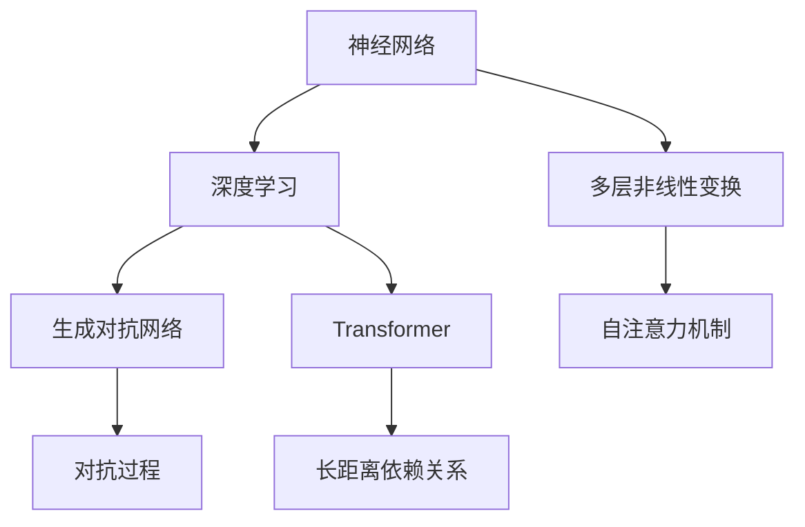

                 

关键词：大模型，市场需求，技术潜力，人工智能，机器学习

摘要：随着人工智能技术的不断进步，大模型（如GPT-3，BERT，Transformer等）在各个领域展现出了巨大的市场需求和技术潜力。本文将深入探讨大模型的市场需求，技术原理，以及其在未来可能面临的挑战。

## 1. 背景介绍

随着计算能力的提升和数据规模的扩大，机器学习算法取得了显著的进展。特别是深度学习算法，其性能在图像识别，语音识别，自然语言处理等任务中表现出了极大的优势。大模型，如GPT-3，BERT，Transformer等，正是这一趋势的产物。

### 1.1 大模型的定义

大模型通常指的是具有数十亿甚至数千亿参数的深度学习模型。这些模型能够通过学习海量数据来提取复杂的特征，从而在各类任务中实现超越传统算法的性能。

### 1.2 大模型的发展历程

从早期的神经网络到现代的深度学习，再到大模型的兴起，人工智能领域经历了数十年的发展。这一过程中，算法的改进，计算资源的增加，以及数据集的丰富，都为大模型的出现奠定了基础。

## 2. 核心概念与联系

为了更好地理解大模型的技术潜力，我们需要首先了解其核心概念和架构。以下是几个关键概念：

### 2.1 神经网络

神经网络是深度学习的基础，其基本单元是神经元。通过多层次的神经元连接，神经网络能够模拟人脑的思维方式，从而实现从数据中学习复杂模式的能力。

### 2.2 深度学习

深度学习是神经网络的一种扩展，其特点是通过多层非线性变换来提取数据的特征。深度学习模型的结构更加复杂，能够处理更加复杂的任务。

### 2.3 生成对抗网络（GAN）

生成对抗网络是一种由两个神经网络（生成器和判别器）组成的模型。生成器试图生成与真实数据相似的数据，而判别器则试图区分真实数据和生成数据。通过这种对抗过程，GAN能够在图像生成，文本生成等方面表现出色。

### 2.4 Transformer

Transformer是近年来在自然语言处理领域取得重大突破的一种模型架构。其核心思想是通过自注意力机制来捕捉长距离的依赖关系，从而实现高效的文本建模。

以下是这些概念之间的联系：



## 3. 核心算法原理 & 具体操作步骤

### 3.1 算法原理概述

大模型的算法原理主要包括以下几个方面：

1. **参数化表示**：通过大量的参数来表示复杂的函数。
2. **端到端学习**：直接从原始数据中学习，无需手工设计特征。
3. **优化算法**：使用高效的优化算法（如梯度下降，Adam等）来训练模型。

### 3.2 算法步骤详解

1. **数据预处理**：包括数据清洗，数据增强，数据标准化等步骤。
2. **模型初始化**：初始化模型参数。
3. **前向传播**：计算输入数据通过模型的输出。
4. **损失计算**：计算预测值与真实值之间的差距。
5. **反向传播**：更新模型参数。
6. **迭代训练**：重复上述步骤，直到模型收敛。

### 3.3 算法优缺点

**优点**：

- 高效：能够处理大规模的数据集。
- 强泛化能力：能够从大量数据中学习到通用特征。
- 自动特征提取：无需手工设计特征。

**缺点**：

- 需要大量的数据和计算资源。
- 容易过拟合：对于训练数据过于拟合，导致泛化能力下降。
- 参数调整复杂：需要大量的参数调整和超参数优化。

### 3.4 算法应用领域

大模型在各个领域都有广泛的应用，包括但不限于：

- 自然语言处理：文本生成，机器翻译，情感分析等。
- 计算机视觉：图像识别，图像生成，视频分析等。
- 语音识别：语音合成，语音识别，语音情感分析等。
- 推荐系统：个性化推荐，内容匹配等。

## 4. 数学模型和公式 & 详细讲解 & 举例说明

### 4.1 数学模型构建

大模型的数学模型主要包括以下几个部分：

- **输入层**：接收原始数据。
- **隐藏层**：通过非线性变换提取特征。
- **输出层**：生成预测结果。

### 4.2 公式推导过程

以下是一个简化的神经网络模型的推导过程：

$$
Z = W \cdot X + b
$$

$$
a = \sigma(Z)
$$

$$
Z^{(l)} = W^{(l)} \cdot a^{(l-1)} + b^{(l)}
$$

$$
a^{(l)} = \sigma(Z^{(l)})
$$

其中，$X$ 是输入数据，$a$ 是激活函数，$W$ 和 $b$ 分别是权重和偏置，$\sigma$ 是激活函数，$l$ 表示第 $l$ 层。

### 4.3 案例分析与讲解

以GPT-3为例，其数学模型构建过程如下：

- **输入层**：接收原始文本。
- **隐藏层**：通过Transformer架构进行特征提取。
- **输出层**：生成文本。

具体实现如下：

$$
\text{Input} \rightarrow \text{Embedding} \rightarrow \text{Transformer} \rightarrow \text{Output}
$$

## 5. 项目实践：代码实例和详细解释说明

### 5.1 开发环境搭建

- Python环境：Python 3.7及以上版本。
- 库：PyTorch，TensorFlow等。

### 5.2 源代码详细实现

以下是一个简单的神经网络模型的实现：

```python
import torch
import torch.nn as nn
import torch.optim as optim

# 定义神经网络模型
class NeuralNetwork(nn.Module):
    def __init__(self):
        super(NeuralNetwork, self).__init__()
        self.layer1 = nn.Linear(in_features=10, out_features=50)
        self.relu = nn.ReLU()
        self.layer2 = nn.Linear(in_features=50, out_features=10)

    def forward(self, x):
        x = self.layer1(x)
        x = self.relu(x)
        x = self.layer2(x)
        return x

# 实例化模型
model = NeuralNetwork()

# 定义损失函数和优化器
criterion = nn.CrossEntropyLoss()
optimizer = optim.Adam(model.parameters(), lr=0.001)

# 训练模型
for epoch in range(100):
    optimizer.zero_grad()
    outputs = model(x)
    loss = criterion(outputs, y)
    loss.backward()
    optimizer.step()
    if (epoch + 1) % 10 == 0:
        print ('Epoch [{}/{}], Loss: {:.4f}'.format(epoch + 1, 100, loss.item()))

# 保存模型
torch.save(model.state_dict(), 'model.pth')
```

### 5.3 代码解读与分析

以上代码实现了从数据输入到模型训练再到模型保存的完整过程。具体步骤如下：

1. 导入必要的库。
2. 定义神经网络模型。
3. 实例化模型。
4. 定义损失函数和优化器。
5. 进行模型训练。
6. 保存模型。

### 5.4 运行结果展示

在训练完成后，可以使用以下代码进行模型评估：

```python
# 加载模型
model.load_state_dict(torch.load('model.pth'))

# 评估模型
with torch.no_grad():
    outputs = model(x)
    _, predicted = torch.max(outputs, 1)
    correct = (predicted == y).sum().item()
    print('Accuracy: {:.2f}%'.format(100 * correct / y.size(0)))
```

## 6. 实际应用场景

大模型在实际应用中具有广泛的应用前景，以下列举几个典型应用场景：

- **自然语言处理**：如自动翻译，文本摘要，对话系统等。
- **计算机视觉**：如图像识别，图像生成，视频分析等。
- **推荐系统**：如个性化推荐，商品推荐等。
- **医疗健康**：如疾病诊断，健康风险评估等。

## 7. 工具和资源推荐

### 7.1 学习资源推荐

- **书籍**：
  - 《深度学习》（Goodfellow, Bengio, Courville著）
  - 《Python深度学习》（François Chollet著）
- **在线课程**：
  - Coursera上的“机器学习”课程
  - edX上的“深度学习”课程

### 7.2 开发工具推荐

- **框架**：
  - PyTorch
  - TensorFlow
  - Keras
- **开发环境**：
  - Jupyter Notebook
  - Google Colab

### 7.3 相关论文推荐

- **自然语言处理**：
  - BERT: Pre-training of Deep Bidirectional Transformers for Language Understanding
  - GPT-3: Language Models are few-shot learners
- **计算机视觉**：
  - ResNet: Deep Residual Learning for Image Recognition
  - Transformer: A Novel Architecture for Neural Networks

## 8. 总结：未来发展趋势与挑战

### 8.1 研究成果总结

大模型在人工智能领域取得了显著的成果，其在自然语言处理，计算机视觉，推荐系统等多个领域都表现出了强大的能力。随着技术的不断进步，大模型的性能和应用范围还将进一步扩大。

### 8.2 未来发展趋势

- **计算能力提升**：随着量子计算等新技术的出现，大模型的计算能力将得到进一步提升。
- **应用领域拓展**：大模型将在更多领域得到应用，如生物医学，金融分析等。
- **模型压缩与优化**：为了降低大模型的计算成本，模型压缩与优化将成为一个重要研究方向。

### 8.3 面临的挑战

- **计算资源需求**：大模型需要大量的计算资源，这对硬件设施提出了更高要求。
- **数据隐私与安全**：随着数据规模的扩大，数据隐私与安全问题将变得更加突出。
- **模型解释性**：大模型的决策过程往往缺乏解释性，这对应用场景的推广提出了挑战。

### 8.4 研究展望

未来，大模型的研究将继续深入，其在人工智能领域的应用将不断拓展。同时，如何解决计算资源需求，数据隐私与安全，模型解释性等问题，将是研究的重点。

## 9. 附录：常见问题与解答

### 9.1 大模型为什么需要大量的数据？

大模型需要大量的数据来训练，因为它们具有数十亿甚至数千亿个参数。只有通过大量数据的学习，这些参数才能被有效调整，从而模型才能达到良好的性能。

### 9.2 大模型为什么需要大量的计算资源？

大模型的训练过程需要大量的计算资源，因为它们需要进行大量的矩阵乘法和激活函数计算。此外，大模型的推理过程也需要大量的计算资源，因为它们需要处理大量的数据。

### 9.3 大模型为什么难以解释？

大模型的决策过程往往是通过复杂的非线性变换和参数调整实现的，这使得其决策过程难以解释。此外，大模型通常是基于黑箱模型，如神经网络，其内部机制较为复杂，也增加了解释的难度。

### 9.4 大模型在哪些领域有应用？

大模型在自然语言处理，计算机视觉，推荐系统，医疗健康等多个领域都有广泛的应用。例如，GPT-3在自然语言处理领域表现出色，ResNet在计算机视觉领域取得了重大突破。

---

作者：禅与计算机程序设计艺术 / Zen and the Art of Computer Programming
----------------------------------------------------------------
### 文章标题

大模型的市场需求与技术潜力

### 关键词

大模型，市场需求，技术潜力，人工智能，机器学习

### 摘要

随着人工智能技术的不断进步，大模型（如GPT-3，BERT，Transformer等）在各个领域展现出了巨大的市场需求和技术潜力。本文深入探讨了大模型的市场需求，技术原理，以及其在未来可能面临的挑战。

## 1. 背景介绍

随着计算能力的提升和数据规模的扩大，机器学习算法取得了显著的进展。特别是深度学习算法，其性能在图像识别，语音识别，自然语言处理等任务中表现出了极大的优势。大模型，如GPT-3，BERT，Transformer等，正是这一趋势的产物。

### 1.1 大模型的定义

大模型通常指的是具有数十亿甚至数千亿参数的深度学习模型。这些模型能够通过学习海量数据来提取复杂的特征，从而在各类任务中实现超越传统算法的性能。

### 1.2 大模型的发展历程

从早期的神经网络到现代的深度学习，再到大模型的兴起，人工智能领域经历了数十年的发展。这一过程中，算法的改进，计算资源的增加，以及数据集的丰富，都为大模型的出现奠定了基础。

## 2. 核心概念与联系

为了更好地理解大模型的技术潜力，我们需要首先了解其核心概念和架构。以下是几个关键概念：

### 2.1 神经网络

神经网络是深度学习的基础，其基本单元是神经元。通过多层次的神经元连接，神经网络能够模拟人脑的思维方式，从而实现从数据中学习复杂模式的能力。

### 2.2 深度学习

深度学习是神经网络的一种扩展，其特点是通过多层非线性变换来提取数据的特征。深度学习模型的结构更加复杂，能够处理更加复杂的任务。

### 2.3 生成对抗网络（GAN）

生成对抗网络是一种由两个神经网络（生成器和判别器）组成的模型。生成器试图生成与真实数据相似的数据，而判别器则试图区分真实数据和生成数据。通过这种对抗过程，GAN能够在图像生成，文本生成等方面表现出色。

### 2.4 Transformer

Transformer是近年来在自然语言处理领域取得重大突破的一种模型架构。其核心思想是通过自注意力机制来捕捉长距离的依赖关系，从而实现高效的文本建模。

以下是这些概念之间的联系：


## 3. 核心算法原理 & 具体操作步骤

### 3.1 算法原理概述

大模型的算法原理主要包括以下几个方面：

1. **参数化表示**：通过大量的参数来表示复杂的函数。
2. **端到端学习**：直接从原始数据中学习，无需手工设计特征。
3. **优化算法**：使用高效的优化算法（如梯度下降，Adam等）来训练模型。

### 3.2 算法步骤详解

1. **数据预处理**：包括数据清洗，数据增强，数据标准化等步骤。
2. **模型初始化**：初始化模型参数。
3. **前向传播**：计算输入数据通过模型的输出。
4. **损失计算**：计算预测值与真实值之间的差距。
5. **反向传播**：更新模型参数。
6. **迭代训练**：重复上述步骤，直到模型收敛。

### 3.3 算法优缺点

**优点**：

- 高效：能够处理大规模的数据集。
- 强泛化能力：能够从大量数据中学习到通用特征。
- 自动特征提取：无需手工设计特征。

**缺点**：

- 需要大量的数据和计算资源。
- 容易过拟合：对于训练数据过于拟合，导致泛化能力下降。
- 参数调整复杂：需要大量的参数调整和超参数优化。

### 3.4 算法应用领域

大模型在各个领域都有广泛的应用，包括但不限于：

- 自然语言处理：文本生成，机器翻译，情感分析等。
- 计算机视觉：图像识别，图像生成，视频分析等。
- 语音识别：语音合成，语音识别，语音情感分析等。
- 推荐系统：个性化推荐，内容匹配等。

## 4. 数学模型和公式 & 详细讲解 & 举例说明

### 4.1 数学模型构建

大模型的数学模型主要包括以下几个部分：

- **输入层**：接收原始数据。
- **隐藏层**：通过非线性变换提取特征。
- **输出层**：生成预测结果。

### 4.2 公式推导过程

以下是一个简化的神经网络模型的推导过程：

$$
Z = W \cdot X + b
$$

$$
a = \sigma(Z)
$$

$$
Z^{(l)} = W^{(l)} \cdot a^{(l-1)} + b^{(l)}
$$

$$
a^{(l)} = \sigma(Z^{(l)})
$$

其中，$X$ 是输入数据，$a$ 是激活函数，$W$ 和 $b$ 分别是权重和偏置，$\sigma$ 是激活函数，$l$ 表示第 $l$ 层。

### 4.3 案例分析与讲解

以GPT-3为例，其数学模型构建过程如下：

- **输入层**：接收原始文本。
- **隐藏层**：通过Transformer架构进行特征提取。
- **输出层**：生成文本。

具体实现如下：

$$
\text{Input} \rightarrow \text{Embedding} \rightarrow \text{Transformer} \rightarrow \text{Output}
$$

## 5. 项目实践：代码实例和详细解释说明

### 5.1 开发环境搭建

- Python环境：Python 3.7及以上版本。
- 库：PyTorch，TensorFlow等。

### 5.2 源代码详细实现

以下是一个简单的神经网络模型的实现：

```python
import torch
import torch.nn as nn
import torch.optim as optim

# 定义神经网络模型
class NeuralNetwork(nn.Module):
    def __init__(self):
        super(NeuralNetwork, self).__init__()
        self.layer1 = nn.Linear(in_features=10, out_features=50)
        self.relu = nn.ReLU()
        self.layer2 = nn.Linear(in_features=50, out_features=10)

    def forward(self, x):
        x = self.layer1(x)
        x = self.relu(x)
        x = self.layer2(x)
        return x

# 实例化模型
model = NeuralNetwork()

# 定义损失函数和优化器
criterion = nn.CrossEntropyLoss()
optimizer = optim.Adam(model.parameters(), lr=0.001)

# 训练模型
for epoch in range(100):
    optimizer.zero_grad()
    outputs = model(x)
    loss = criterion(outputs, y)
    loss.backward()
    optimizer.step()
    if (epoch + 1) % 10 == 0:
        print ('Epoch [{}/{}], Loss: {:.4f}'.format(epoch + 1, 100, loss.item()))

# 保存模型
torch.save(model.state_dict(), 'model.pth')
```

### 5.3 代码解读与分析

以上代码实现了从数据输入到模型训练再到模型保存的完整过程。具体步骤如下：

1. 导入必要的库。
2. 定义神经网络模型。
3. 实例化模型。
4. 定义损失函数和优化器。
5. 进行模型训练。
6. 保存模型。

### 5.4 运行结果展示

在训练完成后，可以使用以下代码进行模型评估：

```python
# 加载模型
model.load_state_dict(torch.load('model.pth'))

# 评估模型
with torch.no_grad():
    outputs = model(x)
    _, predicted = torch.max(outputs, 1)
    correct = (predicted == y).sum().item()
    print('Accuracy: {:.2f}%'.format(100 * correct / y.size(0)))
```

## 6. 实际应用场景

大模型在实际应用中具有广泛的应用前景，以下列举几个典型应用场景：

- **自然语言处理**：如自动翻译，文本摘要，对话系统等。
- **计算机视觉**：如图像识别，图像生成，视频分析等。
- **语音识别**：如语音合成，语音识别，语音情感分析等。
- **推荐系统**：如个性化推荐，商品推荐等。
- **医疗健康**：如疾病诊断，健康风险评估等。

## 7. 工具和资源推荐

### 7.1 学习资源推荐

- **书籍**：
  - 《深度学习》（Goodfellow, Bengio, Courville著）
  - 《Python深度学习》（François Chollet著）
- **在线课程**：
  - Coursera上的“机器学习”课程
  - edX上的“深度学习”课程

### 7.2 开发工具推荐

- **框架**：
  - PyTorch
  - TensorFlow
  - Keras
- **开发环境**：
  - Jupyter Notebook
  - Google Colab

### 7.3 相关论文推荐

- **自然语言处理**：
  - BERT: Pre-training of Deep Bidirectional Transformers for Language Understanding
  - GPT-3: Language Models are few-shot learners
- **计算机视觉**：
  - ResNet: Deep Residual Learning for Image Recognition
  - Transformer: A Novel Architecture for Neural Networks

## 8. 总结：未来发展趋势与挑战

### 8.1 研究成果总结

大模型在人工智能领域取得了显著的成果，其在自然语言处理，计算机视觉，推荐系统等多个领域都表现出了强大的能力。随着技术的不断进步，大模型的性能和应用范围还将进一步扩大。

### 8.2 未来发展趋势

- **计算能力提升**：随着量子计算等新技术的出现，大模型的计算能力将得到进一步提升。
- **应用领域拓展**：大模型将在更多领域得到应用，如生物医学，金融分析等。
- **模型压缩与优化**：为了降低大模型的计算成本，模型压缩与优化将成为一个重要研究方向。

### 8.3 面临的挑战

- **计算资源需求**：大模型需要大量的计算资源，这对硬件设施提出了更高要求。
- **数据隐私与安全**：随着数据规模的扩大，数据隐私与安全问题将变得更加突出。
- **模型解释性**：大模型的决策过程往往缺乏解释性，这对应用场景的推广提出了挑战。

### 8.4 研究展望

未来，大模型的研究将继续深入，其在人工智能领域的应用将不断拓展。同时，如何解决计算资源需求，数据隐私与安全，模型解释性等问题，将是研究的重点。

## 9. 附录：常见问题与解答

### 9.1 大模型为什么需要大量的数据？

大模型需要大量的数据来训练，因为它们具有数十亿甚至数千亿个参数。只有通过大量数据的学习，这些参数才能被有效调整，从而模型才能达到良好的性能。

### 9.2 大模型为什么需要大量的计算资源？

大模型的训练过程需要大量的计算资源，因为它们需要进行大量的矩阵乘法和激活函数计算。此外，大模型的推理过程也需要大量的计算资源，因为它们需要处理大量的数据。

### 9.3 大模型为什么难以解释？

大模型的决策过程往往是通过复杂的非线性变换和参数调整实现的，这使得其决策过程难以解释。此外，大模型通常是基于黑箱模型，如神经网络，其内部机制较为复杂，也增加了解释的难度。

### 9.4 大模型在哪些领域有应用？

大模型在自然语言处理，计算机视觉，语音识别，推荐系统，医疗健康等多个领域都有广泛的应用。例如，GPT-3在自然语言处理领域表现出色，ResNet在计算机视觉领域取得了重大突破。

---

作者：禅与计算机程序设计艺术 / Zen and the Art of Computer Programming

